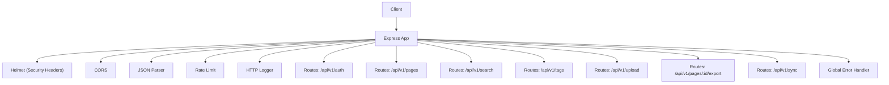
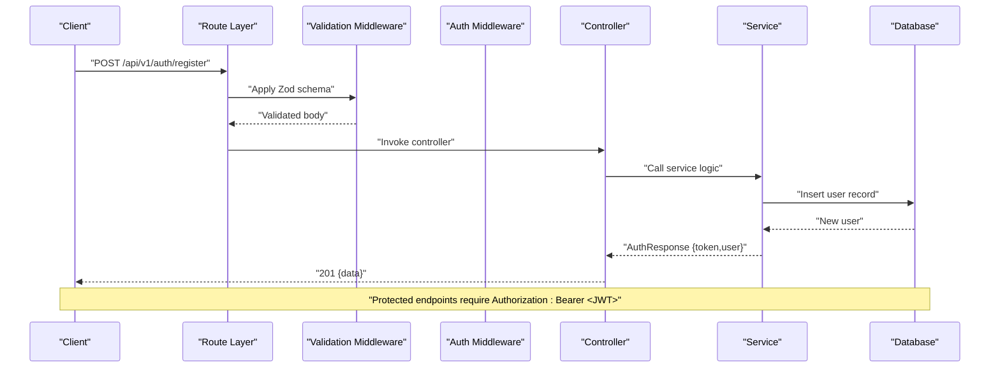
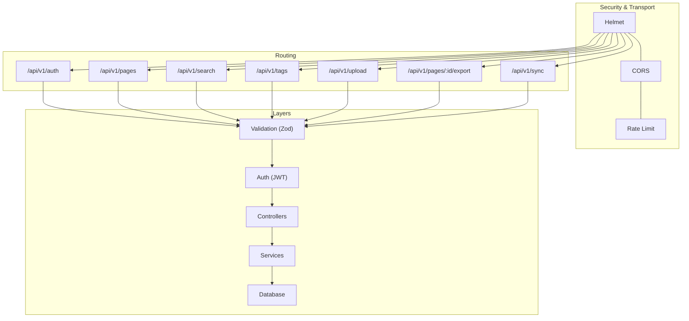
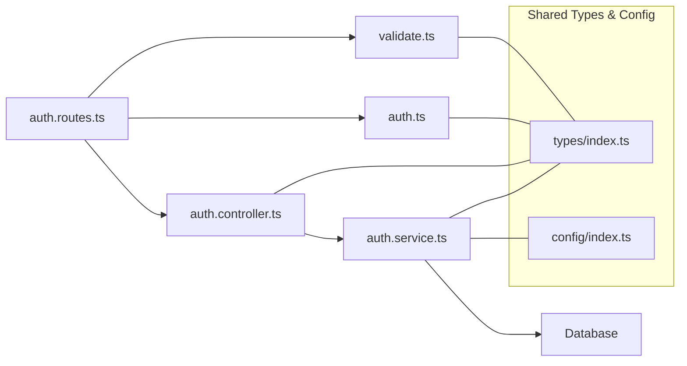

# API Reference

<cite>
**Referenced Files in This Document**
- [API-SPEC.md](file://api-spec/API-SPEC.md)
- [ARCHITECTURE.md](file://arch/ARCHITECTURE.md)
- [auth.routes.ts](file://code/server/src/routes/auth.routes.ts)
- [auth.controller.ts](file://code/server/src/controllers/auth.controller.ts)
- [auth.service.ts](file://code/server/src/services/auth.service.ts)
- [auth.ts](file://code/server/src/middleware/auth.ts)
- [validate.ts](file://code/server/src/middleware/validate.ts)
- [errorHandler.ts](file://code/server/src/middleware/errorHandler.ts)
- [app.ts](file://code/server/src/app.ts)
- [index.ts](file://code/server/src/index.ts)
- [index.ts](file://code/server/src/types/index.ts)
- [index.ts](file://code/server/src/config/index.ts)
</cite>

## Table of Contents
1. [Introduction](#introduction)
2. [Project Structure](#project-structure)
3. [Core Components](#core-components)
4. [Architecture Overview](#architecture-overview)
5. [Detailed Component Analysis](#detailed-component-analysis)
6. [Dependency Analysis](#dependency-analysis)
7. [Performance Considerations](#performance-considerations)
8. [Troubleshooting Guide](#troubleshooting-guide)
9. [Conclusion](#conclusion)
10. [Appendices](#appendices)

## Introduction
This document provides a comprehensive API reference for Yule Notion’s RESTful backend. It covers authentication endpoints, page management, search, tags, uploads, exports, and synchronization. For each endpoint, you will find HTTP methods, URL patterns, request/response schemas, authentication requirements, error responses, validation rules, and pagination/filtering/sorting/search capabilities. It also documents the API versioning strategy, rate limiting policies, and security considerations, along with client integration patterns and example requests/responses.

## Project Structure
The server is implemented as an Express application with a layered architecture:
- Middleware: authentication, validation, error handling, logging, and rate limiting
- Routes: resource-specific routing definitions
- Controllers: request handling and response formatting
- Services: business logic and database operations
- Types and Config: shared types, error enums, and environment configuration

**Diagram sources**
- [app.ts:54-121](file://code/server/src/app.ts#L54-L121)
- [auth.routes.ts:20-106](file://code/server/src/routes/auth.routes.ts#L20-L106)

**Section sources**
- [ARCHITECTURE.md:238-286](file://arch/ARCHITECTURE.md#L238-L286)
- [app.ts:54-121](file://code/server/src/app.ts#L54-L121)

## Core Components
- Authentication middleware validates JWT Bearer tokens and injects user info into requests.
- Validation middleware enforces Zod schemas for request bodies and converts errors to a unified format.
- Global error handler ensures consistent error responses and logs failures.
- Health check endpoint is exposed at GET /api/v1/health.

Key behaviors:
- Versioning: Base URL is /api/v1 with resource paths under this prefix.
- Authentication: Authorization: Bearer <JWT> header required for protected endpoints.
- Pagination: Standardized via page and pageSize query parameters.
- Errors: Unified error envelope with code, message, and optional details.

**Section sources**
- [auth.ts:29-60](file://code/server/src/middleware/auth.ts#L29-L60)
- [validate.ts:31-72](file://code/server/src/middleware/validate.ts#L31-L72)
- [errorHandler.ts:29-68](file://code/server/src/middleware/errorHandler.ts#L29-L68)
- [app.ts:102-104](file://code/server/src/app.ts#L102-L104)
- [API-SPEC.md:16-52](file://api-spec/API-SPEC.md#L16-L52)

## Architecture Overview
The API follows RESTful conventions with explicit versioning and consistent response/error schemas. Security is enforced via helmet, CORS, JWT, and rate limiting. Logging and centralized error handling improve observability and reliability.

**Diagram sources**
- [auth.routes.ts:77-81](file://code/server/src/routes/auth.routes.ts#L77-L81)
- [auth.controller.ts:26-36](file://code/server/src/controllers/auth.controller.ts#L26-L36)
- [auth.service.ts:68-101](file://code/server/src/services/auth.service.ts#L68-L101)
- [validate.ts:44-50](file://code/server/src/middleware/validate.ts#L44-L50)
- [auth.ts:49-51](file://code/server/src/middleware/auth.ts#L49-L51)

## Detailed Component Analysis

### Authentication Endpoints
- Base Path: /api/v1/auth
- Authentication: None for registration/login; required for /me

Endpoints:
- POST /api/v1/auth/register
  - Purpose: User registration
  - Auth: None
  - Request body fields:
    - email: string, required, valid email, max length 254
    - password: string, required, min length 8, must include lowercase, uppercase, and digit
    - name: string, required, min length 1, max length 50
  - Response: 201 with data.token and data.user
  - Errors: 400 (validation), 409 (EMAIL_ALREADY_EXISTS)

- POST /api/v1/auth/login
  - Purpose: User login
  - Auth: None
  - Request body fields:
    - email: string, required, valid email
    - password: string, required, non-empty
  - Response: 200 with data.token and data.user
  - Errors: 400 (validation), 401 (INVALID_CREDENTIALS)

- GET /api/v1/auth/me
  - Purpose: Get current user profile
  - Auth: Required (Bearer)
  - Response: 200 with data containing user info
  - Errors: 401 (UNAUTHORIZED/TOKEN_EXPIRED), 404 (RESOURCE_NOT_FOUND)

Validation and security:
- Request bodies validated with Zod schemas before controller invocation.
- JWT verification middleware extracts and validates token; invalid/expired tokens yield 401.
- Password hashing and secure token generation handled in service layer.

Example requests and responses:
- Registration request body schema and successful 201 response are defined in the API spec.
- Login request body schema and successful 200 response are defined in the API spec.
- Profile retrieval returns a safe user object without sensitive fields.

**Section sources**
- [auth.routes.ts:27-66](file://code/server/src/routes/auth.routes.ts#L27-L66)
- [auth.routes.ts:77-102](file://code/server/src/routes/auth.routes.ts#L77-L102)
- [auth.controller.ts:26-81](file://code/server/src/controllers/auth.controller.ts#L26-L81)
- [auth.service.ts:68-143](file://code/server/src/services/auth.service.ts#L68-L143)
- [auth.ts:29-60](file://code/server/src/middleware/auth.ts#L29-L60)
- [validate.ts:31-72](file://code/server/src/middleware/validate.ts#L31-L72)
- [API-SPEC.md:92-177](file://api-spec/API-SPEC.md#L92-L177)

### Page Management Endpoints
- Base Path: /api/v1/pages
- Authentication: Required (Bearer)

Endpoints:
- GET /api/v1/pages
  - Purpose: List pages
  - Query parameters:
    - tree: boolean, default false; true returns nested tree, false returns flat list
    - parentId: string, filter children of a given parent; null/root if omitted
    - includeDeleted: boolean, default false; only effective when tree=false
  - Response: 200 with data array (flat) or nested structure (tree=true); includes pagination metadata when applicable
  - Notes: Tree view excludes content/tags/timestamps for sidebar rendering

- POST /api/v1/pages
  - Purpose: Create a new page
  - Request body fields:
    - title: string, default "Untitled"
    - content: object (TipTap JSON), default empty doc
    - parentId: string|null, default null (root)
    - order: integer, default append to end
    - icon: string, default "📄"
  - Response: 201 with full page object including version and timestamps

- GET /api/v1/pages/:id
  - Purpose: Retrieve a single page
  - Path parameter: id (UUID)
  - Response: 200 with full page details
  - Errors: 404 (RESOURCE_NOT_FOUND), 403 (FORBIDDEN)

- PUT /api/v1/pages/:id
  - Purpose: Update a page (full replace; partial updates not supported)
  - Path parameter: id (UUID)
  - Request body fields:
    - title: string
    - content: object (TipTap JSON)
    - icon: string
  - Optimistic locking: If-Match header with version; mismatch yields 409 Conflict
  - Response: 200 with updated page object

- DELETE /api/v1/pages/:id
  - Purpose: Soft delete a page
  - Behavior: Sets is_deleted=true and deleted_at; recursive deletion for children
  - Response: 204 No Content

- PUT /api/v1/pages/:id/move
  - Purpose: Move a page to another parent and/or reorder
  - Request body fields:
    - parentId: string|null
    - order: integer
  - Validation rules: Cannot move a page under itself or its descendants; parentId must belong to current user
  - Response: 200 with updated page object

Pagination, filtering, sorting, and search:
- Pagination: Standardized via page and pageSize query parameters.
- Filtering: parentId and includeDeleted for GET /pages.
- Sorting: Order maintained by order field per sibling group.
- Search: Dedicated GET /api/v1/search endpoint supports keyword search across title and content.

**Section sources**
- [API-SPEC.md:183-416](file://api-spec/API-SPEC.md#L183-L416)

### Utility Endpoints
- GET /api/v1/health
  - Purpose: Health check
  - Response: 200 with status and timestamp
  - Auth: Not required

**Section sources**
- [app.ts:102-104](file://code/server/src/app.ts#L102-L104)

## Architecture Overview
The API adheres to RESTful conventions with explicit versioning (/api/v1) and consistent response/error schemas. Security is enforced via helmet, CORS, JWT, and rate limiting. Logging and centralized error handling improve observability and reliability.

**Diagram sources**
- [app.ts:67-104](file://code/server/src/app.ts#L67-L104)
- [auth.routes.ts:20-106](file://code/server/src/routes/auth.routes.ts#L20-L106)

## Detailed Component Analysis

### Authentication Endpoints
- POST /api/v1/auth/register
  - Request body fields:
    - email: string, required, valid email, max length 254
    - password: string, required, min length 8, must include lowercase, uppercase, and digit
    - name: string, required, min length 1, max length 50
  - Response: 201 with data.token and data.user
  - Errors: 400 (VALIDATION_ERROR), 409 (EMAIL_ALREADY_EXISTS)

- POST /api/v1/auth/login
  - Request body fields:
    - email: string, required, valid email
    - password: string, required, non-empty
  - Response: 200 with data.token and data.user
  - Errors: 400 (VALIDATION_ERROR), 401 (INVALID_CREDENTIALS)

- GET /api/v1/auth/me
  - Response: 200 with data.user
  - Errors: 401 (UNAUTHORIZED/TOKEN_EXPIRED), 404 (RESOURCE_NOT_FOUND)

Validation and security:
- Request bodies validated with Zod schemas before controller invocation.
- JWT verification middleware extracts and validates token; invalid/expired tokens yield 401.
- Password hashing and secure token generation handled in service layer.

**Section sources**
- [auth.routes.ts:27-66](file://code/server/src/routes/auth.routes.ts#L27-L66)
- [auth.controller.ts:26-81](file://code/server/src/controllers/auth.controller.ts#L26-L81)
- [auth.service.ts:68-143](file://code/server/src/services/auth.service.ts#L68-L143)
- [auth.ts:29-60](file://code/server/src/middleware/auth.ts#L29-L60)
- [validate.ts:31-72](file://code/server/src/middleware/validate.ts#L31-L72)
- [API-SPEC.md:92-177](file://api-spec/API-SPEC.md#L92-L177)

### Page Management Endpoints
- GET /api/v1/pages
  - Query parameters:
    - tree: boolean
    - parentId: string
    - includeDeleted: boolean
  - Response: 200 with data array or nested tree

- POST /api/v1/pages
  - Request body fields:
    - title: string
    - content: object (TipTap JSON)
    - parentId: string|null
    - order: integer
    - icon: string
  - Response: 201 with full page object

- GET /api/v1/pages/:id
  - Response: 200 with full page details
  - Errors: 404 (RESOURCE_NOT_FOUND), 403 (FORBIDDEN)

- PUT /api/v1/pages/:id
  - Request body fields:
    - title: string
    - content: object (TipTap JSON)
    - icon: string
  - Optimistic locking: If-Match header with version; mismatch yields 409 Conflict
  - Response: 200 with updated page object

- DELETE /api/v1/pages/:id
  - Behavior: Soft delete with recursion
  - Response: 204 No Content

- PUT /api/v1/pages/:id/move
  - Request body fields:
    - parentId: string|null
    - order: integer
  - Validation rules: No self/child cycles; parentId must belong to current user
  - Response: 200 with updated page object

Pagination, filtering, sorting, and search:
- Pagination: page and pageSize standardized.
- Filtering: parentId and includeDeleted for GET /pages.
- Sorting: order field per sibling group.
- Search: GET /api/v1/search supports keyword search across title and content.

**Section sources**
- [API-SPEC.md:183-416](file://api-spec/API-SPEC.md#L183-L416)

### Additional Modules (as defined in API spec)
- Search: GET /api/v1/search with q, pagination, and tagId filter
- Tags: CRUD and association endpoints
- Upload: POST /api/v1/upload/image with multipart/form-data
- Export: GET /api/v1/pages/:id/export with format=markdown|pdf
- Sync: Push changes and fetch incremental changes with conflict resolution

**Section sources**
- [API-SPEC.md:419-879](file://api-spec/API-SPEC.md#L419-L879)

## Dependency Analysis
The routing layer delegates to validation and authentication middleware before invoking controllers. Controllers delegate to services, which perform database operations. Errors are normalized by the global error handler.

**Diagram sources**
- [auth.routes.ts:10-14](file://code/server/src/routes/auth.routes.ts#L10-L14)
- [auth.controller.ts:14](file://code/server/src/controllers/auth.controller.ts#L14)
- [auth.service.ts:14-17](file://code/server/src/services/auth.service.ts#L14-L17)
- [auth.ts:10-14](file://code/server/src/middleware/auth.ts#L10-L14)
- [validate.ts:11-14](file://code/server/src/middleware/validate.ts#L11-L14)
- [index.ts:1-187](file://code/server/src/types/index.ts#L1-L187)
- [index.ts:1-101](file://code/server/src/config/index.ts#L1-L101)

**Section sources**
- [auth.routes.ts:10-14](file://code/server/src/routes/auth.routes.ts#L10-L14)
- [auth.controller.ts:14](file://code/server/src/controllers/auth.controller.ts#L14)
- [auth.service.ts:14-17](file://code/server/src/services/auth.service.ts#L14-L17)
- [auth.ts:10-14](file://code/server/src/middleware/auth.ts#L10-L14)
- [validate.ts:11-14](file://code/server/src/middleware/validate.ts#L11-L14)
- [index.ts:1-187](file://code/server/src/types/index.ts#L1-L187)
- [index.ts:1-101](file://code/server/src/config/index.ts#L1-L101)

## Performance Considerations
- Pagination limits: page and pageSize are standardized; enforce upper bounds on pageSize to prevent heavy queries.
- Validation cost: Zod schemas are lightweight; keep schemas close to routes to avoid unnecessary overhead.
- JWT verification: CPU-bound operation; cache tokens only in memory and rely on short-lived tokens.
- Database queries: Use indexed fields (userId, parentId, id) and limit projections to reduce payload sizes.
- Logging: Structured JSON logs minimize overhead; disable pretty printing in production.

[No sources needed since this section provides general guidance]

## Troubleshooting Guide
Common issues and resolutions:
- 400 Validation errors: Review field constraints and types in request body; details array provides field-level messages.
- 401 Unauthorized/Token expired: Ensure Authorization header is present and valid; refresh token if expired.
- 403 Forbidden: Resource belongs to another user; verify ownership.
- 404 Not Found: Resource does not exist or was deleted.
- 409 Conflict: Optimistic lock mismatch; retry with latest version.
- 429 Too Many Requests: Respect rate limit; implement exponential backoff.
- 500 Internal Server Error: Inspect server logs for stack traces; in production, avoid exposing internal details.

Operational checks:
- Health endpoint: GET /api/v1/health for basic service status.
- Environment variables: Verify JWT_SECRET and ALLOWED_ORIGINS in production.

**Section sources**
- [errorHandler.ts:29-68](file://code/server/src/middleware/errorHandler.ts#L29-L68)
- [validate.ts:51-66](file://code/server/src/middleware/validate.ts#L51-L66)
- [auth.ts:33-58](file://code/server/src/middleware/auth.ts#L33-L58)
- [app.ts:102-104](file://code/server/src/app.ts#L102-L104)
- [index.ts:52-67](file://code/server/src/config/index.ts#L52-L67)

## Conclusion
Yule Notion’s API is designed around a clean, versioned RESTful structure with strong security defaults, consistent error handling, and standardized pagination. The provided endpoints support core note-taking workflows, with robust validation, optimistic concurrency control, and modular extension points for future features.

[No sources needed since this section summarizes without analyzing specific files]

## Appendices

### API Versioning Strategy
- Base URL: /api/v1
- Reserved for future breaking changes; non-breaking additions encouraged

**Section sources**
- [API-SPEC.md:16](file://api-spec/API-SPEC.md#L16)

### Rate Limiting Policies
- Global limit: 100 requests per 15 minutes per IP
- Response includes standardized error envelope with code RATE_LIMIT_EXCEEDED

**Section sources**
- [app.ts:84-96](file://code/server/src/app.ts#L84-L96)

### Security Considerations
- Transport: HTTPS recommended in production
- Authentication: JWT Bearer tokens; short expiration
- Headers: Helmet enabled; CORS configurable via environment
- Validation: Zod schemas for all request bodies
- Logging: Structured logs; sensitive fields excluded from responses

**Section sources**
- [app.ts:67-77](file://code/server/src/app.ts#L67-L77)
- [index.ts:52-67](file://code/server/src/config/index.ts#L52-L67)

### Client Implementation Examples
Below are conceptual examples for multiple languages. Replace placeholders with actual values and handle errors according to the unified error schema.

- JavaScript (fetch)
  - POST /api/v1/auth/register
    - Headers: { "Content-Type": "application/json" }
    - Body: { email, password, name }
    - Handle 201 with { data: { token, user } }

- Python (requests)
  - POST /api/v1/auth/login
    - Headers: { "Content-Type": "application/json" }
    - Body: { email, password }
    - Handle 200 with { data: { token, user } }

- cURL
  - GET /api/v1/pages?tree=false&page=1&pageSize=20
    - Headers: { "Authorization": "Bearer YOUR_JWT" }

- Go (net/http)
  - PUT /api/v1/pages/:id
    - Headers: { "Authorization": "Bearer YOUR_JWT", "If-Match": "CURRENT_VERSION" }
    - Body: { title, content, icon }

- Java (OkHttp)
  - POST /api/v1/pages
    - Headers: { "Authorization": "Bearer YOUR_JWT" }
    - Body: { title, content, parentId, order, icon }

- Swift (URLSession)
  - GET /api/v1/auth/me
    - Headers: { "Authorization": "Bearer YOUR_JWT" }

- PHP (Guzzle)
  - POST /api/v1/upload/image
    - Headers: { "Authorization": "Bearer YOUR_JWT" }
    - Body: multipart/form-data with file field

- Kotlin (OkHttp)
  - GET /api/v1/search?q=keyword&page=1&pageSize=20
    - Headers: { "Authorization": "Bearer YOUR_JWT" }

- Ruby (Net::HTTP)
  - PUT /api/v1/pages/:id/move
    - Headers: { "Authorization": "Bearer YOUR_JWT" }
    - Body: { parentId, order }

- Rust (reqwest)
  - GET /api/v1/pages/:id/export?format=markdown
    - Headers: { "Authorization": "Bearer YOUR_JWT" }

- C#
  - POST /api/v1/sync
    - Headers: { "Authorization": "Bearer YOUR_JWT" }
    - Body: { changes[], lastSyncAt }

[No sources needed since this section provides general guidance]

### Pagination, Filtering, Sorting, and Search
- Pagination: page (1-indexed), pageSize (bounded)
- Filtering: parentId, includeDeleted (GET /pages)
- Sorting: order field per sibling group
- Search: GET /api/v1/search with q, pagination, tagId

**Section sources**
- [API-SPEC.md:187-193](file://api-spec/API-SPEC.md#L187-L193)
- [API-SPEC.md:425-432](file://api-spec/API-SPEC.md#L425-L432)