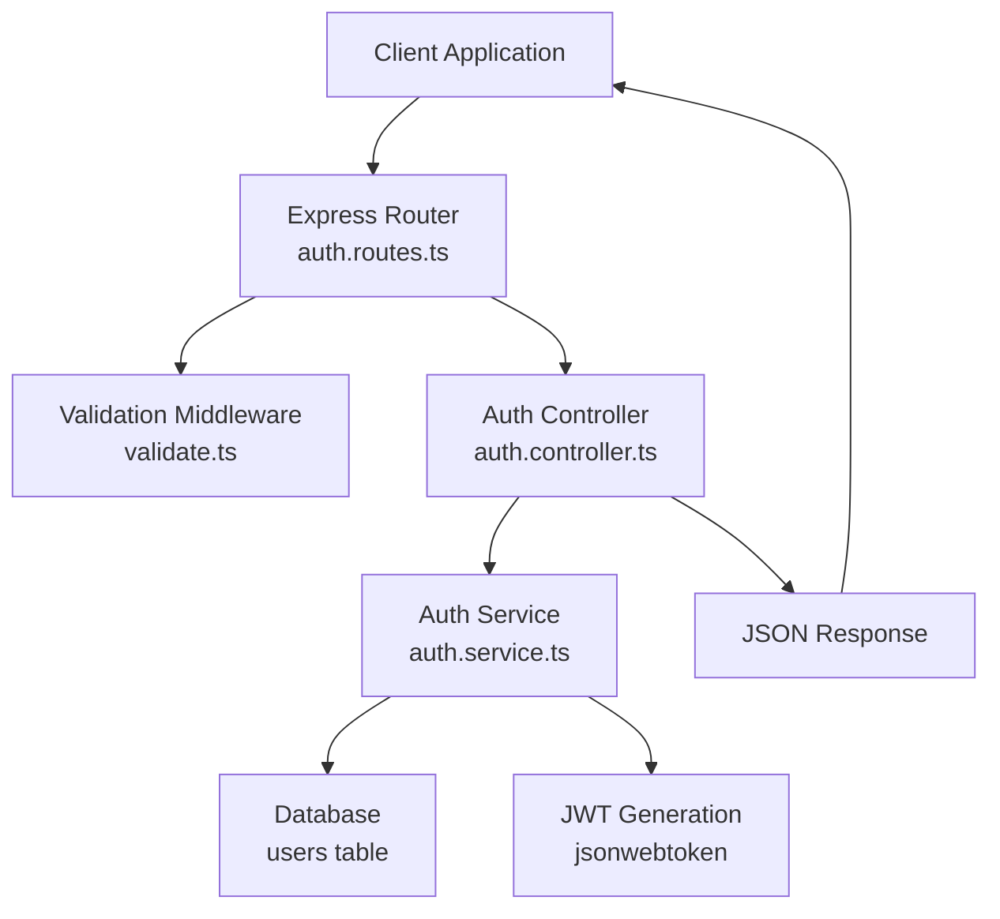
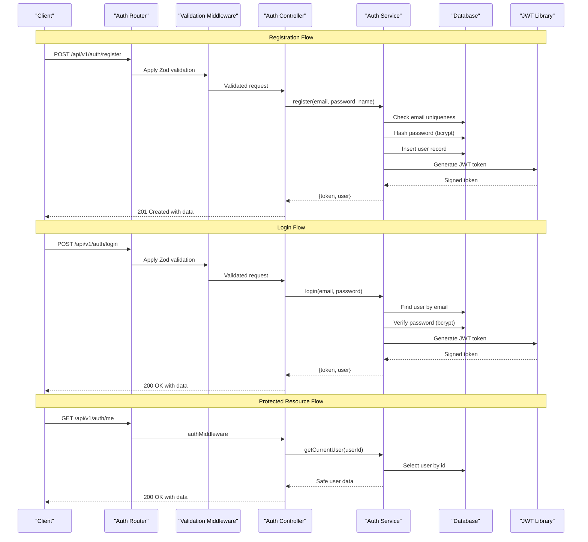
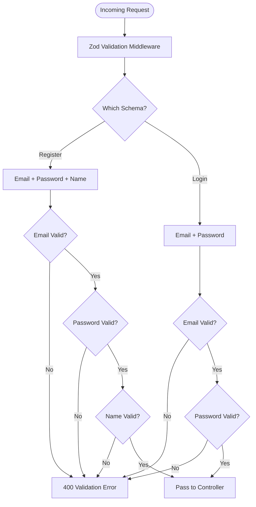
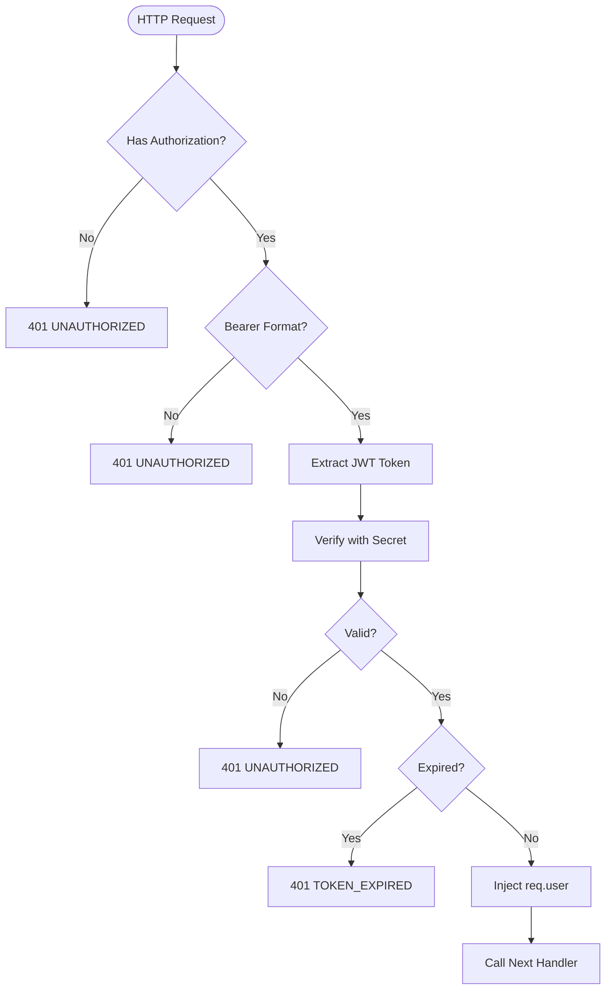
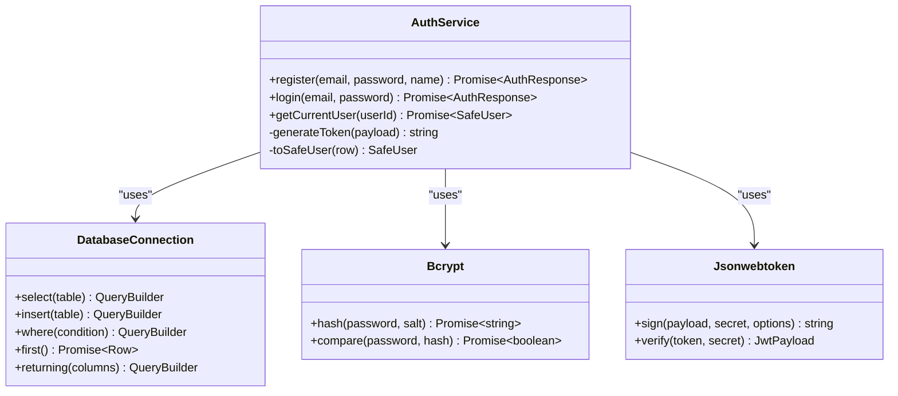
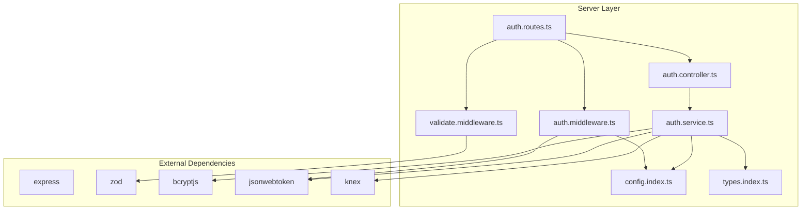

# Authentication Endpoints

<cite>
**Referenced Files in This Document**
- [auth.routes.ts](file://code/server/src/routes/auth.routes.ts)
- [auth.controller.ts](file://code/server/src/controllers/auth.controller.ts)
- [auth.service.ts](file://code/server/src/services/auth.service.ts)
- [auth.middleware.ts](file://code/server/src/middleware/auth.ts)
- [validate.middleware.ts](file://code/server/src/middleware/validate.ts)
- [config.index.ts](file://code/server/src/config/index.ts)
- [types.index.ts](file://code/server/src/types/index.ts)
- [app.ts](file://code/server/src/app.ts)
- [auth.service.ts](file://code/client/src/services/auth.service.ts)
- [auth.store.ts](file://code/client/src/stores/auth.ts)
- [API-SPEC.md](file://api-spec/API-SPEC.md)
</cite>

## Table of Contents
1. [Introduction](#introduction)
2. [Project Structure](#project-structure)
3. [Core Components](#core-components)
4. [Architecture Overview](#architecture-overview)
5. [Detailed Component Analysis](#detailed-component-analysis)
6. [Dependency Analysis](#dependency-analysis)
7. [Performance Considerations](#performance-considerations)
8. [Troubleshooting Guide](#troubleshooting-guide)
9. [Conclusion](#conclusion)

## Introduction
This document provides comprehensive API documentation for the authentication endpoints in Yule Notion. It covers the three core endpoints:
- POST /api/v1/auth/register for user registration with email/password/name validation
- POST /api/v1/auth/login for user authentication returning JWT tokens
- GET /api/v1/auth/me for retrieving current user information

The documentation specifies HTTP methods, URL patterns, request/response schemas, authentication requirements, error responses, parameter validation rules, example requests/responses, security considerations, JWT token structure, expiration handling, and integration patterns for client applications.

## Project Structure
The authentication module follows a layered architecture:
- Routes define the HTTP endpoints and apply validation middleware
- Controllers handle request/response formatting and delegate to services
- Services implement business logic including database operations and JWT generation
- Middleware handles request validation (Zod) and authentication (JWT)
- Configuration manages JWT secrets and expiration settings
- Types define request/response schemas and error codes



**Diagram sources**
- [auth.routes.ts:20-105](file://code/server/src/routes/auth.routes.ts#L20-L105)
- [auth.controller.ts:13-81](file://code/server/src/controllers/auth.controller.ts#L13-L81)
- [auth.service.ts:12-166](file://code/server/src/services/auth.service.ts#L12-L166)

**Section sources**
- [auth.routes.ts:1-106](file://code/server/src/routes/auth.routes.ts#L1-L106)
- [auth.controller.ts:1-82](file://code/server/src/controllers/auth.controller.ts#L1-L82)
- [auth.service.ts:1-166](file://code/server/src/services/auth.service.ts#L1-L166)

## Core Components
The authentication system consists of three primary endpoints, each with distinct validation rules and response formats:

### Endpoint 1: POST /api/v1/auth/register
- **Purpose**: User registration with email, password, and name
- **Authentication**: None required
- **Request Body Validation**:
  - email: string, required, valid email format, max 254 characters
  - password: string, required, min 8 characters, must contain lowercase, uppercase, and digit
  - name: string, required, min 1 character, max 50 characters
- **Response**: 201 Created with token and user data
- **Security**: Password hashed using bcrypt, email uniqueness enforced

### Endpoint 2: POST /api/v1/auth/login
- **Purpose**: User authentication returning JWT token
- **Authentication**: None required
- **Request Body Validation**:
  - email: string, required, valid email format
  - password: string, required, non-empty
- **Response**: 200 OK with token and user data
- **Security**: Password verification using bcrypt, constant-time comparison to prevent timing attacks

### Endpoint 3: GET /api/v1/auth/me
- **Purpose**: Retrieve current authenticated user information
- **Authentication**: Bearer token required
- **Request Headers**: Authorization: Bearer <JWT_TOKEN>
- **Response**: 200 OK with user data (safe fields only)
- **Security**: JWT verification with secret key, token expiration enforcement

**Section sources**
- [auth.routes.ts:72-102](file://code/server/src/routes/auth.routes.ts#L72-L102)
- [auth.controller.ts:26-81](file://code/server/src/controllers/auth.controller.ts#L26-L81)
- [auth.service.ts:68-166](file://code/server/src/services/auth.service.ts#L68-L166)

## Architecture Overview
The authentication flow demonstrates a clean separation of concerns across layers:



**Diagram sources**
- [auth.routes.ts:72-102](file://code/server/src/routes/auth.routes.ts#L72-L102)
- [auth.controller.ts:26-81](file://code/server/src/controllers/auth.controller.ts#L26-L81)
- [auth.service.ts:68-166](file://code/server/src/services/auth.service.ts#L68-L166)
- [auth.middleware.ts:29-59](file://code/server/src/middleware/auth.ts#L29-L59)

**Section sources**
- [auth.routes.ts:1-106](file://code/server/src/routes/auth.routes.ts#L1-L106)
- [auth.controller.ts:1-82](file://code/server/src/controllers/auth.controller.ts#L1-L82)
- [auth.service.ts:1-166](file://code/server/src/services/auth.service.ts#L1-L166)

## Detailed Component Analysis

### Request Validation Layer
The validation middleware uses Zod schemas to enforce strict input validation:



**Diagram sources**
- [validate.middleware.ts:31-71](file://code/server/src/middleware/validate.ts#L31-L71)
- [auth.routes.ts:35-66](file://code/server/src/routes/auth.routes.ts#L35-L66)

**Section sources**
- [validate.middleware.ts:1-72](file://code/server/src/middleware/validate.ts#L1-L72)
- [auth.routes.ts:27-66](file://code/server/src/routes/auth.routes.ts#L27-L66)

### JWT Authentication Middleware
The authentication middleware handles token extraction, verification, and user injection:



**Diagram sources**
- [auth.middleware.ts:29-59](file://code/server/src/middleware/auth.ts#L29-L59)

**Section sources**
- [auth.middleware.ts:1-60](file://code/server/src/middleware/auth.ts#L1-L60)
- [config.index.ts:88-94](file://code/server/src/config/index.ts#L88-L94)

### Business Logic Implementation
The service layer implements core authentication operations:



**Diagram sources**
- [auth.service.ts:68-166](file://code/server/src/services/auth.service.ts#L68-L166)

**Section sources**
- [auth.service.ts:19-166](file://code/server/src/services/auth.service.ts#L19-L166)

### Response Schemas
All authentication endpoints follow the unified response format:

**Success Response Format**:
```json
{
  "data": {
    "token": "string",
    "user": {
      "id": "string",
      "email": "string",
      "name": "string",
      "createdAt": "string (ISO 8601)"
    }
  }
}
```

**Error Response Format**:
```json
{
  "error": {
    "code": "string",
    "message": "string",
    "details": "any"
  }
}
```

**Section sources**
- [API-SPEC.md:25-52](file://api-spec/API-SPEC.md#L25-L52)
- [types.index.ts:139-145](file://code/server/src/types/index.ts#L139-L145)

## Dependency Analysis
The authentication system exhibits strong separation of concerns with minimal coupling:



**Diagram sources**
- [auth.routes.ts:10-14](file://code/server/src/routes/auth.routes.ts#L10-L14)
- [auth.controller.ts:13-15](file://code/server/src/controllers/auth.controller.ts#L13-L15)
- [auth.service.ts:12-17](file://code/server/src/services/auth.service.ts#L12-L17)
- [auth.middleware.ts:10-14](file://code/server/src/middleware/auth.ts#L10-L14)
- [validate.middleware.ts:11-13](file://code/server/src/middleware/validate.ts#L11-L13)

**Section sources**
- [auth.routes.ts:10-14](file://code/server/src/routes/auth.routes.ts#L10-L14)
- [auth.controller.ts:13-15](file://code/server/src/controllers/auth.controller.ts#L13-L15)
- [auth.service.ts:12-17](file://code/server/src/services/auth.service.ts#L12-L17)

## Performance Considerations
- **Password Hashing**: Uses bcrypt with 10 rounds, providing good security while maintaining reasonable performance
- **Database Queries**: Single round-trip operations for user lookup and creation
- **JWT Generation**: Minimal overhead with configurable expiration
- **Rate Limiting**: Global rate limiting prevents abuse (100 requests per 15 minutes per IP)
- **Caching**: No caching implemented for authentication operations

## Troubleshooting Guide

### Common Authentication Issues

**Registration Failures**:
- Email already exists: Returns 409 CONFLICT with `EMAIL_ALREADY_EXISTS`
- Invalid email format: Returns 400 BAD REQUEST with validation error details
- Weak password: Returns 400 BAD REQUEST with validation error details
- Invalid name length: Returns 400 BAD REQUEST with validation error details

**Login Failures**:
- Invalid credentials: Returns 401 UNAUTHORIZED with `INVALID_CREDENTIALS`
- Account not found: Returns 401 UNAUTHORIZED (same message to prevent enumeration)
- Rate limiting: Returns 429 TOO MANY REQUESTS

**Protected Resource Access**:
- Missing Authorization header: Returns 401 UNAUTHORIZED with `UNAUTHORIZED`
- Invalid Bearer token format: Returns 401 UNAUTHORIZED with `UNAUTHORIZED`
- Expired token: Returns 401 UNAUTHORIZED with `TOKEN_EXPIRED`
- Invalid token signature: Returns 401 UNAUTHORIZED with `UNAUTHORIZED`

**Client-Side Integration**:
- Token storage: Frontend stores JWT in localStorage under key `auth_token`
- Automatic token injection: Axios interceptor adds Authorization header for authenticated requests
- 401 handling: Automatic logout and redirect to login page on unauthorized responses

**Section sources**
- [auth.service.ts:73-77](file://code/server/src/services/auth.service.ts#L73-L77)
- [auth.service.ts:124-132](file://code/server/src/services/auth.service.ts#L124-L132)
- [auth.middleware.ts:33-58](file://code/server/src/middleware/auth.ts#L33-L58)
- [app.ts:82-96](file://code/server/src/app.ts#L82-L96)
- [auth.store.ts:114-122](file://code/client/src/stores/auth.ts#L114-L122)

## Conclusion
The Yule Notion authentication system provides a secure, well-structured foundation for user management with clear separation of concerns across validation, business logic, and presentation layers. The implementation follows industry best practices including bcrypt password hashing, JWT-based authentication, comprehensive input validation, and robust error handling. The modular design facilitates maintenance and extension while providing a solid foundation for client-side integration through standardized request/response patterns and automatic token management.

Key strengths include:
- Comprehensive input validation with user-friendly error messages
- Secure password handling with bcrypt
- JWT-based stateless authentication
- Unified error handling and response formatting
- Production-ready security configurations
- Client-side token persistence and automatic header injection

The system is ready for production deployment with appropriate environment configuration and monitoring in place.