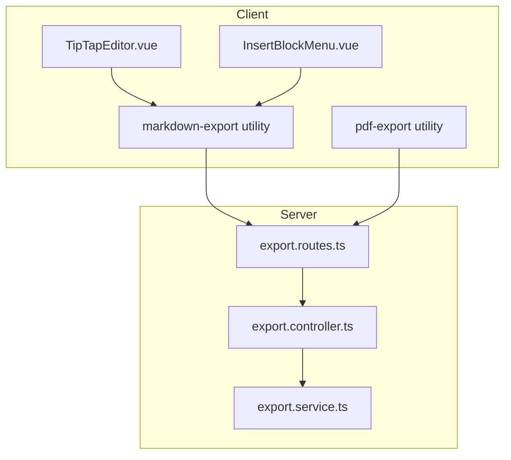
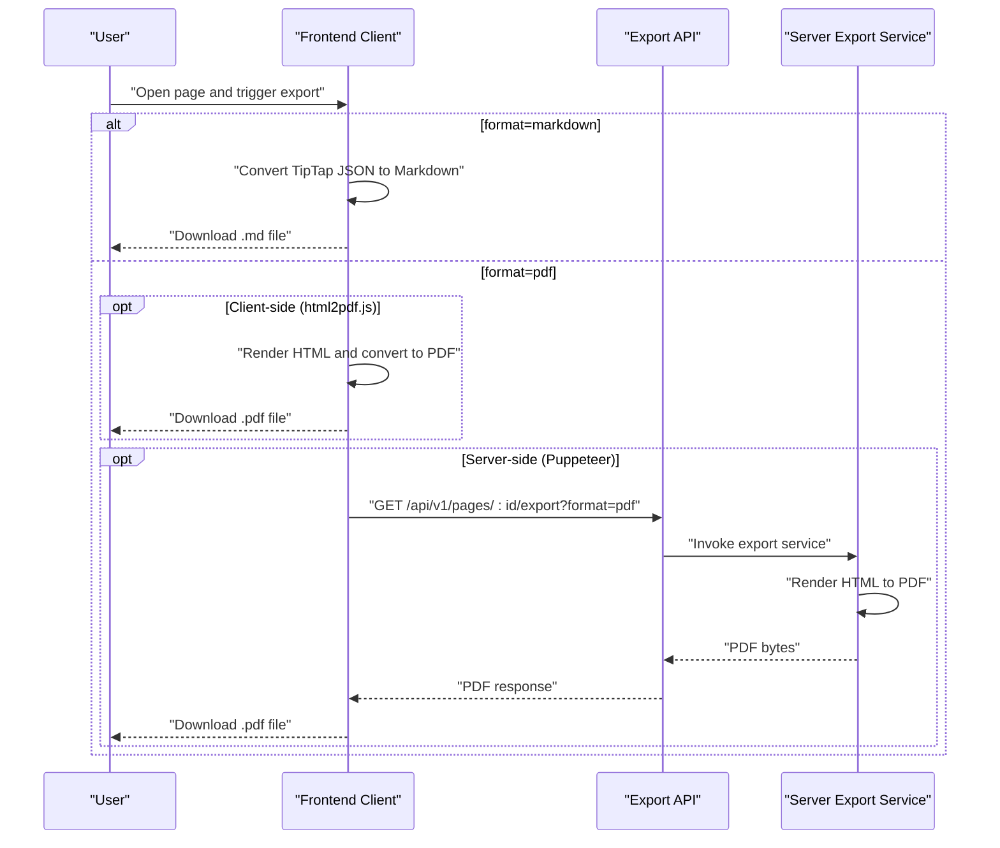
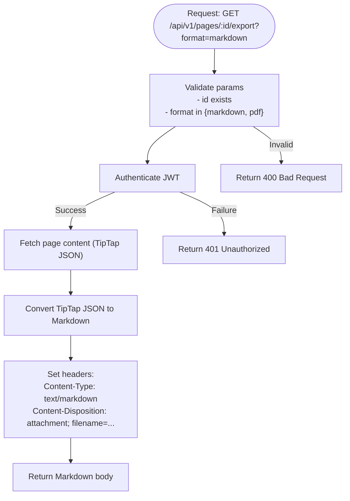
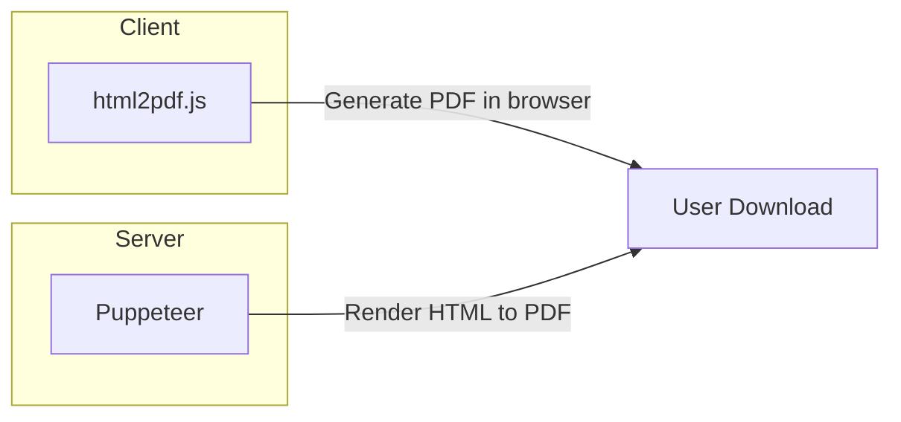
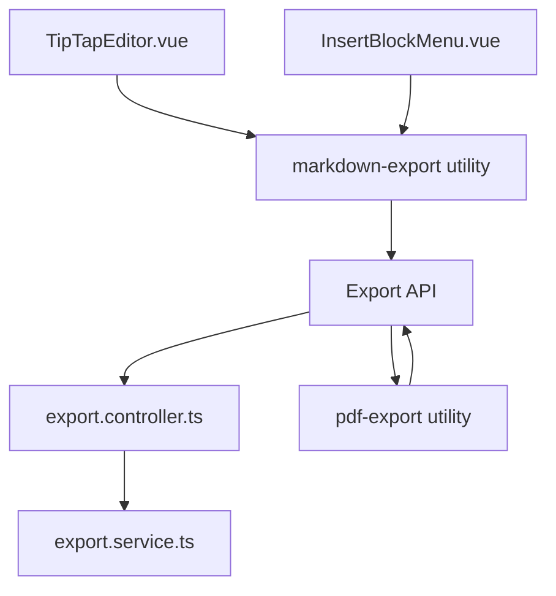

# Export Endpoints

<cite>
**Referenced Files in This Document**
- [API-SPEC.md](file://api-spec/API-SPEC.md)
- [ARCHITECTURE.md](file://arch/ARCHITECTURE.md)
- [TipTapEditor.vue](file://code/client/src/components/editor/TipTapEditor.vue)
- [InsertBlockMenu.vue](file://code/client/src/components/editor/InsertBlockMenu.vue)
</cite>

## Table of Contents
1. [Introduction](#introduction)
2. [Project Structure](#project-structure)
3. [Core Components](#core-components)
4. [Architecture Overview](#architecture-overview)
5. [Detailed Component Analysis](#detailed-component-analysis)
6. [Dependency Analysis](#dependency-analysis)
7. [Performance Considerations](#performance-considerations)
8. [Troubleshooting Guide](#troubleshooting-guide)
9. [Conclusion](#conclusion)

## Introduction
This document provides comprehensive API documentation for the export functionality, focusing on the GET /api/v1/pages/:id/export endpoint. It covers:
- Supported export formats (markdown and pdf)
- TipTap to Markdown conversion rules and supported block types
- File naming conventions and response headers for downloads
- Implementation approaches for PDF export (Puppeteer vs client-side html2pdf.js)
- Quality considerations and integration patterns for automated export workflows

## Project Structure
The export feature spans both client and server components:
- Client-side TipTap editor and export utilities
- Server-side route/controller/service for export endpoints
- Architecture guidance for PDF generation



**Diagram sources**
- [ARCHITECTURE.md:162-236](file://arch/ARCHITECTURE.md#L162-L236)
- [ARCHITECTURE.md:238-286](file://arch/ARCHITECTURE.md#L238-L286)

**Section sources**
- [ARCHITECTURE.md:162-236](file://arch/ARCHITECTURE.md#L162-L236)
- [ARCHITECTURE.md:238-286](file://arch/ARCHITECTURE.md#L238-L286)

## Core Components
- Export API specification defines the endpoint, query parameters, and response headers for both markdown and pdf formats.
- Client-side TipTap editor and block menu define the supported block types that will be converted to Markdown.
- Architecture document outlines the server structure and mentions the export routes/controllers/services.

Key API details:
- Endpoint: GET /api/v1/pages/:id/export
- Query parameter: format (markdown or pdf)
- Authentication: required (Bearer JWT)
- Response headers:
  - Content-Type: text/markdown; charset=utf-8 for markdown
  - Content-Type: application/pdf for pdf
  - Content-Disposition: attachment; filename="<encoded-title>.<ext>"
- PDF implementation guidance:
  - Server-side: Puppeteer rendering HTML to PDF
  - Client-side: html2pdf.js (recommended for MVP to avoid heavy server dependencies)

Supported TipTap blocks for Markdown export:
- heading (level 1)
- heading (level 2)
- heading (level 3)
- bulletList > listItem
- orderedList > listItem
- codeBlock
- blockquote
- paragraph
- image

**Section sources**
- [API-SPEC.md:631-679](file://api-spec/API-SPEC.md#L631-L679)
- [TipTapEditor.vue:1-378](file://code/client/src/components/editor/TipTapEditor.vue#L1-L378)
- [InsertBlockMenu.vue:81-123](file://code/client/src/components/editor/InsertBlockMenu.vue#L81-L123)
- [ARCHITECTURE.md:238-286](file://arch/ARCHITECTURE.md#L238-L286)

## Architecture Overview
The export workflow integrates client-side TipTap content with server-side export services. The client can generate Markdown locally for immediate download, while PDF export can be handled either client-side via html2pdf.js or server-side via Puppeteer.



**Diagram sources**
- [API-SPEC.md:631-679](file://api-spec/API-SPEC.md#L631-L679)
- [ARCHITECTURE.md:118-118](file://arch/ARCHITECTURE.md#L118-L118)

## Detailed Component Analysis

### Export API Specification
The API specification defines:
- Endpoint path and method
- Required authentication header
- Query parameter format
- Response headers for content type and filename encoding
- Conversion rules for TipTap blocks to Markdown
- PDF export implementation guidance



**Diagram sources**
- [API-SPEC.md:631-664](file://api-spec/API-SPEC.md#L631-L664)

**Section sources**
- [API-SPEC.md:631-664](file://api-spec/API-SPEC.md#L631-L664)

### TipTap to Markdown Conversion Rules
The conversion rules map TipTap block types to Markdown syntax. These rules are used by the client-side markdown export utility and inform server-side implementations.

Conversion table:
- heading (level 1) → # Title
- heading (level 2) → ## Title
- heading (level 3) → ### Title
- bulletList > listItem → - item
- orderedList > listItem → 1. item
- codeBlock → ```language\n...\n```
- blockquote → > quote
- paragraph → paragraph text
- image → 

These rules are derived from the API specification’s conversion table.

**Section sources**
- [API-SPEC.md](file://api-spec/API-SPEC.md#L651-L663)

### PDF Export Implementation Approaches
Two implementation approaches are documented:
- Client-side: html2pdf.js (browser-based)
- Server-side: Puppeteer (Node.js) rendering HTML to PDF

The architecture document confirms the server structure and mentions the export routes/controllers/services, aligning with the API specification’s guidance.



**Diagram sources**
- [API-SPEC.md](file://api-spec/API-SPEC.md#L665-L679)
- [ARCHITECTURE.md](file://arch/ARCHITECTURE.md#L238-L286)

**Section sources**
- [API-SPEC.md](file://api-spec/API-SPEC.md#L665-L679)
- [ARCHITECTURE.md](file://arch/ARCHITECTURE.md#L238-L286)

### Client-Side TipTap Blocks
The client-side TipTap editor and block insertion menu define the supported block types that will be converted to Markdown. This informs the conversion rules and ensures consistency between editor content and exported output.

Supported blocks include:
- Basic: image, table, codeBlock, blockquote
- Lists: bulletList, orderedList, taskList
- Headings: heading1, heading2, heading3
- Other: horizontalRule, link

These block types are used by the editor and influence the Markdown export.

**Section sources**
- [TipTapEditor.vue](file://code/client/src/components/editor/TipTapEditor.vue#L1-L378)
- [InsertBlockMenu.vue](file://code/client/src/components/editor/InsertBlockMenu.vue#L81-L123)

## Dependency Analysis
The export feature depends on:
- TipTap JSON content from the client editor
- Conversion utilities (client-side markdown export)
- Server-side export routes/controllers/services (server structure documented)
- PDF generation libraries (client-side html2pdf.js or server-side Puppeteer)



**Diagram sources**
- [ARCHITECTURE.md:162-236](file://arch/ARCHITECTURE.md#L162-L236)
- [ARCHITECTURE.md:238-286](file://arch/ARCHITECTURE.md#L238-L286)

**Section sources**
- [ARCHITECTURE.md:162-236](file://arch/ARCHITECTURE.md#L162-L236)
- [ARCHITECTURE.md:238-286](file://arch/ARCHITECTURE.md#L238-L286)

## Performance Considerations
- Markdown export: Client-side conversion avoids server load; suitable for MVP.
- PDF export:
  - Client-side (html2pdf.js): Fast, no server resources; may be limited by browser capabilities.
  - Server-side (Puppeteer): More reliable for complex layouts; requires headless browser runtime and memory.
- Consider chunking large documents and optimizing images for both formats.
- Use appropriate caching headers for static assets and minimize repeated conversions.

## Troubleshooting Guide
Common issues and resolutions:
- 401 Unauthorized: Ensure Authorization header with a valid Bearer token is included.
- 400 Bad Request: Verify the format query parameter is set to markdown or pdf.
- 404 Not Found: Confirm the page id exists and belongs to the authenticated user.
- 403 Forbidden: Access denied if the page does not belong to the current user.
- 500 Internal Server Error: Server-side export failures (e.g., Puppeteer errors); check logs and resource limits.

Response headers to verify:
- Content-Type: text/markdown; charset=utf-8 for markdown
- Content-Type: application/pdf for pdf
- Content-Disposition: attachment; filename="<encoded-title>.<ext>"

**Section sources**
- [API-SPEC.md:631-679](file://api-spec/API-SPEC.md#L631-L679)

## Conclusion
The export endpoints provide a clear contract for exporting pages in markdown and pdf formats. The TipTap to Markdown conversion rules ensure consistent output, while the dual implementation paths for PDF offer flexibility depending on deployment constraints. Integrating these endpoints into automated workflows involves validating parameters, authenticating requests, and handling appropriate response headers for seamless downloads.