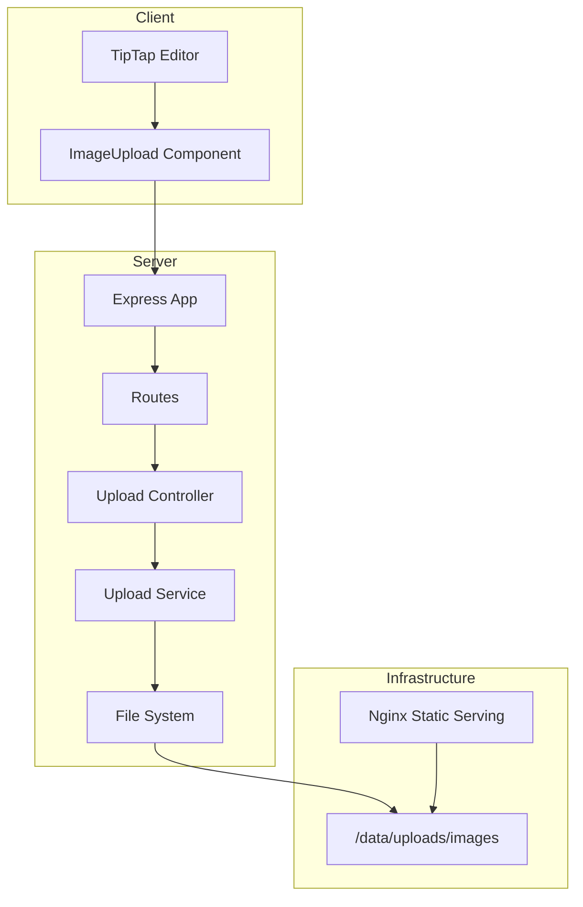
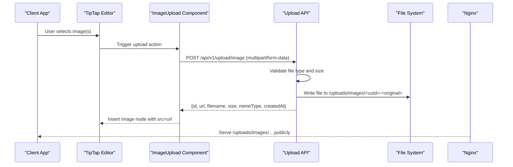
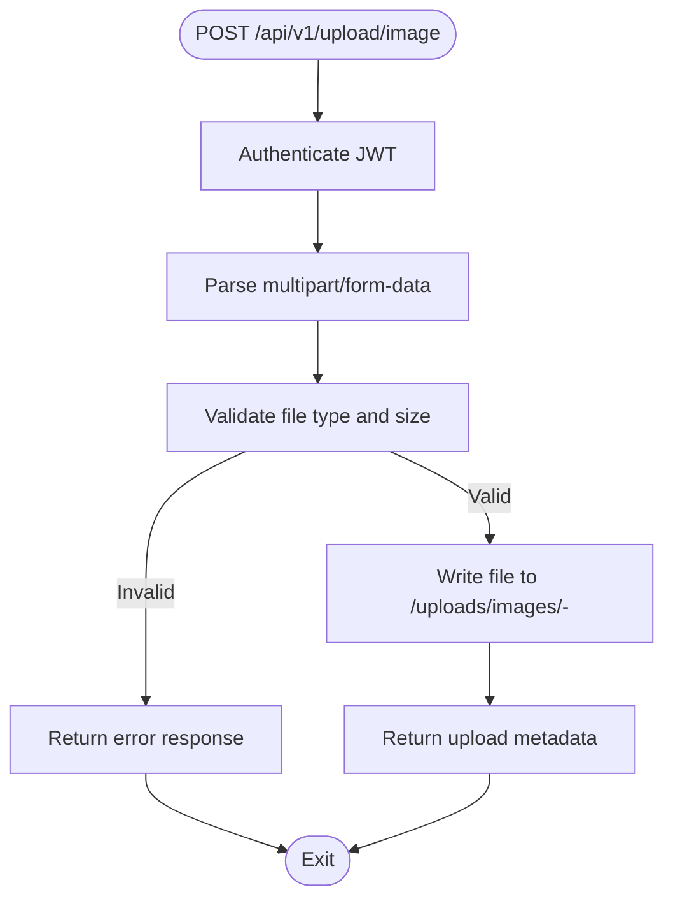
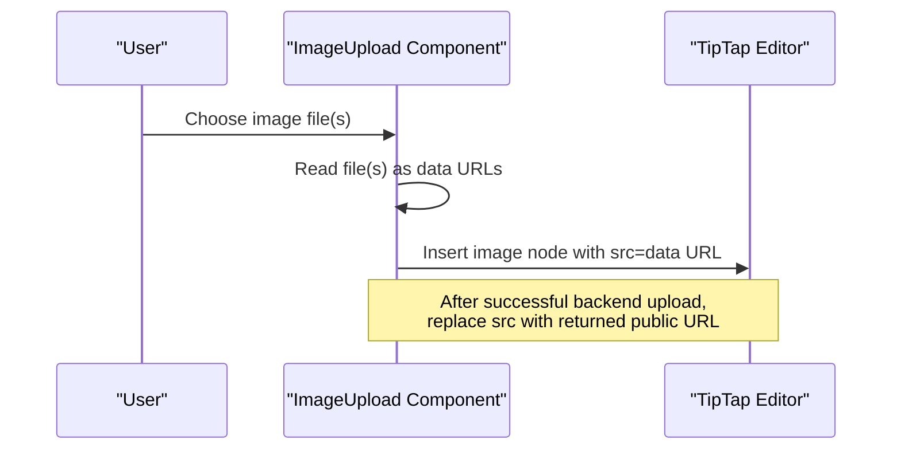
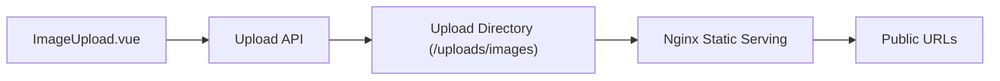

# File Upload Endpoints

<cite>
**Referenced Files in This Document**
- [API-SPEC.md](file://api-spec/API-SPEC.md)
- [ARCHITECTURE.md](file://arch/ARCHITECTURE.md)
- [app.ts](file://code/server/src/app.ts)
- [index.ts](file://code/server/src/types/index.ts)
- [ImageUpload.vue](file://code/client/src/components/editor/ImageUpload.vue)
</cite>

## Table of Contents
1. [Introduction](#introduction)
2. [Project Structure](#project-structure)
3. [Core Components](#core-components)
4. [Architecture Overview](#architecture-overview)
5. [Detailed Component Analysis](#detailed-component-analysis)
6. [Dependency Analysis](#dependency-analysis)
7. [Performance Considerations](#performance-considerations)
8. [Troubleshooting Guide](#troubleshooting-guide)
9. [Conclusion](#conclusion)

## Introduction
This document provides comprehensive API documentation for the file upload functionality, focusing on the POST /api/v1/upload/image endpoint. It covers supported file formats, size limitations, storage strategies, URL generation, client-side integration, error handling, and security considerations. The goal is to enable developers to integrate image uploads seamlessly into TipTap content while ensuring predictable behavior and robust error handling.

## Project Structure
The upload feature spans both the backend API and the frontend editor integration:
- Backend: Express server with route/controller/service layers and static file serving via Nginx.
- Frontend: TipTap editor with an image upload component that supports selecting files and inserting images into the document.

**Diagram sources**
- [ARCHITECTURE.md:43-47](file://arch/ARCHITECTURE.md#L43-L47)
- [app.ts:65-93](file://code/server/src/app.ts#L65-L93)

**Section sources**
- [ARCHITECTURE.md:43-47](file://arch/ARCHITECTURE.md#L43-L47)
- [app.ts:65-93](file://code/server/src/app.ts#L65-L93)

## Core Components
- Endpoint: POST /api/v1/upload/image
- Authentication: Required (Bearer JWT)
- Content-Type: multipart/form-data
- Supported formats: jpg, png, gif, webp
- Size limit: ≤ 5 MB
- Storage: Local filesystem under /uploads/images
- URL generation: Publicly accessible via Nginx static service

Response payload includes:
- id: Unique identifier for the upload record
- url: Public URL path to the stored image
- filename: Original filename preserved
- size: File size in bytes
- mimeType: Detected MIME type
- createdAt: Timestamp of upload

**Section sources**
- [API-SPEC.md:596-629](file://api-spec/API-SPEC.md#L596-L629)

## Architecture Overview
The upload pipeline integrates the frontend editor with the backend API and static file serving:
- Client triggers upload via the editor’s image upload component.
- The request is sent to the backend API with multipart/form-data.
- The server validates the file type and size, persists the file to disk, and returns metadata.
- Nginx serves the uploaded files statically, enabling direct public access.

**Diagram sources**
- [API-SPEC.md:596-629](file://api-spec/API-SPEC.md#L596-L629)
- [ARCHITECTURE.md:43-47](file://arch/ARCHITECTURE.md#L43-L47)

## Detailed Component Analysis

### Backend Upload Endpoint
- Route registration and middleware: The Express app registers security headers, CORS, JSON parsing with increased limits, rate limiting, and routes. The upload endpoint is part of the upload routes module.
- Validation: The API specification defines supported formats and size limits. The server enforces these constraints and maps errors to standardized error codes.
- Storage: Files are written to the configured upload directory with a naming scheme that prefixes the original filename with a UUID.
- Static serving: Nginx serves the uploads directory, making files directly accessible via public URLs.

**Diagram sources**
- [API-SPEC.md:596-629](file://api-spec/API-SPEC.md#L596-L629)
- [app.ts:65-93](file://code/server/src/app.ts#L65-L93)
- [index.ts:87-130](file://code/server/src/types/index.ts#L87-L130)

**Section sources**
- [API-SPEC.md:596-629](file://api-spec/API-SPEC.md#L596-L629)
- [app.ts:65-93](file://code/server/src/app.ts#L65-L93)
- [index.ts:87-130](file://code/server/src/types/index.ts#L87-L130)

### Frontend Image Upload Integration
- The editor’s image upload component allows users to select images from their device.
- The component reads selected files and inserts them into the editor as image nodes.
- For direct URL insertion, the component can set the image source to the returned URL from the upload endpoint.

**Diagram sources**
- [ImageUpload.vue:23-44](file://code/client/src/components/editor/ImageUpload.vue#L23-L44)

**Section sources**
- [ImageUpload.vue:1-89](file://code/client/src/components/editor/ImageUpload.vue#L1-L89)

### Error Handling
Standardized error codes and HTTP status mapping:
- FILE_TOO_LARGE: 413 Payload Too Large
- UNSUPPORTED_FILE_TYPE: 422 Unprocessable Entity
- Additional generic errors: 400, 401, 403, 404, 409, 429, 500

These codes are mapped to consistent HTTP status codes and error payloads across the API.

**Section sources**
- [index.ts:87-130](file://code/server/src/types/index.ts#L87-L130)
- [API-SPEC.md:71-86](file://api-spec/API-SPEC.md#L71-L86)

## Dependency Analysis
- Client-to-server dependency: The editor component depends on the backend upload endpoint for retrieving public URLs.
- Server-to-storage dependency: The upload controller/service writes files to the configured upload directory.
- Infrastructure dependency: Nginx serves the upload directory, enabling public access to uploaded files.

**Diagram sources**
- [ARCHITECTURE.md:43-47](file://arch/ARCHITECTURE.md#L43-L47)
- [API-SPEC.md:623-627](file://api-spec/API-SPEC.md#L623-L627)

**Section sources**
- [ARCHITECTURE.md:43-47](file://arch/ARCHITECTURE.md#L43-L47)
- [API-SPEC.md:623-627](file://api-spec/API-SPEC.md#L623-L627)

## Performance Considerations
- File size limit: Enforced at the API boundary to prevent oversized requests.
- Static serving: Nginx efficiently serves static assets, reducing load on the Node.js process.
- No compression/transcoding: Preserves original quality and simplifies processing.

[No sources needed since this section provides general guidance]

## Troubleshooting Guide
Common issues and resolutions:
- Unsupported file type: Ensure the file extension is jpg, png, gif, or webp.
- File too large: Reduce the image size to under 5 MB.
- Authentication failure: Verify the Authorization header contains a valid Bearer token.
- Access denied: Confirm the upload directory permissions allow the server to write files.
- Public URL not loading: Verify Nginx is configured to serve the uploads directory.

**Section sources**
- [API-SPEC.md:71-86](file://api-spec/API-SPEC.md#L71-L86)
- [index.ts:87-130](file://code/server/src/types/index.ts#L87-L130)

## Conclusion
The file upload endpoint provides a straightforward, secure, and scalable mechanism for uploading images and embedding them in TipTap content. By enforcing clear format and size constraints, leveraging Nginx for static delivery, and using standardized error handling, the system ensures predictable behavior for both clients and servers. Integrating the editor’s image upload component with the backend enables seamless user experiences while maintaining operational simplicity.