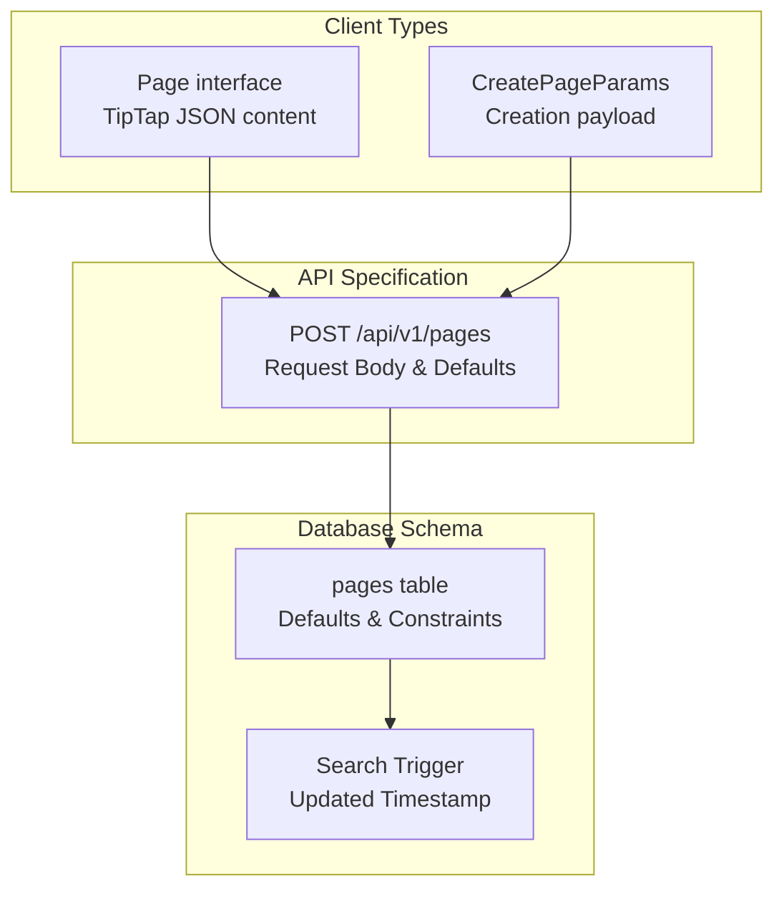
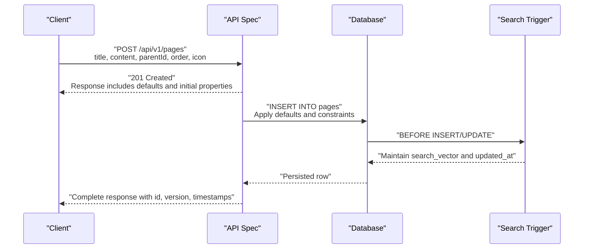
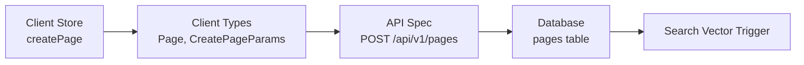

# Page Creation and Initial Setup

<cite>
**Referenced Files in This Document**
- [API-SPEC.md](file://api-spec/API-SPEC.md)
- [001_init.sql](file://db/001_init.sql)
- [20260319_init.ts](file://code/server/src/db/migrations/20260319_init.ts)
- [ARCHITECTURE.md](file://arch/ARCHITECTURE.md)
- [pages.ts](file://code/client/src/stores/pages.ts)
- [index.ts](file://code/client/src/types/index.ts)
</cite>

## Table of Contents
1. [Introduction](#introduction)
2. [Project Structure](#project-structure)
3. [Core Components](#core-components)
4. [Architecture Overview](#architecture-overview)
5. [Detailed Component Analysis](#detailed-component-analysis)
6. [Dependency Analysis](#dependency-analysis)
7. [Performance Considerations](#performance-considerations)
8. [Troubleshooting Guide](#troubleshooting-guide)
9. [Conclusion](#conclusion)

## Introduction
This document explains how to create pages using the POST /api/v1/pages endpoint. It covers all creation parameters, default values, TipTap JSON content structure, hierarchical placement via parentId, ordering via order, icon selection, validation rules, and automatic initial properties such as version number and timestamps. It also provides examples for creating root pages and child pages, and demonstrates proper TipTap JSON structures for different content types.

## Project Structure
The page creation feature spans API specification, database schema, and client-side model definitions. The API specification defines the endpoint contract, the database schema enforces defaults and constraints, and the client-side types and stores reflect the same structure for local editing and optimistic UI updates.

**Diagram sources**
- [API-SPEC.md:244-284](file://api-spec/API-SPEC.md#L244-L284)
- [001_init.sql:36-55](file://db/001_init.sql#L36-L55)
- [20260319_init.ts:54-62](file://code/server/src/db/migrations/20260319_init.ts#L54-L62)
- [index.ts:72-100](file://code/client/src/types/index.ts#L72-L100)

**Section sources**
- [API-SPEC.md:244-284](file://api-spec/API-SPEC.md#L244-L284)
- [001_init.sql:36-55](file://db/001_init.sql#L36-L55)
- [index.ts:72-100](file://code/client/src/types/index.ts#L72-L100)

## Core Components
- Endpoint: POST /api/v1/pages
- Purpose: Create a new page with optional title, content, parentId, order, and icon.
- Defaults:
  - title: "无标题"
  - content: TipTap JSON empty document { "type": "doc", "content": [] }
  - parentId: null (root page)
  - order: default behavior appends to end of siblings
  - icon: "📄"
- Automatic initial properties:
  - version: 1
  - createdAt: current UTC timestamp
  - updatedAt: current UTC timestamp
- Validation rules:
  - order must be non-negative
  - version must be positive
  - parentId must reference a page owned by the same user (enforced by foreign key cascade and user scoping)
- TipTap JSON content:
  - Root type: "doc"
  - Content array: blocks such as headings, paragraphs, lists, etc.
  - Empty document: { "type": "doc", "content": [] }

Examples
- Creating a root page:
  - Set parentId to null and optionally specify title and icon.
- Creating a child page:
  - Set parentId to the parent page's UUID and optionally set order to position among siblings.

**Section sources**
- [API-SPEC.md:244-284](file://api-spec/API-SPEC.md#L244-L284)
- [001_init.sql:39-48](file://db/001_init.sql#L39-L48)
- [20260319_init.ts:60-61](file://code/server/src/db/migrations/20260319_init.ts#L60-L61)

## Architecture Overview
The page creation flow integrates API request validation, database persistence with defaults and constraints, and automatic timestamp updates via triggers. Client-side types mirror the server-side structure for local editing.

**Diagram sources**
- [API-SPEC.md:244-284](file://api-spec/API-SPEC.md#L244-L284)
- [001_init.sql:166-211](file://db/001_init.sql#L166-L211)
- [20260319_init.ts:54-62](file://code/server/src/db/migrations/20260319_init.ts#L54-L62)

## Detailed Component Analysis

### API Contract: POST /api/v1/pages
- Authentication: Required (Bearer token)
- Request body fields:
  - title: string, optional, default "无标题"
  - content: object (TipTap JSON), optional, default empty doc { "type": "doc", "content": [] }
  - parentId: string (UUID), optional, null means root page
  - order: integer, optional, default behavior appends to end of siblings
  - icon: string (Emoji), optional, default "📄"
- Response:
  - 201 Created with complete page object including id, version, timestamps, and defaults
- Validation:
  - Non-negative order enforced by constraint
  - Positive version enforced by constraint
  - Parent page must belong to the same user (via foreign key and user scoping)

Example requests
- Root page creation:
  - title: "Project Alpha"
  - parentId: null
  - icon: "🚀"
- Child page creation:
  - title: "Setup"
  - parentId: "<parent-page-uuid>"
  - order: 0

TipTap JSON content examples
- Empty document:
  - { "type": "doc", "content": [] }
- With a heading and paragraph:
  - { "type": "doc", "content": [ { "type": "heading", "attrs": { "level": 1 }, "content": [ { "type": "text", "text": "Title" } ] }, { "type": "paragraph", "content": [ { "type": "text", "text": "Content" } ] } ] }

**Section sources**
- [API-SPEC.md:244-284](file://api-spec/API-SPEC.md#L244-L284)

### Database Schema: pages table
- Columns and defaults:
  - title: VARCHAR(500), default "无标题"
  - content: JSONB, default {"type":"doc","content":[]}
  - parent_id: UUID, references pages(id)
  - order: INTEGER, default 0
  - icon: VARCHAR(10), default "📄"
  - version: INTEGER, default 1
  - created_at, updated_at: TIMESTAMPTZ, default NOW()
- Constraints:
  - order >= 0
  - version > 0
- Indexes:
  - user_id
  - (user_id, parent_id)
  - (user_id, COALESCE(parent_id, '00000000-0000-0000-0000-000000000000'), "order")
  - (user_id, updated_at DESC)

Automatic behavior
- Search vector maintained via trigger
- updated_at refreshed on insert/update

**Section sources**
- [001_init.sql:36-68](file://db/001_init.sql#L36-L68)
- [20260319_init.ts:54-82](file://code/server/src/db/migrations/20260319_init.ts#L54-L82)

### Client-Side Types and Stores
- Page interface:
  - id, title, content (TipTap JSON), parentId?, order, icon, createdAt, updatedAt
- CreatePageParams:
  - title, parentId?, icon?
- Local store behavior:
  - createPage generates a new page with defaults and adds it to local state
  - Optimistic UI updates align with server defaults

**Section sources**
- [index.ts:72-100](file://code/client/src/types/index.ts#L72-L100)
- [pages.ts:73-93](file://code/client/src/stores/pages.ts#L73-L93)

### TipTap JSON Content Structure
- Root document:
  - type: "doc"
  - content: array of block nodes
- Common block types:
  - heading: attrs.level (1–3 typical), content: array of text nodes
  - paragraph: content: array of text nodes
  - bulletList / orderedList: content: array of listItem nodes
  - codeBlock: content: array with single text node
  - blockquote: content: array of text nodes
  - image: content: array with single text node (alt), attrs.url
- Empty document:
  - { "type": "doc", "content": [] }

Best practices
- Always wrap content in a top-level "doc" node
- Use level 1 for main titles, 2–3 for subsections
- Keep content arrays flat for simple documents

**Section sources**
- [API-SPEC.md:296-327](file://api-spec/API-SPEC.md#L296-L327)
- [001_init.sql:171-200](file://db/001_init.sql#L171-L200)

### Order and Hierarchical Placement
- Root pages:
  - parentId: null
  - order: default behavior appends to end of root siblings
- Child pages:
  - parentId: UUID of parent page
  - order: integer index among siblings under the same parent
- Movement:
  - Use PUT /api/v1/pages/:id/move to change parentId and/or order

Validation
- Cannot move a page under itself or its descendants (no cycles)
- parentId must belong to the same user

**Section sources**
- [API-SPEC.md:393-415](file://api-spec/API-SPEC.md#L393-L415)

### Automatic Properties and Timestamps
- Version:
  - Initial value: 1
  - Incremented on updates (optimistic concurrency)
- Timestamps:
  - createdAt: current UTC timestamp
  - updatedAt: current UTC timestamp (updated by trigger on insert/update)
- Icon:
  - Default emoji "📄"
- Tags:
  - Initially empty array

**Section sources**
- [001_init.sql:46-48](file://db/001_init.sql#L46-L48)
- [001_init.sql:208-211](file://db/001_init.sql#L208-L211)
- [API-SPEC.md:266-284](file://api-spec/API-SPEC.md#L266-L284)

## Dependency Analysis
The page creation flow depends on the API specification, database schema, and client-side types. The database constraints and triggers enforce data integrity and maintain derived fields.

**Diagram sources**
- [API-SPEC.md:244-284](file://api-spec/API-SPEC.md#L244-L284)
- [001_init.sql:36-55](file://db/001_init.sql#L36-L55)
- [20260319_init.ts:54-62](file://code/server/src/db/migrations/20260319_init.ts#L54-L62)
- [index.ts:72-100](file://code/client/src/types/index.ts#L72-L100)
- [pages.ts:73-93](file://code/client/src/stores/pages.ts#L73-L93)

**Section sources**
- [ARCHITECTURE.md:521-546](file://arch/ARCHITECTURE.md#L521-L546)

## Performance Considerations
- Indexes on (user_id, parent_id) and (user_id, parent_id, order) optimize sibling queries and ordering.
- JSONB content indexing supports efficient TipTap content queries.
- Full-text search vector maintained by trigger; consider query patterns to avoid unnecessary recomputation.
- Batch operations: when creating many pages, group inserts to minimize round trips.

## Troubleshooting Guide
Common issues and resolutions
- Validation errors (400):
  - Ensure order is non-negative and version remains positive.
  - Verify parentId exists and belongs to the same user.
- Conflicts (409):
  - When updating, include If-Match header with current version to prevent overwrites.
- Not found (404):
  - Confirm page ID exists and is not soft-deleted.
- Forbidden (403):
  - Ensure the page belongs to the authenticated user.

Operational checks
- Confirm database constraints and indexes are present.
- Verify search vector trigger is active and updated_at is refreshed.

**Section sources**
- [API-SPEC.md:331-335](file://api-spec/API-SPEC.md#L331-L335)
- [001_init.sql:53-54](file://db/001_init.sql#L53-L54)
- [20260319_init.ts:60-61](file://code/server/src/db/migrations/20260319_init.ts#L60-L61)

## Conclusion
Creating pages via POST /api/v1/pages is straightforward: supply optional parameters to override defaults, ensure parentId and order are valid, and rely on server defaults for title, content, icon, version, and timestamps. The database schema and triggers guarantee data integrity and derived fields, while the API specification and client types provide a consistent contract across the stack.