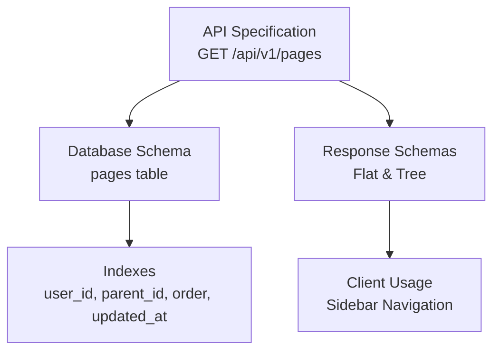
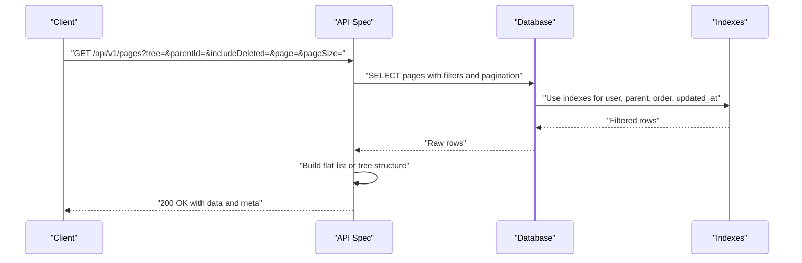
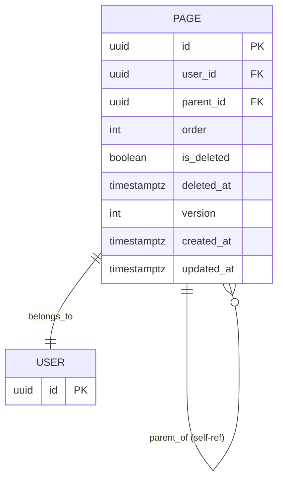
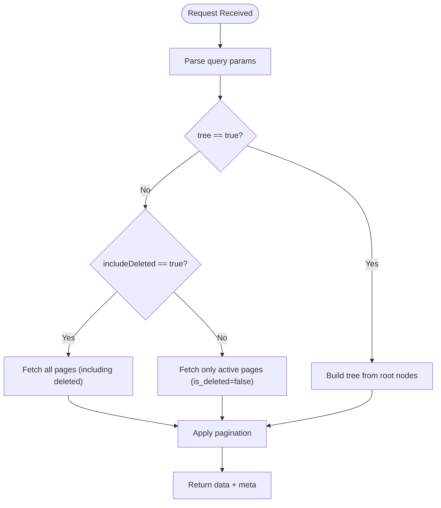
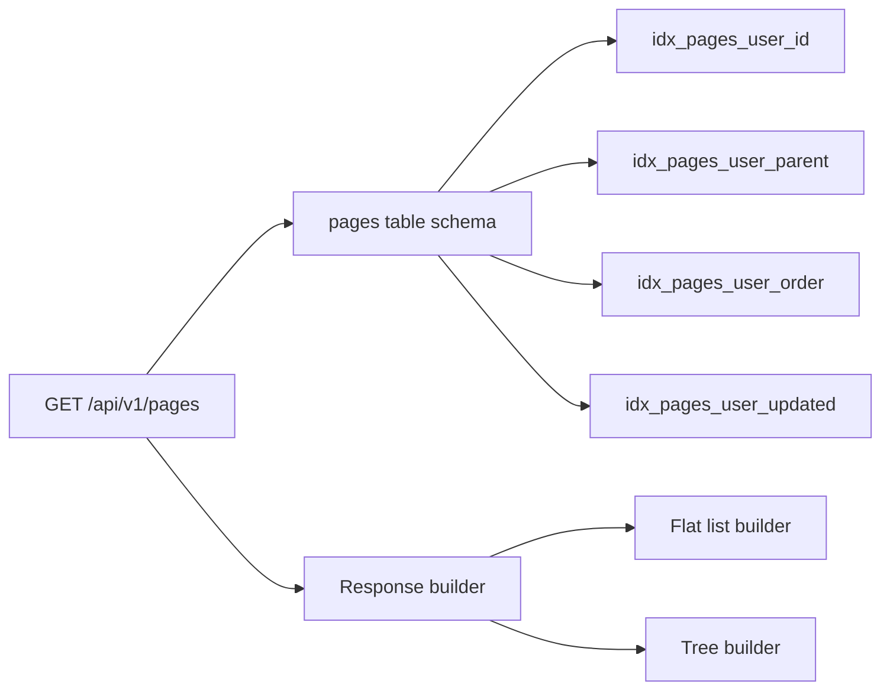

# Page Listing and Filtering

<cite>
**Referenced Files in This Document**
- [API-SPEC.md](file://api-spec/API-SPEC.md)
- [001_init.sql](file://db/001_init.sql)
- [20260319_init.ts](file://code/server/src/db/migrations/20260319_init.ts)
- [ER-DIAGRAM.md](file://db/ER-DIAGRAM.md)
</cite>

## Table of Contents
1. [Introduction](#introduction)
2. [Project Structure](#project-structure)
3. [Core Components](#core-components)
4. [Architecture Overview](#architecture-overview)
5. [Detailed Component Analysis](#detailed-component-analysis)
6. [Dependency Analysis](#dependency-analysis)
7. [Performance Considerations](#performance-considerations)
8. [Troubleshooting Guide](#troubleshooting-guide)
9. [Conclusion](#conclusion)

## Introduction
This document provides comprehensive documentation for the page listing endpoint GET /api/v1/pages, covering both flattened and tree response modes, filtering by parentId, inclusion of soft-deleted pages via includeDeleted, pagination parameters, response schemas, and performance considerations for large page collections.

## Project Structure
The page listing functionality is defined in the API specification and backed by database schema and indices. The relevant artifacts are:
- API specification defining endpoint behavior, parameters, and response schemas
- Database schema defining the pages table structure and constraints
- Indexes supporting efficient queries for listing and filtering
- ER diagram describing entity relationships

**Diagram sources**
- [API-SPEC.md:183-242](file://api-spec/API-SPEC.md#L183-L242)
- [001_init.sql:36-61](file://db/001_init.sql#L36-L61)
- [20260319_init.ts:65-82](file://code/server/src/db/migrations/20260319_init.ts#L65-L82)

**Section sources**
- [API-SPEC.md:183-242](file://api-spec/API-SPEC.md#L183-L242)
- [001_init.sql:36-61](file://db/001_init.sql#L36-L61)
- [20260319_init.ts:65-82](file://code/server/src/db/migrations/20260319_init.ts#L65-L82)
- [ER-DIAGRAM.md:94-125](file://db/ER-DIAGRAM.md#L94-L125)

## Core Components
- Endpoint: GET /api/v1/pages
- Query parameters:
  - tree: boolean, default false; when true returns nested tree structure optimized for sidebar navigation
  - parentId: string (UUID), optional; filters pages under a specific parent (null or omitted means root)
  - includeDeleted: boolean, optional; when true includes soft-deleted pages (only valid for tree=false)
- Pagination parameters:
  - page: integer, default 1
  - pageSize: integer, default 20, range 1–100
- Response:
  - Flat list mode: array of page objects containing full metadata (id, title, parentId, order, icon, tags, isDeleted, version, timestamps)
  - Tree mode: array of root nodes with children arrays; each node excludes content, tags, and detailed timestamps to optimize sidebar rendering

**Section sources**
- [API-SPEC.md:187-193](file://api-spec/API-SPEC.md#L187-L193)
- [API-SPEC.md:195-242](file://api-spec/API-SPEC.md#L195-L242)

## Architecture Overview
The page listing endpoint relies on:
- Authentication middleware ensuring requests are authorized
- Route handler parsing query parameters (tree, parentId, includeDeleted) and pagination (page, pageSize)
- Data access layer querying the pages table with appropriate filters and ordering
- Response formatting returning either flat arrays or nested trees

**Diagram sources**
- [API-SPEC.md:183-242](file://api-spec/API-SPEC.md#L183-L242)
- [001_init.sql:58-75](file://db/001_init.sql#L58-L75)
- [20260319_init.ts:65-82](file://code/server/src/db/migrations/20260319_init.ts#L65-L82)

## Detailed Component Analysis

### Endpoint Definition and Behavior
- Purpose: Retrieve paginated lists of pages with two presentation modes
- Authentication: Required
- Query parameters:
  - tree: true for nested tree; false for flat list
  - parentId: filter by parent page ID; null or omitted for root
  - includeDeleted: include soft-deleted pages; only effective when tree=false
- Pagination:
  - page starts at 1
  - pageSize capped at 100
- Response:
  - Flat list: includes full metadata per page
  - Tree: simplified nodes for sidebar navigation

**Section sources**
- [API-SPEC.md:183-193](file://api-spec/API-SPEC.md#L183-L193)
- [API-SPEC.md:195-242](file://api-spec/API-SPEC.md#L195-L242)

### Response Schemas

#### Flat List Response (tree=false)
- Structure: { data: Page[], meta: { page, pageSize, total } }
- Page fields: id, title, parentId, order, icon, tags, isDeleted, version, createdAt, updatedAt
- Use case: Full-page details and editing workflows

#### Tree Response (tree=true)
- Structure: { data: TreeNode[] }
- TreeNode fields: id, title, parentId, order, icon, children: TreeNode[]
- Omitted fields: content, tags, timestamps
- Use case: Sidebar navigation and lightweight browsing

**Diagram sources**
- [001_init.sql:36-55](file://db/001_init.sql#L36-L55)
- [ER-DIAGRAM.md:94-125](file://db/ER-DIAGRAM.md#L94-L125)

**Section sources**
- [API-SPEC.md:195-242](file://api-spec/API-SPEC.md#L195-L242)
- [001_init.sql:36-55](file://db/001_init.sql#L36-L55)

### Filtering and Inclusion Logic

#### parentId Filtering
- When parentId is provided, only direct children under that parent are returned
- Root-level pages are those with parentId null or omitted

#### includeDeleted Option
- Only applicable when tree=false
- When true, includes pages marked is_deleted=true
- When false (default), excludes soft-deleted pages

**Diagram sources**
- [API-SPEC.md:187-193](file://api-spec/API-SPEC.md#L187-L193)
- [001_init.sql:44-45](file://db/001_init.sql#L44-L45)

**Section sources**
- [API-SPEC.md:187-193](file://api-spec/API-SPEC.md#L187-L193)
- [001_init.sql:44-45](file://db/001_init.sql#L44-L45)

### Pagination Parameters
- page: integer, minimum 1
- pageSize: integer, default 20, range 1–100
- meta: includes page, pageSize, total for list responses

**Section sources**
- [API-SPEC.md:23](file://api-spec/API-SPEC.md#L23)
- [API-SPEC.md:29-38](file://api-spec/API-SPEC.md#L29-L38)

## Dependency Analysis
The page listing endpoint depends on:
- Database schema and constraints for data integrity
- Indexes for efficient filtering and sorting
- API specification for parameter and response contract

**Diagram sources**
- [001_init.sql:58-75](file://db/001_init.sql#L58-L75)
- [20260319_init.ts:65-82](file://code/server/src/db/migrations/20260319_init.ts#L65-L82)
- [API-SPEC.md:183-242](file://api-spec/API-SPEC.md#L183-L242)

**Section sources**
- [001_init.sql:58-75](file://db/001_init.sql#L58-L75)
- [20260319_init.ts:65-82](file://code/server/src/db/migrations/20260319_init.ts#L65-L82)
- [API-SPEC.md:183-242](file://api-spec/API-SPEC.md#L183-L242)

## Performance Considerations
- Index usage:
  - idx_pages_user_id supports user-scoped queries
  - idx_pages_user_parent filters by parentId efficiently (conditions exclude deleted pages)
  - idx_pages_user_order enables stable ordering by parent and order
  - idx_pages_user_updated supports reverse-chronological queries
- Query patterns:
  - Root listing: filter by user_id and parent_id IS NULL
  - Child listing: filter by user_id and specific parent_id
  - Tree building: fetch all nodes for the user and construct hierarchy in memory
- Pagination:
  - Use LIMIT/OFFSET derived from page and pageSize
  - Total count requires COUNT(*) or cursor-based pagination for very large datasets
- Data volume:
  - Tree responses exclude heavy fields (content, tags, timestamps) to reduce payload size
  - Flat responses include full metadata for editing contexts

**Section sources**
- [001_init.sql:58-75](file://db/001_init.sql#L58-L75)
- [20260319_init.ts:65-82](file://code/server/src/db/migrations/20260319_init.ts#L65-L82)
- [API-SPEC.md:23](file://api-spec/API-SPEC.md#L23)
- [API-SPEC.md:195-242](file://api-spec/API-SPEC.md#L195-L242)

## Troubleshooting Guide
- Unexpected empty results:
  - Verify parentId exists and belongs to the authenticated user
  - Confirm includeDeleted is set appropriately for deleted pages
- Slow response times:
  - Ensure proper pagination parameters are used
  - Prefer tree=true for sidebar navigation to minimize payload
- Incorrect ordering:
  - Confirm order field is set consistently during creation/move operations
- Soft-deleted pages missing:
  - Use includeDeleted=true only when tree=false
  - Remember tree mode intentionally omits deleted items

**Section sources**
- [API-SPEC.md:187-193](file://api-spec/API-SPEC.md#L187-L193)
- [001_init.sql:44-45](file://db/001_init.sql#L44-L45)

## Conclusion
The GET /api/v1/pages endpoint offers flexible page retrieval tailored for different UI needs. Use tree=true for lightweight sidebar navigation and tree=false with includeDeleted=true to manage archives or admin views. Combine appropriate filtering (parentId) and pagination to scale efficiently with large page collections.