# Page Management Endpoints

<cite>
**Referenced Files in This Document**
- [API-SPEC.md](file://api-spec/API-SPEC.md)
- [001_init.sql](file://db/001_init.sql)
- [20260319_init.ts](file://code/server/src/db/migrations/20260319_init.ts)
- [pages.ts](file://code/client/src/stores/pages.ts)
</cite>

## Table of Contents
1. [Introduction](#introduction)
2. [Project Structure](#project-structure)
3. [Core Components](#core-components)
4. [Architecture Overview](#architecture-overview)
5. [Detailed Component Analysis](#detailed-component-analysis)
6. [Dependency Analysis](#dependency-analysis)
7. [Performance Considerations](#performance-considerations)
8. [Troubleshooting Guide](#troubleshooting-guide)
9. [Conclusion](#conclusion)

## Introduction
This document provides comprehensive API documentation for page management endpoints in Yule Notion. It covers all CRUD operations for pages, including listing with tree or flattened modes, creating, retrieving, updating with optimistic locking, soft-deleting, and reorganizing page hierarchy. It also documents TipTap JSON content format, version control semantics, and recursive deletion behavior.

## Project Structure
The page management domain spans three primary areas:
- API specification defining endpoints, schemas, and behaviors
- Database schema and migration defining storage model and constraints
- Frontend store demonstrating client-side ordering and content creation patterns

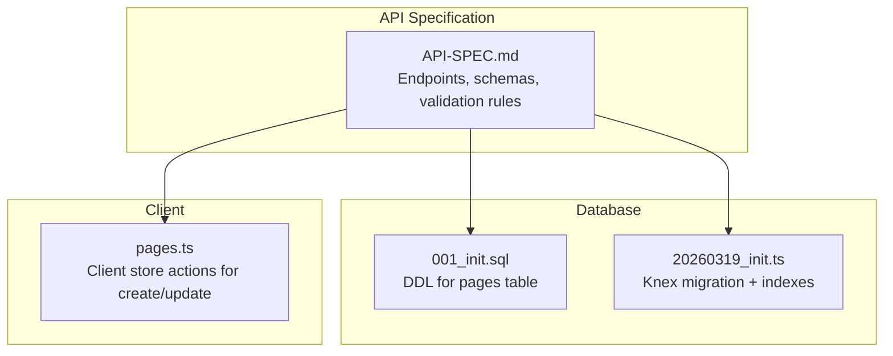

**Diagram sources**
- [API-SPEC.md:181-417](file://api-spec/API-SPEC.md#L181-L417)
- [001_init.sql:36-55](file://db/001_init.sql#L36-L55)
- [20260319_init.ts:46-101](file://code/server/src/db/migrations/20260319_init.ts#L46-L101)
- [pages.ts:73-104](file://code/client/src/stores/pages.ts#L73-L104)

**Section sources**
- [API-SPEC.md:181-417](file://api-spec/API-SPEC.md#L181-L417)
- [001_init.sql:36-55](file://db/001_init.sql#L36-L55)
- [20260319_init.ts:46-101](file://code/server/src/db/migrations/20260319_init.ts#L46-L101)
- [pages.ts:73-104](file://code/client/src/stores/pages.ts#L73-L104)

## Core Components
- Pages table schema defines content storage, hierarchy, ordering, soft-delete, and versioning.
- API specification defines endpoint contracts, request/response schemas, and validation rules.
- Client store demonstrates how the UI constructs initial content and ordering.

Key data model highlights:
- Content: JSONB field storing TipTap document structure
- Hierarchy: parent_id with self-referencing foreign key
- Ordering: integer order per user and parent grouping
- Soft delete: boolean flag with deleted_at timestamp
- Versioning: integer version incremented on updates

**Section sources**
- [001_init.sql:36-55](file://db/001_init.sql#L36-L55)
- [20260319_init.ts:46-101](file://code/server/src/db/migrations/20260319_init.ts#L46-L101)
- [API-SPEC.md:244-284](file://api-spec/API-SPEC.md#L244-L284)
- [API-SPEC.md:286-327](file://api-spec/API-SPEC.md#L286-L327)
- [API-SPEC.md:336-381](file://api-spec/API-SPEC.md#L336-L381)
- [API-SPEC.md:383-391](file://api-spec/API-SPEC.md#L383-L391)
- [API-SPEC.md:393-416](file://api-spec/API-SPEC.md#L393-L416)
- [pages.ts:73-104](file://code/client/src/stores/pages.ts#L73-L104)

## Architecture Overview
The page management endpoints follow a layered architecture:
- HTTP layer: Express routes receive requests
- Validation layer: Zod-based request validation
- Service layer: Business logic for CRUD, ordering, and hierarchy
- Persistence layer: Knex queries against PostgreSQL with JSONB content and indexes

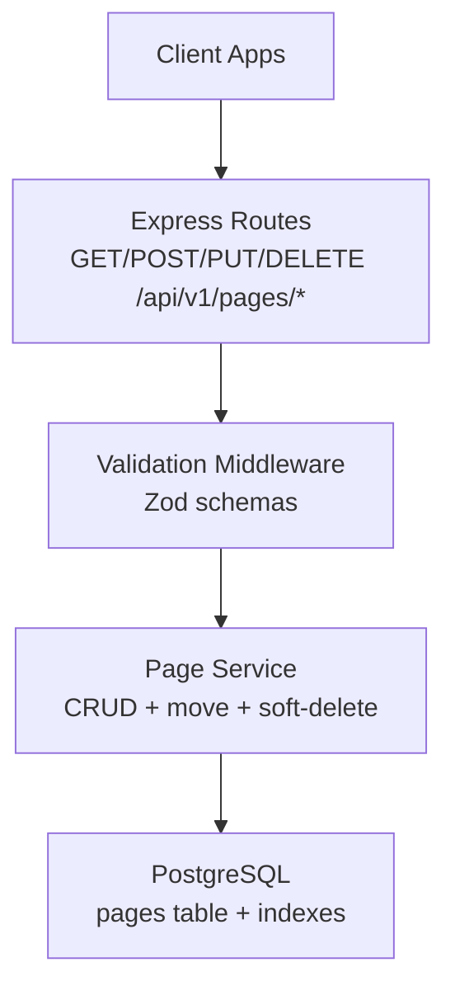

[No sources needed since this diagram shows conceptual workflow, not actual code structure]

## Detailed Component Analysis

### Endpoint: GET /api/v1/pages
- Purpose: List pages with optional tree or flattened mode
- Authentication: Required
- Query parameters:
  - tree: boolean, default false
  - parentId: string (UUID), filter by parent (root when null)
  - includeDeleted: boolean, only effective when tree=false
- Response:
  - Flattened: array of page objects without nested children
  - Tree: array of root pages with nested children arrays
- Behavior:
  - Tree mode excludes content, tags, and timestamps for sidebar rendering
  - Pagination is not supported for this endpoint

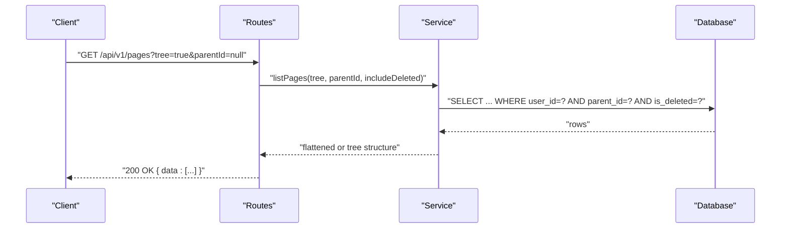

**Section sources**
- [API-SPEC.md:183-242](file://api-spec/API-SPEC.md#L183-L242)

### Endpoint: POST /api/v1/pages
- Purpose: Create a new page
- Authentication: Required
- Request body fields:
  - title: string, default "无标题"
  - content: object (TipTap JSON), default empty doc
  - parentId: string (UUID), null for root
  - order: integer, default append to siblings
  - icon: string, default "📄"
- Response: 201 with created page object
- Validation:
  - parentId must belong to current user
  - order must be non-negative
  - icon must be a valid short string
  - content must be valid TipTap JSON

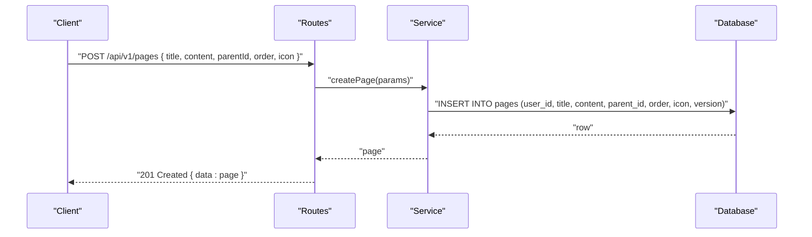

**Section sources**
- [API-SPEC.md:244-284](file://api-spec/API-SPEC.md#L244-L284)
- [pages.ts:73-93](file://code/client/src/stores/pages.ts#L73-L93)

### Endpoint: GET /api/v1/pages/:id
- Purpose: Retrieve a single page by ID
- Authentication: Required
- Path parameter: id (UUID)
- Response: Full page object including content, tags, timestamps
- Error responses:
  - 404 RESOURCE_NOT_FOUND if page does not exist or is deleted
  - 403 FORBIDDEN if page belongs to another user

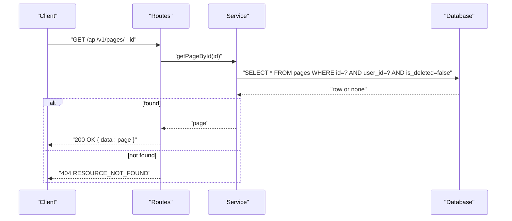

**Section sources**
- [API-SPEC.md:286-327](file://api-spec/API-SPEC.md#L286-L327)

### Endpoint: PUT /api/v1/pages/:id
- Purpose: Update an existing page (partial update)
- Authentication: Required
- Path parameter: id (UUID)
- Request body fields:
  - title: string
  - content: object (TipTap JSON, whole document replacement)
  - icon: string
- Optimistic locking:
  - Client sets If-Match header with expected version
  - Server compares and increments version on success
  - On mismatch: 409 Conflict
- Response: Updated page object with incremented version and updated_at

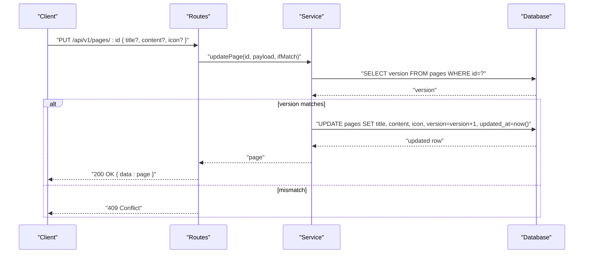

**Section sources**
- [API-SPEC.md:336-381](file://api-spec/API-SPEC.md#L336-L381)

### Endpoint: DELETE /api/v1/pages/:id
- Purpose: Soft delete a page
- Authentication: Required
- Behavior:
  - Set is_deleted = true and deleted_at = now()
  - Recursively soft-delete all descendants
- Response: 204 No Content

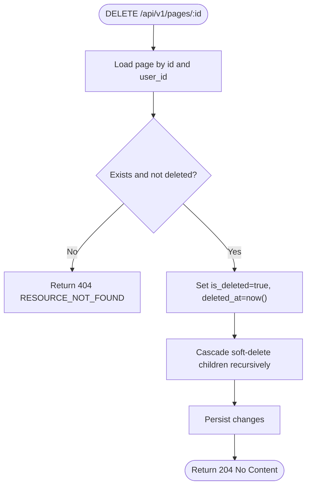

**Section sources**
- [API-SPEC.md:383-391](file://api-spec/API-SPEC.md#L383-L391)

### Endpoint: PUT /api/v1/pages/:id/move
- Purpose: Reorganize page hierarchy and/or order
- Authentication: Required
- Request body fields:
  - parentId: string (UUID), null to move to root
  - order: integer, new position among siblings
- Validation rules:
  - Cannot move a page under itself or its descendants (no cycles)
  - parentId must belong to current user
  - order must be non-negative
- Response: Updated page object (same as GET single page)

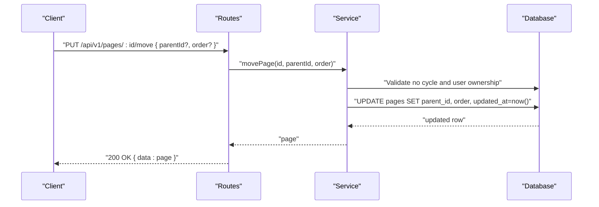

**Section sources**
- [API-SPEC.md:393-416](file://api-spec/API-SPEC.md#L393-L416)

### TipTap JSON Content Format
- Storage: JSONB column content
- Default: Empty document with type "doc" and empty content array
- Editing: Client-side TipTap editor produces this structure; server accepts full document replacement
- Search: Dedicated GIN index on content for efficient querying

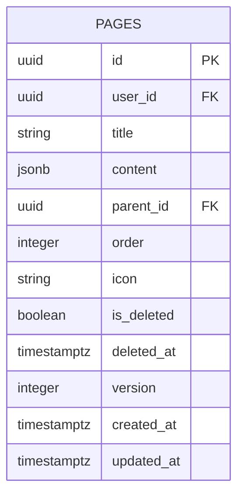

**Diagram sources**
- [001_init.sql:36-55](file://db/001_init.sql#L36-L55)
- [20260319_init.ts:46-101](file://code/server/src/db/migrations/20260319_init.ts#L46-L101)

**Section sources**
- [API-SPEC.md:244-284](file://api-spec/API-SPEC.md#L244-L284)
- [API-SPEC.md:286-327](file://api-spec/API-SPEC.md#L286-L327)
- [20260319_init.ts:77-82](file://code/server/src/db/migrations/20260319_init.ts#L77-L82)

### Version Control Mechanism
- Field: integer version with default 1
- Increment: On successful update, version increments by 1
- Optimistic lock: If-Match header carries expected version; mismatch yields 409 Conflict
- Client behavior: Store maintains local updatedAt and uses version for conflict resolution

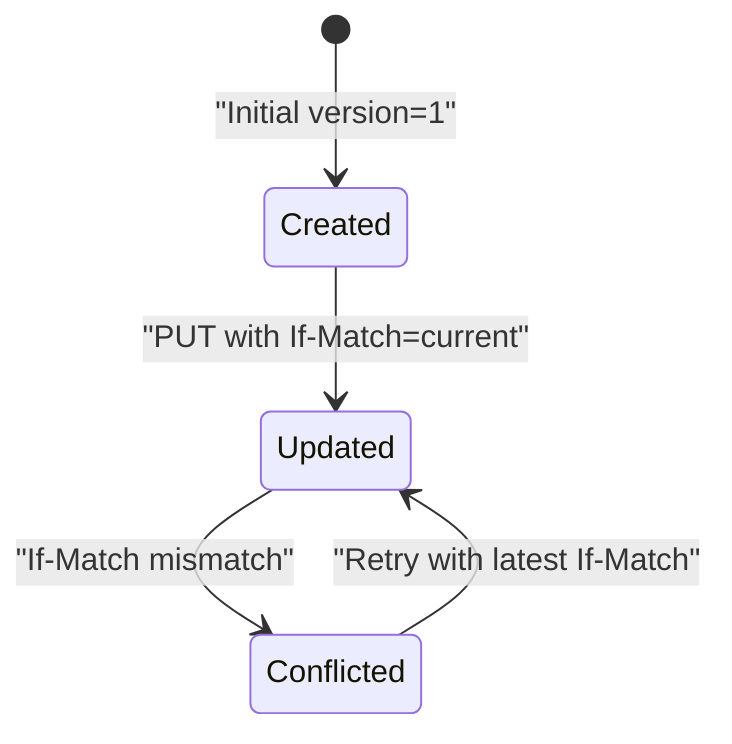

**Section sources**
- [API-SPEC.md:361](file://api-spec/API-SPEC.md#L361)
- [API-SPEC.md:336-381](file://api-spec/API-SPEC.md#L336-L381)
- [20260319_init.ts:56](file://code/server/src/db/migrations/20260319_init.ts#L56)

### Recursive Deletion Behavior
- Trigger: DELETE on a page cascades to all descendants
- Implementation: Foreign key with ON DELETE CASCADE on parent_id
- Effect: All child pages become soft-deleted with is_deleted=true and deleted_at set

**Section sources**
- [001_init.sql:41](file://db/001_init.sql#L41)
- [20260319_init.ts:51](file://code/server/src/db/migrations/20260319_init.ts#L51)
- [API-SPEC.md:389](file://api-spec/API-SPEC.md#L389)

## Dependency Analysis
- Client store creates pages with default content and order; relies on TipTap editor for content
- API specification defines strict schemas and validation rules
- Database enforces referential integrity, non-negative order, positive version, and cascade deletes
- Indexes support efficient listing, ordering, and search

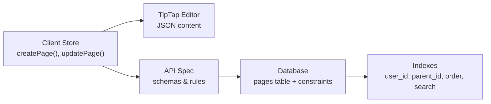

**Diagram sources**
- [pages.ts:73-104](file://code/client/src/stores/pages.ts#L73-L104)
- [API-SPEC.md:244-284](file://api-spec/API-SPEC.md#L244-L284)
- [001_init.sql:36-55](file://db/001_init.sql#L36-L55)
- [20260319_init.ts:65-82](file://code/server/src/db/migrations/20260319_init.ts#L65-L82)

**Section sources**
- [pages.ts:73-104](file://code/client/src/stores/pages.ts#L73-L104)
- [API-SPEC.md:244-284](file://api-spec/API-SPEC.md#L244-L284)
- [001_init.sql:36-55](file://db/001_init.sql#L36-L55)
- [20260319_init.ts:65-82](file://code/server/src/db/migrations/20260319_init.ts#L65-L82)

## Performance Considerations
- Indexes:
  - Composite index on (user_id, parent_id) supports fast subtree queries
  - Composite index on (user_id, COALESCE(parent_id, ...), order) ensures O(1) sibling ordering scans
  - GIN index on content enables efficient TipTap content search
- Pagination:
  - Listing endpoints do not support pagination; use clientId-side filtering for large trees
- Soft delete:
  - Filtering by is_deleted=false in WHERE clauses leverages indexes

[No sources needed since this section provides general guidance]

## Troubleshooting Guide
- 400 Bad Request:
  - Validation errors for missing or invalid fields (parentId, order, icon, content)
- 401 Unauthorized / 403 Forbidden:
  - Missing or invalid auth token, or accessing another user’s page
- 404 Resource Not Found:
  - Page does not exist or was deleted
- 409 Conflict:
  - Optimistic lock mismatch (If-Match version mismatch)
- 422 Unprocessable Entity:
  - Business rule violations (e.g., moving under self/child, invalid order)

**Section sources**
- [API-SPEC.md:54-87](file://api-spec/API-SPEC.md#L54-L87)
- [API-SPEC.md:336-381](file://api-spec/API-SPEC.md#L336-L381)
- [API-SPEC.md:383-391](file://api-spec/API-SPEC.md#L383-L391)
- [API-SPEC.md:393-416](file://api-spec/API-SPEC.md#L393-L416)

## Conclusion
The page management endpoints in Yule Notion provide a robust foundation for hierarchical note-taking with strong validation, optimistic concurrency control, and efficient indexing. The TipTap JSON content model integrates seamlessly with PostgreSQL JSONB storage, while soft deletion and recursive behavior ensure safe data lifecycle management.