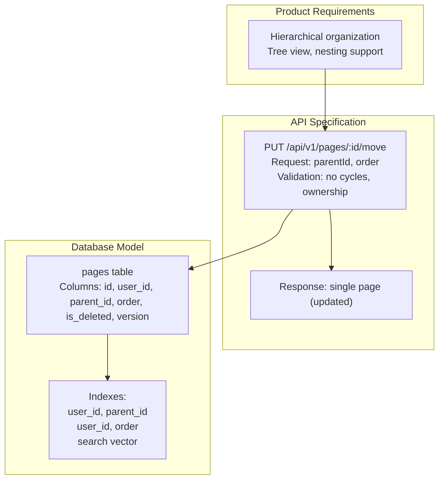
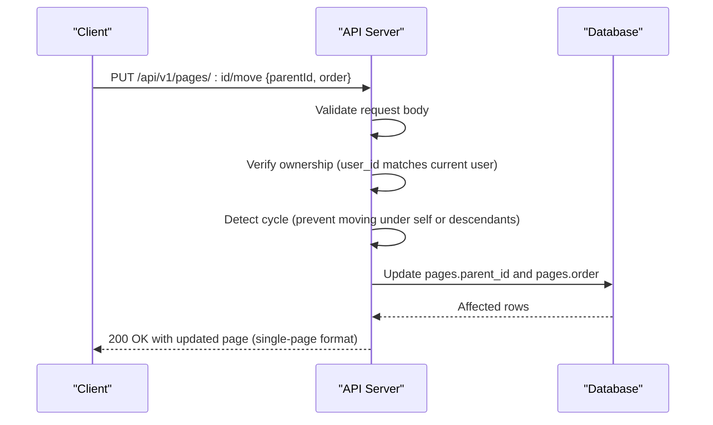
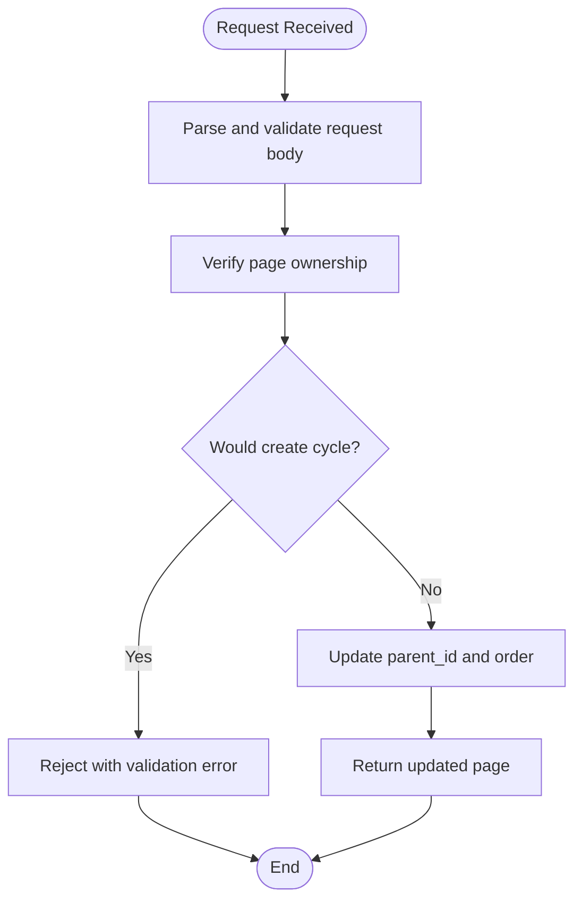
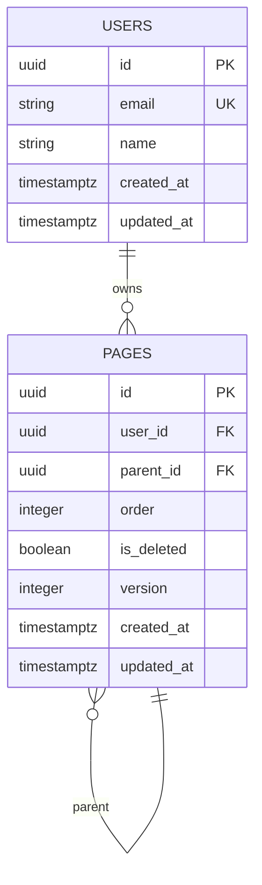
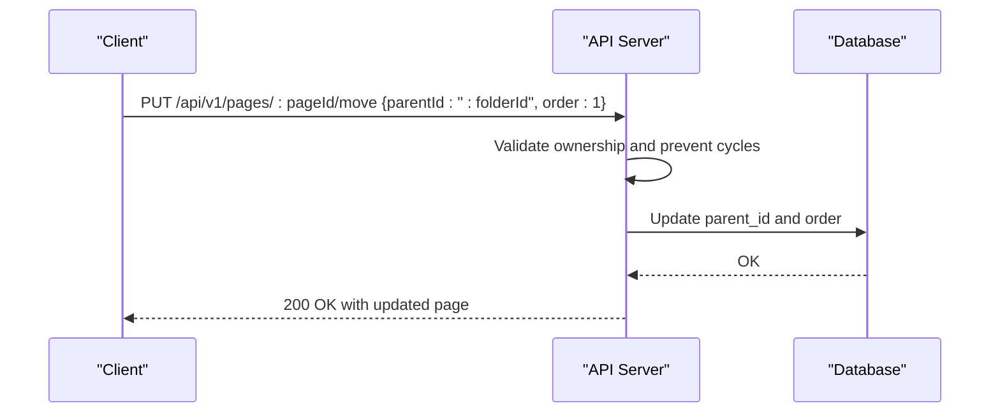
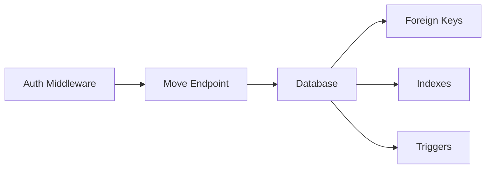

# Page Movement and Hierarchy Reorganization

<cite>
**Referenced Files in This Document**
- [API-SPEC.md](file://api-spec/API-SPEC.md)
- [001_init.sql](file://db/001_init.sql)
- [PRD-v1.0.md](file://prd/PRD-v1.0.md)
- [TEST-REPORT-M1-BACKEND.md](file://test/backend/TEST-REPORT-M1-BACKEND.md)
</cite>

## Table of Contents
1. [Introduction](#introduction)
2. [Project Structure](#project-structure)
3. [Core Components](#core-components)
4. [Architecture Overview](#architecture-overview)
5. [Detailed Component Analysis](#detailed-component-analysis)
6. [Dependency Analysis](#dependency-analysis)
7. [Performance Considerations](#performance-considerations)
8. [Troubleshooting Guide](#troubleshooting-guide)
9. [Conclusion](#conclusion)

## Introduction
This document explains the page movement functionality via the PUT /api/v1/pages/:id/move endpoint. It covers request parameters, validation rules, ownership checks, and the resulting page tree restructuring. It also documents the response format, edge cases, and performance considerations for large page hierarchies. Practical examples demonstrate moving pages between folders and reordering within the same level.

## Project Structure
The repository defines the page movement API contract and data model:
- API specification documents the endpoint, parameters, validation rules, and response format.
- Database schema defines the pages table with parent-child relationships and ordering.
- Product requirements describe hierarchical organization expectations.
- Backend tests validate adherence to the API specification and highlight database triggers impacting update timestamps.

**Diagram sources**
- [API-SPEC.md:393-416](file://api-spec/API-SPEC.md#L393-L416)
- [001_init.sql:36-76](file://db/001_init.sql#L36-L76)
- [PRD-v1.0.md:50-59](file://prd/PRD-v1.0.md#L50-L59)

**Section sources**
- [API-SPEC.md:393-416](file://api-spec/API-SPEC.md#L393-L416)
- [001_init.sql:36-76](file://db/001_init.sql#L36-L76)
- [PRD-v1.0.md:50-59](file://prd/PRD-v1.0.md#L50-L59)

## Core Components
- Endpoint: PUT /api/v1/pages/:id/move
- Request body supports two optional fields:
  - parentId: new parent page identifier (nullable to move to root)
  - order: new sibling order index (non-negative integer)
- Validation rules:
  - Prevents circular references (cannot move a page under itself or its descendants)
  - Ensures the target parentId belongs to the current user
- Response: Returns the updated page in the same format as GET /api/v1/pages/:id

Key data model elements:
- pages table with foreign keys and ordering
- Composite indexes supporting efficient tree queries and ordering

**Section sources**
- [API-SPEC.md:393-416](file://api-spec/API-SPEC.md#L393-L416)
- [001_init.sql:36-76](file://db/001_init.sql#L36-L76)

## Architecture Overview
The page movement operation updates a page’s parent and order while maintaining referential integrity and preventing invalid cycles. Ownership verification ensures the page belongs to the authenticated user.

**Diagram sources**
- [API-SPEC.md:393-416](file://api-spec/API-SPEC.md#L393-L416)
- [001_init.sql:36-76](file://db/001_init.sql#L36-L76)

## Detailed Component Analysis

### Endpoint Definition and Behavior
- Method and path: PUT /api/v1/pages/:id/move
- Authentication: required (Bearer token)
- Request body:
  - parentId: string | null
  - order: integer (non-negative)
- Validation rules:
  - No circular reference: moving a page under itself or its descendants is rejected
  - Ownership: parentId must belong to the current user
- Response: 200 OK with the updated page object (same as GET /api/v1/pages/:id)

**Diagram sources**
- [API-SPEC.md:393-416](file://api-spec/API-SPEC.md#L393-L416)

**Section sources**
- [API-SPEC.md:393-416](file://api-spec/API-SPEC.md#L393-L416)

### Data Model and Indexing Impacts
- The pages table stores hierarchical relationships via parent_id and maintains per-sibling order via order.
- Indexes optimize queries for user-scoped pages and sibling ordering.
- The search vector trigger focuses on title and content text extraction; it does not automatically update updated_at for all column changes.

**Diagram sources**
- [001_init.sql:14-76](file://db/001_init.sql#L14-L76)

**Section sources**
- [001_init.sql:36-76](file://db/001_init.sql#L36-L76)

### Validation and Edge Cases
- Circular reference prevention:
  - Reject attempts to move a page under itself or any descendant
  - Implementation typically traverses ancestors to detect cycles
- Ownership verification:
  - Ensure the target parentId (if present) belongs to the current user
- Partial updates:
  - Either parentId or order can be omitted; the other remains unchanged
- Root-level moves:
  - Setting parentId to null moves the page to the root level under the current user
- Ordering semantics:
  - order is a zero-based index among siblings; values outside the current sibling count are normalized by existing constraints

**Section sources**
- [API-SPEC.md:411-415](file://api-spec/API-SPEC.md#L411-L415)

### Response Format
- Status: 200 OK
- Body: Single page object with fields including id, title, content, parentId, order, icon, tags, isDeleted, version, createdAt, updatedAt
- The response mirrors the single-page GET endpoint format

**Section sources**
- [API-SPEC.md:415-416](file://api-spec/API-SPEC.md#L415-L416)

### Practical Examples

#### Example 1: Moving a page into a folder (new parent)
- Request: PUT /api/v1/pages/:pageId/move with { parentId: ":folderId", order: 1 }
- Effect: The page becomes a child of :folderId and placed as the second sibling
- Preconditions: :folderId exists and belongs to the current user; no circular reference

#### Example 2: Moving a page out of a folder (root-level)
- Request: PUT /api/v1/pages/:pageId/move with { parentId: null, order: 0 }
- Effect: The page becomes a root-level page and the first sibling

#### Example 3: Reordering within the same parent
- Request: PUT /api/v1/pages/:pageId/move with { order: 3 }
- Effect: The page retains its parent but is repositioned as the fourth sibling

**Diagram sources**
- [API-SPEC.md:393-416](file://api-spec/API-SPEC.md#L393-L416)

**Section sources**
- [API-SPEC.md:393-416](file://api-spec/API-SPEC.md#L393-L416)

## Dependency Analysis
- API depends on:
  - Authentication middleware to resolve the current user
  - Database layer to enforce referential integrity and ordering
- Database constraints:
  - Foreign keys maintain parent-child relationships
  - Indexes support efficient tree traversal and sibling ordering
- Triggers:
  - Search vector trigger updates search index and updated_at for specific column changes
  - Note: The trigger does not update updated_at for all column changes (see testing report)

**Diagram sources**
- [001_init.sql:36-76](file://db/001_init.sql#L36-L76)
- [TEST-REPORT-M1-BACKEND.md:214-229](file://test/backend/TEST-REPORT-M1-BACKEND.md#L214-L229)

**Section sources**
- [001_init.sql:36-76](file://db/001_init.sql#L36-L76)
- [TEST-REPORT-M1-BACKEND.md:214-229](file://test/backend/TEST-REPORT-M1-BACKEND.md#L214-L229)

## Performance Considerations
- Tree operations scale with depth and branching factor. For large hierarchies:
  - Minimize unnecessary updates by batching moves when possible
  - Use sibling order updates to reduce index churn
  - Leverage existing composite indexes on (user_id, parent_id) and (user_id, order) to keep queries efficient
- Concurrency:
  - Use optimistic locking (version) during updates to avoid conflicts
  - Apply database transactions for atomicity when updating order and parent in a single operation
- Index maintenance:
  - Frequent reordering may cause index rebalancing; batch operations where feasible

[No sources needed since this section provides general guidance]

## Troubleshooting Guide
Common issues and resolutions:
- Validation errors (400):
  - Invalid parentId or missing permissions
  - Attempted circular reference
- Ownership errors (403):
  - Target parentId does not belong to the current user
- Resource not found (404):
  - Page ID does not exist or was deleted
- Unexpected updated_at:
  - The search vector trigger updates updated_at only for title/content changes; other updates may not refresh timestamps

**Section sources**
- [API-SPEC.md:411-415](file://api-spec/API-SPEC.md#L411-L415)
- [TEST-REPORT-M1-BACKEND.md:214-229](file://test/backend/TEST-REPORT-M1-BACKEND.md#L214-L229)

## Conclusion
The PUT /api/v1/pages/:id/move endpoint enables flexible page hierarchy reorganization with robust validation against cycles and ownership. Its response aligns with the single-page GET format, ensuring consistent client handling. For large hierarchies, careful batching and awareness of index behavior improve performance and reliability.