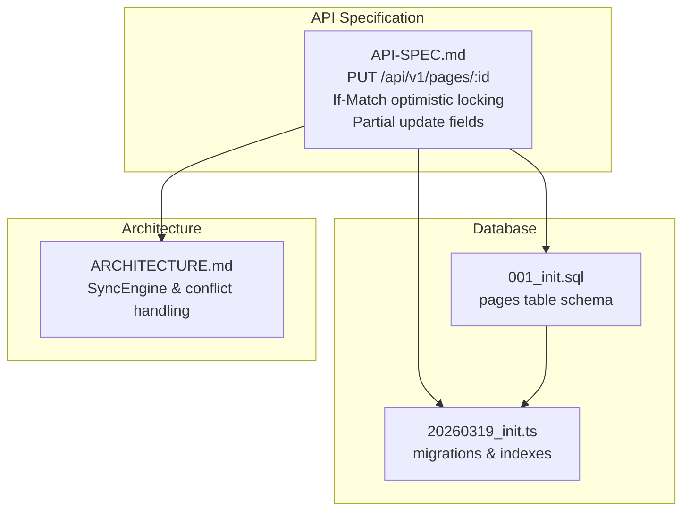
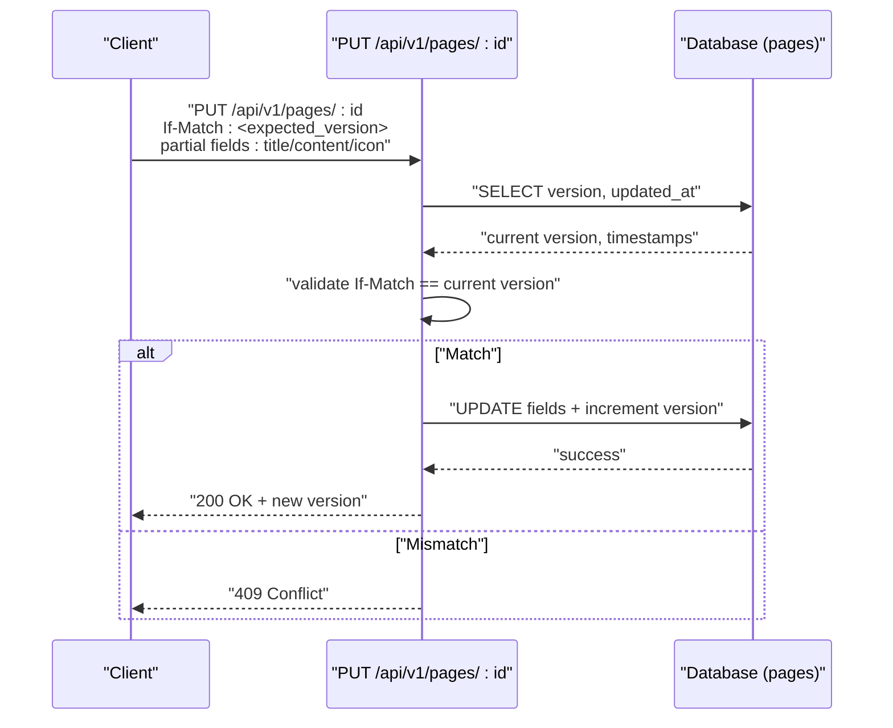
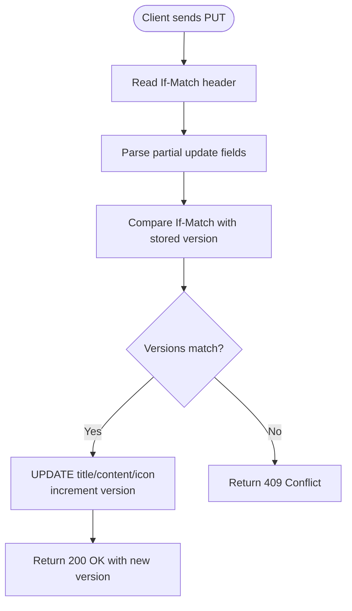
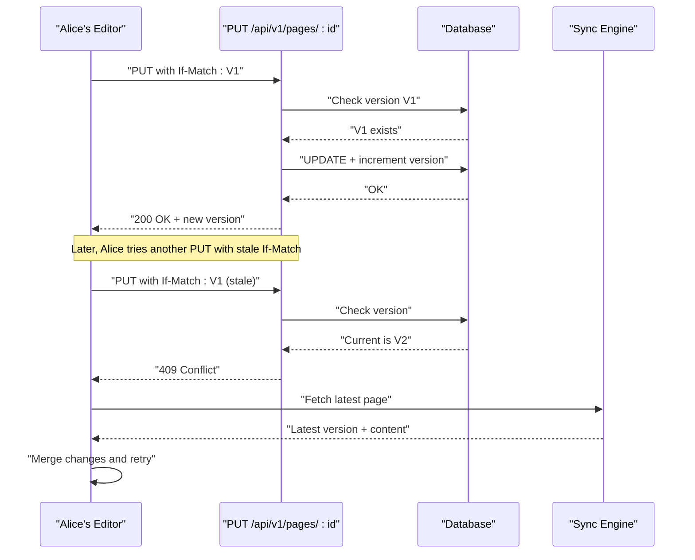
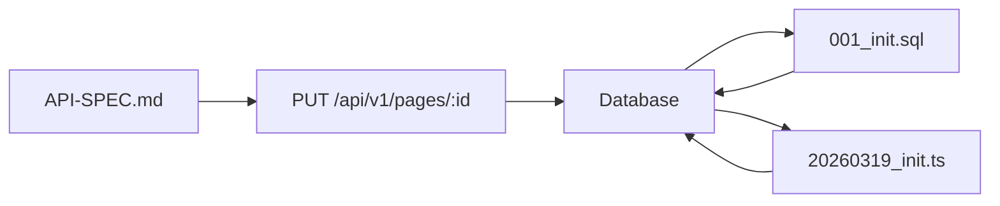

# Page Updates and Optimistic Locking

<cite>
**Referenced Files in This Document**
- [API-SPEC.md](file://api-spec/API-SPEC.md)
- [ARCHITECTURE.md](file://arch/ARCHITECTURE.md)
- [20260319_init.ts](file://code/server/src/db/migrations/20260319_init.ts)
- [001_init.sql](file://db/001_init.sql)
- [TEST-REPORT-M1-BACKEND.md](file://test/backend/TEST-REPORT-M1-BACKEND.md)
</cite>

## Table of Contents
1. [Introduction](#introduction)
2. [Project Structure](#project-structure)
3. [Core Components](#core-components)
4. [Architecture Overview](#architecture-overview)
5. [Detailed Component Analysis](#detailed-component-analysis)
6. [Dependency Analysis](#dependency-analysis)
7. [Performance Considerations](#performance-considerations)
8. [Troubleshooting Guide](#troubleshooting-guide)
9. [Conclusion](#conclusion)

## Introduction
This document explains the page update mechanism via the PUT /api/v1/pages/:id endpoint, focusing on optimistic locking using If-Match headers, version-based conflict detection, partial update capabilities for title, content, and icon fields, TipTap JSON replacement semantics, and automatic version incrementing. It also covers practical examples of concurrent editing scenarios, error handling for version mismatches, and best practices for implementing optimistic locking in client applications.

## Project Structure
The relevant parts of the repository for page updates and optimistic locking are:
- API specification defining the endpoint contract, request/response shapes, and optimistic locking behavior
- Database schema and migration defining the pages table, version field, and indexes
- Backend architecture documentation describing the synchronization engine and conflict resolution strategy



**Diagram sources**
- [API-SPEC.md](file://api-spec/API-SPEC.md)
- [001_init.sql](file://db/001_init.sql)
- [20260319_init.ts](file://code/server/src/db/migrations/20260319_init.ts)
- [ARCHITECTURE.md](file://arch/ARCHITECTURE.md)

**Section sources**
- [API-SPEC.md](file://api-spec/API-SPEC.md)
- [001_init.sql](file://db/001_init.sql)
- [20260319_init.ts](file://code/server/src/db/migrations/20260319_init.ts)
- [ARCHITECTURE.md](file://arch/ARCHITECTURE.md)

## Core Components
- Endpoint contract: PUT /api/v1/pages/:id supports partial updates for title, content, and icon. The If-Match header carries the expected server version to enable optimistic locking.
- Versioning model: The pages table includes a version integer with a constraint ensuring positive values. The API response includes the current version after successful updates.
- TipTap JSON: The content field is a JSON object representing a TipTap document. Updates replace the entire content document; partial patches are not supported.
- Conflict detection: If the If-Match version does not match the current server version, the server returns a 409 Conflict response.
- Automatic version incrementing: The database enforces positive version values and the API returns the incremented version upon successful update.

**Section sources**
- [API-SPEC.md](file://api-spec/API-SPEC.md)
- [001_init.sql](file://db/001_init.sql)
- [20260319_init.ts](file://code/server/src/db/migrations/20260319_init.ts)

## Architecture Overview
The optimistic locking mechanism integrates with the broader synchronization strategy. The client sends updates with If-Match to prevent overwriting concurrent changes. If a conflict occurs, the client can either retry with the latest version or integrate with the sync engine that resolves conflicts using last-write-wins (LWW) based on timestamps.



**Diagram sources**
- [API-SPEC.md](file://api-spec/API-SPEC.md)
- [001_init.sql](file://db/001_init.sql)

## Detailed Component Analysis

### Endpoint Contract: PUT /api/v1/pages/:id
- Authentication: Required
- Path parameters: id (UUID)
- Request body (partial update):
  - title: string (optional)
  - content: object (TipTap JSON; replaces entire document; optional)
  - icon: string (Emoji; optional)
- If-Match header: carries the expected server version number
- Response: 200 OK with the updated page object including the new version
- Conflict: 409 Conflict when If-Match version does not match current server version



**Diagram sources**
- [API-SPEC.md](file://api-spec/API-SPEC.md)

**Section sources**
- [API-SPEC.md](file://api-spec/API-SPEC.md)

### Data Model: pages table and versioning
- Fields relevant to optimistic locking and updates:
  - version: integer, default 1, constrained > 0
  - updated_at: timestamp, updated on changes
  - content: JSONB (TipTap document)
- Indexes support efficient queries by user, parent, order, and updated_at
- The database schema ensures version integrity and enables fast lookups

```mermaid
erDiagram
PAGES {
uuid id PK
uuid user_id FK
string title
jsonb content
uuid parent_id FK
int "order"
string icon
boolean is_deleted
timestamptz deleted_at
int version
timestamptz created_at
timestamptz updated_at
}
```

**Diagram sources**
- [001_init.sql](file://db/001_init.sql)
- [20260319_init.ts](file://code/server/src/db/migrations/20260319_init.ts)

**Section sources**
- [001_init.sql](file://db/001_init.sql)
- [20260319_init.ts](file://code/server/src/db/migrations/20260319_init.ts)

### Concurrency Scenarios and Conflict Resolution Strategies
- Scenario A: Alice edits page X locally; Bob concurrently edits the same page.
  - Alice sends If-Match with her observed version.
  - If Bob’s update committed first, Alice’s If-Match will not match, resulting in 409 Conflict.
  - Strategy: Retry with latest version or show a merge dialog.
- Scenario B: Client-side optimistic UI updates without immediate server round-trip.
  - Best practice: Always fetch the latest version before sending If-Match.
  - If a conflict occurs, refresh the editor with server content and re-apply local changes.
- Scenario C: Partial offline edits (title/icon) plus online edits (content).
  - The endpoint supports partial updates; ensure the client merges changes carefully.
  - For content, treat TipTap JSON as a whole-document replacement.



**Diagram sources**
- [API-SPEC.md](file://api-spec/API-SPEC.md)
- [ARCHITECTURE.md](file://arch/ARCHITECTURE.md)

**Section sources**
- [API-SPEC.md](file://api-spec/API-SPEC.md)
- [ARCHITECTURE.md](file://arch/ARCHITECTURE.md)

### TipTap JSON Replacement Requirements
- The content field is a TipTap JSON document.
- Updates replace the entire content document; partial patching is not supported.
- Clients must send a complete TipTap JSON structure when updating content.
- When merging, clients should apply changes to the existing TipTap document and submit the full updated document.

**Section sources**
- [API-SPEC.md](file://api-spec/API-SPEC.md)

### Automatic Version Incrementing
- The database enforces version > 0 and defaults to 1.
- After a successful update, the API returns the incremented version.
- Clients should always read the returned version to keep their optimistic lock current.

**Section sources**
- [001_init.sql](file://db/001_init.sql)
- [API-SPEC.md](file://api-spec/API-SPEC.md)

### Proper Header Usage Patterns
- Always include If-Match: <current_server_version> when calling PUT /api/v1/pages/:id.
- If the server responds with 409 Conflict, refresh the page from the server, then retry with the latest If-Match value.
- For partial updates, only include the fields you intend to change (title, content, icon).

**Section sources**
- [API-SPEC.md](file://api-spec/API-SPEC.md)

### Best Practices for Client Applications
- Fetch the latest page before editing to obtain the current version.
- Use optimistic UI updates for responsiveness, but guard writes with If-Match.
- On 409 Conflict:
  - Refresh the editor with server content.
  - Merge local changes into the server-provided document.
  - Retry the update with the new If-Match value.
- For content updates, ensure TipTap JSON is a valid whole-document replacement.
- Integrate with the sync engine for cross-device conflict resolution using LWW timestamps when applicable.

**Section sources**
- [API-SPEC.md](file://api-spec/API-SPEC.md)
- [ARCHITECTURE.md](file://arch/ARCHITECTURE.md)

## Dependency Analysis
The optimistic locking behavior depends on:
- API-SPEC.md defining the endpoint contract and If-Match semantics
- Database schema enforcing version constraints and storing timestamps
- Migration scripts creating indexes that support efficient lookups



**Diagram sources**
- [API-SPEC.md](file://api-spec/API-SPEC.md)
- [001_init.sql](file://db/001_init.sql)
- [20260319_init.ts](file://code/server/src/db/migrations/20260319_init.ts)

**Section sources**
- [API-SPEC.md](file://api-spec/API-SPEC.md)
- [001_init.sql](file://db/001_init.sql)
- [20260319_init.ts](file://code/server/src/db/migrations/20260319_init.ts)

## Performance Considerations
- Indexes on user_id, parent_id, order, and updated_at support efficient queries and updates.
- The version field constraint ensures data integrity and avoids negative versions.
- TipTap JSONB indexing improves search and retrieval performance for content-heavy pages.

**Section sources**
- [20260319_init.ts](file://code/server/src/db/migrations/20260319_init.ts)
- [001_init.sql](file://db/001_init.sql)

## Troubleshooting Guide
- Symptom: 409 Conflict on PUT /api/v1/pages/:id
  - Cause: If-Match version does not match current server version
  - Resolution: Refresh the page, obtain the latest version, then retry with updated If-Match
- Symptom: Last edited time appears stale after updates
  - Cause: Trigger condition only updates updated_at when title or content changes
  - Resolution: Apply recommended trigger fix to ensure updated_at updates on all relevant column changes
- Symptom: Content changes not reflected
  - Cause: Sending partial content instead of a full TipTap JSON document
  - Resolution: Submit a complete TipTap JSON replacing the entire content

**Section sources**
- [API-SPEC.md](file://api-spec/API-SPEC.md)
- [TEST-REPORT-M1-BACKEND.md](file://test/backend/TEST-REPORT-M1-BACKEND.md)

## Conclusion
The PUT /api/v1/pages/:id endpoint provides robust optimistic locking via If-Match headers and version-based conflict detection. Clients should always include the latest If-Match value, handle 409 Conflict by refreshing and retrying, and treat content updates as whole-document replacements using TipTap JSON. The database schema and indexes support efficient operations, while the sync engine offers a complementary LWW strategy for cross-device conflicts.