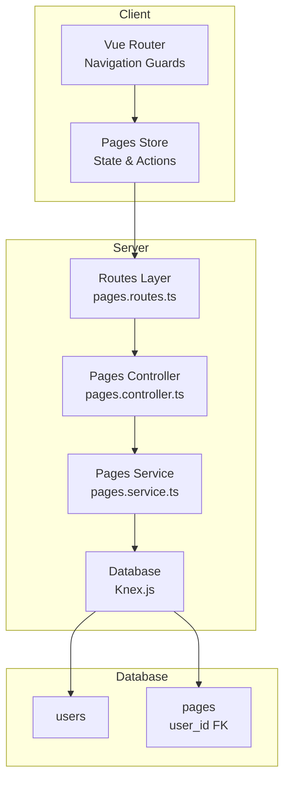
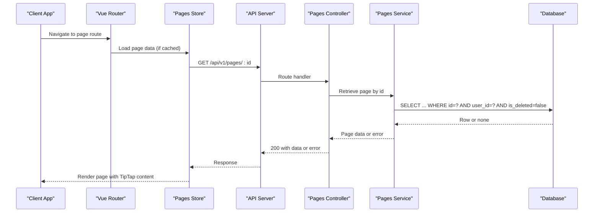
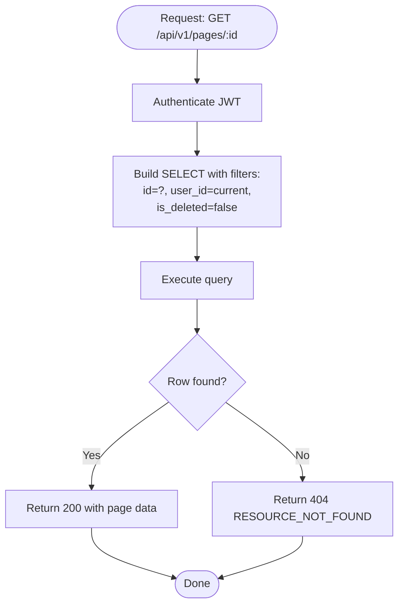
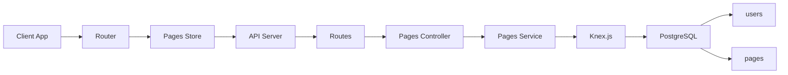

# Single Page Retrieval and Access Control

<cite>
**Referenced Files in This Document**
- [API-SPEC.md](file://api-spec/API-SPEC.md)
- [001_init.sql](file://db/001_init.sql)
- [ARCHITECTURE.md](file://arch/ARCHITECTURE.md)
- [pages.ts](file://code/client/src/stores/pages.ts)
- [index.ts](file://code/client/src/router/index.ts)
</cite>

## Table of Contents
1. [Introduction](#introduction)
2. [Project Structure](#project-structure)
3. [Core Components](#core-components)
4. [Architecture Overview](#architecture-overview)
5. [Detailed Component Analysis](#detailed-component-analysis)
6. [Dependency Analysis](#dependency-analysis)
7. [Performance Considerations](#performance-considerations)
8. [Troubleshooting Guide](#troubleshooting-guide)
9. [Conclusion](#conclusion)

## Introduction
This document explains the single page retrieval mechanism via the GET /api/v1/pages/:id endpoint. It covers the complete response schema (including TipTap JSON content, metadata, and associations), access control guarantees that prevent users from viewing others' pages, error handling for missing or inaccessible resources, and the distinction between deleted and inaccessible pages. It also provides examples of retrieving pages with different content types and demonstrates proper error responses for unauthorized access attempts.

## Project Structure
The retrieval flow spans client-side navigation and state management, server-side routing and controllers, and database-level access control enforced by foreign keys and indexes.

**Diagram sources**
- [index.ts:1-54](file://code/client/src/router/index.ts#L1-L54)
- [pages.ts:1-164](file://code/client/src/stores/pages.ts#L1-L164)
- [ARCHITECTURE.md:238-286](file://arch/ARCHITECTURE.md#L238-L286)
- [001_init.sql:36-55](file://db/001_init.sql#L36-L55)

**Section sources**
- [index.ts:1-54](file://code/client/src/router/index.ts#L1-L54)
- [pages.ts:1-164](file://code/client/src/stores/pages.ts#L1-L164)
- [ARCHITECTURE.md:238-286](file://arch/ARCHITECTURE.md#L238-L286)
- [001_init.sql:36-55](file://db/001_init.sql#L36-L55)

## Core Components
- Endpoint: GET /api/v1/pages/:id
- Authentication: Required (Bearer JWT)
- Authorization: Enforced per-resource ownership via user_id foreign key
- Response: Single-page payload with TipTap JSON content and metadata
- Error handling: 404 for resource not found/deleted; 403 for forbidden access

Response schema highlights:
- id: UUID
- title: string
- content: TipTap JSON (JSONB)
- parentId: UUID | null
- order: integer
- icon: string
- tags: string[]
- isDeleted: boolean
- version: integer
- createdAt: ISO 8601 UTC
- updatedAt: ISO 8601 UTC

Access control:
- All queries automatically filter by current user’s id
- Foreign key constraint ensures pages.user_id references users(id)
- Indexes on (user_id, parent_id) and (user_id, order) enforce isolation and efficient queries

**Section sources**
- [API-SPEC.md:286-335](file://api-spec/API-SPEC.md#L286-L335)
- [001_init.sql:36-55](file://db/001_init.sql#L36-L55)
- [001_init.sql:58-62](file://db/001_init.sql#L58-L62)
- [ARCHITECTURE.md:521-531](file://arch/ARCHITECTURE.md#L521-L531)

## Architecture Overview
The retrieval process follows a layered pattern:
- Client triggers navigation/state updates
- Server routes the request to the Pages controller
- Controller delegates to service layer
- Service executes database query filtered by user context
- Database enforces referential integrity and isolation

**Diagram sources**
- [index.ts:1-54](file://code/client/src/router/index.ts#L1-L54)
- [pages.ts:1-164](file://code/client/src/stores/pages.ts#L1-L164)
- [ARCHITECTURE.md:238-286](file://arch/ARCHITECTURE.md#L238-L286)
- [001_init.sql:36-55](file://db/001_init.sql#L36-L55)

## Detailed Component Analysis

### Response Schema Definition
The single-page response includes:
- Identity: id, title
- Structure: parentId, order
- Presentation: icon
- Content: content (TipTap JSON)
- Associations: tags (UUID list)
- Lifecycle: version, createdAt, updatedAt
- Deletion: isDeleted, deleted_at

TipTap JSON content is stored as JSONB in the database and returned verbatim. The schema supports headings, paragraphs, lists, code blocks, blockquotes, and images as documented in the API specification.

**Section sources**
- [API-SPEC.md:298-326](file://api-spec/API-SPEC.md#L298-L326)
- [001_init.sql:40-40](file://db/001_init.sql#L40-L40)

### Access Control Mechanisms
- Ownership enforcement: Queries are filtered by user_id to ensure users can only access their own pages.
- Foreign key constraint: pages.user_id references users(id), preventing orphaned or misassigned records.
- Index isolation: Composite indexes on (user_id, parent_id) and (user_id, order) maintain per-user ordering and subtree integrity.
- Soft deletion: is_deleted flag allows pages to be hidden from normal listings while still being retrievable by owners until cleanup.

**Diagram sources**
- [API-SPEC.md:286-335](file://api-spec/API-SPEC.md#L286-L335)
- [001_init.sql:36-55](file://db/001_init.sql#L36-L55)
- [001_init.sql:58-62](file://db/001_init.sql#L58-L62)

**Section sources**
- [API-SPEC.md:286-335](file://api-spec/API-SPEC.md#L286-L335)
- [001_init.sql:36-55](file://db/001_init.sql#L36-L55)
- [001_init.sql:58-62](file://db/001_init.sql#L58-L62)

### Error Handling: Non-existent vs. Inaccessible
- 404 RESOURCE_NOT_FOUND: Returned when the requested page does not exist or has been soft-deleted by the current user.
- 403 FORBIDDEN: Returned when the page exists but belongs to another user (ownership violation).

These semantics distinguish between:
- Deleted/inaccessible pages (404): The page is not visible to the requester (either deleted or owned by someone else).
- Other users’ pages (403): The page exists but access is denied due to ownership.

**Section sources**
- [API-SPEC.md:329-334](file://api-spec/API-SPEC.md#L329-L334)

### Examples of Retrieving Pages with Different Content Types
- Plain text page: content contains a paragraph with text nodes.
- Headings and paragraphs: content includes heading blocks with level attributes and paragraph blocks.
- Mixed content: content includes multiple block types (headings, paragraphs, lists, code blocks, blockquotes, images).
- Empty page: content defaults to an empty doc with a single paragraph block.

These examples are derived from the TipTap JSON structure documented in the API specification.

**Section sources**
- [API-SPEC.md:298-326](file://api-spec/API-SPEC.md#L298-L326)

### Unauthorized Access Attempts
- Missing or invalid Authorization header: Should result in 401 UNAUTHORIZED before reaching page retrieval logic.
- Expired token: 401 TOKEN_EXPIRED.
- Insufficient permissions: 403 FORBIDDEN for cross-user access attempts.

Client-side navigation guards ensure protected routes require authentication, reducing the chance of unauthorized requests.

**Section sources**
- [API-SPEC.md:54-86](file://api-spec/API-SPEC.md#L54-L86)
- [index.ts:1-54](file://code/client/src/router/index.ts#L1-L54)

## Dependency Analysis
The retrieval pipeline depends on:
- Client-side navigation and state management to trigger requests
- Server-side routing and controllers to validate and authorize
- Service layer to encapsulate database access
- Database constraints and indexes to enforce ownership and performance

**Diagram sources**
- [index.ts:1-54](file://code/client/src/router/index.ts#L1-L54)
- [pages.ts:1-164](file://code/client/src/stores/pages.ts#L1-L164)
- [ARCHITECTURE.md:238-286](file://arch/ARCHITECTURE.md#L238-L286)
- [001_init.sql:36-55](file://db/001_init.sql#L36-L55)

**Section sources**
- [ARCHITECTURE.md:238-286](file://arch/ARCHITECTURE.md#L238-L286)
- [001_init.sql:36-55](file://db/001_init.sql#L36-L55)

## Performance Considerations
- Index usage: Queries leverage (user_id, parent_id) and (user_id, order) indexes to efficiently filter by owner and sort siblings.
- JSONB content: TipTap JSON is stored as JSONB, enabling native indexing and efficient querying where needed.
- Soft deletion: is_deleted filtering avoids scanning deleted rows, keeping retrieval fast for active pages.

**Section sources**
- [001_init.sql:58-62](file://db/001_init.sql#L58-L62)
- [001_init.sql:70-75](file://db/001_init.sql#L70-L75)

## Troubleshooting Guide
Common issues and resolutions:
- 404 RESOURCE_NOT_FOUND:
  - Verify the page id is correct and belongs to the current user.
  - Confirm the page is not soft-deleted by the user.
- 403 FORBIDDEN:
  - Ensure the requesting user owns the page.
  - Check that the Authorization header is present and valid.
- 401 UNAUTHORIZED:
  - Re-authenticate and refresh the token.
- Unexpected empty content:
  - Confirm the content field is populated; default is an empty doc with a paragraph block.

Operational checks:
- Confirm JWT middleware is applied to the endpoint.
- Verify service-level filtering by user_id.
- Ensure database constraints and indexes are intact.

**Section sources**
- [API-SPEC.md:54-86](file://api-spec/API-SPEC.md#L54-L86)
- [API-SPEC.md:329-334](file://api-spec/API-SPEC.md#L329-L334)
- [001_init.sql:36-55](file://db/001_init.sql#L36-L55)

## Conclusion
GET /api/v1/pages/:id provides secure, per-user page retrieval with robust access control enforced at the database level. The response includes TipTap JSON content and rich metadata, enabling full-featured editing experiences. Clear error semantics differentiate between deleted/inaccessible pages (404) and cross-user access attempts (403). Proper indexing and foreign key constraints ensure performance and data integrity.