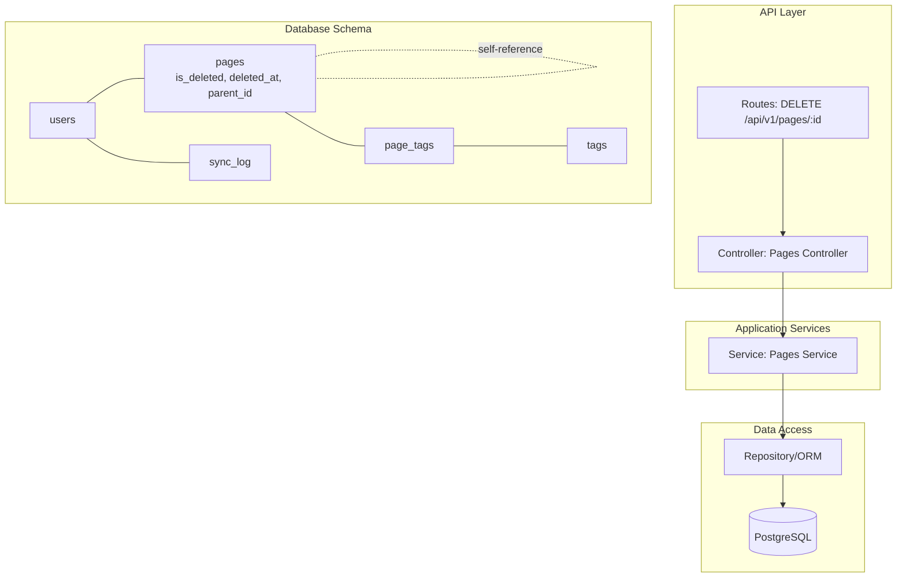
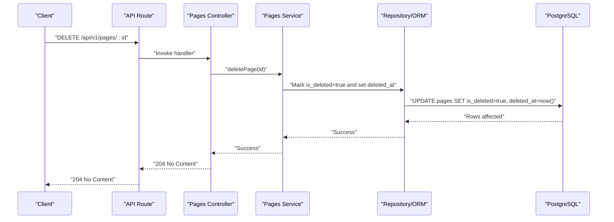
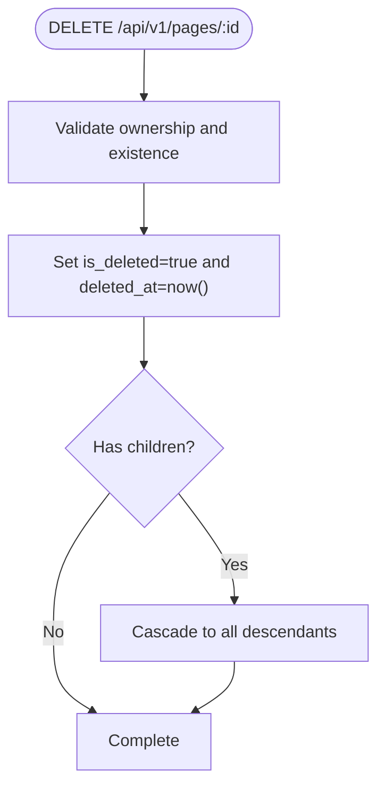
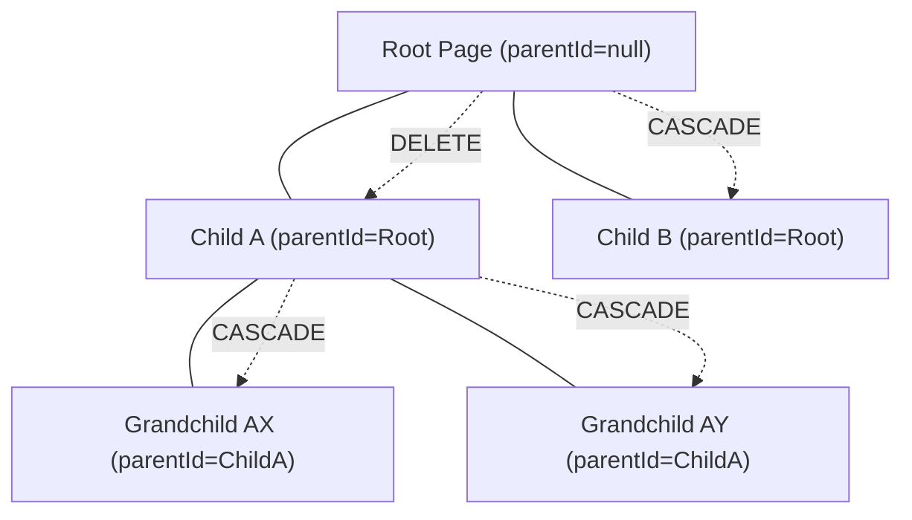
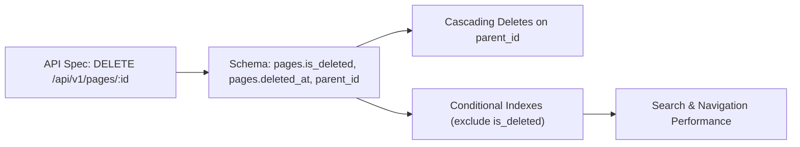

# Soft Deletion and Hierarchical Effects

<cite>
**Referenced Files in This Document**
- [ARCHITECTURE.md](file://arch/ARCHITECTURE.md)
- [API-SPEC.md](file://api-spec/API-SPEC.md)
- [001_init.sql](file://db/001_init.sql)
- [ER-DIAGRAM.md](file://db/ER-DIAGRAM.md)
</cite>

## Table of Contents
1. [Introduction](#introduction)
2. [Project Structure](#project-structure)
3. [Core Components](#core-components)
4. [Architecture Overview](#architecture-overview)
5. [Detailed Component Analysis](#detailed-component-analysis)
6. [Dependency Analysis](#dependency-analysis)
7. [Performance Considerations](#performance-considerations)
8. [Troubleshooting Guide](#troubleshooting-guide)
9. [Conclusion](#conclusion)

## Introduction
This document explains the page deletion mechanism in the system, focusing on the DELETE /api/v1/pages/:id endpoint. It covers the soft delete implementation using an is_deleted flag and timestamp recording, the recursive deletion behavior across the page hierarchy, and the resulting impacts on search indexing and navigation. It also documents the 204 No Content response format, access control for deletion operations, and demonstrates hierarchical cascade effects with practical examples.

## Project Structure
The deletion behavior is defined by the API specification and implemented via database-level cascading and application-level policies:
- API specification defines the DELETE endpoint semantics, response format, and access control.
- Database schema defines soft delete fields and foreign key cascades.
- Architecture documentation describes the data model and indexing strategy that underpin search and navigation.

**Diagram sources**
- [API-SPEC.md:383-392](file://api-spec/API-SPEC.md#L383-L392)
- [001_init.sql:36-55](file://db/001_init.sql#L36-L55)
- [ER-DIAGRAM.md:10-78](file://db/ER-DIAGRAM.md#L10-L78)

**Section sources**
- [API-SPEC.md:181-417](file://api-spec/API-SPEC.md#L181-L417)
- [001_init.sql:36-76](file://db/001_init.sql#L36-L76)
- [ARCHITECTURE.md:534-544](file://arch/ARCHITECTURE.md#L534-L544)

## Core Components
- DELETE /api/v1/pages/:id endpoint:
  - Behavior: Soft delete with is_deleted = true and deleted_at = current timestamp.
  - Recursive deletion: Deleting a parent page triggers cascading soft deletion of all descendants.
  - Response: 204 No Content (no response body).
  - Access control: Requires authentication; enforces ownership via userId filtering.
- Database schema:
  - pages table includes is_deleted and deleted_at for soft delete.
  - parent_id enables adjacency-list tree with self-referencing foreign key.
  - Cascading deletes on parent_id ensure recursive deletion.
- Indexing and search:
  - Conditional indexes exclude deleted pages (is_deleted = FALSE) to keep queries fast and navigation clean.
  - Full-text search vector supports efficient search across titles and content.

**Section sources**
- [API-SPEC.md:383-392](file://api-spec/API-SPEC.md#L383-L392)
- [001_init.sql:36-76](file://db/001_init.sql#L36-L76)
- [ER-DIAGRAM.md:101-104](file://db/ER-DIAGRAM.md#L101-L104)
- [ARCHITECTURE.md:538-541](file://arch/ARCHITECTURE.md#L538-L541)

## Architecture Overview
The deletion flow integrates API, service, and database layers with cascading effects:

**Diagram sources**
- [API-SPEC.md:383-392](file://api-spec/API-SPEC.md#L383-L392)
- [001_init.sql:44-45](file://db/001_init.sql#L44-L45)

## Detailed Component Analysis

### Soft Delete Implementation
- Fields:
  - is_deleted: Boolean flag indicating soft-deleted state.
  - deleted_at: Timestamp when the deletion occurred.
- Behavior:
  - On DELETE /api/v1/pages/:id, the server sets is_deleted = true and records deleted_at.
  - Recursively applies to all descendants due to parent_id foreign key cascade.
- Ownership enforcement:
  - All page queries and mutations filter by userId to prevent cross-user access.

**Diagram sources**
- [API-SPEC.md:383-392](file://api-spec/API-SPEC.md#L383-L392)
- [001_init.sql:41-45](file://db/001_init.sql#L41-L45)

**Section sources**
- [API-SPEC.md:383-392](file://api-spec/API-SPEC.md#L383-L392)
- [001_init.sql:44-45](file://db/001_init.sql#L44-L45)

### Recursive Deletion and Hierarchy Effects
- Tree model:
  - Adjacency-list with parent_id referencing pages.id.
  - Cascading deletes on parent_id propagate deletions to all descendants.
- Impact on navigation:
  - Conditional indexes exclude deleted pages, ensuring navigation lists remain fast and uncluttered.
- Example scenarios:
  - Deleting a root page: All descendants become recursively soft-deleted.
  - Deleting a nested child page: Only that subtree is affected.

**Diagram sources**
- [001_init.sql:41-45](file://db/001_init.sql#L41-L45)
- [ER-DIAGRAM.md:101-104](file://db/ER-DIAGRAM.md#L101-L104)

**Section sources**
- [001_init.sql:41-45](file://db/001_init.sql#L41-L45)
- [ER-DIAGRAM.md:101-104](file://db/ER-DIAGRAM.md#L101-L104)

### Response Format and Access Control
- Response:
  - 204 No Content upon successful soft deletion.
- Authentication and authorization:
  - All endpoints require a valid Bearer token.
  - Operations are scoped to the authenticated user’s data via userId filtering.

**Section sources**
- [API-SPEC.md:383-392](file://api-spec/API-SPEC.md#L383-L392)
- [API-SPEC.md:12-24](file://api-spec/API-SPEC.md#L12-L24)

### Impact on Search Indexing and Navigation
- Search indexing:
  - Full-text search vector maintained by a trigger; content extraction occurs on insert/update.
  - Deleted pages are excluded from conditional indexes, keeping search performance optimal.
- Navigation:
  - Sidebars and tree views rely on filtered queries that ignore is_deleted = TRUE, preventing deleted items from appearing in UI.

**Section sources**
- [001_init.sql:50-68](file://db/001_init.sql#L50-L68)
- [ARCHITECTURE.md:538-541](file://arch/ARCHITECTURE.md#L538-L541)

## Dependency Analysis
The deletion mechanism depends on:
- API specification for endpoint behavior and response.
- Database schema for soft delete fields and cascading foreign keys.
- Indexes that conditionally exclude deleted rows for performance.

**Diagram sources**
- [API-SPEC.md:383-392](file://api-spec/API-SPEC.md#L383-L392)
- [001_init.sql:36-76](file://db/001_init.sql#L36-L76)
- [ER-DIAGRAM.md:130-144](file://db/ER-DIAGRAM.md#L130-L144)

**Section sources**
- [API-SPEC.md:383-392](file://api-spec/API-SPEC.md#L383-L392)
- [001_init.sql:36-76](file://db/001_init.sql#L36-L76)
- [ER-DIAGRAM.md:130-144](file://db/ER-DIAGRAM.md#L130-L144)

## Performance Considerations
- Conditional indexes on user_id with is_deleted filters ensure efficient queries for active pages.
- Full-text search GIN index remains unaffected by soft deletes because queries exclude deleted rows.
- Cascading deletes occur at the database level, minimizing application-side traversal overhead.

[No sources needed since this section provides general guidance]

## Troubleshooting Guide
- Symptom: Deleted page still appears in navigation.
  - Cause: Query does not filter by is_deleted or userId.
  - Resolution: Ensure queries apply is_deleted = FALSE and user scoping.
- Symptom: Children not deleted after parent deletion.
  - Cause: Missing or disabled cascading foreign key on parent_id.
  - Resolution: Verify parent_id ON DELETE CASCADE is present.
- Symptom: Search results include deleted pages.
  - Cause: Search queries do not exclude is_deleted = TRUE.
  - Resolution: Confirm conditional indexes and queries exclude deleted pages.

**Section sources**
- [001_init.sql:58-68](file://db/001_init.sql#L58-L68)
- [ER-DIAGRAM.md:130-144](file://db/ER-DIAGRAM.md#L130-L144)

## Conclusion
The DELETE /api/v1/pages/:id endpoint implements a robust soft delete with clear recursive behavior across the page hierarchy. The combination of database-level cascades, explicit soft delete fields, and conditional indexes ensures predictable navigation and search performance. The 204 No Content response aligns with REST semantics for successful deletions without payload. Proper access control and userId scoping guarantee data isolation.