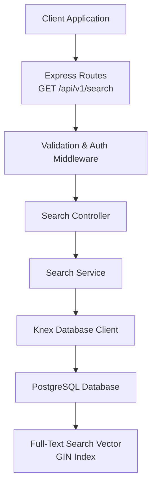
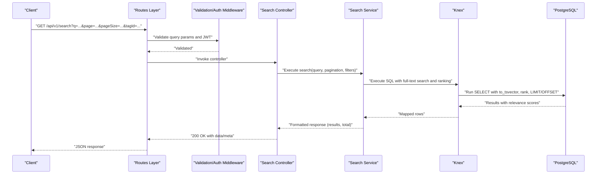
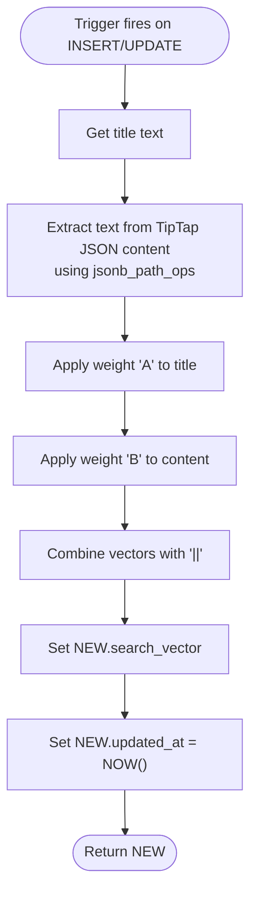
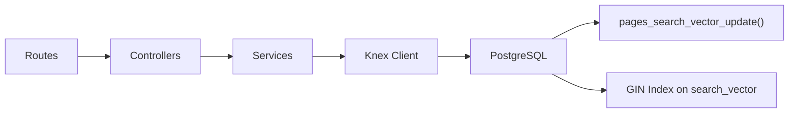

# Search Endpoints

<cite>
**Referenced Files in This Document**
- [API-SPEC.md](file://api-spec/API-SPEC.md)
- [20260319_init.ts](file://code/server/src/db/migrations/20260319_init.ts)
- [connection.ts](file://code/server/src/db/connection.ts)
- [auth.routes.ts](file://code/server/src/routes/auth.routes.ts)
- [app.ts](file://code/server/src/app.ts)
- [auth.service.ts](file://code/server/src/services/auth.service.ts)
- [TEST-REPORT-M1-BACKEND.md](file://test/backend/TEST-REPORT-M1-BACKEND.md)
</cite>

## Table of Contents
1. [Introduction](#introduction)
2. [Project Structure](#project-structure)
3. [Core Components](#core-components)
4. [Architecture Overview](#architecture-overview)
5. [Detailed Component Analysis](#detailed-component-analysis)
6. [Dependency Analysis](#dependency-analysis)
7. [Performance Considerations](#performance-considerations)
8. [Troubleshooting Guide](#troubleshooting-guide)
9. [Conclusion](#conclusion)

## Introduction
This document provides comprehensive API documentation for the search functionality endpoints, focusing on the GET /api/v1/search endpoint. It explains the query parameters, search algorithms, ranking mechanisms, result formatting with highlighted matches, and the PostgreSQL full-text search implementation. It also covers weighting strategies favoring title matches over content matches, snippet generation with keyword highlighting, pagination support, and integration patterns for front-end search interfaces.

## Project Structure
The search endpoint is part of the API specification and is implemented using PostgreSQL full-text search capabilities with automatic vector maintenance via triggers. The server uses Express with layered architecture (routes → controllers → services → database), and Knex for database operations.

**Diagram sources**
- [app.ts:107](file://code/server/src/app.ts#L107)
- [auth.routes.ts:10](file://code/server/src/routes/auth.routes.ts#L10)
- [connection.ts:22](file://code/server/src/db/connection.ts#L22)
- [20260319_init.ts:78](file://code/server/src/db/migrations/20260319_init.ts#L78)

**Section sources**
- [app.ts:107](file://code/server/src/app.ts#L107)
- [auth.routes.ts:10](file://code/server/src/routes/auth.routes.ts#L10)
- [connection.ts:22](file://code/server/src/db/connection.ts#L22)
- [20260319_init.ts:78](file://code/server/src/db/migrations/20260319_init.ts#L78)

## Core Components
- Endpoint: GET /api/v1/search
- Authentication: Required (Bearer JWT)
- Query parameters:
  - q (string, required): Search keywords (length limits defined in spec)
  - page (integer, optional): Page number (defaults to 1)
  - pageSize (integer, optional): Items per page (defaults to 20, max 50)
  - tagId (string, optional): Filter results by tag ID
- Response format:
  - data.results: Array of search result items
  - data.total: Total count matching the query
  - meta.page, meta.pageSize, meta.total: Pagination metadata
- Search rules:
  - Full-text search across title and content fields
  - Title weight higher than content weight
  - Results ranked by relevance (relevance score)
  - titleHighlight: Highlighted title with <em> tags around matched terms
  - snippet: Contextual excerpt with <em> tags around matched terms, approximately ±50 characters

**Section sources**
- [API-SPEC.md:419](file://api-spec/API-SPEC.md#L419)
- [API-SPEC.md:425](file://api-spec/API-SPEC.md#L425)
- [API-SPEC.md:434](file://api-spec/API-SPEC.md#L434)
- [API-SPEC.md:459](file://api-spec/API-SPEC.md#L459)

## Architecture Overview
The search endpoint leverages PostgreSQL’s full-text search with a precomputed TSVECTOR column maintained by a trigger. The trigger extracts text from both the title and TipTap JSON content, applies weights (title receives higher weight), and updates the search_vector automatically on insert/update.

**Diagram sources**
- [API-SPEC.md:419](file://api-spec/API-SPEC.md#L419)
- [20260319_init.ts:196](file://code/server/src/db/migrations/20260319_init.ts#L196)
- [connection.ts:22](file://code/server/src/db/connection.ts#L22)

## Detailed Component Analysis

### PostgreSQL Full-Text Search Implementation
- Trigger function: pages_search_vector_update()
  - Builds TSVECTOR combining:
    - Title weighted as 'A' (highest)
    - Extracted text from TipTap JSON content weighted as 'B' (lower)
  - Uses jsonb_path_ops extraction to flatten content nodes and collect text values
  - Updates updated_at on change
- Indexes:
  - GIN index on search_vector for fast full-text search
  - Additional indexes for user scoping and ordering
- Extensions:
  - pg_trgm enabled for trigram similarity (useful for fuzzy matching and ranking enhancements)

**Diagram sources**
- [20260319_init.ts:196](file://code/server/src/db/migrations/20260319_init.ts#L196)
- [20260319_init.ts:78](file://code/server/src/db/migrations/20260319_init.ts#L78)

**Section sources**
- [20260319_init.ts:196](file://code/server/src/db/migrations/20260319_init.ts#L196)
- [20260319_init.ts:78](file://code/server/src/db/migrations/20260319_init.ts#L78)

### Ranking Mechanisms and Weighting Strategies
- Weighting:
  - Title: 'A' weight (highest)
  - Content: 'B' weight (lower)
- Ranking:
  - Relevance score derived from PostgreSQL ts_rank() or equivalent internal ranking
  - Results sorted by relevance descending
- Snippet Generation:
  - Generated excerpts highlight matched terms with <em> tags
  - Approximate ±50 characters around the match
- Front-end Highlighting:
  - titleHighlight and snippet fields are pre-formatted for direct rendering

**Section sources**
- [API-SPEC.md:459](file://api-spec/API-SPEC.md#L459)

### Result Formatting and Schema
- Response envelope:
  - data: { results: [...], total: number }
  - meta: { page, pageSize, total }
- Result item fields:
  - id, title, titleHighlight, snippet, icon, updatedAt
- Pagination:
  - page defaults to 1
  - pageSize defaults to 20, capped at 50

**Section sources**
- [API-SPEC.md:434](file://api-spec/API-SPEC.md#L434)
- [API-SPEC.md:451](file://api-spec/API-SPEC.md#L451)

### Front-End Integration Patterns
- Direct rendering:
  - Use titleHighlight and snippet as-is for immediate display
- Declarative search UI:
  - Debounce input to reduce request frequency
  - Append tagId filter for tag-scoped search
- Pagination UX:
  - Track meta.page and meta.pageSize
  - Append page and pageSize to query string
- Accessibility:
  - Ensure <em> tags are preserved for semantic emphasis

**Section sources**
- [API-SPEC.md:434](file://api-spec/API-SPEC.md#L434)
- [API-SPEC.md:451](file://api-spec/API-SPEC.md#L451)

## Dependency Analysis
- Routes depend on validation and auth middleware
- Controllers depend on services for business logic
- Services depend on Knex for SQL execution
- PostgreSQL depends on trigger-managed TSVECTOR and GIN index

**Diagram sources**
- [auth.routes.ts:10](file://code/server/src/routes/auth.routes.ts#L10)
- [connection.ts:22](file://code/server/src/db/connection.ts#L22)
- [20260319_init.ts:196](file://code/server/src/db/migrations/20260319_init.ts#L196)
- [20260319_init.ts:78](file://code/server/src/db/migrations/20260319_init.ts#L78)

**Section sources**
- [auth.routes.ts:10](file://code/server/src/routes/auth.routes.ts#L10)
- [connection.ts:22](file://code/server/src/db/connection.ts#L22)
- [20260319_init.ts:196](file://code/server/src/db/migrations/20260319_init.ts#L196)
- [20260319_init.ts:78](file://code/server/src/db/migrations/20260319_init.ts#L78)

## Performance Considerations
- Indexing:
  - GIN index on search_vector enables efficient full-text search
  - Additional indexes optimize user scoping and ordering
- Trigger overhead:
  - Automatic vector updates occur on title/content changes
- Query cost:
  - Ranking and LIMIT/OFFSET keep result set bounded
- Recommendations:
  - Prefer shorter keywords for faster matching
  - Use tagId filtering to reduce candidate set
  - Consider enabling pg_trgm for fuzzy suggestions alongside exact matches

[No sources needed since this section provides general guidance]

## Troubleshooting Guide
- 401 Unauthorized:
  - Ensure Authorization: Bearer <JWT_TOKEN> header is present and valid
- 400 Bad Request:
  - Verify query parameters meet length and range constraints (q, page, pageSize)
- 429 Too Many Requests:
  - Implement client-side throttling and exponential backoff
- Unexpected empty results:
  - Confirm content contains searchable text; verify trigger executed
  - Check that GIN index exists and is not corrupted
- Incorrect ranking:
  - Validate weights and trigger logic; confirm search_vector is populated

**Section sources**
- [API-SPEC.md:54](file://api-spec/API-SPEC.md#L54)
- [API-SPEC.md:71](file://api-spec/API-SPEC.md#L71)
- [TEST-REPORT-M1-BACKEND.md:288](file://test/backend/TEST-REPORT-M1-BACKEND.md#L288)

## Conclusion
The GET /api/v1/search endpoint delivers efficient, ranked full-text search across titles and content using PostgreSQL’s native capabilities. The design emphasizes performance via GIN indexing and automatic vector maintenance, while the API provides clear pagination, pre-highlighted snippets, and straightforward integration patterns for front-end clients.