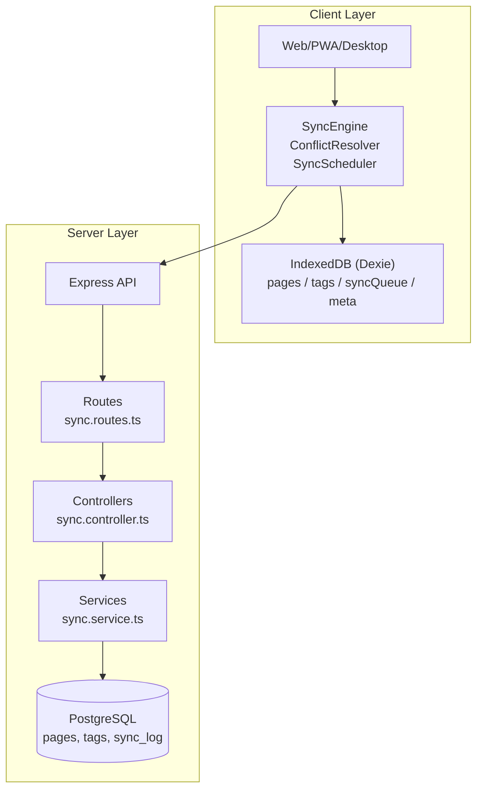
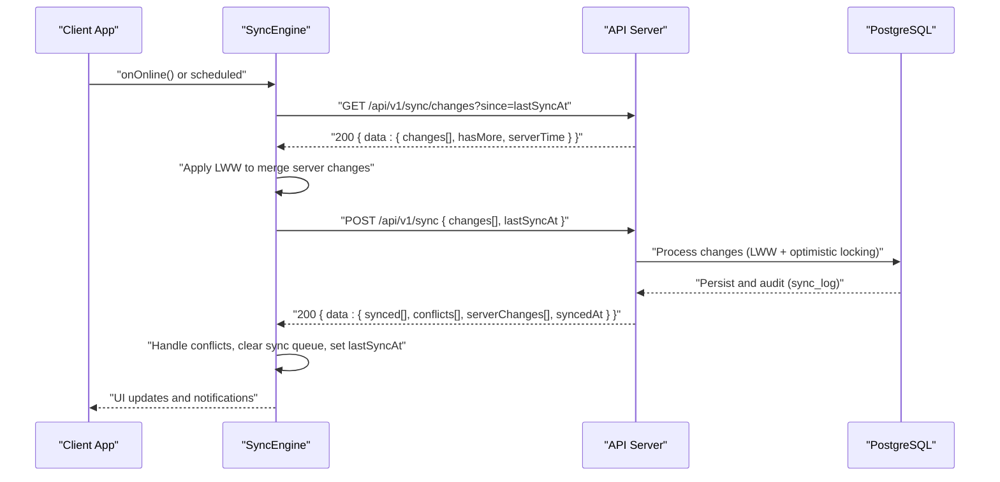
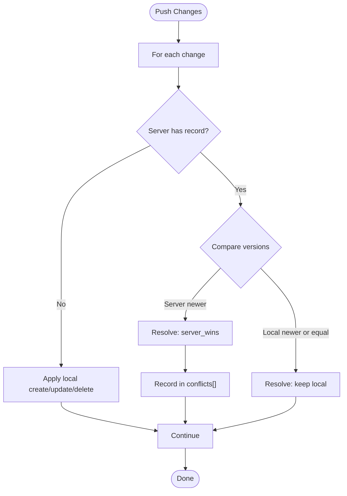
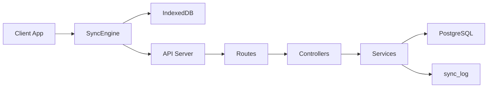

# Synchronization Endpoints

<cite>
**Referenced Files in This Document**
- [API-SPEC.md](file://api-spec/API-SPEC.md)
- [ARCHITECTURE.md](file://arch/ARCHITECTURE.md)
- [20260319_init.ts](file://code/server/src/db/migrations/20260319_init.ts)
- [app.ts](file://code/server/src/app.ts)
- [auth.routes.ts](file://code/server/src/routes/auth.routes.ts)
</cite>

## Table of Contents
1. [Introduction](#introduction)
2. [Project Structure](#project-structure)
3. [Core Components](#core-components)
4. [Architecture Overview](#architecture-overview)
5. [Detailed Component Analysis](#detailed-component-analysis)
6. [Dependency Analysis](#dependency-analysis)
7. [Performance Considerations](#performance-considerations)
8. [Troubleshooting Guide](#troubleshooting-guide)
9. [Conclusion](#conclusion)

## Introduction
This document provides comprehensive API documentation for the offline synchronization endpoints. It covers:
- POST /api/v1/sync: Pushing local changes with batch processing, change types (create/update/delete), conflict detection and resolution using last-write-wins (LWW), and optimistic locking via version comparison.
- GET /api/v1/sync/changes: Retrieving server-side incremental changes since a timestamp, including change filtering, pagination, and limit controls.
It also explains the conflict resolution algorithm comparing local and server timestamps, the response structure for synced/conflicts/serverChanges, and best practices for maintaining sync consistency across devices.

## Project Structure
The synchronization endpoints are part of the server’s REST API module. The API specification defines the contract, while the architecture document describes the client-side sync engine and IndexedDB schema. The database migration includes a dedicated sync log table for audit and debugging.

**Diagram sources**
- [ARCHITECTURE.md: 311–469:311-469](file://arch/ARCHITECTURE.md#L311-L469)
- [API-SPEC.md: 681–810:681-810](file://api-spec/API-SPEC.md#L681-L810)

**Section sources**
- [API-SPEC.md: 681–810:681-810](file://api-spec/API-SPEC.md#L681-L810)
- [ARCHITECTURE.md: 311–469:311-469](file://arch/ARCHITECTURE.md#L311-L469)

## Core Components
- Endpoint definitions and request/response contracts are defined in the API specification.
- The client-side sync engine orchestrates pull/push cycles, applies LWW, and manages IndexedDB.
- The server-side controller/service layer handles incoming sync requests, performs conflict resolution, and writes audit logs.

Key references:
- POST /api/v1/sync: [API-SPEC.md: 683–771:683-771](file://api-spec/API-SPEC.md#L683-L771)
- GET /api/v1/sync/changes: [API-SPEC.md: 773–810:773-810](file://api-spec/API-SPEC.md#L773-L810)
- Client sync engine (LWW and queue management): [ARCHITECTURE.md: 398–469:398-469](file://arch/ARCHITECTURE.md#L398-L469)
- Sync log table (audit trail): [20260319_init.ts: 166–181:166-181](file://code/server/src/db/migrations/20260319_init.ts#L166-L181)

**Section sources**
- [API-SPEC.md: 683–771:683-771](file://api-spec/API-SPEC.md#L683-L771)
- [API-SPEC.md: 773–810:773-810](file://api-spec/API-SPEC.md#L773-L810)
- [ARCHITECTURE.md: 398–469:398-469](file://arch/ARCHITECTURE.md#L398-L469)
- [20260319_init.ts: 166–181:166-181](file://code/server/src/db/migrations/20260319_init.ts#L166-L181)

## Architecture Overview
The sync architecture follows an incremental timestamp-based model with LWW conflict resolution:
- The client maintains an IndexedDB database with a sync queue and metadata.
- On network recovery or periodic triggers, the client pulls server changes since the last sync timestamp, merges them using LWW, pushes local changes, resolves conflicts, and updates the last sync timestamp.

**Diagram sources**
- [ARCHITECTURE.md: 398–469:398-469](file://arch/ARCHITECTURE.md#L398-L469)
- [API-SPEC.md: 683–771:683-771](file://api-spec/API-SPEC.md#L683-L771)
- [API-SPEC.md: 773–810:773-810](file://api-spec/API-SPEC.md#L773-L810)

## Detailed Component Analysis

### POST /api/v1/sync: Push Local Changes
Purpose:
- Accept a batch of local changes (create/update/delete) and apply them against server state with conflict detection and resolution using LWW.

Request
- Authentication: Required (Bearer JWT).
- Body fields:
  - changes: array of change items with:
    - type: "create" | "update" | "delete"
    - pageId: UUID
    - title/content: required for create/update
    - version: required for update (optimistic locking)
    - localUpdatedAt: ISO 8601 timestamp (for LWW tie-breaker)
    - Additional fields: parentId, order, icon
  - lastSyncAt: optional timestamp to request serverChanges in response

Response
- 200 OK with data:
  - synced: array of successfully synchronized pageIds
  - conflicts: array of resolved conflicts with:
    - pageId
    - localVersion
    - serverVersion
    - resolution: "server_wins"
    - serverPage: the authoritative server-side page object
  - serverChanges: array of server-side changes affecting the requesting user since lastSyncAt
  - syncedAt: timestamp when the push was processed

Conflict Resolution (LWW)
- Compare localUpdatedAt vs server updatedAt:
  - If server version > local version AND server updatedAt > local updatedAt → server_wins
  - Otherwise, keep the local change (or apply server change if newer)
- Conflicts are returned in the conflicts array with serverPage included for client overwrite

Optimistic Locking
- For update operations, include version in the change item.
- Server validates version match; mismatches result in a conflict response.

Best Practices
- Always include localUpdatedAt to enable accurate LWW decisions.
- Batch changes to minimize round trips.
- Respect serverChanges returned alongside synced/conflicts for immediate reconciliation.

**Section sources**
- [API-SPEC.md: 683–771:683-771](file://api-spec/API-SPEC.md#L683-L771)
- [ARCHITECTURE.md: 398–469:398-469](file://arch/ARCHITECTURE.md#L398-L469)

### GET /api/v1/sync/changes: Retrieve Incremental Changes
Purpose:
- Fetch server-side incremental changes for the authenticated user since a given timestamp.

Request
- Authentication: Required (Bearer JWT).
- Query parameters:
  - since: required (ISO 8601 timestamp)
  - limit: optional (default 100, max 500)

Response
- 200 OK with data:
  - changes: array of change objects (create/update/delete) with page metadata and version info
  - hasMore: boolean indicating if more changes exist beyond limit
  - serverTime: current server timestamp

Pagination Controls
- Use limit to constrain response size.
- Use hasMore to detect if additional pages are needed; adjust since to the latest updatedAt from the previous batch.

Change Filtering
- Returns changes for the requesting user only.
- Includes changes originating from the same user on other devices.

**Section sources**
- [API-SPEC.md: 773–810:773-810](file://api-spec/API-SPEC.md#L773-L810)

### Conflict Resolution Algorithm
The algorithm compares local and server states to decide which version wins:
- Tie-breaker: compare localUpdatedAt vs server updatedAt.
- Decision:
  - If server version > local version AND server updatedAt > localUpdatedAt → server_wins
  - Else → keep local change (or apply server change if newer)
- The conflicts array in the push response includes serverPage so the client can overwrite local state.

**Diagram sources**
- [API-SPEC.md: 767–771:767-771](file://api-spec/API-SPEC.md#L767-L771)
- [ARCHITECTURE.md: 457–467:457-467](file://arch/ARCHITECTURE.md#L457-L467)

## Dependency Analysis
- Client-side dependencies:
  - SyncEngine orchestrates pull/push, LWW merging, and conflict handling.
  - IndexedDB stores pages, tags, syncQueue, and metadata.
- Server-side dependencies:
  - Routes define /api/v1/sync and /api/v1/sync/changes.
  - Controllers validate inputs and delegate to services.
  - Services implement LWW, optimistic locking, and audit logging.
  - Database schema includes pages and sync_log tables.

**Diagram sources**
- [ARCHITECTURE.md: 311–469:311-469](file://arch/ARCHITECTURE.md#L311-L469)
- [API-SPEC.md: 681–810:681-810](file://api-spec/API-SPEC.md#L681-L810)
- [20260319_init.ts: 166–181:166-181](file://code/server/src/db/migrations/20260319_init.ts#L166-L181)

**Section sources**
- [ARCHITECTURE.md: 311–469:311-469](file://arch/ARCHITECTURE.md#L311-L469)
- [API-SPEC.md: 681–810:681-810](file://api-spec/API-SPEC.md#L681-L810)
- [20260319_init.ts: 166–181:166-181](file://code/server/src/db/migrations/20260319_init.ts#L166-L181)

## Performance Considerations
- Batch processing: Group multiple changes per push to reduce overhead.
- Limit controls: Use limit on GET /api/v1/sync/changes to manage payload sizes.
- LWW efficiency: Prefer timestamp comparisons over full-content hashing for speed.
- Audit logging: The sync_log table supports debugging without impacting primary write paths.

## Troubleshooting Guide
Common issues and resolutions:
- Validation errors: Ensure changes include required fields (title/content for create/update, version for update).
- Conflicts: Expect conflicts when server updatedAt > localUpdatedAt for the same server version. The server returns serverPage; overwrite local state accordingly.
- Version mismatch: If optimistic locking fails, re-fetch server state and retry with the latest version.
- Pagination gaps: If hasMore is true, incrementally fetch subsequent batches using the latest updatedAt as the new since value.

Operational checks:
- Verify JWT authentication header is present.
- Confirm serverTime alignment with client clock for accurate since-based queries.
- Review sync_log entries for debugging and audit trails.

**Section sources**
- [API-SPEC.md: 683–771:683-771](file://api-spec/API-SPEC.md#L683-L771)
- [API-SPEC.md: 773–810:773-810](file://api-spec/API-SPEC.md#L773-L810)
- [20260319_init.ts: 166–181:166-181](file://code/server/src/db/migrations/20260319_init.ts#L166-L181)

## Conclusion
The synchronization endpoints implement a robust, LWW-based offline-first strategy with optimistic locking and comprehensive conflict reporting. Clients should batch changes, honor serverChanges, and consistently apply LWW during merges. Servers maintain auditability via sync_log and enforce consistency through version checks. Following the documented patterns ensures reliable cross-device synchronization.