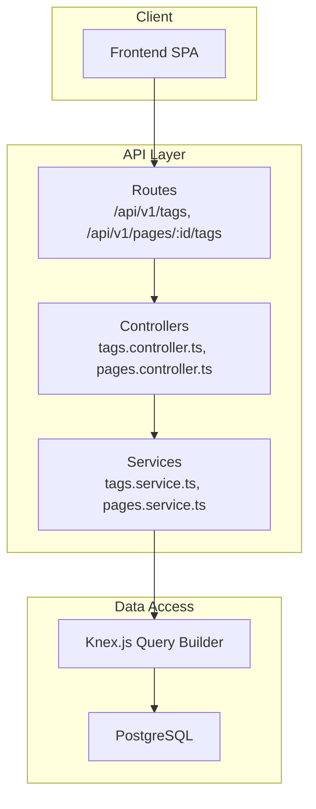
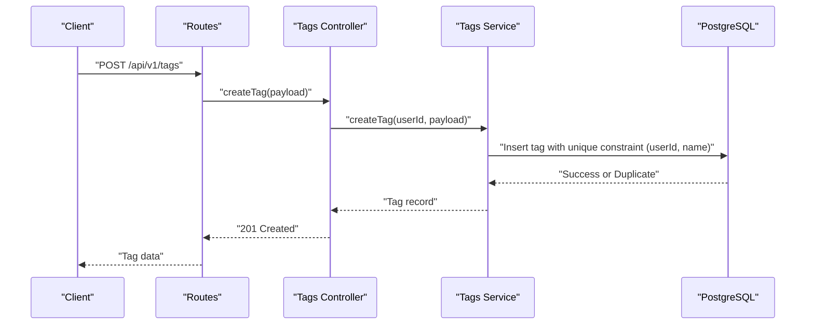
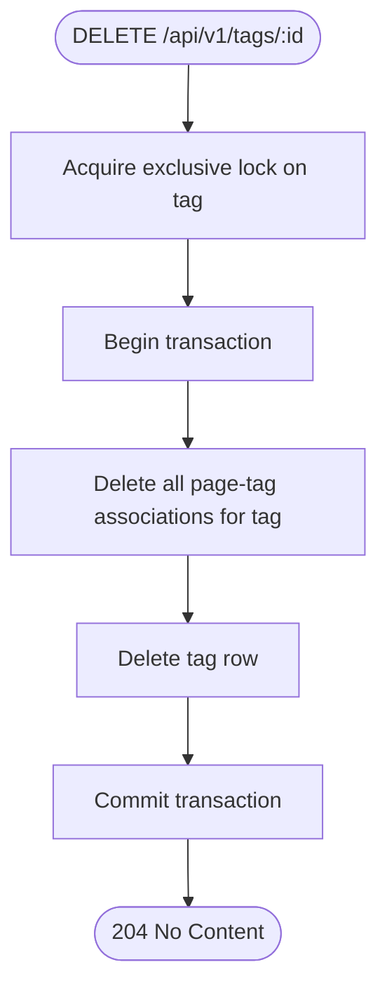
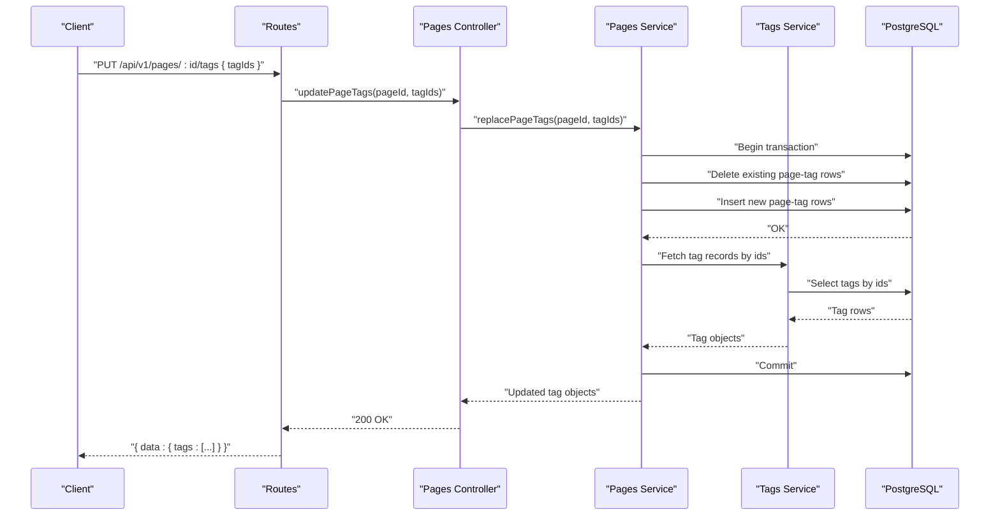
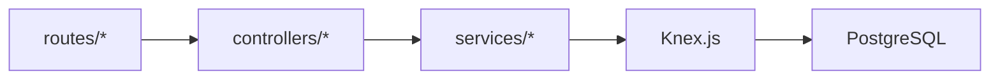

# Tag Management Endpoints

<cite>
**Referenced Files in This Document**
- [API-SPEC.md](file://api-spec/API-SPEC.md)
- [ARCHITECTURE.md](file://arch/ARCHITECTURE.md)
- [connection.ts](file://code/server/src/db/connection.ts)
</cite>

## Table of Contents
1. [Introduction](#introduction)
2. [Project Structure](#project-structure)
3. [Core Components](#core-components)
4. [Architecture Overview](#architecture-overview)
5. [Detailed Component Analysis](#detailed-component-analysis)
6. [Dependency Analysis](#dependency-analysis)
7. [Performance Considerations](#performance-considerations)
8. [Troubleshooting Guide](#troubleshooting-guide)
9. [Conclusion](#conclusion)

## Introduction
This document provides comprehensive API documentation for tag management endpoints in the Yule Notion application. It covers:
- Retrieving all user tags
- Creating new tags with unique naming constraints
- Deleting tags and automatically cleaning associated page-tag relations
- Bulk assigning tags to pages atomically
- Listing pages associated with a specific tag, including pagination

It also documents tag schemas, validation rules, error handling for conflicts, and the atomic nature of tag assignment operations.

## Project Structure
The tag module is part of the REST API surface under the base path `/api/v1`. The API specification defines the endpoints, request/response schemas, and error semantics. The backend architecture uses Express.js with Knex.js for database access and PostgreSQL as the persistence store.

**Diagram sources**
- [ARCHITECTURE.md:238-286](file://arch/ARCHITECTURE.md#L238-L286)
- [API-SPEC.md:468-592](file://api-spec/API-SPEC.md#L468-L592)

**Section sources**
- [ARCHITECTURE.md:238-286](file://arch/ARCHITECTURE.md#L238-L286)
- [API-SPEC.md:468-592](file://api-spec/API-SPEC.md#L468-L592)

## Core Components
- Authentication: All tag endpoints require a valid JWT Bearer token via the Authorization header.
- Base URL: `/api/v1`
- Content-Type: `application/json` (default)
- Pagination: Standardized via `page` and `pageSize` query parameters where applicable.

Key endpoint coverage:
- GET /api/v1/tags
- POST /api/v1/tags
- DELETE /api/v1/tags/:id
- PUT /api/v1/pages/:id/tags
- GET /api/v1/tags/:id/pages

**Section sources**
- [API-SPEC.md:12-24](file://api-spec/API-SPEC.md#L12-L24)
- [API-SPEC.md:468-592](file://api-spec/API-SPEC.md#L468-L592)

## Architecture Overview
The tag management flow integrates with the broader pages and tagging subsystem. The service layer coordinates with Knex to enforce uniqueness per user and maintain referential integrity during deletions and bulk updates.

**Diagram sources**
- [API-SPEC.md:489-522](file://api-spec/API-SPEC.md#L489-L522)

## Detailed Component Analysis

### Endpoint: GET /api/v1/tags
- Purpose: Retrieve all tags owned by the authenticated user.
- Authentication: Required
- Response: Array of tag objects with fields: id, name, color, pageCount.

Example response shape:
- data: Array of tag objects

Notes:
- The response does not include pagination metadata because this is a full-list retrieval for the current user.

**Section sources**
- [API-SPEC.md:470-487](file://api-spec/API-SPEC.md#L470-L487)

### Endpoint: POST /api/v1/tags
- Purpose: Create a new tag for the authenticated user.
- Authentication: Required
- Request body:
  - name: string, required, length 1–30
  - color: string, optional, HEX color; defaults to a neutral gray
- Validation rules:
  - name must be unique among the current user’s tags.
- Response: 201 with the created tag object including id, name, color, pageCount, createdAt.
- Error handling:
  - 409 Conflict if a tag with the same name already exists for the user.

Tag schema summary:
- id: UUID v4
- name: string (unique per user)
- color: string (HEX)
- pageCount: number
- createdAt: ISO 8601 UTC

**Section sources**
- [API-SPEC.md:489-522](file://api-spec/API-SPEC.md#L489-L522)

### Endpoint: DELETE /api/v1/tags/:id
- Purpose: Delete a tag and remove all associations between the tag and pages.
- Authentication: Required
- Behavior:
  - Deletes the tag record.
  - Removes all rows from the page-tag junction table for this tag.
- Response: 204 No Content.
- Atomicity:
  - Deletion and cleanup occur within a single transaction to ensure referential integrity.

**Diagram sources**
- [API-SPEC.md:523-530](file://api-spec/API-SPEC.md#L523-L530)

**Section sources**
- [API-SPEC.md:523-530](file://api-spec/API-SPEC.md#L523-L530)

### Endpoint: PUT /api/v1/pages/:id/tags
- Purpose: Atomically replace all tags associated with a page.
- Authentication: Required
- Request body:
  - tagIds: array of tag UUIDs (can be empty to clear all tags)
- Behavior:
  - Full replacement model: the provided tagIds become the page’s only tag associations.
  - Implemented as a transaction: delete existing associations, insert new ones.
- Response: 200 with the updated set of tag objects currently associated with the page.

Atomicity:
- The operation is atomic: either all associations are replaced successfully or none are changed.

**Diagram sources**
- [API-SPEC.md:531-557](file://api-spec/API-SPEC.md#L531-L557)

**Section sources**
- [API-SPEC.md:531-557](file://api-spec/API-SPEC.md#L531-L557)

### Endpoint: GET /api/v1/tags/:id/pages
- Purpose: List pages associated with a given tag, with pagination.
- Authentication: Required
- Query parameters:
  - page: integer, default 1
  - pageSize: integer, default 20, max 100
- Response:
  - data.tag: tag object (id, name, color)
  - data.pages: array of page objects (id, title, icon, updatedAt)
  - data.total: total count
  - meta: page, pageSize, total

Pagination:
- Uses standardized pagination parameters and includes meta in list responses.

**Section sources**
- [API-SPEC.md:558-591](file://api-spec/API-SPEC.md#L558-L591)

## Dependency Analysis
- Routes depend on controllers to handle HTTP requests.
- Controllers delegate business logic to services.
- Services use Knex to execute SQL queries against PostgreSQL.
- The database enforces uniqueness constraints at the schema level to prevent duplicate tag names per user.

**Diagram sources**
- [ARCHITECTURE.md:238-286](file://arch/ARCHITECTURE.md#L238-L286)
- [connection.ts:22-29](file://code/server/src/db/connection.ts#L22-L29)

**Section sources**
- [ARCHITECTURE.md:238-286](file://arch/ARCHITECTURE.md#L238-L286)
- [connection.ts:22-29](file://code/server/src/db/connection.ts#L22-L29)

## Performance Considerations
- Indexing: Ensure indexes exist on tag.name per user and on page-tag junction keys to optimize lookups and deletions.
- Batch operations: Bulk tag assignment uses a single transaction to minimize round-trips and maintain consistency.
- Pagination limits: Enforce pageSize bounds to avoid heavy queries on large datasets.

## Troubleshooting Guide
Common errors and resolutions:
- 401 Unauthorized: Verify the Authorization header contains a valid JWT token.
- 403 Forbidden: Accessing another user’s resources is blocked by design.
- 404 Resource Not Found: Accessing a non-existent tag or page ID.
- 409 Conflict:
  - Tag creation conflict occurs when a tag with the same name already exists for the user.
  - Page update conflict may occur if optimistic concurrency checks fail elsewhere in the system.
- 422 Unprocessable Entity: Validation failures for field types or lengths.

Operational tips:
- Use consistent pagination parameters to avoid excessive payloads.
- For bulk tag assignment, pass only the intended tagIds; an empty array clears all associations.

**Section sources**
- [API-SPEC.md:54-87](file://api-spec/API-SPEC.md#L54-L87)

## Conclusion
The tag management endpoints provide a robust, consistent interface for users to manage personal tags, associate them with pages, and retrieve paginated results. The design emphasizes:
- Unique naming per user
- Atomic bulk updates
- Automatic cleanup on deletion
- Standardized pagination and error handling

These behaviors are defined in the API specification and supported by the backend architecture and database constraints.