# Authentication System

<cite>
**Referenced Files in This Document**
- [auth.ts](file://code/client/src/stores/auth.ts)
- [auth.service.ts](file://code/client/src/services/auth.service.ts)
- [api.ts](file://code/client/src/services/api.ts)
- [index.ts](file://code/client/src/router/index.ts)
- [LoginView.vue](file://code/client/src/views/LoginView.vue)
- [RegisterView.vue](file://code/client/src/views/RegisterView.vue)
- [auth.controller.ts](file://code/server/src/controllers/auth.controller.ts)
- [auth.service.ts](file://code/server/src/services/auth.service.ts)
- [auth.ts](file://code/server/src/middleware/auth.ts)
- [auth.routes.ts](file://code/server/src/routes/auth.routes.ts)
- [validate.ts](file://code/server/src/middleware/validate.ts)
- [index.ts](file://code/server/src/config/index.ts)
- [app.ts](file://code/server/src/app.ts)
- [errorHandler.ts](file://code/server/src/middleware/errorHandler.ts)
- [index.ts](file://code/server/src/types/index.ts)
- [API-SPEC.md](file://api-spec/API-SPEC.md)
</cite>

## Table of Contents
1. [Introduction](#introduction)
2. [Project Structure](#project-structure)
3. [Core Components](#core-components)
4. [Architecture Overview](#architecture-overview)
5. [Detailed Component Analysis](#detailed-component-analysis)
6. [Dependency Analysis](#dependency-analysis)
7. [Performance Considerations](#performance-considerations)
8. [Security Measures](#security-measures)
9. [User Account Lifecycle](#user-account-lifecycle)
10. [Multi-Device Session Handling](#multi-device-session-handling)
11. [Practical Integration Patterns](#practical-integration-patterns)
12. [Troubleshooting Guide](#troubleshooting-guide)
13. [Conclusion](#conclusion)

## Introduction
This document explains the authentication and authorization system used by the application. It covers the JWT-based authentication flow, token generation and validation, protected routes, frontend state management with Pinia, and backend security controls. It also documents password hashing with bcrypt, input validation with Zod, rate limiting, and error handling. Finally, it outlines user lifecycle operations and integration patterns for both frontend and backend components.

## Project Structure
The authentication system spans two primary layers:
- Frontend (Vue + Pinia + Axios):
  - Stores manage authentication state and persist tokens in localStorage.
  - Services encapsulate API calls to the backend.
  - Router guards enforce protected routes.
  - Views handle user input and feedback.
- Backend (Express + TypeScript):
  - Routes define authentication endpoints and apply validation.
  - Middleware handles JWT verification and global error handling.
  - Services implement business logic including password hashing and token signing.
  - Config manages environment variables and security policies.

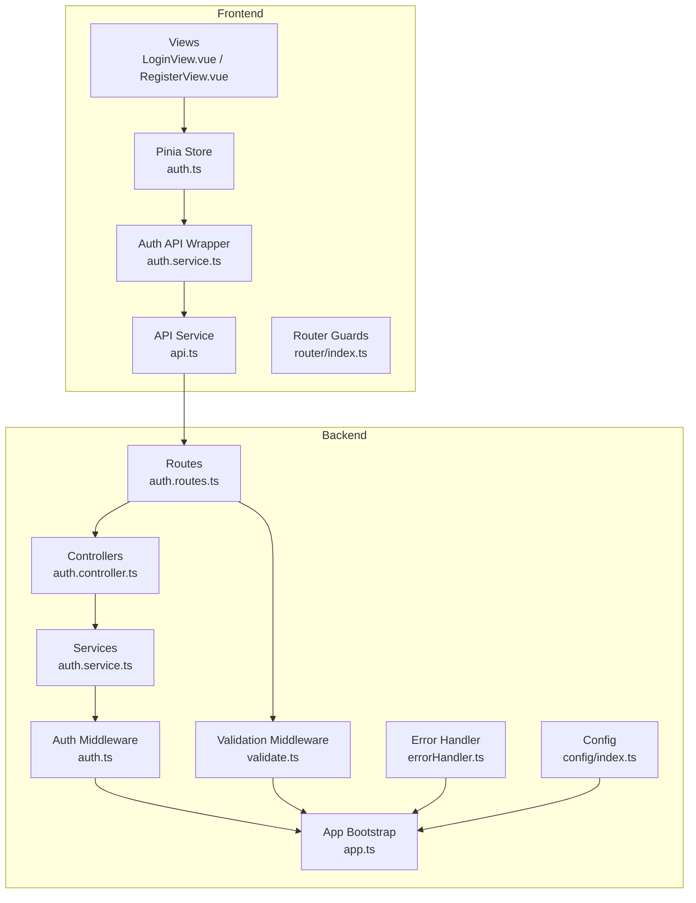

**Diagram sources**
- [auth.ts:1-138](file://code/client/src/stores/auth.ts#L1-138)
- [api.ts:1-64](file://code/client/src/services/api.ts#L1-64)
- [auth.service.ts:1-46](file://code/client/src/services/auth.service.ts#L1-46)
- [index.ts:1-93](file://code/client/src/router/index.ts#L1-93)
- [LoginView.vue:1-287](file://code/client/src/views/LoginView.vue#L1-287)
- [RegisterView.vue:1-350](file://code/client/src/views/RegisterView.vue#L1-350)
- [auth.routes.ts:1-106](file://code/server/src/routes/auth.routes.ts#L1-106)
- [validate.ts:1-72](file://code/server/src/middleware/validate.ts#L1-72)
- [auth.ts:1-60](file://code/server/src/middleware/auth.ts#L1-60)
- [auth.controller.ts:1-82](file://code/server/src/controllers/auth.controller.ts#L1-82)
- [auth.service.ts:1-166](file://code/server/src/services/auth.service.ts#L1-166)
- [index.ts:1-101](file://code/server/src/config/index.ts#L1-101)
- [errorHandler.ts:1-68](file://code/server/src/middleware/errorHandler.ts#L1-68)
- [app.ts:1-121](file://code/server/src/app.ts#L1-121)

**Section sources**
- [auth.ts:1-138](file://code/client/src/stores/auth.ts#L1-138)
- [auth.service.ts:1-46](file://code/client/src/services/auth.service.ts#L1-46)
- [api.ts:1-64](file://code/client/src/services/api.ts#L1-64)
- [index.ts:1-93](file://code/client/src/router/index.ts#L1-93)
- [LoginView.vue:1-287](file://code/client/src/views/LoginView.vue#L1-287)
- [RegisterView.vue:1-350](file://code/client/src/views/RegisterView.vue#L1-350)
- [auth.routes.ts:1-106](file://code/server/src/routes/auth.routes.ts#L1-106)
- [validate.ts:1-72](file://code/server/src/middleware/validate.ts#L1-72)
- [auth.ts:1-60](file://code/server/src/middleware/auth.ts#L1-60)
- [auth.controller.ts:1-82](file://code/server/src/controllers/auth.controller.ts#L1-82)
- [auth.service.ts:1-166](file://code/server/src/services/auth.service.ts#L1-166)
- [index.ts:1-101](file://code/server/src/config/index.ts#L1-101)
- [errorHandler.ts:1-68](file://code/server/src/middleware/errorHandler.ts#L1-68)
- [app.ts:1-121](file://code/server/src/app.ts#L1-121)

## Core Components
- Frontend authentication store:
  - Manages token and user state.
  - Persists token to localStorage.
  - Provides login, register, logout, and fetchMe actions.
  - Integrates with Axios interceptors to attach Authorization headers and handle 401 globally.
- Backend authentication routes:
  - Define /auth/register, /auth/login, and /auth/me.
  - Apply Zod validation and JWT middleware.
- Backend authentication service:
  - Implements password hashing with bcrypt.
  - Generates JWT tokens with configurable expiration.
  - Returns safe user objects excluding sensitive fields.
- Global error handling:
  - Converts business errors to consistent API responses.
  - Logs errors and returns appropriate HTTP status codes.

**Section sources**
- [auth.ts:26-137](file://code/client/src/stores/auth.ts#L26-137)
- [auth.service.ts:18-46](file://code/client/src/services/auth.service.ts#L18-46)
- [api.ts:26-61](file://code/client/src/services/api.ts#L26-61)
- [auth.routes.ts:72-102](file://code/server/src/routes/auth.routes.ts#L72-102)
- [auth.service.ts:68-166](file://code/server/src/services/auth.service.ts#L68-166)
- [errorHandler.ts:29-67](file://code/server/src/middleware/errorHandler.ts#L29-67)

## Architecture Overview
The authentication architecture follows a layered pattern:
- Frontend:
  - Views collect user input and delegate to Pinia store.
  - Store actions call API wrappers, which send requests via Axios.
  - Axios injects Authorization headers automatically and handles 401.
- Backend:
  - Routes validate request bodies with Zod.
  - Controllers call services for business logic.
  - Services hash passwords, query the database, and sign JWTs.
  - Auth middleware verifies tokens and attaches user info to requests.
  - Global error handler ensures consistent error responses.

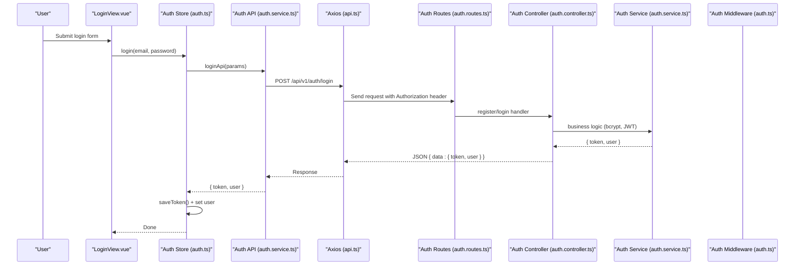

**Diagram sources**
- [LoginView.vue:110-133](file://code/client/src/views/LoginView.vue#L110-133)
- [auth.ts:80-84](file://code/client/src/stores/auth.ts#L80-84)
- [auth.service.ts:23-26](file://code/client/src/services/auth.service.ts#L23-26)
- [api.ts:15-24](file://code/client/src/services/api.ts#L15-24)
- [auth.routes.ts:77-92](file://code/server/src/routes/auth.routes.ts#L77-92)
- [auth.controller.ts:26-57](file://code/server/src/controllers/auth.controller.ts#L26-57)
- [auth.service.ts:117-143](file://code/server/src/services/auth.service.ts#L117-143)

## Detailed Component Analysis

### Frontend Authentication Store (Pinia)
The store centralizes authentication state and actions:
- State: token and user.
- Computed: isLoggedIn.
- Actions:
  - login: calls loginApi, persists token, sets user.
  - register: calls registerApi, persists token, sets user.
  - logout: clears auth, navigates to /login.
  - fetchMe: retrieves current user; on failure, clears auth.

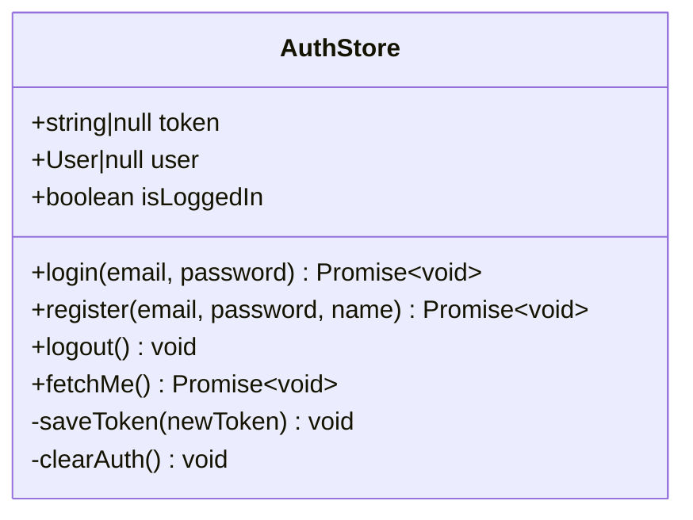

**Diagram sources**
- [auth.ts:26-137](file://code/client/src/stores/auth.ts#L26-137)

**Section sources**
- [auth.ts:26-137](file://code/client/src/stores/auth.ts#L26-137)

### Frontend API Layer
- loginApi/registerApi: POST to /auth/login and /auth/register, unwrap { data }.
- fetchMeApi: GET /auth/me, unwrap { data }.
- Axios instance:
  - baseURL: /api/v1.
  - Injects Authorization: Bearer token from localStorage.
  - On 401, clears localStorage and redirects to /login.

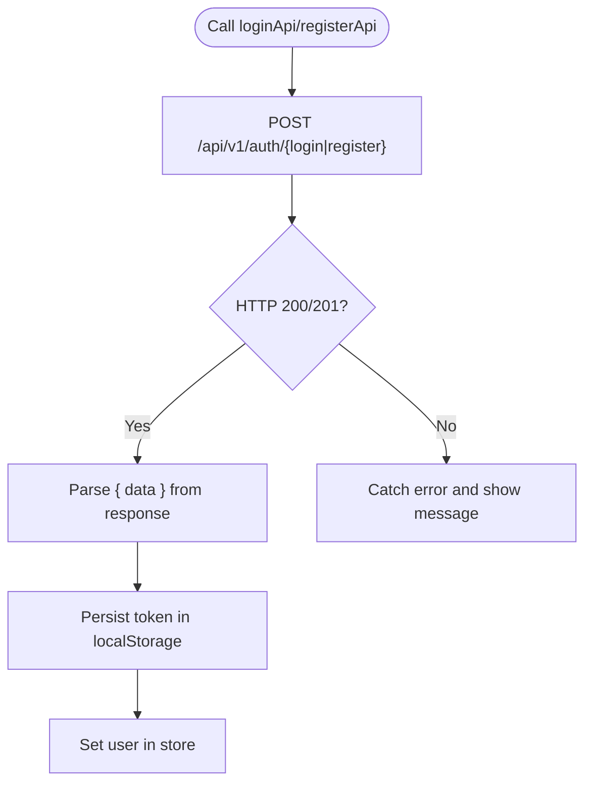

**Diagram sources**
- [auth.service.ts:23-45](file://code/client/src/services/auth.service.ts#L23-45)
- [api.ts:26-61](file://code/client/src/services/api.ts#L26-61)

**Section sources**
- [auth.service.ts:18-46](file://code/client/src/services/auth.service.ts#L18-46)
- [api.ts:15-64](file://code/client/src/services/api.ts#L15-64)

### Backend Authentication Routes and Validation
- Routes:
  - POST /api/v1/auth/register: validates with Zod registerSchema, then controller.register.
  - POST /api/v1/auth/login: validates with Zod loginSchema, then controller.login.
  - GET /api/v1/auth/me: protected by authMiddleware, then controller.me.
- Validation:
  - validate middleware parses and transforms request bodies using Zod.
  - On validation failure, returns 400 with structured details.

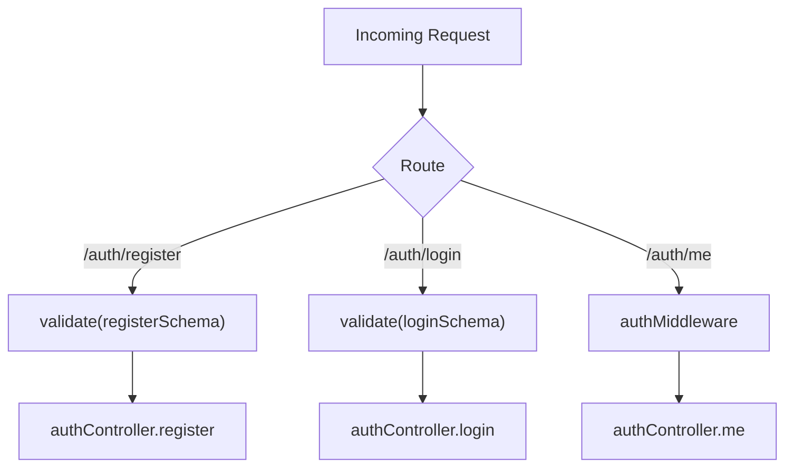

**Diagram sources**
- [auth.routes.ts:72-102](file://code/server/src/routes/auth.routes.ts#L72-102)
- [validate.ts:31-71](file://code/server/src/middleware/validate.ts#L31-71)
- [auth.ts:29-59](file://code/server/src/middleware/auth.ts#L29-59)

**Section sources**
- [auth.routes.ts:27-102](file://code/server/src/routes/auth.routes.ts#L27-102)
- [validate.ts:31-71](file://code/server/src/middleware/validate.ts#L31-71)

### Backend Authentication Service (Business Logic)
- register:
  - Checks for existing user by email.
  - Hashes password with bcrypt.
  - Inserts user record.
  - Signs JWT with userId and email.
  - Returns token and safe user.
- login:
  - Finds user by email.
  - Compares password with bcrypt.
  - Signs JWT.
  - Returns token and safe user.
- getCurrentUser:
  - Loads user by id and returns safe user.

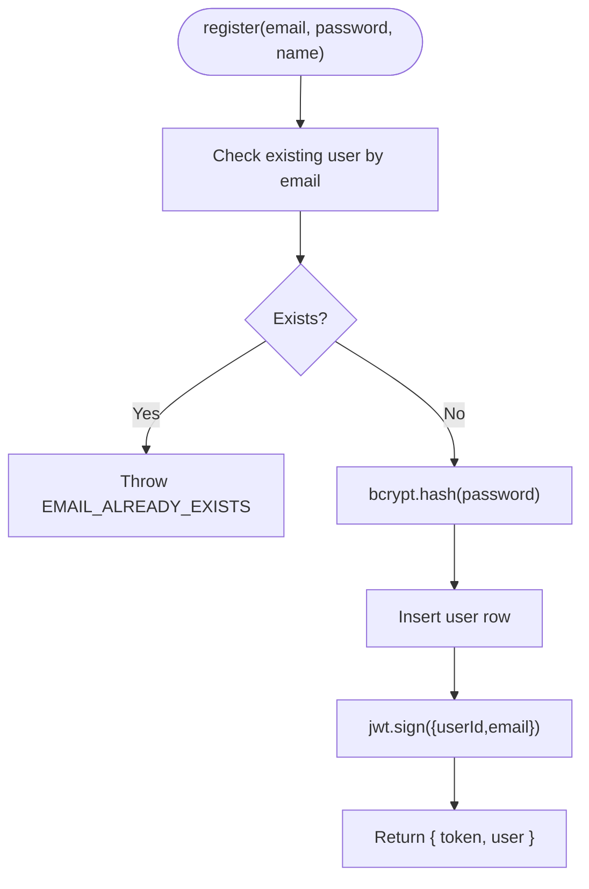

**Diagram sources**
- [auth.service.ts:68-101](file://code/server/src/services/auth.service.ts#L68-101)
- [auth.service.ts:117-143](file://code/server/src/services/auth.service.ts#L117-143)

**Section sources**
- [auth.service.ts:68-166](file://code/server/src/services/auth.service.ts#L68-166)

### JWT Middleware and Protected Routes
- Extracts Authorization: Bearer token.
- Verifies signature with JWT_SECRET.
- Attaches decoded payload (userId, email) to req.user.
- Handles expired and invalid tokens with appropriate error codes.

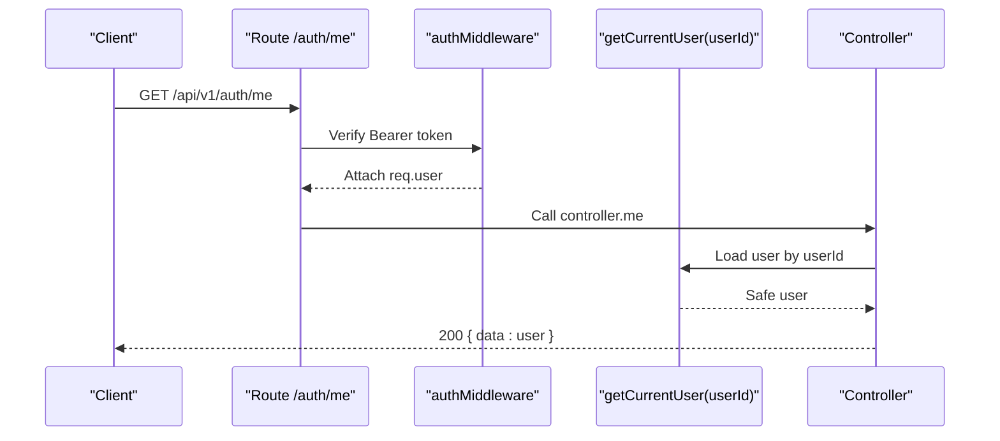

**Diagram sources**
- [auth.ts:29-59](file://code/server/src/middleware/auth.ts#L29-59)
- [auth.controller.ts:70-81](file://code/server/src/controllers/auth.controller.ts#L70-81)
- [auth.service.ts:155-165](file://code/server/src/services/auth.service.ts#L155-165)

**Section sources**
- [auth.ts:29-59](file://code/server/src/middleware/auth.ts#L29-59)
- [auth.controller.ts:70-81](file://code/server/src/controllers/auth.controller.ts#L70-81)
- [auth.service.ts:155-165](file://code/server/src/services/auth.service.ts#L155-165)

### Protected Routes and Navigation Guards
- Router defines routes with meta.requiresAuth.
- beforeEach guard checks authStore.isLoggedIn for protected routes.
- Redirects unauthenticated users to /login and authenticated users away from login/register.

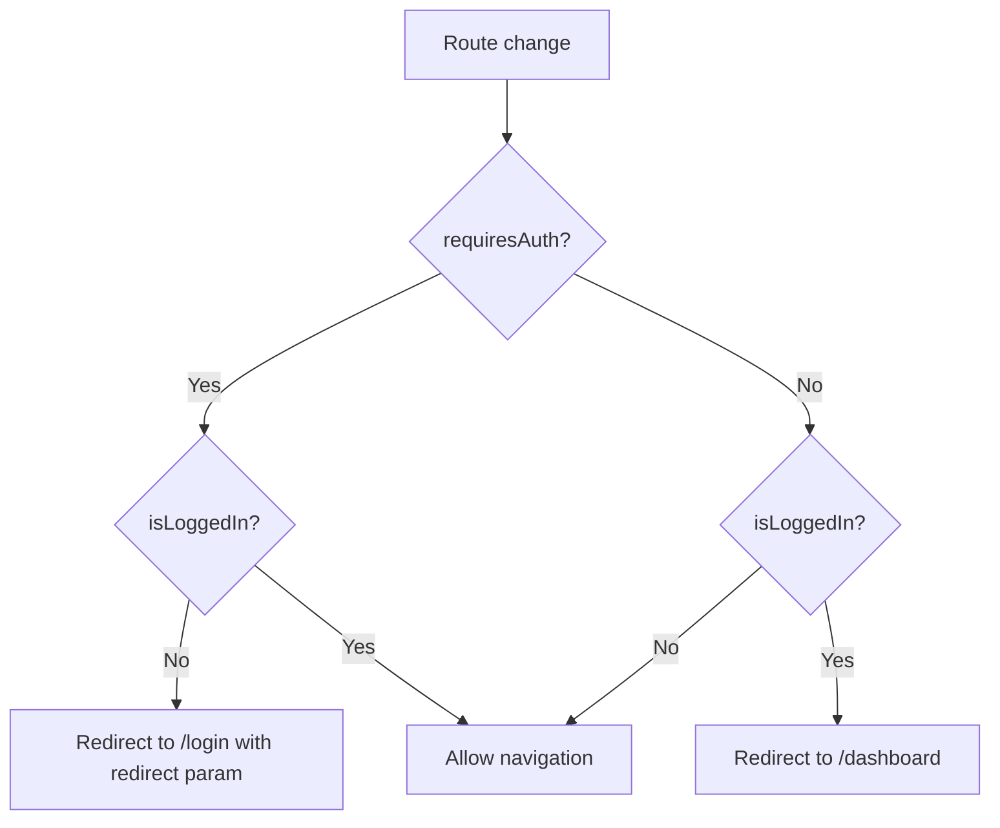

**Diagram sources**
- [index.ts:68-90](file://code/client/src/router/index.ts#L68-90)
- [auth.ts:40-41](file://code/client/src/stores/auth.ts#L40-41)

**Section sources**
- [index.ts:16-90](file://code/client/src/router/index.ts#L16-90)
- [auth.ts:40-41](file://code/client/src/stores/auth.ts#L40-41)

### Frontend Views: Login and Registration
- LoginView:
  - Validates email/password locally and via backend.
  - Calls authStore.login, shows success/error alerts, navigates on success.
- RegisterView:
  - Validates name/email/password/confirmPassword.
  - Calls authStore.register, navigates to dashboard on success.

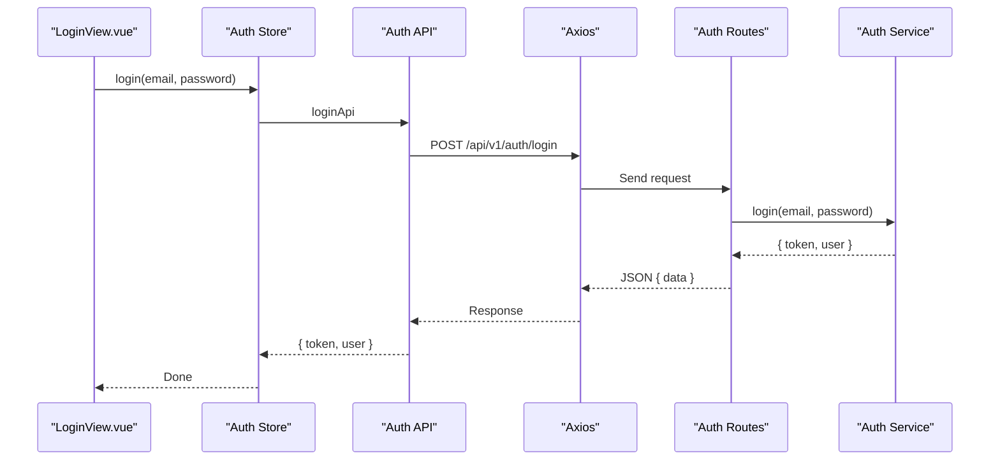

**Diagram sources**
- [LoginView.vue:110-133](file://code/client/src/views/LoginView.vue#L110-133)
- [auth.ts:80-84](file://code/client/src/stores/auth.ts#L80-84)
- [auth.service.ts:23-26](file://code/client/src/services/auth.service.ts#L23-26)
- [auth.routes.ts:88-92](file://code/server/src/routes/auth.routes.ts#L88-92)
- [auth.service.ts:117-143](file://code/server/src/services/auth.service.ts#L117-143)

**Section sources**
- [LoginView.vue:74-133](file://code/client/src/views/LoginView.vue#L74-133)
- [RegisterView.vue:103-177](file://code/client/src/views/RegisterView.vue#L103-177)

## Dependency Analysis
- Frontend:
  - Views depend on Pinia store.
  - Store depends on API wrapper and router.
  - API wrapper depends on Axios instance.
- Backend:
  - Routes depend on validation middleware and controllers.
  - Controllers depend on services.
  - Services depend on database connection and config.
  - Auth middleware depends on JWT library and config.
  - App bootstrap registers middlewares and routes.

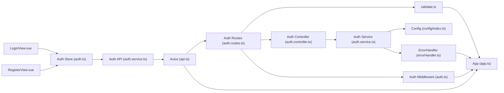

**Diagram sources**
- [LoginView.vue:18-28](file://code/client/src/views/LoginView.vue#L18-28)
- [RegisterView.vue:17-27](file://code/client/src/views/RegisterView.vue#L17-27)
- [auth.ts:15-21](file://code/client/src/stores/auth.ts#L15-21)
- [auth.service.ts:10-16](file://code/client/src/services/auth.service.ts#L10-16)
- [api.ts:11-24](file://code/client/src/services/api.ts#L11-24)
- [auth.routes.ts:10-14](file://code/server/src/routes/auth.routes.ts#L10-14)
- [validate.ts:31-71](file://code/server/src/middleware/validate.ts#L31-71)
- [auth.controller.ts:13-15](file://code/server/src/controllers/auth.controller.ts#L13-15)
- [auth.service.ts:12-17](file://code/server/src/services/auth.service.ts#L12-17)
- [index.ts:72-98](file://code/server/src/config/index.ts#L72-98)
- [errorHandler.ts:29-67](file://code/server/src/middleware/errorHandler.ts#L29-67)
- [auth.ts:10-14](file://code/server/src/middleware/auth.ts#L10-14)
- [app.ts:65-121](file://code/server/src/app.ts#L65-121)

**Section sources**
- [auth.ts:15-21](file://code/client/src/stores/auth.ts#L15-21)
- [auth.service.ts:10-16](file://code/client/src/services/auth.service.ts#L10-16)
- [api.ts:11-24](file://code/client/src/services/api.ts#L11-24)
- [auth.routes.ts:10-14](file://code/server/src/routes/auth.routes.ts#L10-14)
- [validate.ts:31-71](file://code/server/src/middleware/validate.ts#L31-71)
- [auth.controller.ts:13-15](file://code/server/src/controllers/auth.controller.ts#L13-15)
- [auth.service.ts:12-17](file://code/server/src/services/auth.service.ts#L12-17)
- [index.ts:72-98](file://code/server/src/config/index.ts#L72-98)
- [errorHandler.ts:29-67](file://code/server/src/middleware/errorHandler.ts#L29-67)
- [auth.ts:10-14](file://code/server/src/middleware/auth.ts#L10-14)
- [app.ts:65-121](file://code/server/src/app.ts#L65-121)

## Performance Considerations
- Token size: JWT payload contains minimal user identifiers; keep claims small to reduce overhead.
- Password hashing cost: bcrypt SALT_ROUNDS is set to a reasonable default; adjust based on hardware capacity.
- Request timeouts: Axios timeout configured to balance responsiveness and reliability.
- Rate limiting: Express rate limiter applied globally to prevent abuse; tune window and max per environment.
- Logging: Structured logging with pino reduces overhead while enabling observability.

[No sources needed since this section provides general guidance]

## Security Measures
- Input validation:
  - Zod schemas validate and normalize request bodies for register and login.
  - Validation middleware converts errors to structured 400 responses.
- Password hashing:
  - bcrypt is used for secure password hashing with a fixed number of rounds.
- JWT security:
  - Secret and expiration configured via environment variables.
  - Auth middleware verifies signatures and decodes payload.
  - Token attached via Authorization header; avoid storing tokens in insecure locations.
- Error handling:
  - Centralized error handler returns consistent error responses.
  - Production hides internal error details to prevent information leakage.
- Transport security:
  - Helmet middleware applies security headers.
  - CORS configured with allowed origins; production requires explicit whitelist.
  - Rate limiting protects against brute force and abuse.
- API specification alignment:
  - Authentication uses Bearer tokens as per API spec.
  - Error codes and status mappings align with API spec.

**Section sources**
- [validate.ts:31-71](file://code/server/src/middleware/validate.ts#L31-71)
- [auth.service.ts:19-20](file://code/server/src/services/auth.service.ts#L19-20)
- [auth.ts:48-58](file://code/server/src/middleware/auth.ts#L48-58)
- [errorHandler.ts:29-67](file://code/server/src/middleware/errorHandler.ts#L29-67)
- [app.ts:67-96](file://code/server/src/app.ts#L67-96)
- [index.ts:52-67](file://code/server/src/config/index.ts#L52-67)
- [API-SPEC.md:22-23](file://api-spec/API-SPEC.md#L22-L23)
- [API-SPEC.md:71-86](file://api-spec/API-SPEC.md#L71-L86)

## User Account Lifecycle
- Registration:
  - Frontend collects email, password, name.
  - Backend validates inputs, checks uniqueness, hashes password, creates user, signs JWT.
- Login:
  - Frontend sends credentials; backend verifies and returns token.
- Session management:
  - Frontend persists token in localStorage; Axios attaches Authorization header automatically.
  - On 401, frontend clears token and redirects to login.
- Fetch current user:
  - Frontend calls /auth/me; backend verifies token and returns safe user.
- Logout:
  - Frontend clears token and navigates to login.

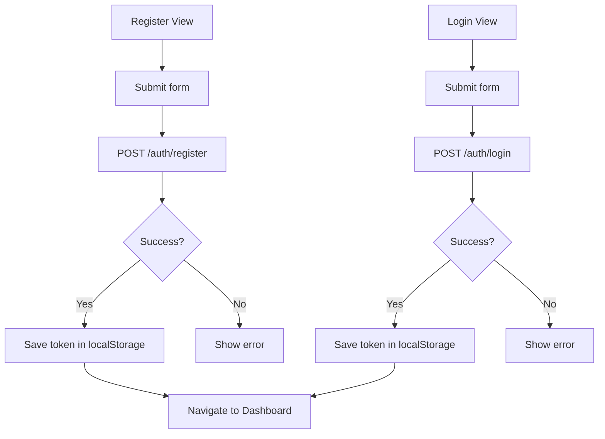

**Diagram sources**
- [RegisterView.vue:154-177](file://code/client/src/views/RegisterView.vue#L154-177)
- [LoginView.vue:110-133](file://code/client/src/views/LoginView.vue#L110-133)
- [auth.service.ts:33-36](file://code/client/src/services/auth.service.ts#L33-36)
- [auth.service.ts:23-26](file://code/client/src/services/auth.service.ts#L23-26)
- [api.ts:50-61](file://code/client/src/services/api.ts#L50-61)

**Section sources**
- [RegisterView.vue:154-177](file://code/client/src/views/RegisterView.vue#L154-177)
- [LoginView.vue:110-133](file://code/client/src/views/LoginView.vue#L110-133)
- [auth.service.ts:23-45](file://code/client/src/services/auth.service.ts#L23-45)
- [api.ts:50-61](file://code/client/src/services/api.ts#L50-61)

## Multi-Device Session Handling
- Current implementation:
  - Single JWT bearer token stored in localStorage.
  - No built-in device/session list or token revocation.
- Recommendations:
  - Add device metadata to JWT payload or separate sessions table.
  - Implement logout from all devices or selective device removal.
  - Add refresh token flow for long-lived sessions (not present in current code).
  - Enforce per-device token binding and rotation.

[No sources needed since this section provides general guidance]

## Practical Integration Patterns
- Frontend:
  - Use the Pinia store’s login/register actions to trigger authentication.
  - Wrap API calls with try/catch and display user-friendly messages.
  - Protect routes using meta.requiresAuth and router guards.
  - Ensure Axios interceptor attaches Authorization header automatically.
- Backend:
  - Apply Zod schemas for all request bodies.
  - Use authMiddleware on protected endpoints.
  - Return consistent error responses via the global error handler.
  - Configure environment variables for JWT secret and allowed origins.

**Section sources**
- [auth.ts:80-107](file://code/client/src/stores/auth.ts#L80-107)
- [index.ts:68-90](file://code/client/src/router/index.ts#L68-90)
- [api.ts:30-41](file://code/client/src/services/api.ts#L30-41)
- [auth.routes.ts:77-102](file://code/server/src/routes/auth.routes.ts#L77-102)
- [auth.ts:29-59](file://code/server/src/middleware/auth.ts#L29-59)
- [errorHandler.ts:29-67](file://code/server/src/middleware/errorHandler.ts#L29-67)
- [index.ts:72-98](file://code/server/src/config/index.ts#L72-98)

## Troubleshooting Guide
- Common issues and resolutions:
  - 400 Validation errors: Review Zod schema constraints (email format, password strength).
  - 401 Unauthorized: Confirm Authorization header is present and token is valid; check JWT_SECRET and expiration.
  - 409 Email already exists: Prompt user to log in or use another email.
  - 429 Rate limited: Reduce request frequency or adjust rate limiter configuration.
  - 500 Internal error: Inspect server logs; ensure production does not expose internal details.
- Frontend:
  - If redirected to login unexpectedly, verify token persistence and Axios interceptor.
  - On token expiry, expect automatic cleanup and redirect.
- Backend:
  - Ensure CORS allowedOrigins is configured in production.
  - Confirm JWT secret meets minimum length requirement in production.

**Section sources**
- [validate.ts:51-66](file://code/server/src/middleware/validate.ts#L51-66)
- [auth.ts:33-58](file://code/server/src/middleware/auth.ts#L33-58)
- [index.ts:52-67](file://code/server/src/config/index.ts#L52-67)
- [errorHandler.ts:57-66](file://code/server/src/middleware/errorHandler.ts#L57-66)
- [app.ts:82-96](file://code/server/src/app.ts#L82-96)
- [api.ts:50-61](file://code/client/src/services/api.ts#L50-61)

## Conclusion
The system implements a robust JWT-based authentication flow with strong input validation, secure password handling, and centralized error management. Frontend state management via Pinia and Axios interceptors streamline token handling and route protection. While the current implementation focuses on bearer tokens and basic validation, extending it with refresh tokens, device/session management, and enhanced security controls would further strengthen the system for production use.