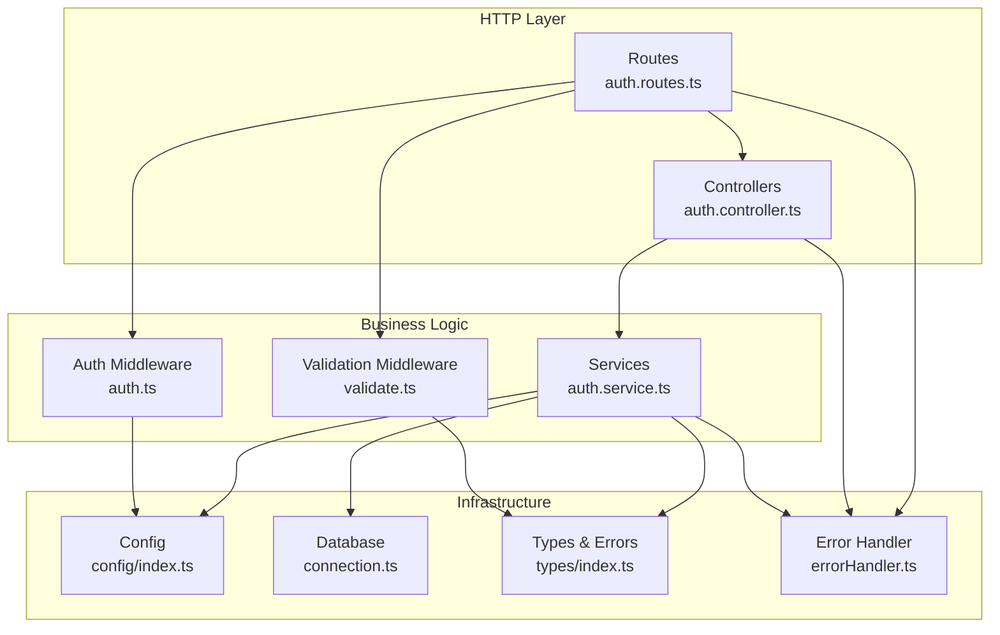
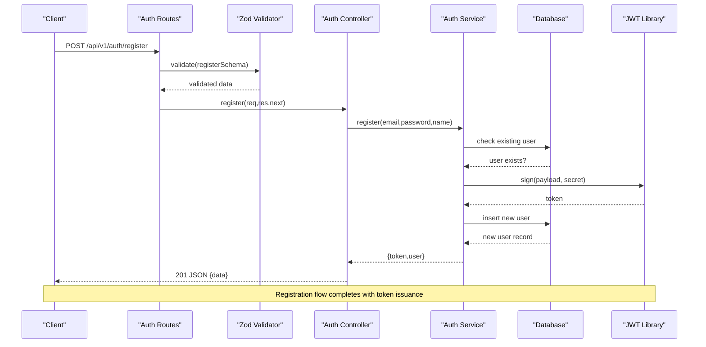
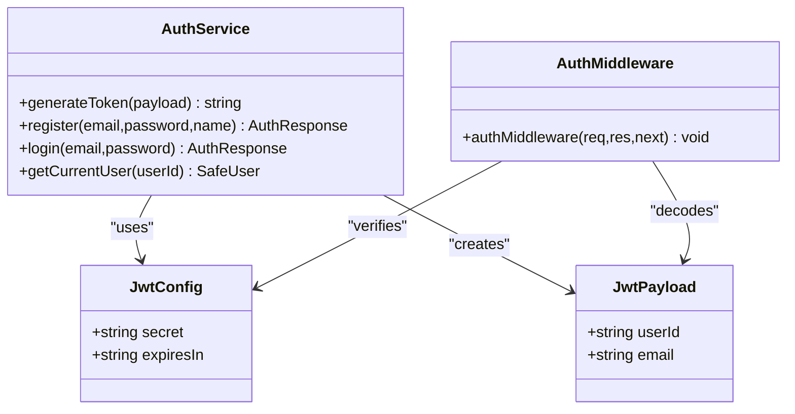
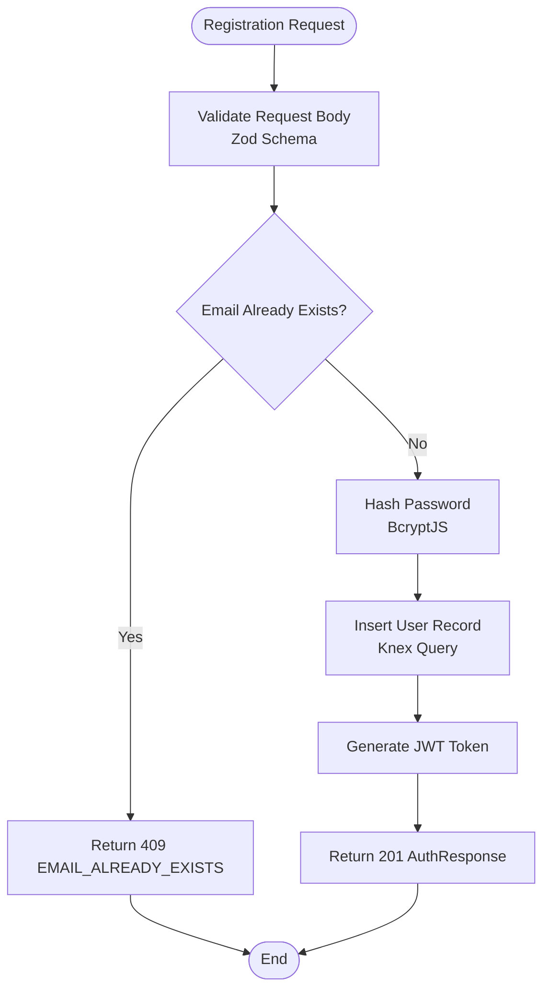
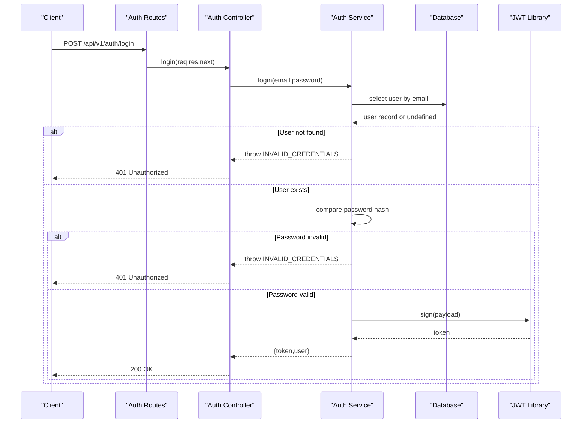
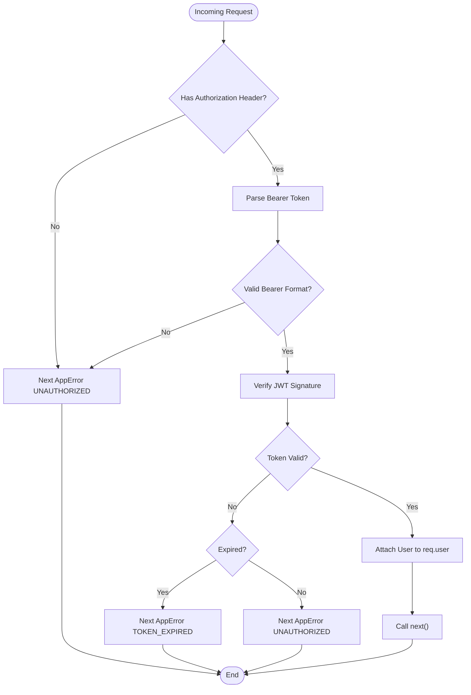
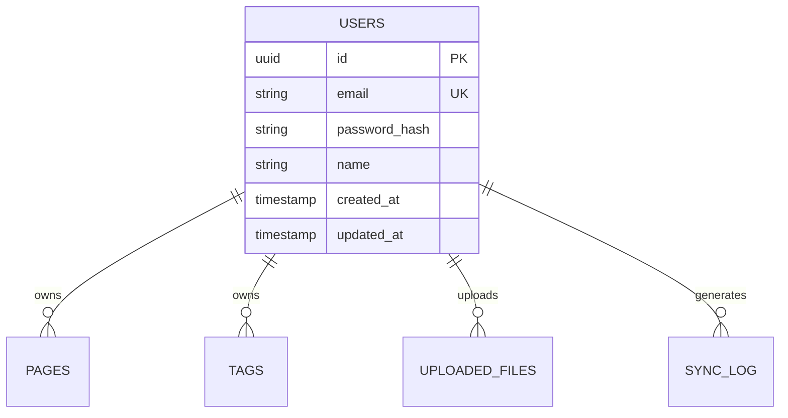
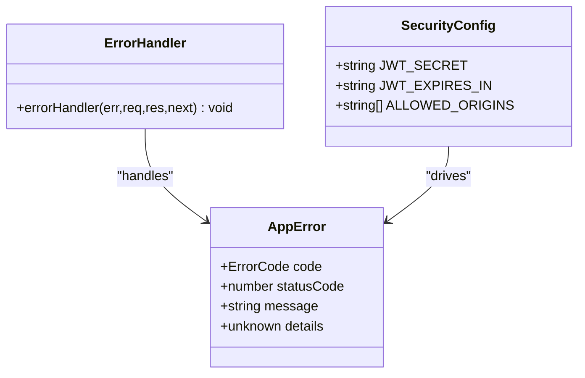
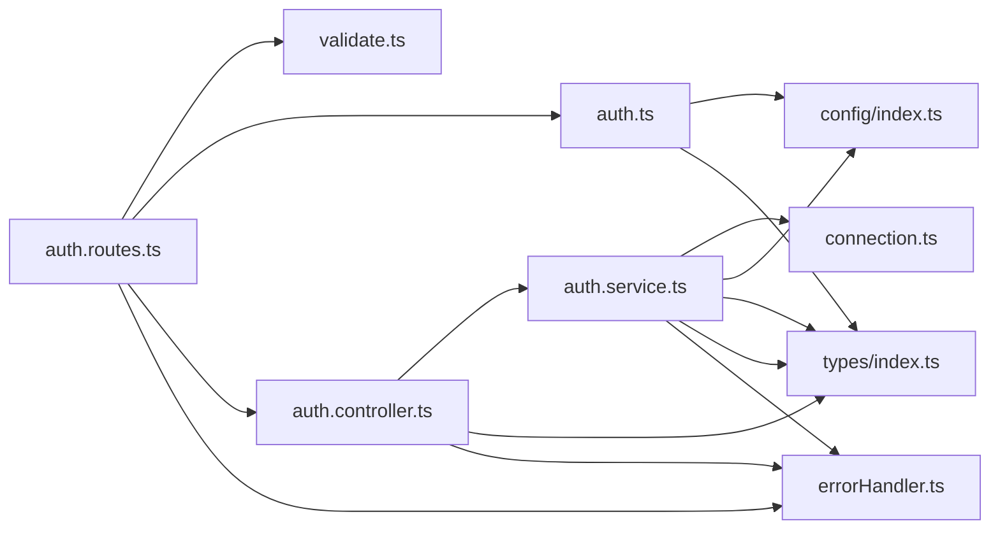

# Backend Authentication Service

<cite>
**Referenced Files in This Document**
- [auth.service.ts](file://code/server/src/services/auth.service.ts)
- [auth.controller.ts](file://code/server/src/controllers/auth.controller.ts)
- [auth.ts](file://code/server/src/middleware/auth.ts)
- [auth.routes.ts](file://code/server/src/routes/auth.routes.ts)
- [index.ts](file://code/server/src/config/index.ts)
- [validate.ts](file://code/server/src/middleware/validate.ts)
- [index.ts](file://code/server/src/types/index.ts)
- [connection.ts](file://code/server/src/db/connection.ts)
- [20260319_init.ts](file://code/server/src/db/migrations/20260319_init.ts)
- [app.ts](file://code/server/src/app.ts)
- [index.ts](file://code/server/src/index.ts)
- [errorHandler.ts](file://code/server/src/middleware/errorHandler.ts)
</cite>

## Table of Contents
1. [Introduction](#introduction)
2. [Project Structure](#project-structure)
3. [Core Components](#core-components)
4. [Architecture Overview](#architecture-overview)
5. [Detailed Component Analysis](#detailed-component-analysis)
6. [Dependency Analysis](#dependency-analysis)
7. [Performance Considerations](#performance-considerations)
8. [Troubleshooting Guide](#troubleshooting-guide)
9. [Conclusion](#conclusion)

## Introduction
This document provides comprehensive documentation for the backend authentication service implementation. It covers JWT token generation and validation, secret key management, token expiration handling, user registration with email validation and password hashing, login process with credential verification and token issuance, authentication middleware for route protection, error handling strategies, input validation with Zod schemas, and security measures against common vulnerabilities. The documentation includes code-level diagrams, sequence diagrams, and practical guidance for developers integrating or extending the authentication system.

## Project Structure
The authentication service follows a layered architecture with clear separation of concerns:
- Routes define HTTP endpoints and apply validation middleware
- Controllers handle HTTP requests/responses and delegate to services
- Services encapsulate business logic including JWT operations, password hashing, and database interactions
- Middleware handles cross-cutting concerns like authentication and input validation
- Configuration manages environment variables and security policies
- Database layer uses Knex for PostgreSQL connections and migrations

**Diagram sources**
- [auth.routes.ts:20-105](file://code/server/src/routes/auth.routes.ts#L20-L105)
- [auth.controller.ts:13-81](file://code/server/src/controllers/auth.controller.ts#L13-L81)
- [auth.service.ts:12-165](file://code/server/src/services/auth.service.ts#L12-L165)
- [validate.ts:31-71](file://code/server/src/middleware/validate.ts#L31-L71)
- [auth.ts:29-59](file://code/server/src/middleware/auth.ts#L29-L59)
- [index.ts:16-98](file://code/server/src/config/index.ts#L16-L98)
- [connection.ts:22-39](file://code/server/src/db/connection.ts#L22-L39)
- [index.ts:153-186](file://code/server/src/types/index.ts#L153-L186)
- [errorHandler.ts:29-67](file://code/server/src/middleware/errorHandler.ts#L29-L67)

**Section sources**
- [auth.routes.ts:10-105](file://code/server/src/routes/auth.routes.ts#L10-L105)
- [auth.controller.ts:12-81](file://code/server/src/controllers/auth.controller.ts#L12-L81)
- [auth.service.ts:11-165](file://code/server/src/services/auth.service.ts#L11-L165)
- [validate.ts:10-71](file://code/server/src/middleware/validate.ts#L10-L71)
- [auth.ts:1-59](file://code/server/src/middleware/auth.ts#L1-L59)
- [index.ts:7-98](file://code/server/src/config/index.ts#L7-L98)
- [connection.ts:8-39](file://code/server/src/db/connection.ts#L8-L39)
- [index.ts:8-186](file://code/server/src/types/index.ts#L8-L186)
- [errorHandler.ts:12-67](file://code/server/src/middleware/errorHandler.ts#L12-L67)

## Core Components
This section documents the primary components involved in authentication:

- **JWT Secret Management**: Environment-driven configuration with production security enforcement
- **Password Hashing**: BcryptJS integration with configurable cost factor
- **Database Operations**: Knex-based user CRUD with proper indexing and constraints
- **Input Validation**: Zod schemas for request body validation
- **Error Handling**: Unified AppError class with HTTP status mapping
- **Route Protection**: Authentication middleware for bearer token validation

Key implementation patterns:
- Service layer isolation for business logic
- Middleware composition for validation and authentication
- Type-safe configuration using Zod environment parsing
- Consistent error response format across all endpoints

**Section sources**
- [index.ts:28-32](file://code/server/src/config/index.ts#L28-L32)
- [auth.service.ts:19-20](file://code/server/src/services/auth.service.ts#L19-L20)
- [connection.ts:22-29](file://code/server/src/db/connection.ts#L22-L29)
- [validate.ts:31-71](file://code/server/src/middleware/validate.ts#L31-L71)
- [index.ts:153-168](file://code/server/src/types/index.ts#L153-L168)

## Architecture Overview
The authentication system implements a clean architecture with explicit boundaries between layers. The request lifecycle flows from HTTP routes through validation and authentication middleware to controllers and services, with database operations handled by the service layer.

**Diagram sources**
- [auth.routes.ts:77-81](file://code/server/src/routes/auth.routes.ts#L77-L81)
- [validate.ts:44-49](file://code/server/src/middleware/validate.ts#L44-L49)
- [auth.controller.ts:26-36](file://code/server/src/controllers/auth.controller.ts#L26-L36)
- [auth.service.ts:68-101](file://code/server/src/services/auth.service.ts#L68-L101)

**Section sources**
- [auth.routes.ts:20-105](file://code/server/src/routes/auth.routes.ts#L20-L105)
- [auth.controller.ts:13-81](file://code/server/src/controllers/auth.controller.ts#L13-L81)
- [auth.service.ts:11-165](file://code/server/src/services/auth.service.ts#L11-L165)

## Detailed Component Analysis

### JWT Token Generation and Validation
The authentication service uses JSON Web Tokens for stateless session management. The implementation includes secure signing with environment-managed secrets and configurable expiration.

**Diagram sources**
- [index.ts:88-94](file://code/server/src/config/index.ts#L88-L94)
- [index.ts:72-75](file://code/server/src/types/index.ts#L72-L75)
- [auth.service.ts:46-50](file://code/server/src/services/auth.service.ts#L46-L50)
- [auth.ts:48-51](file://code/server/src/middleware/auth.ts#L48-L51)

Token generation process:
1. Payload construction with userId and email
2. Signing with HMAC SHA-256 using configured secret
3. Expiration configuration from environment
4. Response formatting with token and user data

Token validation process:
1. Extract Bearer token from Authorization header
2. Verify signature with shared secret
3. Decode payload and attach to request object
4. Handle expired vs invalid token scenarios

Security considerations:
- Production requires JWT_SECRET environment variable (minimum 32 characters)
- Token expiration prevents indefinite access
- No sensitive data stored in JWT payload

**Section sources**
- [auth.service.ts:46-50](file://code/server/src/services/auth.service.ts#L46-L50)
- [auth.ts:48-58](file://code/server/src/middleware/auth.ts#L48-L58)
- [index.ts:52-67](file://code/server/src/config/index.ts#L52-L67)

### User Registration Workflow
The registration process implements comprehensive validation, password security, and database persistence.

**Diagram sources**
- [auth.routes.ts:35-50](file://code/server/src/routes/auth.routes.ts#L35-L50)
- [auth.service.ts:74-101](file://code/server/src/services/auth.service.ts#L74-L101)
- [validate.ts:44-69](file://code/server/src/middleware/validate.ts#L44-L69)

Registration flow details:
1. Input validation using Zod schema with email, password, and name constraints
2. Duplicate email detection before user creation
3. Password hashing with configurable cost factor (10 rounds)
4. Database insertion with returning clause for full record
5. JWT token generation with user payload
6. Safe user serialization excluding sensitive fields

Password hashing implementation:
- Uses bcryptjs library for cryptographically secure hashing
- Cost factor set to 10 for balanced security/performance
- Salt generation handled automatically by bcrypt
- Storage of hashed password only, never plaintext

**Section sources**
- [auth.routes.ts:27-50](file://code/server/src/routes/auth.routes.ts#L27-L50)
- [auth.service.ts:68-101](file://code/server/src/services/auth.service.ts#L68-L101)
- [validate.ts:31-71](file://code/server/src/middleware/validate.ts#L31-L71)

### Login Process and Credential Verification
The login endpoint validates user credentials and issues authentication tokens.

**Diagram sources**
- [auth.routes.ts:88-92](file://code/server/src/routes/auth.routes.ts#L88-L92)
- [auth.controller.ts:47-57](file://code/server/src/controllers/auth.controller.ts#L47-L57)
- [auth.service.ts:117-143](file://code/server/src/services/auth.service.ts#L117-L143)

Login security measures:
- Constant-time comparison using bcrypt.compare to prevent timing attacks
- Same error response for both missing user and invalid password
- Immediate rejection prevents brute force enumeration
- Token issued only upon successful authentication

**Section sources**
- [auth.controller.ts:38-57](file://code/server/src/controllers/auth.controller.ts#L38-L57)
- [auth.service.ts:117-143](file://code/server/src/services/auth.service.ts#L117-L143)

### Authentication Middleware Implementation
The authentication middleware protects routes by validating bearer tokens and injecting user context.

**Diagram sources**
- [auth.ts:29-59](file://code/server/src/middleware/auth.ts#L29-L59)

Middleware functionality:
1. Extracts Authorization header and validates Bearer token format
2. Verifies JWT signature using shared secret
3. Decodes payload and attaches user information to request object
4. Handles specific error cases (missing header, invalid format, expired token)
5. Allows protected routes to access req.user safely

**Section sources**
- [auth.ts:16-59](file://code/server/src/middleware/auth.ts#L16-L59)
- [index.ts:179-186](file://code/server/src/types/index.ts#L179-L186)

### Database Schema and Operations
The authentication system operates on a PostgreSQL schema with proper indexing and constraints.

**Diagram sources**
- [20260319_init.ts:25-42](file://code/server/src/db/migrations/20260319_init.ts#L25-L42)

Database design considerations:
- UUID primary keys for distributed systems compatibility
- Unique constraint on email to prevent duplicates
- Timestamps with automatic updates via triggers
- Proper indexing on frequently queried columns
- Secure password storage using bcrypt hashes

Service-to-database operations:
- Registration checks for existing email before insertion
- Login queries user by email with password hash
- Current user retrieval by ID with safe serialization
- All operations use Knex for type safety and connection pooling

**Section sources**
- [20260319_init.ts:25-42](file://code/server/src/db/migrations/20260319_init.ts#L25-L42)
- [auth.service.ts:74-165](file://code/server/src/services/auth.service.ts#L74-L165)
- [connection.ts:22-39](file://code/server/src/db/connection.ts#L22-L39)

### Error Handling and Security Measures
The system implements comprehensive error handling and security measures:

**Diagram sources**
- [index.ts:153-168](file://code/server/src/types/index.ts#L153-L168)
- [errorHandler.ts:29-67](file://code/server/src/middleware/errorHandler.ts#L29-L67)
- [index.ts:52-67](file://code/server/src/config/index.ts#L52-L67)

Security measures implemented:
- Production-only JWT_SECRET enforcement with minimum length requirement
- CORS whitelist enforcement in production environments
- Rate limiting for all endpoints
- Helmet security headers for HTTP hardening
- Input validation preventing SQL injection and malformed requests
- Password hashing preventing plaintext storage
- Consistent error responses preventing information leakage

**Section sources**
- [errorHandler.ts:18-67](file://code/server/src/middleware/errorHandler.ts#L18-L67)
- [index.ts:52-67](file://code/server/src/config/index.ts#L52-L67)
- [app.ts:67-96](file://code/server/src/app.ts#L67-L96)

## Dependency Analysis
The authentication service demonstrates clean dependency management with clear interfaces and minimal coupling.

**Diagram sources**
- [auth.routes.ts:10-14](file://code/server/src/routes/auth.routes.ts#L10-L14)
- [auth.controller.ts:14-15](file://code/server/src/controllers/auth.controller.ts#L14-L15)
- [auth.service.ts:14-17](file://code/server/src/services/auth.service.ts#L14-L17)
- [auth.ts:11-14](file://code/server/src/middleware/auth.ts#L11-L14)
- [errorHandler.ts:14](file://code/server/src/middleware/errorHandler.ts#L14)

Dependency characteristics:
- High cohesion within each module (single responsibility)
- Loose coupling through well-defined interfaces
- Clear import/export boundaries
- No circular dependencies detected
- External dependencies managed via package.json

**Section sources**
- [auth.routes.ts:10-14](file://code/server/src/routes/auth.routes.ts#L10-L14)
- [auth.controller.ts:14-15](file://code/server/src/controllers/auth.controller.ts#L14-L15)
- [auth.service.ts:14-17](file://code/server/src/services/auth.service.ts#L14-L17)
- [auth.ts:11-14](file://code/server/src/middleware/auth.ts#L11-L14)

## Performance Considerations
The authentication service incorporates several performance optimizations:

- **Connection Pooling**: Knex maintains a pool of database connections (min 2, max 10) to reduce connection overhead
- **Indexing Strategy**: Users table includes unique email index for efficient lookups
- **Bcrypt Cost Factor**: Set to 10 for balanced security and performance
- **JWT Lightweight Payload**: Only essential user data stored in tokens
- **Rate Limiting**: Global rate limiting prevents abuse while maintaining responsiveness
- **Efficient Serialization**: Safe user objects exclude sensitive fields to reduce payload size

Recommendations for production deployment:
- Monitor JWT token expiration impact on client-side caching
- Consider Redis for token blacklisting if logout functionality is needed
- Implement database connection pool monitoring in high-traffic scenarios
- Add circuit breaker patterns for external dependencies

## Troubleshooting Guide
Common authentication issues and their resolutions:

**JWT Secret Configuration Issues**
- Symptom: Application fails to start in production
- Cause: Missing or insufficiently long JWT_SECRET environment variable
- Resolution: Set JWT_SECRET to at least 32 characters in production environment

**Token Validation Failures**
- Symptom: 401 Unauthorized errors on protected routes
- Causes: Missing Authorization header, invalid Bearer format, expired token
- Resolution: Ensure clients send "Authorization: Bearer <token>" headers with valid, unexpired tokens

**Registration Conflicts**
- Symptom: 409 Conflict when registering new users
- Cause: Email already exists in database
- Resolution: Prompt user to use a different email or initiate password reset

**Login Authentication Errors**
- Symptom: 401 Unauthorized on login attempts
- Cause: Incorrect email/password combination
- Resolution: Verify credentials and ensure account exists

**Database Connection Issues**
- Symptom: Operational errors during user operations
- Cause: Database connectivity problems
- Resolution: Check DATABASE_URL configuration and database availability

**Section sources**
- [index.ts:52-67](file://code/server/src/config/index.ts#L52-L67)
- [auth.ts:33-58](file://code/server/src/middleware/auth.ts#L33-L58)
- [auth.service.ts:75-132](file://code/server/src/services/auth.service.ts#L75-L132)
- [errorHandler.ts:38-66](file://code/server/src/middleware/errorHandler.ts#L38-L66)

## Conclusion
The backend authentication service implements a robust, secure, and maintainable authentication system following modern best practices. Key strengths include:

- **Security-First Design**: Production-enforced JWT secrets, secure password hashing, and comprehensive input validation
- **Clean Architecture**: Well-separated layers with clear responsibilities and interfaces
- **Type Safety**: Full TypeScript coverage with Zod for runtime validation
- **Production Ready**: Comprehensive error handling, logging, and security middleware
- **Extensible Design**: Modular components that can be easily tested and maintained

The implementation provides a solid foundation for user authentication with room for future enhancements such as refresh token support, multi-factor authentication, and advanced audit logging. The codebase demonstrates excellent engineering practices with comprehensive error handling, security measures, and performance considerations.