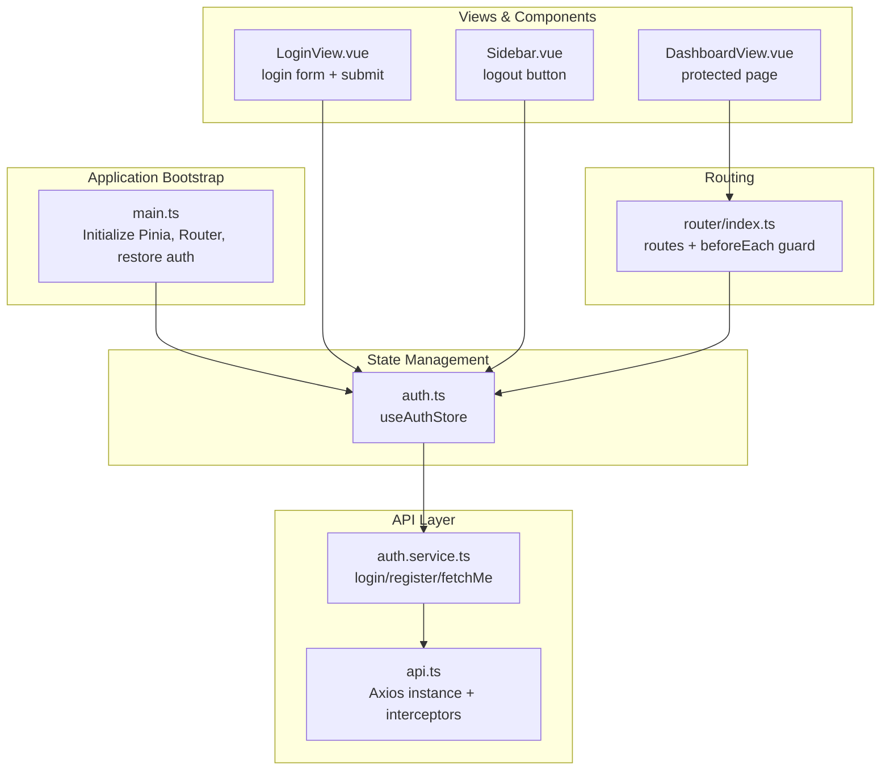
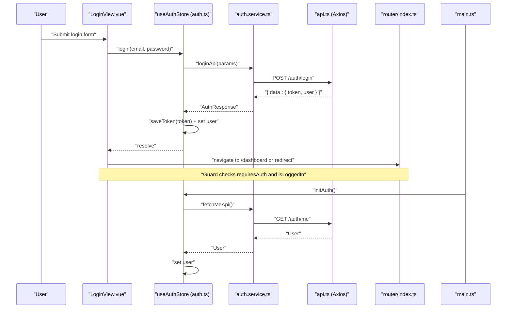
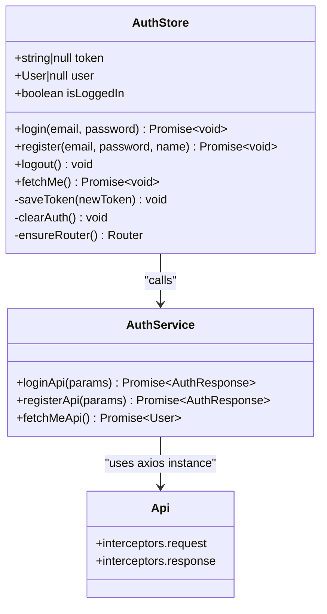
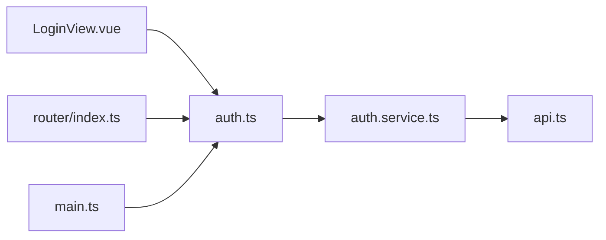

# Frontend Authentication Store

<cite>
**Referenced Files in This Document**
- [auth.ts](file://code/client/src/stores/auth.ts)
- [auth.service.ts](file://code/client/src/services/auth.service.ts)
- [api.ts](file://code/client/src/services/api.ts)
- [index.ts](file://code/client/src/router/index.ts)
- [main.ts](file://code/client/src/main.ts)
- [LoginView.vue](file://code/client/src/views/LoginView.vue)
- [DashboardView.vue](file://code/client/src/views/DashboardView.vue)
- [Sidebar.vue](file://code/client/src/components/sidebar/Sidebar.vue)
- [index.ts](file://code/client/src/types/index.ts)
- [vite.config.ts](file://code/client/vite.config.ts)
</cite>

## Table of Contents
1. [Introduction](#introduction)
2. [Project Structure](#project-structure)
3. [Core Components](#core-components)
4. [Architecture Overview](#architecture-overview)
5. [Detailed Component Analysis](#detailed-component-analysis)
6. [Dependency Analysis](#dependency-analysis)
7. [Performance Considerations](#performance-considerations)
8. [Troubleshooting Guide](#troubleshooting-guide)
9. [Conclusion](#conclusion)
10. [Appendices](#appendices)

## Introduction
This document explains the frontend authentication state management built with Pinia stores, Vue Router navigation guards, and Axios interceptors. It covers:
- Authentication state structure (token and user)
- Token persistence and restoration
- Login/logout handlers and API integration
- Navigation guards for protected routes
- Automatic logout on token expiration
- Error handling for authentication failures
- Practical usage patterns with Vue components and composables
- Local storage security considerations and cleanup strategies

## Project Structure
The authentication system spans several modules:
- Pinia store for state and actions
- API service wrappers for authentication endpoints
- Axios instance with request/response interceptors
- Vue Router with global navigation guards
- Application bootstrap that restores authentication state
- Vue components that consume the store and trigger actions

**Diagram sources**
- [main.ts:33-43](file://code/client/src/main.ts#L33-L43)
- [auth.ts:26-137](file://code/client/src/stores/auth.ts#L26-L137)
- [auth.service.ts:18-45](file://code/client/src/services/auth.service.ts#L18-L45)
- [api.ts:14-61](file://code/client/src/services/api.ts#L14-L61)
- [index.ts:68-90](file://code/client/src/router/index.ts#L68-L90)
- [LoginView.vue:110-133](file://code/client/src/views/LoginView.vue#L110-L133)
- [DashboardView.vue:10-23](file://code/client/src/views/DashboardView.vue#L10-L23)
- [Sidebar.vue:21-23](file://code/client/src/components/sidebar/Sidebar.vue#L21-L23)

**Section sources**
- [main.ts:33-43](file://code/client/src/main.ts#L33-L43)
- [auth.ts:26-137](file://code/client/src/stores/auth.ts#L26-L137)
- [auth.service.ts:18-45](file://code/client/src/services/auth.service.ts#L18-L45)
- [api.ts:14-61](file://code/client/src/services/api.ts#L14-L61)
- [index.ts:68-90](file://code/client/src/router/index.ts#L68-L90)
- [LoginView.vue:110-133](file://code/client/src/views/LoginView.vue#L110-L133)
- [DashboardView.vue:10-23](file://code/client/src/views/DashboardView.vue#L10-L23)
- [Sidebar.vue:21-23](file://code/client/src/components/sidebar/Sidebar.vue#L21-L23)

## Core Components
- Pinia store (Composition API style):
  - Reactive state: token and user
  - Computed: isLoggedIn
  - Actions: login, register, logout, fetchMe
  - Persistence: localStorage for token
- API service:
  - loginApi, registerApi, fetchMeApi
  - Unified response shape wrapping backend { data: ... }
- Axios instance:
  - Injects Authorization header automatically
  - 401 response handler clears token and redirects to login
- Router:
  - Routes with requiresAuth metadata
  - Global beforeEach guard enforces auth policy
- Application bootstrap:
  - On startup, attempts to restore auth state via fetchMe

Key integration points:
- Components import and use useAuthStore
- Router guards depend on store.isLoggedIn
- Axios interceptors rely on localStorage for Authorization

**Section sources**
- [auth.ts:26-137](file://code/client/src/stores/auth.ts#L26-L137)
- [auth.service.ts:18-45](file://code/client/src/services/auth.service.ts#L18-L45)
- [api.ts:14-61](file://code/client/src/services/api.ts#L14-L61)
- [index.ts:68-90](file://code/client/src/router/index.ts#L68-L90)
- [main.ts:33-43](file://code/client/src/main.ts#L33-L43)

## Architecture Overview
The authentication flow integrates state, routing, and HTTP layers:

**Diagram sources**
- [LoginView.vue:110-133](file://code/client/src/views/LoginView.vue#L110-L133)
- [auth.ts:80-84](file://code/client/src/stores/auth.ts#L80-L84)
- [auth.service.ts:23-26](file://code/client/src/services/auth.service.ts#L23-L26)
- [api.ts:14-24](file://code/client/src/services/api.ts#L14-L24)
- [index.ts:68-90](file://code/client/src/router/index.ts#L68-L90)
- [main.ts:33-43](file://code/client/src/main.ts#L33-L43)

## Detailed Component Analysis

### Pinia Authentication Store (useAuthStore)
Responsibilities:
- Manage token and user state
- Persist token to localStorage
- Provide login/register/logout/fetchMe actions
- Compute isLoggedIn based on token and user presence

State and computed:
- token: string | null (restored from localStorage)
- user: User | null
- isLoggedIn: boolean

Actions:
- login(email, password): calls loginApi, saves token, sets user
- register(email, password, name): calls registerApi, saves token, sets user
- logout(): clears token/user, removes localStorage item, navigates to /login
- fetchMe(): calls fetchMeApi; on error, clears auth

Persistence and restoration:
- Token stored under a fixed key in localStorage
- On app init, if token exists but no user, calls fetchMe to hydrate user

Security note:
- Token is stored in localStorage; see Troubleshooting Guide for mitigation strategies.

**Section sources**
- [auth.ts:26-137](file://code/client/src/stores/auth.ts#L26-L137)
- [types/index.ts:6-16](file://code/client/src/types/index.ts#L6-L16)

#### Class Diagram: Store Methods and Dependencies

**Diagram sources**
- [auth.ts:26-137](file://code/client/src/stores/auth.ts#L26-L137)
- [auth.service.ts:18-45](file://code/client/src/services/auth.service.ts#L18-L45)
- [api.ts:14-61](file://code/client/src/services/api.ts#L14-L61)

### Authentication Service Wrappers
- loginApi(params): posts to /auth/login, returns AuthResponse
- registerApi(params): posts to /auth/register, returns AuthResponse
- fetchMeApi(): gets /auth/me, returns User

These functions encapsulate backend response shapes and expose typed results to the store.

**Section sources**
- [auth.service.ts:18-45](file://code/client/src/services/auth.service.ts#L18-L45)
- [types/index.ts:31-37](file://code/client/src/types/index.ts#L31-L37)

### Axios Instance and Interceptors
- Base URL: /api/v1
- Request interceptor: injects Authorization: Bearer <token> from localStorage
- Response interceptor: on 401, clears localStorage token and redirects to /login (unless already on /login)

This ensures:
- All authenticated requests carry the token
- Unauthorized responses trigger automatic logout

**Section sources**
- [api.ts:14-61](file://code/client/src/services/api.ts#L14-L61)

### Vue Router Navigation Guards
Routes:
- /login: requiresAuth: false
- /register: requiresAuth: false
- /dashboard: requiresAuth: true

Global beforeEach guard:
- If accessing a protected route without isLoggedIn, redirect to /login with redirect query
- If accessing public login/register while logged in, redirect to /dashboard

This prevents unauthorized access and improves UX by redirecting appropriately.

**Section sources**
- [index.ts:16-48](file://code/client/src/router/index.ts#L16-L48)
- [index.ts:68-90](file://code/client/src/router/index.ts#L68-L90)

### Application Bootstrap and Auth Restoration
On startup:
- Install Pinia and Router
- Import useAuthStore and call fetchMe if token exists but user does not
- Mount the app after restoration completes

This ensures the app starts with hydrated user data when a token is present.

**Section sources**
- [main.ts:33-43](file://code/client/src/main.ts#L33-L43)

### Login View Integration
- Uses useAuthStore to call login
- Validates form inputs
- Handles success (show alert, navigate) and failure (show error alert)
- Supports demo login for development

**Section sources**
- [LoginView.vue:110-133](file://code/client/src/views/LoginView.vue#L110-L133)

### Logout Integration
- Sidebar triggers authStore.logout()
- logout() clears token/user and navigates to /login

**Section sources**
- [Sidebar.vue:21-23](file://code/client/src/components/sidebar/Sidebar.vue#L21-L23)
- [auth.ts:103-107](file://code/client/src/stores/auth.ts#L103-L107)

### Token Refresh Mechanisms and Expiration Handling
Current implementation:
- No explicit token refresh mechanism is implemented in the store or service
- On 401 responses, the Axios interceptor clears localStorage and redirects to /login
- The store’s fetchMe action clears auth on failure

Recommendations:
- Implement a token refresh endpoint and integrate it in the store
- Add a refresh action that calls a refresh API and updates token/user
- Consider adding a small buffer window before expiration to proactively refresh
- Use a debounced refresh strategy to avoid concurrent refresh calls

[No sources needed since this section provides general guidance]

### Error Handling for Authentication Failures
- Login/register failures surface user-friendly messages via alerts
- 401 responses trigger automatic logout and redirect
- fetchMe failures clear auth to prevent stale state

**Section sources**
- [LoginView.vue:125-132](file://code/client/src/views/LoginView.vue#L125-L132)
- [api.ts:48-61](file://code/client/src/services/api.ts#L48-L61)
- [auth.ts:114-122](file://code/client/src/stores/auth.ts#L114-L122)

### Local Storage Security Considerations and Cleanup
- Token stored in localStorage under a fixed key
- Security risks: XSS, session theft, shared device exposure
- Mitigations:
  - Prefer HttpOnly cookies for tokens when backend supports it
  - Add SameSite and Secure attributes to cookies
  - Implement Content Security Policy (CSP)
  - Rotate tokens frequently and invalidate on logout
  - Clear localStorage on logout and on sensitive operations
- Cleanup strategies:
  - logout() removes token from localStorage
  - fetchMe() clears auth on error
  - Axios interceptor clears token on 401

**Section sources**
- [auth.ts:24](file://code/client/src/stores/auth.ts#L24)
- [auth.ts:67-71](file://code/client/src/stores/auth.ts#L67-L71)
- [auth.ts:118-121](file://code/client/src/stores/auth.ts#L118-L121)
- [api.ts:51-58](file://code/client/src/services/api.ts#L51-L58)

## Dependency Analysis
High-level dependencies:
- LoginView.vue depends on useAuthStore
- useAuthStore depends on auth.service.ts
- auth.service.ts depends on api.ts
- router/index.ts depends on useAuthStore
- main.ts depends on useAuthStore and calls fetchMe

**Diagram sources**
- [LoginView.vue:19](file://code/client/src/views/LoginView.vue#L19)
- [auth.ts:26-137](file://code/client/src/stores/auth.ts#L26-L137)
- [auth.service.ts:18-45](file://code/client/src/services/auth.service.ts#L18-L45)
- [api.ts:14-61](file://code/client/src/services/api.ts#L14-L61)
- [index.ts:68-90](file://code/client/src/router/index.ts#L68-L90)
- [main.ts:33-43](file://code/client/src/main.ts#L33-L43)

**Section sources**
- [LoginView.vue:19](file://code/client/src/views/LoginView.vue#L19)
- [auth.ts:26-137](file://code/client/src/stores/auth.ts#L26-L137)
- [auth.service.ts:18-45](file://code/client/src/services/auth.service.ts#L18-L45)
- [api.ts:14-61](file://code/client/src/services/api.ts#L14-L61)
- [index.ts:68-90](file://code/client/src/router/index.ts#L68-L90)
- [main.ts:33-43](file://code/client/src/main.ts#L33-L43)

## Performance Considerations
- Avoid unnecessary re-renders by using computed properties (isLoggedIn) and reactive refs
- Debounce or coalesce repeated login/logout calls
- Minimize network calls by checking token presence before attempting fetchMe
- Use lazy imports for router guards and store to reduce initial bundle size

[No sources needed since this section provides general guidance]

## Troubleshooting Guide
Common issues and resolutions:
- Stale token causing 401:
  - Axios interceptor clears localStorage and redirects to /login
  - Ensure backend returns 401 for invalid/expired tokens
- Redirect loops on /login:
  - Guard avoids redirect loop by checking current pathname
- Token not persisting:
  - Verify localStorage key and that saveToken writes to localStorage
- fetchMe failing silently:
  - Store clears auth on error; ensure backend returns proper error payload

Security hardening:
- Replace localStorage with HttpOnly cookies for tokens
- Enforce CSP and secure headers
- Implement CSRF protection and SameSite cookies

**Section sources**
- [api.ts:48-61](file://code/client/src/services/api.ts#L48-L61)
- [index.ts:74-80](file://code/client/src/router/index.ts#L74-L80)
- [auth.ts:59-62](file://code/client/src/stores/auth.ts#L59-L62)
- [auth.ts:118-121](file://code/client/src/stores/auth.ts#L118-L121)

## Conclusion
The frontend authentication system uses a clean separation of concerns:
- Pinia store manages reactive state and actions
- API service wraps backend endpoints
- Axios interceptors centralize token injection and 401 handling
- Router guards enforce access control
- Application bootstrap restores state on startup

This design enables predictable authentication flows, robust error handling, and straightforward integration with Vue components.

## Appendices

### API Definitions
- POST /auth/login: accepts email/password, returns { token, user }
- POST /auth/register: accepts email/password/name, returns { token, user }
- GET /auth/me: returns current user profile

**Section sources**
- [auth.service.ts:23-45](file://code/client/src/services/auth.service.ts#L23-L45)
- [types/index.ts:18-37](file://code/client/src/types/index.ts#L18-L37)

### Development Proxy Configuration
- Vite proxies /api to backend service during development

**Section sources**
- [vite.config.ts:23-32](file://code/client/vite.config.ts#L23-L32)