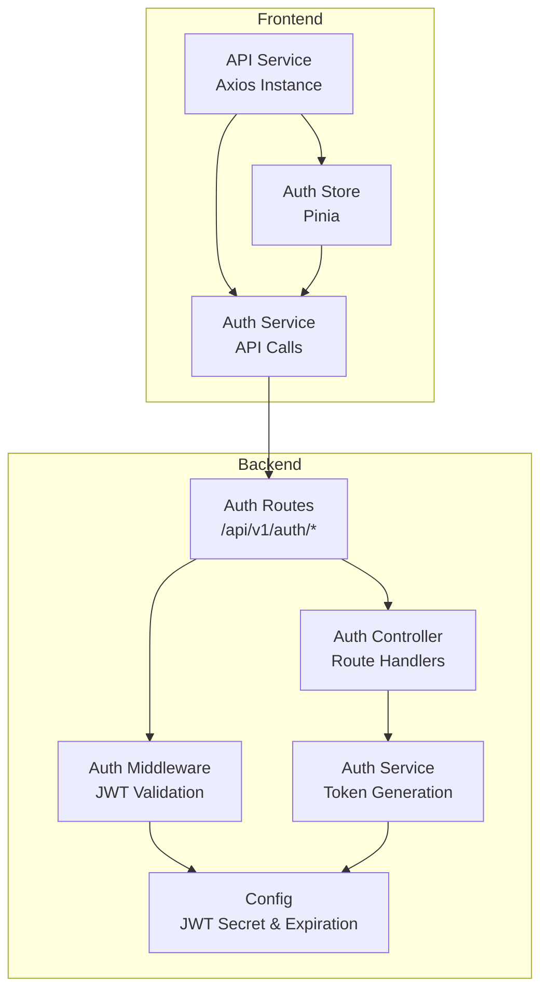
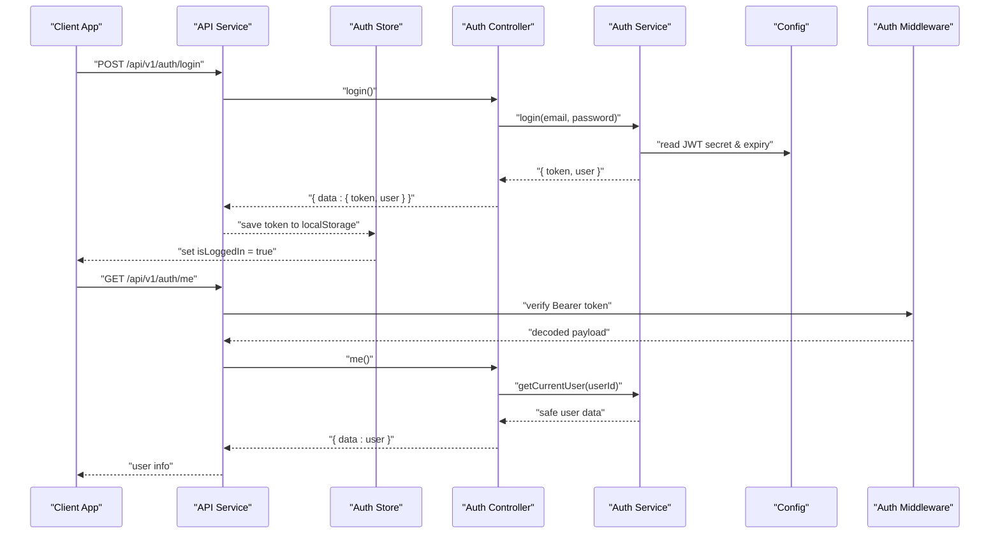
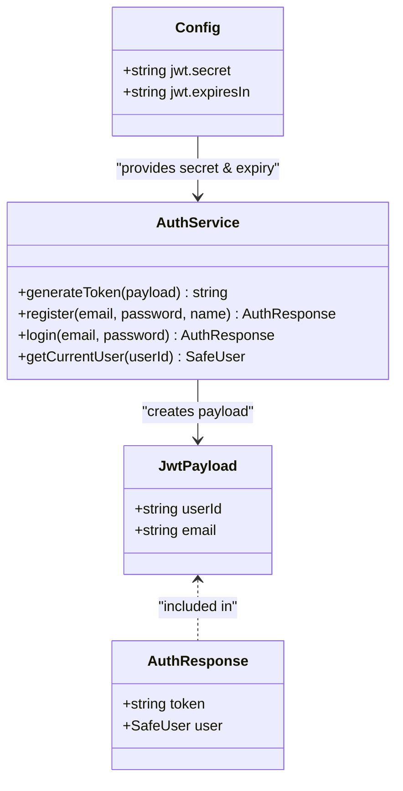
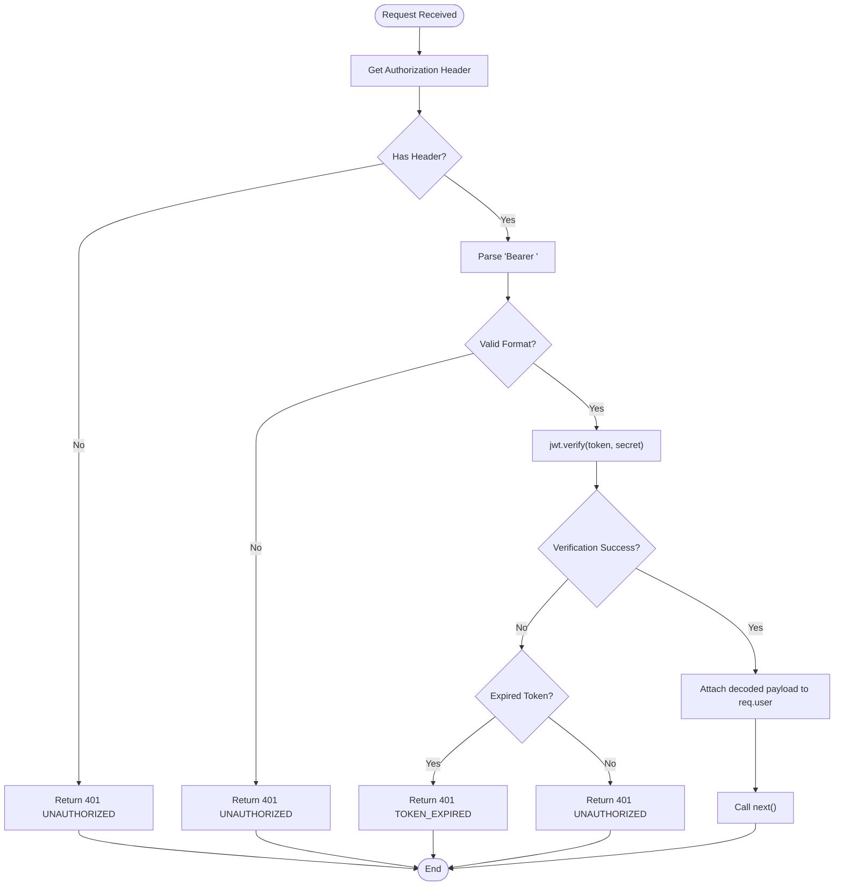
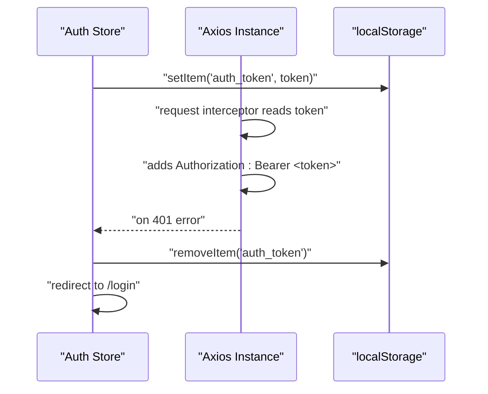
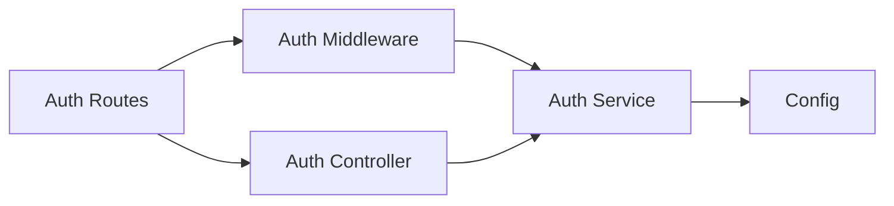
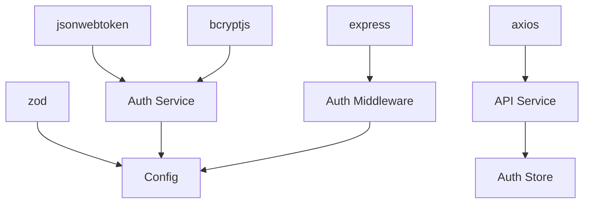

# JWT Token Management

<cite>
**Referenced Files in This Document**
- [auth.ts](file://code/server/src/middleware/auth.ts)
- [auth.service.ts](file://code/server/src/services/auth.service.ts)
- [auth.controller.ts](file://code/server/src/controllers/auth.controller.ts)
- [auth.routes.ts](file://code/server/src/routes/auth.routes.ts)
- [index.ts](file://code/server/src/config/index.ts)
- [errorHandler.ts](file://code/server/src/middleware/errorHandler.ts)
- [api.ts](file://code/client/src/services/api.ts)
- [auth.service.ts](file://code/client/src/services/auth.service.ts)
- [auth.ts](file://code/client/src/stores/auth.ts)
- [index.ts](file://code/server/src/types/index.ts)
- [API-SPEC.md](file://api-spec/API-SPEC.md)
</cite>

## Table of Contents
1. [Introduction](#introduction)
2. [Project Structure](#project-structure)
3. [Core Components](#core-components)
4. [Architecture Overview](#architecture-overview)
5. [Detailed Component Analysis](#detailed-component-analysis)
6. [Dependency Analysis](#dependency-analysis)
7. [Performance Considerations](#performance-considerations)
8. [Troubleshooting Guide](#troubleshooting-guide)
9. [Conclusion](#conclusion)

## Introduction
This document provides comprehensive documentation for JWT token lifecycle management in the Yule-Notion application. It explains token generation, validation, and refresh mechanisms, including payload structure, expiration handling, and security considerations. It documents token storage strategies on both frontend (localStorage) and backend (HTTP-only cookies), and details the token refresh process for maintaining user sessions without re-authentication. The document covers token validation middleware implementation, header parsing, and error handling for invalid/expired tokens, along with practical examples of token extraction, verification, and renewal workflows. Security best practices such as token signing algorithms, secret key management, and protection against token theft attacks are addressed.

## Project Structure
The JWT implementation spans both the backend server and the frontend client, with clear separation of concerns:
- Backend: Authentication middleware, service layer, controller, routes, and configuration
- Frontend: API service with interceptors, authentication service, and Pinia store for state management

**Diagram sources**
- [auth.ts:29-59](file://code/server/src/middleware/auth.ts#L29-L59)
- [auth.service.ts:46-50](file://code/server/src/services/auth.service.ts#L46-L50)
- [auth.controller.ts:26-81](file://code/server/src/controllers/auth.controller.ts#L26-L81)
- [auth.routes.ts:20-105](file://code/server/src/routes/auth.routes.ts#L20-L105)
- [index.ts:88-94](file://code/server/src/config/index.ts#L88-L94)
- [api.ts:15-63](file://code/client/src/services/api.ts#L15-L63)
- [auth.ts:26-137](file://code/client/src/stores/auth.ts#L26-L137)

**Section sources**
- [auth.ts:1-60](file://code/server/src/middleware/auth.ts#L1-L60)
- [auth.service.ts:1-166](file://code/server/src/services/auth.service.ts#L1-L166)
- [auth.controller.ts:1-82](file://code/server/src/controllers/auth.controller.ts#L1-L82)
- [auth.routes.ts:1-106](file://code/server/src/routes/auth.routes.ts#L1-L106)
- [index.ts:1-101](file://code/server/src/config/index.ts#L1-L101)
- [api.ts:1-64](file://code/client/src/services/api.ts#L1-L64)
- [auth.ts:1-138](file://code/client/src/stores/auth.ts#L1-L138)

## Core Components
- JWT Payload Structure: The payload carries minimal user identifiers required for session management.
- Token Generation: Backend generates JWT tokens during registration and login with configured expiration.
- Token Validation: Middleware extracts and validates Bearer tokens from requests.
- Token Storage: Frontend persists tokens in localStorage; backend does not implement HTTP-only cookie storage in this codebase.
- Token Refresh: The current implementation does not include a dedicated token refresh mechanism; expired tokens require re-authentication.

Key implementation references:
- JWT payload definition and error codes: [index.ts:69-112](file://code/server/src/types/index.ts#L69-L112)
- Token generation with expiration: [auth.service.ts:46-50](file://code/server/src/services/auth.service.ts#L46-L50)
- Bearer token extraction and validation: [auth.ts:29-59](file://code/server/src/middleware/auth.ts#L29-L59)
- Frontend token persistence and interceptor injection: [api.ts:30-41](file://code/client/src/services/api.ts#L30-L41), [auth.ts:59-71](file://code/client/src/stores/auth.ts#L59-L71)

**Section sources**
- [index.ts:69-112](file://code/server/src/types/index.ts#L69-L112)
- [auth.service.ts:46-50](file://code/server/src/services/auth.service.ts#L46-L50)
- [auth.ts:29-59](file://code/server/src/middleware/auth.ts#L29-L59)
- [api.ts:30-41](file://code/client/src/services/api.ts#L30-L41)
- [auth.ts:59-71](file://code/client/src/stores/auth.ts#L59-L71)

## Architecture Overview
The JWT lifecycle follows a clear flow from client to server and back:
1. Client sends credentials to backend.
2. Backend verifies credentials and issues a JWT token with expiration.
3. Client stores the token and automatically attaches it to subsequent requests.
4. Server validates the token via middleware before processing protected routes.
5. On token expiration or invalidation, server responds with 401; client clears stored token and redirects to login.

**Diagram sources**
- [auth.controller.ts:47-81](file://code/server/src/controllers/auth.controller.ts#L47-L81)
- [auth.service.ts:117-143](file://code/server/src/services/auth.service.ts#L117-L143)
- [auth.ts:29-59](file://code/server/src/middleware/auth.ts#L29-L59)
- [index.ts:88-94](file://code/server/src/config/index.ts#L88-L94)
- [api.ts:30-41](file://code/client/src/services/api.ts#L30-L41)
- [auth.ts:80-97](file://code/client/src/stores/auth.ts#L80-L97)

## Detailed Component Analysis

### JWT Payload and Token Generation
- Payload Structure: The JWT payload includes minimal user identifiers sufficient for session management.
- Token Generation: Tokens are signed with the configured secret and include an expiration period.
- Expiration Handling: Expiration is enforced by the JWT library and mapped to specific error codes.

**Diagram sources**
- [index.ts:69-75](file://code/server/src/types/index.ts#L69-L75)
- [index.ts:39-42](file://code/server/src/types/index.ts#L39-L42)
- [index.ts:88-94](file://code/server/src/config/index.ts#L88-L94)
- [auth.service.ts:46-50](file://code/server/src/services/auth.service.ts#L46-L50)

**Section sources**
- [index.ts:69-75](file://code/server/src/types/index.ts#L69-L75)
- [auth.service.ts:46-50](file://code/server/src/services/auth.service.ts#L46-L50)
- [index.ts:88-94](file://code/server/src/config/index.ts#L88-L94)

### Token Validation Middleware
- Header Parsing: Extracts Authorization header and validates Bearer token format.
- Verification: Uses the configured JWT secret to verify token signature.
- Error Handling: Distinguishes between missing/invalid tokens and expired tokens, returning appropriate error codes.

**Diagram sources**
- [auth.ts:29-59](file://code/server/src/middleware/auth.ts#L29-L59)

**Section sources**
- [auth.ts:29-59](file://code/server/src/middleware/auth.ts#L29-L59)

### Frontend Token Storage and Interceptors
- Token Persistence: The Pinia store saves tokens to localStorage upon successful login/register.
- Automatic Injection: Axios request interceptor adds Authorization header for all authenticated requests.
- Error Handling: Response interceptor detects 401 errors, clears local token, and navigates to login.

**Diagram sources**
- [auth.ts:59-71](file://code/client/src/stores/auth.ts#L59-L71)
- [api.ts:30-41](file://code/client/src/services/api.ts#L30-L41)
- [api.ts:48-61](file://code/client/src/services/api.ts#L48-L61)

**Section sources**
- [auth.ts:59-71](file://code/client/src/stores/auth.ts#L59-L71)
- [api.ts:30-41](file://code/client/src/services/api.ts#L30-L41)
- [api.ts:48-61](file://code/client/src/services/api.ts#L48-L61)

### Backend Route Protection
- Protected Routes: The /api/v1/auth/me endpoint requires authentication via the auth middleware.
- Request Flow: Registration and login endpoints do not require authentication; protected endpoints enforce JWT validation.

**Diagram sources**
- [auth.routes.ts:98-102](file://code/server/src/routes/auth.routes.ts#L98-L102)
- [auth.controller.ts:70-81](file://code/server/src/controllers/auth.controller.ts#L70-L81)
- [auth.ts:29-59](file://code/server/src/middleware/auth.ts#L29-L59)
- [auth.service.ts:117-143](file://code/server/src/services/auth.service.ts#L117-L143)
- [index.ts:88-94](file://code/server/src/config/index.ts#L88-L94)

**Section sources**
- [auth.routes.ts:98-102](file://code/server/src/routes/auth.routes.ts#L98-L102)
- [auth.controller.ts:70-81](file://code/server/src/controllers/auth.controller.ts#L70-L81)

### Practical Workflows

#### Token Extraction and Verification
- Client-side extraction: The API service reads the token from localStorage and injects it into the Authorization header for every request.
- Server-side verification: The auth middleware parses the header, validates the Bearer format, and verifies the token signature using the configured secret.

References:
- [api.ts:30-41](file://code/client/src/services/api.ts#L30-L41)
- [auth.ts:29-59](file://code/server/src/middleware/auth.ts#L29-L59)

#### Token Renewal Workflow
- Current Implementation: There is no dedicated token refresh endpoint or automatic renewal mechanism in the current codebase.
- Manual Renewal: When a token expires, clients must re-authenticate to obtain a new token.

References:
- [auth.controller.ts:26-81](file://code/server/src/controllers/auth.controller.ts#L26-L81)
- [auth.service.ts:46-50](file://code/server/src/services/auth.service.ts#L46-L50)

#### Error Handling for Invalid/Expired Tokens
- Backend: The auth middleware distinguishes expired tokens and invalid tokens, returning appropriate error codes mapped to 401 responses.
- Frontend: The response interceptor handles 401 errors by clearing the token and redirecting to the login page.

References:
- [auth.ts:52-58](file://code/server/src/middleware/auth.ts#L52-L58)
- [errorHandler.ts:38-55](file://code/server/src/middleware/errorHandler.ts#L38-L55)
- [api.ts:48-61](file://code/client/src/services/api.ts#L48-L61)

## Dependency Analysis
The JWT implementation relies on several key dependencies and configurations:
- jsonwebtoken: Used for signing and verifying JWT tokens.
- bcryptjs: Used for password hashing and comparison.
- Zod: Validates environment variables and ensures secure defaults in production.
- Express: Provides middleware and routing infrastructure.
- Axios: Handles HTTP requests and interceptors for token injection and error handling.

**Diagram sources**
- [auth.service.ts:12-17](file://code/server/src/services/auth.service.ts#L12-L17)
- [index.ts:8-44](file://code/server/src/config/index.ts#L8-L44)
- [auth.ts:11-14](file://code/server/src/middleware/auth.ts#L11-L14)
- [api.ts:11-24](file://code/client/src/services/api.ts#L11-L24)

**Section sources**
- [auth.service.ts:12-17](file://code/server/src/services/auth.service.ts#L12-L17)
- [index.ts:8-44](file://code/server/src/config/index.ts#L8-L44)
- [auth.ts:11-14](file://code/server/src/middleware/auth.ts#L11-L14)
- [api.ts:11-24](file://code/client/src/services/api.ts#L11-L24)

## Performance Considerations
- Token Verification Overhead: Each protected request triggers a synchronous JWT verification operation. This is lightweight but should be considered in high-throughput scenarios.
- Password Hashing: bcrypt is computationally expensive; ensure salt rounds are balanced for security and performance.
- Network Latency: Frontend interceptors add minimal overhead by reading a single localStorage item and attaching a header.

## Troubleshooting Guide
Common issues and resolutions:
- Missing Authorization Header: Ensure the client sets the Authorization header with the Bearer token format.
- Invalid Token Format: Confirm the header follows "Bearer <token>" and contains no extra spaces or malformed tokens.
- Token Expiration: When receiving 401 TOKEN_EXPIRED, prompt the user to re-authenticate.
- Production Environment Misconfiguration: Ensure JWT_SECRET is set and at least 32 characters long; configure ALLOWED_ORIGINS for production.

References:
- [auth.ts:33-43](file://code/server/src/middleware/auth.ts#L33-L43)
- [auth.ts:52-58](file://code/server/src/middleware/auth.ts#L52-L58)
- [index.ts:52-67](file://code/server/src/config/index.ts#L52-L67)
- [errorHandler.ts:38-55](file://code/server/src/middleware/errorHandler.ts#L38-L55)

**Section sources**
- [auth.ts:33-43](file://code/server/src/middleware/auth.ts#L33-L43)
- [auth.ts:52-58](file://code/server/src/middleware/auth.ts#L52-L58)
- [index.ts:52-67](file://code/server/src/config/index.ts#L52-L67)
- [errorHandler.ts:38-55](file://code/server/src/middleware/errorHandler.ts#L38-L55)

## Conclusion
The Yule-Notion application implements a straightforward JWT-based authentication system with clear separation between frontend and backend responsibilities. Tokens are generated on the backend with configurable expiration, validated by middleware, and persisted in the frontend’s localStorage with automatic header injection. While the current implementation does not include token refresh, it provides robust error handling and security checks suitable for development and production environments when properly configured. Future enhancements could include a dedicated refresh endpoint and HTTP-only cookie storage for improved security.