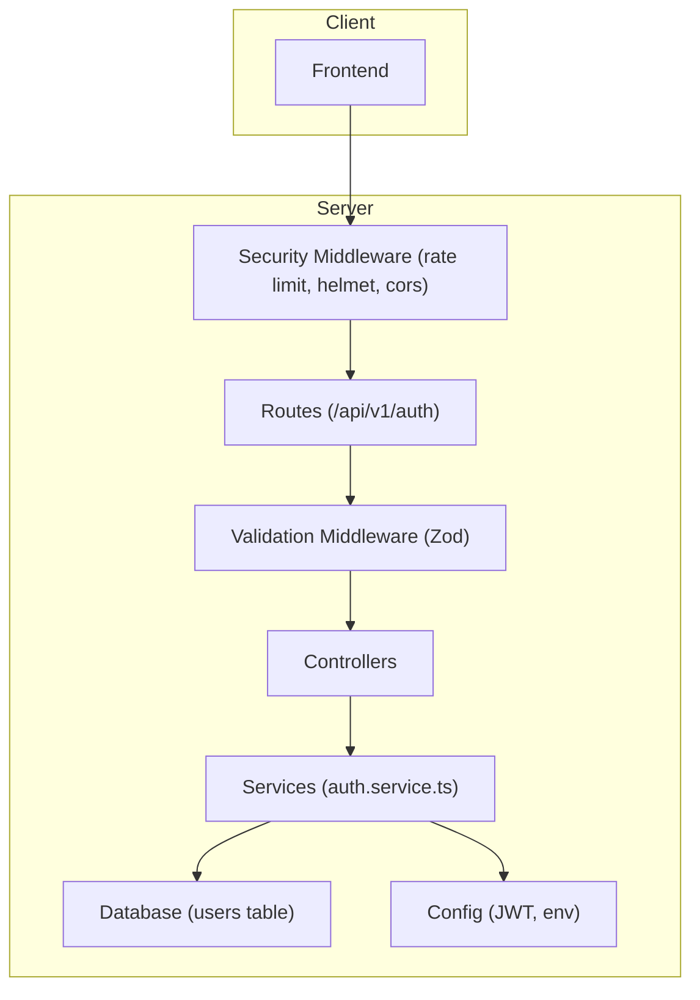
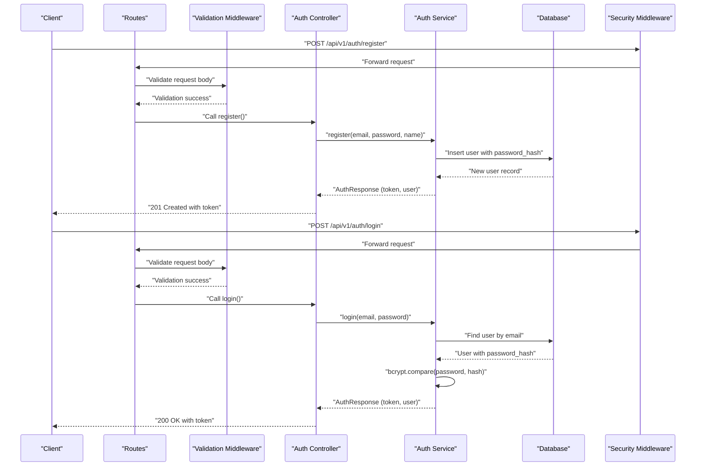
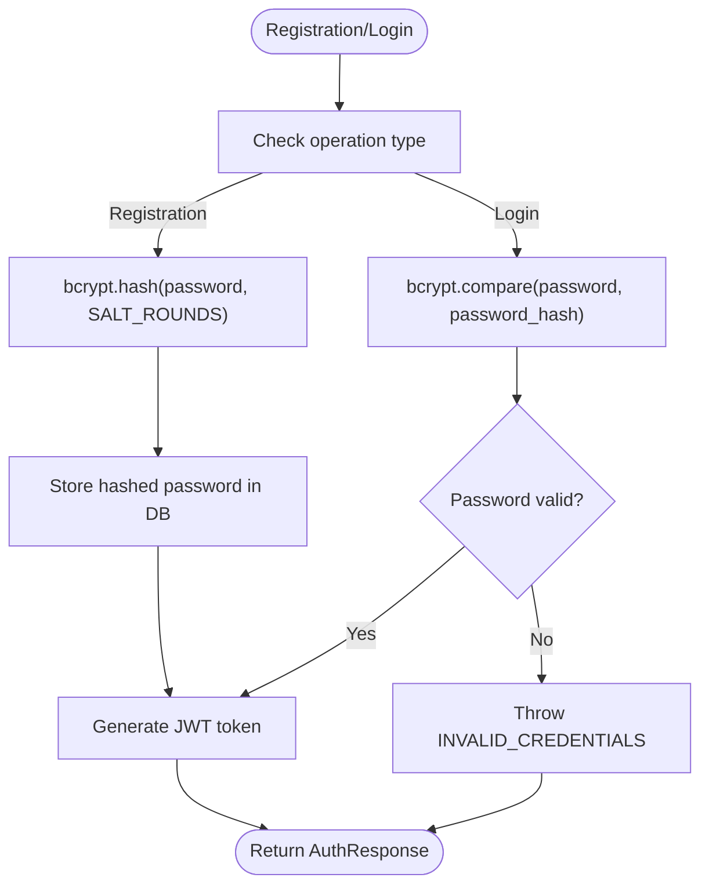
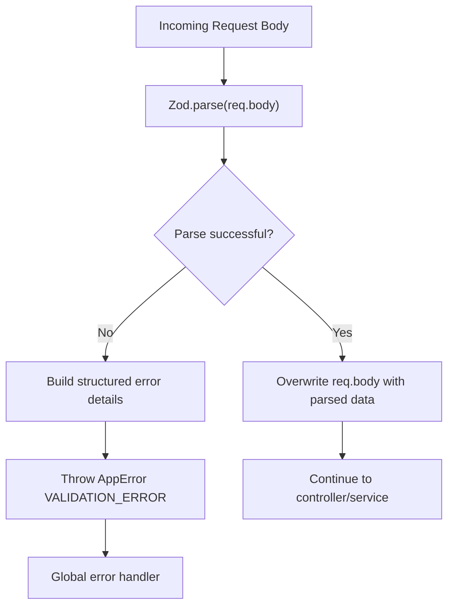
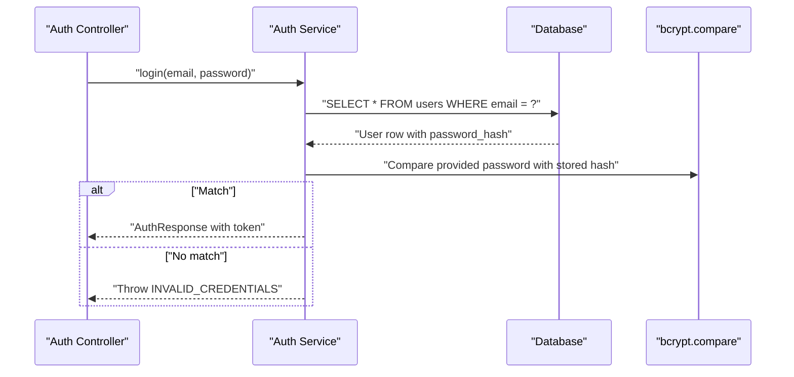
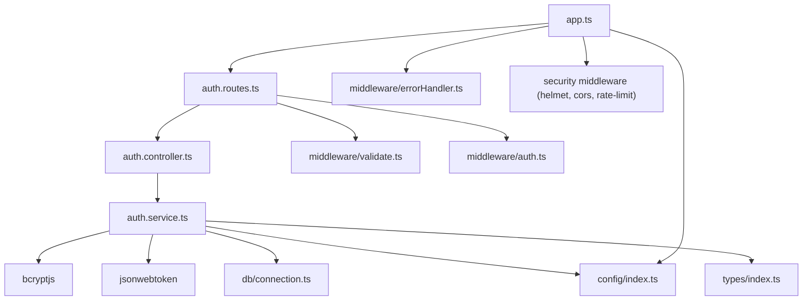

# Password Security & Validation

<cite>
**Referenced Files in This Document**
- [auth.service.ts](file://code/server/src/services/auth.service.ts)
- [auth.controller.ts](file://code/server/src/controllers/auth.controller.ts)
- [auth.routes.ts](file://code/server/src/routes/auth.routes.ts)
- [validate.ts](file://code/server/src/middleware/validate.ts)
- [auth.ts](file://code/server/src/middleware/auth.ts)
- [errorHandler.ts](file://code/server/src/middleware/errorHandler.ts)
- [index.ts](file://code/server/src/config/index.ts)
- [app.ts](file://code/server/src/app.ts)
- [index.ts](file://code/server/src/types/index.ts)
- [20260319_init.ts](file://code/server/src/db/migrations/20260319_init.ts)
- [API-SPEC.md](file://api-spec/API-SPEC.md)
</cite>

## Table of Contents
1. [Introduction](#introduction)
2. [Project Structure](#project-structure)
3. [Core Components](#core-components)
4. [Architecture Overview](#architecture-overview)
5. [Detailed Component Analysis](#detailed-component-analysis)
6. [Dependency Analysis](#dependency-analysis)
7. [Performance Considerations](#performance-considerations)
8. [Troubleshooting Guide](#troubleshooting-guide)
9. [Conclusion](#conclusion)

## Introduction
This document provides comprehensive documentation for password security implementation and validation in the authentication subsystem. It covers BcryptJS integration for secure password hashing, Zod-based input validation, password verification during login, and additional security measures such as rate limiting, input sanitization, and brute-force protection. Practical examples of validation rules, hashing implementations, and security middleware usage are included, along with mitigation strategies for common authentication vulnerabilities.

## Project Structure
The authentication module follows a layered architecture:
- Routes define endpoints and apply validation middleware
- Controllers handle HTTP requests and responses
- Services encapsulate business logic including password hashing and verification
- Middleware enforces authentication and input validation
- Configuration manages environment variables and security settings
- Database schema defines user storage and constraints

**Diagram sources**
- [auth.routes.ts:20-105](file://code/server/src/routes/auth.routes.ts#L20-L105)
- [auth.controller.ts:13-82](file://code/server/src/controllers/auth.controller.ts#L13-L82)
- [auth.service.ts:12-166](file://code/server/src/services/auth.service.ts#L12-L166)
- [app.ts:65-121](file://code/server/src/app.ts#L65-L121)
- [index.ts:7-101](file://code/server/src/config/index.ts#L7-L101)

**Section sources**
- [auth.routes.ts:10-106](file://code/server/src/routes/auth.routes.ts#L10-L106)
- [auth.controller.ts:13-82](file://code/server/src/controllers/auth.controller.ts#L13-L82)
- [auth.service.ts:12-166](file://code/server/src/services/auth.service.ts#L12-L166)
- [app.ts:65-121](file://code/server/src/app.ts#L65-L121)
- [index.ts:7-101](file://code/server/src/config/index.ts#L7-L101)

## Core Components
This section documents the core components responsible for password security and validation.

- BcryptJS integration for secure password hashing:
  - Salt generation and cost factor configuration
  - Password encryption during registration
  - Hash comparison during login
- Zod schemas for input validation:
  - Email format validation
  - Password strength requirements
  - Name validation
- Authentication middleware:
  - JWT token extraction and verification
  - Rate limiting for authentication attempts
- Error handling:
  - Unified error response format
  - Protection against information disclosure

Key implementation references:
- BcryptJS integration and cost factor: [auth.service.ts:19-20](file://code/server/src/services/auth.service.ts#L19-L20), [auth.service.ts:80](file://code/server/src/services/auth.service.ts#L80), [auth.service.ts:129](file://code/server/src/services/auth.service.ts#L129)
- Password verification and timing attack prevention: [auth.service.ts:128-132](file://code/server/src/services/auth.service.ts#L128-L132)
- Zod validation schemas: [auth.routes.ts:35-50](file://code/server/src/routes/auth.routes.ts#L35-L50), [auth.routes.ts:59-66](file://code/server/src/routes/auth.routes.ts#L59-L66)
- Validation middleware: [validate.ts:31-71](file://code/server/src/middleware/validate.ts#L31-L71)
- JWT authentication middleware: [auth.ts:29-59](file://code/server/src/middleware/auth.ts#L29-L59)
- Rate limiting: [app.ts:84-96](file://code/server/src/app.ts#L84-L96)
- Environment configuration: [index.ts:16-44](file://code/server/src/config/index.ts#L16-L44)

**Section sources**
- [auth.service.ts:19-20](file://code/server/src/services/auth.service.ts#L19-L20)
- [auth.service.ts:80](file://code/server/src/services/auth.service.ts#L80)
- [auth.service.ts:128-132](file://code/server/src/services/auth.service.ts#L128-L132)
- [auth.routes.ts:35-50](file://code/server/src/routes/auth.routes.ts#L35-L50)
- [auth.routes.ts:59-66](file://code/server/src/routes/auth.routes.ts#L59-L66)
- [validate.ts:31-71](file://code/server/src/middleware/validate.ts#L31-L71)
- [auth.ts:29-59](file://code/server/src/middleware/auth.ts#L29-L59)
- [app.ts:84-96](file://code/server/src/app.ts#L84-L96)
- [index.ts:16-44](file://code/server/src/config/index.ts#L16-L44)

## Architecture Overview
The authentication flow integrates validation, service logic, and security middleware to ensure robust password handling and protection against common vulnerabilities.

**Diagram sources**
- [auth.routes.ts:77-92](file://code/server/src/routes/auth.routes.ts#L77-L92)
- [validate.ts:44-69](file://code/server/src/middleware/validate.ts#L44-L69)
- [auth.controller.ts:26-56](file://code/server/src/controllers/auth.controller.ts#L26-L56)
- [auth.service.ts:68-101](file://code/server/src/services/auth.service.ts#L68-L101)
- [auth.service.ts:117-143](file://code/server/src/services/auth.service.ts#L117-L143)

## Detailed Component Analysis

### Password Hashing with BcryptJS
The authentication service uses BcryptJS for secure password hashing:
- Cost factor configuration: The service defines a constant salt round value used for hashing.
- Registration flow: Passwords are hashed before insertion into the database.
- Login flow: The provided password is compared against the stored hash using bcrypt compare.

Implementation highlights:
- Cost factor definition: [auth.service.ts:19-20](file://code/server/src/services/auth.service.ts#L19-L20)
- Hashing during registration: [auth.service.ts:79-80](file://code/server/src/services/auth.service.ts#L79-L80)
- Hash comparison during login: [auth.service.ts:129](file://code/server/src/services/auth.service.ts#L129)

**Diagram sources**
- [auth.service.ts:79-80](file://code/server/src/services/auth.service.ts#L79-L80)
- [auth.service.ts:129](file://code/server/src/services/auth.service.ts#L129)

**Section sources**
- [auth.service.ts:19-20](file://code/server/src/services/auth.service.ts#L19-L20)
- [auth.service.ts:79-80](file://code/server/src/services/auth.service.ts#L79-L80)
- [auth.service.ts:129](file://code/server/src/services/auth.service.ts#L129)

### Input Validation with Zod Schemas
The system employs Zod schemas to validate request bodies:
- Registration schema enforces email format, password strength, and name length.
- Login schema validates email format and ensures password is present.
- A reusable validation middleware parses and transforms request bodies, converting Zod errors into a structured error response.

Validation rules:
- Email format and maximum length for registration: [auth.routes.ts:36-39](file://code/server/src/routes/auth.routes.ts#L36-L39)
- Password minimum length and character requirements for registration: [auth.routes.ts:40-45](file://code/server/src/routes/auth.routes.ts#L40-L45)
- Name minimum and maximum length for registration: [auth.routes.ts:46-49](file://code/server/src/routes/auth.routes.ts#L46-L49)
- Email format for login: [auth.routes.ts:60-62](file://code/server/src/routes/auth.routes.ts#L60-L62)
- Password presence for login: [auth.routes.ts:63-65](file://code/server/src/routes/auth.routes.ts#L63-L65)
- Generic validation middleware: [validate.ts:31-71](file://code/server/src/middleware/validate.ts#L31-L71)

**Diagram sources**
- [validate.ts:44-69](file://code/server/src/middleware/validate.ts#L44-L69)
- [auth.routes.ts:35-50](file://code/server/src/routes/auth.routes.ts#L35-L50)
- [auth.routes.ts:59-66](file://code/server/src/routes/auth.routes.ts#L59-L66)

**Section sources**
- [auth.routes.ts:35-50](file://code/server/src/routes/auth.routes.ts#L35-L50)
- [auth.routes.ts:59-66](file://code/server/src/routes/auth.routes.ts#L59-L66)
- [validate.ts:31-71](file://code/server/src/middleware/validate.ts#L31-L71)

### Password Verification During Login
During login, the system performs secure verification:
- User lookup by email
- Hash comparison using bcrypt compare
- Consistent error messaging to prevent email enumeration
- JWT token issuance upon successful verification

Verification steps:
- User lookup: [auth.service.ts:119-122](file://code/server/src/services/auth.service.ts#L119-L122)
- Consistent error handling: [auth.service.ts:124-126](file://code/server/src/services/auth.service.ts#L124-L126)
- Hash comparison: [auth.service.ts:129](file://code/server/src/services/auth.service.ts#L129)
- Error on invalid credentials: [auth.service.ts:130-132](file://code/server/src/services/auth.service.ts#L130-L132)

**Diagram sources**
- [auth.controller.ts:47-56](file://code/server/src/controllers/auth.controller.ts#L47-L56)
- [auth.service.ts:117-143](file://code/server/src/services/auth.service.ts#L117-L143)

**Section sources**
- [auth.service.ts:117-143](file://code/server/src/services/auth.service.ts#L117-L143)

### Security Measures: Rate Limiting, Input Sanitization, and Brute Force Protection
The system implements several security measures:
- Rate limiting: Global rate limiter restricts requests per IP over a time window.
- Helmet: Security headers are automatically applied.
- CORS: Configurable origins with development and production modes.
- JWT: Secure token-based authentication with expiration.
- Environment validation: Production requires strong secrets and allowed origins.

Rate limiting configuration:
- Window and maximum requests: [app.ts:84-96](file://code/server/src/app.ts#L84-L96)
- Error response on limit exceeded: [app.ts:87-92](file://code/server/src/app.ts#L87-L92)
- Error code mapping: [index.ts:128](file://code/server/src/types/index.ts#L128)

JWT configuration and validation:
- Secret and expiration: [index.ts:89-94](file://code/server/src/config/index.ts#L89-L94)
- Token verification middleware: [auth.ts:48-51](file://code/server/src/middleware/auth.ts#L48-L51)

Environment security checks:
- Production secret requirements: [index.ts:52-67](file://code/server/src/config/index.ts#L52-L67)

**Section sources**
- [app.ts:84-96](file://code/server/src/app.ts#L84-L96)
- [index.ts:89-94](file://code/server/src/config/index.ts#L89-L94)
- [auth.ts:48-51](file://code/server/src/middleware/auth.ts#L48-L51)
- [index.ts:52-67](file://code/server/src/config/index.ts#L52-L67)

### Practical Examples
Below are practical examples of how to apply the implemented security features:

- Password hashing during registration:
  - Use the registration service method to hash passwords before storing them in the database.
  - Reference: [auth.service.ts:68-101](file://code/server/src/services/auth.service.ts#L68-L101)

- Password verification during login:
  - Use the login service method to compare provided passwords with stored hashes.
  - Reference: [auth.service.ts:117-143](file://code/server/src/services/auth.service.ts#L117-L143)

- Applying Zod validation to routes:
  - Define schemas for registration and login, then attach the validation middleware to route handlers.
  - References: [auth.routes.ts:35-50](file://code/server/src/routes/auth.routes.ts#L35-L50), [auth.routes.ts:59-66](file://code/server/src/routes/auth.routes.ts#L59-L66), [auth.routes.ts:77-92](file://code/server/src/routes/auth.routes.ts#L77-L92)

- Using JWT authentication middleware:
  - Protect routes requiring authentication by adding the auth middleware.
  - Reference: [auth.ts:29-59](file://code/server/src/middleware/auth.ts#L29-L59)

- Enforcing rate limits:
  - Apply the global rate limiter to protect endpoints from abuse.
  - Reference: [app.ts:84-96](file://code/server/src/app.ts#L84-L96)

**Section sources**
- [auth.service.ts:68-101](file://code/server/src/services/auth.service.ts#L68-L101)
- [auth.service.ts:117-143](file://code/server/src/services/auth.service.ts#L117-L143)
- [auth.routes.ts:35-50](file://code/server/src/routes/auth.routes.ts#L35-L50)
- [auth.routes.ts:59-66](file://code/server/src/routes/auth.routes.ts#L59-L66)
- [auth.routes.ts:77-92](file://code/server/src/routes/auth.routes.ts#L77-L92)
- [auth.ts:29-59](file://code/server/src/middleware/auth.ts#L29-L59)
- [app.ts:84-96](file://code/server/src/app.ts#L84-L96)

### Common Security Vulnerabilities and Mitigations
- Timing attacks during password comparison:
  - Mitigation: Use bcrypt compare which performs constant-time comparison.
  - Reference: [auth.service.ts:129](file://code/server/src/services/auth.service.ts#L129)

- Email enumeration during login:
  - Mitigation: Return the same error message regardless of whether the email exists.
  - Reference: [auth.service.ts:124-126](file://code/server/src/services/auth.service.ts#L124-L126)

- Weak password policies:
  - Mitigation: Enforce strong password requirements via Zod schemas.
  - References: [auth.routes.ts:40-45](file://code/server/src/routes/auth.routes.ts#L40-L45)

- Information disclosure in error messages:
  - Mitigation: Use unified error handling to avoid exposing internal details in production.
  - Reference: [errorHandler.ts:58-66](file://code/server/src/middleware/errorHandler.ts#L58-L66)

- Insufficient rate limiting:
  - Mitigation: Apply global rate limiting to protect authentication endpoints.
  - Reference: [app.ts:84-96](file://code/server/src/app.ts#L84-L96)

- Insecure JWT configuration:
  - Mitigation: Enforce strong secrets and allowed origins in production.
  - References: [index.ts:52-67](file://code/server/src/config/index.ts#L52-L67), [index.ts:89-94](file://code/server/src/config/index.ts#L89-L94)

**Section sources**
- [auth.service.ts:124-126](file://code/server/src/services/auth.service.ts#L124-L126)
- [auth.service.ts:129](file://code/server/src/services/auth.service.ts#L129)
- [auth.routes.ts:40-45](file://code/server/src/routes/auth.routes.ts#L40-L45)
- [errorHandler.ts:58-66](file://code/server/src/middleware/errorHandler.ts#L58-L66)
- [app.ts:84-96](file://code/server/src/app.ts#L84-L96)
- [index.ts:52-67](file://code/server/src/config/index.ts#L52-L67)
- [index.ts:89-94](file://code/server/src/config/index.ts#L89-L94)

## Dependency Analysis
The authentication module depends on external libraries and internal components as shown below.

**Diagram sources**
- [auth.service.ts:12-17](file://code/server/src/services/auth.service.ts#L12-L17)
- [auth.controller.ts:14](file://code/server/src/controllers/auth.controller.ts#L14)
- [auth.routes.ts:12-14](file://code/server/src/routes/auth.routes.ts#L12-L14)
- [validate.ts:12-13](file://code/server/src/middleware/validate.ts#L12-L13)
- [auth.ts:11-13](file://code/server/src/middleware/auth.ts#L11-L13)
- [app.ts:16-17](file://code/server/src/app.ts#L16-L17)
- [errorHandler.ts:14-16](file://code/server/src/middleware/errorHandler.ts#L14-L16)

**Section sources**
- [auth.service.ts:12-17](file://code/server/src/services/auth.service.ts#L12-L17)
- [auth.controller.ts:14](file://code/server/src/controllers/auth.controller.ts#L14)
- [auth.routes.ts:12-14](file://code/server/src/routes/auth.routes.ts#L12-L14)
- [validate.ts:12-13](file://code/server/src/middleware/validate.ts#L12-L13)
- [auth.ts:11-13](file://code/server/src/middleware/auth.ts#L11-L13)
- [app.ts:16-17](file://code/server/src/app.ts#L16-L17)
- [errorHandler.ts:14-16](file://code/server/src/middleware/errorHandler.ts#L14-L16)

## Performance Considerations
- Bcrypt cost factor: The chosen cost factor balances security and performance. Adjusting the salt rounds affects CPU usage and memory consumption during hashing.
- Database indexing: The users table includes an index on email to optimize lookups during authentication.
- Request body size limits: JSON parsing is configured with a reasonable limit to prevent excessive memory usage.
- Rate limiting: Global rate limiting prevents resource exhaustion and protects against brute-force attacks.

References:
- Cost factor configuration: [auth.service.ts:19-20](file://code/server/src/services/auth.service.ts#L19-L20)
- Users table index: [20260319_init.ts:35](file://code/server/src/db/migrations/20260319_init.ts#L35)
- JSON body limit: [app.ts:80](file://code/server/src/app.ts#L80)
- Rate limiting: [app.ts:84-96](file://code/server/src/app.ts#L84-L96)

**Section sources**
- [auth.service.ts:19-20](file://code/server/src/services/auth.service.ts#L19-L20)
- [20260319_init.ts:35](file://code/server/src/db/migrations/20260319_init.ts#L35)
- [app.ts:80](file://code/server/src/app.ts#L80)
- [app.ts:84-96](file://code/server/src/app.ts#L84-L96)

## Troubleshooting Guide
Common issues and their resolutions:

- Validation errors on registration/login:
  - Cause: Request body does not match Zod schema.
  - Resolution: Ensure email format, password strength, and name length conform to the defined rules.
  - References: [auth.routes.ts:35-50](file://code/server/src/routes/auth.routes.ts#L35-L50), [auth.routes.ts:59-66](file://code/server/src/routes/auth.routes.ts#L59-L66), [validate.ts:51-64](file://code/server/src/middleware/validate.ts#L51-L64)

- Invalid credentials during login:
  - Cause: Incorrect email or password.
  - Resolution: Verify the provided credentials; consistent error messaging prevents enumeration.
  - Reference: [auth.service.ts:124-132](file://code/server/src/services/auth.service.ts#L124-L132)

- Rate limit exceeded:
  - Cause: Too many requests within the time window.
  - Resolution: Wait for the window to reset or reduce request frequency.
  - Reference: [app.ts:87-92](file://code/server/src/app.ts#L87-L92)

- JWT token errors:
  - Cause: Missing, malformed, or expired token.
  - Resolution: Ensure Authorization header uses Bearer token format and token is valid and unexpired.
  - References: [auth.ts:33-43](file://code/server/src/middleware/auth.ts#L33-L43), [auth.ts:53-58](file://code/server/src/middleware/auth.ts#L53-L58)

- Environment configuration issues:
  - Cause: Missing or weak JWT secret in production.
  - Resolution: Set a strong secret and configure allowed origins.
  - Reference: [index.ts:52-67](file://code/server/src/config/index.ts#L52-L67)

**Section sources**
- [auth.routes.ts:35-50](file://code/server/src/routes/auth.routes.ts#L35-L50)
- [auth.routes.ts:59-66](file://code/server/src/routes/auth.routes.ts#L59-L66)
- [validate.ts:51-64](file://code/server/src/middleware/validate.ts#L51-L64)
- [auth.service.ts:124-132](file://code/server/src/services/auth.service.ts#L124-L132)
- [app.ts:87-92](file://code/server/src/app.ts#L87-L92)
- [auth.ts:33-43](file://code/server/src/middleware/auth.ts#L33-L43)
- [auth.ts:53-58](file://code/server/src/middleware/auth.ts#L53-L58)
- [index.ts:52-67](file://code/server/src/config/index.ts#L52-L67)

## Conclusion
The authentication subsystem implements robust password security through BcryptJS hashing, strict input validation with Zod, secure JWT-based authentication, and comprehensive rate limiting. The design prevents common vulnerabilities such as timing attacks, email enumeration, and brute-force attempts while maintaining a clean separation of concerns across layers. Adhering to the documented configurations and usage patterns ensures secure and reliable authentication flows.