# Backend Architecture

<cite>
**Referenced Files in This Document**
- [index.ts](file://code/server/src/index.ts)
- [app.ts](file://code/server/src/app.ts)
- [auth.controller.ts](file://code/server/src/controllers/auth.controller.ts)
- [auth.service.ts](file://code/server/src/services/auth.service.ts)
- [auth.middleware.ts](file://code/server/src/middleware/auth.ts)
- [errorHandler.ts](file://code/server/src/middleware/errorHandler.ts)
- [validate.ts](file://code/server/src/middleware/validate.ts)
- [auth.routes.ts](file://code/server/src/routes/auth.routes.ts)
- [config.index.ts](file://code/server/src/config/index.ts)
- [connection.ts](file://code/server/src/db/connection.ts)
- [types.index.ts](file://code/server/src/types/index.ts)
- [knexfile.ts](file://code/server/knexfile.ts)
- [20260319_init.ts](file://code/server/src/db/migrations/20260319_init.ts)
- [20260418_ai_operations.ts](file://code/server/src/db/migrations/20260418_ai_operations.ts)
- [package.json](file://code/server/package.json)
</cite>

## Update Summary
**Changes Made**
- Added comprehensive AI service layer architecture documentation
- Documented new AIController with API endpoints for completion and streaming
- Added AIService with provider abstraction, rate limiting, and cost controls
- Documented AI provider abstraction layer and Server-Sent Events (SSE) support
- Updated architecture diagrams to include AI service layer components
- Added new database migration for AI operations and usage limits
- Enhanced middleware stack to include AI-specific error handling

## Table of Contents
1. [Introduction](#introduction)
2. [Project Structure](#project-structure)
3. [Core Components](#core-components)
4. [Architecture Overview](#architecture-overview)
5. [Detailed Component Analysis](#detailed-component-analysis)
6. [AI Service Layer Architecture](#ai-service-layer-architecture)
7. [Dependency Analysis](#dependency-analysis)
8. [Performance Considerations](#performance-considerations)
9. [Troubleshooting Guide](#troubleshooting-guide)
10. [Conclusion](#conclusion)

## Introduction
This document describes the backend architecture for the Node.js/Express application serving the Yule Notion platform. The system follows a clean layered architecture separating concerns into controllers, services, and data access layers. It implements robust middleware for authentication, validation, and error handling, integrates JWT-based authentication with password hashing, and uses Knex.js as a database abstraction layer over PostgreSQL. The architecture now includes a comprehensive AI service layer with provider abstraction, rate limiting, cost controls, and streaming support through Server-Sent Events (SSE). Logging is handled via Pino, and the application includes health checks, rate limiting, and security headers.

## Project Structure
The backend is organized into distinct layers with clear separation of responsibilities:

- Entry point and server lifecycle management
- Express application configuration and middleware stack
- Route organization and request validation
- Authentication controller and service layer
- **AI service layer with provider abstraction and streaming support**
- Database abstraction via Knex.js with migrations
- Shared types and error handling utilities
- Configuration management with environment validation

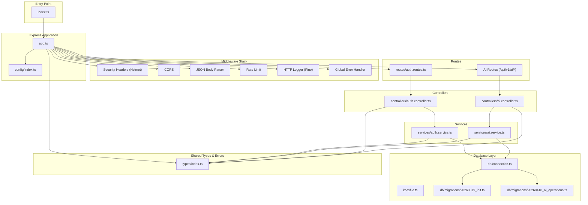

**Diagram sources**
- [index.ts:1-77](file://code/server/src/index.ts#L1-L77)
- [app.ts:1-121](file://code/server/src/app.ts#L1-L121)
- [auth.routes.ts:1-106](file://code/server/src/routes/auth.routes.ts#L1-L106)
- [ai.controller.ts](file://code/server/src/controllers/ai.controller.ts)
- [auth.controller.ts:1-82](file://code/server/src/controllers/auth.controller.ts#L1-L82)
- [auth.service.ts:1-166](file://code/server/src/services/auth.service.ts#L1-L166)
- [ai.service.ts](file://code/server/src/services/ai.service.ts)
- [connection.ts:1-40](file://code/server/src/db/connection.ts#L1-L40)
- [knexfile.ts:1-69](file://code/server/knexfile.ts#L1-L69)
- [20260319_init.ts:1-300](file://code/server/src/db/migrations/20260319_init.ts#L1-L300)
- [20260418_ai_operations.ts:1-43](file://code/server/src/db/migrations/20260418_ai_operations.ts#L1-L43)
- [config.index.ts:1-101](file://code/server/src/config/index.ts#L1-L101)
- [types.index.ts:1-187](file://code/server/src/types/index.ts#L1-L187)

**Section sources**
- [index.ts:1-77](file://code/server/src/index.ts#L1-L77)
- [app.ts:1-121](file://code/server/src/app.ts#L1-L121)
- [auth.routes.ts:1-106](file://code/server/src/routes/auth.routes.ts#L1-L106)
- [auth.controller.ts:1-82](file://code/server/src/controllers/auth.controller.ts#L1-L82)
- [auth.service.ts:1-166](file://code/server/src/services/auth.service.ts#L1-L166)
- [connection.ts:1-40](file://code/server/src/db/connection.ts#L1-L40)
- [knexfile.ts:1-69](file://code/server/knexfile.ts#L1-L69)
- [20260319_init.ts:1-300](file://code/server/src/db/migrations/20260319_init.ts#L1-L300)
- [20260418_ai_operations.ts:1-43](file://code/server/src/db/migrations/20260418_ai_operations.ts#L1-L43)
- [config.index.ts:1-101](file://code/server/src/config/index.ts#L1-L101)
- [types.index.ts:1-187](file://code/server/src/types/index.ts#L1-L187)

## Core Components
- Express application bootstrap and lifecycle management
- Middleware stack: security headers, CORS, JSON parsing, rate limiting, HTTP logging
- Health check endpoint and centralized 404 handling
- Global error handler for consistent error responses
- Authentication middleware for JWT verification and user injection
- Validation middleware factory using Zod for request body validation
- Route organization for authentication endpoints with validation and middleware chaining
- **AI service layer with provider abstraction, context gathering, and streaming support**
- Service layer implementing business logic with database operations, password hashing, and JWT generation
- Database abstraction via Knex.js with connection pooling and migrations including AI operations tracking
- Shared types and error handling utilities for consistent API responses

**Section sources**
- [index.ts:1-77](file://code/server/src/index.ts#L1-L77)
- [app.ts:1-121](file://code/server/src/app.ts#L1-L121)
- [errorHandler.ts:1-68](file://code/server/src/middleware/errorHandler.ts#L1-L68)
- [auth.middleware.ts:1-60](file://code/server/src/middleware/auth.ts#L1-L60)
- [validate.ts:1-72](file://code/server/src/middleware/validate.ts#L1-L72)
- [auth.routes.ts:1-106](file://code/server/src/routes/auth.routes.ts#L1-L106)
- [auth.service.ts:1-166](file://code/server/src/services/auth.service.ts#L1-L166)
- [ai.service.ts](file://code/server/src/services/ai.service.ts)
- [connection.ts:1-40](file://code/server/src/db/connection.ts#L1-L40)
- [types.index.ts:1-187](file://code/server/src/types/index.ts#L1-L187)

## Architecture Overview
The system employs a layered architecture with the addition of a comprehensive AI service layer:

- Presentation Layer: Express routes and controllers handle HTTP requests/responses
- Application Layer: Services encapsulate business logic and orchestrate data operations
- **AI Service Layer: Provider abstraction, context gathering, rate limiting, and streaming**
- Data Access Layer: Knex.js abstracts database operations with connection pooling and migrations
- Infrastructure: Configuration, logging, security middleware, and error handling

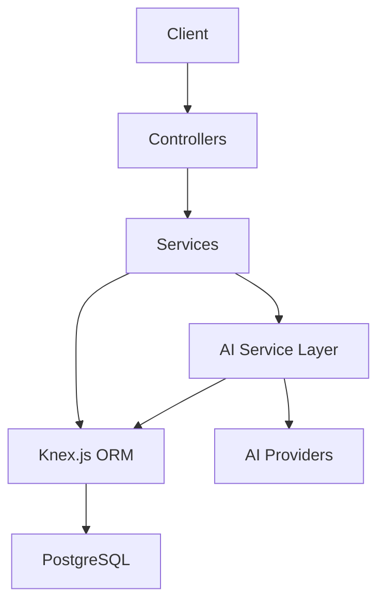

**Diagram sources**
- [auth.controller.ts:1-82](file://code/server/src/controllers/auth.controller.ts#L1-L82)
- [auth.service.ts:1-166](file://code/server/src/services/auth.service.ts#L1-L166)
- [ai.controller.ts](file://code/server/src/controllers/ai.controller.ts)
- [ai.service.ts](file://code/server/src/services/ai.service.ts)
- [connection.ts:1-40](file://code/server/src/db/connection.ts#L1-L40)
- [20260319_init.ts:1-300](file://code/server/src/db/migrations/20260319_init.ts#L1-L300)
- [20260418_ai_operations.ts:1-43](file://code/server/src/db/migrations/20260418_ai_operations.ts#L1-L43)

## Detailed Component Analysis

### Express Application and Middleware Stack
The Express application initializes with a strict middleware order to ensure security, observability, and predictable error handling:

- Security headers via Helmet
- CORS configuration with environment-aware origins
- JSON body parsing with increased size limit for uploads
- Rate limiting to prevent abuse
- HTTP request logging using Pino
- Health check endpoint
- Route registration
- Centralized 404 handling
- Global error handler

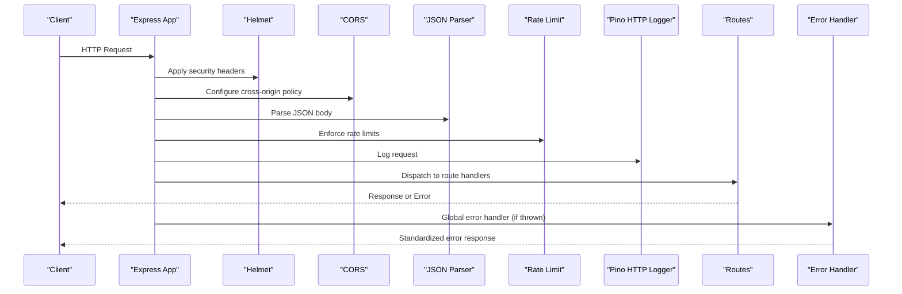

**Diagram sources**
- [app.ts:67-121](file://code/server/src/app.ts#L67-L121)

**Section sources**
- [app.ts:1-121](file://code/server/src/app.ts#L1-L121)

### Authentication Flow
The authentication flow demonstrates the layered architecture with validation, controller delegation, and service implementation:

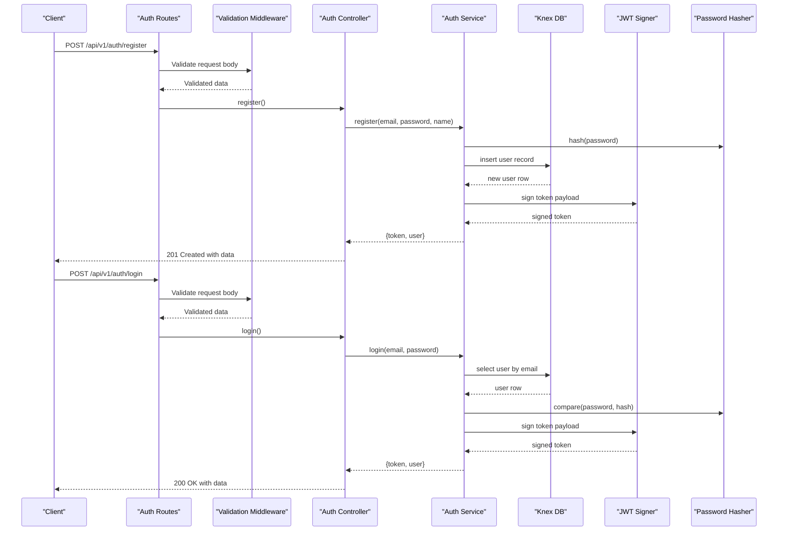

**Diagram sources**
- [auth.routes.ts:77-92](file://code/server/src/routes/auth.routes.ts#L77-L92)
- [auth.controller.ts:26-57](file://code/server/src/controllers/auth.controller.ts#L26-L57)
- [auth.service.ts:68-143](file://code/server/src/services/auth.service.ts#L68-L143)

**Section sources**
- [auth.routes.ts:1-106](file://code/server/src/routes/auth.routes.ts#L1-L106)
- [auth.controller.ts:1-82](file://code/server/src/controllers/auth.controller.ts#L1-L82)
- [auth.service.ts:1-166](file://code/server/src/services/auth.service.ts#L1-L166)

### JWT Authentication Middleware
The authentication middleware extracts and validates JWT tokens from the Authorization header, injecting the decoded user payload into the request object for downstream handlers.

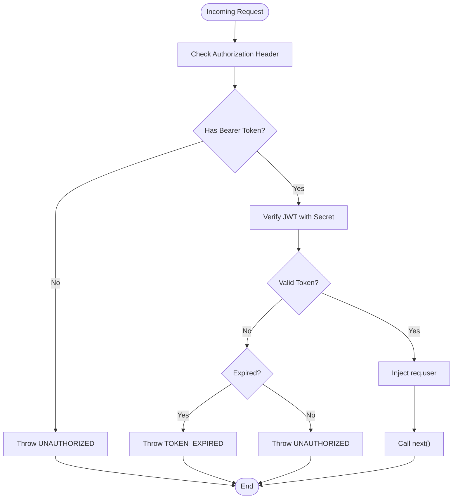

**Diagram sources**
- [auth.middleware.ts:29-59](file://code/server/src/middleware/auth.ts#L29-L59)

**Section sources**
- [auth.middleware.ts:1-60](file://code/server/src/middleware/auth.ts#L1-L60)

### Validation Middleware Factory
The validation middleware factory uses Zod schemas to validate request bodies, transforming Zod errors into standardized AppError instances with field-level details.

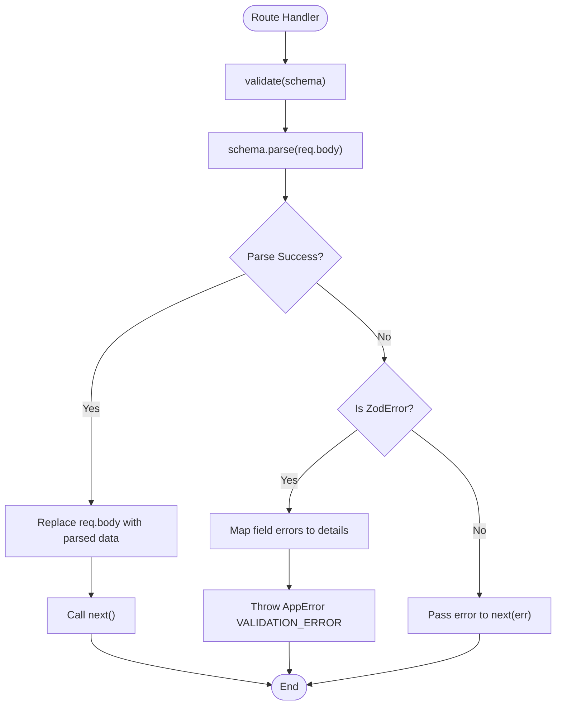

**Diagram sources**
- [validate.ts:31-71](file://code/server/src/middleware/validate.ts#L31-L71)

**Section sources**
- [validate.ts:1-72](file://code/server/src/middleware/validate.ts#L1-L72)

### Error Handling Strategy
The global error handler ensures consistent error responses across the application, distinguishing known business errors from unexpected exceptions and logging appropriately.

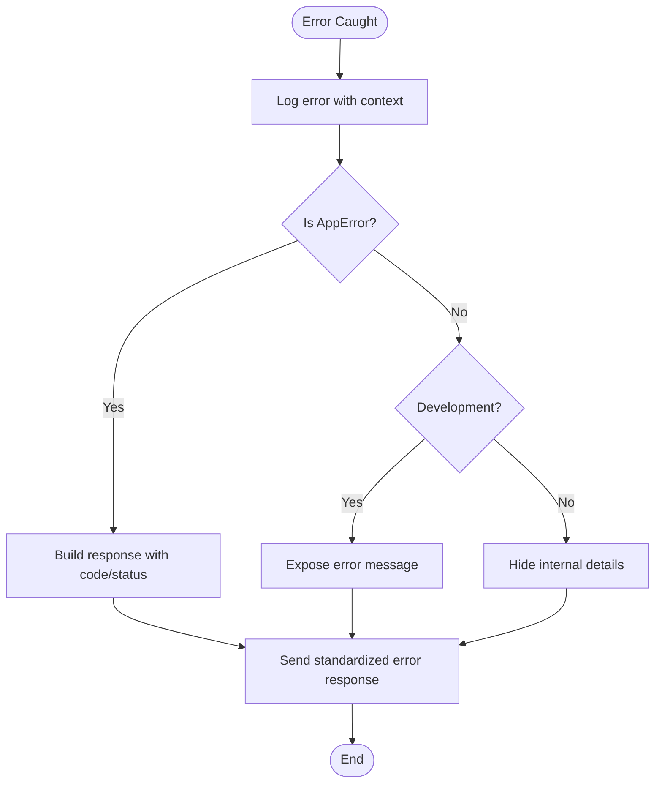

**Diagram sources**
- [errorHandler.ts:29-67](file://code/server/src/middleware/errorHandler.ts#L29-L67)

**Section sources**
- [errorHandler.ts:1-68](file://code/server/src/middleware/errorHandler.ts#L1-L68)

### Database Abstraction with Knex.js
The database layer abstracts PostgreSQL operations using Knex.js with connection pooling and migrations. The connection is configured via environment variables and closed gracefully during shutdown. **New AI operations tracking tables have been added for comprehensive AI usage monitoring.**

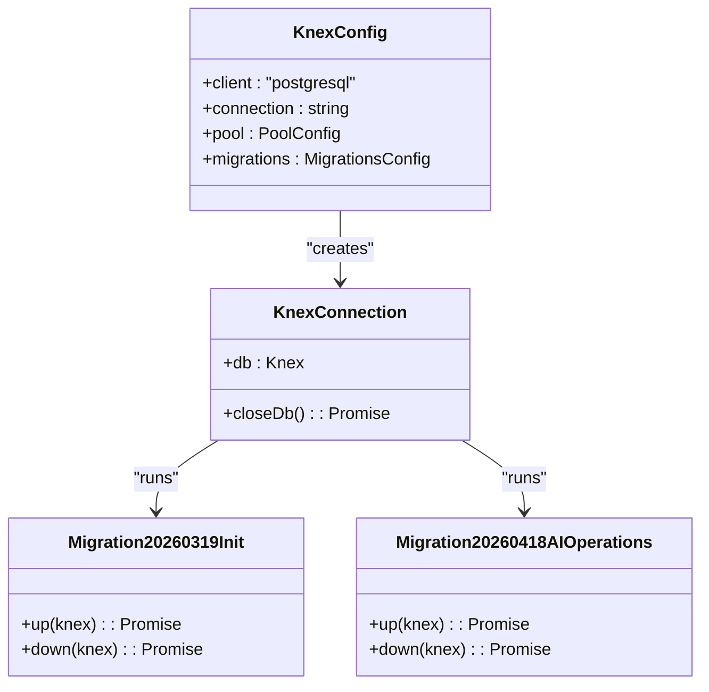

**Diagram sources**
- [connection.ts:22-39](file://code/server/src/db/connection.ts#L22-L39)
- [knexfile.ts:13-57](file://code/server/knexfile.ts#L13-L57)
- [20260319_init.ts:17-278](file://code/server/src/db/migrations/20260319_init.ts#L17-L278)
- [20260418_ai_operations.ts:3-33](file://code/server/src/db/migrations/20260418_ai_operations.ts#L3-L33)

**Section sources**
- [connection.ts:1-40](file://code/server/src/db/connection.ts#L1-L40)
- [knexfile.ts:1-69](file://code/server/knexfile.ts#L1-L69)
- [20260319_init.ts:1-300](file://code/server/src/db/migrations/20260319_init.ts#L1-L300)
- [20260418_ai_operations.ts:1-43](file://code/server/src/db/migrations/20260418_ai_operations.ts#L1-L43)

### Configuration Management
Environment variables are validated using Zod to ensure type safety and enforce production security requirements, including mandatory secrets and allowed origins.

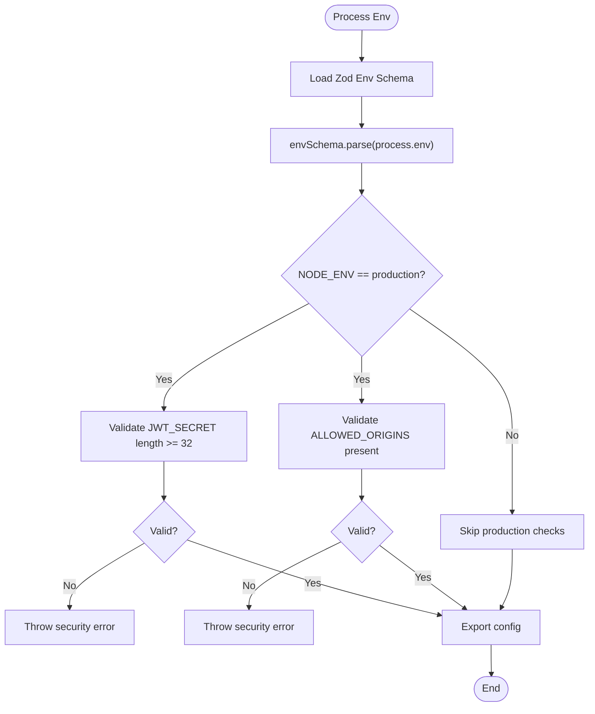

**Diagram sources**
- [config.index.ts:44-98](file://code/server/src/config/index.ts#L44-L98)

**Section sources**
- [config.index.ts:1-101](file://code/server/src/config/index.ts#L1-L101)

### Logging Strategy with Pino
Pino is configured for development and production environments with different transports and log levels. An HTTP logger middleware automatically logs each request with structured fields.

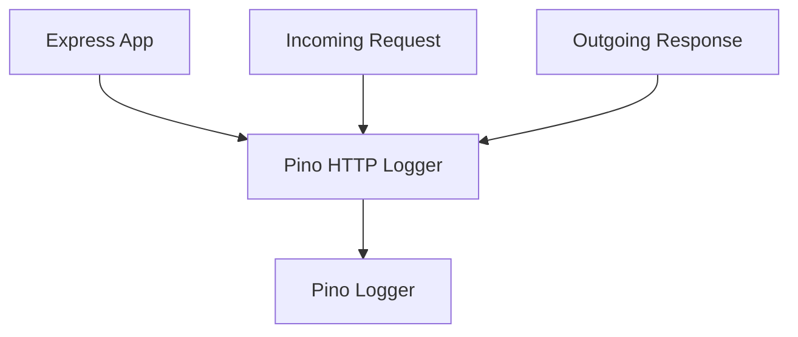

**Diagram sources**
- [app.ts:29-47](file://code/server/src/app.ts#L29-L47)
- [app.ts:98-99](file://code/server/src/app.ts#L98-L99)

**Section sources**
- [app.ts:1-121](file://code/server/src/app.ts#L1-L121)

## AI Service Layer Architecture

**Updated** Added comprehensive AI service layer with provider abstraction, rate limiting, cost controls, and streaming support

The AI service layer represents a significant enhancement to the backend architecture, introducing sophisticated AI capabilities with proper abstraction and control mechanisms:

### AI Controller Implementation
The AI controller handles API endpoints for both synchronous completions and asynchronous streaming responses:

- **Complete endpoint**: Processes AI requests synchronously and returns final results
- **Stream endpoint**: Implements Server-Sent Events (SSE) for real-time streaming of AI responses
- **History endpoint**: Retrieves user's AI operation history
- **Cost endpoint**: Provides monthly AI usage cost tracking

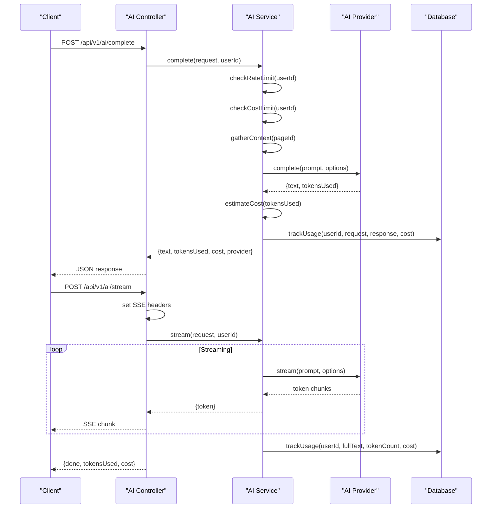

**Diagram sources**
- [ai.controller.ts](file://code/server/src/controllers/ai.controller.ts)
- [ai.service.ts](file://code/server/src/services/ai.service.ts)

### AI Service Business Logic
The AI service encapsulates core business logic including:

- **Provider Abstraction**: Unified interface for multiple AI providers (OpenAI, Anthropic, etc.)
- **Context Gathering**: Intelligent retrieval of related page content for enhanced AI responses
- **Prompt Engineering**: Template-based prompt construction for different operation types
- **Rate Limiting**: Per-user request frequency control (60 requests per minute)
- **Cost Control**: Monthly spending limits with automatic tracking and enforcement
- **Usage Tracking**: Comprehensive logging of all AI operations for analytics and billing

### AI Provider Abstraction
The architecture supports multiple AI providers through a unified abstraction layer:

- **OpenAI Provider**: Primary implementation with streaming support
- **Extensible Design**: Easy integration of additional providers (Anthropic, Google Gemini, etc.)
- **Consistent Interface**: Uniform methods for completion and streaming across providers
- **Cost Estimation**: Provider-specific token counting and cost calculation

### Server-Sent Events (SSE) Implementation
Real-time streaming support enables responsive AI interactions:

- **Event Stream Format**: JSON-encoded chunks with token-by-token delivery
- **Completion Signal**: Final chunk with completion metadata (tokens used, cost)
- **Error Handling**: Graceful degradation with error messages in stream
- **Connection Management**: Proper cleanup and resource management

### Database Schema for AI Operations
Enhanced database schema supporting AI usage tracking:

- **AI Operations Table**: Stores all AI interactions with timestamps and costs
- **Usage Limits Table**: Manages monthly spending caps per user
- **Indexing Strategy**: Optimized queries for history retrieval and cost calculations
- **Audit Trail**: Complete record of AI usage for compliance and billing

**Section sources**
- [ai.controller.ts](file://code/server/src/controllers/ai.controller.ts)
- [ai.service.ts](file://code/server/src/services/ai.service.ts)
- [20260418_ai_operations.ts:1-43](file://code/server/src/db/migrations/20260418_ai_operations.ts#L1-L43)

## Dependency Analysis
The backend maintains low coupling and high cohesion across layers. Dependencies flow inward toward the service layer, with controllers depending on services and services depending on the database abstraction. **The AI service layer introduces controlled dependencies on AI providers while maintaining clean separation of concerns.**

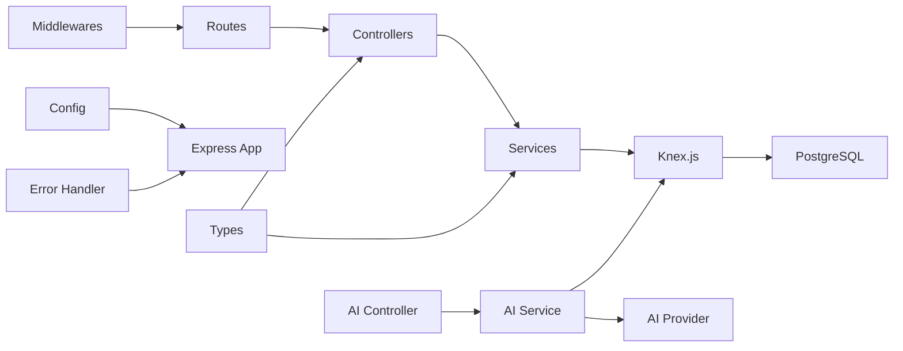

**Diagram sources**
- [auth.controller.ts:14](file://code/server/src/controllers/auth.controller.ts#L14)
- [auth.service.ts:14-16](file://code/server/src/services/auth.service.ts#L14-L16)
- [connection.ts:8-29](file://code/server/src/db/connection.ts#L8-L29)
- [auth.routes.ts:10-14](file://code/server/src/routes/auth.routes.ts#L10-L14)
- [app.ts:16](file://code/server/src/app.ts#L16)
- [types.index.ts:153-186](file://code/server/src/types/index.ts#L153-L186)
- [errorHandler.ts:16](file://code/server/src/middleware/errorHandler.ts#L16)
- [ai.controller.ts](file://code/server/src/controllers/ai.controller.ts)
- [ai.service.ts](file://code/server/src/services/ai.service.ts)

**Section sources**
- [auth.controller.ts:1-82](file://code/server/src/controllers/auth.controller.ts#L1-L82)
- [auth.service.ts:1-166](file://code/server/src/services/auth.service.ts#L1-L166)
- [connection.ts:1-40](file://code/server/src/db/connection.ts#L1-L40)
- [auth.routes.ts:1-106](file://code/server/src/routes/auth.routes.ts#L1-L106)
- [app.ts:1-121](file://code/server/src/app.ts#L1-L121)
- [types.index.ts:1-187](file://code/server/src/types/index.ts#L1-L187)
- [errorHandler.ts:1-68](file://code/server/src/middleware/errorHandler.ts#L1-L68)
- [ai.controller.ts](file://code/server/src/controllers/ai.controller.ts)
- [ai.service.ts](file://code/server/src/services/ai.service.ts)

## Performance Considerations
- Connection pooling: Knex.js manages a pool of connections to reduce overhead and improve throughput.
- Rate limiting: Built-in rate limiting protects against abuse while allowing legitimate traffic.
- Request body size: Increased JSON limit accommodates larger payloads for uploads.
- Logging overhead: Pino is efficient and configurable; ensure production logs are not overly verbose.
- Database indexing: Migrations define indexes and triggers to optimize queries and maintain data integrity.
- **AI streaming optimization**: SSE implementation minimizes memory usage for long-running AI responses.
- **Context caching**: AI service can cache frequently accessed page contexts to reduce database queries.
- **Provider connection pooling**: AI providers should implement their own connection pooling for optimal performance.

## Troubleshooting Guide
Common issues and resolutions:

- Uncaught exceptions and unhandled rejections: The application exits with fatal logs; ensure all errors are caught and transformed into AppError instances.
- Environment configuration errors: Production requires secure JWT_SECRET and allowed origins; verify environment variables.
- Database connectivity: Confirm DATABASE_URL and PostgreSQL availability; check Knex pool settings.
- Authentication failures: Verify JWT_SECRET matches the signing secret and token format is Bearer.
- Validation errors: Review Zod schemas and ensure request bodies match expected shapes.
- **AI provider errors**: Check AI API keys and provider configuration; monitor rate limit violations.
- **Streaming failures**: Verify SSE support in client browsers and network connectivity for long-lived connections.
- **Database migration issues**: Ensure AI operations migration runs successfully before AI endpoints are used.

**Section sources**
- [index.ts:63-71](file://code/server/src/index.ts#L63-L71)
- [config.index.ts:52-67](file://code/server/src/config/index.ts#L52-L67)
- [connection.ts:22-39](file://code/server/src/db/connection.ts#L22-L39)
- [auth.middleware.ts:29-59](file://code/server/src/middleware/auth.ts#L29-L59)
- [validate.ts:44-71](file://code/server/src/middleware/validate.ts#L44-L71)
- [ai.controller.ts](file://code/server/src/controllers/ai.controller.ts)

## Conclusion
The backend implements a clean, maintainable architecture with clear separation of concerns, robust middleware for security and observability, and a well-defined service layer backed by Knex.js. **The addition of the comprehensive AI service layer significantly enhances the platform's capabilities while maintaining architectural integrity.** JWT-based authentication, password hashing, and structured validation ensure secure and reliable operations. The AI service layer provides provider abstraction, intelligent context gathering, rate limiting, cost controls, and streaming support through SSE. The configuration system enforces production-grade security, while Pino provides efficient logging. Together, these components form a solid foundation for the Yule Notion platform with advanced AI capabilities.