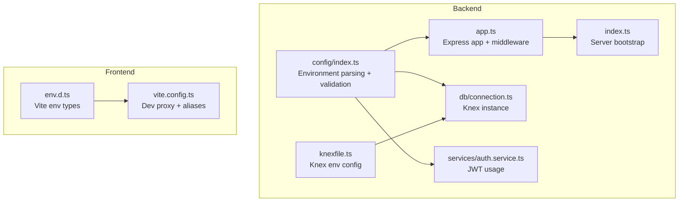
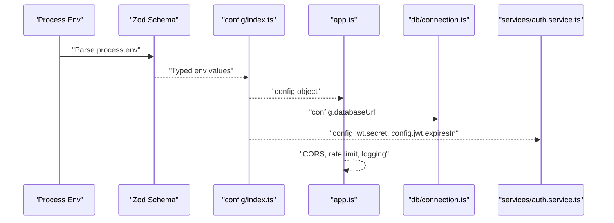
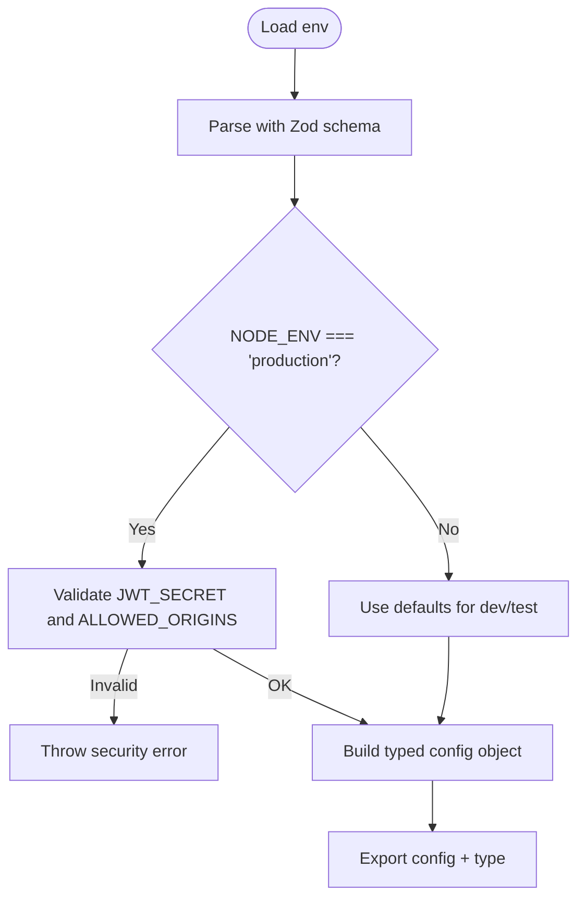
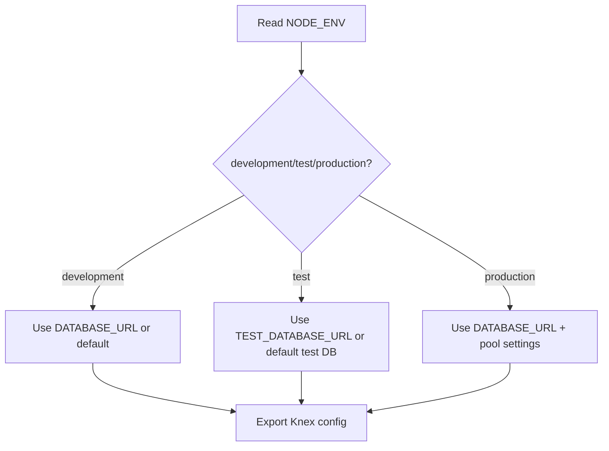
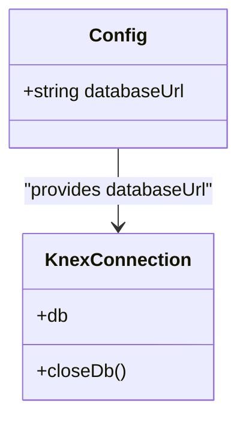
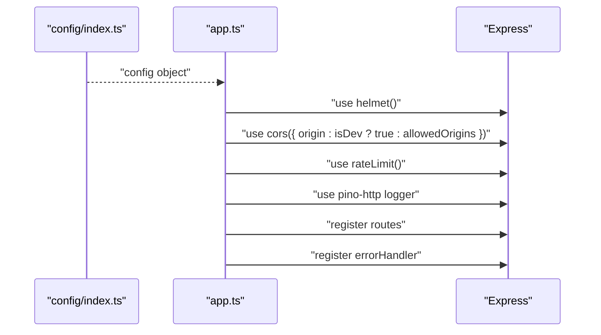
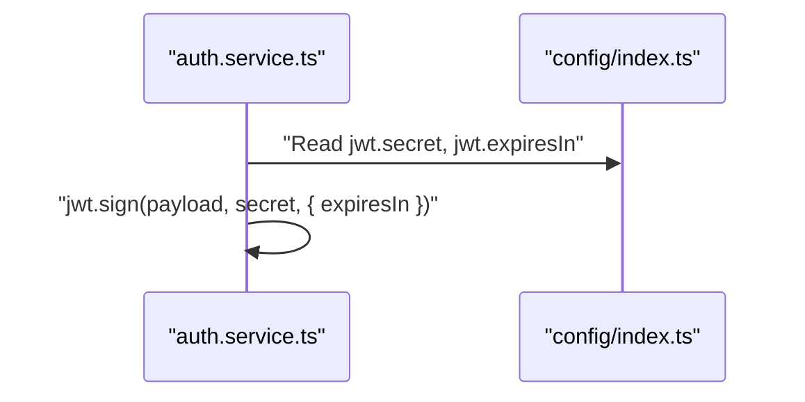
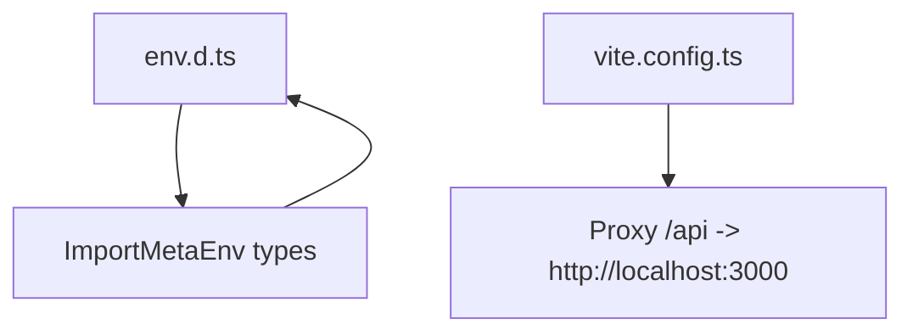
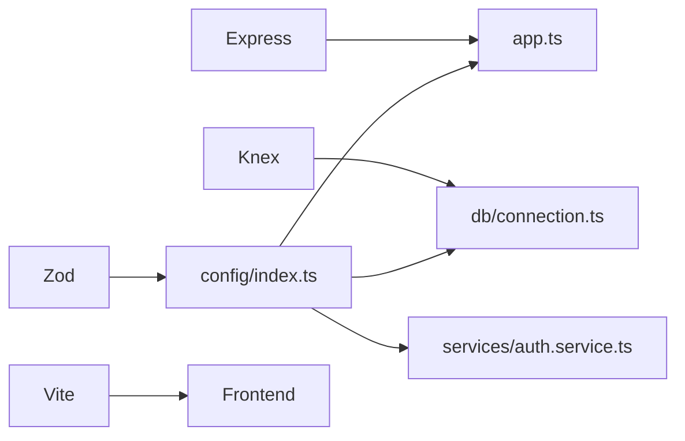

# Configuration Management

<cite>
**Referenced Files in This Document**
- [config/index.ts](file://code/server/src/config/index.ts)
- [knexfile.ts](file://code/server/knexfile.ts)
- [connection.ts](file://code/server/src/db/connection.ts)
- [app.ts](file://code/server/src/app.ts)
- [index.ts](file://code/server/src/index.ts)
- [auth.service.ts](file://code/server/src/services/auth.service.ts)
- [env.d.ts](file://code/client/env.d.ts)
- [vite.config.ts](file://code/client/vite.config.ts)
- [package.json](file://code/server/package.json)
- [package.json](file://code/client/package.json)
- [index.ts](file://code/server/src/types/index.ts)
</cite>

## Table of Contents
1. [Introduction](#introduction)
2. [Project Structure](#project-structure)
3. [Core Components](#core-components)
4. [Architecture Overview](#architecture-overview)
5. [Detailed Component Analysis](#detailed-component-analysis)
6. [Dependency Analysis](#dependency-analysis)
7. [Performance Considerations](#performance-considerations)
8. [Troubleshooting Guide](#troubleshooting-guide)
9. [Conclusion](#conclusion)
10. [Appendices](#appendices)

## Introduction
This document explains the configuration management system for the Yule-Notion project. It covers environment variable handling, configuration loading patterns, environment-specific settings, and the configuration structure for database credentials, security settings, CORS origins, and application behavior flags. It also documents configuration validation, default value handling, type safety approaches, examples of configuration usage across the application, environment switching strategies, security considerations for sensitive data, configuration testing approaches, and deployment configuration management.

## Project Structure
The configuration system spans both the backend and the frontend:

- Backend (Node.js/Express):
  - Centralized environment parsing and validation using Zod.
  - Environment-driven database configuration via Knex.
  - Runtime configuration consumed by application modules (Express, JWT, logging, CORS).
- Frontend (Vue/Vite):
  - Type declarations for environment variables.
  - Development-time proxy configuration for API requests.

**Diagram sources**
- [config/index.ts:1-101](file://code/server/src/config/index.ts#L1-L101)
- [knexfile.ts:1-69](file://code/server/knexfile.ts#L1-L69)
- [connection.ts:1-40](file://code/server/src/db/connection.ts#L1-L40)
- [app.ts:1-121](file://code/server/src/app.ts#L1-L121)
- [index.ts:1-77](file://code/server/src/index.ts#L1-L77)
- [auth.service.ts:1-166](file://code/server/src/services/auth.service.ts#L1-L166)
- [env.d.ts:1-26](file://code/client/env.d.ts#L1-L26)
- [vite.config.ts:1-37](file://code/client/vite.config.ts#L1-L37)

**Section sources**
- [config/index.ts:1-101](file://code/server/src/config/index.ts#L1-L101)
- [knexfile.ts:1-69](file://code/server/knexfile.ts#L1-L69)
- [connection.ts:1-40](file://code/server/src/db/connection.ts#L1-L40)
- [app.ts:1-121](file://code/server/src/app.ts#L1-L121)
- [index.ts:1-77](file://code/server/src/index.ts#L1-L77)
- [auth.service.ts:1-166](file://code/server/src/services/auth.service.ts#L1-L166)
- [env.d.ts:1-26](file://code/client/env.d.ts#L1-L26)
- [vite.config.ts:1-37](file://code/client/vite.config.ts#L1-L37)

## Core Components
- Environment configuration loader:
  - Defines a Zod schema for environment variables, including defaults for local development.
  - Enforces production security requirements (non-default JWT secret and allowed origins).
  - Exports a strongly typed configuration object consumed by the rest of the application.
- Database configuration:
  - Knex configuration file selects environment-specific settings based on NODE_ENV.
  - Uses DATABASE_URL or TEST_DATABASE_URL for connections.
  - Includes migration and seed directories and pool sizing for production.
- Application configuration consumption:
  - Express app reads configuration for CORS, logging, rate limiting, and health endpoint.
  - Authentication service uses JWT secret and expiration from configuration.
- Frontend environment typing and dev proxy:
  - Declares Vite environment variable types.
  - Configures development proxy for API requests to the backend.

Key configuration structure highlights:
- Port and environment: PORT, NODE_ENV.
- Database: DATABASE_URL (with defaults for local dev).
- Security: JWT_SECRET (enforced in production), JWT_EXPIRES_IN.
- CORS: ALLOWED_ORIGINS (comma-separated list; enforced in production).
- Application behavior flags: derived booleans isDev and isTest.

**Section sources**
- [config/index.ts:16-98](file://code/server/src/config/index.ts#L16-L98)
- [knexfile.ts:13-68](file://code/server/knexfile.ts#L13-L68)
- [app.ts:29-120](file://code/server/src/app.ts#L29-L120)
- [auth.service.ts:46-50](file://code/server/src/services/auth.service.ts#L46-L50)
- [env.d.ts:16-25](file://code/client/env.d.ts#L16-L25)
- [vite.config.ts:23-32](file://code/client/vite.config.ts#L23-L32)

## Architecture Overview
The configuration architecture ensures type-safe, environment-aware behavior across modules:

**Diagram sources**
- [config/index.ts:44-98](file://code/server/src/config/index.ts#L44-L98)
- [app.ts:65-120](file://code/server/src/app.ts#L65-L120)
- [connection.ts:22-29](file://code/server/src/db/connection.ts#L22-L29)
- [auth.service.ts:46-50](file://code/server/src/services/auth.service.ts#L46-L50)

## Detailed Component Analysis

### Environment Configuration Loader
- Purpose: Centralized, type-safe environment parsing and validation.
- Schema fields and defaults:
  - PORT: numeric coerce with default for local development.
  - NODE_ENV: enum with default development.
  - DATABASE_URL: string default for local PostgreSQL.
  - JWT_SECRET: string default for development; production enforcement required.
  - JWT_EXPIRES_IN: string default (e.g., "7d").
  - ALLOWED_ORIGINS: optional string; production requires explicit whitelist.
- Validation:
  - Production mode enforces non-default JWT_SECRET length and presence of ALLOWED_ORIGINS.
- Exported configuration:
  - port, nodeEnv, isDev, isTest, databaseUrl, jwt (secret, expiresIn), allowedOrigins (split from comma-separated string).

**Diagram sources**
- [config/index.ts:44-98](file://code/server/src/config/index.ts#L44-L98)

**Section sources**
- [config/index.ts:16-67](file://code/server/src/config/index.ts#L16-L67)
- [config/index.ts:72-98](file://code/server/src/config/index.ts#L72-L98)

### Database Configuration (Knex)
- Purpose: Provide environment-specific database settings.
- Supported environments: development, test, production.
- Key behaviors:
  - Selects configuration based on NODE_ENV.
  - Uses DATABASE_URL or TEST_DATABASE_URL for connections.
  - Sets migration and seed directories.
  - Adds pool configuration for production.

**Diagram sources**
- [knexfile.ts:62-68](file://code/server/knexfile.ts#L62-L68)
- [knexfile.ts:13-57](file://code/server/knexfile.ts#L13-L57)

**Section sources**
- [knexfile.ts:13-68](file://code/server/knexfile.ts#L13-L68)

### Database Connection Instance
- Purpose: Create a globally shared Knex instance with connection pooling.
- Behavior:
  - Uses config.databaseUrl from the centralized config.
  - Pool sizes configured for concurrency.
  - Provides a closeDb function for graceful shutdown.

**Diagram sources**
- [connection.ts:22-39](file://code/server/src/db/connection.ts#L22-L39)
- [config/index.ts:85-86](file://code/server/src/config/index.ts#L85-L86)

**Section sources**
- [connection.ts:22-39](file://code/server/src/db/connection.ts#L22-L39)

### Express Application Configuration Consumption
- Purpose: Apply configuration to middleware and runtime behavior.
- Key usages:
  - Logging level and transport based on isDev.
  - CORS origin policy controlled by isDev vs allowedOrigins.
  - Rate limiting applied globally.
  - Health check endpoint exposed without authentication.
  - Global error handler registered last.

**Diagram sources**
- [app.ts:69-120](file://code/server/src/app.ts#L69-L120)
- [config/index.ts:79-97](file://code/server/src/config/index.ts#L79-L97)

**Section sources**
- [app.ts:29-120](file://code/server/src/app.ts#L29-L120)

### Authentication Service Configuration Usage
- Purpose: Demonstrate JWT configuration consumption.
- Usage:
  - Generates tokens using config.jwt.secret and config.jwt.expiresIn.

**Diagram sources**
- [auth.service.ts:46-50](file://code/server/src/services/auth.service.ts#L46-L50)
- [config/index.ts:89-94](file://code/server/src/config/index.ts#L89-L94)

**Section sources**
- [auth.service.ts:46-50](file://code/server/src/services/auth.service.ts#L46-L50)

### Frontend Environment Typing and Dev Proxy
- Purpose: Provide type safety for Vite environment variables and configure development proxy.
- Types:
  - Declares VITE_API_BASE_URL as an optional string.
- Dev proxy:
  - Proxies /api requests to the backend server during development.

**Diagram sources**
- [env.d.ts:16-25](file://code/client/env.d.ts#L16-L25)
- [vite.config.ts:23-32](file://code/client/vite.config.ts#L23-L32)

**Section sources**
- [env.d.ts:16-25](file://code/client/env.d.ts#L16-L25)
- [vite.config.ts:23-32](file://code/client/vite.config.ts#L23-L32)

## Dependency Analysis
- Backend dependencies:
  - Zod for environment schema parsing and validation.
  - Knex for database configuration and connection pooling.
  - Express ecosystem for middleware and routing.
- Frontend dependencies:
  - Vite for dev proxy and build tooling.
  - Vue for UI framework.

**Diagram sources**
- [config/index.ts:8](file://code/server/src/config/index.ts#L8)
- [connection.ts:8](file://code/server/src/db/connection.ts#L8)
- [app.ts:9-17](file://code/server/src/app.ts#L9-L17)
- [auth.service.ts:12-15](file://code/server/src/services/auth.service.ts#L12-L15)
- [package.json:15-27](file://code/server/package.json#L15-L27)
- [package.json:42-51](file://code/client/package.json#L42-L51)

**Section sources**
- [package.json:15-27](file://code/server/package.json#L15-L27)
- [package.json:42-51](file://code/client/package.json#L42-L51)

## Performance Considerations
- Connection pooling:
  - Knex pool min/max settings improve throughput under load; tune based on workload and database capacity.
- Logging overhead:
  - Production logs use structured JSON; development uses pretty-printing. Keep pretty printing disabled in production for performance.
- CORS and rate limiting:
  - Configure ALLOWED_ORIGINS precisely to avoid wildcard overhead.
  - Adjust rate-limit windows and quotas per environment.

[No sources needed since this section provides general guidance]

## Troubleshooting Guide
Common configuration issues and resolutions:

- Production startup fails due to JWT_SECRET:
  - Symptom: Startup throws a security error requiring JWT_SECRET to be set and strong.
  - Resolution: Set JWT_SECRET to a secure, at least 32-character secret in production.
- CORS misconfiguration in production:
  - Symptom: Cross-origin requests blocked despite frontend being served from localhost.
  - Resolution: Set ALLOWED_ORIGINS to a comma-separated list including the frontend origin(s).
- Database connection errors:
  - Symptom: Knex cannot connect to PostgreSQL.
  - Resolution: Verify DATABASE_URL or TEST_DATABASE_URL matches the environment; confirm database availability and credentials.
- Development proxy not working:
  - Symptom: Frontend cannot reach backend APIs.
  - Resolution: Confirm Vite dev proxy target and path match backend expectations.

Security and validation checks observed in tests:
- JWT_SECRET production enforcement and minimum length checks.
- CORS whitelist enforcement in production.
- Helmet security headers applied.
- Rate-limit configuration verified.

**Section sources**
- [config/index.ts:52-67](file://code/server/src/config/index.ts#L52-L67)
- [app.ts:71-76](file://code/server/src/app.ts#L71-L76)
- [knexfile.ts:13-57](file://code/server/knexfile.ts#L13-L57)
- [vite.config.ts:23-32](file://code/client/vite.config.ts#L23-L32)
- [TEST-REPORT-M1-BACKEND.md:114-128](file://test/backend/TEST-REPORT-M1-BACKEND.md#L114-L128)

## Conclusion
The configuration management system uses Zod for robust, type-safe environment parsing with sensible defaults for development and strict enforcement for production. Database configuration is environment-driven via Knex, while application behavior is centrally controlled through a typed config object consumed by Express middleware, database connections, and authentication services. Frontend configuration ensures type safety and convenient development proxying. Adhering to environment-specific settings and security validations is essential for reliable operation across environments.

[No sources needed since this section summarizes without analyzing specific files]

## Appendices

### Configuration Reference
- Environment variables:
  - PORT: Numeric port for the server.
  - NODE_ENV: One of development, production, test.
  - DATABASE_URL: PostgreSQL connection string.
  - JWT_SECRET: Secret key for signing JWTs (required and strong in production).
  - JWT_EXPIRES_IN: Expiration for JWTs (e.g., "7d", "1h").
  - ALLOWED_ORIGINS: Comma-separated list of allowed CORS origins (required in production).
- Derived configuration:
  - port, nodeEnv, isDev, isTest, databaseUrl, jwt.secret, jwt.expiresIn, allowedOrigins.

**Section sources**
- [config/index.ts:16-98](file://code/server/src/config/index.ts#L16-L98)

### Environment Switching Strategies
- Local development:
  - Defaults apply; run backend and frontend locally; Vite proxy forwards /api to backend.
- Testing:
  - Use NODE_ENV=test; Knex connects to a dedicated test database URL if provided.
- Production:
  - Set NODE_ENV=production; provide JWT_SECRET and ALLOWED_ORIGINS; enable structured logging and production pool settings.

**Section sources**
- [knexfile.ts:62-68](file://code/server/knexfile.ts#L62-L68)
- [config/index.ts:52-67](file://code/server/src/config/index.ts#L52-L67)
- [vite.config.ts:23-32](file://code/client/vite.config.ts#L23-L32)

### Security Considerations for Sensitive Data
- Never commit secrets; use environment variables or secret managers in production.
- Enforce production-only validation for JWT_SECRET strength and CORS origins.
- Limit CORS origins to trusted domains only.
- Use helmet and rate limiting to mitigate common attack vectors.

**Section sources**
- [config/index.ts:52-67](file://code/server/src/config/index.ts#L52-L67)
- [app.ts:69-96](file://code/server/src/app.ts#L69-L96)

### Configuration Testing Approaches
- Backend:
  - Validate production enforcement of JWT_SECRET and ALLOWED_ORIGINS.
  - Verify CORS behavior differs between development and production.
  - Confirm Knex configuration selection by NODE_ENV.
- Frontend:
  - Validate Vite proxy and path alias configurations.

**Section sources**
- [TEST-REPORT-M1-BACKEND.md:114-128](file://test/backend/TEST-REPORT-M1-BACKEND.md#L114-L128)
- [TEST-REPORT-M1-FRONTEND.md:583-625](file://test/frontend/TEST-REPORT-M1-FRONTEND.md#L583-L625)

### Deployment Configuration Management
- Set environment variables per environment (development/test/production).
- Ensure DATABASE_URL points to the correct database.
- Provide JWT_SECRET and ALLOWED_ORIGINS for production.
- Use Knex migrations and seeds as defined in the Knex configuration.

**Section sources**
- [knexfile.ts:13-68](file://code/server/knexfile.ts#L13-L68)
- [config/index.ts:52-67](file://code/server/src/config/index.ts#L52-L67)