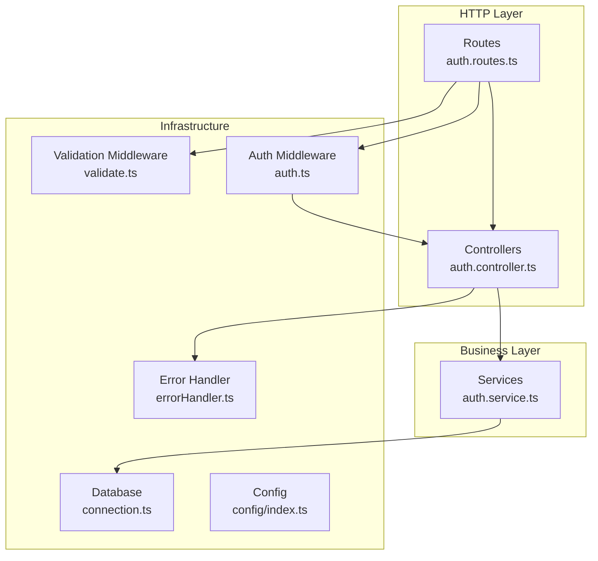
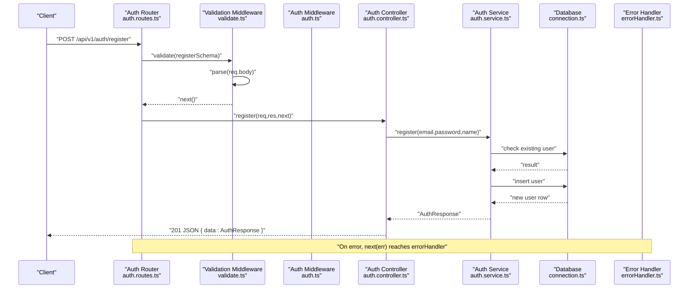
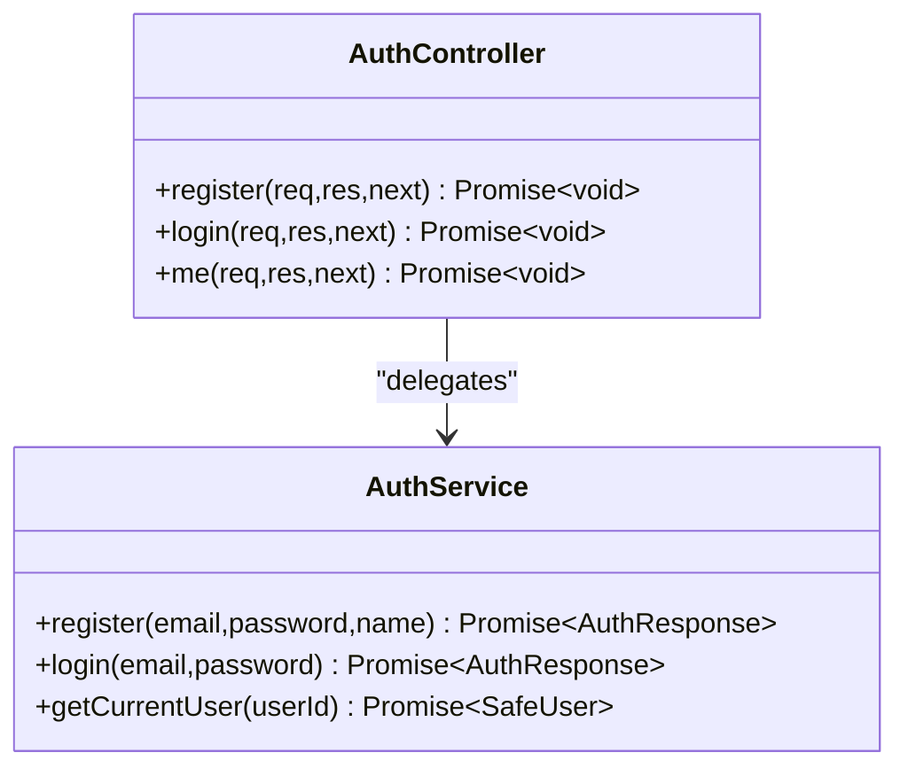
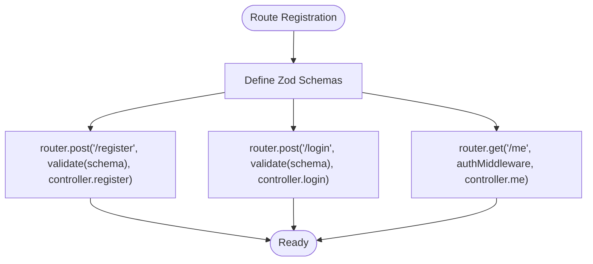
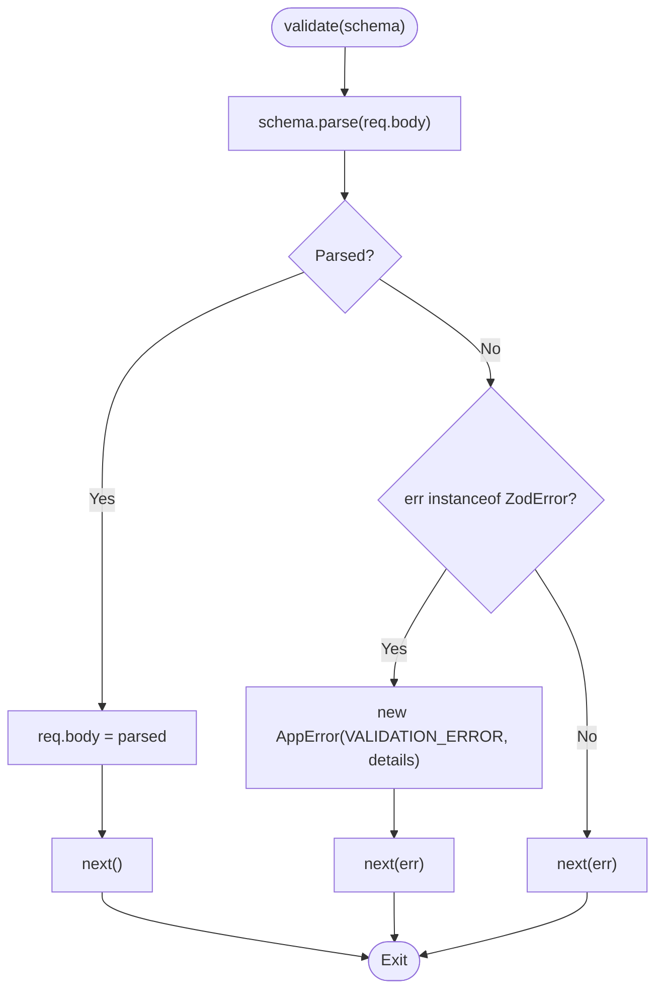
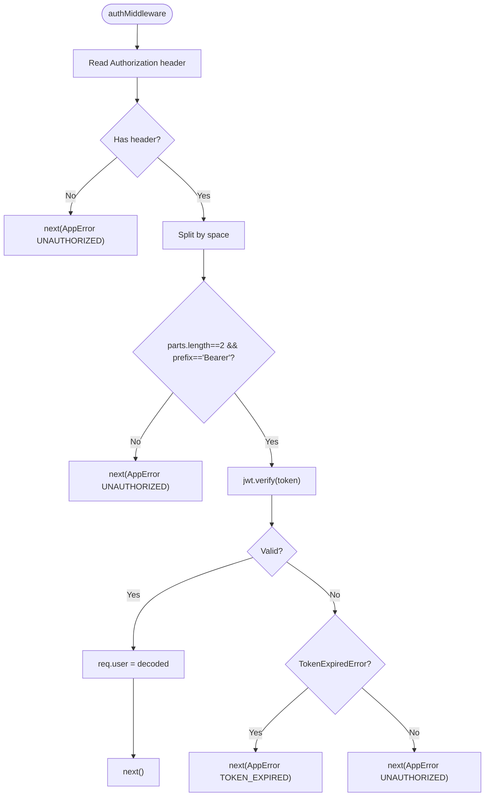
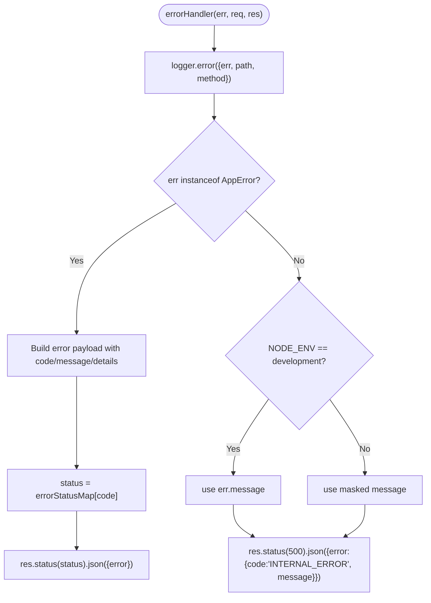
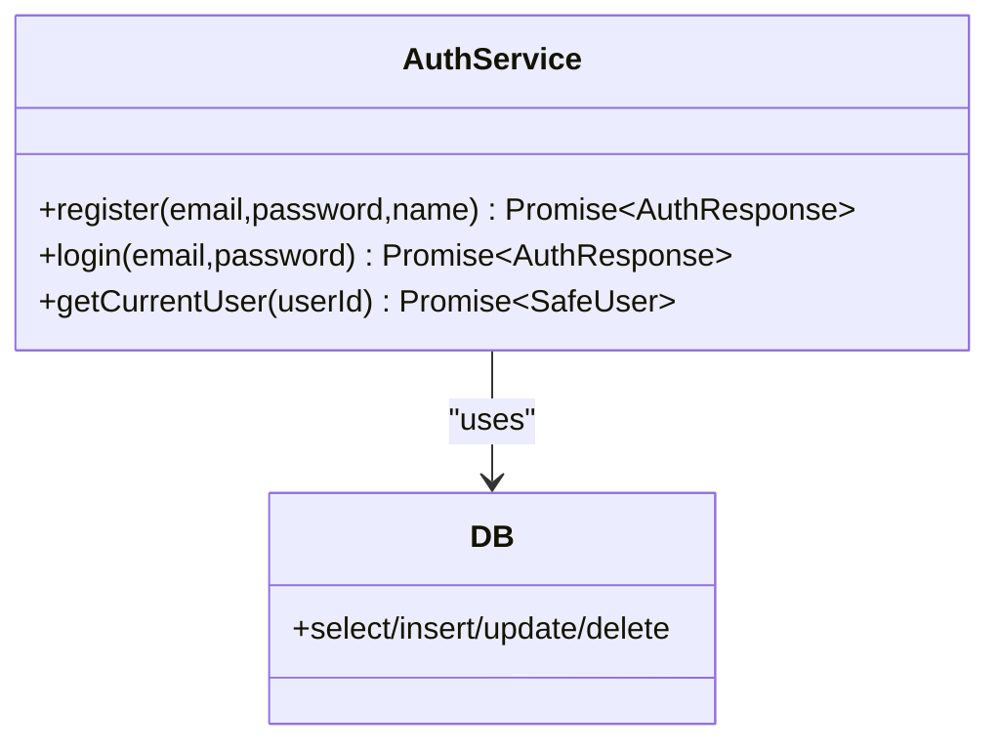
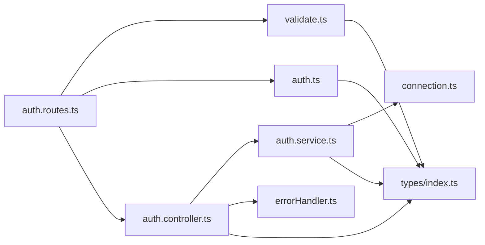

# Controllers Layer

<cite>
**Referenced Files in This Document**
- [auth.controller.ts](file://code/server/src/controllers/auth.controller.ts)
- [auth.routes.ts](file://code/server/src/routes/auth.routes.ts)
- [auth.service.ts](file://code/server/src/services/auth.service.ts)
- [validate.ts](file://code/server/src/middleware/validate.ts)
- [auth.ts](file://code/server/src/middleware/auth.ts)
- [errorHandler.ts](file://code/server/src/middleware/errorHandler.ts)
- [app.ts](file://code/server/src/app.ts)
- [index.ts](file://code/server/src/types/index.ts)
- [connection.ts](file://code/server/src/db/connection.ts)
- [API-SPEC.md](file://api-spec/API-SPEC.md)
</cite>

## Table of Contents
1. [Introduction](#introduction)
2. [Project Structure](#project-structure)
3. [Core Components](#core-components)
4. [Architecture Overview](#architecture-overview)
5. [Detailed Component Analysis](#detailed-component-analysis)
6. [Dependency Analysis](#dependency-analysis)
7. [Performance Considerations](#performance-considerations)
8. [Troubleshooting Guide](#troubleshooting-guide)
9. [Conclusion](#conclusion)

## Introduction
This document explains the controller layer implementation in the backend server. It focuses on the controller pattern with clear separation of concerns: request handling, business logic delegation, and response formatting. It documents the controller lifecycle, including request validation, service method invocation, and standardized response/error handling. It also covers error handling patterns, HTTP status code usage, response payload structures, controller method signatures, parameter extraction, service integration, and testing strategies.

## Project Structure
The server follows a layered architecture:
- Routes define endpoints and compose middleware
- Controllers handle HTTP requests, extract parameters, call services, and format responses
- Services encapsulate business logic and database operations
- Middleware handles cross-cutting concerns like validation, authentication, and error handling
- Types define shared interfaces and error codes
- Database connection uses Knex with a connection pool

**Diagram sources**
- [auth.routes.ts:20-105](file://code/server/src/routes/auth.routes.ts#L20-L105)
- [auth.controller.ts:26-81](file://code/server/src/controllers/auth.controller.ts#L26-L81)
- [auth.service.ts:68-165](file://code/server/src/services/auth.service.ts#L68-L165)
- [validate.ts:31-71](file://code/server/src/middleware/validate.ts#L31-L71)
- [auth.ts:29-59](file://code/server/src/middleware/auth.ts#L29-L59)
- [errorHandler.ts:29-67](file://code/server/src/middleware/errorHandler.ts#L29-L67)
- [connection.ts:22-39](file://code/server/src/db/connection.ts#L22-L39)

**Section sources**
- [auth.routes.ts:1-106](file://code/server/src/routes/auth.routes.ts#L1-L106)
- [auth.controller.ts:1-82](file://code/server/src/controllers/auth.controller.ts#L1-L82)
- [auth.service.ts:1-166](file://code/server/src/services/auth.service.ts#L1-L166)
- [validate.ts:1-72](file://code/server/src/middleware/validate.ts#L1-L72)
- [auth.ts:1-60](file://code/server/src/middleware/auth.ts#L1-L60)
- [errorHandler.ts:1-68](file://code/server/src/middleware/errorHandler.ts#L1-L68)
- [connection.ts:1-40](file://code/server/src/db/connection.ts#L1-L40)

## Core Components
- Controllers: Thin handlers that extract parameters from requests, delegate to services, and format JSON responses. They do not perform business logic or database operations.
- Services: Business logic layer performing database operations, encryption, token generation, and data transformation.
- Validation Middleware: Zod-based request body validation that converts errors into AppError with 400 status.
- Authentication Middleware: Extracts Bearer tokens, verifies JWT, and injects user info into the request.
- Error Handler: Centralized error processing that returns consistent error payloads and logs failures.
- Types: Shared interfaces for request bodies, responses, JWT payloads, error codes, and AppError class.

Key responsibilities:
- Controllers: Parameter extraction, service invocation, HTTP status selection, JSON response formatting
- Services: Data access, transformations, business rules, and error signaling via AppError
- Middleware: Cross-cutting concerns and pre/post-processing

**Section sources**
- [auth.controller.ts:13-15](file://code/server/src/controllers/auth.controller.ts#L13-L15)
- [auth.service.ts:12-17](file://code/server/src/services/auth.service.ts#L12-L17)
- [validate.ts:11-13](file://code/server/src/middleware/validate.ts#L11-L13)
- [auth.ts:10-14](file://code/server/src/middleware/auth.ts#L10-L14)
- [errorHandler.ts:13-16](file://code/server/src/middleware/errorHandler.ts#L13-L16)
- [index.ts:153-168](file://code/server/src/types/index.ts#L153-L168)

## Architecture Overview
The controller lifecycle for authentication endpoints follows a consistent flow:
1. Route registers endpoint with validation and controller
2. Validation middleware parses and validates request body
3. Authentication middleware verifies Bearer token (for protected endpoints)
4. Controller extracts parameters and calls service
5. Service executes business logic and returns data
6. Controller formats response and sets status
7. Error handler centralizes error responses

**Diagram sources**
- [auth.routes.ts:77-81](file://code/server/src/routes/auth.routes.ts#L77-L81)
- [validate.ts:44-70](file://code/server/src/middleware/validate.ts#L44-L70)
- [auth.controller.ts:26-36](file://code/server/src/controllers/auth.controller.ts#L26-L36)
- [auth.service.ts:68-101](file://code/server/src/services/auth.service.ts#L68-L101)
- [connection.ts:22-39](file://code/server/src/db/connection.ts#L22-L39)
- [errorHandler.ts:29-54](file://code/server/src/middleware/errorHandler.ts#L29-L54)

**Section sources**
- [auth.routes.ts:20-105](file://code/server/src/routes/auth.routes.ts#L20-L105)
- [auth.controller.ts:26-81](file://code/server/src/controllers/auth.controller.ts#L26-L81)
- [auth.service.ts:68-165](file://code/server/src/services/auth.service.ts#L68-L165)
- [validate.ts:31-71](file://code/server/src/middleware/validate.ts#L31-L71)
- [auth.ts:29-59](file://code/server/src/middleware/auth.ts#L29-L59)
- [errorHandler.ts:29-67](file://code/server/src/middleware/errorHandler.ts#L29-L67)

## Detailed Component Analysis

### Authentication Controller
The authentication controller exposes three endpoints:
- POST /api/v1/auth/register: Validates registration payload, delegates to service, responds with 201 and data
- POST /api/v1/auth/login: Validates login payload, delegates to service, responds with 200 and data
- GET /api/v1/auth/me: Requires Bearer token, extracts user from request, delegates to service, responds with 200 and data

Controller responsibilities:
- Extract typed parameters from req.body or req.user
- Call corresponding service method
- Format JSON response with data wrapper
- Propagate errors to global error handler

**Diagram sources**
- [auth.controller.ts:26-81](file://code/server/src/controllers/auth.controller.ts#L26-L81)
- [auth.service.ts:68-165](file://code/server/src/services/auth.service.ts#L68-L165)

**Section sources**
- [auth.controller.ts:17-81](file://code/server/src/controllers/auth.controller.ts#L17-L81)

### Route Composition and Validation
The auth router composes:
- Zod schemas for request body validation
- Validation middleware to enforce schema before controller
- Authentication middleware for protected endpoints
- Controller handlers

**Diagram sources**
- [auth.routes.ts:35-102](file://code/server/src/routes/auth.routes.ts#L35-L102)

**Section sources**
- [auth.routes.ts:20-105](file://code/server/src/routes/auth.routes.ts#L20-L105)

### Validation Middleware Pattern
The validation middleware:
- Accepts a Zod schema
- Parses req.body with strict schema.parse
- On success, replaces req.body with parsed data and continues
- On ZodError, constructs AppError with VALIDATION_ERROR and details array
- Passes non-Zod errors to next()

**Diagram sources**
- [validate.ts:44-70](file://code/server/src/middleware/validate.ts#L44-L70)

**Section sources**
- [validate.ts:31-71](file://code/server/src/middleware/validate.ts#L31-L71)

### Authentication Middleware Pattern
The auth middleware:
- Reads Authorization header
- Ensures Bearer token format
- Verifies JWT signature and decodes payload
- Injects user info into req.user
- On failure, throws AppError with UNAUTHORIZED or TOKEN_EXPIRED

**Diagram sources**
- [auth.ts:29-59](file://code/server/src/middleware/auth.ts#L29-L59)

**Section sources**
- [auth.ts:16-59](file://code/server/src/middleware/auth.ts#L16-L59)

### Error Handling Pattern
The global error handler:
- Logs error with request context
- If error is AppError, returns structured error payload with status code mapped from error code
- If error is not AppError, returns 500 INTERNAL_ERROR (masked in production)
- Always returns JSON error payload

**Diagram sources**
- [errorHandler.ts:29-67](file://code/server/src/middleware/errorHandler.ts#L29-L67)
- [index.ts:117-130](file://code/server/src/types/index.ts#L117-L130)

**Section sources**
- [errorHandler.ts:18-67](file://code/server/src/middleware/errorHandler.ts#L18-L67)
- [index.ts:117-168](file://code/server/src/types/index.ts#L117-L168)

### Service Layer Integration
The service layer:
- Performs database operations via Knex connection
- Handles encryption and token generation
- Transforms database rows to safe response formats
- Throws AppError with appropriate error codes for business rules

**Diagram sources**
- [auth.service.ts:68-165](file://code/server/src/services/auth.service.ts#L68-L165)
- [connection.ts:22-39](file://code/server/src/db/connection.ts#L22-L39)

**Section sources**
- [auth.service.ts:12-17](file://code/server/src/services/auth.service.ts#L12-L17)
- [connection.ts:22-39](file://code/server/src/db/connection.ts#L22-L39)

### Response and Error Payload Structures
- Success responses wrap data under a data field
- Error responses use a consistent error object with code, message, and optional details
- HTTP status codes are derived from error codes via errorStatusMap

Examples of response shapes:
- Success: { data: { ... } }
- Error: { error: { code, message, details? } }

**Section sources**
- [API-SPEC.md:25-52](file://api-spec/API-SPEC.md#L25-L52)
- [index.ts:139-145](file://code/server/src/types/index.ts#L139-L145)
- [index.ts:117-130](file://code/server/src/types/index.ts#L117-L130)

### Testing Strategies
Recommended testing approaches for controllers:
- Unit tests for controller methods focusing on parameter extraction, service invocation, and response formatting
- Mock service layer to isolate controller logic and assert side effects (status, JSON body)
- Test error propagation by mocking service to throw AppError and verifying error handler behavior
- Integration tests for route composition, middleware ordering, and end-to-end flows
- Validation tests using invalid payloads to ensure validation middleware triggers VALIDATION_ERROR
- Authentication tests covering missing token, malformed token, expired token, and valid token scenarios

[No sources needed since this section provides general guidance]

## Dependency Analysis
The controller layer depends on:
- Routes for endpoint registration and middleware composition
- Validation middleware for request body enforcement
- Authentication middleware for protected endpoints
- Services for business logic
- Error handler for centralized error processing
- Types for shared interfaces and error codes

**Diagram sources**
- [auth.routes.ts:10-14](file://code/server/src/routes/auth.routes.ts#L10-L14)
- [auth.controller.ts:13-15](file://code/server/src/controllers/auth.controller.ts#L13-L15)
- [auth.service.ts:12-17](file://code/server/src/services/auth.service.ts#L12-L17)
- [validate.ts:11-13](file://code/server/src/middleware/validate.ts#L11-L13)
- [auth.ts:10-14](file://code/server/src/middleware/auth.ts#L10-L14)
- [errorHandler.ts:13-16](file://code/server/src/middleware/errorHandler.ts#L13-L16)
- [index.ts:153-168](file://code/server/src/types/index.ts#L153-L168)
- [connection.ts:22-39](file://code/server/src/db/connection.ts#L22-L39)

**Section sources**
- [auth.routes.ts:10-14](file://code/server/src/routes/auth.routes.ts#L10-L14)
- [auth.controller.ts:13-15](file://code/server/src/controllers/auth.controller.ts#L13-L15)
- [auth.service.ts:12-17](file://code/server/src/services/auth.service.ts#L12-L17)
- [validate.ts:11-13](file://code/server/src/middleware/validate.ts#L11-L13)
- [auth.ts:10-14](file://code/server/src/middleware/auth.ts#L10-L14)
- [errorHandler.ts:13-16](file://code/server/src/middleware/errorHandler.ts#L13-L16)
- [index.ts:153-168](file://code/server/src/types/index.ts#L153-L168)
- [connection.ts:22-39](file://code/server/src/db/connection.ts#L22-L39)

## Performance Considerations
- Use connection pooling via Knex to minimize connection overhead
- Keep controllers thin to reduce CPU and memory usage
- Prefer streaming for large payloads when applicable
- Apply rate limiting at the framework level to protect resources
- Avoid synchronous blocking operations in controllers and services

[No sources needed since this section provides general guidance]

## Troubleshooting Guide
Common issues and resolutions:
- Validation failures: Ensure request body matches Zod schema; check details array for field-level errors
- Authentication failures: Confirm Authorization header format and token validity; verify JWT secret and expiration
- Resource not found: Verify resource existence and ownership checks in services
- Internal errors: Review error logs and stack traces; confirm production masking of messages

**Section sources**
- [validate.ts:51-68](file://code/server/src/middleware/validate.ts#L51-L68)
- [auth.ts:33-58](file://code/server/src/middleware/auth.ts#L33-L58)
- [errorHandler.ts:30-66](file://code/server/src/middleware/errorHandler.ts#L30-L66)

## Conclusion
The controller layer implements a clean separation of concerns: controllers focus on request/response handling, services encapsulate business logic, and middleware enforces validation and authentication. The unified error handling ensures consistent responses and robust logging. Following the documented patterns and testing strategies will help maintain reliability and scalability.