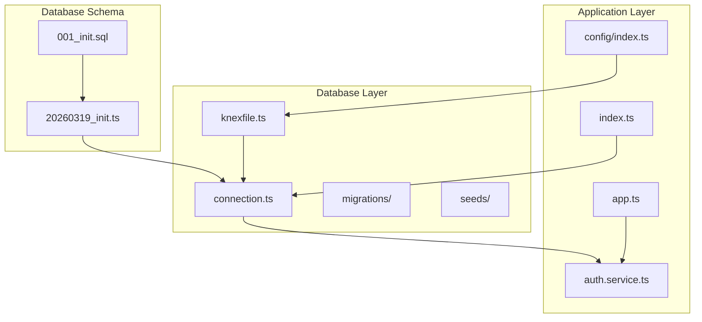
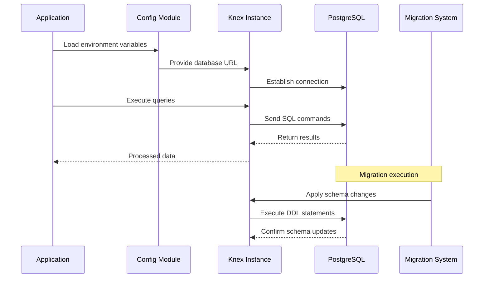
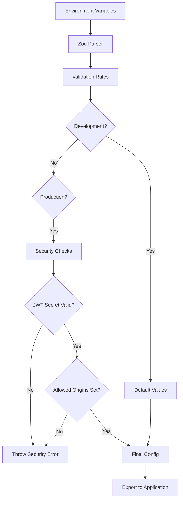
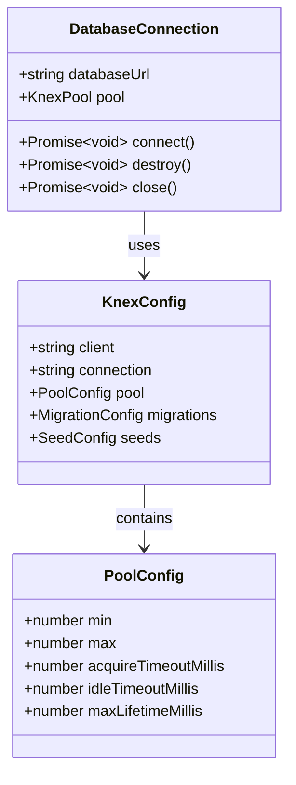
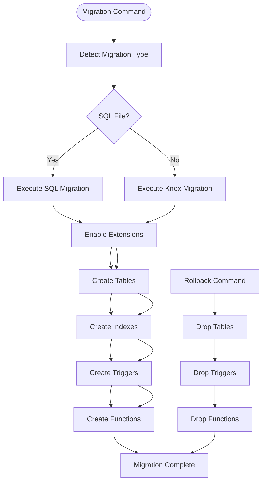
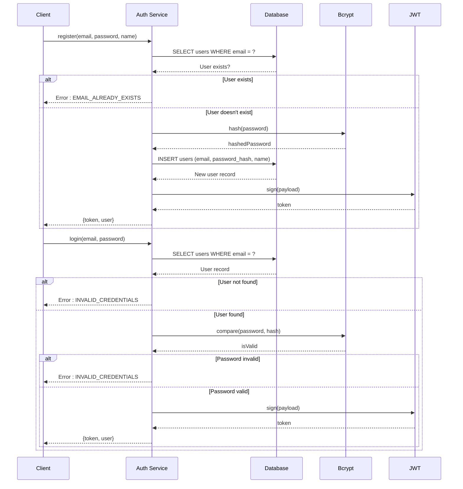
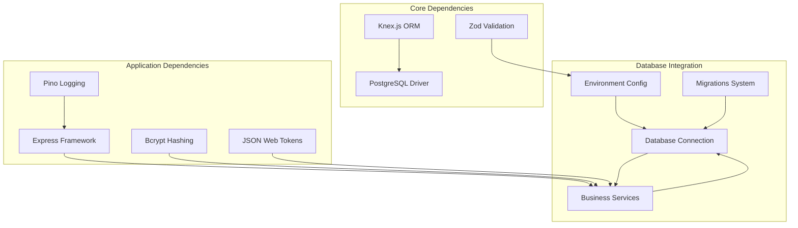

# Database Integration

<cite>
**Referenced Files in This Document**
- [knexfile.ts](file://code/server/knexfile.ts)
- [connection.ts](file://code/server/src/db/connection.ts)
- [20260319_init.ts](file://code/server/src/db/migrations/20260319_init.ts)
- [index.ts](file://code/server/src/index.ts)
- [index.ts](file://code/server/src/app.ts)
- [index.ts](file://code/server/src/services/auth.service.ts)
- [index.ts](file://code/server/src/config/index.ts)
- [001_init.sql](file://db/001_init.sql)
- [package.json](file://code/server/package.json)
</cite>

## Table of Contents
1. [Introduction](#introduction)
2. [Project Structure](#project-structure)
3. [Core Components](#core-components)
4. [Architecture Overview](#architecture-overview)
5. [Detailed Component Analysis](#detailed-component-analysis)
6. [Dependency Analysis](#dependency-analysis)
7. [Performance Considerations](#performance-considerations)
8. [Security Considerations](#security-considerations)
9. [Migration Workflow](#migration-workflow)
10. [Troubleshooting Guide](#troubleshooting-guide)
11. [Conclusion](#conclusion)

## Introduction
This document provides comprehensive documentation for the database integration architecture using Knex.js ORM in the Yule Notion project. It covers database connection management, configuration patterns, environment-specific settings, migration system with timestamp-based migration files, rollback strategies, query building patterns, transaction handling, connection pooling, security considerations, and performance optimization techniques. The system is built with PostgreSQL as the primary database and utilizes Knex.js for database operations and migrations.

## Project Structure
The database integration is organized across several key areas:

**Diagram sources**
- [knexfile.ts:1-69](file://code/server/knexfile.ts#L1-L69)
- [connection.ts:1-40](file://code/server/src/db/connection.ts#L1-L40)
- [20260319_init.ts:1-300](file://code/server/src/db/migrations/20260319_init.ts#L1-L300)
- [index.ts:1-77](file://code/server/src/index.ts#L1-L77)
- [index.ts:1-121](file://code/server/src/app.ts#L1-L121)
- [index.ts:1-166](file://code/server/src/services/auth.service.ts#L1-L166)
- [index.ts:1-101](file://code/server/src/config/index.ts#L1-L101)
- [001_init.sql:1-254](file://db/001_init.sql#L1-L254)

**Section sources**
- [knexfile.ts:1-69](file://code/server/knexfile.ts#L1-L69)
- [connection.ts:1-40](file://code/server/src/db/connection.ts#L1-L40)
- [20260319_init.ts:1-300](file://code/server/src/db/migrations/20260319_init.ts#L1-L300)
- [index.ts:1-77](file://code/server/src/index.ts#L1-L77)
- [index.ts:1-121](file://code/server/src/app.ts#L1-L121)
- [index.ts:1-166](file://code/server/src/services/auth.service.ts#L1-L166)
- [index.ts:1-101](file://code/server/src/config/index.ts#L1-L101)
- [001_init.sql:1-254](file://db/001_init.sql#L1-L254)

## Core Components
The database integration consists of several core components that work together to provide robust database connectivity and management:

### Knex Configuration Management
The system uses a centralized configuration approach with environment-specific settings:

- **Environment Detection**: Automatic selection between development, test, and production environments
- **Connection Strings**: Flexible configuration through DATABASE_URL environment variable
- **Migration Settings**: TypeScript migration support with proper directory structure
- **Pool Configuration**: Production-optimized connection pooling

### Database Connection Instance
A singleton Knex instance provides centralized database access:

- **Singleton Pattern**: Single global instance prevents connection proliferation
- **Connection Pooling**: Built-in pool management for efficient resource utilization
- **Graceful Shutdown**: Proper cleanup mechanism for application termination

### Migration System
The migration system supports both SQL-based and Knex-based approaches:

- **Timestamp-based Filenames**: Ensures chronological ordering
- **TypeScript Support**: Modern migration authoring with type safety
- **Rollback Capability**: Complete reverse migration support
- **Extension Management**: Automatic extension creation for advanced features

**Section sources**
- [knexfile.ts:10-68](file://code/server/knexfile.ts#L10-L68)
- [connection.ts:22-39](file://code/server/src/db/connection.ts#L22-L39)
- [20260319_init.ts:17-299](file://code/server/src/db/migrations/20260319_init.ts#L17-L299)

## Architecture Overview
The database architecture follows a layered approach with clear separation of concerns:

**Diagram sources**
- [index.ts:18-24](file://code/server/src/index.ts#L18-L24)
- [index.ts:72-77](file://code/server/src/index.ts#L72-L77)
- [connection.ts:22-29](file://code/server/src/db/connection.ts#L22-L29)
- [knexfile.ts:13-57](file://code/server/knexfile.ts#L13-L57)

The architecture ensures:
- **Centralized Configuration**: All database settings managed in one place
- **Environment Isolation**: Different configurations for development, testing, and production
- **Connection Reuse**: Single Knex instance handles all database operations
- **Migration Safety**: Structured approach to schema evolution

## Detailed Component Analysis

### Environment Configuration System
The configuration system provides type-safe environment variable management:

**Diagram sources**
- [index.ts:16-44](file://code/server/src/config/index.ts#L16-L44)
- [index.ts:52-67](file://code/server/src/config/index.ts#L52-L67)
- [index.ts:72-98](file://code/server/src/config/index.ts#L72-L98)

Key features include:
- **Type Safety**: Compile-time validation of environment variables
- **Default Values**: Development-friendly defaults
- **Production Security**: Mandatory security checks for production deployment
- **Flexible Configuration**: Support for custom database URLs

**Section sources**
- [index.ts:16-98](file://code/server/src/config/index.ts#L16-L98)

### Database Connection Management
The connection management system implements best practices for production deployments:

**Diagram sources**
- [connection.ts:22-29](file://code/server/src/db/connection.ts#L22-L29)
- [knexfile.ts:53-57](file://code/server/knexfile.ts#L53-L57)

The connection system provides:
- **Singleton Pattern**: Prevents connection leaks
- **Automatic Pool Management**: Optimized connection reuse
- **Graceful Shutdown**: Proper cleanup on application exit
- **Error Handling**: Robust error propagation

**Section sources**
- [connection.ts:22-39](file://code/server/src/db/connection.ts#L22-L39)
- [knexfile.ts:53-57](file://code/server/knexfile.ts#L53-L57)

### Migration System Architecture
The migration system supports both SQL and Knex-based approaches:

**Diagram sources**
- [20260319_init.ts:17-299](file://code/server/src/db/migrations/20260319_init.ts#L17-L299)
- [001_init.sql:7-253](file://db/001_init.sql#L7-L253)

The migration system includes:
- **Extension Management**: Automatic creation of required PostgreSQL extensions
- **Table Creation**: Complete schema definition with constraints
- **Index Optimization**: Strategic indexing for performance
- **Trigger Functions**: Automated column updates and search vector maintenance
- **Rollback Support**: Complete reverse migration capability

**Section sources**
- [20260319_init.ts:17-299](file://code/server/src/db/migrations/20260319_init.ts#L17-L299)
- [001_init.sql:7-253](file://db/001_init.sql#L7-L253)

### Authentication Service Integration
The authentication service demonstrates practical database usage patterns:

**Diagram sources**
- [index.ts:68-101](file://code/server/src/services/auth.service.ts#L68-L101)
- [index.ts:117-143](file://code/server/src/services/auth.service.ts#L117-L143)

The authentication service showcases:
- **Database Abstraction**: Clean separation between business logic and data access
- **Security Patterns**: Proper password hashing and token generation
- **Error Handling**: Comprehensive error management
- **Data Transformation**: Safe user data exposure patterns

**Section sources**
- [index.ts:68-166](file://code/server/src/services/auth.service.ts#L68-L166)

## Dependency Analysis
The database integration has minimal external dependencies while maintaining robust functionality:

**Diagram sources**
- [package.json:15-27](file://code/server/package.json#L15-L27)
- [connection.ts:8-9](file://code/server/src/db/connection.ts#L8-L9)
- [index.ts:15-16](file://code/server/src/app.ts#L15-L16)

Key dependency characteristics:
- **Minimal External Dependencies**: Only essential packages included
- **Type Safety**: Full TypeScript support throughout
- **Modern Tooling**: Latest versions of all dependencies
- **Security Focus**: Production-ready security libraries

**Section sources**
- [package.json:15-39](file://code/server/package.json#L15-L39)
- [connection.ts:8-9](file://code/server/src/db/connection.ts#L8-L9)

## Performance Considerations
The database integration implements several performance optimization strategies:

### Connection Pooling
- **Production Pool Size**: Minimum 2, Maximum 10 connections
- **Automatic Management**: Knex handles connection lifecycle
- **Resource Efficiency**: Reduces connection overhead

### Index Strategy
- **Multi-column Indexes**: Optimized for common query patterns
- **GIN Indexes**: Efficient JSONB and text search operations
- **Conditional Indexes**: Filtered indexes for soft-deleted records

### Query Optimization
- **Single Connection Instance**: Eliminates connection overhead
- **Batch Operations**: Minimized round trips to database
- **Efficient Joins**: Proper foreign key relationships

### Caching Strategy
- **Application Level Caching**: Business logic caching where appropriate
- **Database Level Caching**: PostgreSQL query plan caching
- **Connection Reuse**: Persistent connection instances

## Security Considerations
The database integration implements comprehensive security measures:

### Environment Security
- **Production Validation**: Mandatory security checks for production deployment
- **Secret Management**: JWT secrets must be at least 32 characters
- **CORS Control**: Explicit origin whitelisting in production

### Data Protection
- **Password Hashing**: bcrypt with 10 rounds of salt
- **SQL Injection Prevention**: Parameterized queries through Knex
- **Sensitive Data Handling**: Safe user data exposure patterns

### Access Control
- **Connection Isolation**: Separate databases for development and testing
- **Migration Security**: Controlled schema changes through migrations
- **Error Handling**: Generic error messages to prevent information leakage

**Section sources**
- [index.ts:52-67](file://code/server/src/config/index.ts#L52-L67)
- [index.ts:117-132](file://code/server/src/services/auth.service.ts#L117-L132)

## Migration Workflow
The migration system provides a structured approach to database schema evolution:

### Migration Execution
1. **Environment Detection**: Automatically selects appropriate configuration
2. **Schema Validation**: Ensures database compatibility
3. **Extension Setup**: Creates required PostgreSQL extensions
4. **Object Creation**: Builds tables, indexes, triggers, and functions
5. **Data Integrity**: Applies constraints and checks

### Rollback Strategy
- **Reverse Order**: Objects dropped in reverse dependency order
- **Complete Cleanup**: Removes all database artifacts
- **Safety Checks**: Verifies existence before dropping

### Development Workflow
- **Local Development**: Uses local PostgreSQL instance
- **Testing**: Dedicated test database with separate schema
- **Production Deployment**: Secure configuration with strict validation

**Section sources**
- [20260319_init.ts:17-299](file://code/server/src/db/migrations/20260319_init.ts#L17-L299)
- [knexfile.ts:13-57](file://code/server/knexfile.ts#L13-L57)

## Troubleshooting Guide

### Common Connection Issues
- **Connection Refused**: Verify PostgreSQL service is running
- **Authentication Failed**: Check DATABASE_URL format and credentials
- **Pool Exhaustion**: Review connection pool settings and application usage

### Migration Problems
- **Migration Lock**: Check for stuck migrations and manual cleanup
- **Schema Conflicts**: Review migration dependencies and order
- **Extension Issues**: Verify PostgreSQL version supports required extensions

### Performance Issues
- **Slow Queries**: Analyze query execution plans and add missing indexes
- **Connection Leaks**: Ensure proper cleanup in application shutdown
- **Memory Usage**: Monitor connection pool sizing and query efficiency

### Security Concerns
- **Production Misconfiguration**: Verify JWT secret and CORS settings
- **Data Exposure**: Review user data transformation patterns
- **SQL Injection**: Ensure all user input is properly parameterized

**Section sources**
- [connection.ts:37-39](file://code/server/src/db/connection.ts#L37-L39)
- [index.ts:35-52](file://code/server/src/index.ts#L35-L52)

## Conclusion
The database integration architecture using Knex.js ORM in the Yule Notion project demonstrates best practices for modern database development. The system provides:

- **Robust Configuration Management**: Environment-specific settings with type safety
- **Production-Ready Architecture**: Proper connection pooling and error handling
- **Structured Evolution**: Comprehensive migration system with rollback support
- **Security Focus**: Production validation and secure data handling
- **Performance Optimization**: Strategic indexing and efficient query patterns

The modular design allows for easy maintenance and future enhancements while maintaining backward compatibility through the migration system. The combination of TypeScript, Zod validation, and Knex.js provides a solid foundation for scalable database operations.