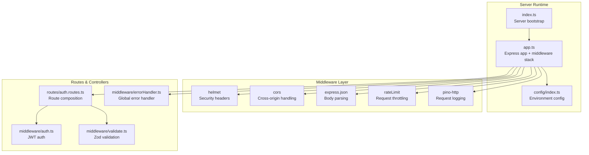
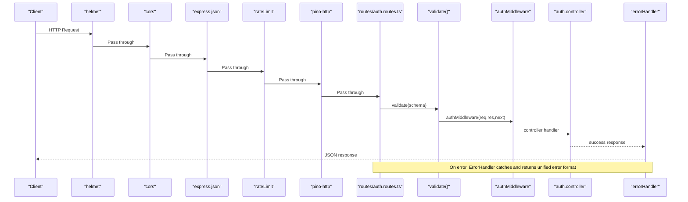
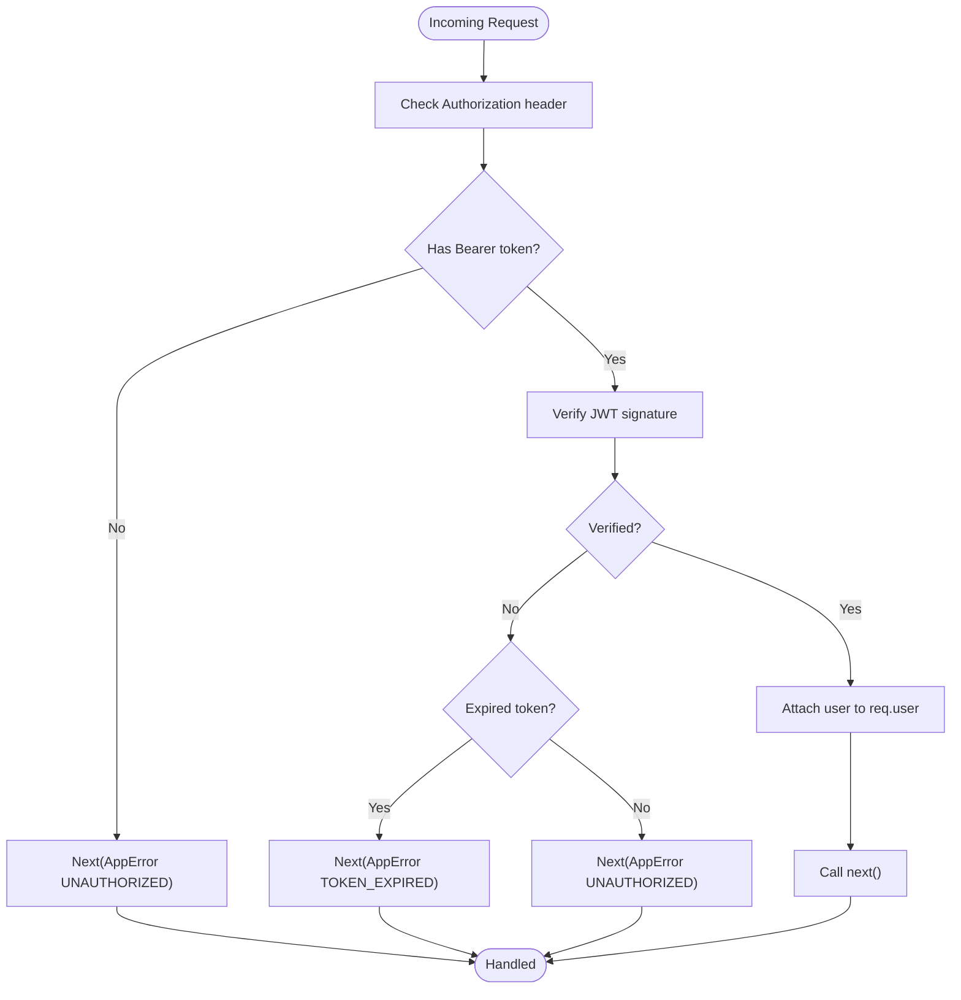
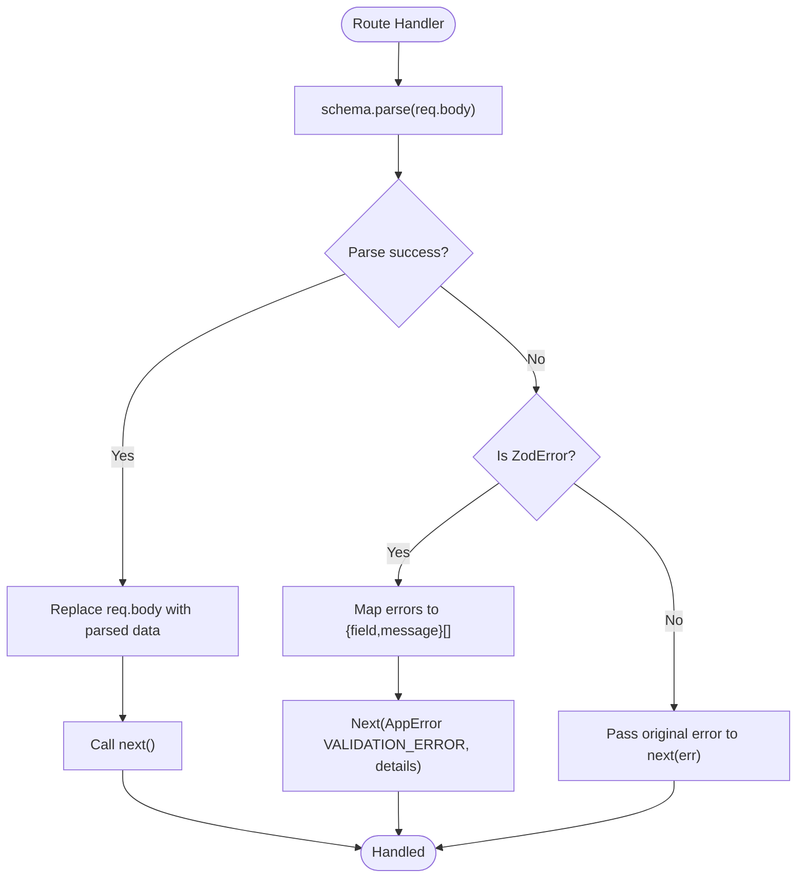
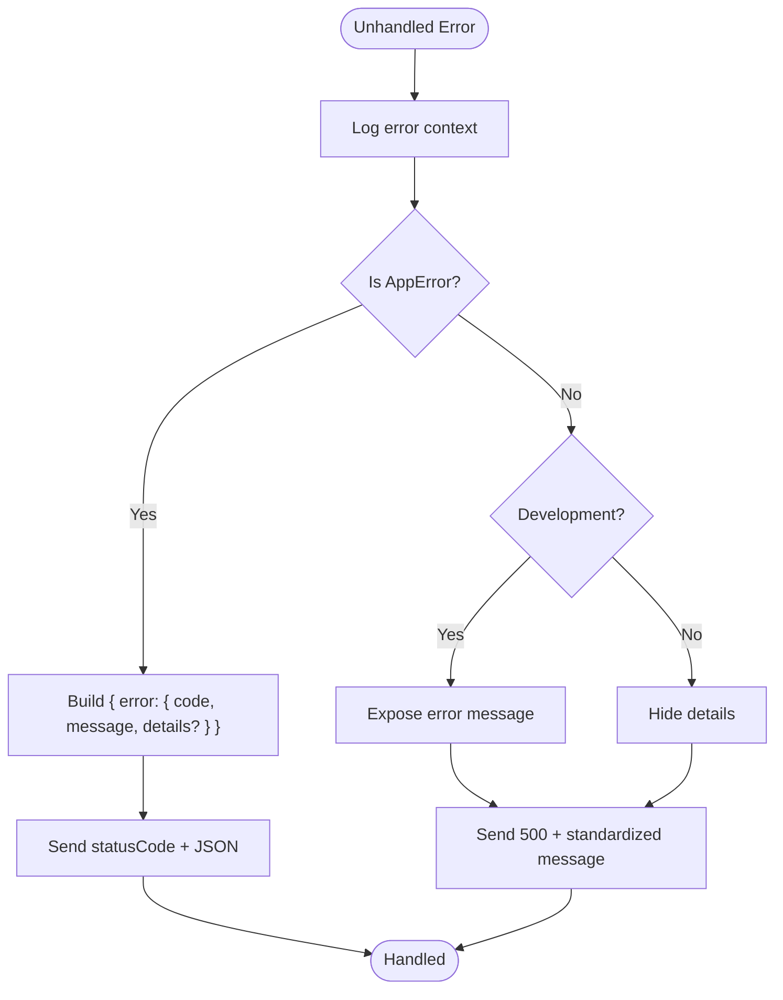
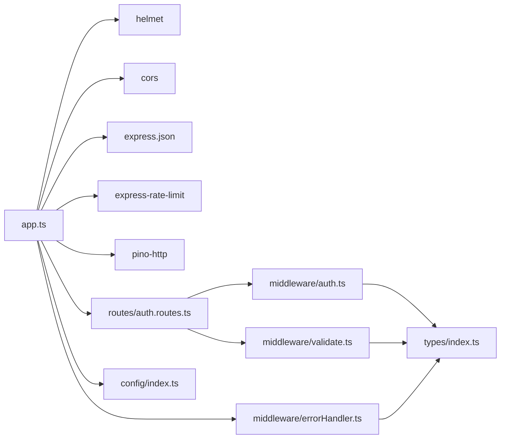

# Middleware Stack

<cite>
**Referenced Files in This Document**
- [app.ts](file://code/server/src/app.ts)
- [index.ts](file://code/server/src/index.ts)
- [auth.ts](file://code/server/src/middleware/auth.ts)
- [errorHandler.ts](file://code/server/src/middleware/errorHandler.ts)
- [validate.ts](file://code/server/src/middleware/validate.ts)
- [auth.routes.ts](file://code/server/src/routes/auth.routes.ts)
- [config/index.ts](file://code/server/src/config/index.ts)
- [types/index.ts](file://code/server/src/types/index.ts)
- [package.json](file://code/server/package.json)
- [ARCHITECTURE.md](file://arch/ARCHITECTURE.md)
- [README.md](file://README.md)
</cite>

## Table of Contents
1. [Introduction](#introduction)
2. [Project Structure](#project-structure)
3. [Core Components](#core-components)
4. [Architecture Overview](#architecture-overview)
5. [Detailed Component Analysis](#detailed-component-analysis)
6. [Dependency Analysis](#dependency-analysis)
7. [Performance Considerations](#performance-considerations)
8. [Troubleshooting Guide](#troubleshooting-guide)
9. [Conclusion](#conclusion)

## Introduction
This document explains the middleware architecture and execution pipeline for the Yule Notion backend service. It details the middleware stack order from outer to inner layers, describes each middleware component (security headers, CORS, rate limiting, request logging), and documents custom middleware patterns for authentication, validation, and error handling. It also covers middleware chaining, async handling, performance considerations, and testing/debugging strategies.

## Project Structure
The server is organized around Express with a clear separation of concerns:
- Application bootstrap and middleware registration in the Express app module
- Environment configuration and runtime behavior
- Middleware modules for auth, validation, and error handling
- Route modules that compose middleware with controllers
- Types and shared error handling infrastructure

**Diagram sources**
- [index.ts:11-24](file://code/server/src/index.ts#L11-L24)
- [app.ts:67-121](file://code/server/src/app.ts#L67-L121)
- [config/index.ts:72-98](file://code/server/src/config/index.ts#L72-L98)
- [auth.routes.ts:20-105](file://code/server/src/routes/auth.routes.ts#L20-L105)
- [auth.ts:29-59](file://code/server/src/middleware/auth.ts#L29-L59)
- [validate.ts:31-71](file://code/server/src/middleware/validate.ts#L31-L71)
- [errorHandler.ts:29-67](file://code/server/src/middleware/errorHandler.ts#L29-L67)

**Section sources**
- [app.ts:65-121](file://code/server/src/app.ts#L65-L121)
- [auth.routes.ts:20-105](file://code/server/src/routes/auth.routes.ts#L20-L105)
- [config/index.ts:72-98](file://code/server/src/config/index.ts#L72-L98)

## Core Components
- Security headers: helmet sets secure defaults for HTTP headers.
- Cross-origin handling: cors enables controlled access to the API.
- Body parsing: express.json parses incoming JSON requests with a 10 MB limit.
- Rate limiting: express-rate-limit enforces global request limits.
- Request logging: pino-http logs each request with structured JSON.
- Authentication middleware: validates JWT Bearer tokens and injects user context.
- Validation middleware: Zod-based request body validation with friendly error mapping.
- Global error handler: standardizes error responses and logs unexpected errors.

**Section sources**
- [app.ts:67-99](file://code/server/src/app.ts#L67-L99)
- [auth.ts:29-59](file://code/server/src/middleware/auth.ts#L29-L59)
- [validate.ts:31-71](file://code/server/src/middleware/validate.ts#L31-L71)
- [errorHandler.ts:29-67](file://code/server/src/middleware/errorHandler.ts#L29-L67)

## Architecture Overview
The middleware stack is registered in a fixed order during application initialization. Requests flow from outer to inner middleware, then to routes, and finally to the global error handler. Responses flow back in reverse order.

**Diagram sources**
- [app.ts:67-121](file://code/server/src/app.ts#L67-L121)
- [auth.routes.ts:77-102](file://code/server/src/routes/auth.routes.ts#L77-L102)
- [validate.ts:31-71](file://code/server/src/middleware/validate.ts#L31-L71)
- [auth.ts:29-59](file://code/server/src/middleware/auth.ts#L29-L59)
- [errorHandler.ts:29-67](file://code/server/src/middleware/errorHandler.ts#L29-L67)

## Detailed Component Analysis

### Security Headers (helmet)
- Purpose: Apply secure defaults for HTTP headers to mitigate common web vulnerabilities.
- Behavior: Applied globally before other middleware to ensure headers are set for all responses.
- Impact: Improves defense-in-depth posture without changing request processing logic.

**Section sources**
- [app.ts:67-69](file://code/server/src/app.ts#L67-L69)

### Cross-Origin Resource Sharing (CORS)
- Purpose: Control which origins can access the API.
- Behavior: In development, allows all origins; in production, restricts to configured allowed origins.
- Configuration: Credentials support enabled when allowedOrigins is set.

**Section sources**
- [app.ts:71-76](file://code/server/src/app.ts#L71-L76)
- [config/index.ts:96-98](file://code/server/src/config/index.ts#L96-L98)

### Request Body Parsing (express.json)
- Purpose: Parse incoming JSON request bodies.
- Configuration: Max body size set to 10 MB to accommodate image uploads.

**Section sources**
- [app.ts:78-80](file://code/server/src/app.ts#L78-L80)

### Request Throttling (express-rate-limit)
- Purpose: Prevent abuse by limiting requests per IP within a window.
- Configuration: 15-minute window with a maximum of 100 requests; returns a structured error payload with rate limit headers.

**Section sources**
- [app.ts:82-96](file://code/server/src/app.ts#L82-L96)

### Request Logging (pino-http)
- Purpose: Structured logging for every request, capturing method, path, and timing.
- Behavior: Integrated as middleware to log before routing and after rate limiting.

**Section sources**
- [app.ts:29-47](file://code/server/src/app.ts#L29-L47)
- [app.ts:98-99](file://code/server/src/app.ts#L98-L99)

### Authentication Middleware (JWT)
- Purpose: Extract Bearer token from Authorization header, verify signature, and attach user context to the request.
- Flow:
  - Validate presence and format of Authorization header.
  - Verify JWT signature using configured secret.
  - Inject decoded user payload into req.user for downstream handlers.
- Error handling: Returns 401 for missing/expired/invalid tokens via AppError.

**Diagram sources**
- [auth.ts:29-59](file://code/server/src/middleware/auth.ts#L29-L59)

**Section sources**
- [auth.ts:29-59](file://code/server/src/middleware/auth.ts#L29-L59)
- [types/index.ts:153-168](file://code/server/src/types/index.ts#L153-L168)

### Validation Middleware (Zod)
- Purpose: Validate and transform request bodies using Zod schemas.
- Behavior:
  - On success: replace req.body with validated/transformed data and continue.
  - On ZodError: map field-level errors to a friendly structure and pass an AppError with VALIDATION_ERROR.
- Usage: Applied at route level before controller handlers.

**Diagram sources**
- [validate.ts:31-71](file://code/server/src/middleware/validate.ts#L31-L71)

**Section sources**
- [validate.ts:31-71](file://code/server/src/middleware/validate.ts#L31-L71)
- [auth.routes.ts:77-102](file://code/server/src/routes/auth.routes.ts#L77-L102)

### Error Handling Middleware
- Purpose: Centralized error handling to ensure consistent error responses.
- Behavior:
  - Logs error context (path, method, message).
  - For AppError instances: returns code/status mapped from error code.
  - For unhandled errors: returns 500 INTERNAL_ERROR; hides internal details in production.
- Placement: Must be registered last to catch errors from all previous middleware and routes.

**Diagram sources**
- [errorHandler.ts:29-67](file://code/server/src/middleware/errorHandler.ts#L29-L67)

**Section sources**
- [errorHandler.ts:29-67](file://code/server/src/middleware/errorHandler.ts#L29-L67)
- [types/index.ts:117-130](file://code/server/src/types/index.ts#L117-L130)

### Route-Level Middleware Chaining Example
- Registration order: validate(schema) then authMiddleware.
- Execution order: validate runs first, then authMiddleware.
- Outcome: Requests must pass validation before authentication checks.

**Section sources**
- [auth.routes.ts:77-102](file://code/server/src/routes/auth.routes.ts#L77-L102)

### Async Middleware Handling
- All middleware follows Express’s standard signature and uses next() to propagate control.
- Authentication middleware verifies JWT synchronously; validation middleware parses schemas synchronously.
- Global error handler receives thrown errors and unhandled rejections, ensuring consistent error propagation.

**Section sources**
- [auth.ts:29-59](file://code/server/src/middleware/auth.ts#L29-L59)
- [validate.ts:31-71](file://code/server/src/middleware/validate.ts#L31-L71)
- [errorHandler.ts:29-67](file://code/server/src/middleware/errorHandler.ts#L29-L67)
- [index.ts:63-71](file://code/server/src/index.ts#L63-L71)

## Dependency Analysis
The middleware stack depends on external libraries and internal modules. The following diagram shows key dependencies and their roles.

**Diagram sources**
- [app.ts:67-121](file://code/server/src/app.ts#L67-L121)
- [auth.routes.ts:10-14](file://code/server/src/routes/auth.routes.ts#L10-L14)
- [auth.ts:10-14](file://code/server/src/middleware/auth.ts#L10-L14)
- [validate.ts:11-13](file://code/server/src/middleware/validate.ts#L11-L13)
- [errorHandler.ts:13-16](file://code/server/src/middleware/errorHandler.ts#L13-L16)
- [config/index.ts:15-44](file://code/server/src/config/index.ts#L15-L44)
- [types/index.ts:153-168](file://code/server/src/types/index.ts#L153-L168)

**Section sources**
- [package.json:15-26](file://code/server/package.json#L15-L26)
- [app.ts:67-121](file://code/server/src/app.ts#L67-L121)

## Performance Considerations
- Order matters: Place lightweight middleware earlier (headers, CORS, body parsing) to fail fast.
- Logging overhead: pino-http adds minimal overhead; ensure log levels are tuned for production.
- Rate limiting: Tune window and max to match expected traffic; consider per-route limits if needed.
- Body size: 10 MB limit accommodates uploads; monitor memory usage under load.
- Error handling: Centralized error handler avoids repeated error formatting logic.

[No sources needed since this section provides general guidance]

## Troubleshooting Guide
- Authentication failures:
  - Missing Authorization header: expect 401 UNAUTHORIZED.
  - Malformed Bearer token: expect 401 UNAUTHORIZED.
  - Expired token: expect 401 TOKEN_EXPIRED.
- Validation failures:
  - Non-matching schema: expect 400 VALIDATION_ERROR with field-level details.
- Rate limit exceeded:
  - Expect 429 RATE_LIMIT_EXCEEDED with rate limit headers.
- Unexpected errors:
  - Production hides internal details; development exposes messages.
- Debugging tips:
  - Inspect logs emitted by pino-http for request path/method/timing.
  - Temporarily enable development logging for deeper insights.
  - Verify environment variables for allowed origins and JWT secret.

**Section sources**
- [auth.ts:33-58](file://code/server/src/middleware/auth.ts#L33-L58)
- [validate.ts:50-68](file://code/server/src/middleware/validate.ts#L50-L68)
- [errorHandler.ts:57-66](file://code/server/src/middleware/errorHandler.ts#L57-L66)
- [app.ts:82-96](file://code/server/src/app.ts#L82-L96)
- [config/index.ts:52-67](file://code/server/src/config/index.ts#L52-L67)

## Conclusion
The middleware stack is intentionally ordered to apply security headers early, enforce CORS and rate limits, parse bodies, log requests, and then dispatch to routes. Custom middleware for authentication and validation ensures predictable request processing, while a centralized error handler guarantees consistent error responses. This design balances security, observability, and maintainability for the Yule Notion backend.