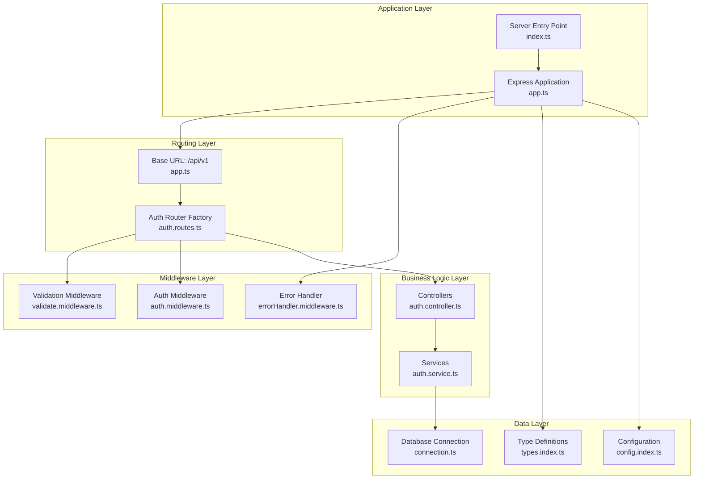
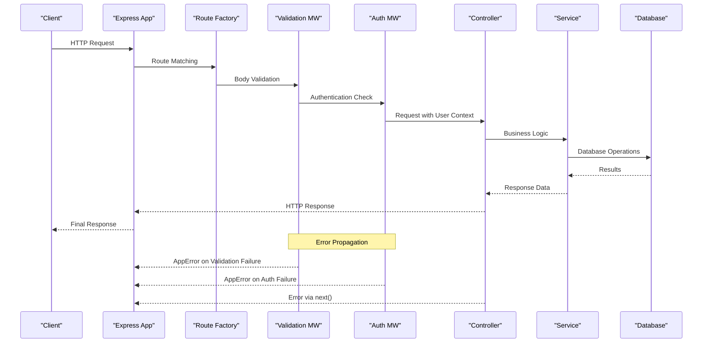
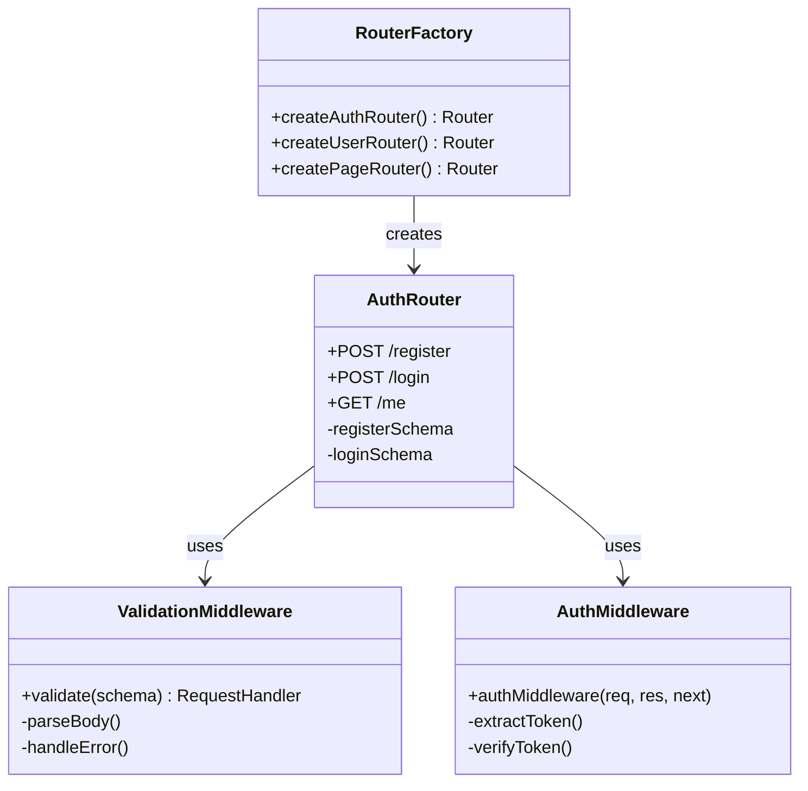
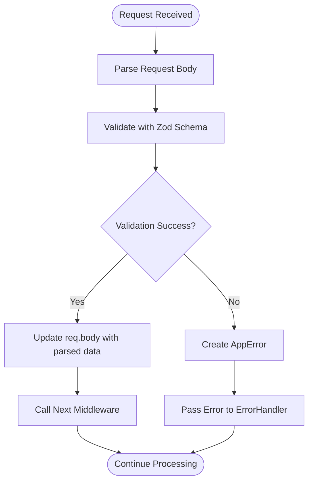
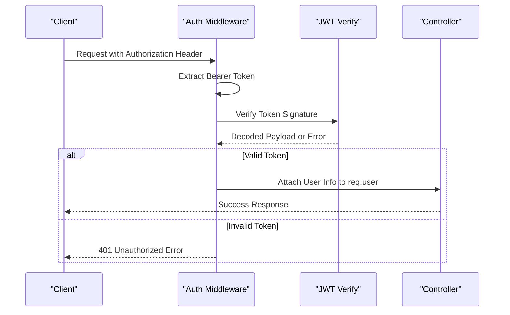
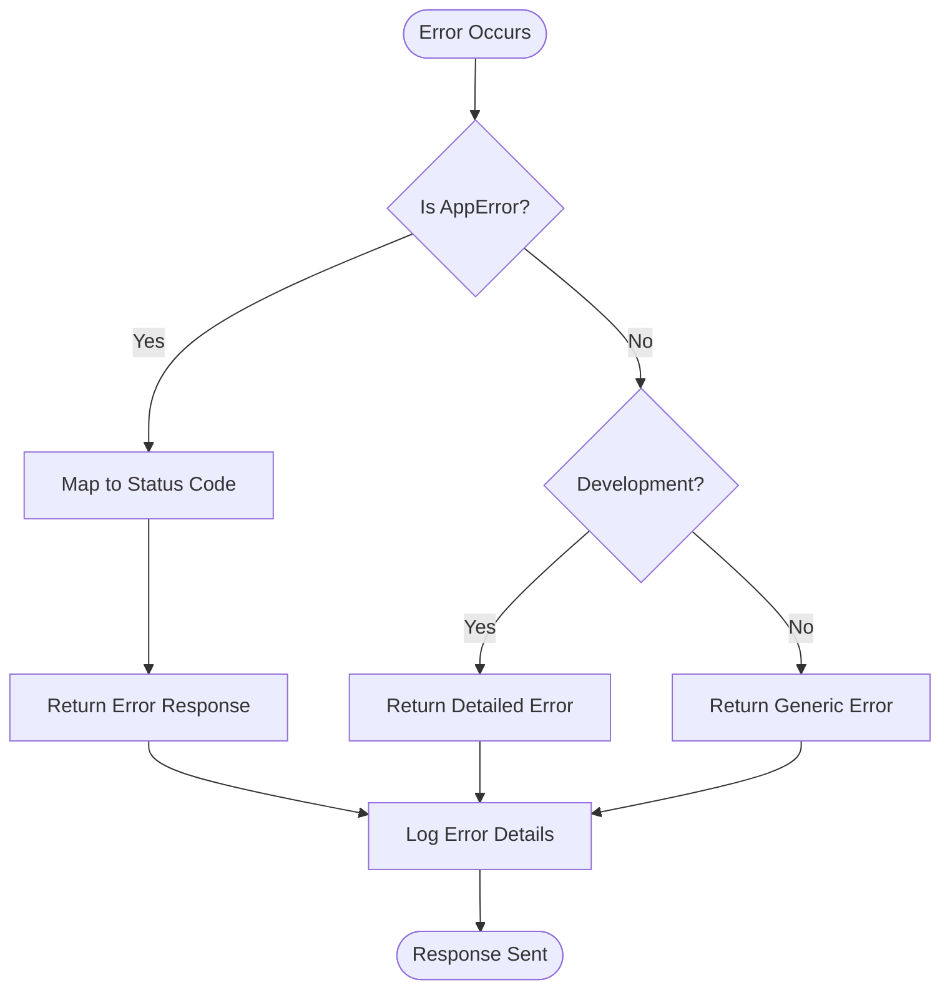
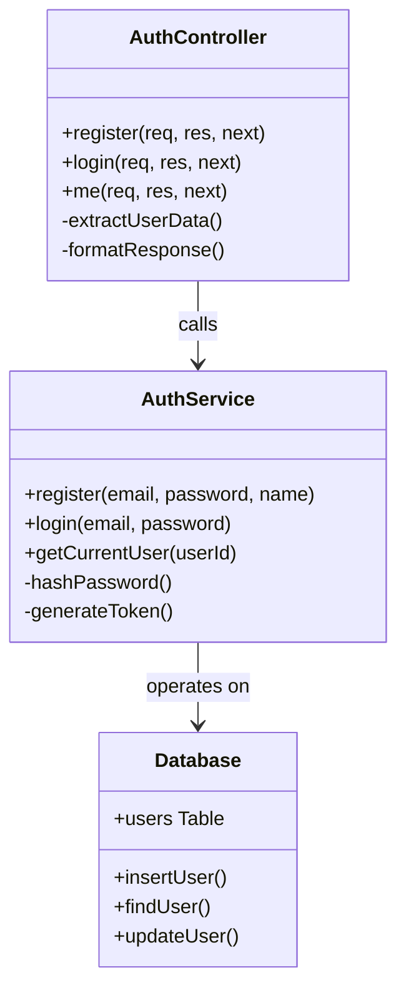
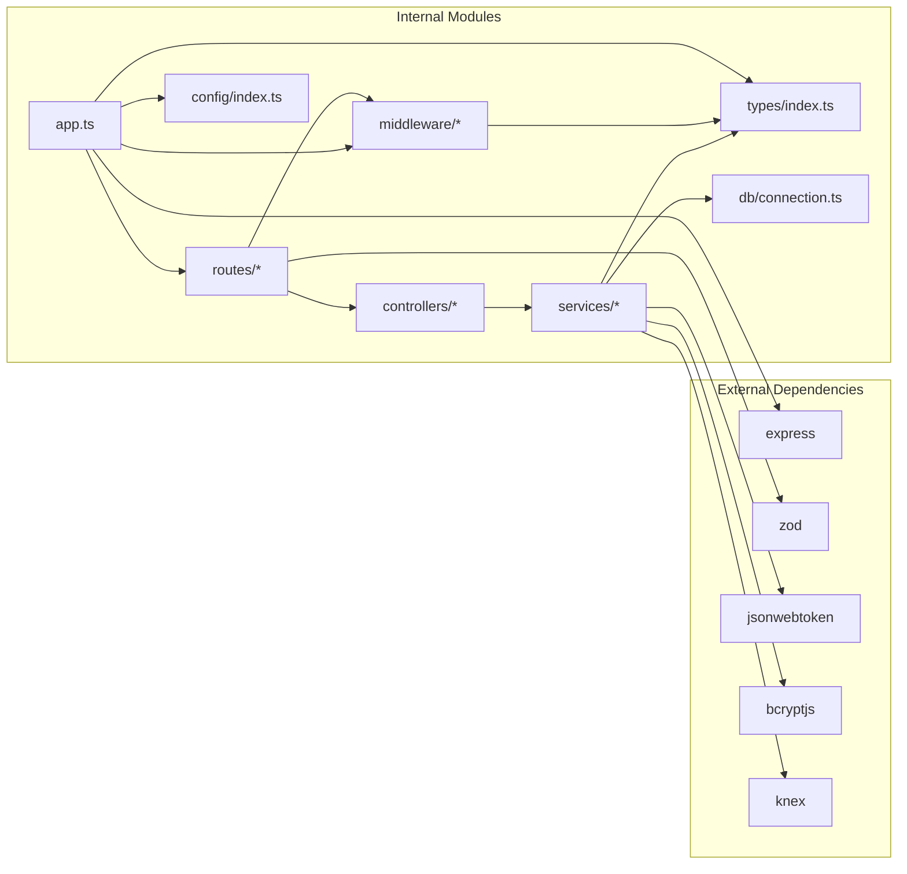

# Routing System

<cite>
**Referenced Files in This Document**
- [app.ts](file://code/server/src/app.ts)
- [index.ts](file://code/server/src/index.ts)
- [auth.routes.ts](file://code/server/src/routes/auth.routes.ts)
- [auth.controller.ts](file://code/server/src/controllers/auth.controller.ts)
- [auth.middleware.ts](file://code/server/src/middleware/auth.ts)
- [validate.middleware.ts](file://code/server/src/middleware/validate.ts)
- [errorHandler.middleware.ts](file://code/server/src/middleware/errorHandler.ts)
- [auth.service.ts](file://code/server/src/services/auth.service.ts)
- [types.index.ts](file://code/server/src/types/index.ts)
- [config.index.ts](file://code/server/src/config/index.ts)
- [connection.ts](file://code/server/src/db/connection.ts)
- [API-SPEC.md](file://api-spec/API-SPEC.md)
</cite>

## Table of Contents
1. [Introduction](#introduction)
2. [Project Structure](#project-structure)
3. [Core Components](#core-components)
4. [Architecture Overview](#architecture-overview)
5. [Detailed Component Analysis](#detailed-component-analysis)
6. [Dependency Analysis](#dependency-analysis)
7. [Performance Considerations](#performance-considerations)
8. [Troubleshooting Guide](#troubleshooting-guide)
9. [Conclusion](#conclusion)

## Introduction
This document provides comprehensive documentation for the Express routing system architecture used in the Yule Notion application. The routing system follows a modular pattern with factory functions for route creation, centralized base URL structure (/api/v1/), and a clear separation of concerns across middleware, controllers, and services. The system emphasizes security, validation, error handling, and performance optimization while maintaining clean separation between authentication, validation, and business logic.

## Project Structure
The routing system is organized around a modular architecture with clear boundaries between concerns:

**Diagram sources**
- [app.ts:101-121](file://code/server/src/app.ts#L101-L121)
- [auth.routes.ts:20-106](file://code/server/src/routes/auth.routes.ts#L20-L106)
- [auth.controller.ts:13-82](file://code/server/src/controllers/auth.controller.ts#L13-L82)
- [auth.service.ts:12-166](file://code/server/src/services/auth.service.ts#L12-L166)

**Section sources**
- [app.ts:1-121](file://code/server/src/app.ts#L1-L121)
- [index.ts:1-77](file://code/server/src/index.ts#L1-L77)

## Core Components
The routing system consists of several key components that work together to provide a robust and secure API:

### Route Organization Pattern
The system uses factory functions for modular route creation, exemplified by `createAuthRouter()`. This pattern provides several benefits:
- Encapsulation of route definitions within dedicated modules
- Clear separation of concerns between route configuration and application setup
- Reusability across different environments and configurations
- Testability through isolated module boundaries

### Base URL Structure and Versioning
The application follows a strict base URL structure with explicit versioning:
- Base URL: `/api/v1/`
- Versioning strategy: Single version endpoint with clear version identifier
- Consistent path structure across all modules

### Middleware Integration
The system implements a layered middleware architecture:
- Security middleware (Helmet, CORS)
- Request parsing and rate limiting
- Authentication and authorization
- Validation and error handling
- Logging and monitoring

**Section sources**
- [auth.routes.ts:20-106](file://code/server/src/routes/auth.routes.ts#L20-L106)
- [app.ts:101-121](file://code/server/src/app.ts#L101-L121)
- [API-SPEC.md:16](file://api-spec/API-SPEC.md#L16)

## Architecture Overview
The routing system follows a layered architecture pattern with clear separation of concerns:

**Diagram sources**
- [app.ts:65-121](file://code/server/src/app.ts#L65-L121)
- [auth.routes.ts:72-102](file://code/server/src/routes/auth.routes.ts#L72-L102)
- [auth.controller.ts:26-81](file://code/server/src/controllers/auth.controller.ts#L26-L81)
- [auth.service.ts:68-165](file://code/server/src/services/auth.service.ts#L68-L165)

## Detailed Component Analysis

### Route Factory Pattern Implementation
The `createAuthRouter()` function demonstrates the factory pattern for route creation:

**Diagram sources**
- [auth.routes.ts:20-106](file://code/server/src/routes/auth.routes.ts#L20-L106)
- [validate.middleware.ts:31-72](file://code/server/src/middleware/validate.ts#L31-L72)
- [auth.middleware.ts:29-60](file://code/server/src/middleware/auth.ts#L29-L60)

#### Route Registration Patterns
Routes are registered using the factory pattern with specific patterns:

**Route Definition Pattern:**
- Each route module exports a factory function
- Routes are mounted under `/api/v1/{module}`
- Individual routes define HTTP methods, paths, and middleware chains

**Parameter Handling:**
- Request body validation using Zod schemas
- Path parameters extracted automatically by Express
- Query parameters handled through standard Express request object

**Middleware Attachment:**
- Route-specific validation middleware
- Global authentication middleware for protected routes
- Error handling middleware attached globally

**Section sources**
- [auth.routes.ts:72-102](file://code/server/src/routes/auth.routes.ts#L72-L102)
- [app.ts:107](file://code/server/src/app.ts#L107)

### Validation Middleware Integration
The validation middleware provides comprehensive request body validation:

**Diagram sources**
- [validate.middleware.ts:44-70](file://code/server/src/middleware/validate.ts#L44-L70)

#### Validation Schema Design
The validation system uses Zod schemas with specific design patterns:
- Strong typing for request bodies
- Comprehensive validation rules
- Detailed error reporting with field-level information
- Automatic data transformation and sanitization

**Section sources**
- [validate.middleware.ts:15-72](file://code/server/src/middleware/validate.ts#L15-L72)
- [auth.routes.ts:35-66](file://code/server/src/routes/auth.routes.ts#L35-L66)

### Authentication and Authorization
The authentication system implements JWT-based authentication with comprehensive error handling:

**Diagram sources**
- [auth.middleware.ts:29-60](file://code/server/src/middleware/auth.ts#L29-L60)

#### Security Features
The authentication system includes multiple security measures:
- JWT token verification with expiration handling
- Token format validation (Bearer scheme)
- Error handling for expired and invalid tokens
- Type-safe user information injection

**Section sources**
- [auth.middleware.ts:16-60](file://code/server/src/middleware/auth.ts#L16-L60)
- [types.index.ts:153-187](file://code/server/src/types/index.ts#L153-L187)

### Error Propagation and Handling
The error handling system provides consistent error responses across the application:

**Diagram sources**
- [errorHandler.middleware.ts:29-67](file://code/server/src/middleware/errorHandler.ts#L29-L67)

#### Error Handling Strategy
The error handling system implements a two-tier approach:
- Known business errors (AppError) with predefined status codes
- Unknown server errors with generic messages in production
- Detailed logging for debugging and monitoring
- Consistent error response format across all endpoints

**Section sources**
- [errorHandler.middleware.ts:18-67](file://code/server/src/middleware/errorHandler.ts#L18-L67)
- [types.index.ts:117-168](file://code/server/src/types/index.ts#L117-L168)

### Controller-Service Integration
The controller-service pattern ensures clean separation of concerns:

**Diagram sources**
- [auth.controller.ts:26-81](file://code/server/src/controllers/auth.controller.ts#L26-L81)
- [auth.service.ts:68-165](file://code/server/src/services/auth.service.ts#L68-L165)

#### Integration Benefits
The controller-service pattern provides:
- Clear separation between HTTP handling and business logic
- Testable business logic independent of HTTP framework
- Reusable services across different controllers
- Consistent error handling through the AppError system

**Section sources**
- [auth.controller.ts:13-82](file://code/server/src/controllers/auth.controller.ts#L13-L82)
- [auth.service.ts:12-166](file://code/server/src/services/auth.service.ts#L12-L166)

## Dependency Analysis
The routing system exhibits strong modularity with clear dependency relationships:

**Diagram sources**
- [app.ts:9-17](file://code/server/src/app.ts#L9-L17)
- [auth.routes.ts:10-14](file://code/server/src/routes/auth.routes.ts#L10-L14)
- [auth.controller.ts:14](file://code/server/src/controllers/auth.controller.ts#L14)
- [auth.service.ts:12-17](file://code/server/src/services/auth.service.ts#L12-L17)

### Dependency Management
The system manages dependencies through:
- Centralized imports in main application file
- Modular exports from route factories
- Shared type definitions across modules
- Configuration-driven dependency injection

**Section sources**
- [app.ts:16-17](file://code/server/src/app.ts#L16-L17)
- [auth.routes.ts:10-14](file://code/server/src/routes/auth.routes.ts#L10-L14)

## Performance Considerations
The routing system incorporates several performance optimization techniques:

### Middleware Order Optimization
The middleware stack is carefully ordered for optimal performance:
1. Security headers (Helmet) - minimal overhead
2. CORS configuration - early rejection of cross-origin requests
3. JSON parsing - efficient request body processing
4. Rate limiting - protects against abuse
5. Request logging - structured logging with minimal impact
6. Route processing - specific route handlers
7. Error handling - centralized error processing

### Route Matching Efficiency
- Specific route patterns prevent unnecessary wildcard matching
- Modular router architecture reduces route table size
- Factory pattern enables lazy loading of route modules
- Consistent path structure improves cache efficiency

### Memory and Resource Management
- Database connections managed through Knex connection pooling
- JWT verification cached for performance
- Validation schemas compiled once during module initialization
- Proper cleanup of resources during graceful shutdown

**Section sources**
- [app.ts:67-121](file://code/server/src/app.ts#L67-L121)
- [connection.ts:22-39](file://code/server/src/db/connection.ts#L22-L39)

## Troubleshooting Guide

### Common Issues and Solutions

#### Authentication Failures
**Symptoms:** 401 Unauthorized responses on protected routes
**Causes:**
- Missing or malformed Authorization header
- Expired JWT tokens
- Invalid token signatures
- Incorrect token format (missing Bearer prefix)

**Solutions:**
- Verify Authorization header format: `Bearer <token>`
- Check token expiration and regenerate if needed
- Validate JWT secret configuration
- Ensure proper token issuance and storage

#### Validation Errors
**Symptoms:** 400 Validation Error responses
**Causes:**
- Invalid request body structure
- Missing required fields
- Field format violations
- Data type mismatches

**Solutions:**
- Review API specification for required fields
- Validate request body against Zod schemas
- Check field constraints and formats
- Use API testing tools to validate requests

#### Database Connection Issues
**Symptoms:** 500 Internal Server Error with database errors
**Causes:**
- Invalid database connection string
- Network connectivity problems
- Database server unavailability
- Connection pool exhaustion

**Solutions:**
- Verify DATABASE_URL configuration
- Check network connectivity to database
- Monitor database server health
- Adjust connection pool settings

#### Performance Issues
**Symptoms:** Slow response times or timeout errors
**Causes:**
- Database query performance issues
- Missing indexes on frequently queried columns
- High memory usage in controllers
- Insufficient rate limiting configuration

**Solutions:**
- Analyze slow database queries
- Add appropriate database indexes
- Optimize controller logic and database operations
- Review and adjust rate limiting settings

**Section sources**
- [auth.middleware.ts:33-58](file://code/server/src/middleware/auth.ts#L33-L58)
- [validate.middleware.ts:50-69](file://code/server/src/middleware/validate.ts#L50-L69)
- [errorHandler.middleware.ts:29-67](file://code/server/src/middleware/errorHandler.ts#L29-L67)

### Debugging Strategies
1. **Enable detailed logging** in development environment
2. **Use structured error responses** for consistent debugging
3. **Monitor middleware execution order** for performance analysis
4. **Test individual components** using isolated unit tests
5. **Validate API compliance** against the specification document

## Conclusion
The Express routing system architecture demonstrates best practices in modern web application development. The modular factory pattern, comprehensive validation system, robust error handling, and security-focused middleware design create a maintainable and scalable foundation. The clear separation of concerns between routing, validation, authentication, controllers, and services ensures that each component has a single responsibility and can be tested independently.

Key strengths of the architecture include:
- **Modular Design:** Factory functions enable clean separation and reusability
- **Security Focus:** Comprehensive middleware stack protects against common vulnerabilities
- **Type Safety:** Extensive use of TypeScript and Zod ensures runtime safety
- **Performance Optimization:** Careful middleware ordering and resource management
- **Maintainability:** Clear patterns and consistent error handling reduce technical debt

The system provides a solid foundation for future feature additions while maintaining backward compatibility through the versioned base URL structure. The comprehensive error handling and logging infrastructure ensures reliable operation in production environments.