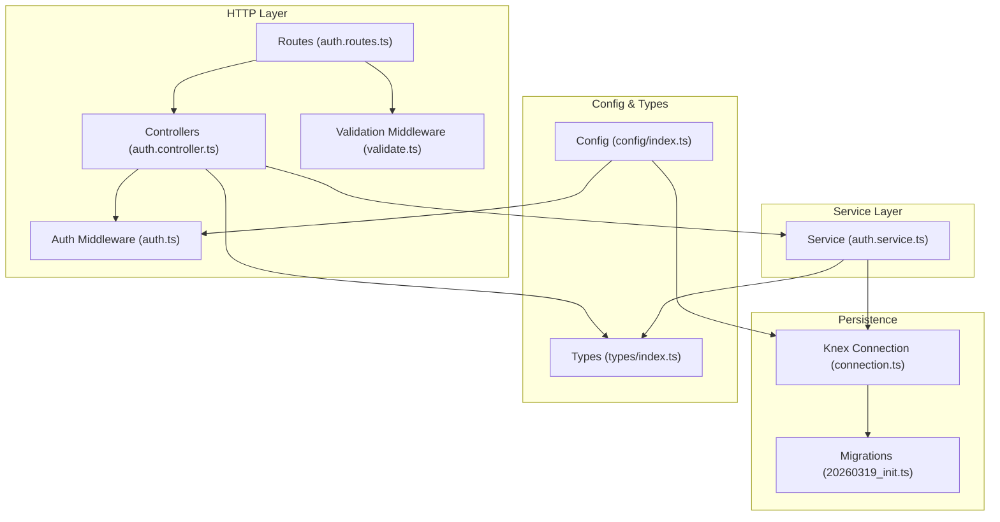
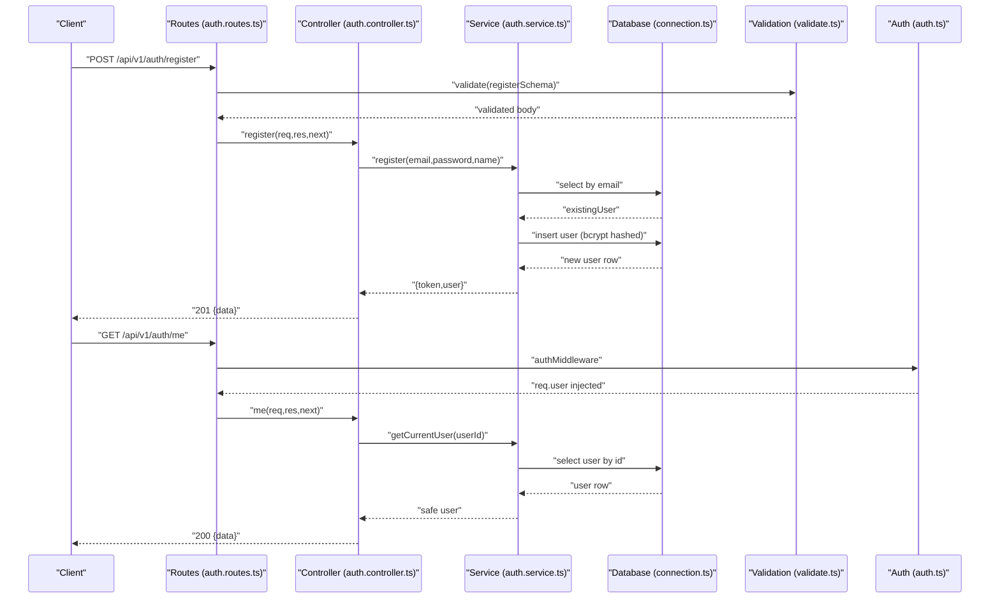
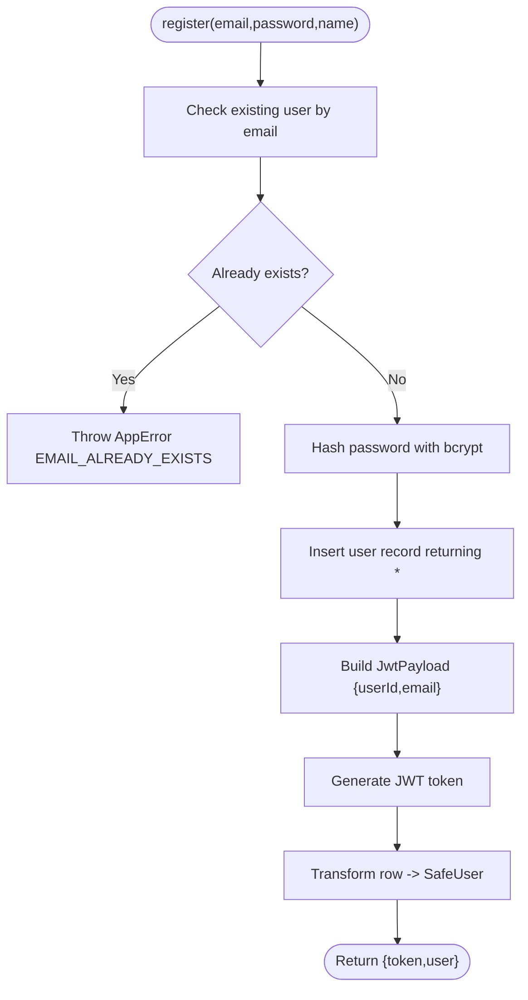
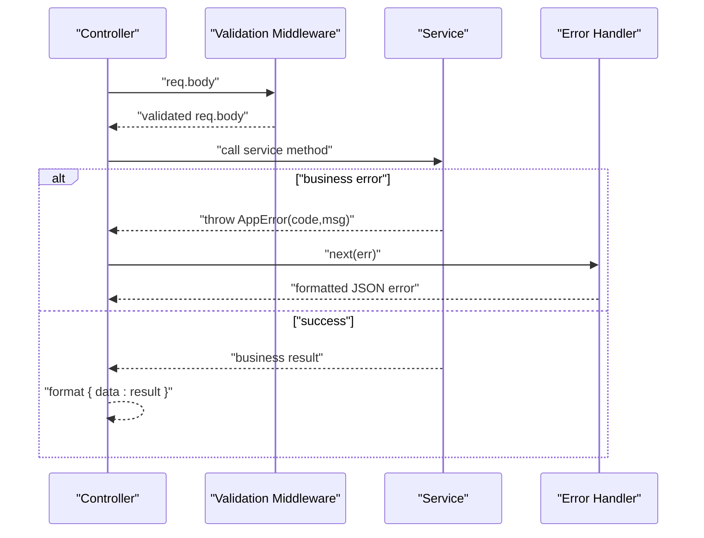
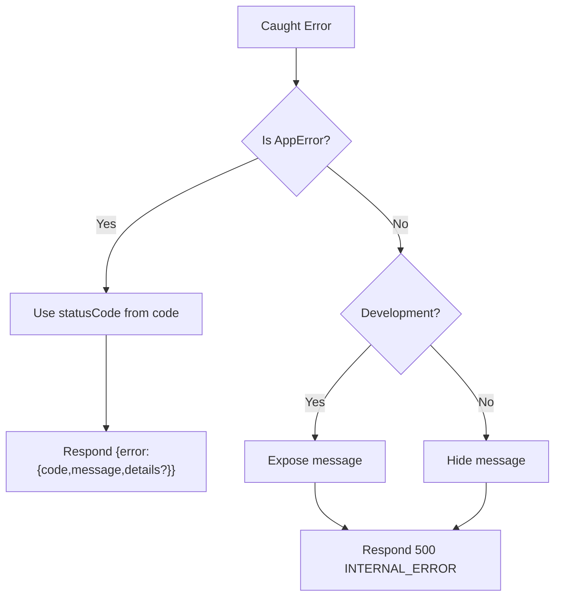
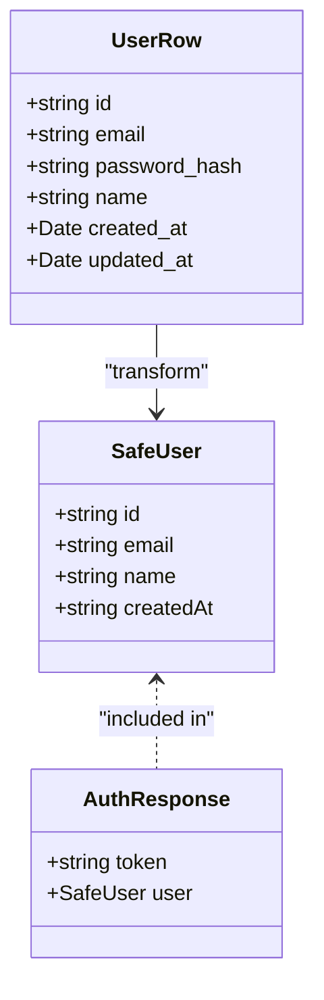
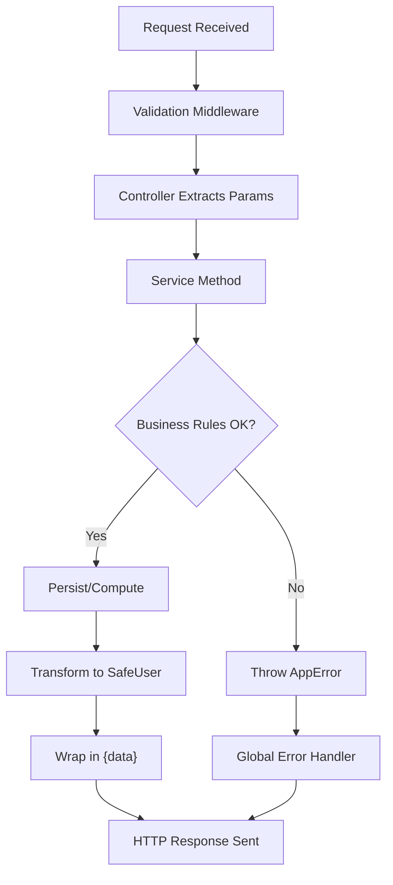
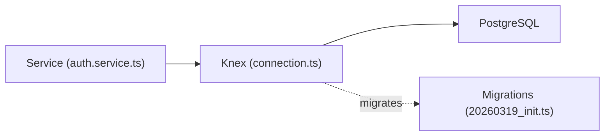
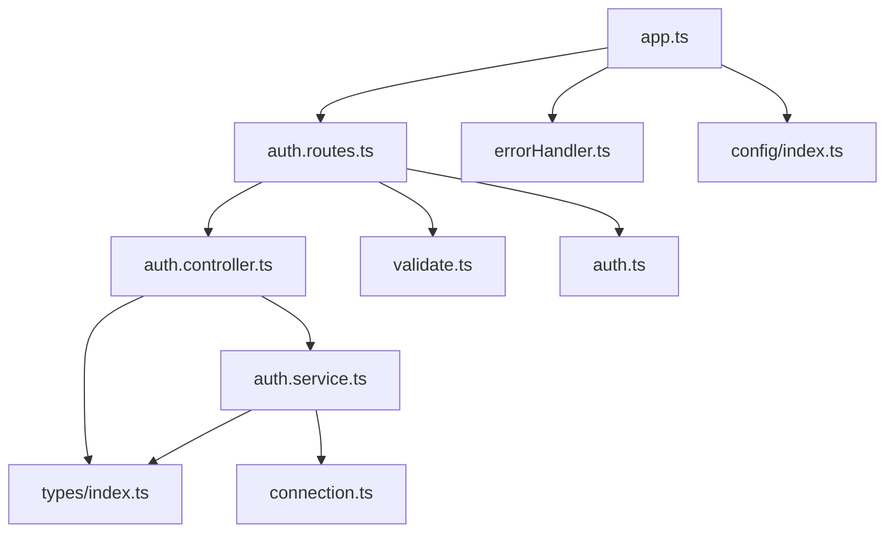

# Services Layer

<cite>
**Referenced Files in This Document**
- [auth.service.ts](file://code/server/src/services/auth.service.ts)
- [auth.controller.ts](file://code/server/src/controllers/auth.controller.ts)
- [auth.routes.ts](file://code/server/src/routes/auth.routes.ts)
- [auth.ts](file://code/server/src/middleware/auth.ts)
- [validate.ts](file://code/server/src/middleware/validate.ts)
- [errorHandler.ts](file://code/server/src/middleware/errorHandler.ts)
- [connection.ts](file://code/server/src/db/connection.ts)
- [20260319_init.ts](file://code/server/src/db/migrations/20260319_init.ts)
- [index.ts](file://code/server/src/index.ts)
- [app.ts](file://code/server/src/app.ts)
- [index.ts](file://code/server/src/config/index.ts)
- [index.ts](file://code/server/src/types/index.ts)
- [auth.service.ts](file://code/client/src/services/auth.service.ts)
</cite>

## Table of Contents
1. [Introduction](#introduction)
2. [Project Structure](#project-structure)
3. [Core Components](#core-components)
4. [Architecture Overview](#architecture-overview)
5. [Detailed Component Analysis](#detailed-component-analysis)
6. [Dependency Analysis](#dependency-analysis)
7. [Performance Considerations](#performance-considerations)
8. [Troubleshooting Guide](#troubleshooting-guide)
9. [Conclusion](#conclusion)
10. [Appendices](#appendices)

## Introduction
This document explains the service layer architecture and business logic implementation for the authentication domain. It focuses on the service pattern with dependency injection, transaction management, business rule enforcement, method design patterns, error handling strategies, and data transformation across layers. It also documents the service lifecycle from input validation, business execution, to output formatting, and covers testing approaches, mocking strategies, and performance considerations.

## Project Structure
The backend follows a layered architecture:
- Routes define endpoints and wire middleware.
- Controllers handle HTTP concerns and delegate to services.
- Services encapsulate business logic, enforce rules, and coordinate database operations.
- Middleware handles cross-cutting concerns like validation, authentication, and error handling.
- Database layer uses Knex with a shared connection and migrations.

**Diagram sources**
- [auth.routes.ts:1-106](file://code/server/src/routes/auth.routes.ts#L1-L106)
- [auth.controller.ts:1-82](file://code/server/src/controllers/auth.controller.ts#L1-L82)
- [validate.ts:1-72](file://code/server/src/middleware/validate.ts#L1-L72)
- [auth.ts:1-60](file://code/server/src/middleware/auth.ts#L1-L60)
- [auth.service.ts:1-166](file://code/server/src/services/auth.service.ts#L1-L166)
- [connection.ts:1-40](file://code/server/src/db/connection.ts#L1-L40)
- [20260319_init.ts:1-300](file://code/server/src/db/migrations/20260319_init.ts#L1-L300)
- [index.ts:1-101](file://code/server/src/config/index.ts#L1-L101)
- [index.ts:1-187](file://code/server/src/types/index.ts#L1-L187)

**Section sources**
- [auth.routes.ts:1-106](file://code/server/src/routes/auth.routes.ts#L1-L106)
- [auth.controller.ts:1-82](file://code/server/src/controllers/auth.controller.ts#L1-L82)
- [auth.service.ts:1-166](file://code/server/src/services/auth.service.ts#L1-L166)
- [connection.ts:1-40](file://code/server/src/db/connection.ts#L1-L40)
- [20260319_init.ts:1-300](file://code/server/src/db/migrations/20260319_init.ts#L1-L300)
- [index.ts:1-101](file://code/server/src/config/index.ts#L1-L101)
- [index.ts:1-187](file://code/server/src/types/index.ts#L1-L187)

## Core Components
- Service: Encapsulates business logic for registration, login, and current user retrieval. Handles encryption, token generation, and safe data transformation.
- Controller: Thin HTTP handler that extracts inputs, calls service methods, and formats responses.
- Routes: Define endpoint contracts, apply validation middleware, and attach auth middleware where required.
- Validation Middleware: Enforces strict request body validation using Zod and converts errors to AppError.
- Auth Middleware: Validates JWT tokens and injects user info into requests.
- Error Handler: Centralizes error response formatting and logging.
- Database: Shared Knex connection with migrations defining schema and constraints.
- Config & Types: Strongly typed configuration and shared interfaces/enums.

Key responsibilities:
- Service enforces business rules (unique email, password strength, valid credentials).
- Data transformation ensures sensitive fields are excluded from API responses.
- Error propagation uses AppError with standardized codes mapped to HTTP statuses.

**Section sources**
- [auth.service.ts:1-166](file://code/server/src/services/auth.service.ts#L1-L166)
- [auth.controller.ts:1-82](file://code/server/src/controllers/auth.controller.ts#L1-L82)
- [auth.routes.ts:1-106](file://code/server/src/routes/auth.routes.ts#L1-L106)
- [validate.ts:1-72](file://code/server/src/middleware/validate.ts#L1-L72)
- [auth.ts:1-60](file://code/server/src/middleware/auth.ts#L1-L60)
- [errorHandler.ts:1-68](file://code/server/src/middleware/errorHandler.ts#L1-L68)
- [connection.ts:1-40](file://code/server/src/db/connection.ts#L1-L40)
- [index.ts:1-187](file://code/server/src/types/index.ts#L1-L187)

## Architecture Overview
The service layer sits between controllers and the database. Controllers depend on services via module imports. Services depend on the database connection and configuration. Validation and auth middleware are wired at the route level to keep controllers clean.

**Diagram sources**
- [auth.routes.ts:1-106](file://code/server/src/routes/auth.routes.ts#L1-L106)
- [auth.controller.ts:1-82](file://code/server/src/controllers/auth.controller.ts#L1-L82)
- [auth.service.ts:1-166](file://code/server/src/services/auth.service.ts#L1-L166)
- [connection.ts:1-40](file://code/server/src/db/connection.ts#L1-L40)
- [validate.ts:1-72](file://code/server/src/middleware/validate.ts#L1-L72)
- [auth.ts:1-60](file://code/server/src/middleware/auth.ts#L1-L60)

## Detailed Component Analysis

### Service Pattern and Business Logic
- Dependency Injection: Services import the database connection and configuration directly. This is a simple DI approach suitable for small services. For larger systems, consider injecting dependencies via constructors or factories.
- Transaction Management: The current service does not wrap operations in explicit transactions. Registration performs a read-then-write that could race. Consider wrapping write operations in a transaction to ensure atomicity.
- Business Rule Enforcement:
  - Unique email check prevents duplicates.
  - Password hashing with bcrypt and strict validation.
  - Token generation with expiration configured via environment.
  - Safe user transformation strips sensitive fields and normalizes date serialization.

**Diagram sources**
- [auth.service.ts:68-101](file://code/server/src/services/auth.service.ts#L68-L101)

**Section sources**
- [auth.service.ts:1-166](file://code/server/src/services/auth.service.ts#L1-L166)
- [index.ts:1-101](file://code/server/src/config/index.ts#L1-L101)
- [index.ts:1-187](file://code/server/src/types/index.ts#L1-L187)

### Method Design Patterns
- Input Extraction: Controllers extract strongly-typed bodies and pass to services.
- Validation: Routes apply Zod schemas; validation middleware parses and normalizes errors into AppError.
- Error Propagation: Services throw AppError with codes; controllers forward to next; global error handler formats responses.
- Data Transformation: Service converts database rows to SafeUser, ensuring sensitive fields are omitted and dates are serialized consistently.

**Diagram sources**
- [auth.controller.ts:1-82](file://code/server/src/controllers/auth.controller.ts#L1-L82)
- [validate.ts:1-72](file://code/server/src/middleware/validate.ts#L1-L72)
- [errorHandler.ts:1-68](file://code/server/src/middleware/errorHandler.ts#L1-L68)
- [auth.service.ts:1-166](file://code/server/src/services/auth.service.ts#L1-L166)

**Section sources**
- [auth.controller.ts:1-82](file://code/server/src/controllers/auth.controller.ts#L1-L82)
- [validate.ts:1-72](file://code/server/src/middleware/validate.ts#L1-L72)
- [errorHandler.ts:1-68](file://code/server/src/middleware/errorHandler.ts#L1-L68)
- [auth.service.ts:1-166](file://code/server/src/services/auth.service.ts#L1-L166)

### Error Handling Strategies
- AppError: Centralized error type with code and mapped HTTP status.
- Validation Errors: Converted to VALIDATION_ERROR with field-level details.
- Authentication Errors: UNAUTHORIZED/TOKEN_EXPIRED mapped appropriately.
- Unknown Errors: Internal server error with optional dev message exposure.
- Logging: Structured logs capture request context and error metadata.

**Diagram sources**
- [errorHandler.ts:28-67](file://code/server/src/middleware/errorHandler.ts#L28-L67)
- [index.ts:117-130](file://code/server/src/types/index.ts#L117-L130)

**Section sources**
- [errorHandler.ts:1-68](file://code/server/src/middleware/errorHandler.ts#L1-L68)
- [index.ts:117-130](file://code/server/src/types/index.ts#L117-L130)

### Data Transformation Between Layers
- Database Row: Full user entity including password hash.
- Safe User: Public representation excluding sensitive fields and serializing dates.
- API Response: Wraps data in a consistent envelope for controllers to send.

**Diagram sources**
- [index.ts:16-42](file://code/server/src/types/index.ts#L16-L42)
- [auth.service.ts:29-38](file://code/server/src/services/auth.service.ts#L29-L38)

**Section sources**
- [auth.service.ts:29-38](file://code/server/src/services/auth.service.ts#L29-L38)
- [index.ts:16-42](file://code/server/src/types/index.ts#L16-L42)

### Service Lifecycle: Input Validation → Business Execution → Output Formatting
- Input Validation: Zod schemas validate and normalize request bodies; errors are standardized.
- Business Execution: Service methods perform checks, hashing, persistence, and token generation.
- Output Formatting: Responses are wrapped and safe user data is returned.

**Diagram sources**
- [auth.routes.ts:1-106](file://code/server/src/routes/auth.routes.ts#L1-L106)
- [auth.controller.ts:1-82](file://code/server/src/controllers/auth.controller.ts#L1-L82)
- [auth.service.ts:1-166](file://code/server/src/services/auth.service.ts#L1-L166)
- [errorHandler.ts:1-68](file://code/server/src/middleware/errorHandler.ts#L1-L68)

**Section sources**
- [auth.routes.ts:1-106](file://code/server/src/routes/auth.routes.ts#L1-L106)
- [auth.controller.ts:1-82](file://code/server/src/controllers/auth.controller.ts#L1-L82)
- [auth.service.ts:1-166](file://code/server/src/services/auth.service.ts#L1-L166)

### Examples of Service Method Implementation
- Registration: Checks uniqueness, hashes password, inserts user, generates token, returns safe user.
- Login: Finds user, compares password, generates token, returns safe user.
- Get Current User: Reads user by ID and returns safe user.

Implementation references:
- [register:68-101](file://code/server/src/services/auth.service.ts#L68-L101)
- [login:117-143](file://code/server/src/services/auth.service.ts#L117-L143)
- [getCurrentUser:155-165](file://code/server/src/services/auth.service.ts#L155-L165)

**Section sources**
- [auth.service.ts:68-165](file://code/server/src/services/auth.service.ts#L68-L165)

### Integration with Database Layer
- Knex Connection: Global singleton with pooling; used directly by services.
- Migrations: Define schema, indexes, constraints, and triggers for robust data integrity.
- Graceful Shutdown: Ensures connections are closed during process termination.

**Diagram sources**
- [auth.service.ts:14](file://code/server/src/services/auth.service.ts#L14)
- [connection.ts:22-29](file://code/server/src/db/connection.ts#L22-L29)
- [20260319_init.ts:17-300](file://code/server/src/db/migrations/20260319_init.ts#L17-L300)

**Section sources**
- [auth.service.ts:14](file://code/server/src/services/auth.service.ts#L14)
- [connection.ts:1-40](file://code/server/src/db/connection.ts#L1-L40)
- [20260319_init.ts:1-300](file://code/server/src/db/migrations/20260319_init.ts#L1-L300)

### Service Testing Approaches and Mocking Strategies
Recommended strategies:
- Mock Database: Replace the Knex instance with a mock/fake adapter to isolate unit tests.
- Stub Dependencies: Inject config and crypto libraries via dependency injection for deterministic tests.
- Test Scenarios:
  - Registration: Duplicate email, invalid password, successful registration.
  - Login: Nonexistent user, wrong password, successful login.
  - Current User: Existing user ID, missing user ID.
- Assertions: Verify thrown AppError codes, response shapes, and logged events.

[No sources needed since this section provides general guidance]

### Client-Server Contract Alignment
- Client service methods call backend endpoints and unwrap the { data } envelope.
- Backend routes and controllers maintain consistent response envelopes.

References:
- [Client auth service:18-45](file://code/client/src/services/auth.service.ts#L18-L45)
- [Backend controller responses:26-81](file://code/server/src/controllers/auth.controller.ts#L26-L81)

**Section sources**
- [auth.controller.ts:26-81](file://code/server/src/controllers/auth.controller.ts#L26-L81)
- [auth.service.ts:1-166](file://code/server/src/services/auth.service.ts#L1-L166)
- [auth.service.ts:1-46](file://code/client/src/services/auth.service.ts#L1-L46)

## Dependency Analysis
- Controllers depend on services and types.
- Services depend on database connection and configuration.
- Routes depend on controllers, validation, and auth middleware.
- Error handler depends on types and logging infrastructure.
- Application wiring registers middlewares and routes.

**Diagram sources**
- [auth.controller.ts:1-82](file://code/server/src/controllers/auth.controller.ts#L1-L82)
- [auth.service.ts:1-166](file://code/server/src/services/auth.service.ts#L1-L166)
- [auth.routes.ts:1-106](file://code/server/src/routes/auth.routes.ts#L1-L106)
- [validate.ts:1-72](file://code/server/src/middleware/validate.ts#L1-L72)
- [auth.ts:1-60](file://code/server/src/middleware/auth.ts#L1-L60)
- [errorHandler.ts:1-68](file://code/server/src/middleware/errorHandler.ts#L1-L68)
- [app.ts:1-121](file://code/server/src/app.ts#L1-L121)
- [index.ts:1-101](file://code/server/src/config/index.ts#L1-L101)
- [index.ts:1-187](file://code/server/src/types/index.ts#L1-L187)
- [connection.ts:1-40](file://code/server/src/db/connection.ts#L1-L40)

**Section sources**
- [auth.controller.ts:1-82](file://code/server/src/controllers/auth.controller.ts#L1-L82)
- [auth.service.ts:1-166](file://code/server/src/services/auth.service.ts#L1-L166)
- [auth.routes.ts:1-106](file://code/server/src/routes/auth.routes.ts#L1-L106)
- [validate.ts:1-72](file://code/server/src/middleware/validate.ts#L1-L72)
- [auth.ts:1-60](file://code/server/src/middleware/auth.ts#L1-L60)
- [errorHandler.ts:1-68](file://code/server/src/middleware/errorHandler.ts#L1-L68)
- [app.ts:1-121](file://code/server/src/app.ts#L1-L121)
- [index.ts:1-101](file://code/server/src/config/index.ts#L1-L101)
- [index.ts:1-187](file://code/server/src/types/index.ts#L1-L187)
- [connection.ts:1-40](file://code/server/src/db/connection.ts#L1-L40)

## Performance Considerations
- Database Pooling: Knex pool is configured to balance concurrency and resource usage.
- Indexes: Migrations define indexes for frequent lookups (e.g., users.email).
- JWT Expiration: Controlled via environment to balance security and client refresh overhead.
- Request Size Limits: JSON body size increased to support image uploads.
- Rate Limiting: Global rate limiter protects endpoints from abuse.
- Logging: Structured logging avoids expensive string concatenations.

[No sources needed since this section provides general guidance]

## Troubleshooting Guide
Common issues and resolutions:
- Authentication Failures: Ensure Authorization header uses Bearer token format; verify JWT_SECRET and expiration settings.
- Validation Errors: Confirm request body matches Zod schemas; inspect details array for field-specific messages.
- Resource Not Found: Check user existence by ID; confirm database records and migrations applied.
- Internal Errors: Review structured logs for stack traces; verify environment configuration.

**Section sources**
- [auth.ts:29-59](file://code/server/src/middleware/auth.ts#L29-L59)
- [validate.ts:44-71](file://code/server/src/middleware/validate.ts#L44-L71)
- [errorHandler.ts:29-67](file://code/server/src/middleware/errorHandler.ts#L29-L67)
- [index.ts:117-130](file://code/server/src/types/index.ts#L117-L130)

## Conclusion
The service layer cleanly separates business logic from HTTP concerns, with strong typing, centralized error handling, and clear data transformation. While the current implementation is straightforward and effective, consider adding explicit transactions for critical write paths and adopting dependency injection for improved testability and modularity.

## Appendices
- Environment Variables: Configure port, environment, database URL, JWT secret and expiry, and allowed origins.
- Health Endpoint: Available at GET /api/v1/health for readiness probes.
- Graceful Shutdown: Server closes connections and exits on SIGTERM/SIGINT.

**Section sources**
- [index.ts:16-98](file://code/server/src/config/index.ts#L16-L98)
- [app.ts:102-121](file://code/server/src/app.ts#L102-L121)
- [index.ts:35-52](file://code/server/src/index.ts#L35-L52)