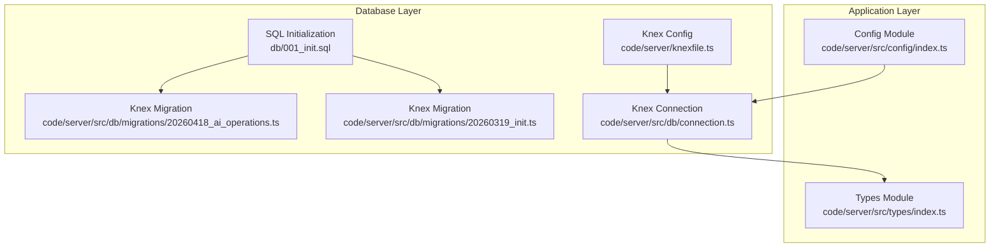
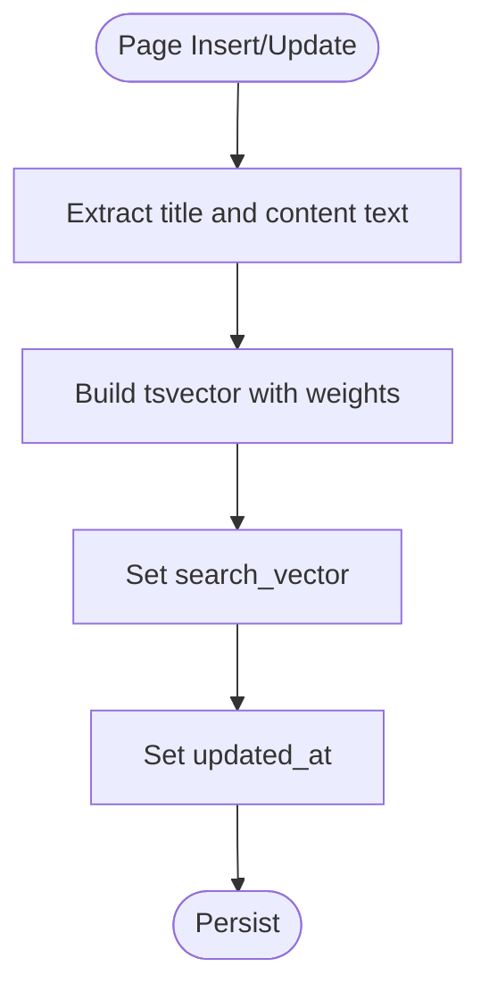
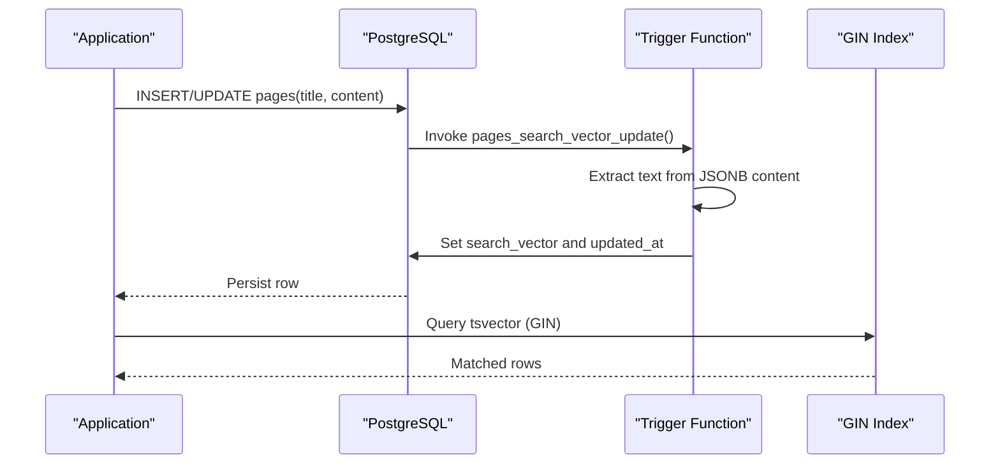
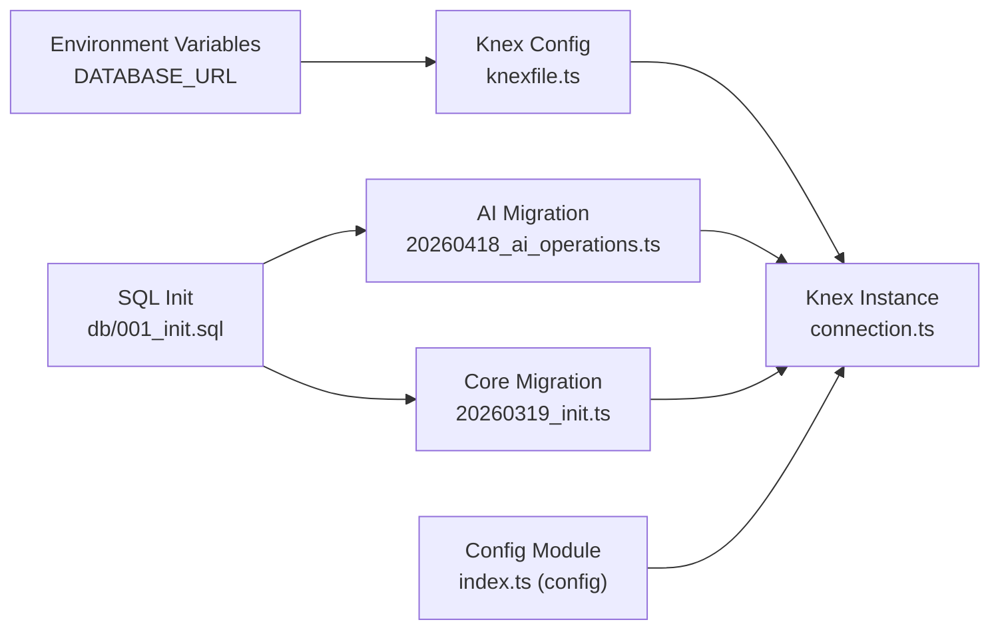

# Database Design

<cite>
**Referenced Files in This Document**
- [001_init.sql](file://db/001_init.sql)
- [20260418_ai_operations.ts](file://code/server/src/db/migrations/20260418_ai_operations.ts)
- [ER-DIAGRAM.md](file://db/ER-DIAGRAM.md)
- [20260319_init.ts](file://code/server/src/db/migrations/20260319_init.ts)
- [knexfile.ts](file://code/server/knexfile.ts)
- [connection.ts](file://code/server/src/db/connection.ts)
- [index.ts (config)](file://code/server/src/config/index.ts)
- [index.ts (types)](file://code/server/src/types/index.ts)
- [2026-04-18-ai-notebook-design.md](file://docs/superpowers/specs/2026-04-18-ai-notebook-design.md)
</cite>

## Update Summary
**Changes Made**
- Added comprehensive documentation for new AI operations database schema
- Documented ai_operations table for tracking AI interactions with users
- Documented ai_usage_limits table for implementing cost controls and monthly limits
- Updated entity relationship diagrams to include AI tables
- Added AI operation tracking and cost management capabilities to the data model
- Enhanced migration system documentation to cover AI schema changes

## Table of Contents
1. [Introduction](#introduction)
2. [Project Structure](#project-structure)
3. [Core Components](#core-components)
4. [Architecture Overview](#architecture-overview)
5. [Detailed Component Analysis](#detailed-component-analysis)
6. [Dependency Analysis](#dependency-analysis)
7. [Performance Considerations](#performance-considerations)
8. [Troubleshooting Guide](#troubleshooting-guide)
9. [Conclusion](#conclusion)
10. [Appendices](#appendices)

## Introduction
This document provides comprehensive data model documentation for the PostgreSQL database schema used by the Yule-Notion application. It details entity relationships among users, pages, tags, uploaded files, and the newly added AI operations tracking system. The schema now includes two new tables - ai_operations for comprehensive AI interaction tracking and ai_usage_limits for implementing cost controls and monthly spending limits. The documentation covers primary keys, foreign keys, constraints, validation rules, and the integration of AI operation tracking with the existing note-taking infrastructure.

## Project Structure
The database design is defined by:
- A canonical SQL initialization script that creates all tables, indexes, constraints, triggers, and comments.
- A Knex.js migration system that manages schema evolution, including the new AI operations tracking tables.
- A Knex configuration file that defines environments and migration directories.
- A shared TypeScript configuration module that supplies the database connection string.
- A connection module that instantiates the Knex client with pooling.



**Diagram sources**
- [001_init.sql:1-254](file://db/001_init.sql#L1-L254)
- [20260418_ai_operations.ts:1-43](file://code/server/src/db/migrations/20260418_ai_operations.ts#L1-L43)
- [20260319_init.ts:1-300](file://code/server/src/db/migrations/20260319_init.ts#L1-L300)
- [knexfile.ts:1-69](file://code/server/knexfile.ts#L1-L69)
- [connection.ts:1-40](file://code/server/src/db/connection.ts#L1-L40)
- [index.ts (config):1-101](file://code/server/src/config/index.ts#L1-L101)
- [index.ts (types):1-187](file://code/server/src/types/index.ts#L1-L187)

**Section sources**
- [001_init.sql:1-254](file://db/001_init.sql#L1-L254)
- [20260418_ai_operations.ts:1-43](file://code/server/src/db/migrations/20260418_ai_operations.ts#L1-L43)
- [20260319_init.ts:1-300](file://code/server/src/db/migrations/20260319_init.ts#L1-L300)
- [knexfile.ts:1-69](file://code/server/knexfile.ts#L1-L69)
- [connection.ts:1-40](file://code/server/src/db/connection.ts#L1-L40)
- [index.ts (config):1-101](file://code/server/src/config/index.ts#L1-L101)
- [index.ts (types):1-187](file://code/server/src/types/index.ts#L1-L187)

## Core Components
This section documents each table's fields, data types, constraints, and comments. It also outlines the JSONB content model for pages, the full-text search strategy, and the new AI operations tracking system.

- Users
  - Purpose: Stores user account information.
  - Primary key: id (UUID).
  - Constraints: Unique email.
  - Indexes: idx_users_email (B-tree).
  - Comments: Descriptive metadata for each column.

- Pages
  - Purpose: Stores page content and hierarchy.
  - Primary key: id (UUID).
  - Foreign keys: user_id -> users.id (ON DELETE CASCADE), parent_id -> pages.id (self-reference, ON DELETE CASCADE).
  - JSONB content: content (TipTap JSONB format).
  - Additional fields: title, icon, order, is_deleted, deleted_at, version (optimistic locking), timestamps.
  - Constraints: order >= 0; version > 0.
  - Indexes: idx_pages_user_id, idx_pages_user_parent (conditional), idx_pages_user_order (conditional), idx_pages_user_updated (conditional), idx_pages_search (GIN tsvector), idx_pages_content (GIN jsonb_path_ops).
  - Comments: Descriptive metadata for each column and trigger behavior.

- Tags
  - Purpose: Allows users to categorize pages.
  - Primary key: id (UUID).
  - Foreign key: user_id -> users.id (ON DELETE CASCADE).
  - Constraints: Unique (user_id, name); color format check (HEX).
  - Indexes: idx_tags_user_id, idx_tags_user_name.
  - Comments: Descriptive metadata for each column.

- Page-Tag Association (page_tags)
  - Purpose: Many-to-many relationship between pages and tags.
  - Composite primary key: (page_id, tag_id).
  - Foreign keys: page_id -> pages.id (ON DELETE CASCADE), tag_id -> tags.id (ON DELETE CASCADE).
  - Index: idx_page_tags_tag_id.
  - Comments: Descriptive metadata for each column.

- Uploaded Files
  - Purpose: Metadata for files uploaded by users.
  - Primary key: id (UUID).
  - Foreign key: user_id -> users.id (ON DELETE CASCADE).
  - Constraints: size > 0 AND size <= 5242880 (bytes).
  - Indexes: idx_files_user_id.
  - Comments: Descriptive metadata for each column.

- Sync Log
  - Purpose: Optional audit trail for synchronization events.
  - Primary key: id (UUID).
  - Foreign keys: user_id -> users.id (ON DELETE CASCADE), page_id -> pages.id (ON DELETE SET NULL).
  - Constraints: sync_type in ('push','pull'); action in ('create','update','delete').
  - Indexes: idx_sync_log_user, idx_sync_log_page.
  - Comments: Descriptive metadata for each column.

- AI Operations Tracking
  - Purpose: Comprehensive tracking of AI interactions with users.
  - Primary key: id (UUID).
  - Foreign keys: user_id -> users.id (ON DELETE CASCADE), page_id -> pages.id (ON DELETE SET NULL).
  - Fields: operation_type (string), input_text (text), output_text (text), tokens_used (integer), cost (decimal), provider (string), model (string), created_at (timestamp).
  - Constraints: operation_type enumeration; tokens_used >= 0; cost >= 0; provider default 'openai'.
  - Indexes: idx_ai_operations_user_id, idx_ai_operations_created_at, idx_ai_operations_page_id.
  - Comments: Enables AI operation history, cost tracking, and usage analytics.

- AI Usage Limits
  - Purpose: Implements cost controls and monthly spending limits.
  - Primary key: id (UUID).
  - Foreign key: user_id -> users.id (ON DELETE CASCADE).
  - Fields: monthly_limit (decimal), current_month_usage (decimal), month (integer), year (integer).
  - Constraints: monthly_limit >= 0; unique constraint on (user_id, month, year); current_month_usage >= 0.
  - Indexes: None (unique constraint provides implicit indexing).
  - Comments: Provides configurable monthly spending limits with automatic tracking.

- JSONB Content Model for Pages
  - The content field stores TipTap-compatible JSONB content with a default empty document structure.
  - A trigger automatically maintains a tsvector search_vector derived from title and extracted text from content.
  - Full-text search uses a GIN index on search_vector and a secondary GIN index on content for JSON queries.

- Indexing Strategy
  - Conditional indexes on is_deleted = FALSE for performance-sensitive queries.
  - Multi-column indexes optimized for user-scoped queries, ordering, and sorting by updated_at.
  - GIN indexes for tsvector and JSONB content enable fast full-text and JSON queries.
  - New AI operation indexes for efficient querying by user, time, and page associations.

**Section sources**
- [001_init.sql:14-158](file://db/001_init.sql#L14-L158)
- [20260418_ai_operations.ts:4-33](file://code/server/src/db/migrations/20260418_ai_operations.ts#L4-L33)
- [20260319_init.ts:25-161](file://code/server/src/db/migrations/20260319_init.ts#L25-L161)
- [ER-DIAGRAM.md:128-144](file://db/ER-DIAGRAM.md#L128-L144)

## Architecture Overview
The database architecture centers around a user-page hierarchy with optional tagging and file attachments, now enhanced with comprehensive AI operations tracking. Pages support a tree-like structure via self-referencing parent_id. Full-text search is enabled through a generated tsvector maintained by a trigger. The schema is version-controlled via Knex migrations, with the new AI tables providing cost tracking and usage analytics capabilities.

```mermaid
erDiagram
USERS {
uuid id PK
string email UK
string password_hash
string name
timestamptz created_at
timestamptz updated_at
}
PAGES {
uuid id PK
uuid user_id FK
string title
jsonb content
uuid parent_id FK
integer order
string icon
boolean is_deleted
timestamptz deleted_at
integer version
timestamptz created_at
timestamptz updated_at
tsvector search_vector
}
TAGS {
uuid id PK
uuid user_id FK
string name
string color
timestamptz created_at
}
PAGE_TAGS {
uuid page_id FK PK
uuid tag_id FK PK
timestamptz created_at
}
UPLOADED_FILES {
uuid id PK
uuid user_id FK
string original_name
string storage_path
string mime_type
integer size
timestamptz created_at
}
SYNC_LOG {
uuid id PK
uuid user_id FK
uuid page_id FK
string sync_type
string action
integer client_version
integer server_version
boolean conflict
string resolution
inet ip_address
text user_agent
timestamptz created_at
}
AI_OPERATIONS {
uuid id PK
uuid user_id FK
string operation_type
text input_text
text output_text
integer tokens_used
decimal cost
string provider
string model
uuid page_id FK
timestamptz created_at
}
AI_USAGE_LIMITS {
uuid id PK
uuid user_id FK
decimal monthly_limit
decimal current_month_usage
integer month
integer year
}
USERS ||--o{ PAGES : "owns"
PAGES ||--o{ PAGE_TAGS : "tagged_by"
TAGS ||--o{ PAGE_TAGS : "assigned_to"
USERS ||--o{ UPLOADED_FILES : "uploads"
USERS ||--o{ SYNC_LOG : "performed"
PAGES ||--o{ SYNC_LOG : "referenced"
USERS ||--o{ AI_OPERATIONS : "performed"
PAGES ||--o{ AI_OPERATIONS : "associated_with"
USERS ||--o{ AI_USAGE_LIMITS : "has"
```

**Diagram sources**
- [001_init.sql:14-158](file://db/001_init.sql#L14-L158)
- [20260418_ai_operations.ts:4-33](file://code/server/src/db/migrations/20260418_ai_operations.ts#L4-L33)
- [20260319_init.ts:25-190](file://code/server/src/db/migrations/20260319_init.ts#L25-L190)
- [ER-DIAGRAM.md:94-125](file://db/ER-DIAGRAM.md#L94-L125)

## Detailed Component Analysis

### Users Table
- Fields: id (UUID, PK), email (unique), password_hash, name, timestamps.
- Validation: Unique constraint on email; enforced by unique index.
- Access pattern: Identity lookup by email; updates auto-refresh updated_at via trigger.

**Section sources**
- [001_init.sql:14-31](file://db/001_init.sql#L14-L31)
- [20260319_init.ts:25-41](file://code/server/src/db/migrations/20260319_init.ts#L25-L41)
- [ER-DIAGRAM.md:128](file://db/ER-DIAGRAM.md#L128)

### Pages Table
- Fields: id (UUID, PK), user_id (FK), title, content (JSONB), parent_id (self-FK), order, icon, soft-delete flags, version, timestamps, search_vector (generated).
- Constraints: order non-negative; version positive; cascading deletes on user_id and parent_id.
- Indexes: user-scoped, conditional on is_deleted; ordering and updated-at sorting; GIN tsvector and JSONB indexes.
- JSONB content: Default empty TipTap doc; trigger extracts text for full-text search.
- Optimistic locking: version increments on updates.



**Diagram sources**
- [001_init.sql:166-213](file://db/001_init.sql#L166-L213)
- [20260319_init.ts:196-256](file://code/server/src/db/migrations/20260319_init.ts#L196-L256)

**Section sources**
- [001_init.sql:36-101](file://db/001_init.sql#L36-L101)
- [20260319_init.ts:46-101](file://code/server/src/db/migrations/20260319_init.ts#L46-L101)
- [ER-DIAGRAM.md:129-137](file://db/ER-DIAGRAM.md#L129-L137)

### Tags Table
- Fields: id (UUID, PK), user_id (FK), name, color (HEX), created_at.
- Constraints: unique (user_id, name); color format check.
- Indexes: user-scoped and composite user+name for fast lookup.

**Section sources**
- [001_init.sql:81-96](file://db/001_init.sql#L81-L96)
- [20260319_init.ts:106-122](file://code/server/src/db/migrations/20260319_init.ts#L106-L122)
- [ER-DIAGRAM.md:139-140](file://db/ER-DIAGRAM.md#L139-L140)

### Page-Tag Association (page_tags)
- Fields: page_id (FK), tag_id (FK), created_at.
- Composite PK: (page_id, tag_id).
- Index: tag_id for reverse-lookup.

**Section sources**
- [001_init.sql:101-111](file://db/001_init.sql#L101-L111)
- [20260319_init.ts:127-135](file://code/server/src/db/migrations/20260319_init.ts#L127-L135)
- [ER-DIAGRAM.md:141](file://db/ER-DIAGRAM.md#L141)

### Uploaded Files Table
- Fields: id (UUID, PK), user_id (FK), original_name, storage_path, mime_type, size.
- Constraints: size bounds.
- Index: user-scoped for efficient per-user queries.

**Section sources**
- [001_init.sql:116-132](file://db/001_init.sql#L116-L132)
- [20260319_init.ts:140-161](file://code/server/src/db/migrations/20260319_init.ts#L140-L161)
- [ER-DIAGRAM.md:142](file://db/ER-DIAGRAM.md#L142)

### Sync Log Table
- Fields: id (UUID, PK), user_id (FK), page_id (FK), sync_type, action, versions, conflict, resolution, IP, user agent, created_at.
- Constraints: enumerated checks for sync_type and action.
- Indexes: user+time and page-scoped.

**Section sources**
- [001_init.sql:137-158](file://db/001_init.sql#L137-L158)
- [20260319_init.ts:166-190](file://code/server/src/db/migrations/20260319_init.ts#L166-L190)
- [ER-DIAGRAM.md:143-144](file://db/ER-DIAGRAM.md#L143-L144)

### AI Operations Tracking Table
- Purpose: Comprehensive tracking of AI interactions with users for audit trail, cost tracking, and usage analytics.
- Fields: id (UUID, PK), user_id (FK), operation_type (string), input_text (text), output_text (text), tokens_used (integer), cost (decimal), provider (string), model (string), page_id (FK), created_at (timestamp).
- Constraints: operation_type enumeration; tokens_used non-negative; cost non-negative; provider defaults to 'openai'; cascading delete on user_id; SET NULL on page_id delete.
- Indexes: user-scoped, time-based, and page-scoped for efficient querying.
- Usage patterns: Historical tracking of AI operations, cost analysis, performance monitoring, and user behavior insights.

**Section sources**
- [20260418_ai_operations.ts:4-17](file://code/server/src/db/migrations/20260418_ai_operations.ts#L4-L17)
- [20260418_ai_operations.ts:19-22](file://code/server/src/db/migrations/20260418_ai_operations.ts#L19-L22)

### AI Usage Limits Table
- Purpose: Implements cost controls and monthly spending limits with automatic tracking.
- Fields: id (UUID, PK), user_id (FK), monthly_limit (decimal), current_month_usage (decimal), month (integer), year (integer).
- Constraints: monthly_limit non-negative; unique constraint on (user_id, month, year); current_month_usage non-negative; cascading delete on user_id.
- Indexes: None (unique constraint provides implicit indexing).
- Usage patterns: Configurable monthly spending limits, automatic usage tracking, threshold alerts, and cost control enforcement.

**Section sources**
- [20260418_ai_operations.ts:24-33](file://code/server/src/db/migrations/20260418_ai_operations.ts#L24-L33)

### Full-Text Search Implementation
- Trigger: Automatically builds a tsvector combining title (weight A) and extracted text from JSONB content (weight B).
- Index: GIN on tsvector for fast full-text search.
- Notes: The trigger runs on INSERT and UPDATE of title or content; updated_at is refreshed to maintain consistency.



**Diagram sources**
- [001_init.sql:166-213](file://db/001_init.sql#L166-L213)
- [20260319_init.ts:196-256](file://code/server/src/db/migrations/20260319_init.ts#L196-L256)

## Dependency Analysis
- Migration to SQL parity: The Knex migration mirrors the SQL initialization script precisely, ensuring deterministic schema creation and rollback.
- Environment-driven connection: The Knex configuration reads DATABASE_URL from environment variables, while the config module centralizes environment parsing and validation.
- Connection pooling: The connection module initializes Knex with a pool to optimize resource usage.
- AI schema integration: The new AI operations migration builds upon the existing schema, maintaining referential integrity and extending functionality.



**Diagram sources**
- [knexfile.ts:13-23](file://code/server/knexfile.ts#L13-L23)
- [connection.ts:22-29](file://code/server/src/db/connection.ts#L22-L29)
- [001_init.sql:1-10](file://db/001_init.sql#L1-L10)
- [20260418_ai_operations.ts:17-21](file://code/server/src/db/migrations/20260418_ai_operations.ts#L17-L21)
- [20260319_init.ts:17-21](file://code/server/src/db/migrations/20260319_init.ts#L17-L21)
- [index.ts (config):25-26](file://code/server/src/config/index.ts#L25-L26)

**Section sources**
- [knexfile.ts:13-23](file://code/server/knexfile.ts#L13-L23)
- [connection.ts:22-29](file://code/server/src/db/connection.ts#L22-L29)
- [index.ts (config):25-26](file://code/server/src/config/index.ts#L25-L26)

## Performance Considerations
- Index selection:
  - Conditional indexes on is_deleted = FALSE reduce index size and improve selectivity for active records.
  - Multi-column indexes on (user_id, parent_id) and (user_id, parent_id, order) support hierarchical queries and ordering.
  - GIN indexes on tsvector and JSONB accelerate full-text and JSON queries.
  - New AI operation indexes (user_id, created_at, page_id) enable efficient querying for AI operation history and cost analysis.
- JSONB vs normalized text:
  - Storing TipTap content in JSONB avoids extra text tables and leverages PostgreSQL's excellent JSONB performance.
- Soft delete and cleanup:
  - Soft deletion with is_deleted and deleted_at enables safe retention and eventual cleanup via scheduled jobs.
- Connection pooling:
  - Pooling reduces overhead and improves throughput under load.
- AI operations performance:
  - Dedicated indexes on AI operations table support efficient historical queries and cost tracking.
  - Monthly usage limits table uses unique constraints for efficient limit checking and updates.

## Troubleshooting Guide
- Migration failures:
  - Ensure DATABASE_URL is set and accessible; verify Knex configuration for environment-specific paths.
  - Run migrations in order; the rollback order is the inverse of creation order.
  - For AI operations migration, ensure the core schema exists before running the AI migration.
- Full-text search not returning results:
  - Confirm the trigger function exists and is attached to pages; verify GIN index on search_vector.
  - Check that content follows the expected TipTap JSON structure so text extraction works.
- JSONB queries slow:
  - Prefer GIN indexes on content for JSON queries; avoid unnecessary ->> operations in WHERE clauses without supporting indexes.
- Soft-deleted records persist:
  - Implement periodic cleanup of is_deleted = TRUE older than the retention period.
- Connection errors:
  - Verify DATABASE_URL format and credentials; confirm the pool settings meet workload demands.
- AI operations not tracked:
  - Verify ai_operations table exists and has proper foreign key constraints.
  - Check that AI service is properly logging operations and that cost tracking is functioning.
- Usage limits not enforced:
  - Ensure ai_usage_limits table has proper unique constraints and that limit checking logic is working.
  - Verify monthly calculations and limit enforcement mechanisms.

**Section sources**
- [knexfile.ts:13-23](file://code/server/knexfile.ts#L13-L23)
- [connection.ts:22-29](file://code/server/src/db/connection.ts#L22-L29)
- [001_init.sql:166-213](file://db/001_init.sql#L166-L213)
- [20260319_init.ts:196-256](file://code/server/src/db/migrations/20260319_init.ts#L196-L256)
- [20260418_ai_operations.ts:36-42](file://code/server/src/db/migrations/20260418_ai_operations.ts#L36-L42)

## Conclusion
The Yule-Notion database schema is designed for a modern note-taking application with strong referential integrity, flexible content modeling via JSONB, and efficient full-text search. The addition of AI operations tracking provides comprehensive audit capabilities, cost management, and usage analytics. The Knex-based migration system ensures reproducible schema evolution across environments, supporting both the core note-taking functionality and the new AI-powered features. Proper indexing and conditional constraints optimize query performance, while soft deletion and optimistic locking support safe operational workflows.

## Appendices

### Appendix A: Entity Relationship Summary
- users ↔ pages: One-to-many; cascade delete on user.
- pages (self-ref): One-to-many via parent_id; cascade delete on parent.
- users ↔ tags: One-to-many; cascade delete on user.
- pages ↔ tags: Many-to-many via page_tags; cascade delete on either side.
- users ↔ uploaded_files: One-to-many; cascade delete on user.
- users ↔ sync_log: One-to-many; cascade delete on user.
- pages ↔ sync_log: Optional many-to-one; SET NULL on page delete.
- users ↔ ai_operations: One-to-many; cascade delete on user.
- pages ↔ ai_operations: Optional many-to-one; SET NULL on page delete.
- users ↔ ai_usage_limits: One-to-many; cascade delete on user.

**Section sources**
- [ER-DIAGRAM.md:94-125](file://db/ER-DIAGRAM.md#L94-L125)

### Appendix B: Sample Data Structures
- Users: id, email, password_hash, name, timestamps.
- Pages: id, user_id, title, content (TipTap JSONB), parent_id, order, icon, is_deleted, deleted_at, version, timestamps, search_vector.
- Tags: id, user_id, name, color, created_at.
- page_tags: page_id, tag_id, created_at.
- uploaded_files: id, user_id, original_name, storage_path, mime_type, size, created_at.
- sync_log: id, user_id, page_id, sync_type, action, versions, conflict, resolution, ip_address, user_agent, created_at.
- ai_operations: id, user_id, operation_type, input_text, output_text, tokens_used, cost, provider, model, page_id, created_at.
- ai_usage_limits: id, user_id, monthly_limit, current_month_usage, month, year.

**Section sources**
- [001_init.sql:14-158](file://db/001_init.sql#L14-L158)
- [20260418_ai_operations.ts:4-33](file://code/server/src/db/migrations/20260418_ai_operations.ts#L4-L33)
- [20260319_init.ts:25-190](file://code/server/src/db/migrations/20260319_init.ts#L25-L190)

### Appendix C: AI Operations Schema Details
- AI Operations Table Structure:
  - operation_type: Enumerated values including 'summarize', 'rewrite', 'expand', 'translate', 'improveWriting', 'fixGrammar', 'continueWriting'
  - tokens_used: Integer count of tokens processed during AI operations
  - cost: Decimal representing USD cost of the operation
  - provider: String identifier for AI provider (default: 'openai')
  - model: String identifier for the specific AI model used
  - Input/Output Text: Full text of user input and AI response for audit purposes

- AI Usage Limits Table Structure:
  - monthly_limit: Decimal representing maximum allowable monthly spending per user
  - current_month_usage: Decimal tracking current month's total usage
  - month/year: Composite unique constraint for monthly limit tracking
  - Automatic limit enforcement prevents operations exceeding monthly budget

**Section sources**
- [20260418_ai_operations.ts:4-33](file://code/server/src/db/migrations/20260418_ai_operations.ts#L4-L33)
- [2026-04-18-ai-notebook-design.md:375-411](file://docs/superpowers/specs/2026-04-18-ai-notebook-design.md#L375-L411)