# Entity Relationships

<cite>
**Referenced Files in This Document**
- [001_init.sql](file://db/001_init.sql)
- [ER-DIAGRAM.md](file://db/ER-DIAGRAM.md)
- [20260319_init.ts](file://code/server/src/db/migrations/20260319_init.ts)
- [connection.ts](file://code/server/src/db/connection.ts)
- [knexfile.ts](file://code/server/knexfile.ts)
- [auth.service.ts](file://code/server/src/services/auth.service.ts)
- [auth.controller.ts](file://code/server/src/controllers/auth.controller.ts)
- [API-SPEC.md](file://api-spec/API-SPEC.md)
</cite>

## Table of Contents
1. [Introduction](#introduction)
2. [Project Structure](#project-structure)
3. [Core Components](#core-components)
4. [Architecture Overview](#architecture-overview)
5. [Detailed Component Analysis](#detailed-component-analysis)
6. [Dependency Analysis](#dependency-analysis)
7. [Performance Considerations](#performance-considerations)
8. [Troubleshooting Guide](#troubleshooting-guide)
9. [Conclusion](#conclusion)

## Introduction
This document explains the entity relationship model implemented in the database, focusing on how users, pages, tags, uploaded files, and related audit logs interact. It details referential integrity constraints, cascading behaviors, the adjacency list model for hierarchical page organization via parent_id, soft deletion semantics, and the optimistic locking strategy using version columns. Diagrams illustrate the relationships and the rationale behind the design choices.

## Project Structure
The database schema is defined in two places:
- A canonical SQL DDL script that creates all tables, indexes, constraints, triggers, and comments.
- A Knex migration that replicates the same DDL in a programmatic way for environment-driven migrations.

These artifacts define the core entities and their relationships:
- users: central identity and ownership
- pages: hierarchical content with JSONB body
- tags: user-defined categories
- page_tags: many-to-many bridge between pages and tags
- uploaded_files: per-user file metadata
- sync_log: optional audit trail for synchronization events

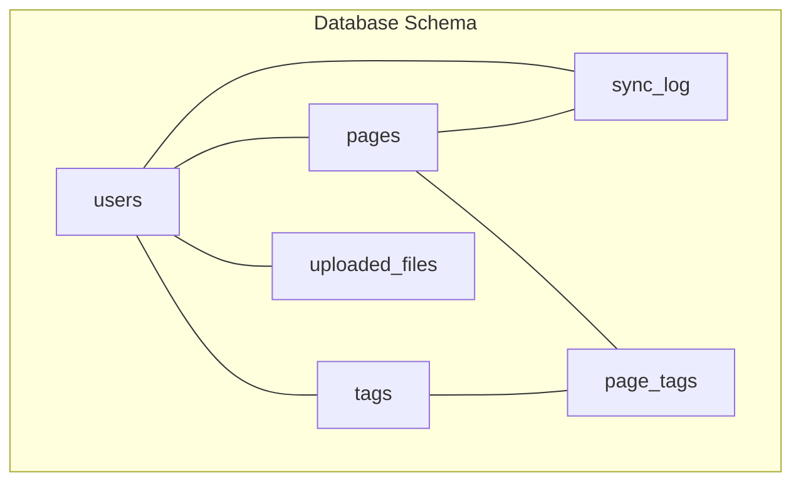

**Diagram sources**
- [001_init.sql:14-159](file://db/001_init.sql#L14-L159)
- [20260319_init.ts:25-181](file://code/server/src/db/migrations/20260319_init.ts#L25-L181)

**Section sources**
- [001_init.sql:1-254](file://db/001_init.sql#L1-L254)
- [20260319_init.ts:17-299](file://code/server/src/db/migrations/20260319_init.ts#L17-L299)

## Core Components
This section documents each entity’s role, primary keys, foreign keys, and constraints that govern relationships.

- users
  - PK id
  - Unique constraint on email
  - Created/updated timestamps
  - Ownership of pages, tags, uploaded_files, and sync_log entries

- pages
  - PK id
  - FK user_id → users.id (ON DELETE CASCADE)
  - Self-reference via parent_id → pages.id (ON DELETE CASCADE)
  - JSONB content for TipTap editor
  - Soft delete flag is_deleted and deleted_at
  - Optimistic locking via version
  - Search vector maintained by trigger
  - Indexes optimized for user-scoped queries, ordering, and full-text search

- tags
  - PK id
  - FK user_id → users.id (ON DELETE CASCADE)
  - Unique constraint on (user_id, name)
  - Color validation

- page_tags
  - Composite PK (page_id, tag_id)
  - FK page_id → pages.id (ON DELETE CASCADE)
  - FK tag_id → tags.id (ON DELETE CASCADE)

- uploaded_files
  - PK id
  - FK user_id → users.id (ON DELETE CASCADE)
  - Size check constraint (positive and ≤ 5MB)

- sync_log
  - PK id
  - FK user_id → users.id (ON DELETE CASCADE)
  - Optional FK page_id → pages.id (ON DELETE SET NULL)
  - Sync type and action checks

**Section sources**
- [001_init.sql:14-159](file://db/001_init.sql#L14-L159)
- [20260319_init.ts:25-181](file://code/server/src/db/migrations/20260319_init.ts#L25-L181)

## Architecture Overview
The schema enforces strong referential integrity and leverages PostgreSQL-specific features for performance and usability:
- UUID primary keys for global uniqueness and safer APIs
- Adjacency list model for hierarchical pages with self-referencing
- JSONB for flexible content storage with GIN indexes and a generated search vector
- Soft deletion with periodic cleanup
- Optimistic locking via version columns
- Triggers to maintain timestamps and search vectors

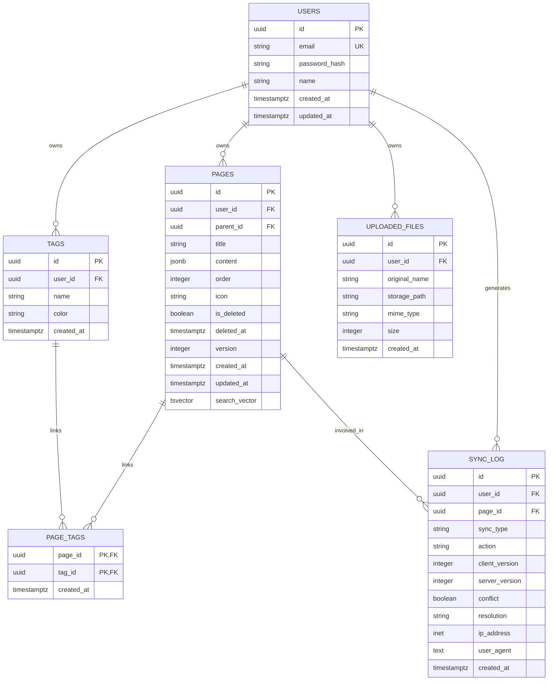

**Diagram sources**
- [001_init.sql:14-159](file://db/001_init.sql#L14-L159)
- [20260319_init.ts:25-181](file://code/server/src/db/migrations/20260319_init.ts#L25-L181)

## Detailed Component Analysis

### Users and Pages (One-to-Many)
- Relationship: One user owns many pages.
- Implementation: pages.user_id references users.id with ON DELETE CASCADE.
- Behavior: Deleting a user deletes all their pages automatically.
- Ordering and hierarchy: Each page belongs to a user and can be nested under another page via parent_id.

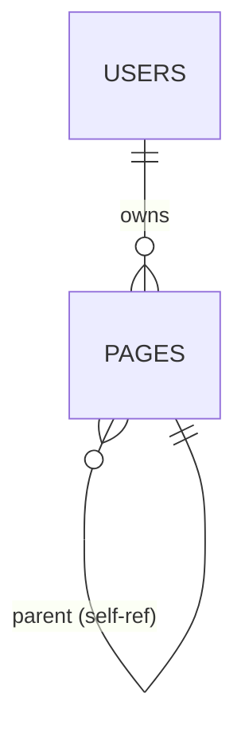

**Diagram sources**
- [001_init.sql:38](file://db/001_init.sql#L38)
- [001_init.sql:41](file://db/001_init.sql#L41)

**Section sources**
- [001_init.sql:36-55](file://db/001_init.sql#L36-L55)
- [20260319_init.ts:48](file://code/server/src/db/migrations/20260319_init.ts#L48)
- [20260319_init.ts:51](file://code/server/src/db/migrations/20260319_init.ts#L51)

### Adjacency List Model for Hierarchical Pages
- Self-referencing: pages.parent_id references pages.id.
- Cascading: ON DELETE CASCADE ensures deleting a parent removes all descendants.
- Ordering: pages.order supports sibling ordering; composite index optimizes queries by user, parent, and order.
- Soft deletion: Queries filter out is_deleted = TRUE to exclude deleted nodes.

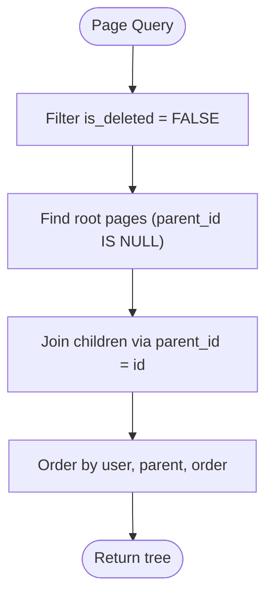

**Diagram sources**
- [001_init.sql:59-62](file://db/001_init.sql#L59-L62)
- [001_init.sql:41](file://db/001_init.sql#L41)

**Section sources**
- [001_init.sql:36-55](file://db/001_init.sql#L36-L55)
- [20260319_init.ts:46-81](file://code/server/src/db/migrations/20260319_init.ts#L46-L81)

### Users and Tags (One-to-Many)
- Relationship: One user owns many tags.
- Implementation: tags.user_id references users.id with ON DELETE CASCADE.
- Uniqueness: (user_id, name) is unique to prevent duplicates per user.

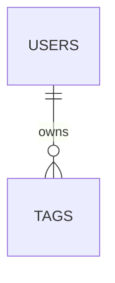

**Diagram sources**
- [001_init.sql:83](file://db/001_init.sql#L83)
- [001_init.sql:88-89](file://db/001_init.sql#L88-L89)

**Section sources**
- [001_init.sql:81-90](file://db/001_init.sql#L81-L90)
- [20260319_init.ts:106-114](file://code/server/src/db/migrations/20260319_init.ts#L106-L114)

### Pages and Tags via page_tags (Many-to-Many)
- Bridge table: page_tags links pages and tags.
- Composite PK: (page_id, tag_id) prevents duplicate associations.
- FKs: ON DELETE CASCADE on both sides cleans up orphaned rows when a page or tag is removed.

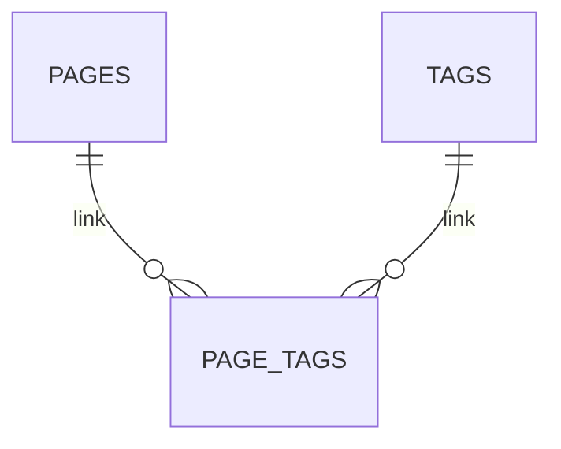

**Diagram sources**
- [001_init.sql:102-107](file://db/001_init.sql#L102-L107)

**Section sources**
- [001_init.sql:99-111](file://db/001_init.sql#L99-L111)
- [20260319_init.ts:127-135](file://code/server/src/db/migrations/20260319_init.ts#L127-L135)

### Users and Uploaded Files (One-to-Many)
- Relationship: One user can upload many files.
- Implementation: uploaded_files.user_id references users.id with ON DELETE CASCADE.
- Constraints: size > 0 and size ≤ 5MB.

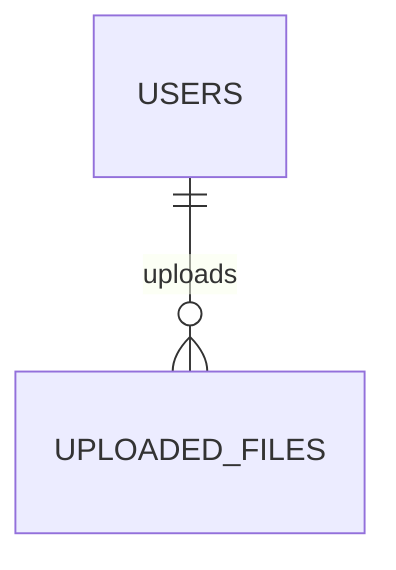

**Diagram sources**
- [001_init.sql:118](file://db/001_init.sql#L118)
- [001_init.sql:125](file://db/001_init.sql#L125)

**Section sources**
- [001_init.sql:116-126](file://db/001_init.sql#L116-L126)
- [20260319_init.ts:140-149](file://code/server/src/db/migrations/20260319_init.ts#L140-L149)

### Soft Deletion and Cleanup
- Mechanism: is_deleted flag marks a page as deleted; deleted_at stores the deletion timestamp.
- Query pattern: most queries filter WHERE is_deleted = FALSE to exclude soft-deleted records.
- Cleanup: a scheduled job can remove rows older than 30 days; the DDL comment describes the recommended SQL.

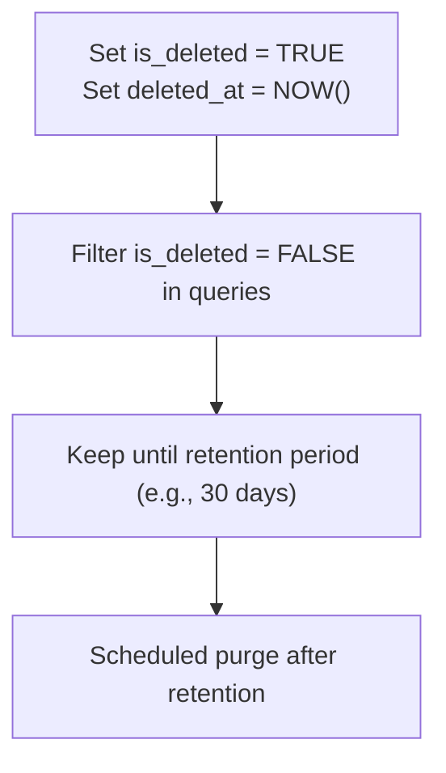

**Diagram sources**
- [001_init.sql:44-45](file://db/001_init.sql#L44-L45)
- [001_init.sql:243-243](file://db/001_init.sql#L243-L243)

**Section sources**
- [001_init.sql:44-45](file://db/001_init.sql#L44-L45)
- [001_init.sql:243-243](file://db/001_init.sql#L243-L243)

### Optimistic Locking with Version Columns
- Strategy: pages.version starts at 1 and increments on updates.
- Impact: applications can detect concurrent modifications and reject conflicting writes.
- Typical usage: include version in UPDATE WHERE clauses to ensure the record hasn’t changed since read.

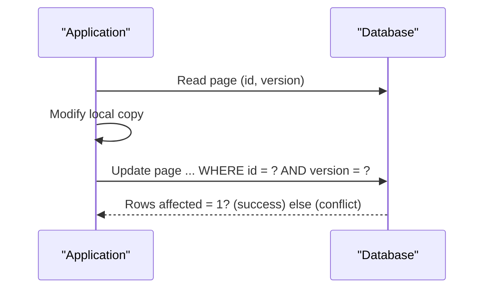

**Diagram sources**
- [001_init.sql:46](file://db/001_init.sql#L46)
- [001_init.sql:54](file://db/001_init.sql#L54)

**Section sources**
- [001_init.sql:46](file://db/001_init.sql#L46)
- [001_init.sql:54](file://db/001_init.sql#L54)

### Full-Text Search and Content Indexing
- Search vector: pages.search_vector is generated from title and extracted text from content JSONB.
- Trigger: A function updates search_vector and updated_at on INSERT/UPDATE of title or content.
- Indexes: GIN index on search_vector; GIN index on content for JSONB path operations.

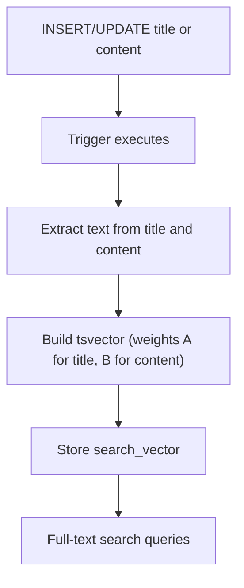

**Diagram sources**
- [001_init.sql:166-213](file://db/001_init.sql#L166-L213)
- [001_init.sql:65](file://db/001_init.sql#L65)
- [001_init.sql:81](file://db/001_init.sql#L81)

**Section sources**
- [001_init.sql:166-213](file://db/001_init.sql#L166-L213)
- [20260319_init.ts:196-277](file://code/server/src/db/migrations/20260319_init.ts#L196-L277)

### Audit Trail via sync_log
- Purpose: Track synchronization operations for conflict detection and auditing.
- Keys: FK user_id references users; optional FK page_id references pages (ON DELETE SET NULL).
- Checks: sync_type and action constrained to specific values.

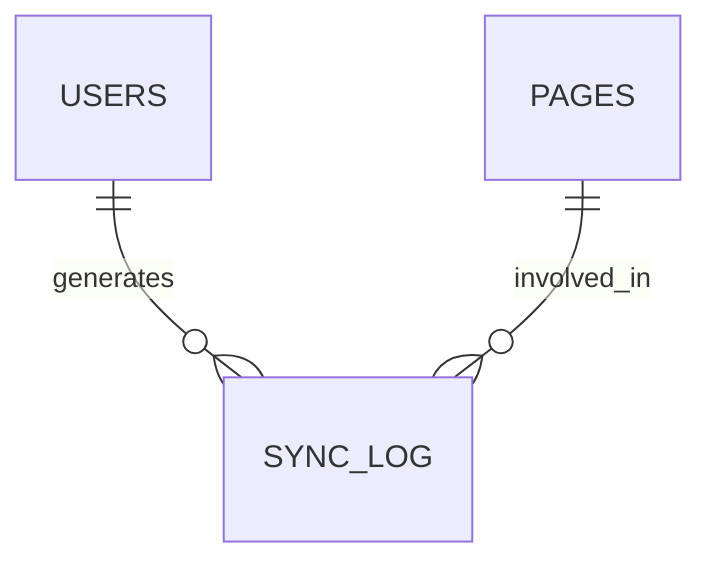

**Diagram sources**
- [001_init.sql:139-140](file://db/001_init.sql#L139-L140)
- [001_init.sql:170-181](file://db/001_init.sql#L170-L181)

**Section sources**
- [001_init.sql:137-159](file://db/001_init.sql#L137-L159)
- [20260319_init.ts:166-181](file://code/server/src/db/migrations/20260319_init.ts#L166-L181)

## Dependency Analysis
- Database client and connection
  - The server uses Knex with a PostgreSQL client and a configured connection string.
  - The connection module exports a singleton db instance and a graceful close method.
  - Knex configuration supports development, test, and production environments.

- Application usage
  - Authentication service and controller demonstrate database usage patterns (select, insert, returning) and JWT-based user identification.
  - These components rely on the users table for identity and indirectly on pages/tags/attachments via business logic.

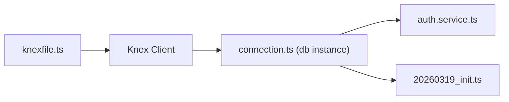

**Diagram sources**
- [knexfile.ts:22-29](file://code/server/knexfile.ts#L22-L29)
- [connection.ts:22-29](file://code/server/src/db/connection.ts#L22-L29)
- [20260319_init.ts:17-299](file://code/server/src/db/migrations/20260319_init.ts#L17-L299)

**Section sources**
- [knexfile.ts:13-57](file://code/server/knexfile.ts#L13-L57)
- [connection.ts:22-39](file://code/server/src/db/connection.ts#L22-L39)
- [auth.service.ts:68-101](file://code/server/src/services/auth.service.ts#L68-L101)
- [auth.controller.ts:26-36](file://code/server/src/controllers/auth.controller.ts#L26-L36)

## Performance Considerations
- Indexes
  - pages: user-scoped indexes on user_id, parent_id, order, and updated_at to support tree traversal and sorting.
  - pages: GIN index on search_vector for full-text search; GIN on content for JSONB queries.
  - tags: unique compound index on (user_id, name) to enforce uniqueness efficiently.
  - uploaded_files: index on user_id for per-user queries.
  - sync_log: composite index on (user_id, created_at DESC) and single-column index on page_id.

- JSONB and search
  - Storing TipTap content in JSONB avoids extra text tables and leverages PostgreSQL’s JSONB operators and GIN indexes.
  - A trigger maintains a precomputed search_vector to accelerate full-text search.

- Soft deletion
  - Conditional indexes on is_deleted = FALSE reduce index size and improve query performance for active records.

- Optimistic locking
  - Using version columns allows efficient concurrency control without heavy pessimistic locks.

**Section sources**
- [001_init.sql:57-81](file://db/001_init.sql#L57-L81)
- [001_init.sql:166-213](file://db/001_init.sql#L166-L213)
- [20260319_init.ts:64-81](file://code/server/src/db/migrations/20260319_init.ts#L64-L81)

## Troubleshooting Guide
- Soft-deleted records still appear in queries
  - Ensure queries filter by is_deleted = FALSE for active records.
  - Confirm that conditional indexes are being used appropriately.

- Full-text search returns unexpected results
  - Verify that the search_vector trigger is active and updated on title/content changes.
  - Check that GIN index on search_vector exists and is not stale.

- Concurrent update conflicts
  - When updating pages, include the current version in the WHERE clause to leverage optimistic locking.
  - If conflicts occur frequently, consider retry logic in the application layer.

- Cascade deletions removing unintended data
  - Review foreign keys: pages.user_id, tags.user_id, page_tags.* references, uploaded_files.user_id, sync_log.user_id.
  - Note that pages.parent_id also cascades, so deleting a parent removes children.

- File upload size errors
  - Ensure size constraints are respected (positive and ≤ 5MB).

- Tag creation conflicts
  - (user_id, name) must be unique; attempting to create a duplicate name for the same user will fail.

**Section sources**
- [001_init.sql:44-45](file://db/001_init.sql#L44-L45)
- [001_init.sql:54](file://db/001_init.sql#L54)
- [001_init.sql:125](file://db/001_init.sql#L125)
- [001_init.sql:88-89](file://db/001_init.sql#L88-L89)
- [20260319_init.ts:169](file://code/server/src/db/migrations/20260319_init.ts#L169)

## Conclusion
The schema establishes clear ownership and association rules among users, pages, tags, files, and audit logs. The adjacency list model with parent_id enables efficient hierarchical navigation, while soft deletion and version columns support safe operations and conflict detection. PostgreSQL-specific features like JSONB, GIN indexes, and triggers enhance performance and usability. The documented referential integrity and cascading behaviors provide a robust foundation for building features around pages, tags, and attachments.