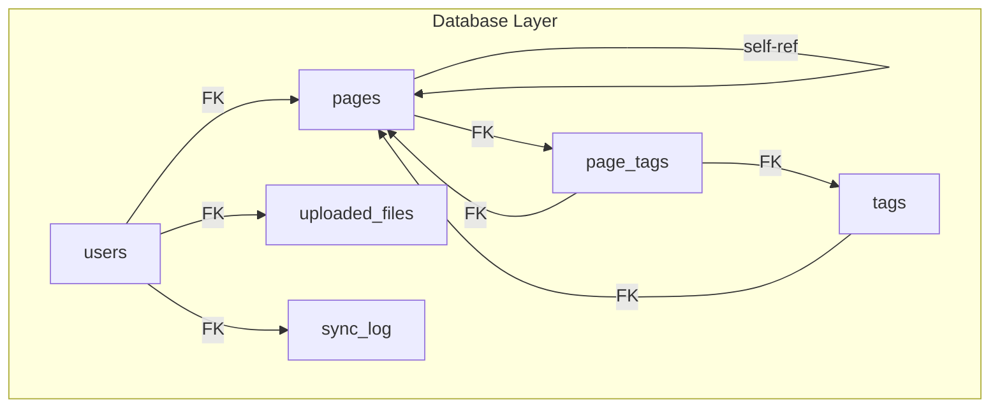
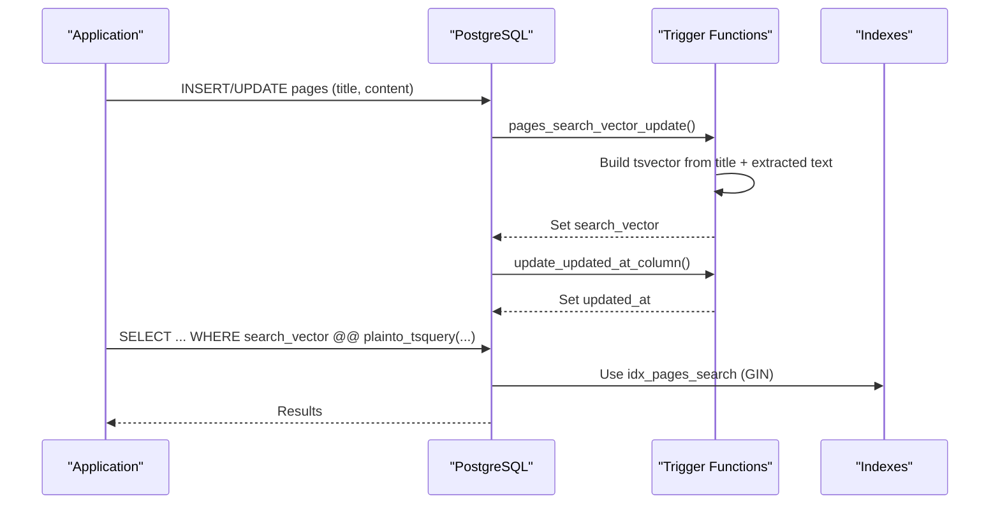
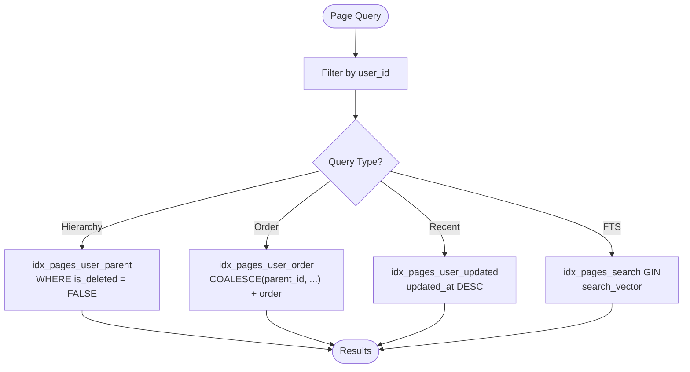
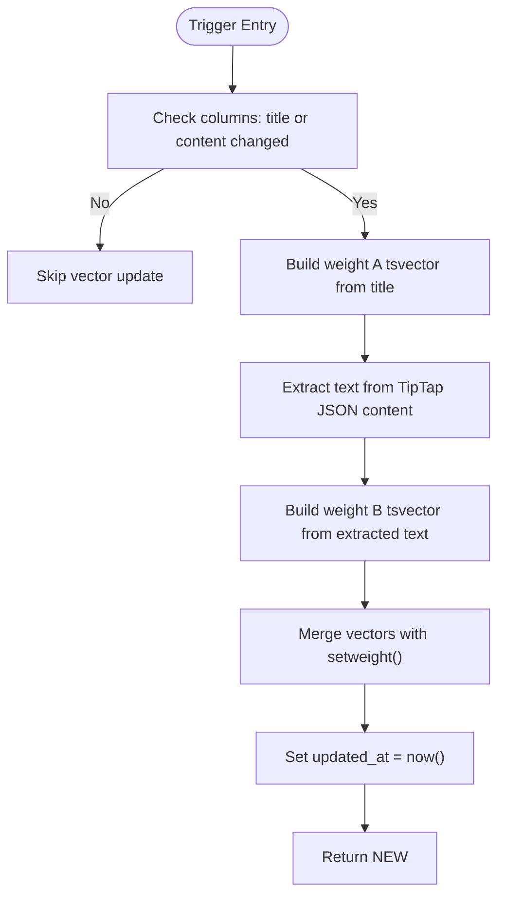
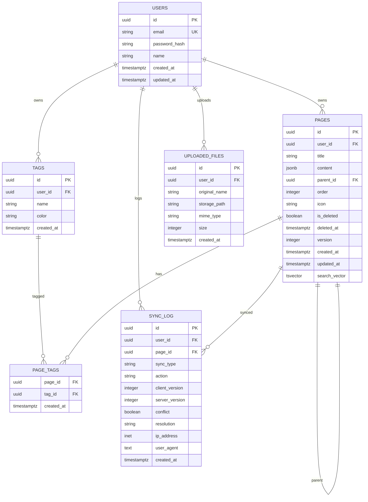

# Indexes & Performance

<cite>
**Referenced Files in This Document**
- [001_init.sql](file://db/001_init.sql)
- [20260319_init.ts](file://code/server/src/db/migrations/20260319_init.ts)
- [ER-DIAGRAM.md](file://db/ER-DIAGRAM.md)
- [knexfile.ts](file://code/server/knexfile.ts)
- [connection.ts](file://code/server/src/db/connection.ts)
- [index.ts](file://code/server/src/config/index.ts)
- [TEST-REPORT-M1-BACKEND.md](file://test/backend/TEST-REPORT-M1-BACKEND.md)
</cite>

## Table of Contents
1. [Introduction](#introduction)
2. [Project Structure](#project-structure)
3. [Core Components](#core-components)
4. [Architecture Overview](#architecture-overview)
5. [Detailed Component Analysis](#detailed-component-analysis)
6. [Dependency Analysis](#dependency-analysis)
7. [Performance Considerations](#performance-considerations)
8. [Troubleshooting Guide](#troubleshooting-guide)
9. [Conclusion](#conclusion)
10. [Appendices](#appendices)

## Introduction
This document explains the database indexing strategy and performance optimization for the Yule Notion application. It focuses on:
- Purpose and structure of each index, including composite indexes for efficient page hierarchy queries
- GIN indexes for JSONB content searching and full-text search vector optimization
- Trigger functions that automatically maintain search vectors and updated_at timestamps
- PostgreSQL full-text search implementation using tsvector and the custom function that extracts text from TipTap JSON content
- Performance implications of each index choice and recommended query optimization patterns
- Recommendations for monitoring query performance and identifying missing indexes

## Project Structure
The database schema and initialization are defined in SQL and migrated via Knex. The key elements include:
- Users, Pages, Tags, Page_Tags, Uploaded_Files, and Sync_Log tables
- Indexes on user-scoped columns, page hierarchy, and full-text search
- Triggers and functions to maintain search_vector and updated_at

**Diagram sources**
- [ER-DIAGRAM.md:10-78](file://db/ER-DIAGRAM.md#L10-L78)

**Section sources**
- [001_init.sql:14-158](file://db/001_init.sql#L14-L158)
- [20260319_init.ts:25-190](file://code/server/src/db/migrations/20260319_init.ts#L25-L190)
- [ER-DIAGRAM.md:94-125](file://db/ER-DIAGRAM.md#L94-L125)

## Core Components
- Pages table with JSONB content and tsvector search_vector
- Composite indexes for user-scoped queries, page hierarchy, and sorting
- GIN indexes for full-text search and JSONB content
- Triggers and functions to maintain search_vector and updated_at

Key index coverage:
- users: idx_users_email
- pages: idx_pages_user_id, idx_pages_user_parent, idx_pages_user_order, idx_pages_user_updated, idx_pages_search, idx_pages_content
- tags: idx_tags_user_id, idx_tags_user_name
- page_tags: idx_page_tags_tag_id
- uploaded_files: idx_files_user_id
- sync_log: idx_sync_log_user, idx_sync_log_page

**Section sources**
- [001_init.sql:25, 58-68, 92-93, 155-156:25-25](file://db/001_init.sql#L25-L25)
- [001_init.sql:58-68](file://db/001_init.sql#L58-L68)
- [001_init.sql:65, 68:65-68](file://db/001_init.sql#L65-L68)
- [001_init.sql:92-93](file://db/001_init.sql#L92-L93)
- [001_init.sql:155-156](file://db/001_init.sql#L155-L156)
- [20260319_init.ts:35](file://code/server/src/db/migrations/20260319_init.ts#L35)
- [20260319_init.ts:65-81](file://code/server/src/db/migrations/20260319_init.ts#L65-L81)
- [20260319_init.ts:116-117](file://code/server/src/db/migrations/20260319_init.ts#L116-L117)
- [20260319_init.ts:134](file://code/server/src/db/migrations/20260319_init.ts#L134)
- [20260319_init.ts:151](file://code/server/src/db/migrations/20260319_init.ts#L151)
- [20260319_init.ts:183-186](file://code/server/src/db/migrations/20260319_init.ts#L183-L186)
- [ER-DIAGRAM.md:128-144](file://db/ER-DIAGRAM.md#L128-L144)

## Architecture Overview
The indexing and triggers support:
- Efficient user-scoped queries and page hierarchy navigation
- Fast full-text search across titles and TipTap content
- Automatic maintenance of search vectors and timestamps

**Diagram sources**
- [001_init.sql:166-211](file://db/001_init.sql#L166-L211)
- [20260319_init.ts:196-252](file://code/server/src/db/migrations/20260319_init.ts#L196-L252)
- [001_init.sql:65](file://db/001_init.sql#L65)

## Detailed Component Analysis

### Pages Table Indexes
- idx_pages_user_id: Supports user-scoped queries efficiently.
- idx_pages_user_parent: Composite index with a condition to filter out soft-deleted rows, enabling fast subtree queries.
- idx_pages_user_order: Composite index ordered by parent_id and order, ideal for retrieving siblings in order.
- idx_pages_user_updated: Composite index ordered by updated_at descending, useful for “recently edited” lists.
- idx_pages_search: GIN index on tsvector for full-text search.
- idx_pages_content: GIN index on JSONB content for auxiliary JSON queries.

**Diagram sources**
- [001_init.sql:58-68](file://db/001_init.sql#L58-L68)
- [001_init.sql:60-62](file://db/001_init.sql#L60-L62)
- [001_init.sql:62](file://db/001_init.sql#L62)
- [001_init.sql:65](file://db/001_init.sql#L65)
- [001_init.sql:68](file://db/001_init.sql#L68)

**Section sources**
- [001_init.sql:58-68](file://db/001_init.sql#L58-L68)
- [001_init.sql:60-62](file://db/001_init.sql#L60-L62)
- [001_init.sql:62](file://db/001_init.sql#L62)
- [001_init.sql:65](file://db/001_init.sql#L65)
- [001_init.sql:68](file://db/001_init.sql#L68)
- [20260319_init.ts:65-81](file://code/server/src/db/migrations/20260319_init.ts#L65-L81)
- [ER-DIAGRAM.md:128-144](file://db/ER-DIAGRAM.md#L128-L144)

### Full-Text Search Implementation
- search_vector column is maintained by a trigger that:
  - Builds a weighted tsvector combining title (weight A) and extracted text from TipTap JSON content (weight B)
  - Extracts text nodes from nested JSONB arrays, handling both top-level arrays and nested content arrays
  - Updates updated_at on change

**Diagram sources**
- [001_init.sql:166-211](file://db/001_init.sql#L166-L211)
- [20260319_init.ts:196-252](file://code/server/src/db/migrations/20260319_init.ts#L196-L252)

**Section sources**
- [001_init.sql:50-51](file://db/001_init.sql#L50-L51)
- [001_init.sql:166-211](file://db/001_init.sql#L166-L211)
- [001_init.sql:72-73](file://db/001_init.sql#L72-L73)
- [20260319_init.ts:59](file://code/server/src/db/migrations/20260319_init.ts#L59)
- [20260319_init.ts:196-252](file://code/server/src/db/migrations/20260319_init.ts#L196-L252)

### JSONB Content Indexing
- idx_pages_content uses GIN with jsonb_path_ops for JSONB path/value operations.
- While not used for full-text search, it can accelerate specific JSONB queries (e.g., existence checks, path filters).

**Section sources**
- [001_init.sql:68](file://db/001_init.sql#L68)
- [20260319_init.ts:81](file://code/server/src/db/migrations/20260319_init.ts#L81)

### Timestamp Maintenance
- A generic update_updated_at_column function sets updated_at on any UPDATE.
- Separate triggers:
  - pages_search_vector_update updates both search_vector and updated_at for title/content changes
  - update_updated_at_column triggers for all column updates on users and pages

Note: There is a known limitation where pages.updated_at does not update for non-title/content changes because the pages_search_vector_update trigger is bound to UPDATE OF title, content. A separate trigger ensures updated_at updates on any column update.

**Section sources**
- [001_init.sql:218-231](file://db/001_init.sql#L218-L231)
- [20260319_init.ts:244-277](file://code/server/src/db/migrations/20260319_init.ts#L244-L277)
- [TEST-REPORT-M1-BACKEND.md:214-229](file://test/backend/TEST-REPORT-M1-BACKEND.md#L214-L229)

## Dependency Analysis
- Pages depends on Users (user_id) and self-reference (parent_id)
- Tags and Page_Tags form a many-to-many relationship
- Uploaded_Files and Sync_Log depend on Users

**Diagram sources**
- [ER-DIAGRAM.md:10-78](file://db/ER-DIAGRAM.md#L10-L78)
- [001_init.sql:14-158](file://db/001_init.sql#L14-L158)

**Section sources**
- [ER-DIAGRAM.md:94-125](file://db/ER-DIAGRAM.md#L94-L125)
- [001_init.sql:14-158](file://db/001_init.sql#L14-L158)

## Performance Considerations
Index selection rationale:
- Composite indexes on user_id with parent_id and order enable:
  - Efficient subtree retrieval and sibling ordering
  - Filtering out soft-deleted rows with WHERE conditions
- GIN indexes on tsvector and JSONB content:
  - Optimize full-text search and JSONB path/value operations
- Conditional filtering (WHERE is_deleted = FALSE) reduces index selectivity and scan cost for active records

Query optimization patterns:
- Use idx_pages_user_parent for hierarchical traversal and idx_pages_user_order for ordered sibling retrieval
- Use idx_pages_search for full-text queries with GIN
- Prefer exact equality on user_id to leverage leading-column B-tree indexes
- Avoid selecting unnecessary columns; use projections to reduce I/O

Performance implications:
- GIN indexes improve search performance but increase write overhead due to maintaining inverted indices
- JSONB path_ops can speed up path/value comparisons but may not be optimal for arbitrary JSON queries
- Maintaining search_vector triggers adds CPU overhead during inserts/updates; ensure adequate CPU resources

[No sources needed since this section provides general guidance]

## Troubleshooting Guide
Common issues and remedies:
- Full-text search not returning expected results:
  - Verify search_vector is populated and updated_at is recent
  - Confirm idx_pages_search exists and is not defunct
- Pages updated_at not updating:
  - Ensure the pages_search_vector_update trigger runs for non-title/content changes or rely on the separate pages updated_at trigger
- Slow page hierarchy queries:
  - Confirm composite indexes are used (user_id, parent_id) and (user_id, parent_id, order)
  - Check for is_deleted filtering and ensure appropriate WHERE clauses

Monitoring and diagnostics:
- Use EXPLAIN/EXPLAIN ANALYZE to inspect query plans and index usage
- Monitor slow query logs and query durations
- Track index scans vs sequential scans to validate index effectiveness

**Section sources**
- [TEST-REPORT-M1-BACKEND.md:153-176](file://test/backend/TEST-REPORT-M1-BACKEND.md#L153-L176)
- [001_init.sql:166-211](file://db/001_init.sql#L166-L211)
- [001_init.sql:218-231](file://db/001_init.sql#L218-L231)

## Conclusion
The indexing strategy balances efficient user-scoped queries, fast page hierarchy navigation, and robust full-text search. The combination of composite indexes and GIN indexes, along with automated trigger-based maintenance of search_vector and updated_at, provides a solid foundation for performance. Addressing the pages.updated_at trigger limitation will ensure consistent timestamp updates across all column changes.

[No sources needed since this section summarizes without analyzing specific files]

## Appendices

### Database Configuration and Connection Pool
- Knex configuration supports development, test, and production environments
- Connection pooling is configured to balance concurrency and resource usage

**Section sources**
- [knexfile.ts:13-57](file://code/server/knexfile.ts#L13-L57)
- [connection.ts:22-29](file://code/server/src/db/connection.ts#L22-L29)
- [index.ts:25-26](file://code/server/src/config/index.ts#L25-L26)