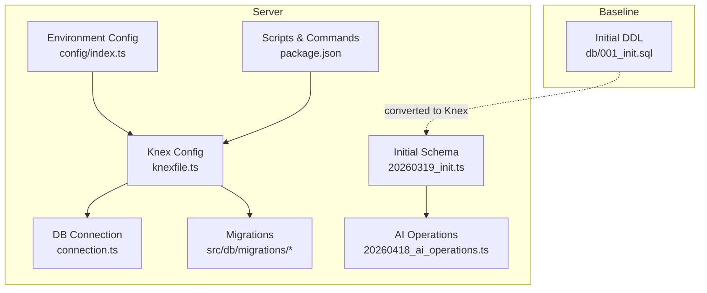
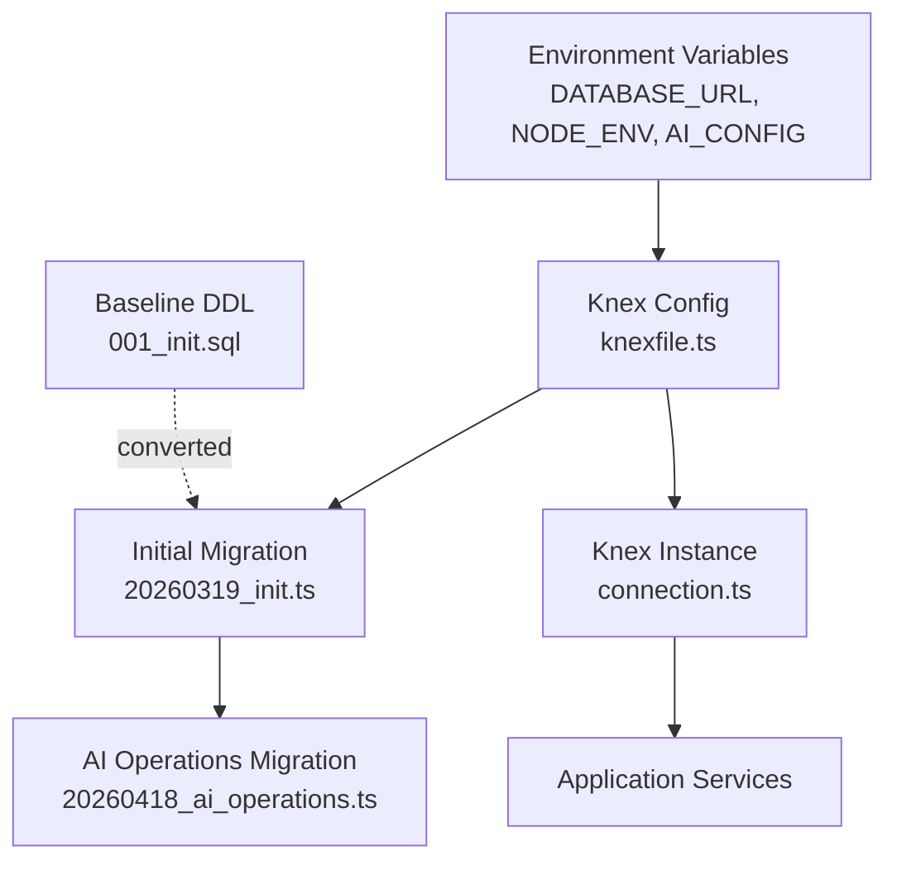
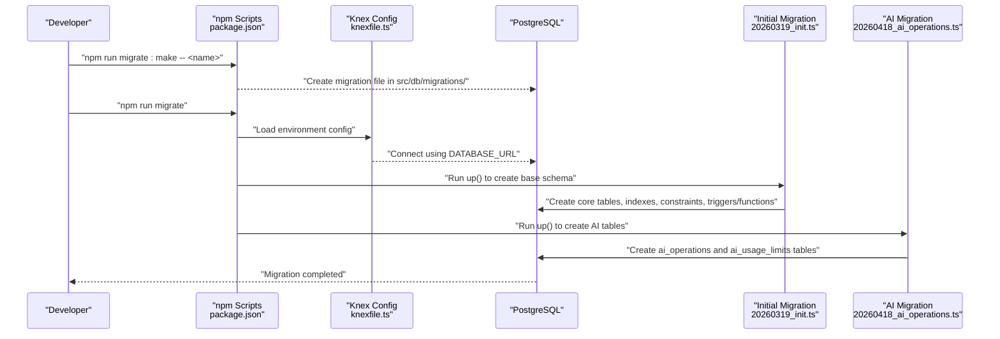
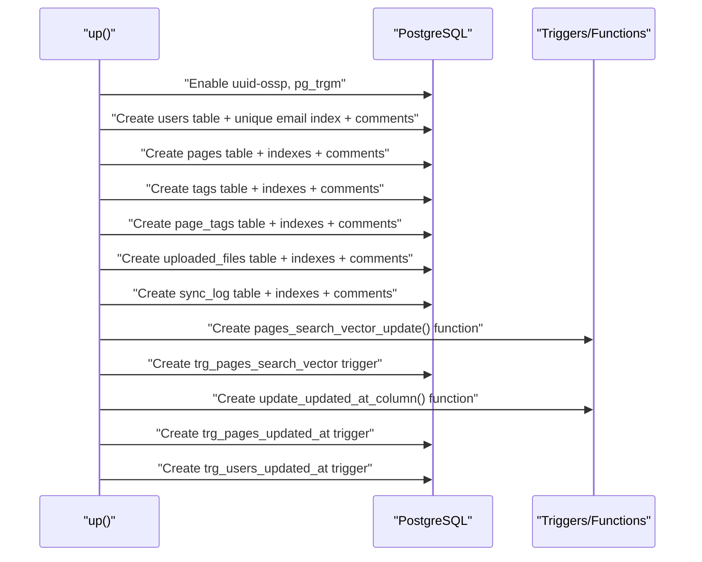
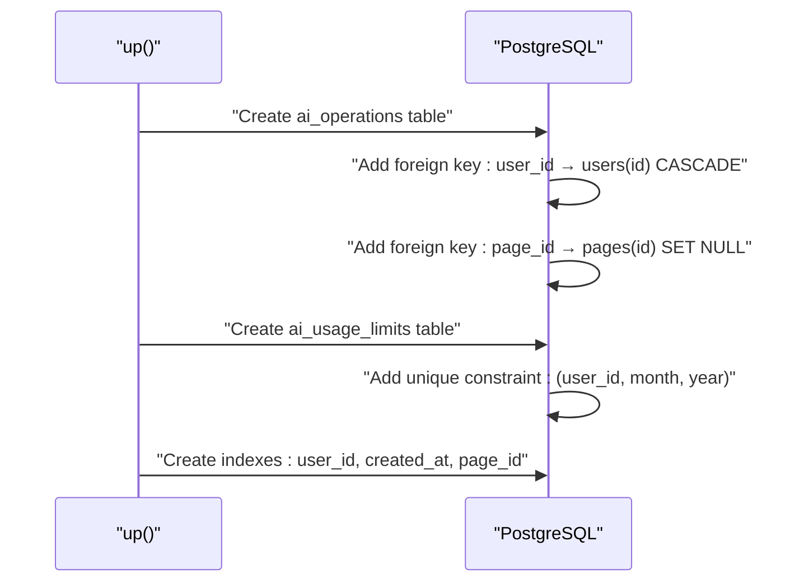
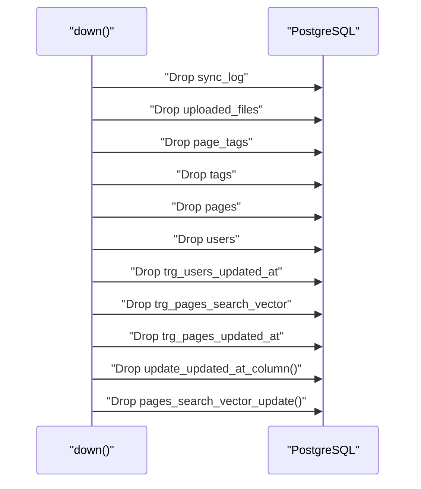
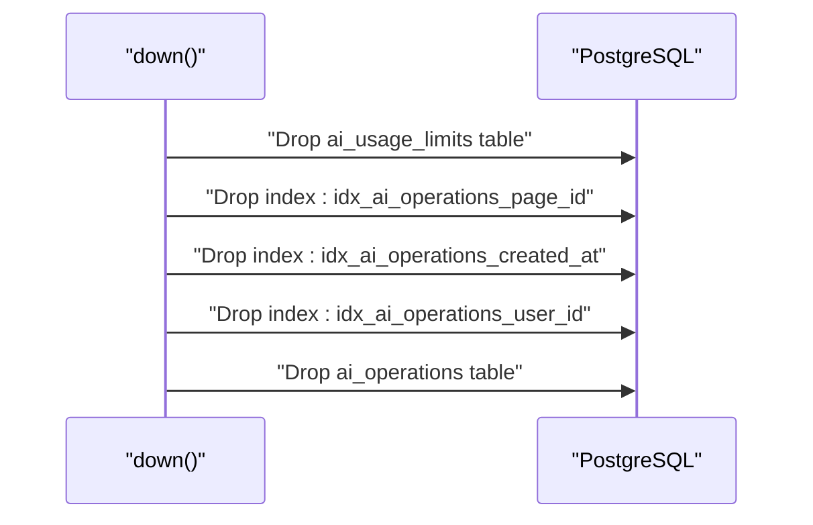
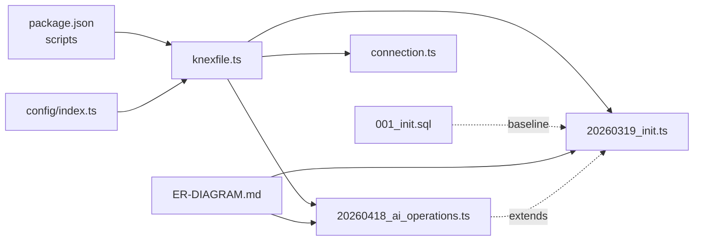

# Migrations & Versioning

<cite>
**Referenced Files in This Document**
- [knexfile.ts](file://code/server/knexfile.ts)
- [20260319_init.ts](file://code/server/src/db/migrations/20260319_init.ts)
- [20260418_ai_operations.ts](file://code/server/src/db/migrations/20260418_ai_operations.ts)
- [001_init.sql](file://db/001_init.sql)
- [connection.ts](file://code/server/src/db/connection.ts)
- [index.ts](file://code/server/src/config/index.ts)
- [package.json](file://code/server/package.json)
- [README.md](file://README.md)
- [ER-DIAGRAM.md](file://db/ER-DIAGRAM.md)
</cite>

## Update Summary
**Changes Made**
- Added documentation for new AI operations tracking migration (20260418_ai_operations.ts)
- Updated migration workflow to include AI feature management
- Enhanced schema documentation to cover AI operations and usage limits tables
- Added AI-specific configuration and indexing strategies
- Updated ER diagram references to include AI entities

## Table of Contents
1. [Introduction](#introduction)
2. [Project Structure](#project-structure)
3. [Core Components](#core-components)
4. [Architecture Overview](#architecture-overview)
5. [Detailed Component Analysis](#detailed-component-analysis)
6. [AI Operations Migration System](#ai-operations-migration-system)
7. [Dependency Analysis](#dependency-analysis)
8. [Performance Considerations](#performance-considerations)
9. [Troubleshooting Guide](#troubleshooting-guide)
10. [Conclusion](#conclusion)
11. [Appendices](#appendices)

## Introduction
This document explains the database migration system built with Knex.js for the Yule Notion application. It covers migration file structure, naming conventions, execution order, and the initial migration that creates the complete schema including tables, indexes, triggers, and constraints. The system now includes enhanced support for AI operations tracking with dedicated migration workflow for AI features. It documents the migration workflow from development to production, rollback procedures, best practices for safe updates, configuration in knexfile.ts, and how migrations integrate into the deployment pipeline. Finally, it outlines common migration patterns and troubleshooting strategies, and clarifies the relationship between database versioning and application versioning.

## Project Structure
The migration system is organized under the server codebase with Knex configuration, migration files, and a dedicated SQL baseline. The key locations are:
- Knex configuration: code/server/knexfile.ts
- Migration files: code/server/src/db/migrations/
- Initial schema baseline: db/001_init.sql
- Database connection instance: code/server/src/db/connection.ts
- Environment configuration: code/server/src/config/index.ts
- Application scripts and migration commands: code/server/package.json
- Project documentation and ER diagram: README.md, db/ER-DIAGRAM.md

**Diagram sources**
- [knexfile.ts:1-69](file://code/server/knexfile.ts#L1-L69)
- [connection.ts:1-40](file://code/server/src/db/connection.ts#L1-L40)
- [index.ts:1-139](file://code/server/src/config/index.ts#L1-L139)
- [package.json:1-40](file://code/server/package.json#L1-L40)
- [001_init.sql:1-254](file://db/001_init.sql#L1-L254)
- [20260319_init.ts:1-300](file://code/server/src/db/migrations/20260319_init.ts#L1-L300)
- [20260418_ai_operations.ts:1-43](file://code/server/src/db/migrations/20260418_ai_operations.ts#L1-L43)

**Section sources**
- [knexfile.ts:1-69](file://code/server/knexfile.ts#L1-L69)
- [connection.ts:1-40](file://code/server/src/db/connection.ts#L1-L40)
- [index.ts:1-139](file://code/server/src/config/index.ts#L1-L139)
- [package.json:1-40](file://code/server/package.json#L1-L40)
- [README.md:86-98](file://README.md#L86-L98)

## Core Components
- Knex configuration: Defines environments (development, test, production), connection URLs, migration directories, and seed directories. It selects the appropriate environment via NODE_ENV and exposes DATABASE_URL.
- Initial migration: Converts the baseline SQL into a TypeScript migration named with a timestamp to ensure deterministic ordering.
- AI operations migration: New migration that adds AI operations tracking and usage limit tables for AI feature management.
- Database connection: Provides a global Knex instance configured with pooling and a graceful shutdown hook.
- Environment configuration: Centralizes environment variables and validates production security requirements, including AI configuration.
- Scripts and commands: Exposes npm scripts for creating migrations, applying migrations, and rolling back.

Key responsibilities:
- Knex configuration: Ensures consistent environment-specific behavior and migration discovery.
- Initial migration: Creates all tables, indexes, constraints, comments, and triggers/functions required by the application.
- AI operations migration: Adds AI-specific tracking tables with proper indexing and foreign key relationships.
- Connection: Manages connection lifecycle and pool sizing.
- Environment: Validates secrets and origins for production safety, including AI configuration validation.
- Scripts: Standardizes developer workflow for migrations.

**Section sources**
- [knexfile.ts:10-68](file://code/server/knexfile.ts#L10-L68)
- [20260319_init.ts:1-300](file://code/server/src/db/migrations/20260319_init.ts#L1-L300)
- [20260418_ai_operations.ts:1-43](file://code/server/src/db/migrations/20260418_ai_operations.ts#L1-L43)
- [connection.ts:22-40](file://code/server/src/db/connection.ts#L22-L40)
- [index.ts:16-139](file://code/server/src/config/index.ts#L16-L139)
- [package.json:7-14](file://code/server/package.json#L7-L14)

## Architecture Overview
The migration architecture integrates Knex configuration with environment variables and TypeScript migrations. The initial migration encapsulates the full schema derived from the baseline SQL, while the AI operations migration extends the system with AI feature tracking capabilities. The connection module provides a reusable Knex instance for application services.

**Diagram sources**
- [knexfile.ts:13-68](file://code/server/knexfile.ts#L13-L68)
- [20260319_init.ts:17-299](file://code/server/src/db/migrations/20260319_init.ts#L17-L299)
- [20260418_ai_operations.ts:3-42](file://code/server/src/db/migrations/20260418_ai_operations.ts#L3-L42)
- [001_init.sql:1-254](file://db/001_init.sql#L1-L254)
- [connection.ts:22-29](file://code/server/src/db/connection.ts#L22-L29)

## Detailed Component Analysis

### Knex Configuration (knexfile.ts)
- Environments: development, test, production.
- Client: PostgreSQL.
- Connection: Uses DATABASE_URL from environment; defaults included for local development.
- Migrations: Directory set to src/db/migrations with TypeScript extension.
- Seeds: Directory set to src/db/seeds.
- Production pool: Min/max pool sizes configured for concurrency.

Operational notes:
- NODE_ENV determines which environment config is exported.
- DATABASE_URL supports standard PostgreSQL connection strings.
- Migration directory and extension ensure TypeScript migrations are discovered.

**Section sources**
- [knexfile.ts:13-68](file://code/server/knexfile.ts#L13-L68)

### Initial Migration (20260319_init.ts)
Purpose:
- Convert the baseline DDL into a TypeScript migration.
- Create all tables, indexes, constraints, comments, and triggers/functions.
- Provide deterministic execution order via filename timestamp.

Structure highlights:
- Extensions: Enables uuid-ossp and pg_trgm.
- Users table: UUID primary key, unique email, timestamps, comments.
- Pages table: UUID primary key, foreign keys, JSONB content, soft delete, version, search vector, multiple indexes, comments.
- Tags table: UUID primary key, user-scoped uniqueness, color validation, indexes.
- Page-tags association: composite primary key, foreign keys, cascade deletes.
- Uploaded files: metadata with size checks and indexes.
- Sync log: audit trail for synchronization events.
- Triggers and functions:
  - pages_search_vector_update: generates a tsvector from title and TipTap JSON content; updates search_vector and updated_at.
  - update_updated_at_column: generic trigger function; pages updated_at maintained by search vector trigger; users updated_at maintained by dedicated trigger.

Rollback order:
- Drops tables in reverse dependency order.
- Drops triggers and functions last.

Execution order:
- Timestamped filename ensures deterministic ordering.
- up() creates extensions, tables, indexes, constraints, comments, then triggers/functions.
- down() reverses creation order.

**Section sources**
- [20260319_init.ts:17-299](file://code/server/src/db/migrations/20260319_init.ts#L17-L299)

### AI Operations Migration (20260418_ai_operations.ts)
**Updated** Added comprehensive AI operations tracking system with dedicated migration workflow.

Purpose:
- Introduce AI operations tracking for monitoring and analytics.
- Implement usage limits management for cost control.
- Provide historical record of AI interactions for debugging and billing.

Structure highlights:
- AI operations table: Tracks individual AI operations with user context, input/output, token usage, cost calculation, provider, model, and page association.
- AI usage limits table: Manages monthly usage quotas per user with automatic monthly rollover.
- Indexes: Optimized for user-based queries, time-based filtering, and page association.
- Foreign key relationships: Proper cascading deletes for user and page references.

Key features:
- Operation tracking: Records summarize, rewrite, expand, and other AI operation types.
- Cost monitoring: Automatic cost calculation based on tokens and provider rates.
- Usage limits: Monthly budget enforcement with configurable limits.
- Audit trail: Complete history of AI interactions for compliance and debugging.

Rollback order:
- Drops usage limits table first (no foreign key dependencies).
- Drops indexes before table removal.
- Drops AI operations table last.

**Section sources**
- [20260418_ai_operations.ts:3-42](file://code/server/src/db/migrations/20260418_ai_operations.ts#L3-L42)

### Baseline DDL (001_init.sql)
- Describes the complete schema as SQL.
- Includes all tables, indexes, constraints, comments, and trigger functions.
- Serves as the authoritative source for the initial schema.

Relationship to migration:
- The TypeScript migration mirrors this DDL and adds comments and explicit trigger/function definitions.

**Section sources**
- [001_init.sql:1-254](file://db/001_init.sql#L1-L254)

### Database Connection (connection.ts)
- Creates a global Knex instance with PostgreSQL client.
- Reads DATABASE_URL from environment configuration.
- Pool configuration for connection reuse.
- Graceful close function to destroy connections during shutdown.

Integration:
- Used by application services to execute queries and migrations.

**Section sources**
- [connection.ts:22-40](file://code/server/src/db/connection.ts#L22-L40)

### Environment Configuration (index.ts)
- Parses and validates environment variables using Zod.
- Provides databaseUrl for Knex configuration.
- Enforces production security requirements (JWT secret length and allowed origins).
- **Updated** Includes comprehensive AI configuration with OpenAI integration, rate limiting, cost controls, and timeout settings.

AI Configuration Highlights:
- OpenAI API Key and Model configuration
- Default model selection (gpt-4o-mini)
- Maximum token limits and temperature settings
- Rate limiting (10 requests per minute)
- Cost limit thresholds ($10 monthly default)
- Request timeout configuration (30 seconds)

Impact on migrations:
- DATABASE_URL drives migration connectivity.
- Production validation prevents unsafe deployments.
- AI configuration enables proper testing of AI feature migrations.

**Section sources**
- [index.ts:16-139](file://code/server/src/config/index.ts#L16-L139)

### Migration Commands and Scripts (package.json)
- migrate: applies latest migrations.
- migrate:rollback: reverts the last batch of migrations.
- migrate:make: scaffolds a new migration file.

Usage:
- npm run migrate:make -- <migration-name> to create a new migration.
- npm run migrate to apply migrations.
- npm run migrate:rollback to revert.

**Section sources**
- [package.json:7-14](file://code/server/package.json#L7-L14)
- [README.md:88-98](file://README.md#L88-L98)

### ER Diagram and Schema Overview (ER-DIAGRAM.md)
- Visualizes entity relationships and constraints.
- Highlights indexes and design decisions (JSONB content, adjacency list tree, tsvector search, soft delete, optimistic locking, audit logging).
- **Updated** Enhanced to include AI operations and usage limits entities with their relationships to existing core entities.

Relevance:
- Guides understanding of migration scope and dependencies.
- Supports safe schema changes aligned with existing relationships.
- **Updated** Now includes AI feature relationships for proper planning of AI-enabled migrations.

**Section sources**
- [ER-DIAGRAM.md:1-160](file://db/ER-DIAGRAM.md#L1-L160)

## Architecture Overview

**Diagram sources**
- [package.json:7-14](file://code/server/package.json#L7-L14)
- [knexfile.ts:13-68](file://code/server/knexfile.ts#L13-L68)
- [20260319_init.ts:17-299](file://code/server/src/db/migrations/20260319_init.ts#L17-L299)
- [20260418_ai_operations.ts:3-42](file://code/server/src/db/migrations/20260418_ai_operations.ts#L3-L42)

## Detailed Component Analysis

### Initial Migration Sequence
The initial migration executes a series of steps to establish the core schema:

**Diagram sources**
- [20260319_init.ts:17-299](file://code/server/src/db/migrations/20260319_init.ts#L17-L299)

### AI Operations Migration Sequence
**Updated** The AI operations migration extends the schema with AI feature tracking capabilities:

**Diagram sources**
- [20260418_ai_operations.ts:3-42](file://code/server/src/db/migrations/20260418_ai_operations.ts#L3-L42)

### Rollback Sequence
The rollback reverses the creation order:

**Diagram sources**
- [20260319_init.ts:284-299](file://code/server/src/db/migrations/20260319_init.ts#L284-L299)

### AI Operations Rollback Sequence
**Updated** The AI operations rollback handles AI-specific cleanup:

**Diagram sources**
- [20260418_ai_operations.ts:36-42](file://code/server/src/db/migrations/20260418_ai_operations.ts#L36-L42)

### Migration Naming and Ordering
- Naming convention: timestamp prefix followed by a descriptive name (e.g., 20260319_init.ts, 20260418_ai_operations.ts).
- Ordering: Knex reads migration files in filesystem order; timestamp ensures deterministic execution.
- Best practice: Use descriptive names and keep the timestamp to guarantee order.
- **Updated** AI migrations should be timestamped after the initial schema to ensure proper dependency chain.

**Section sources**
- [20260319_init.ts:1-10](file://code/server/src/db/migrations/20260319_init.ts#L1-L10)
- [20260418_ai_operations.ts:1-10](file://code/server/src/db/migrations/20260418_ai_operations.ts#L1-L10)

### Trigger Functions and Indexes
- pages_search_vector_update: Maintains a tsvector column for full-text search by combining title and TipTap JSON content; updates updated_at.
- update_updated_at_column: Generic function to refresh updated_at on updates; pages updated_at is maintained by the search vector trigger; users updated_at is maintained by a separate trigger.
- Indexes: Comprehensive indexes on user-scoped columns, conditions, order, and GIN indexes for search and JSONB content.
- **Updated** AI operations indexes: Optimized for user-based queries, time-based filtering, and page association to support AI feature analytics.

**Section sources**
- [20260319_init.ts:196-277](file://code/server/src/db/migrations/20260319_init.ts#L196-L277)
- [001_init.sql:164-231](file://db/001_init.sql#L164-L231)
- [20260418_ai_operations.ts:19-22](file://code/server/src/db/migrations/20260418_ai_operations.ts#L19-L22)

## AI Operations Migration System

**New Section** The AI operations migration system provides comprehensive tracking and management capabilities for AI features within the Yule Notion application.

### AI Operations Tracking
The ai_operations table captures detailed information about AI interactions:
- Operation identification: UUID primary key with auto-generated values
- User context: Foreign key to users table with cascade delete
- Operation details: Type (summarize, rewrite, expand), input/output text, tokens used
- Cost tracking: Decimal fields for precise cost calculation (10,6 precision)
- Provider/model: OpenAI integration with configurable model selection
- Page association: Optional foreign key to pages table with SET NULL on delete

### Usage Limits Management
The ai_usage_limits table implements monthly cost control:
- User quotas: Per-user monthly limits with default $10.00 allocation
- Usage tracking: Current month usage accumulation with decimal precision
- Time-based constraints: Separate month and year fields for proper rollover
- Unique constraints: Prevent duplicate limits for the same user-month combination

### Indexing Strategy
Comprehensive indexing for optimal query performance:
- User-based queries: Index on user_id for user-centric AI analytics
- Temporal queries: Index on created_at for time-based reporting and limits
- Page association: Index on page_id for content-focused AI operations
- Composite constraints: Unique (user_id, month, year) for quota management

### Integration Points
- Foreign key relationships: Proper cascading behavior for user and page cleanup
- Cost calculation: Automatic tracking enables real-time budget monitoring
- Audit trail: Complete history for debugging, compliance, and billing purposes
- Scalability: Designed for high-volume AI operations in production environments

**Section sources**
- [20260418_ai_operations.ts:3-42](file://code/server/src/db/migrations/20260418_ai_operations.ts#L3-L42)

## Dependency Analysis

**Diagram sources**
- [package.json:7-14](file://code/server/package.json#L7-L14)
- [knexfile.ts:13-68](file://code/server/knexfile.ts#L13-L68)
- [20260319_init.ts:17-299](file://code/server/src/db/migrations/20260319_init.ts#L17-L299)
- [20260418_ai_operations.ts:3-42](file://code/server/src/db/migrations/20260418_ai_operations.ts#L3-L42)
- [connection.ts:22-29](file://code/server/src/db/connection.ts#L22-L29)
- [index.ts:16-139](file://code/server/src/config/index.ts#L16-L139)
- [001_init.sql:1-254](file://db/001_init.sql#L1-L254)
- [ER-DIAGRAM.md:1-160](file://db/ER-DIAGRAM.md#L1-L160)

**Section sources**
- [package.json:7-14](file://code/server/package.json#L7-L14)
- [knexfile.ts:13-68](file://code/server/knexfile.ts#L13-L68)
- [20260319_init.ts:17-299](file://code/server/src/db/migrations/20260319_init.ts#L17-L299)
- [20260418_ai_operations.ts:3-42](file://code/server/src/db/migrations/20260418_ai_operations.ts#L3-L42)
- [connection.ts:22-29](file://code/server/src/db/connection.ts#L22-L29)
- [index.ts:16-139](file://code/server/src/config/index.ts#L16-L139)
- [001_init.sql:1-254](file://db/001_init.sql#L1-L254)
- [ER-DIAGRAM.md:1-160](file://db/ER-DIAGRAM.md#L1-L160)

## Performance Considerations
- Index coverage: The initial migration includes targeted indexes for user-scoped queries, sorting, and full-text search. This minimizes query latency for common operations.
- Full-text search: GIN indexes on tsvector and JSONB content enable efficient text search and JSON traversal.
- Soft delete and cleanup: Soft deletion with a 30-day automatic cleanup reduces maintenance overhead and keeps the dataset manageable.
- Connection pooling: The connection instance uses a pool to balance concurrency and resource usage.
- **Updated** AI operations performance: Specialized indexes on ai_operations table optimize user-based queries, temporal filtering, and page association for AI feature analytics.

## Troubleshooting Guide
Common issues and resolutions:
- Migration fails due to missing environment variables:
  - Ensure DATABASE_URL is set; Knex uses this for connection.
  - Verify NODE_ENV is set appropriately to select the correct environment config.
- Permission errors on triggers/functions:
  - Confirm the database user has privileges to create functions and triggers.
- Index creation conflicts:
  - Check for existing indexes with the same names or overlapping definitions.
- Rollback failures:
  - Ensure dependencies are dropped in reverse order; the initial migration's down() follows the correct order.
- Production security violations:
  - JWT_SECRET must meet length requirements and ALLOWED_ORIGINS must be configured in production.
- **Updated** AI migration issues:
  - Verify OpenAI API key configuration in environment variables.
  - Check PostgreSQL UUID extension availability for AI tables.
  - Ensure proper timezone handling for AI usage limits calculations.

Operational tips:
- Use npm run migrate:make to scaffold new migrations and keep the timestamp prefix for ordering.
- Test migrations locally against a development database before applying to staging or production.
- Back up the database before running migrations in production.
- **Updated** For AI migrations, verify AI configuration (OPENAI_API_KEY, AI_MAX_TOKENS, AI_TEMPERATURE) before applying.

**Section sources**
- [index.ts:52-67](file://code/server/src/config/index.ts#L52-L67)
- [knexfile.ts:13-68](file://code/server/knexfile.ts#L13-L68)
- [20260319_init.ts:284-299](file://code/server/src/db/migrations/20260319_init.ts#L284-L299)
- [20260418_ai_operations.ts:36-42](file://code/server/src/db/migrations/20260418_ai_operations.ts#L36-L42)

## Conclusion
The Yule Notion migration system leverages Knex.js with a structured configuration, a timestamped initial migration, and comprehensive AI operations tracking. The system now includes enhanced support for AI feature management through dedicated migration workflow, providing deterministic execution order, robust triggers and indexes, and clear rollback semantics. The environment-driven configuration and scripts streamline development and production workflows, while the ER diagram and schema comments support maintainability and safe evolution of the database. The addition of AI operations tracking enables comprehensive monitoring and cost control for AI-powered features.

## Appendices

### Migration Workflow from Development to Production
- Local development:
  - Set DATABASE_URL and NODE_ENV.
  - Configure AI environment variables (OPENAI_API_KEY, AI_MAX_TOKENS, etc.).
  - Run npm run migrate to apply migrations.
- Staging:
  - Apply migrations using the staging DATABASE_URL.
  - Test AI feature functionality with limited usage limits.
- Production:
  - Ensure production environment variables are set and validated.
  - Apply migrations using production DATABASE_URL.
  - Configure production AI settings and monitor usage limits.
  - Use npm run migrate:rollback only when necessary and after careful planning.

**Section sources**
- [index.ts:52-67](file://code/server/src/config/index.ts#L52-L67)
- [knexfile.ts:43-57](file://code/server/knexfile.ts#L43-L57)
- [package.json:7-14](file://code/server/package.json#L7-L14)

### Creating New Migrations
- Use npm run migrate:make -- <migration-name>.
- Keep the timestamp prefix in the filename to preserve ordering.
- Write up() and down() functions that mirror each other.
- **Updated** For AI-related migrations, ensure proper foreign key relationships and indexing strategy.

**Section sources**
- [package.json:11-13](file://code/server/package.json#L11-L13)
- [20260319_init.ts:17-299](file://code/server/src/db/migrations/20260319_init.ts#L17-L299)
- [20260418_ai_operations.ts:3-42](file://code/server/src/db/migrations/20260418_ai_operations.ts#L3-L42)

### Relationship Between Database Versioning and Application Versioning
- Database versioning is managed by Knex migrations (timestamped filenames).
- Application versioning is tracked by the server package version.
- Align major application releases with significant schema changes and document breaking changes in release notes.
- **Updated** AI feature releases should include corresponding migration versions for proper tracking and rollback capability.

**Section sources**
- [package.json:2-4](file://code/server/package.json#L2-L4)
- [README.md:20-21](file://README.md#L20-L21)