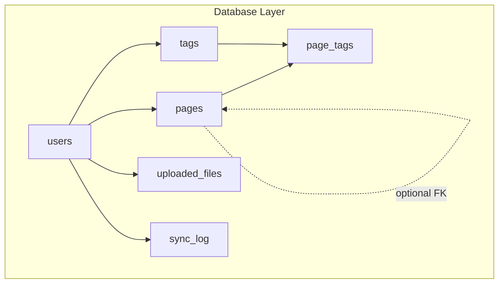
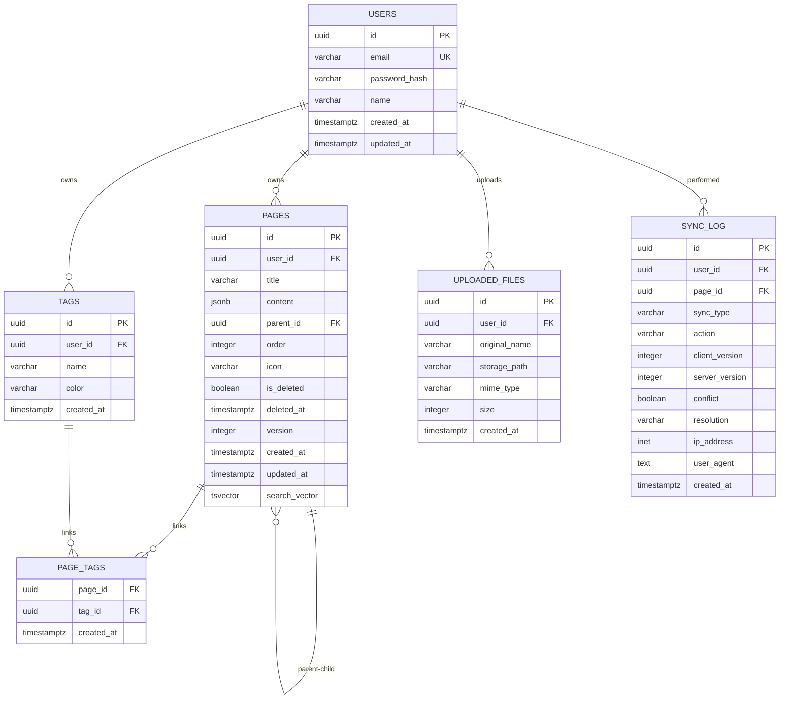
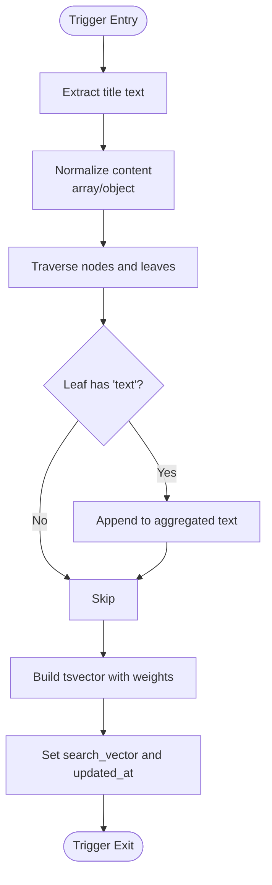
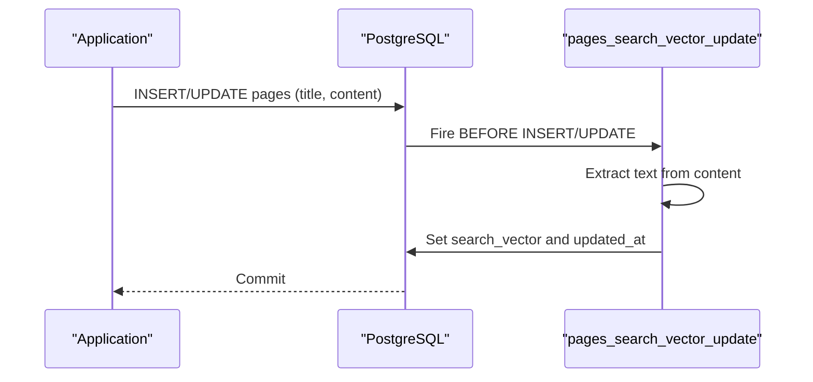

# Schema Definition

<cite>
**Referenced Files in This Document**
- [001_init.sql](file://db/001_init.sql)
- [20260319_init.ts](file://code/server/src/db/migrations/20260319_init.ts)
- [ER-DIAGRAM.md](file://db/ER-DIAGRAM.md)
- [connection.ts](file://code/server/src/db/connection.ts)
- [knexfile.ts](file://code/server/knexfile.ts)
- [TipTapEditor.vue](file://code/client/src/components/editor/TipTapEditor.vue)
- [TEST-REPORT-M1-BACKEND.md](file://test/backend/TEST-REPORT-M1-BACKEND.md)
</cite>

## Table of Contents
1. [Introduction](#introduction)
2. [Project Structure](#project-structure)
3. [Core Components](#core-components)
4. [Architecture Overview](#architecture-overview)
5. [Detailed Component Analysis](#detailed-component-analysis)
6. [Dependency Analysis](#dependency-analysis)
7. [Performance Considerations](#performance-considerations)
8. [Troubleshooting Guide](#troubleshooting-guide)
9. [Conclusion](#conclusion)

## Introduction
This document provides a comprehensive schema definition for the PostgreSQL database tables used by the application. It covers the six core tables: users, pages, tags, page_tags, uploaded_files, and sync_log. For each table, we detail primary keys, foreign keys, constraints, data types, and field-level comments. We explain the UUID-based primary key strategy and why it was chosen over auto-incrementing integers. We document the JSONB data modeling approach for page content storage, including the TipTap editor content format and validation rules. We describe the soft deletion mechanism with is_deleted flag and deleted_at timestamp. Finally, we provide examples of typical data structures stored in each table.

## Project Structure
The database schema is defined in two complementary forms:
- A standalone SQL script that creates all tables, indexes, constraints, triggers, and functions.
- A Knex migration file that replicates the same DDL using Knex’s schema builder.

Both sources are authoritative and kept in sync. The ER diagram provides a visual overview of entity relationships.

**Diagram sources**
- [001_init.sql:14-153](file://db/001_init.sql#L14-L153)
- [20260319_init.ts:25-190](file://code/server/src/db/migrations/20260319_init.ts#L25-L190)

**Section sources**
- [001_init.sql:1-254](file://db/001_init.sql#L1-L254)
- [20260319_init.ts:17-299](file://code/server/src/db/migrations/20260319_init.ts#L17-L299)
- [ER-DIAGRAM.md:1-160](file://db/ER-DIAGRAM.md#L1-L160)

## Core Components
This section summarizes the six core tables and their roles in the system.

- users: Stores user account information with unique email and timestamps.
- pages: Stores page content as JSONB (TipTap format), supports hierarchical parent-child relationships, soft deletion, optimistic locking, and full-text search.
- tags: Stores user-defined tags with color validation.
- page_tags: Many-to-many association table linking pages and tags.
- uploaded_files: Stores metadata for uploaded files (name, path, MIME type, size).
- sync_log: Optional audit/log table for synchronization events.

**Section sources**
- [001_init.sql:14-153](file://db/001_init.sql#L14-L153)
- [20260319_init.ts:25-190](file://code/server/src/db/migrations/20260319_init.ts#L25-L190)
- [ER-DIAGRAM.md:94-125](file://db/ER-DIAGRAM.md#L94-L125)

## Architecture Overview
The schema follows a relational model with:
- UUID primary keys for all tables to support distributed environments and safe sharing.
- JSONB for page content to store rich text structures produced by the TipTap editor.
- Triggers to maintain full-text search vectors and updated_at timestamps.
- Soft deletion with is_deleted and deleted_at for pages.
- Optimistic locking via version for conflict detection during synchronization.

**Diagram sources**
- [001_init.sql:14-153](file://db/001_init.sql#L14-L153)
- [20260319_init.ts:25-190](file://code/server/src/db/migrations/20260319_init.ts#L25-L190)

## Detailed Component Analysis

### users
- Purpose: User accounts with authentication credentials and profile information.
- Primary key: id (UUID, default generated).
- Constraints:
  - Unique constraint on email.
- Indexes:
  - idx_users_email on email.
- Comments:
  - Table comment: “用户表”.
  - Column comments for id, email, password_hash, name.

Typical row example:
- id: a UUID string
- email: a unique email address
- password_hash: bcrypt hash
- name: display name
- created_at/updated_at: timestamps

**Section sources**
- [001_init.sql:14-31](file://db/001_init.sql#L14-L31)
- [20260319_init.ts:25-41](file://code/server/src/db/migrations/20260319_init.ts#L25-L41)
- [ER-DIAGRAM.md:10-26](file://db/ER-DIAGRAM.md#L10-L26)

### pages
- Purpose: Core content storage for pages authored by users.
- Primary key: id (UUID).
- Foreign keys:
  - user_id references users(id) with ON DELETE CASCADE.
  - parent_id references pages(id) with ON DELETE CASCADE (self-reference for tree).
- Constraints:
  - chk_pages_order: order >= 0.
  - chk_pages_version: version > 0.
- Indexes:
  - idx_pages_user_id
  - idx_pages_user_parent (conditional on is_deleted = FALSE)
  - idx_pages_user_order (conditional on is_deleted = FALSE)
  - idx_pages_user_updated (conditional on is_deleted = FALSE)
  - idx_pages_search (GIN on search_vector)
  - idx_pages_content (GIN on content)
- Comments:
  - Table comment: “页面表 - 核心内容存储”.
  - Column comments for content (TipTap JSON), parent_id (tree), search_vector (auto-maintained), version (optimistic lock), is_deleted, deleted_at.
- Full-text search:
  - Trigger maintains search_vector by combining title (weight A) and extracted text from content (weight B).
- Soft deletion:
  - is_deleted flag and deleted_at timestamp; conditional indexes exclude deleted rows.
- Optimistic locking:
  - version increments on updates.

Typical row example:
- id: a UUID string
- user_id: a UUID string
- title: a string
- content: JSONB representing TipTap doc structure
- parent_id: a UUID string or null
- order: integer
- icon: a short emoji string
- is_deleted: boolean
- deleted_at: timestamp
- version: integer
- created_at/updated_at: timestamps
- search_vector: tsvector

**Section sources**
- [001_init.sql:36-76](file://db/001_init.sql#L36-L76)
- [20260319_init.ts:46-101](file://code/server/src/db/migrations/20260319_init.ts#L46-L101)
- [ER-DIAGRAM.md:101-104](file://db/ER-DIAGRAM.md#L101-L104)
- [001_init.sql:166-213](file://db/001_init.sql#L166-L213)

### tags
- Purpose: User-defined tags for categorizing pages.
- Primary key: id (UUID).
- Foreign keys:
  - user_id references users(id) with ON DELETE CASCADE.
- Constraints:
  - Unique constraint on (user_id, name).
  - chk_tags_color: color must match HEX pattern.
- Indexes:
  - idx_tags_user_id
  - idx_tags_user_name (user_id, name).
- Comments:
  - Table comment: “标签表 - 用户自定义分类标签”.
  - Column comment for color.

Typical row example:
- id: a UUID string
- user_id: a UUID string
- name: a string
- color: a HEX color string
- created_at: timestamp

**Section sources**
- [001_init.sql:81-96](file://db/001_init.sql#L81-L96)
- [20260319_init.ts:106-122](file://code/server/src/db/migrations/20260319_init.ts#L106-L122)
- [ER-DIAGRAM.md:106-109](file://db/ER-DIAGRAM.md#L106-L109)

### page_tags
- Purpose: Many-to-many association between pages and tags.
- Composite primary key: (page_id, tag_id).
- Foreign keys:
  - page_id references pages(id) with ON DELETE CASCADE.
  - tag_id references tags(id) with ON DELETE CASCADE.
- Indexes:
  - idx_page_tags_tag_id.
- Comments:
  - Table comment: “页面与标签多对多关联表”.

Typical row example:
- page_id: a UUID string
- tag_id: a UUID string
- created_at: timestamp

**Section sources**
- [001_init.sql:101-111](file://db/001_init.sql#L101-L111)
- [20260319_init.ts:127-135](file://code/server/src/db/migrations/20260319_init.ts#L127-L135)
- [ER-DIAGRAM.md:111-114](file://db/ER-DIAGRAM.md#L111-L114)

### uploaded_files
- Purpose: Metadata for uploaded files (actual files stored on filesystem).
- Primary key: id (UUID).
- Foreign keys:
  - user_id references users(id) with ON DELETE CASCADE.
- Constraints:
  - chk_file_size: size > 0 AND size <= 5242880 (5 MB).
- Indexes:
  - idx_files_user_id.
- Comments:
  - Table comment: “上传文件元数据表（实际文件存储在文件系统）”.
  - Column comments for storage_path and size.

Typical row example:
- id: a UUID string
- user_id: a UUID string
- original_name: a string
- storage_path: a filesystem-relative path string
- mime_type: a MIME type string
- size: integer bytes
- created_at: timestamp

**Section sources**
- [001_init.sql:116-132](file://db/001_init.sql#L116-L132)
- [20260319_init.ts:140-161](file://code/server/src/db/migrations/20260319_init.ts#L140-L161)
- [ER-DIAGRAM.md:116-119](file://db/ER-DIAGRAM.md#L116-L119)

### sync_log
- Purpose: Optional audit/log for synchronization operations (push/pull), including conflicts and resolutions.
- Primary key: id (UUID).
- Foreign keys:
  - user_id references users(id) with ON DELETE CASCADE.
  - page_id references pages(id) with ON DELETE SET NULL.
- Constraints:
  - chk_sync_type: sync_type IN ('push','pull').
  - chk_sync_action: action IN ('create','update','delete').
- Indexes:
  - idx_sync_log_user
  - idx_sync_log_page.
- Comments:
  - Table comment: “数据同步操作日志，用于冲突排查和审计”.

Typical row example:
- id: a UUID string
- user_id: a UUID string
- page_id: a UUID string or null
- sync_type: 'push' or 'pull'
- action: 'create' | 'update' | 'delete'
- client_version: integer or null
- server_version: integer or null
- conflict: boolean
- resolution: 'server_wins' | 'client_wins' | null
- ip_address: INET
- user_agent: text
- created_at: timestamp

**Section sources**
- [001_init.sql:137-158](file://db/001_init.sql#L137-L158)
- [20260319_init.ts:166-190](file://code/server/src/db/migrations/20260319_init.ts#L166-L190)
- [ER-DIAGRAM.md:121-124](file://db/ER-DIAGRAM.md#L121-L124)

## Architecture Overview

### UUID vs Auto-Incrementing Integer
- Advantages of UUID:
  - Globally unique identifiers enable safe sharing and merging across systems.
  - No risk of collisions when aggregating data from multiple sources.
  - Obfuscates sequential access patterns, reducing information leakage.
- Disadvantages of UUID:
  - Larger index sizes compared to integers.
  - Potential write amplification in some storage engines.
- Decision rationale:
  - The schema uses UUID primary keys for all tables to support distributed environments and safe external sharing of resources.

**Section sources**
- [001_init.sql:8-9](file://db/001_init.sql#L8-L9)
- [20260319_init.ts:18-20](file://code/server/src/db/migrations/20260319_init.ts#L18-L20)

### JSONB Data Modeling for Page Content
- Storage approach:
  - Pages store TipTap editor content as JSONB in the content column.
  - Default value initializes with a minimal doc structure.
- Validation rules:
  - The trigger function extracts text from TipTap JSON to build a full-text search vector.
  - The trigger handles both array and object content formats, extracting text nodes recursively.
- Benefits:
  - Rich content representation without separate text tables.
  - Efficient JSONB indexing and querying.
- Frontend content shape:
  - The editor emits a JSON structure with a top-level type and content array.
  - The default empty content is a doc containing a paragraph with empty content.

**Diagram sources**
- [001_init.sql:166-213](file://db/001_init.sql#L166-L213)

**Section sources**
- [001_init.sql:40](file://db/001_init.sql#L40)
- [001_init.sql:71](file://db/001_init.sql#L71)
- [001_init.sql:166-213](file://db/001_init.sql#L166-L213)
- [20260319_init.ts:50](file://code/server/src/db/migrations/20260319_init.ts#L50)
- [20260319_init.ts:84-91](file://code/server/src/db/migrations/20260319_init.ts#L84-L91)
- [20260319_init.ts:196-256](file://code/server/src/db/migrations/20260319_init.ts#L196-L256)
- [TipTapEditor.vue:287-289](file://code/client/src/components/editor/TipTapEditor.vue#L287-L289)

### Soft Deletion Mechanism
- Strategy:
  - Pages include is_deleted (boolean) and deleted_at (timestamp).
  - Conditional indexes exclude deleted rows to optimize queries.
  - A note indicates a scheduled cleanup of deleted pages older than 30 days.
- Business purpose:
  - Prevents accidental data loss by marking records as deleted.
  - Enables eventual cleanup while preserving auditability.

**Section sources**
- [001_init.sql:44-45](file://db/001_init.sql#L44-L45)
- [001_init.sql:75-76](file://db/001_init.sql#L75-L76)
- [001_init.sql:60-62](file://db/001_init.sql#L60-L62)
- [001_init.sql:242-243](file://db/001_init.sql#L242-L243)

### Optimistic Locking with Version
- Strategy:
  - Pages include a version integer with a positive check constraint.
  - On each update, version increments to detect conflicts.
- Business purpose:
  - Supports synchronization scenarios where concurrent edits may occur.

**Section sources**
- [001_init.sql:46](file://db/001_init.sql#L46)
- [001_init.sql:54](file://db/001_init.sql#L54)
- [001_init.sql:94](file://db/001_init.sql#L94)

### Full-Text Search
- Strategy:
  - A trigger automatically builds a tsvector search_vector from title and extracted text in content.
  - GIN index on search_vector enables efficient full-text search.
- Business purpose:
  - Provides fast, weighted search across titles and content.

**Section sources**
- [001_init.sql:50-68](file://db/001_init.sql#L50-L68)
- [001_init.sql:166-213](file://db/001_init.sql#L166-L213)

## Dependency Analysis
- Referential integrity:
  - All child tables cascade-delete with their parents (users → pages/tags/page_tags/uploaded_files/sync_log; pages → page_tags).
  - Optional self-reference for parent_id allows tree navigation.
- Index coverage:
  - Conditional indexes on pages ensure efficient queries while excluding soft-deleted rows.
- Triggers:
  - pages_search_vector_update maintains search_vector and updated_at.
  - update_updated_at_column ensures updated_at is refreshed on updates.

**Diagram sources**
- [001_init.sql:166-213](file://db/001_init.sql#L166-L213)

**Section sources**
- [001_init.sql:96-104](file://db/001_init.sql#L96-L104)
- [001_init.sql:207-213](file://db/001_init.sql#L207-L213)
- [001_init.sql:218-224](file://db/001_init.sql#L218-L224)

## Performance Considerations
- Index selection:
  - Conditional indexes on pages reduce index size and improve selectivity for active (non-deleted) records.
  - GIN indexes on search_vector and content enable efficient full-text and JSON queries.
- JSONB extraction:
  - The trigger function traverses content arrays and nested content arrays to extract text, ensuring comprehensive search coverage.
- Updated-at maintenance:
  - Separate triggers manage search_vector updates and general updated_at updates to avoid redundant work.

[No sources needed since this section provides general guidance]

## Troubleshooting Guide
- Migration verification:
  - Backend tests confirm DDL correctness, indexes, constraints, triggers, and cascading deletes.
- Known limitation:
  - The pages updated_at trigger only fires on changes to title or content columns. Updates to other columns (e.g., icon, parent_id, order, is_deleted) do not refresh updated_at. This is by design and documented in the test report.

**Section sources**
- [TEST-REPORT-M1-BACKEND.md:153-177](file://test/backend/TEST-REPORT-M1-BACKEND.md#L153-L177)

## Conclusion
The schema is designed around UUID primary keys, JSONB content storage for rich text, robust indexing, and triggers for automated maintenance. Soft deletion and optimistic locking support safe operations and synchronization. The ER diagram and migration files provide consistent, auditable definitions across the codebase.