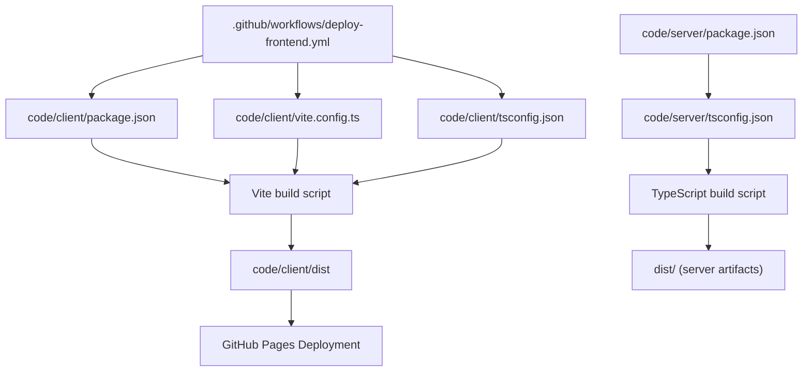
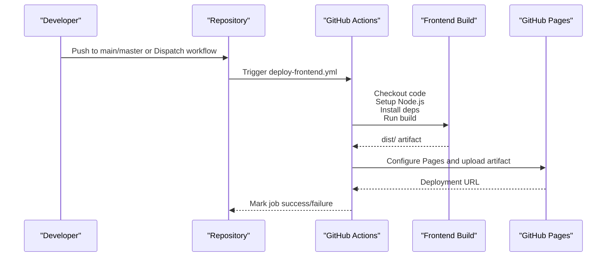
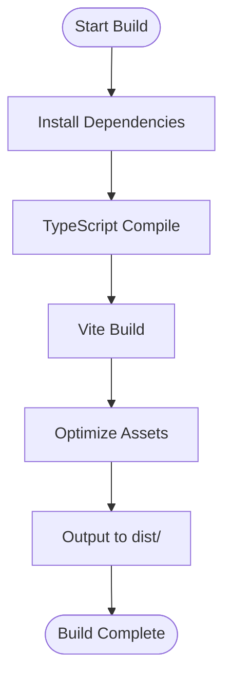
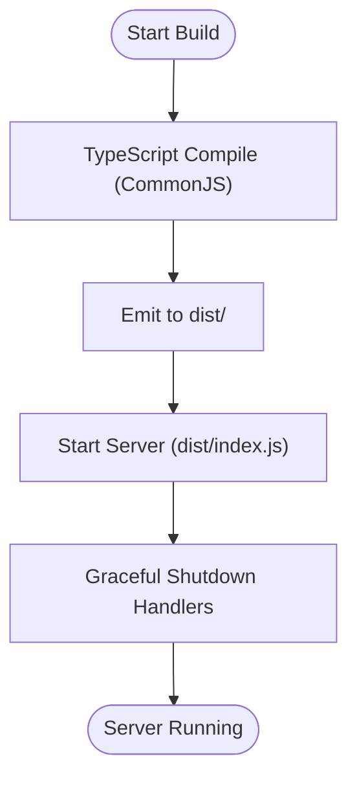
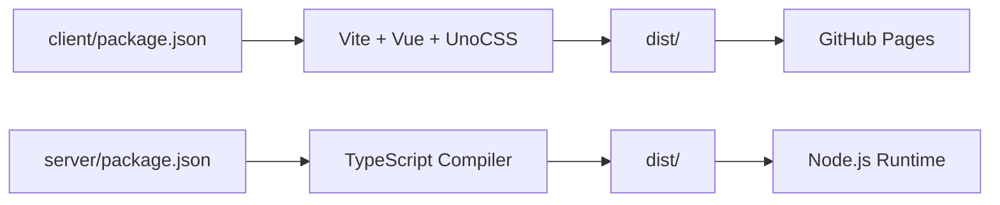

# CI/CD Pipeline

<cite>
**Referenced Files in This Document**
- [deploy-frontend.yml](file://.github/workflows/deploy-frontend.yml)
- [package.json](file://code/client/package.json)
- [vite.config.ts](file://code/client/vite.config.ts)
- [tsconfig.json](file://code/client/tsconfig.json)
- [main.ts](file://code/client/src/main.ts)
- [package.json](file://code/server/package.json)
- [tsconfig.json](file://code/server/tsconfig.json)
- [index.ts](file://code/server/src/index.ts)
- [knexfile.ts](file://code/server/knexfile.ts)
- [index.ts](file://code/server/src/config/index.ts)
</cite>

## Table of Contents
1. [Introduction](#introduction)
2. [Project Structure](#project-structure)
3. [Core Components](#core-components)
4. [Architecture Overview](#architecture-overview)
5. [Detailed Component Analysis](#detailed-component-analysis)
6. [Dependency Analysis](#dependency-analysis)
7. [Performance Considerations](#performance-considerations)
8. [Troubleshooting Guide](#troubleshooting-guide)
9. [Conclusion](#conclusion)
10. [Appendices](#appendices)

## Introduction
This document describes the CI/CD pipeline for Yule Notion, focusing on the current GitHub Actions workflow for frontend deployment to GitHub Pages, the frontend build pipeline with Vite and TypeScript, and the backend build process with TypeScript and dependency management. It also covers environment variable management, secrets handling, artifact deployment strategies, testing integration, customization examples, branch protection rules, deployment triggers, troubleshooting, and optimization techniques for faster builds.

## Project Structure
The repository organizes the frontend and backend under a single monorepo-like layout with separate package and configuration files for each layer. The CI/CD workflow is defined in a GitHub Actions YAML file located under the repository’s .github/workflows directory.

**Diagram sources**
- [deploy-frontend.yml:1-55](file://.github/workflows/deploy-frontend.yml#L1-L55)
- [package.json:1-53](file://code/client/package.json#L1-L53)
- [vite.config.ts:1-37](file://code/client/vite.config.ts#L1-L37)
- [tsconfig.json:1-35](file://code/client/tsconfig.json#L1-L35)
- [package.json:1-39](file://code/server/package.json#L1-L39)
- [tsconfig.json:1-27](file://code/server/tsconfig.json#L1-L27)

**Section sources**
- [.github/workflows/deploy-frontend.yml:1-55](file://.github/workflows/deploy-frontend.yml#L1-L55)
- [code/client/package.json:1-53](file://code/client/package.json#L1-L53)
- [code/client/vite.config.ts:1-37](file://code/client/vite.config.ts#L1-L37)
- [code/client/tsconfig.json:1-35](file://code/client/tsconfig.json#L1-L35)
- [code/server/package.json:1-39](file://code/server/package.json#L1-L39)
- [code/server/tsconfig.json:1-27](file://code/server/tsconfig.json#L1-L27)

## Core Components
- GitHub Actions workflow for frontend deployment to GitHub Pages
- Frontend build pipeline using Vite and TypeScript with Vue 3 Single-File Components
- Backend build pipeline using TypeScript compiler targeting Node.js
- Environment variable management with Zod schema validation and defaults
- Database configuration via Knex supporting development, test, and production environments

Key capabilities:
- Automated build and deployment of the frontend to GitHub Pages triggered by pushes to main/master or manual dispatch
- Type-safe environment configuration with runtime validation and production safety checks
- Database migration and seed commands exposed via npm scripts

**Section sources**
- [.github/workflows/deploy-frontend.yml:1-55](file://.github/workflows/deploy-frontend.yml#L1-L55)
- [code/client/package.json:1-53](file://code/client/package.json#L1-L53)
- [code/client/vite.config.ts:1-37](file://code/client/vite.config.ts#L1-L37)
- [code/client/tsconfig.json:1-35](file://code/client/tsconfig.json#L1-L35)
- [code/server/package.json:1-39](file://code/server/package.json#L1-L39)
- [code/server/tsconfig.json:1-27](file://code/server/tsconfig.json#L1-L27)
- [code/server/src/config/index.ts:1-101](file://code/server/src/config/index.ts#L1-L101)
- [code/server/knexfile.ts:1-69](file://code/server/knexfile.ts#L1-L69)

## Architecture Overview
The CI/CD pipeline currently focuses on frontend delivery to GitHub Pages. The workflow orchestrates checkout, Node.js setup, dependency installation, building the frontend, configuring GitHub Pages, uploading the built artifact, and deploying to GitHub Pages.

**Diagram sources**
- [deploy-frontend.yml:1-55](file://.github/workflows/deploy-frontend.yml#L1-L55)

**Section sources**
- [.github/workflows/deploy-frontend.yml:1-55](file://.github/workflows/deploy-frontend.yml#L1-L55)

## Detailed Component Analysis

### GitHub Actions Workflow: Frontend Deployment
- Triggers: push to main/master and workflow_dispatch
- Permissions: read for contents, write for pages and id-token
- Concurrency: grouped as 'pages' with in-progress cancellation disabled
- Jobs:
  - build: runs on ubuntu-latest, checks out code, sets up Node.js 20, installs client dependencies, builds the client, configures GitHub Pages, and uploads the dist artifact
  - deploy: runs after build, deploys the uploaded artifact to GitHub Pages and exposes the deployment URL

Customization examples:
- Add a linting job before build
- Add a test job using npm test in the client directory
- Introduce a separate backend job for server builds and deployments
- Gate deployment with approvals or status checks

Branch protection rules:
- Require the deployment job to succeed
- Require at least one reviewer approval
- Protect main/master from force-pushes and direct deletion

Deployment triggers:
- Automatic on push to main/master
- Manual dispatch for ad-hoc releases

**Section sources**
- [.github/workflows/deploy-frontend.yml:1-55](file://.github/workflows/deploy-frontend.yml#L1-L55)

### Frontend Build Pipeline: Vite, TypeScript, and Assets
- Scripts:
  - dev: starts Vite dev server
  - build: compiles TypeScript and runs Vite build
  - preview: serves the built assets locally
- Plugins and configuration:
  - Vue 3 plugin for SFC support
  - UnoCSS for atomic CSS
  - Path aliases configured to src
  - Dev server proxy configured for /api to backend service
- TypeScript configuration:
  - ES2020 target, ESNext module, bundler module resolution
  - Strict mode enabled with unused locals/parameters checks
  - Vue-specific types included
  - Path aliases mapped to src

Asset optimization:
- Vite handles code splitting, tree-shaking, and minification during build
- UnoCSS generates optimized atomic CSS

**Diagram sources**
- [package.json:1-53](file://code/client/package.json#L1-L53)
- [vite.config.ts:1-37](file://code/client/vite.config.ts#L1-L37)
- [tsconfig.json:1-35](file://code/client/tsconfig.json#L1-L35)

**Section sources**
- [code/client/package.json:1-53](file://code/client/package.json#L1-L53)
- [code/client/vite.config.ts:1-37](file://code/client/vite.config.ts#L1-L37)
- [code/client/tsconfig.json:1-35](file://code/client/tsconfig.json#L1-L35)

### Backend Build Pipeline: TypeScript Transpilation and Dependencies
- Scripts:
  - dev: watches TypeScript source and restarts on changes
  - build: compiles TypeScript to dist/
  - start: runs the compiled Node.js application
  - migrate/migrate:rollback/migrate:make: database migration helpers
- TypeScript configuration:
  - Target ES2022, CommonJS module, strict mode
  - Node module resolution, declaration/source maps enabled
  - Includes src/**/*

Runtime entrypoint:
- The server listens on the configured port and registers graceful shutdown handlers for SIGTERM/SIGINT
- Uncaught exceptions and unhandled rejections are logged and cause process exit

**Diagram sources**
- [package.json:1-39](file://code/server/package.json#L1-L39)
- [tsconfig.json:1-27](file://code/server/tsconfig.json#L1-L27)
- [index.ts:1-77](file://code/server/src/index.ts#L1-L77)

**Section sources**
- [code/server/package.json:1-39](file://code/server/package.json#L1-L39)
- [code/server/tsconfig.json:1-27](file://code/server/tsconfig.json#L1-L27)
- [code/server/src/index.ts:1-77](file://code/server/src/index.ts#L1-L77)

### Environment Variable Management and Secret Handling
- Frontend:
  - Uses Vite’s environment handling via .env files and build-time constants; no explicit secrets handling shown in the provided files
- Backend:
  - Zod schema validates and coerces environment variables with sensible defaults
  - Production enforcement requires:
    - JWT_SECRET set and at least 32 characters long
    - ALLOWED_ORIGINS configured (comma-separated domain list)
  - Database connections are controlled via DATABASE_URL and TEST_DATABASE_URL
  - Port and NODE_ENV are configurable

Secret handling recommendations:
- Store JWT_SECRET and database credentials in GitHub Secrets
- Reference secrets in the workflow using env or with GitHub Environments
- Avoid committing secrets to the repository

**Section sources**
- [code/server/src/config/index.ts:1-101](file://code/server/src/config/index.ts#L1-L101)
- [code/server/knexfile.ts:1-69](file://code/server/knexfile.ts#L1-L69)

### Artifact Deployment Strategy
- The workflow uploads the frontend dist folder as a Pages artifact and deploys it to GitHub Pages
- The backend does not currently publish artifacts in this workflow; it can be extended to build and publish server artifacts separately

**Section sources**
- [.github/workflows/deploy-frontend.yml:37-55](file://.github/workflows/deploy-frontend.yml#L37-L55)

### Testing Integration Within the Pipeline
- Current state:
  - No automated test jobs are defined in the workflow
  - Test reports exist under the test directory but are not integrated into CI
- Recommended additions:
  - Add a test job after dependency installation and before build to run unit/integration tests
  - Use npm test in the client directory and npm run test in the server directory if applicable
  - Gate deployment on passing tests

**Section sources**
- [.github/workflows/deploy-frontend.yml:1-55](file://.github/workflows/deploy-frontend.yml#L1-L55)

## Dependency Analysis
The frontend and backend are independent build units with distinct package managers and build tools. The frontend build depends on Vite and Vue plugins, while the backend depends on TypeScript and Express. Database configuration is centralized via Knex with environment-driven overrides.

**Diagram sources**
- [package.json:1-53](file://code/client/package.json#L1-L53)
- [vite.config.ts:1-37](file://code/client/vite.config.ts#L1-L37)
- [package.json:1-39](file://code/server/package.json#L1-L39)
- [tsconfig.json:1-27](file://code/server/tsconfig.json#L1-L27)

**Section sources**
- [code/client/package.json:1-53](file://code/client/package.json#L1-L53)
- [code/client/vite.config.ts:1-37](file://code/client/vite.config.ts#L1-L37)
- [code/server/package.json:1-39](file://code/server/package.json#L1-L39)
- [code/server/tsconfig.json:1-27](file://code/server/tsconfig.json#L1-L27)

## Performance Considerations
- Reuse Node.js cache across workflow runs to speed up dependency installation
- Enable Vite’s build caching and parallelism
- Split frontend and backend builds into separate jobs to reduce contention
- Use matrix builds for multiple Node.js versions if needed
- Minimize artifact sizes by excluding unnecessary files from uploads

[No sources needed since this section provides general guidance]

## Troubleshooting Guide
Common pipeline failures and resolutions:
- Node.js version mismatch:
  - Ensure the workflow uses a compatible Node.js version and aligns with local development
- Missing dependencies:
  - Verify working-directory is set to the correct project root and install scripts are present
- Build failures:
  - Check TypeScript configuration and plugin compatibility; confirm Vite configuration matches project structure
- GitHub Pages deployment errors:
  - Confirm Pages permissions and concurrency settings; ensure dist artifact exists and is uploaded
- Environment variable issues:
  - Validate Zod schema expectations; ensure production enforces JWT_SECRET and ALLOWED_ORIGINS requirements
- Database connectivity:
  - Confirm DATABASE_URL and TEST_DATABASE_URL are set appropriately for the environment

**Section sources**
- [.github/workflows/deploy-frontend.yml:1-55](file://.github/workflows/deploy-frontend.yml#L1-L55)
- [code/server/src/config/index.ts:52-67](file://code/server/src/config/index.ts#L52-L67)
- [code/server/knexfile.ts:1-69](file://code/server/knexfile.ts#L1-L69)

## Conclusion
The current CI/CD pipeline automates frontend builds and GitHub Pages deployment. To strengthen the pipeline, integrate backend builds, add automated testing, enforce environment variable safety, and expand deployment strategies. These enhancements will improve reliability, security, and developer velocity.

[No sources needed since this section summarizes without analyzing specific files]

## Appendices

### Appendix A: Frontend Build Details
- Build command: vue-tsc -b && vite build
- Dev server proxy: /api → http://localhost:3000
- Path aliases: @ → src
- Strict TypeScript settings with DOM and Vue types

**Section sources**
- [code/client/package.json:6-10](file://code/client/package.json#L6-L10)
- [code/client/vite.config.ts:23-32](file://code/client/vite.config.ts#L23-L32)
- [code/client/tsconfig.json:17-32](file://code/client/tsconfig.json#L17-L32)

### Appendix B: Backend Build Details
- Build command: tsc
- Runtime entrypoint: src/index.ts exports server for testing and graceful shutdown
- Database configuration: Knex supports development/test/production with environment overrides

**Section sources**
- [code/server/package.json:7-14](file://code/server/package.json#L7-L14)
- [code/server/src/index.ts:1-77](file://code/server/src/index.ts#L1-L77)
- [code/server/knexfile.ts:1-69](file://code/server/knexfile.ts#L1-L69)