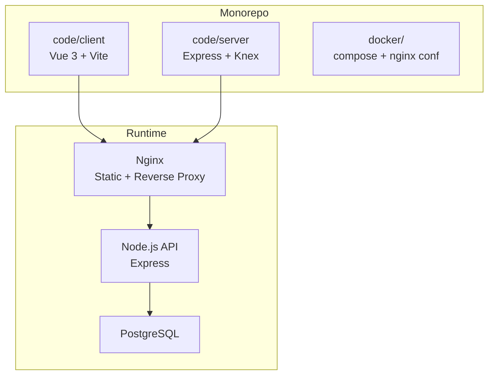
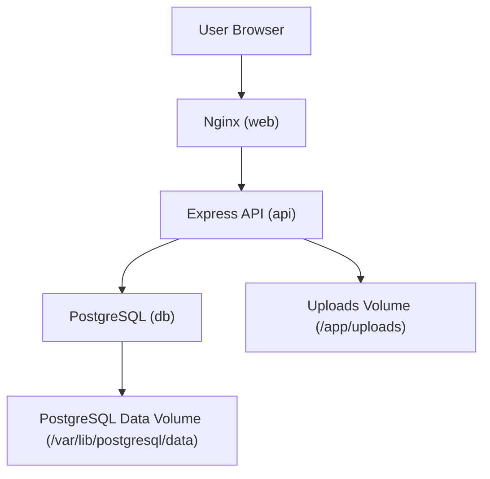
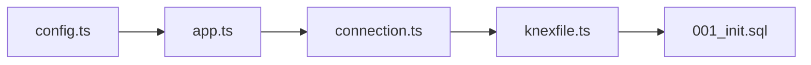

# Containerization & Docker

<cite>
**Referenced Files in This Document**
- [README.md](file://README.md)
- [ARCHITECTURE.md](file://arch/ARCHITECTURE.md)
- [deploy-frontend.yml](file://.github/workflows/deploy-frontend.yml)
- [package.json](file://code/client/package.json)
- [vite.config.ts](file://code/client/vite.config.ts)
- [package.json](file://code/server/package.json)
- [app.ts](file://code/server/src/app.ts)
- [index.ts](file://code/server/src/index.ts)
- [config.ts](file://code/server/src/config/index.ts)
- [connection.ts](file://code/server/src/db/connection.ts)
- [knexfile.ts](file://code/server/knexfile.ts)
- [001_init.sql](file://db/001_init.sql)
</cite>

## Table of Contents
1. [Introduction](#introduction)
2. [Project Structure](#project-structure)
3. [Core Components](#core-components)
4. [Architecture Overview](#architecture-overview)
5. [Detailed Component Analysis](#detailed-component-analysis)
6. [Dependency Analysis](#dependency-analysis)
7. [Performance Considerations](#performance-considerations)
8. [Troubleshooting Guide](#troubleshooting-guide)
9. [Conclusion](#conclusion)
10. [Appendices](#appendices)

## Introduction
This document provides a comprehensive containerization and Docker strategy for Yule Notion, covering both frontend and backend services. It explains multi-stage builds, base image selection, layer optimization, orchestration patterns, networking, volumes, Docker Compose for local and staging environments, security practices, resource limits, health checks, registry integration, image scanning, vulnerability management, scaling, load balancing, service discovery, and troubleshooting.

## Project Structure
Yule Notion follows a monorepo layout with separate client and server packages. The architecture document outlines Docker and Docker Compose usage for local development and staging, including Nginx for static assets and reverse proxy, Node.js Express API, and PostgreSQL.

**Diagram sources**
- [ARCHITECTURE.md](file://arch/ARCHITECTURE.md)
- [README.md](file://README.md)

**Section sources**
- [README.md](file://README.md)
- [ARCHITECTURE.md](file://arch/ARCHITECTURE.md)

## Core Components
- Frontend (Client): Vue 3 SPA built with Vite; served via Nginx in containers.
- Backend (Server): Node.js Express API with TypeScript, Knex for migrations, Pino logging, Helmet/CORS/rate limiting, and health endpoint.
- Database: PostgreSQL with migrations and seed support.
- Orchestration: Docker Compose for local/staging with Nginx, API, and DB.

Key runtime behaviors impacting containerization:
- Health check endpoint exposed at a standard path for readiness/liveness probes.
- Environment-driven configuration with strict production validation.
- Database connection via connection string with pooling.
- Uploads stored on mounted volumes for persistence.

**Section sources**
- [app.ts](file://code/server/src/app.ts)
- [config.ts](file://code/server/src/config/index.ts)
- [connection.ts](file://code/server/src/db/connection.ts)
- [knexfile.ts](file://code/server/knexfile.ts)
- [ARCHITECTURE.md](file://arch/ARCHITECTURE.md)

## Architecture Overview
The containerized stack consists of:
- Nginx container serving static assets and proxying API requests.
- Node.js API container exposing REST endpoints and health checks.
- PostgreSQL container with persistent volumes for data and uploads.

**Diagram sources**
- [ARCHITECTURE.md](file://arch/ARCHITECTURE.md)

**Section sources**
- [ARCHITECTURE.md](file://arch/ARCHITECTURE.md)

## Detailed Component Analysis

### Frontend Containerization Strategy
- Base image: Use a minimal Nginx base for serving static SPA and proxying API requests.
- Build pipeline: Use Vite to produce optimized static assets; upload artifacts to Nginx.
- Proxy configuration: Route /api to backend service for development and staging.
- Health checks: No dedicated frontend health endpoint; rely on Nginx availability and static asset serving.

Implementation anchors:
- Vite dev server proxy targets backend port for local development.
- Nginx reverse proxy configured to forward /api to backend service.

**Section sources**
- [vite.config.ts](file://code/client/vite.config.ts)
- [ARCHITECTURE.md](file://arch/ARCHITECTURE.md)

### Backend Containerization Strategy
- Multi-stage build:
  - Stage 1: Build-time dependencies and TypeScript compilation.
  - Stage 2: Minimal runtime image with only production binaries and runtime libraries.
- Base image: Alpine or Debian slim for Node.js runtime.
- Layer optimization:
  - Install build dependencies only during build stage.
  - Copy only necessary runtime files (dist, node_modules from build stage).
  - Use .dockerignore to exclude dev artifacts.
- Entrypoint: Start compiled Node.js binary.
- Health checks: Expose a lightweight health endpoint returning status and timestamp.
- Environment configuration: Load from environment variables validated at startup.

Security and operational controls:
- Run as non-root user.
- Drop unnecessary capabilities.
- Mount uploads directory as a named volume.
- Configure resource limits (CPU/Memory) in Compose.

**Section sources**
- [app.ts](file://code/server/src/app.ts)
- [config.ts](file://code/server/src/config/index.ts)
- [package.json](file://code/server/package.json)

### Database Containerization
- Base image: Official PostgreSQL Alpine variant.
- Persistence:
  - Data directory mounted to a named volume for durability.
  - Uploads directory mounted to a named volume for images.
- Initialization:
  - Use migration scripts to initialize schema.
  - Optionally seed initial data via Knex seeds.

**Section sources**
- [knexfile.ts](file://code/server/knexfile.ts)
- [001_init.sql](file://db/001_init.sql)
- [ARCHITECTURE.md](file://arch/ARCHITECTURE.md)

### Orchestration with Docker Compose
Compose services:
- web: Nginx; serves static SPA and proxies /api to backend.
- api: Node.js Express; exposes health endpoint and handles uploads.
- db: PostgreSQL; persists data and supports migrations.

Networking:
- Services communicate over a shared network.
- Ports mapped for local development (web 80:80, api 3000:3000).

Volumes:
- Named volumes for PostgreSQL data and uploads directory.

Environment variables:
- Production-grade secrets managed externally (e.g., Compose env files or secrets manager).

**Section sources**
- [ARCHITECTURE.md](file://arch/ARCHITECTURE.md)

### Security Practices
- Secrets management:
  - Store JWT_SECRET and other secrets outside the image (env files/secrets manager).
  - Enforce production validation for secrets length and presence.
- Least privilege:
  - Run containers with non-root users.
  - Minimize installed packages and capabilities.
- Network policies:
  - Restrict inbound ports; only expose necessary ports.
  - Use internal networks for service-to-service communication.
- Image hygiene:
  - Pin base image digests.
  - Regularly update base images and dependencies.

**Section sources**
- [config.ts](file://code/server/src/config/index.ts)
- [ARCHITECTURE.md](file://arch/ARCHITECTURE.md)

### Resource Limits and Health Checks
- Health checks:
  - Implement a lightweight GET endpoint returning status and timestamp.
  - Use Compose healthcheck directives to monitor readiness and liveness.
- Resource limits:
  - Set CPU and memory constraints per service in Compose.
  - Tune database pool sizes and Node.js worker threads accordingly.

**Section sources**
- [app.ts](file://code/server/src/app.ts)
- [ARCHITECTURE.md](file://arch/ARCHITECTURE.md)

### Registry Integration, Scanning, and Vulnerability Management
- Registry integration:
  - Push images to a container registry with semantic tags (e.g., latest, vX.Y.Z).
  - Use digest pinning for immutable deployments.
- Image scanning:
  - Integrate automated scanning in CI/CD pipelines.
  - Fail builds on critical vulnerabilities.
- Vulnerability management:
  - Maintain a vulnerability triage process.
  - Rotate secrets and rebuild images after patches.

[No sources needed since this section provides general guidance]

### Scaling, Load Balancing, and Service Discovery
- Horizontal scaling:
  - Scale API replicas behind a reverse proxy or load balancer.
  - Ensure stateless API design; persist uploads via shared volumes or object storage.
- Load balancing:
  - Use Nginx or platform LB to distribute traffic across API instances.
- Service discovery:
  - For Kubernetes, use Services and headless Services for stateful sets.
  - For Compose, rely on service names and internal DNS.

[No sources needed since this section provides general guidance]

## Dependency Analysis
The backend service depends on:
- Database connectivity via connection string.
- Environment configuration validated at startup.
- Uploads directory mounted for persistence.

**Diagram sources**
- [config.ts](file://code/server/src/config/index.ts)
- [app.ts](file://code/server/src/app.ts)
- [connection.ts](file://code/server/src/db/connection.ts)
- [knexfile.ts](file://code/server/knexfile.ts)
- [001_init.sql](file://db/001_init.sql)

**Section sources**
- [config.ts](file://code/server/src/config/index.ts)
- [app.ts](file://code/server/src/app.ts)
- [connection.ts](file://code/server/src/db/connection.ts)
- [knexfile.ts](file://code/server/knexfile.ts)
- [001_init.sql](file://db/001_init.sql)

## Performance Considerations
- Build optimization:
  - Use multi-stage builds to minimize runtime image size.
  - Leverage layer caching by ordering COPY/INSTALL steps.
- Runtime optimization:
  - Tune database pool sizes and Node.js event loop.
  - Enable gzip/static compression in Nginx.
- Observability:
  - Centralize logs with structured JSON.
  - Add metrics collection for API latency and DB queries.

[No sources needed since this section provides general guidance]

## Troubleshooting Guide
Common issues and resolutions:
- Health check failures:
  - Verify health endpoint availability and response format.
  - Check container logs for startup errors.
- Database connectivity:
  - Confirm DATABASE_URL format and credentials.
  - Ensure database is reachable and migrations executed.
- Uploads not persisted:
  - Verify uploads volume is mounted and writable.
- CORS/proxy errors:
  - Validate Nginx proxy configuration and allowed origins.
- Port conflicts:
  - Adjust host port mappings in Compose.

**Section sources**
- [app.ts](file://code/server/src/app.ts)
- [config.ts](file://code/server/src/config/index.ts)
- [connection.ts](file://code/server/src/db/connection.ts)
- [ARCHITECTURE.md](file://arch/ARCHITECTURE.md)

## Conclusion
Yule Notion’s containerization leverages a clear separation between Nginx, API, and database services. By adopting multi-stage builds, minimal base images, strict environment validation, and robust orchestration, the system achieves secure, scalable, and maintainable deployments. Integrating image scanning, health checks, and resource limits ensures reliable operations across local and staging environments.

[No sources needed since this section summarizes without analyzing specific files]

## Appendices

### Appendix A: CI/CD and Frontend Deployment
- Frontend is deployed to GitHub Pages via a GitHub Actions workflow using Node.js and Vite.
- Backend CI/CD is implied by the architecture document’s mention of Docker builds and deployments.

**Section sources**
- [.github/workflows/deploy-frontend.yml](file://.github/workflows/deploy-frontend.yml)
- [README.md](file://README.md)

### Appendix B: Example Commands and Paths
- Build frontend: see client package scripts.
- Build backend: see server package scripts.
- Run migrations: see server package scripts.
- Health endpoint: see backend app route.

**Section sources**
- [package.json](file://code/client/package.json)
- [package.json](file://code/server/package.json)
- [app.ts](file://code/server/src/app.ts)