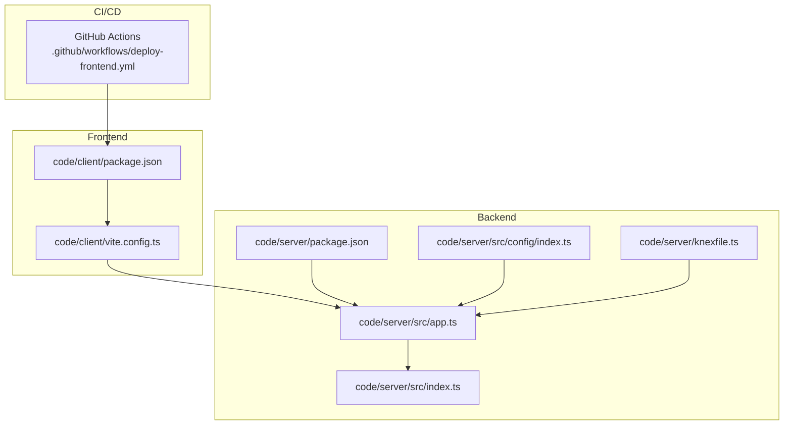
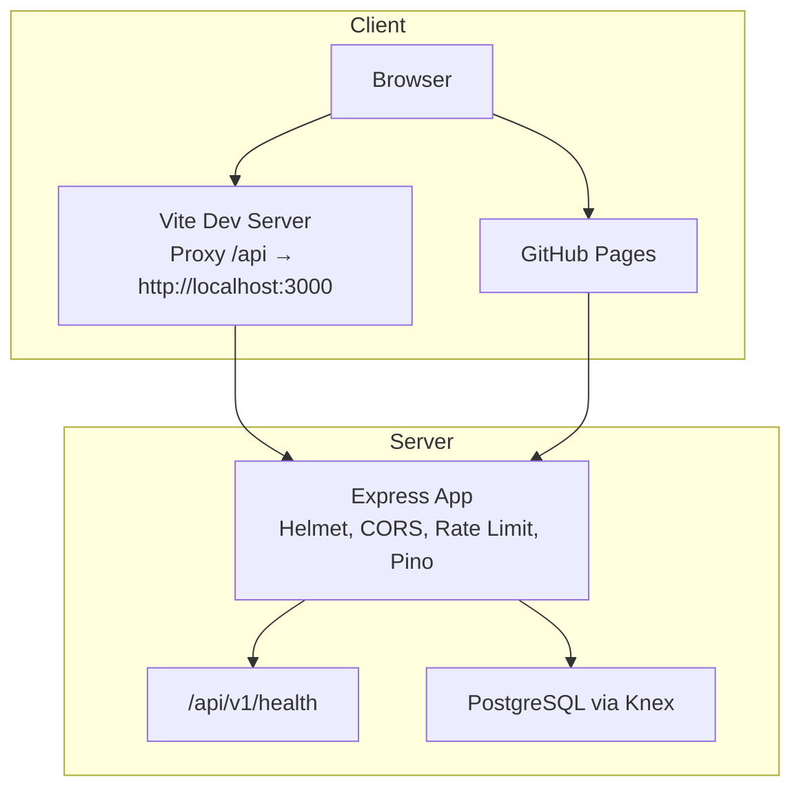
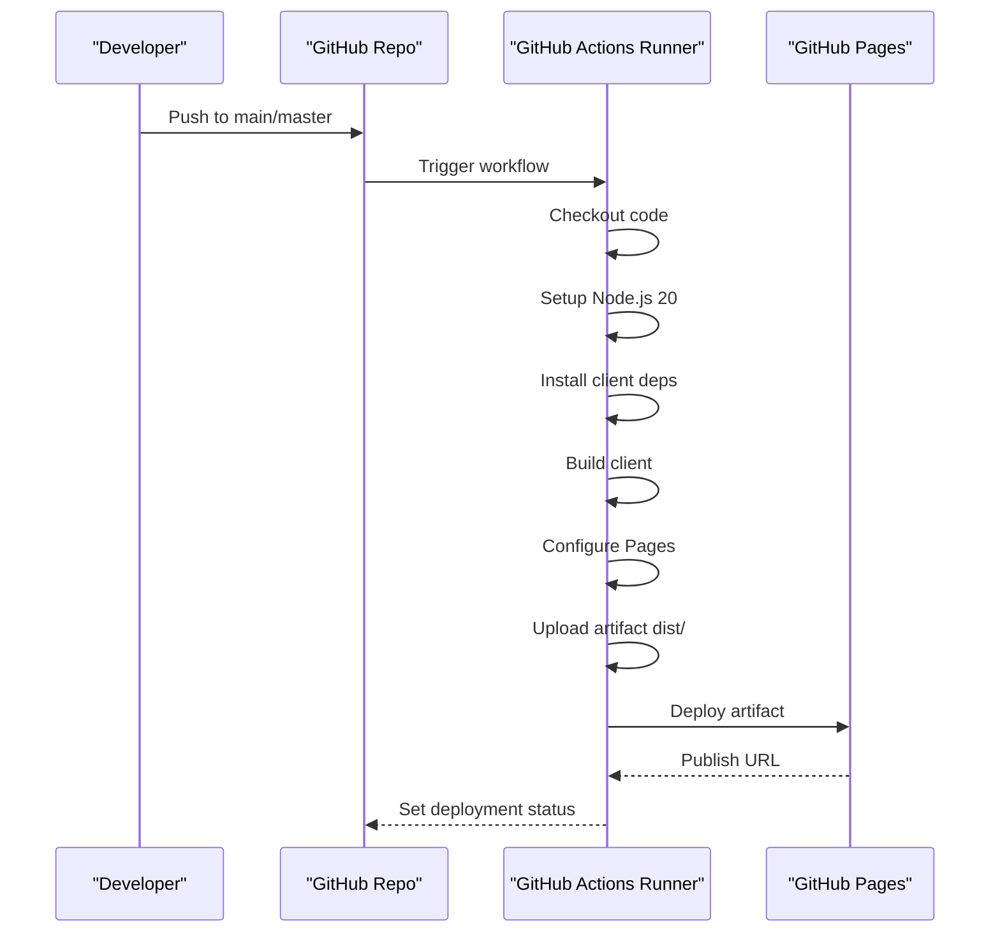
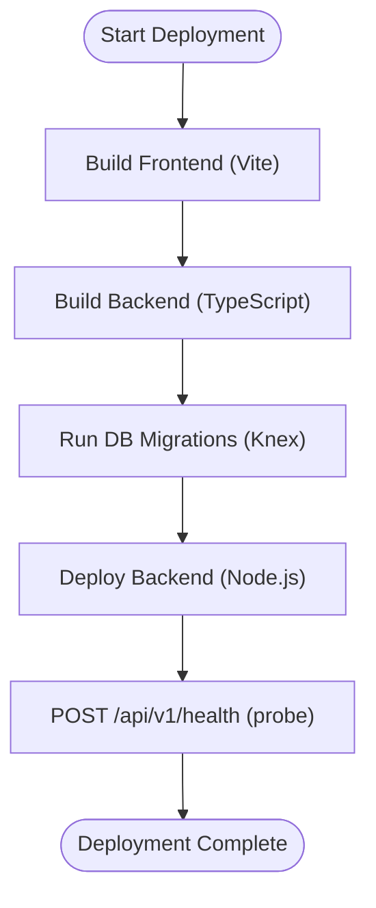
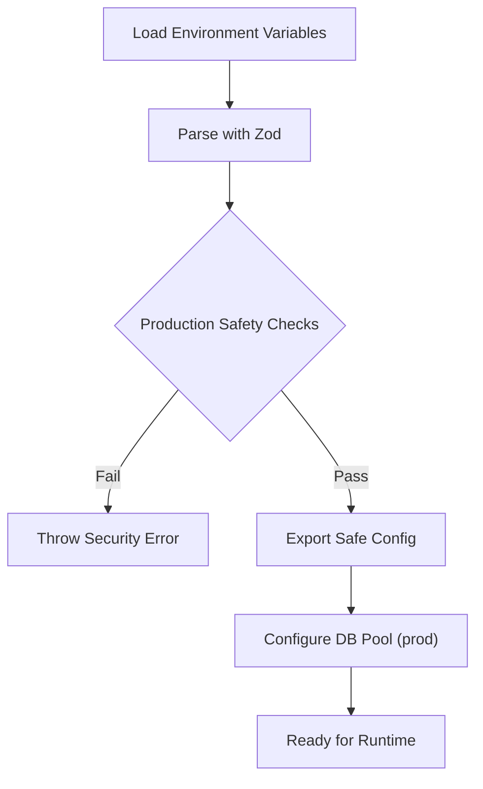
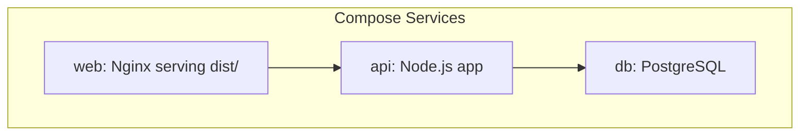
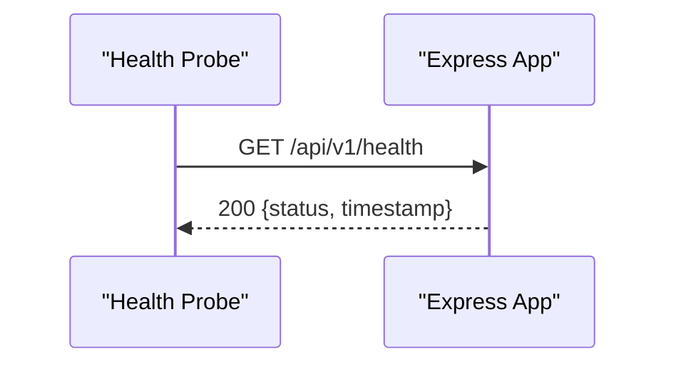
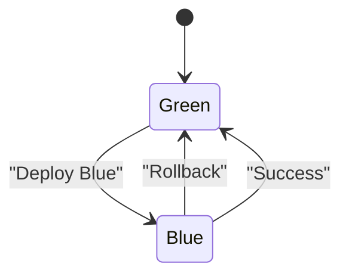
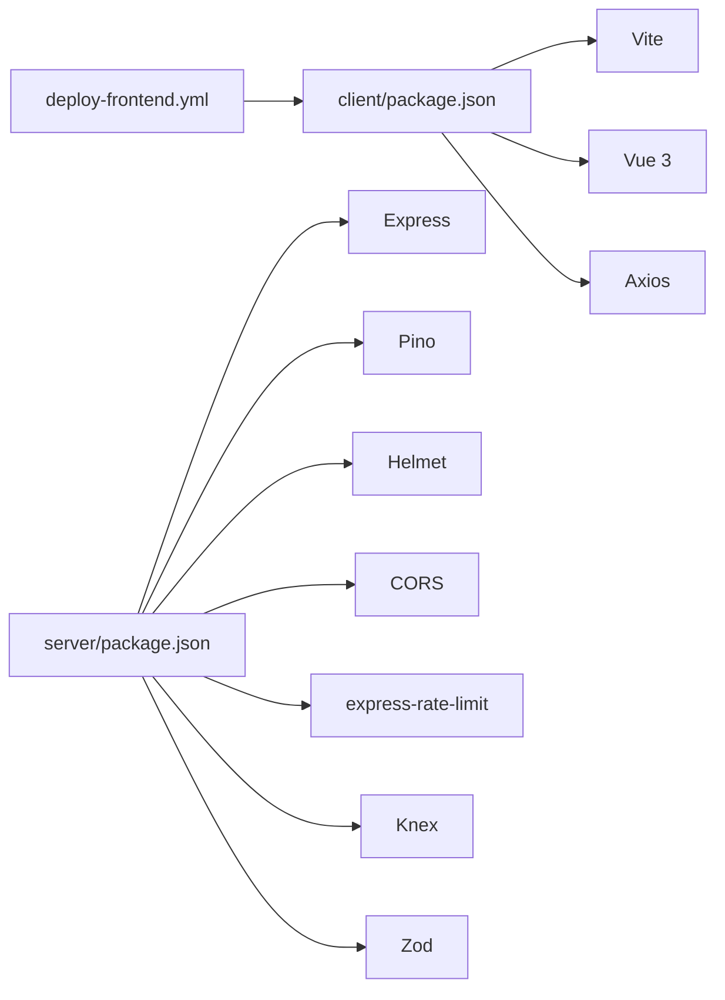

# Deployment & DevOps

<cite>
**Referenced Files in This Document**
- [README.md](file://README.md)
- [.github/workflows/deploy-frontend.yml](file://.github/workflows/deploy-frontend.yml)
- [code/client/package.json](file://code/client/package.json)
- [code/client/vite.config.ts](file://code/client/vite.config.ts)
- [code/server/package.json](file://code/server/package.json)
- [code/server/src/config/index.ts](file://code/server/src/config/index.ts)
- [code/server/knexfile.ts](file://code/server/knexfile.ts)
- [code/server/src/app.ts](file://code/server/src/app.ts)
- [code/server/src/index.ts](file://code/server/src/index.ts)
- [arch/ARCHITECTURE.md](file://arch/ARCHITECTURE.md)
</cite>

## Table of Contents
1. [Introduction](#introduction)
2. [Project Structure](#project-structure)
3. [Core Components](#core-components)
4. [Architecture Overview](#architecture-overview)
5. [Detailed Component Analysis](#detailed-component-analysis)
6. [Dependency Analysis](#dependency-analysis)
7. [Performance Considerations](#performance-considerations)
8. [Troubleshooting Guide](#troubleshooting-guide)
9. [Conclusion](#conclusion)
10. [Appendices](#appendices)

## Introduction
This document provides comprehensive deployment and DevOps guidance for Yule Notion. It covers CI/CD with GitHub Actions, automated testing, production deployment, environment configuration, infrastructure requirements, containerization strategy, deployment optimization, monitoring/logging, health checks/alerting, rollback/blue-green/blue/roll deployment strategies, secrets management, and scaling considerations.

## Project Structure
Yule Notion is a full-stack application with a frontend built with Vue 3 and a Node.js/Express backend. The repository includes:
- Frontend (code/client): Vue 3 + Vite build, with development proxy to backend
- Backend (code/server): Express server with TypeScript, Knex migrations, and Pino logging
- CI/CD: GitHub Actions workflow for frontend deployment to GitHub Pages
- Architecture docs: Docker Compose deployment model and environment variable reference

**Diagram sources**
- [code/client/package.json:1-53](file://code/client/package.json#L1-L53)
- [code/client/vite.config.ts:1-37](file://code/client/vite.config.ts#L1-L37)
- [code/server/package.json:1-39](file://code/server/package.json#L1-L39)
- [code/server/src/config/index.ts:1-101](file://code/server/src/config/index.ts#L1-L101)
- [code/server/src/app.ts:1-121](file://code/server/src/app.ts#L1-L121)
- [code/server/src/index.ts:1-77](file://code/server/src/index.ts#L1-L77)
- [code/server/knexfile.ts:1-69](file://code/server/knexfile.ts#L1-L69)
- [.github/workflows/deploy-frontend.yml:1-55](file://.github/workflows/deploy-frontend.yml#L1-L55)

**Section sources**
- [README.md:1-119](file://README.md#L1-L119)
- [.github/workflows/deploy-frontend.yml:1-55](file://.github/workflows/deploy-frontend.yml#L1-L55)
- [code/client/package.json:1-53](file://code/client/package.json#L1-L53)
- [code/client/vite.config.ts:1-37](file://code/client/vite.config.ts#L1-L37)
- [code/server/package.json:1-39](file://code/server/package.json#L1-L39)
- [code/server/src/config/index.ts:1-101](file://code/server/src/config/index.ts#L1-L101)
- [code/server/src/app.ts:1-121](file://code/server/src/app.ts#L1-L121)
- [code/server/src/index.ts:1-77](file://code/server/src/index.ts#L1-L77)
- [code/server/knexfile.ts:1-69](file://code/server/knexfile.ts#L1-L69)
- [arch/ARCHITECTURE.md:547-600](file://arch/ARCHITECTURE.md#L547-L600)

## Core Components
- Frontend build and proxy:
  - Vite-based build with development proxy to backend API
  - Scripts for dev/build/preview
- Backend runtime and configuration:
  - Express app with security middleware, CORS, rate limiting, and Pino logging
  - Environment-driven configuration with Zod validation and production safety checks
  - Graceful shutdown handling and health endpoint
  - Knex migrations and connection pooling for PostgreSQL
- CI/CD:
  - GitHub Actions workflow to build and deploy frontend to GitHub Pages on pushes to main/master

Key deployment-relevant behaviors:
- Health check endpoint exposed at GET /api/v1/health
- Graceful shutdown on SIGTERM/SIGINT
- Environment variables validated and enforced for production
- Database configuration supports development/test/production with pooling in production

**Section sources**
- [code/client/vite.config.ts:1-37](file://code/client/vite.config.ts#L1-L37)
- [code/client/package.json:1-53](file://code/client/package.json#L1-L53)
- [code/server/src/app.ts:1-121](file://code/server/src/app.ts#L1-L121)
- [code/server/src/config/index.ts:1-101](file://code/server/src/config/index.ts#L1-L101)
- [code/server/src/index.ts:1-77](file://code/server/src/index.ts#L1-L77)
- [code/server/knexfile.ts:1-69](file://code/server/knexfile.ts#L1-L69)
- [.github/workflows/deploy-frontend.yml:1-55](file://.github/workflows/deploy-frontend.yml#L1-L55)

## Architecture Overview
The system consists of:
- Frontend: Static SPA built via Vite and served via GitHub Pages
- Backend: Node.js/Express API with PostgreSQL via Knex
- Optional Docker Compose model for local/VM deployments (see architecture docs)

**Diagram sources**
- [code/client/vite.config.ts:23-32](file://code/client/vite.config.ts#L23-L32)
- [code/server/src/app.ts:101-104](file://code/server/src/app.ts#L101-L104)
- [code/server/src/config/index.ts:16-36](file://code/server/src/config/index.ts#L16-L36)
- [code/server/knexfile.ts:43-57](file://code/server/knexfile.ts#L43-L57)
- [.github/workflows/deploy-frontend.yml:1-55](file://.github/workflows/deploy-frontend.yml#L1-L55)

**Section sources**
- [code/client/vite.config.ts:1-37](file://code/client/vite.config.ts#L1-L37)
- [code/server/src/app.ts:1-121](file://code/server/src/app.ts#L1-L121)
- [code/server/src/config/index.ts:1-101](file://code/server/src/config/index.ts#L1-L101)
- [code/server/knexfile.ts:1-69](file://code/server/knexfile.ts#L1-L69)
- [.github/workflows/deploy-frontend.yml:1-55](file://.github/workflows/deploy-frontend.yml#L1-L55)

## Detailed Component Analysis

### CI/CD Pipeline with GitHub Actions
- Trigger: Push to main/master or manual dispatch
- Permissions: Read content, write Pages, write ID tokens
- Concurrency: Group “pages”, cancel in-progress
- Jobs:
  - Build: checkout, setup Node.js 20, install client deps, build client, configure GitHub Pages, upload artifact
  - Deploy: environment “github-pages” with page URL output

**Diagram sources**
- [.github/workflows/deploy-frontend.yml:1-55](file://.github/workflows/deploy-frontend.yml#L1-L55)

**Section sources**
- [.github/workflows/deploy-frontend.yml:1-55](file://.github/workflows/deploy-frontend.yml#L1-L55)

### Production Deployment Process
- Build artifacts:
  - Frontend: Vite build outputs static assets to code/client/dist
  - Backend: Node.js build produces compiled server code
- Deployment targets:
  - GitHub Pages for frontend (configured in workflow)
  - Alternative: Docker Compose model documented in architecture docs for VM/local deployments
- Database migration:
  - Use Knex CLI scripts to run migrations in production
- Health checks:
  - GET /api/v1/health endpoint for readiness/liveness probes

**Diagram sources**
- [code/client/package.json:6-10](file://code/client/package.json#L6-L10)
- [code/server/package.json:7-14](file://code/server/package.json#L7-L14)
- [code/server/knexfile.ts:10-19](file://code/server/knexfile.ts#L10-L19)
- [code/server/src/app.ts:101-104](file://code/server/src/app.ts#L101-L104)

**Section sources**
- [code/client/package.json:1-53](file://code/client/package.json#L1-L53)
- [code/server/package.json:1-39](file://code/server/package.json#L1-L39)
- [code/server/knexfile.ts:1-69](file://code/server/knexfile.ts#L1-L69)
- [code/server/src/app.ts:101-104](file://code/server/src/app.ts#L101-L104)

### Environment Configuration and Secrets Management
- Environment variables validated at startup with Zod:
  - PORT, NODE_ENV, DATABASE_URL, JWT_SECRET, JWT_EXPIRES_IN, ALLOWED_ORIGINS
- Production safety checks:
  - JWT_SECRET must be set and at least 32 characters
  - ALLOWED_ORIGINS must be configured (domain whitelist)
- Database configuration:
  - Knex supports development/test/production with pool sizing in production
- Secrets:
  - Store JWT_SECRET and sensitive environment variables in repository secrets or platform secret manager
  - Never commit secrets to the repository

**Diagram sources**
- [code/server/src/config/index.ts:16-67](file://code/server/src/config/index.ts#L16-L67)
- [code/server/knexfile.ts:43-57](file://code/server/knexfile.ts#L43-L57)

**Section sources**
- [code/server/src/config/index.ts:1-101](file://code/server/src/config/index.ts#L1-L101)
- [code/server/knexfile.ts:1-69](file://code/server/knexfile.ts#L1-L69)

### Infrastructure Requirements
- Hosts:
  - Web server for serving frontend static assets (GitHub Pages)
  - Application server for Node.js backend
  - PostgreSQL database
- Ports:
  - Backend listens on configurable PORT (default 3000)
- Optional:
  - Reverse proxy/load balancer for HTTPS termination and routing
  - Redis for sessions (optional per README)

**Section sources**
- [README.md:45-49](file://README.md#L45-L49)
- [code/server/src/config/index.ts:17-18](file://code/server/src/config/index.ts#L17-L18)
- [arch/ARCHITECTURE.md:547-600](file://arch/ARCHITECTURE.md#L547-L600)

### Containerization Strategy and Multi-Stage Builds
- Docker Compose model:
  - Separate services for web (Nginx/static), api (Node.js), and db (PostgreSQL)
  - Environment variables passed to API service (DATABASE_URL, JWT_SECRET, UPLOAD_DIR)
  - Named volumes for uploads and PostgreSQL data
- Multi-stage builds:
  - Recommended to build frontend/backend in separate stages to reduce image size
  - Use a minimal runtime image for Node.js and copy only necessary artifacts

**Diagram sources**
- [arch/ARCHITECTURE.md:547-585](file://arch/ARCHITECTURE.md#L547-L585)

**Section sources**
- [arch/ARCHITECTURE.md:547-600](file://arch/ARCHITECTURE.md#L547-L600)

### Monitoring, Logging, Health Checks, and Alerting
- Logging:
  - Pino structured logs; pretty printing in development, JSON in production
- Health checks:
  - GET /api/v1/health endpoint returns status and timestamp
- Observability:
  - Integrate log aggregation (e.g., ELK/Fluent Bit) and metrics collection
  - Use health endpoint for Kubernetes readiness/liveness probes
- Alerting:
  - Monitor error rates, latency, and database connectivity
  - Alert on failed health checks and uncaught exceptions

**Diagram sources**
- [code/server/src/app.ts:101-104](file://code/server/src/app.ts#L101-L104)

**Section sources**
- [code/server/src/app.ts:29-41](file://code/server/src/app.ts#L29-L41)
- [code/server/src/app.ts:101-104](file://code/server/src/app.ts#L101-L104)

### Rollback, Blue-Green, and Zero-Downtime Strategies
- Blue-Green:
  - Run two identical environments behind a load balancer; switch traffic after validation
- Rolling updates:
  - Graceful shutdown on SIGTERM allows rolling restarts without downtime
- Rollback:
  - Keep previous container images/tagged versions
  - Re-deploy previous version on failure
- Health checks:
  - Use readiness probe to prevent traffic during startup
  - Use liveness probe to auto-restart unhealthy instances

**Diagram sources**
- [code/server/src/index.ts:35-52](file://code/server/src/index.ts#L35-L52)

**Section sources**
- [code/server/src/index.ts:1-77](file://code/server/src/index.ts#L1-L77)

### Scaling Considerations
- Horizontal scaling:
  - Stateless backend; scale replicas behind a load balancer
  - Use sticky sessions only if required (not applicable for current auth flow)
- Database:
  - Use managed PostgreSQL with read replicas if needed
  - Connection pooling configured in production
- Caching:
  - Consider Redis for session storage and caching (optional per README)
- CDN:
  - Serve frontend assets via CDN for global distribution

**Section sources**
- [code/server/knexfile.ts:53-57](file://code/server/knexfile.ts#L53-L57)
- [README.md:45-49](file://README.md#L45-L49)

## Dependency Analysis
- Frontend depends on:
  - Vite for build and dev server
  - Vue 3 ecosystem and Axios for HTTP
- Backend depends on:
  - Express, Pino, Helmet, CORS, Rate Limit, Knex, Zod
- CI/CD depends on:
  - GitHub Actions runner, Node.js setup, Pages configuration

**Diagram sources**
- [code/client/package.json:1-53](file://code/client/package.json#L1-L53)
- [code/server/package.json:1-39](file://code/server/package.json#L1-L39)
- [.github/workflows/deploy-frontend.yml:1-55](file://.github/workflows/deploy-frontend.yml#L1-L55)

**Section sources**
- [code/client/package.json:1-53](file://code/client/package.json#L1-L53)
- [code/server/package.json:1-39](file://code/server/package.json#L1-L39)
- [.github/workflows/deploy-frontend.yml:1-55](file://.github/workflows/deploy-frontend.yml#L1-L55)

## Performance Considerations
- Build optimization:
  - Use Vite’s production build for frontend
  - Enable gzip/brotli compression on web server
- Backend:
  - Keep middleware order efficient (security first, then rate limiting, then logging)
  - Tune database pool size for production workload
- Health checks:
  - Lightweight endpoint for quick probing
- Caching:
  - Cache static assets and non-sensitive data where appropriate

[No sources needed since this section provides general guidance]

## Troubleshooting Guide
- Health endpoint failures:
  - Verify backend is listening on configured PORT
  - Check environment variables and database connectivity
- Graceful shutdown:
  - Ensure SIGTERM/SIGINT handlers are invoked (e.g., container lifecycle)
- Database migrations:
  - Confirm Knex migrations are applied before startup
- CORS and JWT:
  - Validate ALLOWED_ORIGINS and JWT_SECRET in production

**Section sources**
- [code/server/src/app.ts:101-104](file://code/server/src/app.ts#L101-L104)
- [code/server/src/index.ts:35-52](file://code/server/src/index.ts#L35-L52)
- [code/server/knexfile.ts:10-19](file://code/server/knexfile.ts#L10-L19)
- [code/server/src/config/index.ts:52-67](file://code/server/src/config/index.ts#L52-L67)

## Conclusion
Yule Notion provides a clear separation between frontend and backend, with a robust configuration system, health checks, and a CI/CD pipeline for frontend delivery. For production, enforce environment validation, secure secrets, and adopt blue-green or rolling updates with health checks. Consider containerization with multi-stage builds, proper logging, and observability for reliable operations.

[No sources needed since this section summarizes without analyzing specific files]

## Appendices

### Environment Variables Reference
- NODE_ENV: development | production | test
- PORT: backend port (default 3000)
- DATABASE_URL: PostgreSQL connection string
- JWT_SECRET: signing key (required in production, minimum length 32)
- JWT_EXPIRES_IN: token expiry (default 7d)
- ALLOWED_ORIGINS: comma-separated domain whitelist (required in production)

**Section sources**
- [code/server/src/config/index.ts:16-36](file://code/server/src/config/index.ts#L16-L36)

### Database Migration Commands
- Create migration: npm run migrate:make -- <migration-name>
- Apply migrations: npm run migrate
- Rollback last batch: npm run migrate:rollback

**Section sources**
- [code/server/package.json:11-13](file://code/server/package.json#L11-L13)