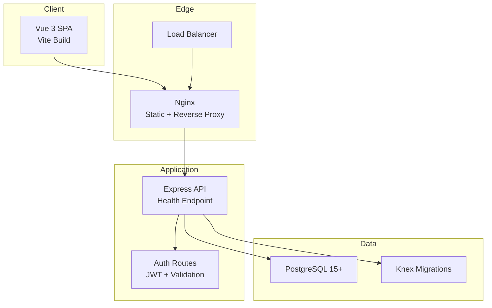
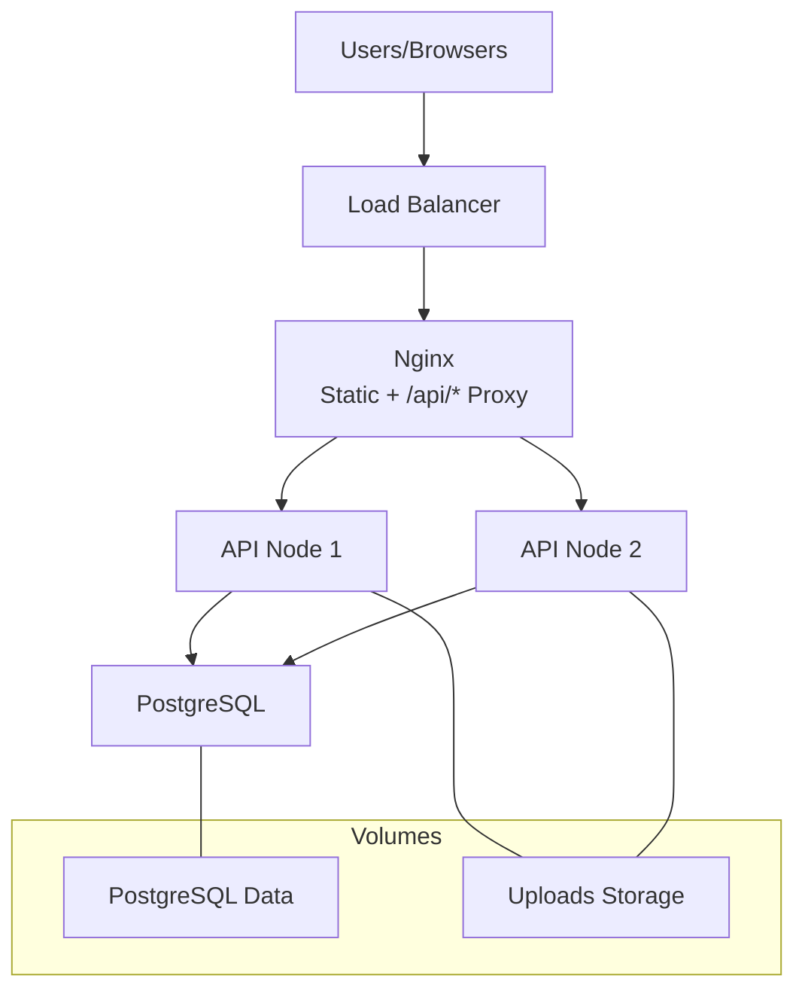
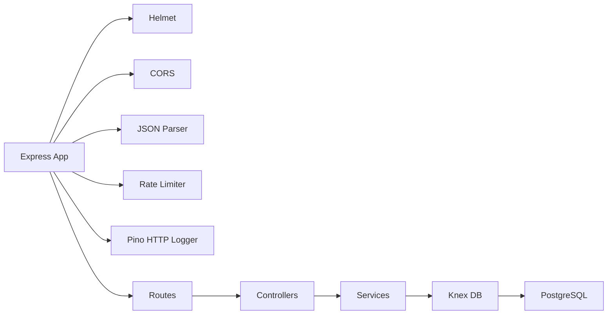

# Production Deployment

<cite>
**Referenced Files in This Document**
- [README.md](file://README.md)
- [ARCHITECTURE.md](file://arch/ARCHITECTURE.md)
- [app.ts](file://code/server/src/app.ts)
- [config/index.ts](file://code/server/src/config/index.ts)
- [knexfile.ts](file://code/server/knexfile.ts)
- [connection.ts](file://code/server/src/db/connection.ts)
- [errorHandler.ts](file://code/server/src/middleware/errorHandler.ts)
- [auth.routes.ts](file://code/server/src/routes/auth.routes.ts)
- [auth.controller.ts](file://code/server/src/controllers/auth.controller.ts)
- [001_init.sql](file://db/001_init.sql)
- [deploy-frontend.yml](file://.github/workflows/deploy-frontend.yml)
- [package.json](file://code/server/package.json)
</cite>

## Table of Contents
1. [Introduction](#introduction)
2. [Project Structure](#project-structure)
3. [Core Components](#core-components)
4. [Architecture Overview](#architecture-overview)
5. [Detailed Component Analysis](#detailed-component-analysis)
6. [Dependency Analysis](#dependency-analysis)
7. [Performance Considerations](#performance-considerations)
8. [Troubleshooting Guide](#troubleshooting-guide)
9. [Conclusion](#conclusion)
10. [Appendices](#appendices)

## Introduction
This document provides comprehensive production deployment guidance for Yule Notion. It covers environment setup, infrastructure requirements, deployment topology, configuration management, secrets handling, security hardening, database deployment and migrations, backups, load balancing and SSL/TLS, reverse proxy, monitoring and logging, health checks, alerting, deployment checklists, rollback and disaster recovery, scaling and auto-scaling, performance optimization, environment-specific configurations, capacity planning, and cost optimization strategies.

## Project Structure
Yule Notion follows a monorepo layout with a frontend (Vue 3 + Vite) and a backend (Node.js + Express + Knex.js). The architecture document outlines a Docker Compose topology for local development and a production-grade deployment using Nginx as a reverse proxy and static asset server.

**Diagram sources**
- [ARCHITECTURE.md](file://arch/ARCHITECTURE.md)
- [app.ts](file://code/server/src/app.ts)
- [auth.routes.ts](file://code/server/src/routes/auth.routes.ts)
- [knexfile.ts](file://code/server/knexfile.ts)
- [001_init.sql](file://db/001_init.sql)

**Section sources**
- [README.md](file://README.md)
- [ARCHITECTURE.md](file://arch/ARCHITECTURE.md)

## Core Components
- Express application with security middleware, CORS, rate limiting, structured logging, health endpoint, and centralized error handling.
- Environment configuration validated via Zod with production safety checks for secrets and allowed origins.
- Database connectivity via Knex with connection pooling and environment-specific migrations configuration.
- Authentication routes with Zod validation and JWT-based protected endpoints.
- PostgreSQL schema with JSONB content storage, GIN indices for full-text search, soft-delete support, and triggers for search vector maintenance.

**Section sources**
- [app.ts](file://code/server/src/app.ts)
- [config/index.ts](file://code/server/src/config/index.ts)
- [knexfile.ts](file://code/server/knexfile.ts)
- [connection.ts](file://code/server/src/db/connection.ts)
- [auth.routes.ts](file://code/server/src/routes/auth.routes.ts)
- [auth.controller.ts](file://code/server/src/controllers/auth.controller.ts)
- [001_init.sql](file://db/001_init.sql)

## Architecture Overview
The production topology consists of:
- Load balancer distributing traffic across API instances.
- Nginx serving static assets and proxying API requests to backend nodes.
- Backend service exposing REST endpoints with health checks.
- PostgreSQL database with dedicated volumes for persistence.
- Optional CDN and SSL termination at the load balancer or edge.

**Diagram sources**
- [ARCHITECTURE.md](file://arch/ARCHITECTURE.md)
- [app.ts](file://code/server/src/app.ts)

## Detailed Component Analysis

### Security Hardening and Secrets Management
- Security headers and rate limiting are enabled by default; configure allowed origins for production.
- JWT secret must be at least 32 characters and set via environment variable in production.
- CORS origin list is mandatory in production to prevent broad allowances.
- Secrets are managed via environment variables; do not bake secrets into images.

Recommended production practices:
- Enforce ALLOWED_ORIGINS and JWT_SECRET in CI/CD secrets vaults.
- Rotate JWT_SECRET per deployment cycle.
- Restrict Nginx access logs and enable audit logging.

**Section sources**
- [config/index.ts](file://code/server/src/config/index.ts)
- [app.ts](file://code/server/src/app.ts)

### Health Checks and Monitoring
- Health endpoint: GET /api/v1/health returns service status and timestamp.
- Centralized error handler logs errors with structured context.
- Pino HTTP logging records request lifecycle; configure log aggregation in production.

Operational guidance:
- Add liveness/readiness probes pointing to /api/v1/health.
- Forward Nginx access logs and Pino JSON logs to SIEM/log aggregation systems.
- Define alerting thresholds for error rates, latency, and resource utilization.

**Section sources**
- [app.ts](file://code/server/src/app.ts)
- [errorHandler.ts](file://code/server/src/middleware/errorHandler.ts)

### Database Deployment and Migration Strategies
- PostgreSQL 15+ is required; schema is defined in SQL with JSONB content and GIN indices.
- Knex migrations are configured per environment; production uses a pool with min/max connections.
- Use separate databases for staging and production; maintain migration scripts under version control.

Migration workflow:
- Plan migrations during maintenance windows.
- Run migrations in a single-node maintenance window to avoid downtime.
- For rolling updates, ensure backward compatibility and staged rollouts.

Backup and recovery:
- Schedule regular logical backups (e.g., pg_dump) and continuous archiving.
- Test restore procedures regularly; validate point-in-time recovery.

**Section sources**
- [001_init.sql](file://db/001_init.sql)
- [knexfile.ts](file://code/server/knexfile.ts)
- [connection.ts](file://code/server/src/db/connection.ts)

### SSL/TLS and Reverse Proxy
- Nginx serves static assets and proxies /api/* to backend nodes.
- Terminate TLS at the load balancer or edge; forward X-Forwarded-* headers.
- Configure HSTS, OCSP stapling, and strong ciphers at the load balancer.

Reverse proxy configuration highlights:
- Static assets: serve from Nginx with caching headers.
- API proxy: forward /api/* to backend cluster.
- Uploads: proxy uploads to backend for processing and persist via mounted volumes.

**Section sources**
- [ARCHITECTURE.md](file://arch/ARCHITECTURE.md)

### Authentication and Authorization
- JWT-based authentication with bearer tokens.
- Protected routes enforced by auth middleware; validation via Zod schemas.
- Secure cookie policy and CSRF considerations at the load balancer or application layer.

**Section sources**
- [auth.routes.ts](file://code/server/src/routes/auth.routes.ts)
- [auth.controller.ts](file://code/server/src/controllers/auth.controller.ts)

### Frontend Delivery and CI/CD
- GitHub Actions workflow builds and deploys frontend to GitHub Pages.
- For self-hosted deployments, build the frontend and serve via Nginx or CDN.

**Section sources**
- [.github/workflows/deploy-frontend.yml](file://.github/workflows/deploy-frontend.yml)

## Dependency Analysis
The backend depends on Express, Knex, Pino, Zod, Helmet, CORS, and rate limiting. The application registers middleware in a specific order to ensure security, validation, logging, and error handling.

**Diagram sources**
- [app.ts](file://code/server/src/app.ts)
- [auth.routes.ts](file://code/server/src/routes/auth.routes.ts)
- [connection.ts](file://code/server/src/db/connection.ts)

**Section sources**
- [app.ts](file://code/server/src/app.ts)
- [package.json](file://code/server/package.json)

## Performance Considerations
- Connection pooling: tune min/max connections based on expected concurrency and DB capacity.
- Full-text search: leverage GIN indices and efficient queries; monitor query plans.
- Caching: cache static assets at CDN/Nginx; consider in-memory caches for hot data.
- Compression: enable gzip/br at Nginx; disable for binary uploads.
- Asynchronous tasks: offload heavy operations to background workers if needed.

[No sources needed since this section provides general guidance]

## Troubleshooting Guide
Common operational issues and resolutions:
- Health check failures: verify /api/v1/health response; check logs for startup errors.
- CORS errors: confirm ALLOWED_ORIGINS matches frontend origin; avoid wildcard origins.
- JWT errors: ensure JWT_SECRET is set and rotated consistently; verify token expiration.
- Database connectivity: validate DATABASE_URL; check pool exhaustion and connection timeouts.
- Upload failures: inspect upload directory permissions and disk space; verify upload limits.

**Section sources**
- [app.ts](file://code/server/src/app.ts)
- [config/index.ts](file://code/server/src/config/index.ts)
- [errorHandler.ts](file://code/server/src/middleware/errorHandler.ts)

## Conclusion
This guide consolidates production-grade deployment practices for Yule Notion. By enforcing security hardening, managing secrets responsibly, validating environment configuration, and adopting robust database and logging strategies, teams can operate a reliable, scalable, and secure platform. Use the provided checklists and procedures to plan rollouts, monitor health, and recover quickly from incidents.

[No sources needed since this section summarizes without analyzing specific files]

## Appendices

### Deployment Checklist
- Prepare infrastructure: load balancer, Nginx nodes, PostgreSQL cluster, persistent volumes.
- Configure environment variables: NODE_ENV, PORT, DATABASE_URL, JWT_SECRET (≥32 chars), ALLOWED_ORIGINS.
- Apply database migrations in a controlled maintenance window.
- Build and deploy frontend and backend artifacts.
- Configure SSL/TLS at the load balancer and reverse proxy.
- Set up health checks, monitoring, and alerting.
- Perform smoke tests and load tests.
- Document rollback artifacts and procedures.

[No sources needed since this section provides general guidance]

### Rollback and Disaster Recovery
- Keep previous container images and database snapshots.
- Maintain a documented rollback procedure with health checks.
- Practice restoring from backups and validating data integrity.
- Automate failover to standby nodes if using PostgreSQL replication.

[No sources needed since this section provides general guidance]

### Scaling and Auto-Scaling Policies
- Horizontal scaling: add API nodes behind the load balancer; ensure shared upload storage.
- Vertical scaling: increase CPU/RAM for API nodes and DB resources based on metrics.
- Auto-scaling: scale API nodes based on CPU, memory, and request latency; scale DB based on IOPS and connections.
- Stateless design: keep sessions out of containers; use external session storage if needed.

[No sources needed since this section provides general guidance]

### Capacity Planning and Cost Optimization
- Estimate peak concurrent users and request rates; size DB and API nodes accordingly.
- Use reserved instances or committed use discounts for predictable workloads.
- Enable compression and caching to reduce bandwidth and compute costs.
- Right-size storage tiers; archive cold data to cheaper storage.

[No sources needed since this section provides general guidance]

### Environment-Specific Configurations
- Development: lenient CORS, pretty logs, default secrets for local testing.
- Staging: stricter CORS, structured logs, dedicated DB, limited traffic.
- Production: hardened CORS, strict secrets, audit logging, monitoring, and alerts.

**Section sources**
- [config/index.ts](file://code/server/src/config/index.ts)
- [ARCHITECTURE.md](file://arch/ARCHITECTURE.md)