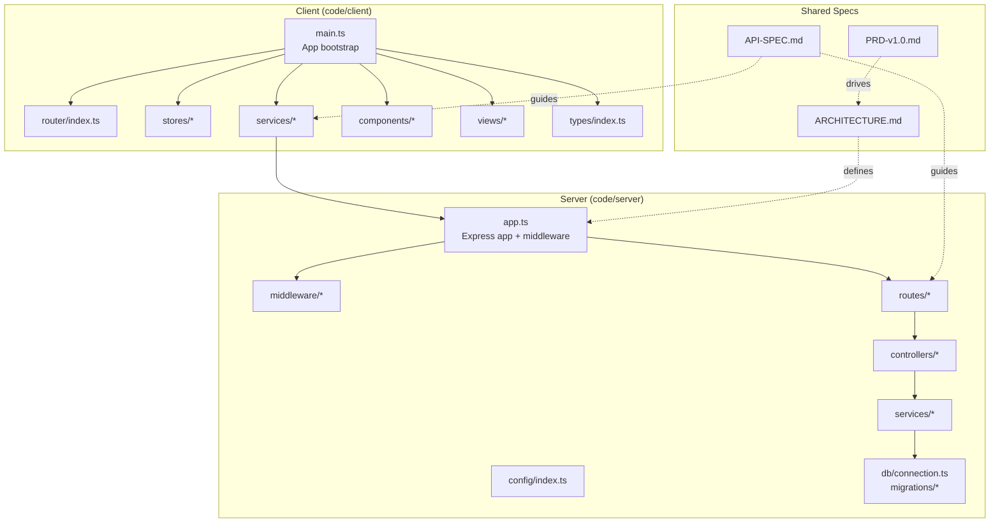
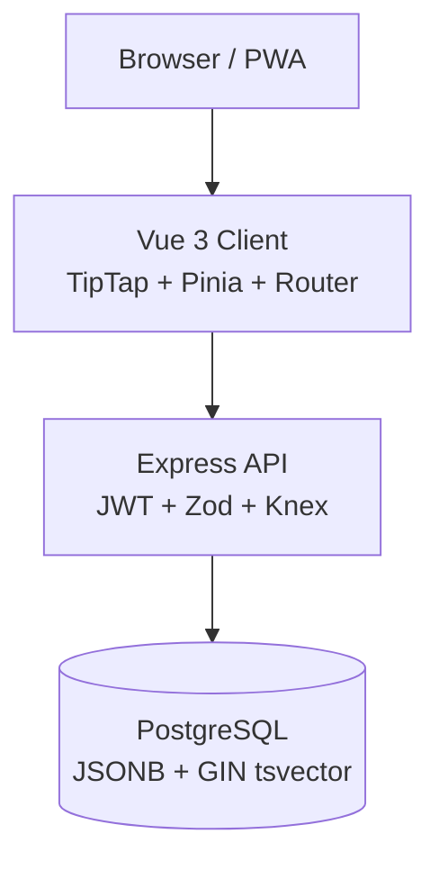
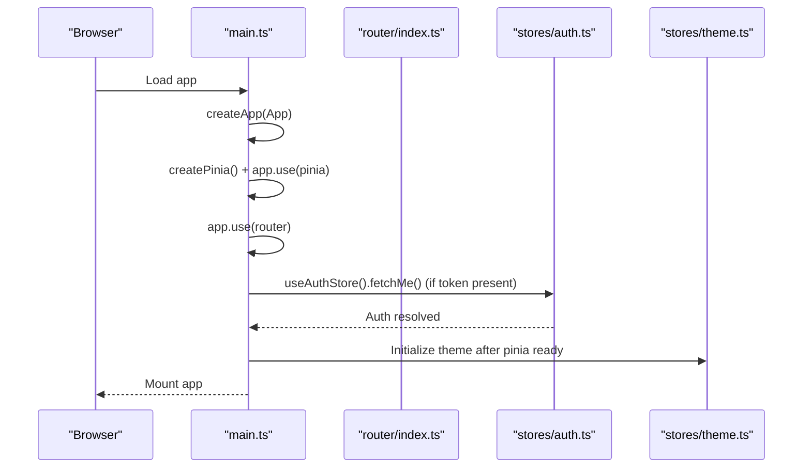
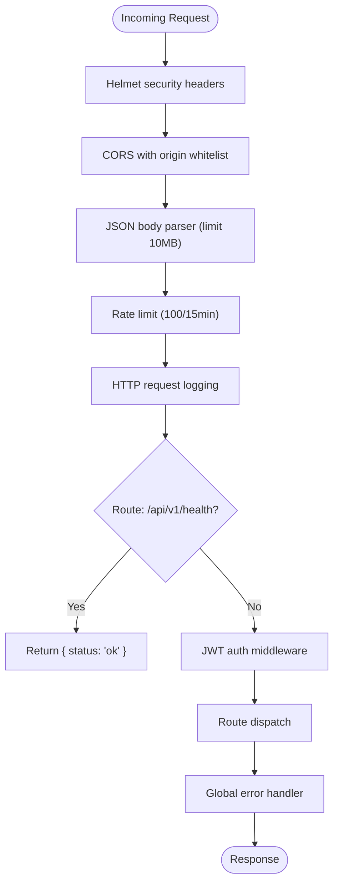
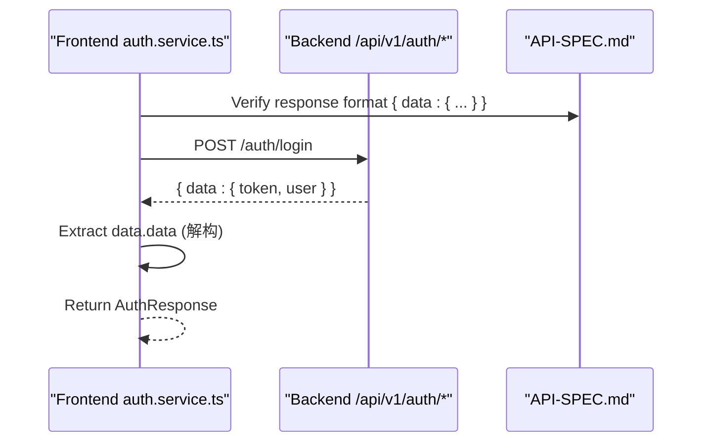
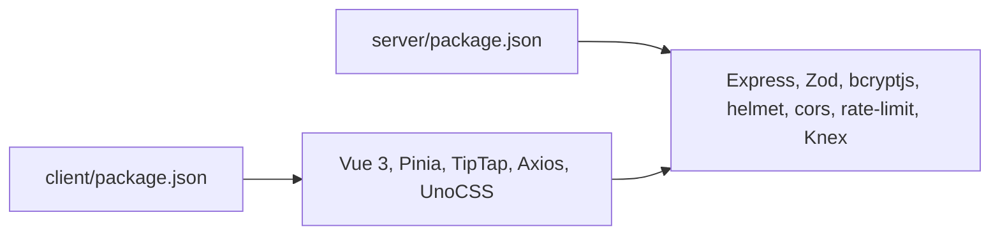
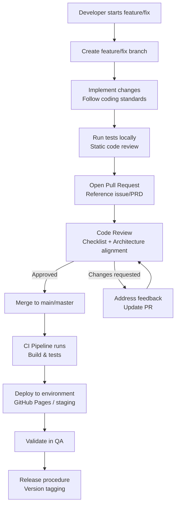

# Development Guidelines

<cite>
**Referenced Files in This Document**
- [README.md](file://README.md)
- [ARCHITECTURE.md](file://arch/ARCHITECTURE.md)
- [API-SPEC.md](file://api-spec/API-SPEC.md)
- [PRD-v1.0.md](file://prd/PRD-v1.0.md)
- [project-plan.md](file://plan/project-plan.md)
- [deploy-frontend.yml](file://.github/workflows/deploy-frontend.yml)
- [REVIEW-M1.md](file://review/REVIEW-M1.md)
- [TEST-REPORT-M1-BACKEND.md](file://test/backend/TEST-REPORT-M1-BACKEND.md)
- [001_init.sql](file://db/001_init.sql)
- [main.ts](file://code/client/src/main.ts)
- [app.ts](file://code/server/src/app.ts)
- [auth.service.ts](file://code/client/src/services/auth.service.ts)
- [package.json](file://code/client/package.json)
- [package.json](file://code/server/package.json)
</cite>

## Table of Contents
1. [Introduction](#introduction)
2. [Project Structure](#project-structure)
3. [Core Components](#core-components)
4. [Architecture Overview](#architecture-overview)
5. [Detailed Component Analysis](#detailed-component-analysis)
6. [Dependency Analysis](#dependency-analysis)
7. [Performance Considerations](#performance-considerations)
8. [Troubleshooting Guide](#troubleshooting-guide)
9. [Contribution Workflow](#contribution-workflow)
10. [Code Quality Standards](#code-quality-standards)
11. [Version Control Practices](#version-control-practices)
12. [Release Procedures](#release-procedures)
13. [Examples and Templates](#examples-and-templates)
14. [Design Decisions and Constraints](#design-decisions-and-constraints)
15. [Future Roadmap](#future-roadmap)
16. [Conclusion](#conclusion)

## Introduction
This document provides comprehensive development guidelines and contribution standards for Yule Notion, a modern full-stack note-taking application. It establishes coding standards, architectural principles, development workflows, review processes, and operational procedures for both frontend and backend teams. It also documents project structure conventions, naming patterns, and quality requirements to ensure consistent delivery of the MVP and future iterations.

## Project Structure
Yule Notion follows a monorepo-like structure with clear separation between client and server codebases, supporting rapid iteration during the MVP phase. The repository includes:
- code/client: Vue 3 + TypeScript frontend with Vite, Pinia, and TipTap editor
- code/server: Node.js + Express + TypeScript backend with Knex.js ORM
- arch: Architectural design documents
- prd: Product Requirements Document
- api-spec: API specification aligned with backend implementation
- db: Database initialization scripts and ER documentation
- test: Static code review reports and test artifacts
- plan: Project plan and milestones
- review: Code review reports
- release: Release-related assets
- .github/workflows: CI/CD pipeline for frontend deployment



**Diagram sources**
- [main.ts:1-54](file://code/client/src/main.ts#L1-L54)
- [app.ts:1-121](file://code/server/src/app.ts#L1-L121)
- [API-SPEC.md:1-884](file://api-spec/API-SPEC.md#L1-L884)
- [ARCHITECTURE.md:1-672](file://arch/ARCHITECTURE.md#L1-L672)
- [PRD-v1.0.md:1-734](file://prd/PRD-v1.0.md#L1-L734)

**Section sources**
- [README.md:23-41](file://README.md#L23-L41)
- [ARCHITECTURE.md:164-286](file://arch/ARCHITECTURE.md#L164-L286)

## Core Components
This section outlines the foundational components and their responsibilities, derived from the architecture and implementation:

- Frontend (Vue 3 + TypeScript)
  - Application bootstrap and routing: [main.ts:1-54](file://code/client/src/main.ts#L1-L54)
  - Global styles and UnoCSS integration
  - State management via Pinia stores
  - Services layer for API communication
  - Views and components organized by feature
  - Types aligned with API specification

- Backend (Node.js + Express + TypeScript)
  - Express application configuration and middleware stack: [app.ts:1-121](file://code/server/src/app.ts#L1-L121)
  - Authentication middleware and JWT integration
  - Route definitions and controllers
  - Business logic in services
  - Database connectivity and migrations via Knex.js

- Shared Contracts
  - API specification: [API-SPEC.md:1-884](file://api-spec/API-SPEC.md#L1-L884)
  - Architecture design: [ARCHITECTURE.md:1-672](file://arch/ARCHITECTURE.md#L1-L672)
  - Product requirements: [PRD-v1.0.md:1-734](file://prd/PRD-v1.0.md#L1-L734)

Key implementation references:
- Frontend package dependencies and scripts: [package.json:1-53](file://code/client/package.json#L1-L53)
- Backend package dependencies and scripts: [package.json:1-39](file://code/server/package.json#L1-L39)

**Section sources**
- [main.ts:1-54](file://code/client/src/main.ts#L1-L54)
- [app.ts:1-121](file://code/server/src/app.ts#L1-L121)
- [API-SPEC.md:10-87](file://api-spec/API-SPEC.md#L10-L87)
- [ARCHITECTURE.md:101-159](file://arch/ARCHITECTURE.md#L101-L159)
- [PRD-v1.0.md:132-165](file://prd/PRD-v1.0.md#L132-L165)

## Architecture Overview
Yule Notion employs a classic three-layer architecture with front-end/back-end separation:
- Client Layer: Vue 3 SPA with TipTap editor, Pinia state management, and PWA support
- Server Layer: Express REST API with JWT authentication, Zod validation, and Knex.js ORM
- Data Layer: PostgreSQL with JSONB storage for TipTap content, GIN indexes for full-text search, and cascading constraints



**Diagram sources**
- [ARCHITECTURE.md:14-87](file://arch/ARCHITECTURE.md#L14-L87)
- [API-SPEC.md:10-24](file://api-spec/API-SPEC.md#L10-L24)
- [001_init.sql:36-76](file://db/001_init.sql#L36-L76)

**Section sources**
- [ARCHITECTURE.md:89-159](file://arch/ARCHITECTURE.md#L89-L159)
- [API-SPEC.md:10-24](file://api-spec/API-SPEC.md#L10-L24)
- [001_init.sql:36-76](file://db/001_init.sql#L36-L76)

## Detailed Component Analysis

### Frontend Bootstrapping and Routing
The client initializes the Vue application, installs Pinia and Vue Router, loads global styles, attempts to restore authentication state, and applies theme initialization.



**Diagram sources**
- [main.ts:33-53](file://code/client/src/main.ts#L33-L53)

**Section sources**
- [main.ts:1-54](file://code/client/src/main.ts#L1-L54)

### Backend Middleware Stack and Security
The server configures security headers, CORS, rate limiting, logging, health checks, and routes. It enforces JWT authentication and centralized error handling.



**Diagram sources**
- [app.ts:67-121](file://code/server/src/app.ts#L67-L121)

**Section sources**
- [app.ts:1-121](file://code/server/src/app.ts#L1-L121)

### API Contract Alignment
The frontend services consume the API contract defined in the specification. The authentication service demonstrates解构后端包装层 to extract data from successful responses.



**Diagram sources**
- [auth.service.ts:23-45](file://code/client/src/services/auth.service.ts#L23-L45)
- [API-SPEC.md:25-52](file://api-spec/API-SPEC.md#L25-L52)

**Section sources**
- [auth.service.ts:1-46](file://code/client/src/services/auth.service.ts#L1-L46)
- [API-SPEC.md:25-52](file://api-spec/API-SPEC.md#L25-L52)

### Database Design and Indexing
The database schema supports rich note content with JSONB, efficient tree queries, full-text search, and soft deletion. Triggers maintain timestamps and search vectors.

```mermaid
erDiagram
USERS {
uuid id PK
varchar email UK
varchar password_hash
varchar name
timestamptz created_at
timestamptz updated_at
}
PAGES {
uuid id PK
uuid user_id FK
varchar title
jsonb content
uuid parent_id FK
int "order"
varchar icon
boolean is_deleted
timestamptz deleted_at
int version
timestamptz created_at
timestamptz updated_at
tsvector search_vector
}
TAGS {
uuid id PK
uuid user_id FK
varchar name
varchar color
timestamptz created_at
}
PAGE_TAGS {
uuid page_id FK
uuid tag_id FK
timestamptz created_at
}
UPLOADED_FILES {
uuid id PK
uuid user_id FK
varchar original_name
varchar storage_path
varchar mime_type
int size
timestamptz created_at
}
SYNC_LOG {
uuid id PK
uuid user_id FK
uuid page_id FK
varchar sync_type
varchar action
int client_version
int server_version
boolean conflict
varchar resolution
inet ip_address
text user_agent
timestamptz created_at
}
USERS ||--o{ PAGES : "owns"
USERS ||--o{ TAGS : "owns"
USERS ||--o{ UPLOADED_FILES : "owns"
USERS ||--o{ SYNC_LOG : "involved"
PAGES ||--o{ PAGE_TAGS : "tagged_by"
TAGS ||--|| PAGE_TAGS : "tags"
PAGES ||--o{ SYNC_LOG : "synced"
```

**Diagram sources**
- [001_init.sql:14-158](file://db/001_init.sql#L14-L158)

**Section sources**
- [001_init.sql:1-254](file://db/001_init.sql#L1-L254)

## Dependency Analysis
The project maintains clear separation of concerns across layers and enforces strong typing and validation:

- Frontend dependencies include Vue 3, Pinia, TipTap, Axios, and UnoCSS. Scripts define dev/build/preview lifecycles.
- Backend dependencies include Express, Zod, bcryptjs, helmet, cors, rate-limit, and Knex.js. Scripts define dev/build/start and migration commands.



**Diagram sources**
- [package.json:11-41](file://code/client/package.json#L11-L41)
- [package.json:15-27](file://code/server/package.json#L15-L27)

**Section sources**
- [package.json:1-53](file://code/client/package.json#L1-L53)
- [package.json:1-39](file://code/server/package.json#L1-L39)

## Performance Considerations
- Frontend
  - Use composition API and scoped styles to minimize bundle size and improve reactivity.
  - Debounce auto-save to reduce IndexedDB writes and network requests.
  - Lazy-load heavy components (e.g., TipTap extensions) to optimize initial load.

- Backend
  - Leverage GIN indexes on JSONB and tsvector for fast full-text search.
  - Apply check constraints and filtered indexes to optimize tree queries and soft-delete filtering.
  - Enforce rate limits and secure headers to protect resources.

[No sources needed since this section provides general guidance]

## Troubleshooting Guide
Common issues and resolutions derived from review and test reports:

- Frontend API response unpacking
  - Symptom: login/register/me fail due to missing data extraction
  - Cause: Frontend does not unwrap the { data: ... } envelope
  - Fix: Ensure services extract data.data from successful responses

- Frontend error response field access
  - Symptom: Users see fallback messages instead of backend error details
  - Cause: Frontend reads .error.message instead of .response.data.error.message
  - Fix: Adjust error handling to match API-SPEC error shape

- Production JWT_SECRET enforcement
  - Symptom: Security risk due to default secret in production
  - Cause: Missing minimum length validation and enforced presence
  - Fix: Add production-time checks for non-default, sufficiently long secrets

- CORS production origin policy
  - Symptom: Any origin can access API with credentials in production
  - Cause: Undefined allowedOrigins leads to reflective origin behavior
  - Fix: Enforce ALLOWED_ORIGINS in production or reject cross-origin requests

- Trigger immutability semantics
  - Symptom: Function marked IMMUTABLE but modifies state
  - Cause: Trigger updates timestamps inside immutable function
  - Fix: Remove IMMUTABLE or move timestamp updates to appropriate trigger

- AppAlert timer not restarting for new alerts
  - Symptom: Newly added alerts do not auto-dismiss
  - Cause: Timer setup only runs once during mount
  - Fix: Watch reactive alerts and start timers when new items arrive

**Section sources**
- [REVIEW-M1.md:59-184](file://review/REVIEW-M1.md#L59-L184)
- [TEST-REPORT-M1-BACKEND.md:181-256](file://test/backend/TEST-REPORT-M1-BACKEND.md#L181-L256)

## Contribution Workflow
This workflow ensures consistent development, review, and deployment practices aligned with the project’s architecture and quality standards.



[No sources needed since this diagram shows conceptual workflow, not actual code structure]

## Code Quality Standards
- Coding Standards
  - TypeScript strict mode enabled
  - Consistent naming: camelCase for variables/functions, PascalCase for components/classes, snake_case for database fields
  - ESLint + Prettier for formatting and linting
  - Conventional Commits for commit messages

- Frontend Standards
  - Use script setup syntax for Vue components
  - Pinia composition API for state management
  - UnoCSS utility classes; scoped styles for complex CSS
  - Centralized API calls via services; avoid direct Axios usage in components

- Backend Standards
  - Clear separation: routes → controllers → services → db
  - Zod schema validation for all inputs
  - Unified error codes and error handling middleware
  - Database migrations managed via Knex; no manual schema changes
  - All queries include userId filtering for data isolation

**Section sources**
- [ARCHITECTURE.md:621-645](file://arch/ARCHITECTURE.md#L621-L645)
- [API-SPEC.md:10-24](file://api-spec/API-SPEC.md#L10-L24)

## Version Control Practices
- Branching Model
  - main/master: protected, stable baseline
  - feat/*: feature branches prefixed with feat/
  - fix/*: bug fix branches prefixed with fix/

- Commit Messages
  - Use Conventional Commits (feat:, fix:, chore:, docs:, refactor:)
  - Keep subject line under 50 characters
  - Reference related issues/PRs in footer

- Pull Requests
  - Include summary, rationale, and testing notes
  - Link to related PRD/Milestone
  - Assign reviewers and label appropriately

**Section sources**
- [ARCHITECTURE.md:627-629](file://arch/ARCHITECTURE.md#L627-L629)

## Release Procedures
- Pre-release
  - Run static code review and tests
  - Update CHANGELOG entries
  - Verify API-SPEC compliance

- Release
  - Tag version (semantic versioning)
  - Publish artifacts per repository policy

- Post-release
  - Monitor logs and error reports
  - Validate frontend deployment via GitHub Pages workflow

**Section sources**
- [deploy-frontend.yml:1-55](file://.github/workflows/deploy-frontend.yml#L1-L55)

## Examples and Templates

### Example Commit Messages
- feat(auth): add JWT refresh endpoint
- fix(client): resolve API response data unpacking
- chore(deps): upgrade Vue to latest stable
- docs(api): update auth endpoints documentation

### Pull Request Template
- Summary: Brief description of changes
- Related Issue: Link to issue/PRD item
- Type of Change: Feature, Fix, Refactor, Docs, Chore
- Screenshots/Notes: UI changes, test results, or special considerations
- Reviewers: Assign team members

### Code Review Checklist
- Architecture alignment with PRD and API-SPEC
- TypeScript strictness and type safety
- Error handling completeness and consistency
- Security controls (JWT, CORS, rate-limit, helmet)
- Database schema correctness and indexing
- Naming conventions and code readability
- Tests coverage and static analysis pass

**Section sources**
- [REVIEW-M1.md:289-367](file://review/REVIEW-M1.md#L289-L367)
- [TEST-REPORT-M1-BACKEND.md:257-297](file://test/backend/TEST-REPORT-M1-BACKEND.md#L257-L297)

## Design Decisions and Constraints
- Architecture
  - Three-tier separation with clear boundaries
  - RESTful API with versioned base path
  - JWT bearer tokens with 7-day expiry
  - Data isolation via userId filters

- Frontend
  - Vue 3 Composition API + Pinia for state
  - TipTap editor with JSONB storage
  - UnoCSS for atomic styling
  - PWA support for offline editing

- Backend
  - Express + Zod + Knex.js
  - PostgreSQL JSONB + GIN tsvector for full-text search
  - Cascading deletes and soft delete pattern
  - Centralized error handling and status code mapping

**Section sources**
- [ARCHITECTURE.md:89-159](file://arch/ARCHITECTURE.md#L89-L159)
- [API-SPEC.md:10-87](file://api-spec/API-SPEC.md#L10-L87)
- [001_init.sql:36-76](file://db/001_init.sql#L36-L76)

## Future Roadmap
- Immediate (M2)
  - Implement page CRUD, tree navigation, and drag-sort
  - Full-text search and tag system
  - Markdown/PDF export capabilities

- Near-term
  - Electron desktop packaging and distribution
  - Docker Compose deployment automation

- Long-term
  - Advanced editor features and collaboration
  - Conflict-free replicated data types (CRDT) for sync
  - Dark theme and accessibility enhancements

**Section sources**
- [project-plan.md:86-142](file://plan/project-plan.md#L86-L142)
- [PRD-v1.0.md:132-165](file://prd/PRD-v1.0.md#L132-L165)

## Conclusion
These guidelines establish a consistent, secure, and scalable foundation for developing Yule Notion. By adhering to the documented standards, workflows, and review practices, contributors can ensure high-quality deliverables that align with the PRD, API-SPEC, and architectural vision while maintaining performance and security.