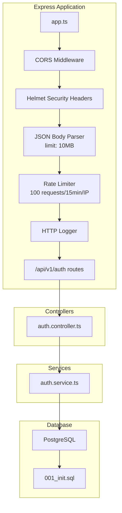
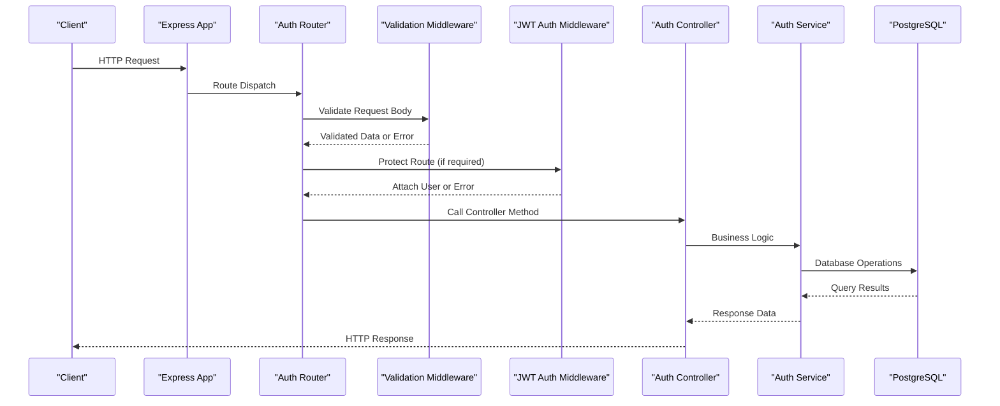
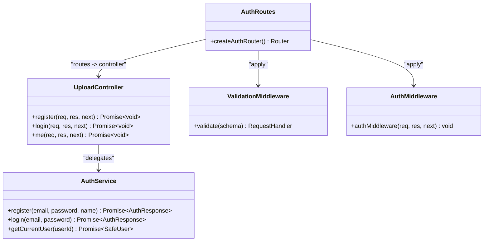
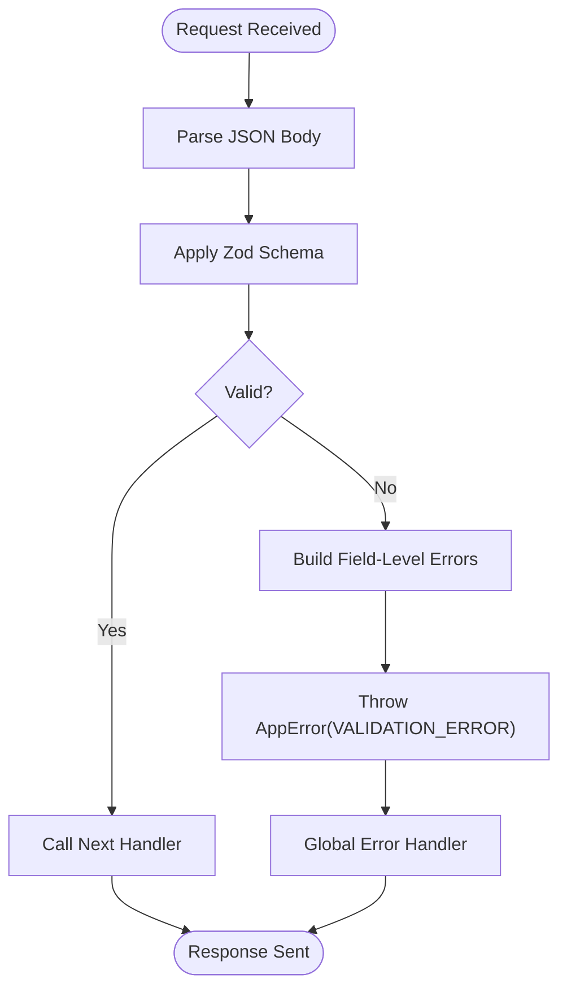
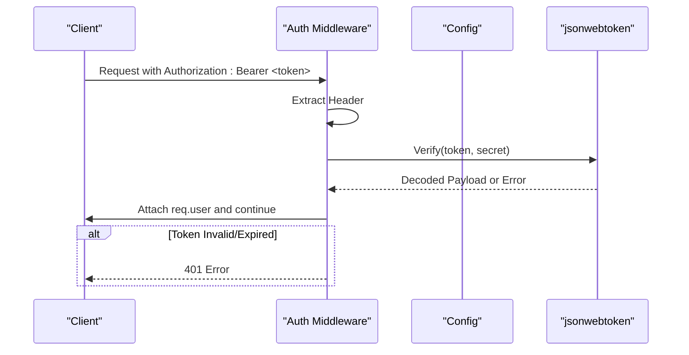
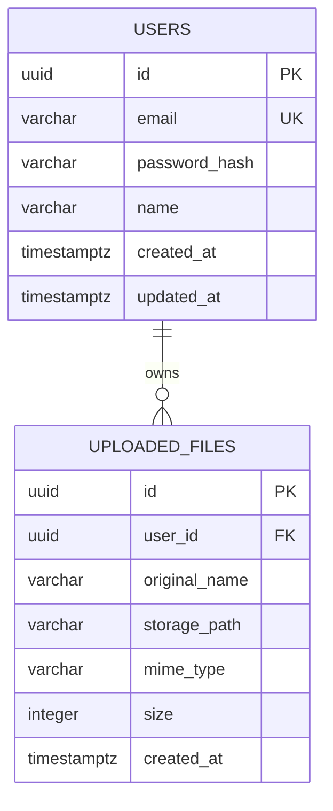
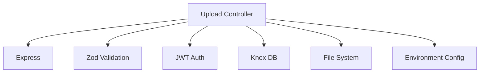

# Backend Upload Controller

<cite>
**Referenced Files in This Document**
- [app.ts](file://code/server/src/app.ts)
- [auth.controller.ts](file://code/server/src/controllers/auth.controller.ts)
- [auth.routes.ts](file://code/server/src/routes/auth.routes.ts)
- [auth.middleware.ts](file://code/server/src/middleware/auth.ts)
- [validate.middleware.ts](file://code/server/src/middleware/validate.ts)
- [auth.service.ts](file://code/server/src/services/auth.service.ts)
- [types.index.ts](file://code/server/src/types/index.ts)
- [config.index.ts](file://code/server/src/config/index.ts)
- [001_init.sql](file://db/001_init.sql)
- [package.json](file://code/server/package.json)
</cite>

## Table of Contents
1. [Introduction](#introduction)
2. [Project Structure](#project-structure)
3. [Core Components](#core-components)
4. [Architecture Overview](#architecture-overview)
5. [Detailed Component Analysis](#detailed-component-analysis)
6. [Dependency Analysis](#dependency-analysis)
7. [Performance Considerations](#performance-considerations)
8. [Troubleshooting Guide](#troubleshooting-guide)
9. [Conclusion](#conclusion)

## Introduction
This document provides comprehensive documentation for the backend upload controller implementation. It explains how the system handles file upload requests, validates requests, formats responses, integrates with file storage and database metadata management, and enforces security policies including authentication, rate limiting, and CORS configuration. It also covers supported file types, size limits, and error handling strategies.

## Project Structure
The backend server is organized using a layered architecture:
- Controllers: Handle HTTP requests and responses
- Routes: Define endpoints and apply validation middleware
- Services: Encapsulate business logic
- Middleware: Authentication, validation, error handling, and security
- Database: PostgreSQL schema with Knex for migrations
- Configuration: Environment variables and runtime configuration

**Diagram sources**
- [app.ts:65-121](file://code/server/src/app.ts#L65-L121)
- [auth.routes.ts:20-106](file://code/server/src/routes/auth.routes.ts#L20-L106)
- [auth.controller.ts:12-82](file://code/server/src/controllers/auth.controller.ts#L12-L82)
- [auth.service.ts:12-166](file://code/server/src/services/auth.service.ts#L12-L166)
- [001_init.sql:114-133](file://db/001_init.sql#L114-L133)

**Section sources**
- [app.ts:65-121](file://code/server/src/app.ts#L65-L121)
- [auth.routes.ts:20-106](file://code/server/src/routes/auth.routes.ts#L20-L106)
- [auth.controller.ts:12-82](file://code/server/src/controllers/auth.controller.ts#L12-L82)
- [auth.service.ts:12-166](file://code/server/src/services/auth.service.ts#L12-L166)
- [001_init.sql:114-133](file://db/001_init.sql#L114-L133)

## Core Components
- Express application configuration with security headers, CORS, JSON parsing, rate limiting, logging, health checks, routing, and global error handling
- Authentication controller with registration, login, and current user endpoints
- Validation middleware using Zod schemas for request body validation
- Authentication middleware using JWT for protected routes
- Service layer implementing registration, login, and current user retrieval
- Database schema supporting uploaded files with size constraints and indexing
- Configuration module for environment variables and production safety checks

**Section sources**
- [app.ts:29-121](file://code/server/src/app.ts#L29-L121)
- [auth.controller.ts:26-81](file://code/server/src/controllers/auth.controller.ts#L26-L81)
- [validate.middleware.ts:31-72](file://code/server/src/middleware/validate.ts#L31-L72)
- [auth.middleware.ts:29-59](file://code/server/src/middleware/auth.ts#L29-L59)
- [auth.service.ts:68-166](file://code/server/src/services/auth.service.ts#L68-L166)
- [001_init.sql:114-133](file://db/001_init.sql#L114-L133)
- [config.index.ts:72-98](file://code/server/src/config/index.ts#L72-L98)

## Architecture Overview
The upload controller follows a layered architecture:
- Request enters via Express routes
- Validation middleware ensures request body conforms to schema
- Authentication middleware verifies JWT tokens for protected endpoints
- Controller delegates business logic to service layer
- Service interacts with database via Knex queries
- Responses are formatted consistently and errors are handled centrally

**Diagram sources**
- [app.ts:65-121](file://code/server/src/app.ts#L65-L121)
- [auth.routes.ts:20-106](file://code/server/src/routes/auth.routes.ts#L20-L106)
- [validate.middleware.ts:31-72](file://code/server/src/middleware/validate.ts#L31-L72)
- [auth.middleware.ts:29-59](file://code/server/src/middleware/auth.ts#L29-L59)
- [auth.controller.ts:26-81](file://code/server/src/controllers/auth.controller.ts#L26-L81)
- [auth.service.ts:68-166](file://code/server/src/services/auth.service.ts#L68-L166)

## Detailed Component Analysis

### Upload Controller Implementation
The current repository does not include a dedicated upload controller. The authentication controller demonstrates the pattern for handling HTTP requests, validating inputs, delegating to services, and returning standardized responses. The upload controller would follow the same pattern but integrate with file storage and the uploaded_files metadata table.

**Diagram sources**
- [auth.controller.ts:26-81](file://code/server/src/controllers/auth.controller.ts#L26-L81)
- [auth.routes.ts:20-106](file://code/server/src/routes/auth.routes.ts#L20-L106)
- [validate.middleware.ts:31-72](file://code/server/src/middleware/validate.ts#L31-L72)
- [auth.middleware.ts:29-59](file://code/server/src/middleware/auth.ts#L29-L59)
- [auth.service.ts:68-166](file://code/server/src/services/auth.service.ts#L68-L166)

### Request Validation and Parameter Validation
- Validation middleware uses Zod schemas to validate request bodies and transform them into typed objects
- Validation errors are converted into a unified error format with field-level details
- Example schemas for registration and login demonstrate minimum length, format, and presence requirements

**Diagram sources**
- [validate.middleware.ts:31-72](file://code/server/src/middleware/validate.ts#L31-L72)
- [auth.routes.ts:35-66](file://code/server/src/routes/auth.routes.ts#L35-L66)

**Section sources**
- [validate.middleware.ts:31-72](file://code/server/src/middleware/validate.ts#L31-L72)
- [auth.routes.ts:35-66](file://code/server/src/routes/auth.routes.ts#L35-L66)

### Authentication and Authorization
- JWT-based authentication middleware extracts Bearer tokens from Authorization headers
- Tokens are verified against a configured secret and attached to the request object
- Protected routes require a valid, non-expired token

**Diagram sources**
- [auth.middleware.ts:29-59](file://code/server/src/middleware/auth.ts#L29-L59)
- [config.index.ts:89-94](file://code/server/src/config/index.ts#L89-L94)

**Section sources**
- [auth.middleware.ts:29-59](file://code/server/src/middleware/auth.ts#L29-L59)
- [config.index.ts:89-94](file://code/server/src/config/index.ts#L89-L94)

### Response Formatting
- Controllers return structured JSON responses with a data field for successful operations
- Errors are handled by a centralized error handler that maps error codes to appropriate HTTP status codes
- The unified error response includes code, message, and optional details

**Section sources**
- [auth.controller.ts:32-35](file://code/server/src/controllers/auth.controller.ts#L32-L35)
- [auth.controller.ts:53-56](file://code/server/src/controllers/auth.controller.ts#L53-L56)
- [types.index.ts:139-168](file://code/server/src/types/index.ts#L139-L168)

### File Storage and Metadata Management
- The database schema defines an uploaded_files table with constraints for size and indexing for efficient lookups
- The storage_path column holds relative paths under an uploads directory
- Size constraints enforce a maximum file size of 5MB

**Diagram sources**
- [001_init.sql:114-133](file://db/001_init.sql#L114-L133)

**Section sources**
- [001_init.sql:114-133](file://db/001_init.sql#L114-L133)

### Supported File Types and Size Limits
- Maximum file size: 5MB enforced by database constraint
- MIME type is stored for metadata tracking
- No explicit file extension or MIME whitelist is defined in the current code; enforcement should be added in the upload controller

**Section sources**
- [001_init.sql:125](file://db/001_init.sql#L125)
- [types.index.ts:102-105](file://code/server/src/types/index.ts#L102-L105)

### Security Validation Processes
- Helmet middleware applies security headers
- CORS configuration supports development (allow all) and production (allowed origins list)
- Rate limiting restricts requests per IP
- JWT secret and allowed origins validated in production
- JSON body parser limit increased to support image uploads

**Section sources**
- [app.ts:67-100](file://code/server/src/app.ts#L67-L100)
- [config.index.ts:52-67](file://code/server/src/config/index.ts#L52-L67)
- [package.json:15-27](file://code/server/package.json#L15-L27)

### Integration with File Storage Systems
- The upload controller should write files to the filesystem under an uploads directory and record metadata in the uploaded_files table
- The storage_path should be relative to the uploads directory
- Consider sanitizing filenames and generating unique identifiers to prevent collisions

[No sources needed since this section provides general guidance]

### Error Handling Strategies
- Centralized error handling maps AppError codes to HTTP status codes
- Validation errors include field-level details
- Authentication errors distinguish between missing, malformed, expired, and invalid tokens
- Rate limit exceeded returns a specific error code

**Section sources**
- [types.index.ts:117-130](file://code/server/src/types/index.ts#L117-L130)
- [auth.middleware.ts:53-58](file://code/server/src/middleware/auth.ts#L53-L58)
- [app.ts:84-96](file://code/server/src/app.ts#L84-L96)

### Authentication Requirements
- Protected endpoints require a Bearer token
- Token verification uses a configurable secret
- Production requires a strong secret and allowed origins configuration

**Section sources**
- [auth.middleware.ts:29-59](file://code/server/src/middleware/auth.ts#L29-L59)
- [config.index.ts:52-67](file://code/server/src/config/index.ts#L52-L67)

### Rate Limiting Considerations
- Global rate limiter allows 100 requests per 15 minutes per IP
- Standard headers enabled for client awareness
- Consider per-route limits for upload endpoints if needed

**Section sources**
- [app.ts:84-96](file://code/server/src/app.ts#L84-L96)

### CORS Configuration and Cross-Origin Requests
- Development mode allows all origins
- Production mode requires a comma-separated allowedOrigins environment variable
- Credentials are supported for authenticated requests

**Section sources**
- [app.ts:71-77](file://code/server/src/app.ts#L71-L77)
- [config.index.ts:96-97](file://code/server/src/config/index.ts#L96-L97)

## Dependency Analysis
The upload controller would depend on:
- Express for routing and middleware
- Zod for request validation
- JWT for authentication
- Knex for database operations
- File system for storing uploaded files
- Environment configuration for secrets and origins

**Diagram sources**
- [auth.routes.ts:10-14](file://code/server/src/routes/auth.routes.ts#L10-L14)
- [validate.middleware.ts:11-13](file://code/server/src/middleware/validate.ts#L11-L13)
- [auth.middleware.ts:10-14](file://code/server/src/middleware/auth.ts#L10-L14)
- [auth.service.ts:12-17](file://code/server/src/services/auth.service.ts#L12-L17)
- [config.index.ts:8-44](file://code/server/src/config/index.ts#L8-L44)

**Section sources**
- [auth.routes.ts:10-14](file://code/server/src/routes/auth.routes.ts#L10-L14)
- [validate.middleware.ts:11-13](file://code/server/src/middleware/validate.ts#L11-L13)
- [auth.middleware.ts:10-14](file://code/server/src/middleware/auth.ts#L10-L14)
- [auth.service.ts:12-17](file://code/server/src/services/auth.service.ts#L12-L17)
- [config.index.ts:8-44](file://code/server/src/config/index.ts#L8-L44)

## Performance Considerations
- Increase JSON body parser limit to accommodate larger images
- Consider streaming uploads to avoid memory pressure
- Implement file type and size checks early to fail fast
- Use database indexes on user_id for efficient lookups
- Apply rate limiting per endpoint for upload-heavy operations

[No sources needed since this section provides general guidance]

## Troubleshooting Guide
- Validation failures: Review Zod schema definitions and error details in the unified error response
- Authentication failures: Verify Authorization header format and token validity
- Rate limit exceeded: Check client-side retry after the specified window
- CORS issues: Confirm allowedOrigins configuration and credentials support
- Database constraints: Ensure file size and MIME type meet schema requirements

**Section sources**
- [validate.middleware.ts:51-66](file://code/server/src/middleware/validate.ts#L51-L66)
- [auth.middleware.ts:33-43](file://code/server/src/middleware/auth.ts#L33-L43)
- [app.ts:84-96](file://code/server/src/app.ts#L84-L96)
- [config.index.ts:96-97](file://code/server/src/config/index.ts#L96-L97)
- [001_init.sql:125](file://db/001_init.sql#L125)

## Conclusion
The backend provides a robust foundation for building an upload controller, including validation, authentication, security headers, CORS, rate limiting, and database schema for file metadata. The upload controller should extend the existing patterns to integrate file storage, enforce file type and size constraints, and maintain metadata consistency.