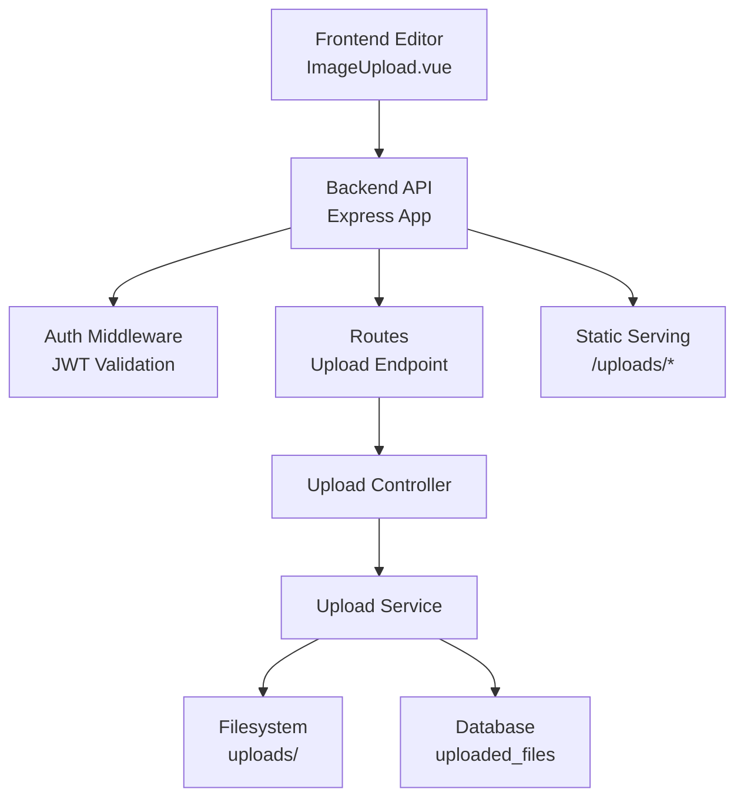
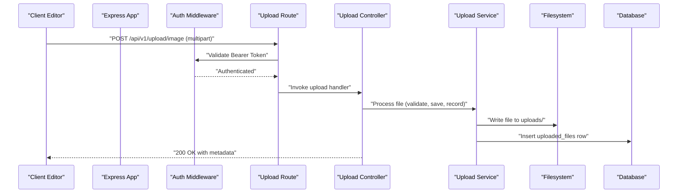
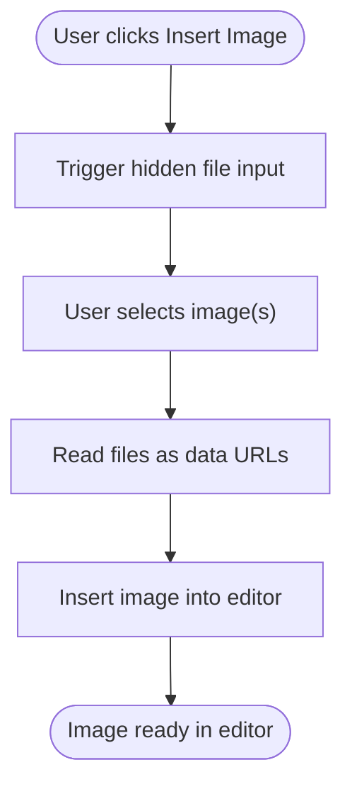
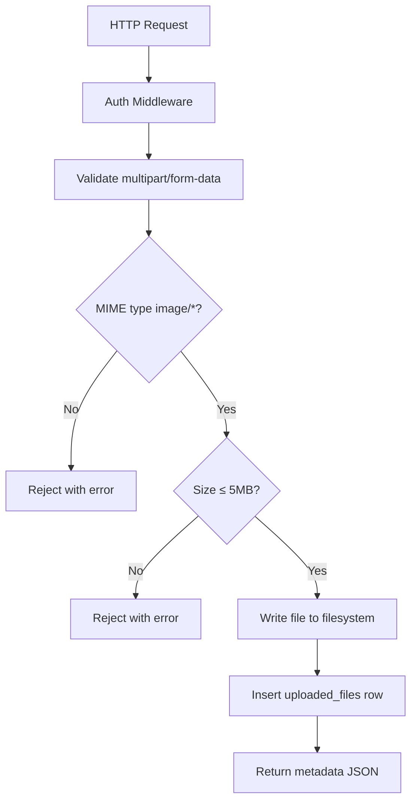
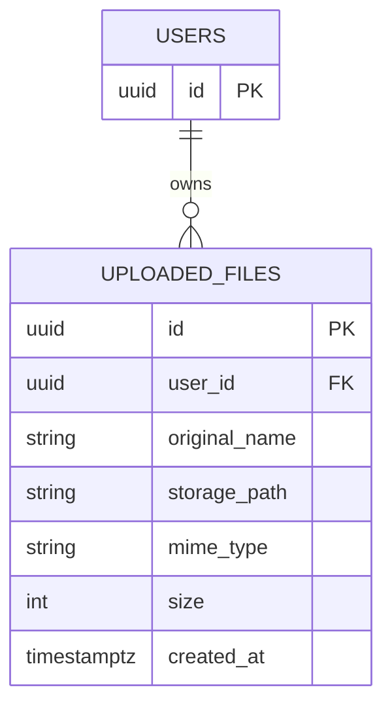
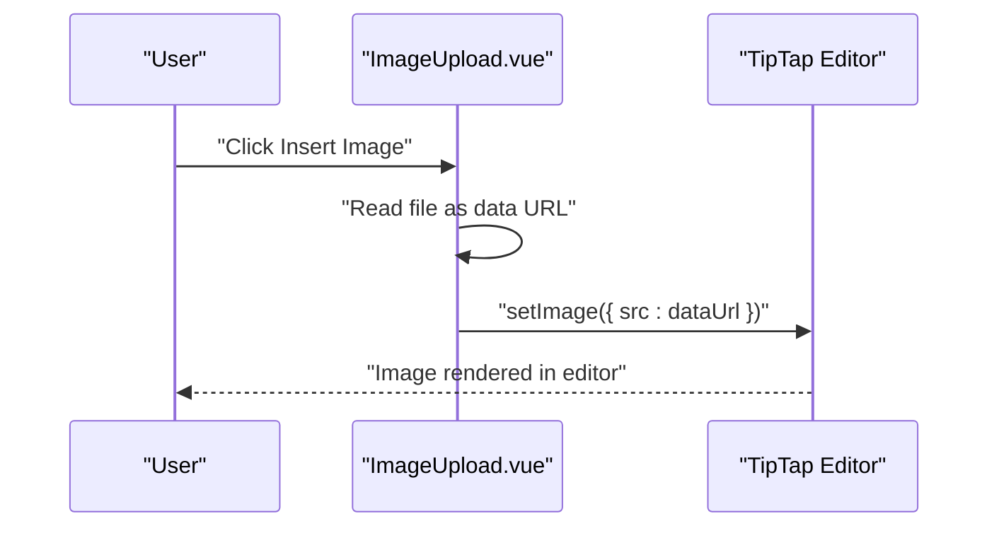
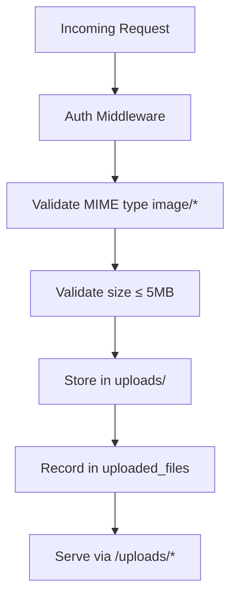
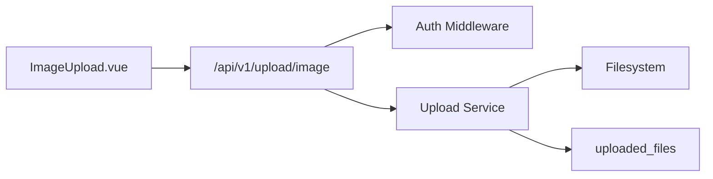

# File Upload System

<cite>
**Referenced Files in This Document**
- [ImageUpload.vue](file://code/client/src/components/editor/ImageUpload.vue)
- [API-SPEC.md](file://api-spec/API-SPEC.md)
- [ARCHITECTURE.md](file://arch/ARCHITECTURE.md)
- [001_init.sql](file://db/001_init.sql)
- [20260319_init.ts](file://code/server/src/db/migrations/20260319_init.ts)
- [app.ts](file://code/server/src/app.ts)
- [auth.ts](file://code/server/src/middleware/auth.ts)
- [index.ts](file://code/server/src/index.ts)
</cite>

## Table of Contents
1. [Introduction](#introduction)
2. [Project Structure](#project-structure)
3. [Core Components](#core-components)
4. [Architecture Overview](#architecture-overview)
5. [Detailed Component Analysis](#detailed-component-analysis)
6. [Dependency Analysis](#dependency-analysis)
7. [Performance Considerations](#performance-considerations)
8. [Troubleshooting Guide](#troubleshooting-guide)
9. [Conclusion](#conclusion)

## Introduction
This document explains the file upload and management system, covering the end-to-end workflow from the frontend rich text editor to backend processing and storage. It documents supported file types, size limits, security validations, backend controller and service design, filesystem organization, and metadata persistence. It also describes the frontend image upload component, drag-and-drop and paste capabilities, progress indication, virus scanning integration, access control, and integration with the rich text editor for media insertion and retrieval for content display.

## Project Structure
The upload system spans the frontend Vue editor component and the backend API service. The backend exposes a dedicated endpoint for uploading images, persists metadata in the database, and serves static assets via a configured uploads directory. The frontend component integrates with the rich text editor to insert images directly.

**Diagram sources**
- [ImageUpload.vue:1-90](file://code/client/src/components/editor/ImageUpload.vue#L1-L90)
- [app.ts:1-121](file://code/server/src/app.ts#L1-L121)
- [auth.ts:1-60](file://code/server/src/middleware/auth.ts#L1-L60)
- [API-SPEC.md:594-629](file://api-spec/API-SPEC.md#L594-L629)
- [20260319_init.ts:140-161](file://code/server/src/db/migrations/20260319_init.ts#L140-L161)

**Section sources**
- [ARCHITECTURE.md:238-285](file://arch/ARCHITECTURE.md#L238-L285)
- [API-SPEC.md:594-629](file://api-spec/API-SPEC.md#L594-L629)

## Core Components
- Frontend image upload component:
  - Provides a button to trigger file selection and supports pasting images.
  - Validates accepted image types and reads selected files as base64 data URLs.
  - Inserts the image into the rich text editor using the editor’s setImage command.
- Backend upload endpoint:
  - Requires authentication via Bearer token.
  - Accepts multipart/form-data with a single image file field.
  - Enforces MIME type and size constraints.
  - Stores the file in the filesystem under a structured path and records metadata in the database.
- Database schema:
  - uploaded_files table stores original filename, storage path, MIME type, size, and timestamps.
  - Includes a size constraint enforcing a maximum of 5 MB per file.
- Static asset serving:
  - Exposes the uploads directory for public access to uploaded images.

**Section sources**
- [ImageUpload.vue:19-44](file://code/client/src/components/editor/ImageUpload.vue#L19-L44)
- [API-SPEC.md:594-629](file://api-spec/API-SPEC.md#L594-L629)
- [001_init.sql:117-132](file://db/001_init.sql#L117-L132)
- [20260319_init.ts:140-161](file://code/server/src/db/migrations/20260319_init.ts#L140-L161)
- [app.ts:101-121](file://code/server/src/app.ts#L101-L121)

## Architecture Overview
The upload workflow follows a secure, layered design:
- Authentication middleware validates JWT tokens for all protected endpoints.
- The upload route enforces request validation and delegates to the controller.
- The service layer handles filesystem writes and database inserts.
- The database schema ensures referential integrity and size constraints.
- Static serving exposes uploaded images to clients.

**Diagram sources**
- [app.ts:65-121](file://code/server/src/app.ts#L65-L121)
- [auth.ts:29-59](file://code/server/src/middleware/auth.ts#L29-L59)
- [API-SPEC.md:594-629](file://api-spec/API-SPEC.md#L594-L629)
- [20260319_init.ts:140-161](file://code/server/src/db/migrations/20260319_init.ts#L140-L161)

## Detailed Component Analysis

### Frontend Image Upload Component
- Purpose: Allow users to select or paste images and insert them into the rich text editor.
- Behavior:
  - Clicking the trigger opens the native file picker with accept="image/*".
  - Multiple files can be selected.
  - Selected files are read as base64 data URLs and inserted into the editor via setImage.
  - Resets the input value to allow re-selecting the same file.
- Notes:
  - The component does not perform client-side compression or virus scanning.
  - Progress indication is not implemented in this component; uploads occur via the backend endpoint.

**Diagram sources**
- [ImageUpload.vue:19-44](file://code/client/src/components/editor/ImageUpload.vue#L19-L44)

**Section sources**
- [ImageUpload.vue:1-90](file://code/client/src/components/editor/ImageUpload.vue#L1-L90)

### Backend Upload Endpoint and Workflow
- Endpoint: POST /api/v1/upload/image
- Authentication: Required (Bearer token).
- Content-Type: multipart/form-data.
- Request validation:
  - Field: file (File) — required.
  - Constraints: image/* MIME types; size ≤ 5 MB.
- Storage strategy:
  - Save to filesystem under a structured path inside the uploads directory.
  - Serve publicly via static route /uploads/*.
- Metadata persistence:
  - Store original_name, storage_path, mime_type, size, and created_at.
  - Enforce size check constraint in the database.
- Response:
  - Returns id, url, filename, size, mimeType, and createdAt.

**Diagram sources**
- [API-SPEC.md:594-629](file://api-spec/API-SPEC.md#L594-L629)
- [001_init.sql:117-132](file://db/001_init.sql#L117-L132)
- [20260319_init.ts:140-161](file://code/server/src/db/migrations/20260319_init.ts#L140-L161)

**Section sources**
- [API-SPEC.md:594-629](file://api-spec/API-SPEC.md#L594-L629)
- [app.ts:78-104](file://code/server/src/app.ts#L78-L104)

### Database Schema for Uploaded Files
- Table: uploaded_files
  - Columns: id, user_id (FK), original_name, storage_path, mime_type, size, created_at.
  - Constraints:
    - user_id references users(id) with cascade delete.
    - size > 0 AND size <= 5242880 enforced by check constraint.
    - Index on user_id for efficient queries.
- Comments:
  - Describes that actual files are stored in the filesystem while metadata resides in the database.

**Diagram sources**
- [20260319_init.ts:140-161](file://code/server/src/db/migrations/20260319_init.ts#L140-L161)
- [001_init.sql:117-132](file://db/001_init.sql#L117-L132)

**Section sources**
- [20260319_init.ts:140-161](file://code/server/src/db/migrations/20260319_init.ts#L140-L161)
- [001_init.sql:117-132](file://db/001_init.sql#L117-L132)

### Rich Text Editor Integration
- The frontend component reads selected images and inserts them into the editor using the editor’s setImage command.
- This enables seamless media insertion directly from the editor toolbar.
- For backend-uploaded images, the editor receives a URL pointing to the static uploads directory.

**Diagram sources**
- [ImageUpload.vue:33-44](file://code/client/src/components/editor/ImageUpload.vue#L33-L44)

**Section sources**
- [ImageUpload.vue:19-44](file://code/client/src/components/editor/ImageUpload.vue#L19-L44)

### Security Measures and Access Control
- Authentication:
  - All upload requests require a valid Bearer token verified by the auth middleware.
- Authorization:
  - The uploaded_files table includes user_id to associate files with users.
  - Access control should be enforced at the application level when retrieving or deleting files.
- Input validation:
  - MIME type restricted to image/*.
  - Size limited to 5 MB via both client-side acceptance and database constraint.
- Transport security:
  - Helmet middleware adds security headers.
  - Rate limiting protects against abuse.
- Static serving:
  - Images are served from /uploads/*; access control should be considered depending on deployment needs.

**Diagram sources**
- [auth.ts:29-59](file://code/server/src/middleware/auth.ts#L29-L59)
- [API-SPEC.md:594-629](file://api-spec/API-SPEC.md#L594-L629)
- [app.ts:67-104](file://code/server/src/app.ts#L67-L104)

**Section sources**
- [auth.ts:29-59](file://code/server/src/middleware/auth.ts#L29-L59)
- [app.ts:67-104](file://code/server/src/app.ts#L67-L104)
- [API-SPEC.md:594-629](file://api-spec/API-SPEC.md#L594-L629)

### Virus Scanning Integration
- Current implementation:
  - No virus scanning integration is present in the repository.
- Recommended approach:
  - Integrate a virus scanner (e.g., ClamAV) in the service layer after file write but before exposing the file via static serving.
  - Mark files as scanned and maintain a status column in uploaded_files if needed.
  - Reject or quarantine flagged files and notify users accordingly.

[No sources needed since this section provides general guidance]

### File Retrieval and Content Display
- Static serving:
  - Uploaded images are served from the uploads directory via the static route.
- Metadata retrieval:
  - Clients can fetch metadata (e.g., id, url, filename, size, mimeType) from the upload response for display and management.
- Rich text content:
  - Images inserted via the editor use the stored image URLs, enabling rendering in rich text contexts.

**Section sources**
- [API-SPEC.md:610-621](file://api-spec/API-SPEC.md#L610-L621)
- [app.ts:101-121](file://code/server/src/app.ts#L101-L121)

## Dependency Analysis
- Frontend to Backend:
  - The editor component triggers the upload endpoint; the backend persists metadata and files.
- Backend Dependencies:
  - Express app registers middleware and routes.
  - Upload route depends on auth middleware.
  - Upload service depends on filesystem and database abstractions.
- Database Integrity:
  - uploaded_files references users and enforces size constraints.

**Diagram sources**
- [ImageUpload.vue:1-90](file://code/client/src/components/editor/ImageUpload.vue#L1-L90)
- [app.ts:65-121](file://code/server/src/app.ts#L65-L121)
- [auth.ts:29-59](file://code/server/src/middleware/auth.ts#L29-L59)
- [20260319_init.ts:140-161](file://code/server/src/db/migrations/20260319_init.ts#L140-L161)

**Section sources**
- [app.ts:65-121](file://code/server/src/app.ts#L65-L121)
- [auth.ts:29-59](file://code/server/src/middleware/auth.ts#L29-L59)
- [20260319_init.ts:140-161](file://code/server/src/db/migrations/20260319_init.ts#L140-L161)

## Performance Considerations
- Request size limits:
  - JSON body limit is set to 10 MB; ensure multipart uploads are handled efficiently.
- Concurrency:
  - Consider queueing or worker-based processing for heavy operations (future enhancement).
- Static serving:
  - Offload static image delivery to a CDN or reverse proxy for scalability.

[No sources needed since this section provides general guidance]

## Troubleshooting Guide
- Authentication errors:
  - Verify Bearer token presence and validity; check token expiration and secret configuration.
- Upload failures:
  - Confirm MIME type is image/* and size ≤ 5 MB.
  - Check filesystem permissions for the uploads directory.
- Database constraints:
  - Ensure size falls within allowed range; verify foreign key references.
- Health checks:
  - Use the /api/v1/health endpoint to confirm service availability.

**Section sources**
- [auth.ts:29-59](file://code/server/src/middleware/auth.ts#L29-L59)
- [app.ts:101-121](file://code/server/src/app.ts#L101-L121)
- [001_init.sql:125-125](file://db/001_init.sql#L125-L125)
- [index.ts:18-24](file://code/server/src/index.ts#L18-L24)

## Conclusion
The file upload system integrates a simple yet robust frontend component with a secure backend that enforces authentication, MIME type validation, and size limits. Metadata is persisted in the database while files are stored on disk and served statically. The system is designed for extensibility, allowing future enhancements such as virus scanning, CDN integration, and improved access control for file retrieval.