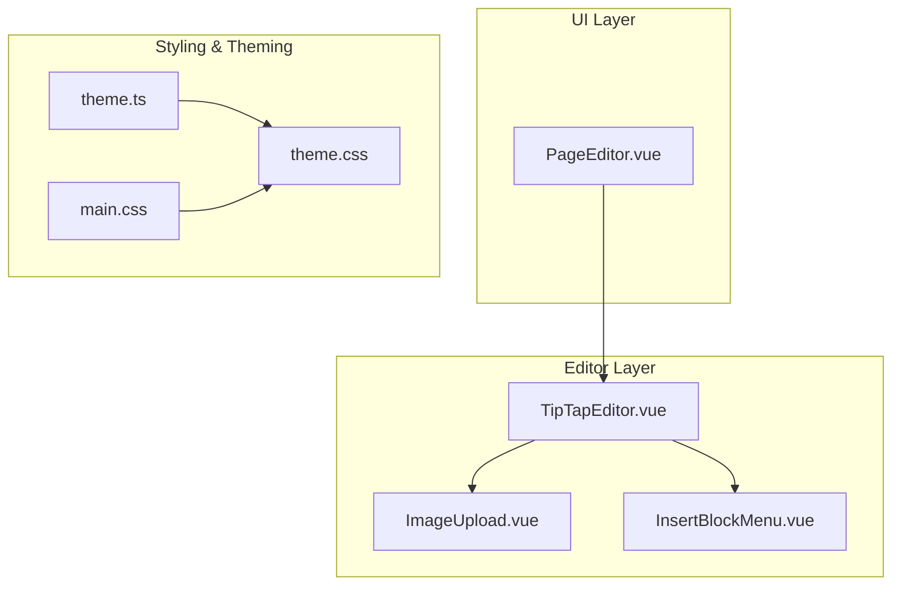
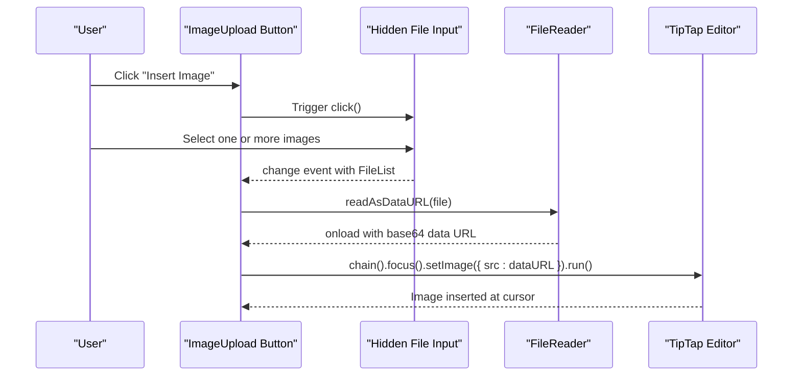
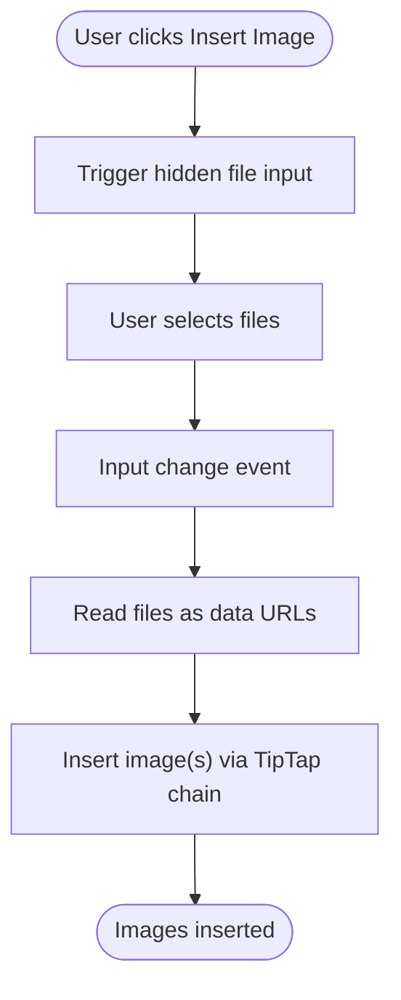
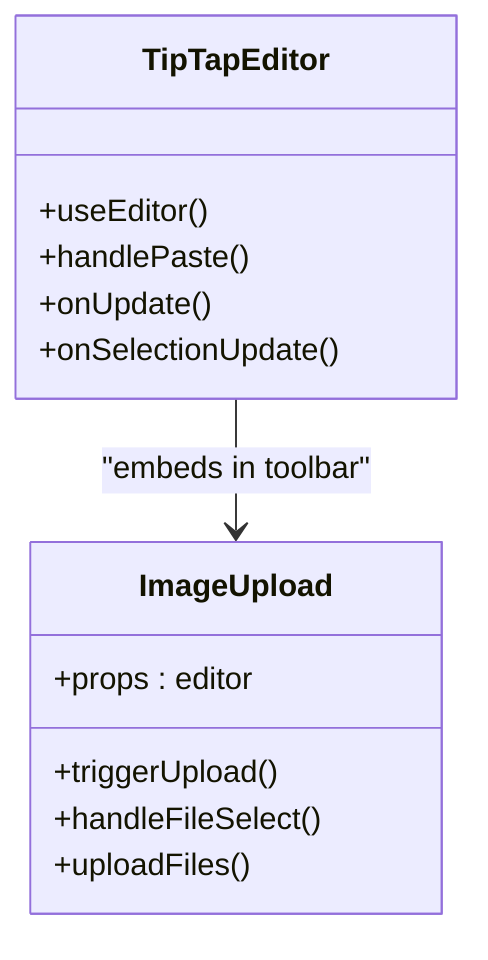
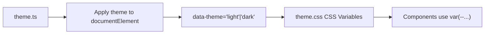
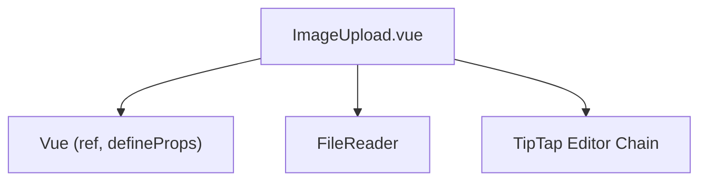

# Frontend Upload Component

<cite>
**Referenced Files in This Document**
- [ImageUpload.vue](file://code/client/src/components/editor/ImageUpload.vue)
- [TipTapEditor.vue](file://code/client/src/components/editor/TipTapEditor.vue)
- [PageEditor.vue](file://code/client/src/components/editor/PageEditor.vue)
- [InsertBlockMenu.vue](file://code/client/src/components/editor/InsertBlockMenu.vue)
- [theme.css](file://code/client/src/styles/theme.css)
- [theme.ts](file://code/client/src/stores/theme.ts)
- [main.css](file://code/client/src/styles/main.css)
- [main.ts](file://code/client/src/main.ts)
- [index.ts](file://code/client/src/types/index.ts)
</cite>

## Table of Contents
1. [Introduction](#introduction)
2. [Project Structure](#project-structure)
3. [Core Components](#core-components)
4. [Architecture Overview](#architecture-overview)
5. [Detailed Component Analysis](#detailed-component-analysis)
6. [Dependency Analysis](#dependency-analysis)
7. [Performance Considerations](#performance-considerations)
8. [Troubleshooting Guide](#troubleshooting-guide)
9. [Conclusion](#conclusion)
10. [Appendices](#appendices)

## Introduction
This document provides comprehensive documentation for the frontend image upload component used within the TipTap editor. It explains the component’s architecture, props interface, event handling mechanisms, file selection workflow, drag-and-drop and paste-to-upload features, integration with TipTap for seamless media insertion, styling approach and dark theme adaptation, accessibility considerations, usage examples, and patterns for file validation, progress indication, and error handling.

## Project Structure
The image upload functionality is implemented as a small, focused Vue component that integrates with the TipTap editor. It is embedded within the editor toolbar and complements other editor features such as the slash command menu and insert block menu.

**Diagram sources**
- [TipTapEditor.vue:469-470](file://code/client/src/components/editor/TipTapEditor.vue#L469-L470)
- [ImageUpload.vue:12-14](file://code/client/src/components/editor/ImageUpload.vue#L12-L14)
- [InsertBlockMenu.vue:28-32](file://code/client/src/components/editor/InsertBlockMenu.vue#L28-L32)
- [PageEditor.vue:119-122](file://code/client/src/components/editor/PageEditor.vue#L119-L122)
- [theme.css:1-146](file://code/client/src/styles/theme.css#L1-L146)
- [theme.ts:17-75](file://code/client/src/stores/theme.ts#L17-L75)
- [main.css:1-65](file://code/client/src/styles/main.css#L1-L65)

**Section sources**
- [TipTapEditor.vue:1-831](file://code/client/src/components/editor/TipTapEditor.vue#L1-L831)
- [ImageUpload.vue:1-90](file://code/client/src/components/editor/ImageUpload.vue#L1-L90)
- [PageEditor.vue:1-208](file://code/client/src/components/editor/PageEditor.vue#L1-L208)
- [InsertBlockMenu.vue:1-410](file://code/client/src/components/editor/InsertBlockMenu.vue#L1-L410)
- [theme.css:1-146](file://code/client/src/styles/theme.css#L1-L146)
- [theme.ts:1-76](file://code/client/src/stores/theme.ts#L1-L76)
- [main.css:1-65](file://code/client/src/styles/main.css#L1-L65)

## Core Components
- ImageUpload.vue: A minimal component that triggers file selection and inserts images into the TipTap editor using base64 data URLs.
- TipTapEditor.vue: The main editor that integrates TipTap extensions, handles paste events, and embeds the ImageUpload component in the toolbar.
- InsertBlockMenu.vue: Provides a broader insert menu including images, complementing the direct image insertion via ImageUpload.
- PageEditor.vue: Hosts the TipTapEditor and manages page content updates.
- theme.css and theme.ts: Provide CSS variables and runtime theme switching for light/dark modes.
- main.css and main.ts: Global styles and theme initialization.

Key integration points:
- ImageUpload receives the TipTap editor instance via props and uses it to insert images.
- TipTapEditor registers the Image extension and handles paste events to support pasting images.
- InsertBlockMenu offers an alternative way to insert images via a menu.

**Section sources**
- [ImageUpload.vue:12-44](file://code/client/src/components/editor/ImageUpload.vue#L12-L44)
- [TipTapEditor.vue:112-188](file://code/client/src/components/editor/TipTapEditor.vue#L112-L188)
- [InsertBlockMenu.vue:119-159](file://code/client/src/components/editor/InsertBlockMenu.vue#L119-L159)
- [PageEditor.vue:119-122](file://code/client/src/components/editor/PageEditor.vue#L119-L122)
- [theme.css:1-146](file://code/client/src/styles/theme.css#L1-L146)
- [theme.ts:17-75](file://code/client/src/stores/theme.ts#L17-L75)
- [main.css:1-65](file://code/client/src/styles/main.css#L1-L65)

## Architecture Overview
The upload component follows a unidirectional data flow:
- User triggers file selection via the ImageUpload button.
- The component reads selected files and converts them to base64 data URLs.
- The TipTap editor chain is used to insert the image at the current cursor position.
- The editor emits update events to notify parent components of content changes.

**Diagram sources**
- [ImageUpload.vue:19-44](file://code/client/src/components/editor/ImageUpload.vue#L19-L44)
- [TipTapEditor.vue:154-175](file://code/client/src/components/editor/TipTapEditor.vue#L154-L175)

## Detailed Component Analysis

### ImageUpload.vue
- Purpose: Provide a button to trigger file selection and insert images into the TipTap editor.
- Props:
  - editor: TipTap editor instance injected by the parent.
- Events:
  - Internal click on the button triggers a hidden file input.
  - On file selection, the component reads files and inserts them into the editor.
- Behavior:
  - Supports multiple file selection.
  - Resets the file input after selection to allow re-selecting the same file.
  - Uses FileReader to convert files to base64 data URLs and inserts them via TipTap’s setImage command.

**Diagram sources**
- [ImageUpload.vue:19-44](file://code/client/src/components/editor/ImageUpload.vue#L19-L44)

**Section sources**
- [ImageUpload.vue:12-44](file://code/client/src/components/editor/ImageUpload.vue#L12-L44)

### TipTapEditor.vue Integration
- Registers the Image extension and sets up paste handling to support pasting images from the clipboard.
- Integrates ImageUpload into the toolbar.
- Emits update events with the editor’s JSON content for persistence.

**Diagram sources**
- [TipTapEditor.vue:112-188](file://code/client/src/components/editor/TipTapEditor.vue#L112-L188)
- [ImageUpload.vue:12-14](file://code/client/src/components/editor/ImageUpload.vue#L12-L14)

**Section sources**
- [TipTapEditor.vue:112-188](file://code/client/src/components/editor/TipTapEditor.vue#L112-L188)
- [TipTapEditor.vue:469-470](file://code/client/src/components/editor/TipTapEditor.vue#L469-L470)

### InsertBlockMenu.vue Alternative Path
- Provides a menu-driven way to insert images, including creating a file input and inserting via TipTap chain.
- Useful when users prefer menu-based workflows.

**Section sources**
- [InsertBlockMenu.vue:119-159](file://code/client/src/components/editor/InsertBlockMenu.vue#L119-L159)

### Styling Approach and Dark Theme Adaptation
- Uses CSS variables defined in theme.css for colors, backgrounds, borders, and shadows.
- The theme store applies a data-theme attribute to the document element, enabling automatic light/dark adaptation.
- Global styles in main.css ensure consistent typography and transitions.

**Diagram sources**
- [theme.ts:42-44](file://code/client/src/stores/theme.ts#L42-L44)
- [theme.css:9-76](file://code/client/src/styles/theme.css#L9-L76)
- [main.css:16-33](file://code/client/src/styles/main.css#L16-L33)

**Section sources**
- [theme.ts:17-75](file://code/client/src/stores/theme.ts#L17-L75)
- [theme.css:1-146](file://code/client/src/styles/theme.css#L1-L146)
- [main.css:1-65](file://code/client/src/styles/main.css#L1-L65)
- [main.ts:49-52](file://code/client/src/main.ts#L49-L52)

### Accessibility Considerations
- The image trigger button includes a title attribute for screen readers.
- The hidden file input is not visually exposed, relying on the button to trigger selection.
- Consider adding explicit ARIA roles and labels if broader accessibility requirements are needed.

**Section sources**
- [ImageUpload.vue:49-58](file://code/client/src/components/editor/ImageUpload.vue#L49-L58)

### Usage Examples
- Embedding in TipTap toolbar:
  - The ImageUpload component is included in the TipTapEditor toolbar template.
- Using the slash command menu:
  - The slash menu includes an “image” option that programmatically creates a file input and inserts images.
- Using the insert block menu:
  - The insert block menu provides a searchable and categorized way to insert images.

**Section sources**
- [TipTapEditor.vue:469-470](file://code/client/src/components/editor/TipTapEditor.vue#L469-L470)
- [TipTapEditor.vue:223-239](file://code/client/src/components/editor/TipTapEditor.vue#L223-L239)
- [InsertBlockMenu.vue:125-141](file://code/client/src/components/editor/InsertBlockMenu.vue#L125-L141)

### File Validation, Progress Indication, and Error Handling Patterns
- Current behavior:
  - No explicit file size or type validation in the frontend component.
  - No progress indication during upload.
  - Errors are not surfaced to the user in the current implementation.
- Recommended patterns:
  - Add accept attribute validation and size checks before reading files.
  - Introduce a progress indicator (e.g., a spinner) while reading files.
  - Surface errors via a global alert or inline feedback.
  - For server-side uploads, implement chunked uploads and error handling aligned with backend error codes.

[No sources needed since this section provides general guidance]

## Dependency Analysis
The ImageUpload component depends on:
- Vue’s reactivity system (ref, defineProps).
- TipTap editor chain API for inserting images.
- FileReader for converting files to base64 data URLs.

**Diagram sources**
- [ImageUpload.vue:9-44](file://code/client/src/components/editor/ImageUpload.vue#L9-L44)

**Section sources**
- [ImageUpload.vue:9-44](file://code/client/src/components/editor/ImageUpload.vue#L9-L44)

## Performance Considerations
- Base64 encoding increases payload size by approximately 33%.
- Large images can impact rendering performance; consider resizing or compressing before insertion.
- Batch processing multiple files can block the UI; consider async processing with worker threads if needed.
- Debounce or throttle editor update events if integrating with real-time collaboration.

[No sources needed since this section provides general guidance]

## Troubleshooting Guide
Common issues and resolutions:
- Images not inserting:
  - Ensure the editor prop is passed correctly and the editor instance is initialized.
  - Verify that the file input accepts image/* and that the FileReader completes successfully.
- Paste-to-upload not working:
  - Confirm that the editor’s handlePaste returns true when an image is processed.
- Styling inconsistencies in dark mode:
  - Ensure the theme store is initialized and the data-theme attribute is applied.
  - Verify CSS variables are defined in theme.css and used consistently.

**Section sources**
- [TipTapEditor.vue:154-175](file://code/client/src/components/editor/TipTapEditor.vue#L154-L175)
- [theme.ts:42-44](file://code/client/src/stores/theme.ts#L42-L44)
- [theme.css:78-145](file://code/client/src/styles/theme.css#L78-L145)

## Conclusion
The ImageUpload component provides a streamlined, focused solution for inserting images into the TipTap editor. It integrates seamlessly with the editor’s toolbar and supports both file selection and paste-to-upload workflows. With minor enhancements for validation, progress indication, and error handling, it can offer a robust user experience across light and dark themes.

## Appendices

### Props Interface Reference
- editor: TipTap editor instance used to insert images.

**Section sources**
- [ImageUpload.vue:12-14](file://code/client/src/components/editor/ImageUpload.vue#L12-L14)

### Integration Types
- Page content type used by the editor is defined in the shared types module.

**Section sources**
- [index.ts:72-90](file://code/client/src/types/index.ts#L72-L90)