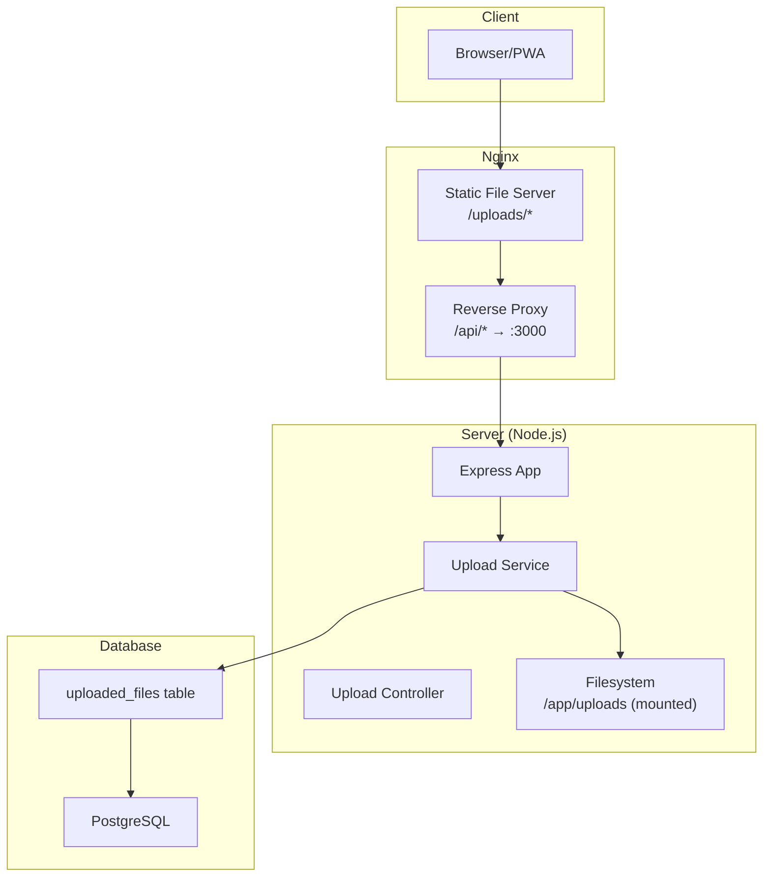
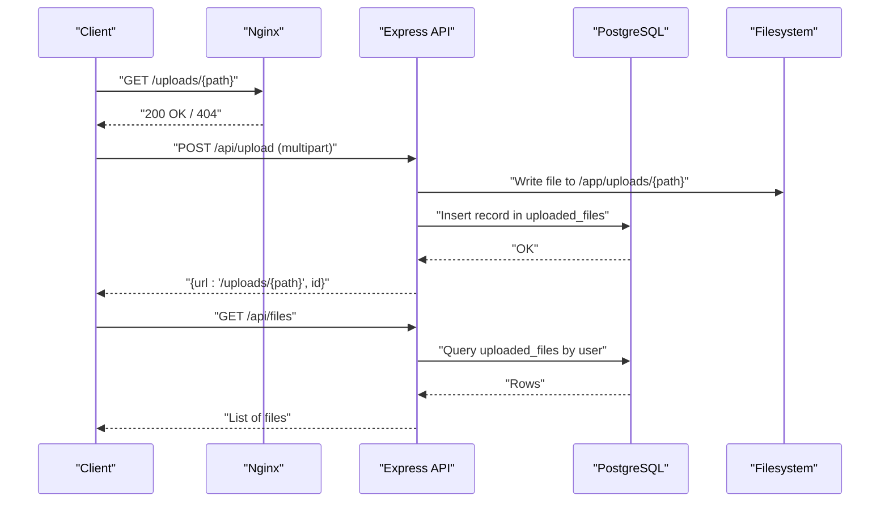
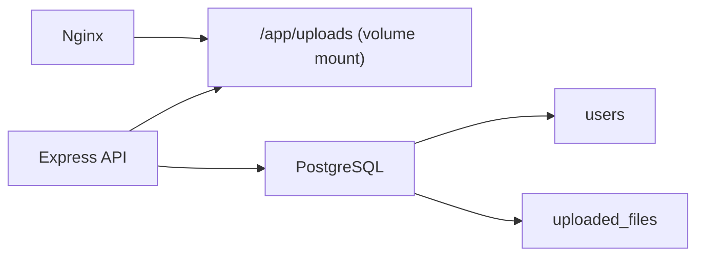

# Storage Management

<cite>
**Referenced Files in This Document**
- [ARCHITECTURE.md](file://arch/ARCHITECTURE.md)
- [001_init.sql](file://db/001_init.sql)
- [20260319_init.ts](file://code/server/src/db/migrations/20260319_init.ts)
- [docker-compose.yml](file://docker/docker-compose.yml)
- [nginx/default.conf](file://docker/nginx/default.conf)
- [index.ts](file://code/server/src/index.ts)
- [app.ts](file://code/server/src/app.ts)
- [config/index.ts](file://code/server/src/config/index.ts)
- [knexfile.ts](file://code/server/knexfile.ts)
- [README.md](file://README.md)
</cite>

## Table of Contents
1. [Introduction](#introduction)
2. [Project Structure](#project-structure)
3. [Core Components](#core-components)
4. [Architecture Overview](#architecture-overview)
5. [Detailed Component Analysis](#detailed-component-analysis)
6. [Dependency Analysis](#dependency-analysis)
7. [Performance Considerations](#performance-considerations)
8. [Troubleshooting Guide](#troubleshooting-guide)
9. [Conclusion](#conclusion)
10. [Appendices](#appendices)

## Introduction
This document explains the file storage management system for the Yule Notion application. It covers directory structure, file organization strategies, naming conventions, storage backend configuration, disk space management, cleanup procedures, access patterns, URL generation, content delivery optimization, security controls, backup and disaster recovery, and scaling considerations. The system uses a hybrid approach: metadata stored in PostgreSQL, while uploaded files are persisted to the local filesystem under a dedicated uploads directory. Nginx serves static assets and proxies API requests.

## Project Structure
The storage-related components are organized across the server runtime, database schema, and deployment stack:
- Server runtime: Express-based API exposes upload and download endpoints; uploads are written to a mounted volume.
- Database: PostgreSQL stores file metadata (name, MIME type, size, storage path, timestamps).
- Deployment: Nginx serves static files from the uploads directory and reverse-proxies API traffic.

**Diagram sources**
- [ARCHITECTURE.md:43-48](file://arch/ARCHITECTURE.md#L43-L48)
- [docker-compose.yml:554-585](file://docker/docker-compose.yml#L554-L585)
- [nginx/default.conf](file://docker/nginx/default.conf)

**Section sources**
- [ARCHITECTURE.md:14-87](file://arch/ARCHITECTURE.md#L14-L87)
- [docker-compose.yml:554-585](file://docker/docker-compose.yml#L554-L585)
- [nginx/default.conf](file://docker/nginx/default.conf)

## Core Components
- Upload metadata table: Tracks original filename, storage path, MIME type, size, and timestamps.
- Upload directory: Mounted volume for persistent file storage.
- Nginx static serving: Serves uploaded images and other static assets.
- API endpoints: Accept uploads, persist metadata, and return URLs for retrieval.

Key implementation anchors:
- Metadata table definition and constraints.
- Migration creating the uploaded_files table.
- Environment variables controlling upload directory and limits.
- Nginx configuration mapping /uploads/* to the mounted volume.

**Section sources**
- [001_init.sql:114-132](file://db/001_init.sql#L114-L132)
- [20260319_init.ts:138-161](file://code/server/src/db/migrations/20260319_init.ts#L138-L161)
- [config/index.ts:589-598](file://code/server/src/config/index.ts#L589-L598)
- [docker-compose.yml:567-569](file://docker/docker-compose.yml#L567-L569)

## Architecture Overview
The storage architecture separates concerns:
- Metadata: Immutable, queryable, and auditable in PostgreSQL.
- Content: Mutable binary blobs stored on the filesystem and served statically via Nginx.
- Access control: Enforced by application-layer authentication and per-user scoping in the database.

**Diagram sources**
- [ARCHITECTURE.md:43-48](file://arch/ARCHITECTURE.md#L43-L48)
- [docker-compose.yml:554-585](file://docker/docker-compose.yml#L554-L585)
- [001_init.sql:114-132](file://db/001_init.sql#L114-L132)

## Detailed Component Analysis

### Directory Structure and Naming Conventions
- Uploads directory: Configured via environment variable and mounted as a Docker volume for persistence.
- Storage path: Stored as a relative path in the database column storage_path. The effective URL is /uploads/{storage_path}.
- Naming strategy: The system does not enforce a specific naming scheme; applications should generate unique, safe filenames to avoid collisions and mitigate path traversal risks.

Operational anchors:
- Environment variable for upload directory.
- Mounting of the uploads volume in the compose file.
- Static route mapping in Nginx.

**Section sources**
- [config/index.ts:589-598](file://code/server/src/config/index.ts#L589-L598)
- [docker-compose.yml:567-569](file://docker/docker-compose.yml#L567-L569)
- [nginx/default.conf](file://docker/nginx/default.conf)

### Storage Backend Configuration
- Database: PostgreSQL with UUID primary keys, foreign keys to users, and indexes for efficient lookups.
- Constraints: Size checks limit uploads to 5 MB; indexes on user_id improve query performance.
- Application: Uses Knex for migrations and environment-driven configuration.

**Section sources**
- [001_init.sql:114-132](file://db/001_init.sql#L114-L132)
- [20260319_init.ts:138-161](file://code/server/src/db/migrations/20260319_init.ts#L138-L161)
- [knexfile.ts:13-23](file://code/server/knexfile.ts#L13-L23)

### Disk Space Management and Cleanup
- Size limits: Database constraints enforce a maximum file size (5 MB) per upload.
- Soft deletion pattern: The pages table supports soft deletion with a 30-day automatic cleanup policy; similar patterns can be applied to uploaded_files if needed.
- Cleanup procedures:
  - Retention policies: Define lifecycle rules (e.g., delete after N days) and schedule periodic cleanup jobs.
  - Manual cleanup: Administrators can remove stale records and corresponding files.
  - Monitoring: Track total disk usage and alert thresholds to prevent out-of-space conditions.

**Section sources**
- [001_init.sql:125-126](file://db/001_init.sql#L125-L126)
- [001_init.sql:240-243](file://db/001_init.sql#L240-L243)

### File Access Patterns and URL Generation
- Retrieval: Clients fetch /uploads/{storage_path}. Nginx serves files directly from the mounted volume.
- Metadata retrieval: Applications query uploaded_files to present lists and metadata.
- URL construction: Applications should construct URLs as /uploads/{storage_path} using the value stored in the database.

**Section sources**
- [ARCHITECTURE.md:43-48](file://arch/ARCHITECTURE.md#L43-L48)
- [001_init.sql:130-131](file://db/001_init.sql#L130-L131)

### Content Delivery Optimization
- Static serving: Nginx serves /uploads/* directly, reducing load on the Node.js process.
- Caching: Configure appropriate cache headers for static assets to minimize bandwidth and latency.
- Compression: Enable gzip/brotli compression for static content where applicable.

**Section sources**
- [ARCHITECTURE.md:43-48](file://arch/ARCHITECTURE.md#L43-L48)
- [nginx/default.conf](file://docker/nginx/default.conf)

### Security Measures
- Authentication and authorization: All API endpoints require JWT authentication; controllers filter queries by user context.
- CORS: Strict origin configuration enforced in production.
- Upload safety:
  - Size limits: Prevent abuse via oversized uploads.
  - MIME type validation: Validate content types and sanitize filenames.
  - Path traversal: Reject absolute paths and parent-directory traversal attempts.
  - Malware prevention: Implement virus scanning or sandboxed preview rendering for sensitive content.
- Least privilege: Nginx and Node.js run with minimal privileges; ensure file permissions restrict access to authorized users only.

**Section sources**
- [config/index.ts:52-67](file://code/server/src/config/index.ts#L52-L67)
- [001_init.sql:125-126](file://db/001_init.sql#L125-L126)

### Backup Strategies and Disaster Recovery
- Database backups: Schedule regular logical backups of PostgreSQL using pg_dump or continuous archiving.
- File backups: Back up the mounted uploads volume regularly; consider offsite replication.
- DR testing: Periodically restore backups to validate integrity and recovery time objectives.
- Immutable artifacts: Keep older versions of static assets backed up for quick rollback.

**Section sources**
- [docker-compose.yml:582-584](file://docker/docker-compose.yml#L582-L584)

### Storage Scaling Considerations
- Horizontal scaling: Run multiple API instances behind a load balancer; ensure shared storage or object storage for uploads.
- Object storage migration: Replace local filesystem with S3-compatible storage (e.g., MinIO) for global distribution and high availability.
- CDN integration: Serve static assets via CDN to reduce latency and bandwidth costs.
- Indexing and caching: Add Redis for session and cache layers; optimize database indexes for frequent queries.

[No sources needed since this section provides general guidance]

## Dependency Analysis
The storage subsystem depends on:
- Nginx for static file serving.
- PostgreSQL for metadata persistence.
- Docker Compose for orchestration and volume mounting.
- Knex for database migrations.

**Diagram sources**
- [docker-compose.yml:567-569](file://docker/docker-compose.yml#L567-L569)
- [001_init.sql:114-132](file://db/001_init.sql#L114-L132)

**Section sources**
- [docker-compose.yml:554-585](file://docker/docker-compose.yml#L554-L585)
- [knexfile.ts:62-68](file://code/server/knexfile.ts#L62-L68)

## Performance Considerations
- Optimize Nginx static serving with proper cache headers and compression.
- Tune PostgreSQL parameters for concurrent uploads and queries.
- Monitor disk I/O and network throughput during peak upload periods.
- Consider asynchronous processing for heavy transformations (e.g., thumbnails).

[No sources needed since this section provides general guidance]

## Troubleshooting Guide
- 404 on /uploads/*: Verify Nginx mapping and that the file exists in the mounted volume.
- Permission denied: Check container user permissions and mount permissions for the uploads directory.
- Upload failures: Review API logs for multer errors, disk space, and constraint violations.
- Slow downloads: Confirm Nginx caching and compression settings; check network bandwidth.

**Section sources**
- [ARCHITECTURE.md:43-48](file://arch/ARCHITECTURE.md#L43-L48)
- [docker-compose.yml:567-569](file://docker/docker-compose.yml#L567-L569)

## Conclusion
The Yule Notion storage system combines PostgreSQL-backed metadata with filesystem-based content, served efficiently by Nginx. By enforcing strong access controls, size limits, and robust backup and scaling strategies, the system can reliably support file uploads and retrieval at scale while maintaining security and performance.

## Appendices

### Example Storage Configuration
- Environment variables:
  - UPLOAD_DIR: sets the uploads directory path inside the container.
  - UPLOAD_MAX_SIZE: sets the maximum upload size (bytes).
- Docker volume:
  - Mount host path to /app/uploads to persist uploads across container restarts.
- Nginx:
  - Map /uploads/* to the mounted volume for static serving.

**Section sources**
- [config/index.ts:589-598](file://code/server/src/config/index.ts#L589-L598)
- [docker-compose.yml:567-569](file://docker/docker-compose.yml#L567-L569)
- [nginx/default.conf](file://docker/nginx/default.conf)

### File Retrieval Patterns
- Construct URLs as /uploads/{storage_path} using the value stored in the database column storage_path.
- Use the API to list files per user and render previews or links.

**Section sources**
- [001_init.sql:130-131](file://db/001_init.sql#L130-L131)

### Performance Monitoring Approaches
- Metrics: Track upload throughput, disk usage, Nginx response times, and database query latency.
- Alerts: Configure alerts for high disk usage, slow queries, and failed uploads.
- Logs: Centralize logs for API and Nginx to diagnose issues quickly.

[No sources needed since this section provides general guidance]