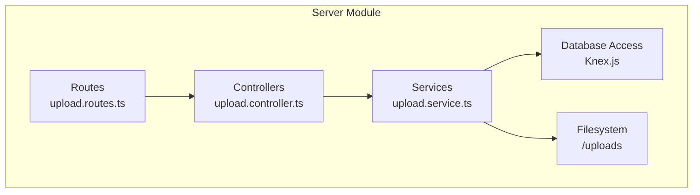
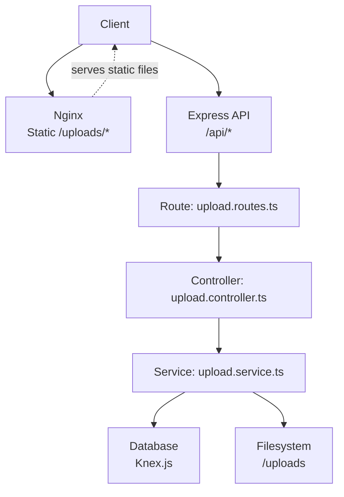
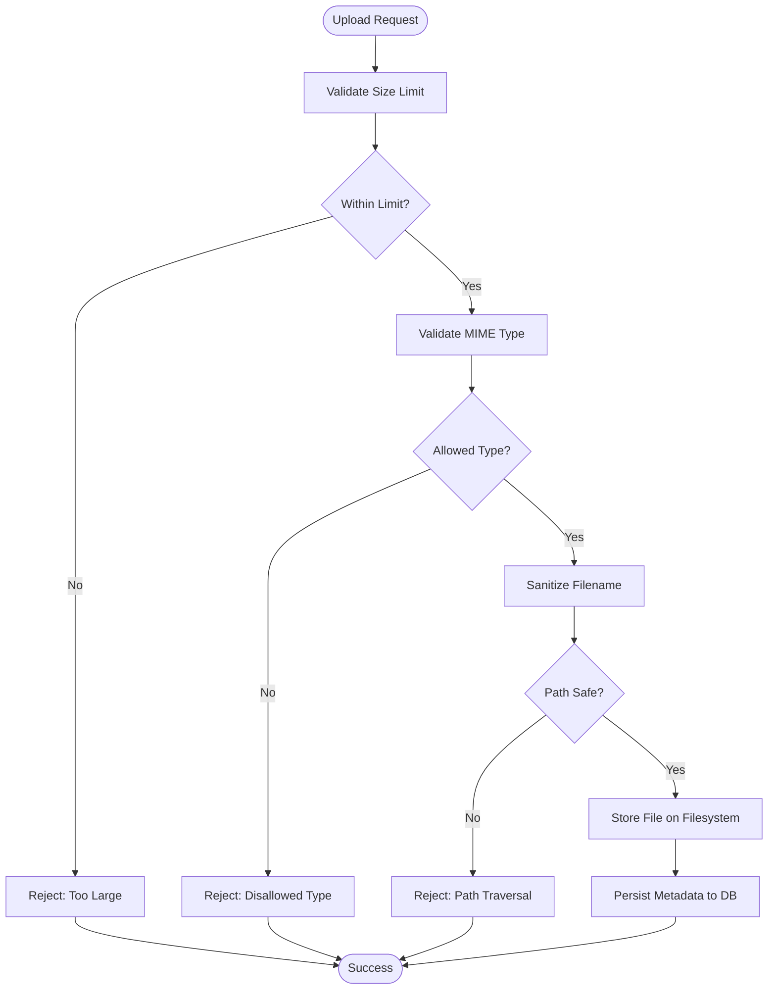
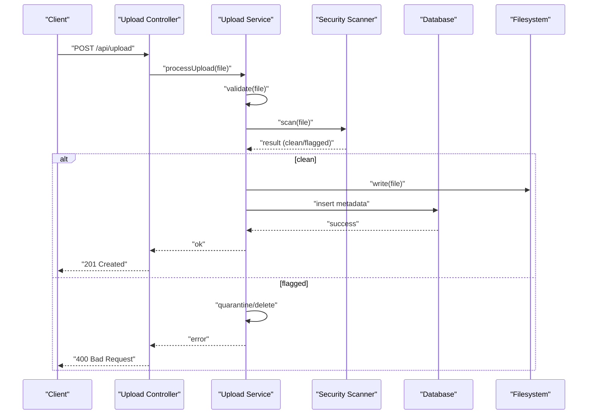
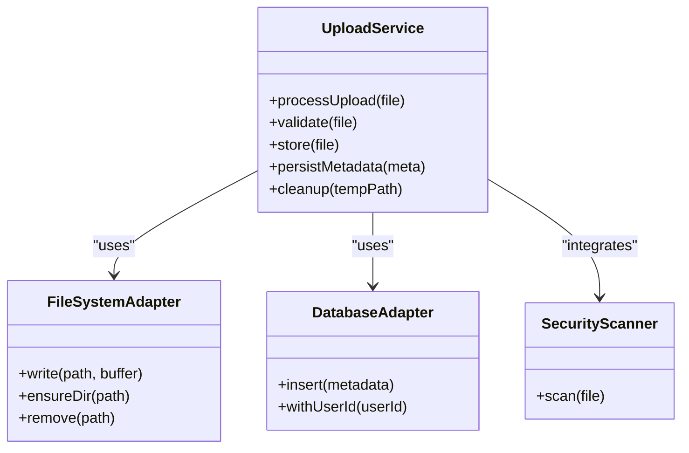
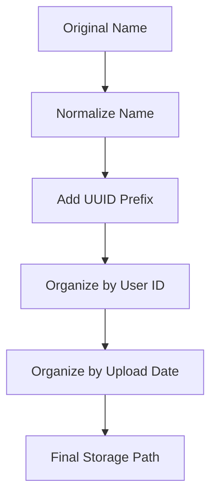
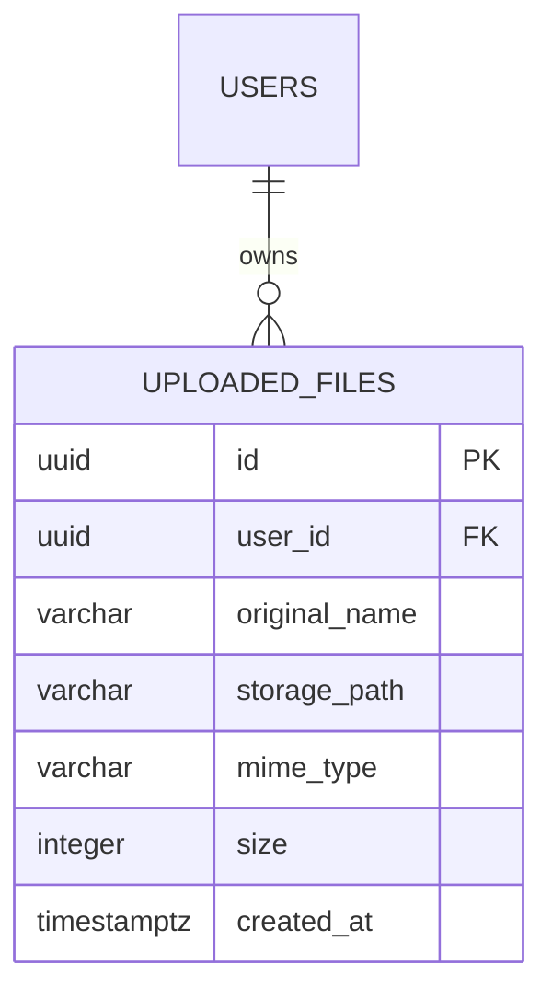
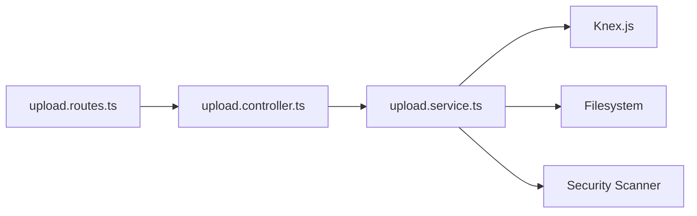

# Upload Service Layer

<cite>
**Referenced Files in This Document**
- [ARCHITECTURE.md](file://arch/ARCHITECTURE.md)
- [001_init.sql](file://db/001_init.sql)
- [20260319_init.ts](file://code/server/src/db/migrations/20260319_init.ts)
- [package.json](file://code/server/package.json)
</cite>

## Table of Contents
1. [Introduction](#introduction)
2. [Project Structure](#project-structure)
3. [Core Components](#core-components)
4. [Architecture Overview](#architecture-overview)
5. [Detailed Component Analysis](#detailed-component-analysis)
6. [Dependency Analysis](#dependency-analysis)
7. [Performance Considerations](#performance-considerations)
8. [Troubleshooting Guide](#troubleshooting-guide)
9. [Conclusion](#conclusion)

## Introduction
This document describes the upload service layer implementation for the Yule Notion project. It focuses on the service’s responsibilities for file processing, storage management, and metadata operations. It also documents file validation, security scanning integration, virus detection mechanisms, storage abstraction, file naming conventions, organizational strategies, database integration, filesystem management, cleanup procedures, performance optimization, concurrent upload handling, memory management, and error recovery strategies.

## Project Structure
The upload service layer is part of the backend server module. Based on the architecture documentation, the server module follows a layered structure with routes, controllers, services, and database access components. The upload service integrates with:
- Routes and controllers for HTTP request handling
- Services for business logic and orchestration
- Database access via Knex.js for metadata persistence
- Filesystem for actual file storage under a configured uploads directory
- Middleware for validation and error handling

**Section sources**
- [ARCHITECTURE.md:238-286](file://arch/ARCHITECTURE.md#L238-L286)

## Core Components
The upload service layer comprises:
- Validation pipeline: input validation, MIME type checks, size limits, and naming normalization
- Security scanning integration: placeholder for AV scanning hooks
- Storage management: filesystem write, path normalization, and cleanup procedures
- Metadata operations: database persistence of file records with constraints and indexing
- Error handling: centralized error handling via middleware and robust recovery strategies

Key responsibilities:
- Accept multipart/form-data uploads
- Validate file characteristics and reject unsafe or oversized files
- Persist metadata to the database
- Store files on the filesystem under a controlled directory
- Integrate with security scanning and virus detection systems
- Provide cleanup and maintenance routines for stale or failed uploads

**Section sources**
- [ARCHITECTURE.md:121-134](file://arch/ARCHITECTURE.md#L121-L134)
- [001_init.sql:117-133](file://db/001_init.sql#L117-L133)
- [20260319_init.ts:140-161](file://code/server/src/db/migrations/20260319_init.ts#L140-L161)

## Architecture Overview
The upload flow spans the route/controller/service layers and interacts with the database and filesystem. The architecture leverages:
- Express routes/controllers for request handling
- Upload service for validation, scanning, storage, and metadata persistence
- Knex.js for database operations
- Local filesystem for file storage under a dedicated uploads directory
- Nginx proxy serving static uploads

**Diagram sources**
- [ARCHITECTURE.md:43-48](file://arch/ARCHITECTURE.md#L43-L48)
- [ARCHITECTURE.md:259-267](file://arch/ARCHITECTURE.md#L259-L267)

## Detailed Component Analysis

### Upload Service Responsibilities
- File processing: normalize filenames, derive MIME types, enforce size limits, and sanitize paths
- Storage management: write to filesystem under a controlled directory, maintain consistent subfolder organization, and support cleanup
- Metadata operations: persist uploaded file records with constraints and indexes for efficient queries
- Security scanning integration: provide extension points for AV scanning and virus detection
- Cleanup procedures: remove temporary or failed uploads, manage stale files, and maintain disk hygiene

### File Validation Algorithms
Validation is enforced at multiple layers:
- Size limit: database constraint enforces maximum file size
- MIME type: controller/service validates against allowed types
- Filename sanitization: normalize and prevent path traversal
- Content-type verification: optional secondary check for safety

**Section sources**
- [001_init.sql:125](file://db/001_init.sql#L125)
- [20260319_init.ts:148](file://code/server/src/db/migrations/20260319_init.ts#L148)
- [ARCHITECTURE.md:129-134](file://arch/ARCHITECTURE.md#L129-L134)

### Security Scanning Integration and Virus Detection
Security scanning and virus detection are integrated as follows:
- Pre-storage hook: scan file after initial validation and before committing metadata
- Post-failure fallback: quarantine or delete flagged files and record failure events
- Audit trail: log scanning outcomes and decisions for compliance and debugging

**Section sources**
- [ARCHITECTURE.md:130](file://arch/ARCHITECTURE.md#L130)

### Storage Abstraction Layer
The storage abstraction separates concerns:
- Filesystem abstraction: controlled directory, normalized paths, and subfolder organization
- Database abstraction: Knex.js for metadata persistence with constraints and indexes
- Environment-driven configuration: upload directory and size limits

**Section sources**
- [ARCHITECTURE.md:275](file://arch/ARCHITECTURE.md#L275)
- [20260319_init.ts:140-161](file://code/server/src/db/migrations/20260319_init.ts#L140-L161)

### File Naming Conventions and Organization
Naming and organization strategies:
- Normalize filenames to avoid collisions and path traversal
- Organize by user ID and date to improve scalability and cleanup
- Use UUIDs for internal identifiers and stable references
- Maintain relative storage paths for auditability and portability

**Section sources**
- [001_init.sql:130-132](file://db/001_init.sql#L130-L132)
- [ARCHITECTURE.md:596-597](file://arch/ARCHITECTURE.md#L596-L597)

### Database Integration and Metadata Operations
Metadata schema and constraints:
- Unique identifiers, user association, original name, storage path, MIME type, size, and timestamps
- Size constraint ensures compliance with policy
- Index on user ID for efficient queries
- Comments clarify intent and path semantics

**Diagram sources**
- [20260319_init.ts:140-161](file://code/server/src/db/migrations/20260319_init.ts#L140-L161)
- [001_init.sql:117-133](file://db/001_init.sql#L117-L133)

**Section sources**
- [20260319_init.ts:140-161](file://code/server/src/db/migrations/20260319_init.ts#L140-L161)
- [001_init.sql:117-133](file://db/001_init.sql#L117-L133)

### Cleanup Procedures
Cleanup strategies:
- Temporary file removal after validation failures
- Quarantine of flagged files pending manual review
- Periodic cleanup of orphaned or stale entries
- Rollback on partial failures to maintain consistency

**Section sources**
- [ARCHITECTURE.md:130](file://arch/ARCHITECTURE.md#L130)

### Concurrent Upload Handling and Memory Management
Concurrency and memory considerations:
- Stream uploads to avoid loading entire files into memory
- Use chunked processing for large files
- Apply rate limiting and concurrency caps via middleware
- Employ transactional writes to ensure atomicity

**Section sources**
- [package.json:18-26](file://code/server/package.json#L18-L26)
- [ARCHITECTURE.md:129-134](file://arch/ARCHITECTURE.md#L129-L134)

### Examples of Service Method Implementations
- processUpload(file): orchestrates validation, scanning, storage, and metadata persistence
- validate(file): enforces size, MIME type, and path safety
- store(file): writes to filesystem with normalized path
- persistMetadata(meta): inserts record into database with constraints
- cleanup(tempPath): removes temporary or failed uploads

These methods are defined in the upload service module and coordinate with controllers, database adapters, and filesystem adapters.

**Section sources**
- [ARCHITECTURE.md:275](file://arch/ARCHITECTURE.md#L275)

## Dependency Analysis
The upload service depends on:
- Express routes/controllers for request handling
- Zod-based validation middleware for input schema enforcement
- Knex.js for database operations
- Filesystem for storage
- Security scanner for virus detection

**Diagram sources**
- [ARCHITECTURE.md:259-267](file://arch/ARCHITECTURE.md#L259-L267)
- [package.json:26](file://code/server/package.json#L26)

**Section sources**
- [package.json:18-26](file://code/server/package.json#L18-L26)
- [ARCHITECTURE.md:259-267](file://arch/ARCHITECTURE.md#L259-L267)

## Performance Considerations
- Stream-based uploads to reduce memory footprint
- Asynchronous scanning to avoid blocking requests
- Batched database writes and transactions for throughput
- CDN/static serving via Nginx for reduced server load
- Indexes and constraints for fast lookups and data integrity

[No sources needed since this section provides general guidance]

## Troubleshooting Guide
Common issues and resolutions:
- Upload rejected due to size: adjust client-side limits and server constraints
- MIME type mismatch: whitelist allowed types and validate early
- Disk space errors: monitor storage quotas and enable cleanup
- Database constraint violations: ensure metadata schema alignment
- Security scanner timeouts: tune scanner thresholds and retry policies

**Section sources**
- [001_init.sql:125](file://db/001_init.sql#L125)
- [20260319_init.ts:148](file://code/server/src/db/migrations/20260319_init.ts#L148)
- [ARCHITECTURE.md:596-597](file://arch/ARCHITECTURE.md#L596-L597)

## Conclusion
The upload service layer integrates validation, security scanning, storage, and metadata persistence into a cohesive pipeline. It leverages environment-driven configuration, database constraints, and filesystem organization to ensure reliability, scalability, and security. The architecture supports concurrent uploads, memory-efficient processing, and robust error recovery, while providing clear extension points for advanced scanning and cleanup strategies.