# Build Configuration

<cite>
**Referenced Files in This Document**
- [vite.config.ts](file://code/client/vite.config.ts)
- [package.json](file://code/client/package.json)
- [tsconfig.json](file://code/client/tsconfig.json)
- [tsconfig.node.json](file://code/client/tsconfig.node.json)
- [uno.config.ts](file://code/client/uno.config.ts)
- [env.d.ts](file://code/client/env.d.ts)
- [main.ts](file://code/client/src/main.ts)
- [index.ts](file://code/client/src/router/index.ts)
- [api.ts](file://code/client/src/services/api.ts)
- [App.vue](file://code/client/src/App.vue)
- [deploy-frontend.yml](file://.github/workflows/deploy-frontend.yml)
</cite>

## Table of Contents
1. [Introduction](#introduction)
2. [Project Structure](#project-structure)
3. [Core Components](#core-components)
4. [Architecture Overview](#architecture-overview)
5. [Detailed Component Analysis](#detailed-component-analysis)
6. [Dependency Analysis](#dependency-analysis)
7. [Performance Considerations](#performance-considerations)
8. [Troubleshooting Guide](#troubleshooting-guide)
9. [Conclusion](#conclusion)
10. [Appendices](#appendices)

## Introduction
This document explains the Vite build system and development configuration for the frontend client. It covers Vite configuration options, plugin integrations, TypeScript compilation settings, path aliases, development server setup, proxying for API requests, and production deployment via GitHub Actions. It also outlines build customization, asset optimization, environment variable handling, conditional compilation, and performance optimization techniques. Integration with UnoCSS and Vue Single-File Components (SFC) is documented alongside development workflow automation.

## Project Structure
The frontend client is organized under code/client with the following build-related artifacts:
- Vite configuration defines plugins, path aliases, dev server, and CSS preprocessing hooks.
- TypeScript configurations split for browser/runtime contexts.
- UnoCSS configuration defines presets, theme, and shortcuts.
- Environment type declarations enable SFC recognition and Vite env typing.
- Application entry initializes Vue, Pinia, Router, and global styles.
- Router and services integrate with the dev proxy and base URLs.
- GitHub Actions workflow automates building and deploying the built assets to GitHub Pages.

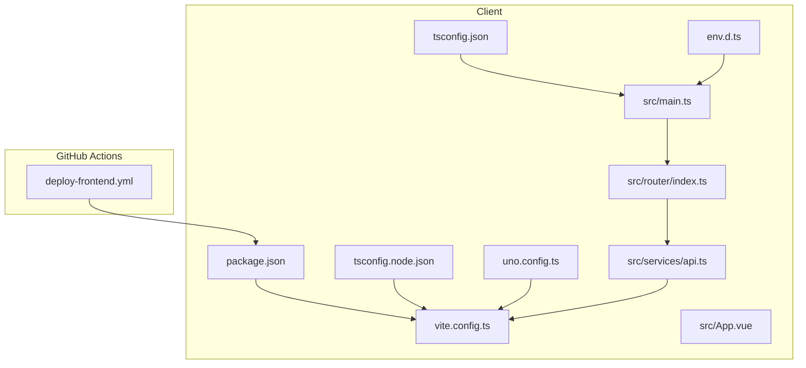

**Diagram sources**
- [vite.config.ts:1-37](file://code/client/vite.config.ts#L1-L37)
- [package.json:1-53](file://code/client/package.json#L1-L53)
- [tsconfig.json:1-35](file://code/client/tsconfig.json#L1-L35)
- [tsconfig.node.json:1-28](file://code/client/tsconfig.node.json#L1-L28)
- [uno.config.ts:1-52](file://code/client/uno.config.ts#L1-L52)
- [env.d.ts:1-26](file://code/client/env.d.ts#L1-L26)
- [main.ts:1-54](file://code/client/src/main.ts#L1-L54)
- [index.ts:1-93](file://code/client/src/router/index.ts#L1-L93)
- [api.ts:1-64](file://code/client/src/services/api.ts#L1-L64)
- [App.vue:1-20](file://code/client/src/App.vue#L1-L20)
- [deploy-frontend.yml:1-55](file://.github/workflows/deploy-frontend.yml#L1-L55)

**Section sources**
- [vite.config.ts:1-37](file://code/client/vite.config.ts#L1-L37)
- [package.json:1-53](file://code/client/package.json#L1-L53)
- [tsconfig.json:1-35](file://code/client/tsconfig.json#L1-L35)
- [tsconfig.node.json:1-28](file://code/client/tsconfig.node.json#L1-L28)
- [uno.config.ts:1-52](file://code/client/uno.config.ts#L1-L52)
- [env.d.ts:1-26](file://code/client/env.d.ts#L1-L26)
- [main.ts:1-54](file://code/client/src/main.ts#L1-L54)
- [index.ts:1-93](file://code/client/src/router/index.ts#L1-L93)
- [api.ts:1-64](file://code/client/src/services/api.ts#L1-L64)
- [App.vue:1-20](file://code/client/src/App.vue#L1-L20)
- [deploy-frontend.yml:1-55](file://.github/workflows/deploy-frontend.yml#L1-L55)

## Core Components
- Vite configuration
  - Plugins: Vue SFC support and UnoCSS integration.
  - Path alias: '@' resolves to the src directory.
  - Dev server: port and API proxy to the backend service.
  - CSS preprocessing hooks available for advanced setups.
- TypeScript configurations
  - Browser-side tsconfig enables bundler module resolution, strictness, path aliases, and Vue-specific types.
  - Node-side tsconfig targets Node runtime for Vite/Uno configs.
- UnoCSS configuration
  - Presets: default Uno and icon preset with scaling and warnings.
  - Theme and shortcuts for consistent design tokens and reusable utilities.
- Environment types
  - Global module declaration for Vue SFCs.
  - Vite environment variable typing for typed access in code.
- Application bootstrap
  - Entry imports virtual UnoCSS stylesheet and global styles, sets up Pinia and Router, and mounts the app after initializing auth and theme.
- Router and API service
  - Router uses history mode with scroll behavior and navigation guards.
  - API service uses a base path compatible with the dev proxy and attaches auth tokens automatically.

**Section sources**
- [vite.config.ts:12-36](file://code/client/vite.config.ts#L12-L36)
- [tsconfig.json:1-35](file://code/client/tsconfig.json#L1-L35)
- [tsconfig.node.json:1-28](file://code/client/tsconfig.node.json#L1-L28)
- [uno.config.ts:12-51](file://code/client/uno.config.ts#L12-L51)
- [env.d.ts:8-25](file://code/client/env.d.ts#L8-L25)
- [main.ts:18-53](file://code/client/src/main.ts#L18-L53)
- [index.ts:50-90](file://code/client/src/router/index.ts#L50-L90)
- [api.ts:14-24](file://code/client/src/services/api.ts#L14-L24)

## Architecture Overview
The development and build pipeline integrates Vite, Vue, UnoCSS, TypeScript, and Axios. The dev server proxies API requests to the backend during local development. Production builds are compiled with TypeScript and Vite, then deployed to GitHub Pages via a CI workflow.

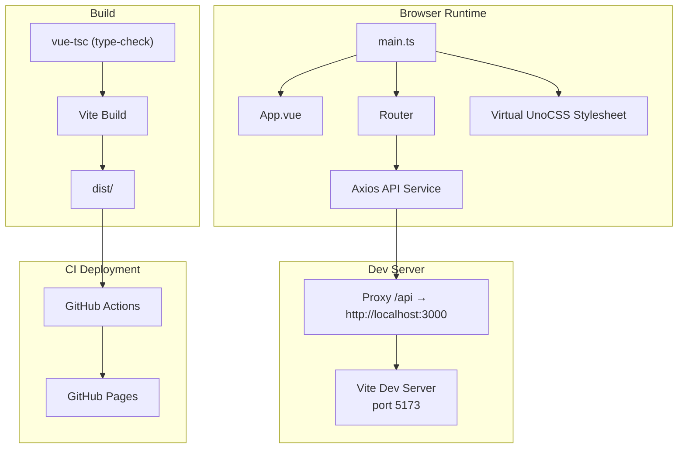

**Diagram sources**
- [vite.config.ts:23-31](file://code/client/vite.config.ts#L23-L31)
- [main.ts:18-21](file://code/client/src/main.ts#L18-L21)
- [App.vue:16-19](file://code/client/src/App.vue#L16-L19)
- [index.ts:50-61](file://code/client/src/router/index.ts#L50-L61)
- [api.ts:14-24](file://code/client/src/services/api.ts#L14-L24)
- [package.json:6-9](file://code/client/package.json#L6-L9)
- [deploy-frontend.yml:33-43](file://.github/workflows/deploy-frontend.yml#L33-L43)

## Detailed Component Analysis

### Vite Configuration
Key aspects:
- Plugin stack includes Vue SFC and UnoCSS.
- Path alias '@' mapped to src for concise imports.
- Dev server configured with port and API proxy to backend.
- CSS preprocessor options available for future expansion.

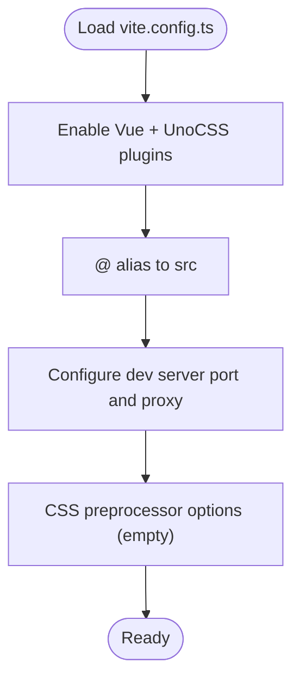

**Diagram sources**
- [vite.config.ts:12-36](file://code/client/vite.config.ts#L12-L36)

**Section sources**
- [vite.config.ts:12-36](file://code/client/vite.config.ts#L12-L36)

### TypeScript Compilation Settings
- Browser tsconfig
  - Module resolution via bundler, strictness enabled, path aliases, and Vue client types included.
  - Includes Vue, TS, and Uno configs for type-aware builds.
- Node tsconfig
  - Targets Node runtime for Vite and Uno configs, strictness enabled, and includes Node types.

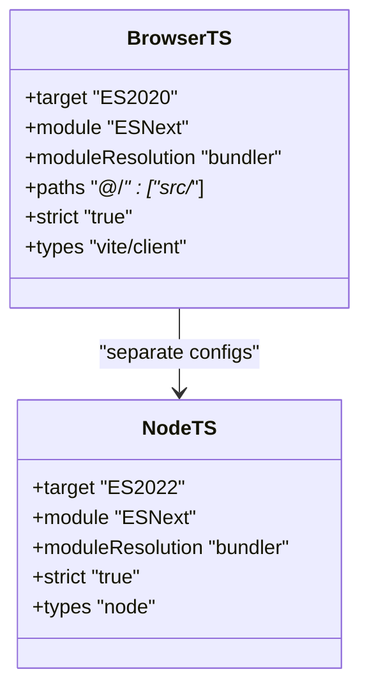

**Diagram sources**
- [tsconfig.json:2-32](file://code/client/tsconfig.json#L2-L32)
- [tsconfig.node.json:2-25](file://code/client/tsconfig.node.json#L2-L25)

**Section sources**
- [tsconfig.json:2-32](file://code/client/tsconfig.json#L2-L32)
- [tsconfig.node.json:2-25](file://code/client/tsconfig.node.json#L2-L25)

### Path Aliases and Type Checking
- Path alias '@' resolves to src in both Vite and TypeScript configurations.
- Vue SFC module declaration ensures TypeScript recognizes .vue imports.
- Vite environment variable typing supports typed access to VITE_* variables.

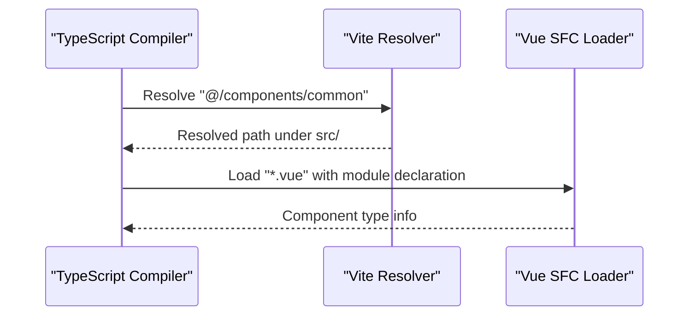

**Diagram sources**
- [tsconfig.json:17-21](file://code/client/tsconfig.json#L17-L21)
- [env.d.ts:8-13](file://code/client/env.d.ts#L8-L13)

**Section sources**
- [tsconfig.json:17-21](file://code/client/tsconfig.json#L17-L21)
- [env.d.ts:8-13](file://code/client/env.d.ts#L8-L13)

### Development Server, Proxy, and Hot Module Replacement
- Dev server runs on port 5173.
- API requests under '/api' are proxied to the backend service.
- Vue plugin enables fast HMR during development.

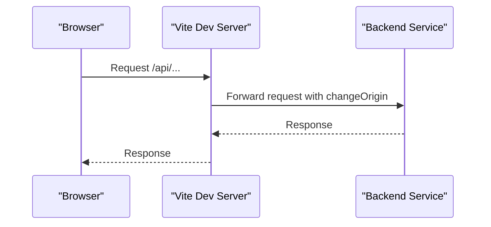

**Diagram sources**
- [vite.config.ts:23-31](file://code/client/vite.config.ts#L23-L31)
- [api.ts:14-24](file://code/client/src/services/api.ts#L14-L24)

**Section sources**
- [vite.config.ts:23-31](file://code/client/vite.config.ts#L23-L31)
- [api.ts:14-24](file://code/client/src/services/api.ts#L14-L24)

### UnoCSS Integration
- UnoCSS plugin is registered in Vite.
- Virtual module import in the entry ensures styles are generated and injected.
- Uno config defines presets, theme colors, and shortcuts for consistent UI.

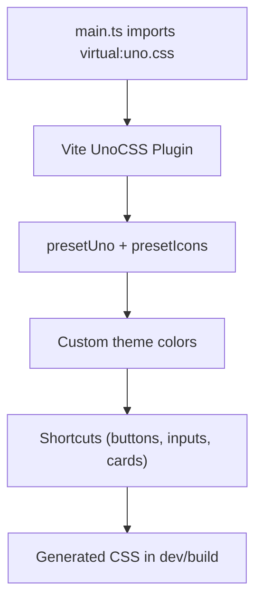

**Diagram sources**
- [main.ts:18-19](file://code/client/src/main.ts#L18-L19)
- [uno.config.ts:12-51](file://code/client/uno.config.ts#L12-L51)
- [vite.config.ts:13-15](file://code/client/vite.config.ts#L13-L15)

**Section sources**
- [main.ts:18-19](file://code/client/src/main.ts#L18-L19)
- [uno.config.ts:12-51](file://code/client/uno.config.ts#L12-L51)
- [vite.config.ts:13-15](file://code/client/vite.config.ts#L13-L15)

### Vue SFC Processing and Router Integration
- Vue plugin handles SFC compilation and HMR.
- Router uses history mode and scroll behavior, with navigation guards protecting routes.
- Root component renders the current route view.

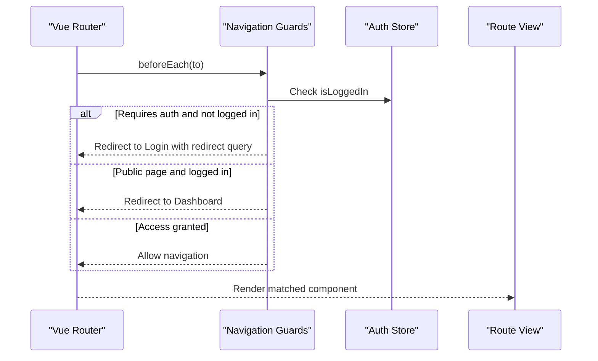

**Diagram sources**
- [index.ts:68-90](file://code/client/src/router/index.ts#L68-L90)
- [App.vue:16-19](file://code/client/src/App.vue#L16-L19)

**Section sources**
- [index.ts:50-90](file://code/client/src/router/index.ts#L50-L90)
- [App.vue:16-19](file://code/client/src/App.vue#L16-L19)

### API Service and Base URL Compatibility
- Axios instance configured with a base path aligned to the dev proxy.
- Request interceptor injects Authorization header from local storage.
- Response interceptor handles 401 by clearing credentials and redirecting to login.

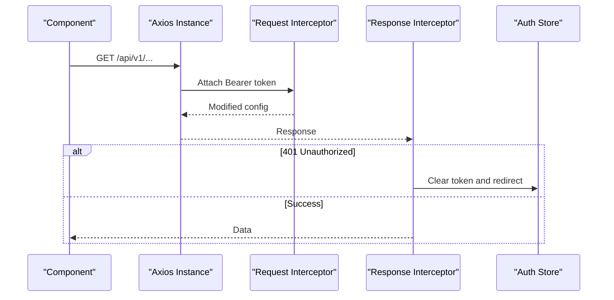

**Diagram sources**
- [api.ts:14-61](file://code/client/src/services/api.ts#L14-L61)

**Section sources**
- [api.ts:14-61](file://code/client/src/services/api.ts#L14-L61)

### Build Customization and Asset Optimization
- Build script compiles TypeScript first, then bundles with Vite.
- CSS preprocessor options are available for advanced setups (e.g., global variables, additional preprocessors).
- UnoCSS generates atomic CSS in both dev and prod, minimizing bundle size.

Recommended customization areas:
- Add Vite build plugins for asset optimization (e.g., minification, image optimization).
- Configure CSS preprocessor options for global variables or shared mixins.
- Introduce asset hashing and CDN configuration for production.

**Section sources**
- [package.json:6-9](file://code/client/package.json#L6-L9)
- [vite.config.ts:33-35](file://code/client/vite.config.ts#L33-L35)
- [uno.config.ts:12-51](file://code/client/uno.config.ts#L12-L51)

### Environment Variable Handling and Conditional Compilation
- Typed environment variables are declared globally for Vite.
- Access to VITE_* variables is supported in code via import.meta.env.
- Conditional compilation can leverage Vite’s define mechanism for feature flags.

Practical usage:
- Define environment-specific base URLs using VITE_API_BASE_URL.
- Gate features behind environment flags for dev/prod toggles.

**Section sources**
- [env.d.ts:15-25](file://code/client/env.d.ts#L15-L25)
- [vite.config.ts:12-16](file://code/client/vite.config.ts#L12-L16)

### Development Workflow Automation
- Scripts:
  - dev: starts Vite dev server.
  - build: runs type-check then Vite build.
  - preview: serves the built assets locally.
- CI workflow:
  - Checks out code, installs dependencies, builds, configures GitHub Pages, and uploads the dist artifact.

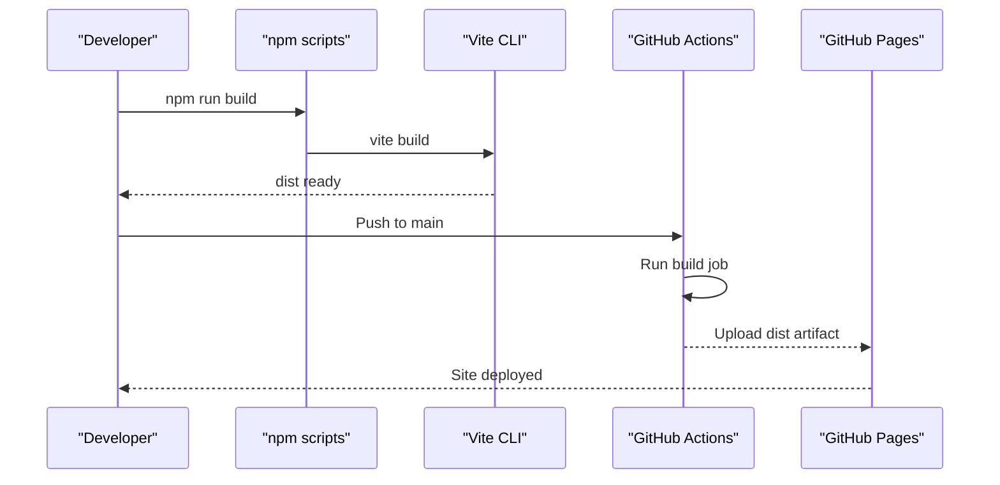

**Diagram sources**
- [package.json:6-9](file://code/client/package.json#L6-L9)
- [deploy-frontend.yml:18-54](file://.github/workflows/deploy-frontend.yml#L18-L54)

**Section sources**
- [package.json:6-9](file://code/client/package.json#L6-L9)
- [deploy-frontend.yml:18-54](file://.github/workflows/deploy-frontend.yml#L18-L54)

## Dependency Analysis
- Vite depends on plugins for Vue and UnoCSS.
- TypeScript configs depend on Node/Vite types and Vue client types.
- Application entry depends on UnoCSS virtual module and global styles.
- Router and API service depend on environment and proxy configuration.

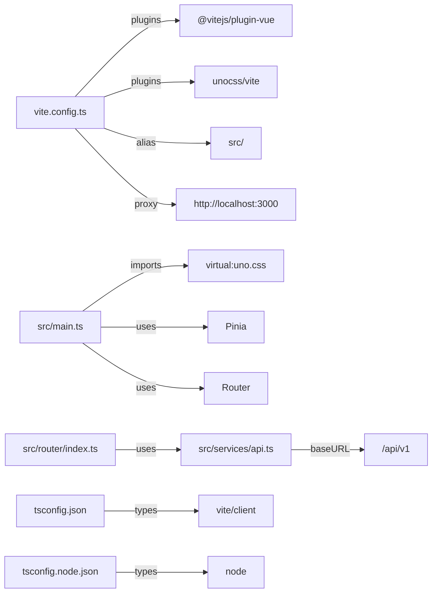

**Diagram sources**
- [vite.config.ts:12-36](file://code/client/vite.config.ts#L12-L36)
- [main.ts:18-31](file://code/client/src/main.ts#L18-L31)
- [index.ts:50-61](file://code/client/src/router/index.ts#L50-L61)
- [api.ts:14-24](file://code/client/src/services/api.ts#L14-L24)
- [tsconfig.json:30-32](file://code/client/tsconfig.json#L30-L32)
- [tsconfig.node.json](file://code/client/tsconfig.node.json#L24)

**Section sources**
- [vite.config.ts:12-36](file://code/client/vite.config.ts#L12-L36)
- [main.ts:18-31](file://code/client/src/main.ts#L18-L31)
- [index.ts:50-61](file://code/client/src/router/index.ts#L50-L61)
- [api.ts:14-24](file://code/client/src/services/api.ts#L14-L24)
- [tsconfig.json:30-32](file://code/client/tsconfig.json#L30-L32)
- [tsconfig.node.json](file://code/client/tsconfig.node.json#L24)

## Performance Considerations
- Keep plugins minimal and scoped to features in use.
- Enable tree-shaking via ES modules and avoid unused dependencies.
- Use UnoCSS shortcuts and atomic CSS to reduce CSS payload.
- Leverage Vite’s built-in minification and asset handling in production.
- Consider splitting large vendor chunks and enabling dynamic imports for route components.

[No sources needed since this section provides general guidance]

## Troubleshooting Guide
- Proxy not forwarding requests
  - Verify dev server proxy configuration and backend availability.
  - Confirm API base path matches the proxy target.
- 401 errors in development
  - Ensure Authorization header is attached and token exists in local storage.
  - Check response interceptor behavior and login state.
- UnoCSS styles missing
  - Confirm virtual module import in the entry and UnoCSS plugin registration.
- TypeScript errors in SFC or env vars
  - Validate Vue module declaration and environment variable typing.
  - Ensure tsconfig includes relevant files and types.

**Section sources**
- [vite.config.ts:23-31](file://code/client/vite.config.ts#L23-L31)
- [api.ts:30-61](file://code/client/src/services/api.ts#L30-L61)
- [main.ts:18-19](file://code/client/src/main.ts#L18-L19)
- [env.d.ts:8-25](file://code/client/env.d.ts#L8-L25)

## Conclusion
The Vite setup integrates Vue, UnoCSS, and TypeScript with a clean dev proxy and robust type safety. The build process is automated and deployable to GitHub Pages. Extending the configuration—such as adding asset optimization plugins, expanding CSS preprocessing, and introducing environment-based feature flags—can further improve developer experience and runtime performance.

[No sources needed since this section summarizes without analyzing specific files]

## Appendices
- Example build customization pointers
  - Add Vite plugins for asset optimization and minification.
  - Configure CSS preprocessor options for global variables.
  - Integrate CDN and asset hashing for production.
- Production deployment
  - The CI workflow builds and uploads the dist folder to GitHub Pages.

**Section sources**
- [package.json:6-9](file://code/client/package.json#L6-L9)
- [deploy-frontend.yml:33-43](file://.github/workflows/deploy-frontend.yml#L33-L43)