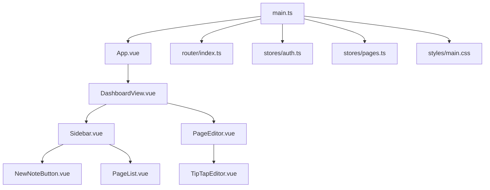
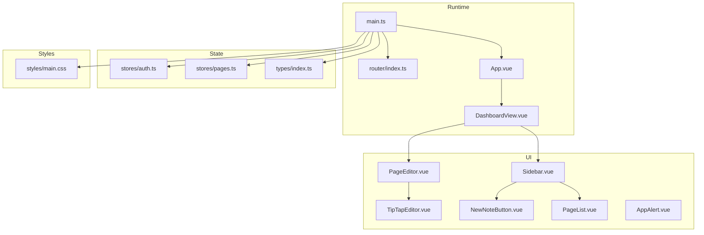
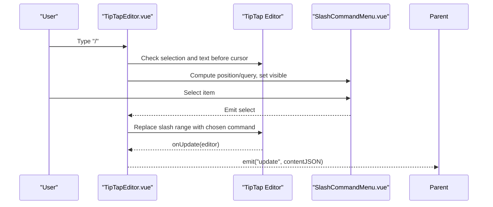
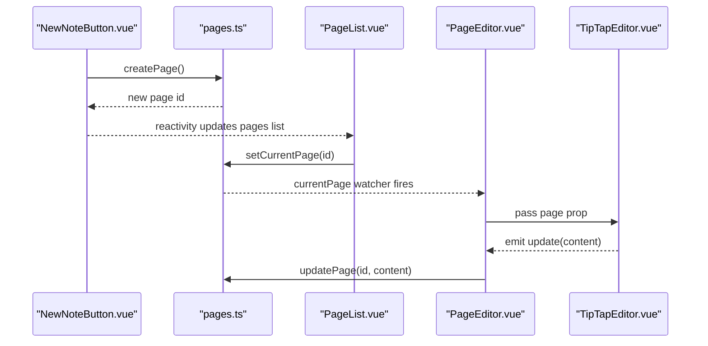
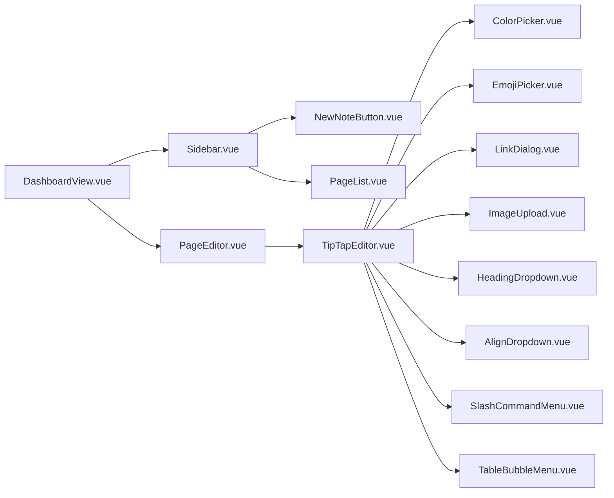
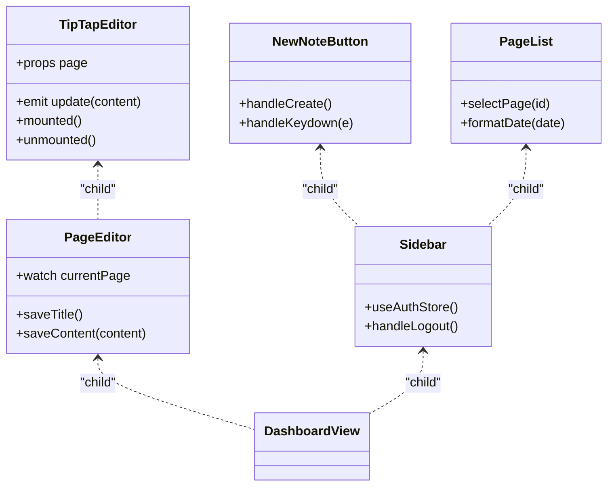

# Component Architecture

<cite>
**Referenced Files in This Document**
- [App.vue](file://code/client/src/App.vue)
- [main.ts](file://code/client/src/main.ts)
- [DashboardView.vue](file://code/client/src/views/DashboardView.vue)
- [Sidebar.vue](file://code/client/src/components/sidebar/Sidebar.vue)
- [NewNoteButton.vue](file://code/client/src/components/sidebar/NewNoteButton.vue)
- [PageList.vue](file://code/client/src/components/sidebar/PageList.vue)
- [PageEditor.vue](file://code/client/src/components/editor/PageEditor.vue)
- [TipTapEditor.vue](file://code/client/src/components/editor/TipTapEditor.vue)
- [AppAlert.vue](file://code/client/src/components/common/AppAlert.vue)
- [index.ts](file://code/client/src/router/index.ts)
- [auth.ts](file://code/client/src/stores/auth.ts)
- [pages.ts](file://code/client/src/stores/pages.ts)
- [index.ts](file://code/client/src/types/index.ts)
- [main.css](file://code/client/src/styles/main.css)
</cite>

## Table of Contents
1. [Introduction](#introduction)
2. [Project Structure](#project-structure)
3. [Core Components](#core-components)
4. [Architecture Overview](#architecture-overview)
5. [Detailed Component Analysis](#detailed-component-analysis)
6. [Dependency Analysis](#dependency-analysis)
7. [Performance Considerations](#performance-considerations)
8. [Troubleshooting Guide](#troubleshooting-guide)
9. [Conclusion](#conclusion)
10. [Appendices](#appendices)

## Introduction
This document describes the Vue 3 component architecture and design patterns implemented in the Notion-like editor. It focuses on component hierarchy, composition patterns, reusable component design, lifecycle usage, prop/event/slot conventions, and the implementation of complex components such as TipTapEditor, Sidebar, and PageEditor. It also covers dependency injection via provide/inject, component communication, performance optimization, memory management, accessibility considerations, and the styling approach using CSS modules and UnoCSS.

## Project Structure
The front-end is organized around a dashboard layout with a sidebar and a page editor. Routing guards protect authenticated views. Stores manage global state for authentication and pages. Styles are centralized with CSS variables and UnoCSS.

**Diagram sources**
- [main.ts:1-54](file://code/client/src/main.ts#L1-L54)
- [App.vue:1-20](file://code/client/src/App.vue#L1-L20)
- [DashboardView.vue:1-32](file://code/client/src/views/DashboardView.vue#L1-L32)
- [Sidebar.vue:1-216](file://code/client/src/components/sidebar/Sidebar.vue#L1-L216)
- [PageEditor.vue:1-208](file://code/client/src/components/editor/PageEditor.vue#L1-L208)
- [TipTapEditor.vue:1-833](file://code/client/src/components/editor/TipTapEditor.vue#L1-L833)
- [NewNoteButton.vue:1-114](file://code/client/src/components/sidebar/NewNoteButton.vue#L1-L114)
- [PageList.vue:1-168](file://code/client/src/components/sidebar/PageList.vue#L1-L168)
- [index.ts:1-93](file://code/client/src/router/index.ts#L1-L93)
- [auth.ts:1-138](file://code/client/src/stores/auth.ts#L1-L138)
- [pages.ts:1-165](file://code/client/src/stores/pages.ts#L1-L165)
- [main.css:1-65](file://code/client/src/styles/main.css#L1-L65)

**Section sources**
- [main.ts:1-54](file://code/client/src/main.ts#L1-L54)
- [DashboardView.vue:1-32](file://code/client/src/views/DashboardView.vue#L1-L32)

## Core Components
- App.vue: Root component rendering router-view.
- DashboardView.vue: Layout container for Sidebar and PageEditor.
- Sidebar.vue: Left navigation with logo, new note button, page list, and user area.
- PageEditor.vue: Top-level editor wrapper managing title editing and delegating content editing to TipTapEditor.
- TipTapEditor.vue: Rich text editor built with TipTap, including toolbar, slash command menu, bubble menu, dialogs, and paste/image handling.
- NewNoteButton.vue: Creates new pages and supports keyboard shortcuts.
- PageList.vue: Lists root pages and highlights the current selection.
- AppAlert.vue: Global alert stack with auto-dismiss and transitions.
- Router: Guards protected routes and redirects.
- Stores: Pinia stores for auth and pages.
- Types: Shared TypeScript interfaces.

**Section sources**
- [App.vue:1-20](file://code/client/src/App.vue#L1-L20)
- [DashboardView.vue:1-32](file://code/client/src/views/DashboardView.vue#L1-L32)
- [Sidebar.vue:1-216](file://code/client/src/components/sidebar/Sidebar.vue#L1-L216)
- [PageEditor.vue:1-208](file://code/client/src/components/editor/PageEditor.vue#L1-L208)
- [TipTapEditor.vue:1-833](file://code/client/src/components/editor/TipTapEditor.vue#L1-L833)
- [NewNoteButton.vue:1-114](file://code/client/src/components/sidebar/NewNoteButton.vue#L1-L114)
- [PageList.vue:1-168](file://code/client/src/components/sidebar/PageList.vue#L1-L168)
- [AppAlert.vue:1-136](file://code/client/src/components/common/AppAlert.vue#L1-L136)
- [index.ts:1-93](file://code/client/src/router/index.ts#L1-L93)
- [auth.ts:1-138](file://code/client/src/stores/auth.ts#L1-L138)
- [pages.ts:1-165](file://code/client/src/stores/pages.ts#L1-L165)
- [index.ts:1-101](file://code/client/src/types/index.ts#L1-L101)

## Architecture Overview
The application follows a classic SPA pattern:
- Entry initializes Vue, Pinia, and Router, then mounts the app.
- Router guards enforce authentication for protected routes.
- DashboardView composes Sidebar and PageEditor.
- PageEditor orchestrates title editing and delegates rich content editing to TipTapEditor.
- Stores manage shared state for auth and pages.
- Styles are applied globally via UnoCSS reset and theme variables.

**Diagram sources**
- [main.ts:1-54](file://code/client/src/main.ts#L1-L54)
- [index.ts:1-93](file://code/client/src/router/index.ts#L1-L93)
- [App.vue:1-20](file://code/client/src/App.vue#L1-L20)
- [DashboardView.vue:1-32](file://code/client/src/views/DashboardView.vue#L1-L32)
- [Sidebar.vue:1-216](file://code/client/src/components/sidebar/Sidebar.vue#L1-L216)
- [PageEditor.vue:1-208](file://code/client/src/components/editor/PageEditor.vue#L1-L208)
- [TipTapEditor.vue:1-833](file://code/client/src/components/editor/TipTapEditor.vue#L1-L833)
- [NewNoteButton.vue:1-114](file://code/client/src/components/sidebar/NewNoteButton.vue#L1-L114)
- [PageList.vue:1-168](file://code/client/src/components/sidebar/PageList.vue#L1-L168)
- [AppAlert.vue:1-136](file://code/client/src/components/common/AppAlert.vue#L1-L136)
- [auth.ts:1-138](file://code/client/src/stores/auth.ts#L1-L138)
- [pages.ts:1-165](file://code/client/src/stores/pages.ts#L1-L165)
- [index.ts:1-101](file://code/client/src/types/index.ts#L1-L101)
- [main.css:1-65](file://code/client/src/styles/main.css#L1-L65)

## Detailed Component Analysis

### Component Hierarchy and Composition Patterns
- DashboardView composes Sidebar and PageEditor.
- Sidebar composes NewNoteButton and PageList.
- PageEditor composes TipTapEditor and manages title editing.
- TipTapEditor composes multiple small functional components (e.g., ColorPicker, EmojiPicker, LinkDialog, ImageUpload, HeadingDropdown, AlignDropdown, SlashCommandMenu, TableBubbleMenu).

Composition patterns:
- Parent-to-child props and events for data flow.
- Child-to-parent events for actions (e.g., saving content).
- Local state encapsulation with watchers to synchronize with stores.
- Functional composition via small, focused child components.

**Section sources**
- [DashboardView.vue:10-22](file://code/client/src/views/DashboardView.vue#L10-L22)
- [Sidebar.vue:11-47](file://code/client/src/components/sidebar/Sidebar.vue#L11-L47)
- [PageEditor.vue:10-124](file://code/client/src/components/editor/PageEditor.vue#L10-L124)
- [TipTapEditor.vue:13-41](file://code/client/src/components/editor/TipTapEditor.vue#L13-L41)

### Lifecycle, Props, Events, and Slots
- Lifecycle hooks:
  - Mounted/unmounted listeners for global click handling in TipTapEditor.
  - onBeforeUnmount to destroy TipTap editor instance and clear timers.
  - Watchers to sync props with internal state.
- Props:
  - TipTapEditor expects a page prop of type Page | null.
  - AppAlert accepts alerts array with defaults.
- Events:
  - TipTapEditor emits update with editor JSON content.
  - AppAlert emits dismiss with alert id.
- Slots:
  - No explicit named slots are used in the analyzed components; most composition is via props/events.

**Section sources**
- [TipTapEditor.vue:14, 42-50, 112-194, 282-290, 330-334:14-50](file://code/client/src/components/editor/TipTapEditor.vue#L14-L50)
- [TipTapEditor.vue:307-314](file://code/client/src/components/editor/TipTapEditor.vue#L307-L314)
- [AppAlert.vue:15-29, 38-46, 61-71:15-71](file://code/client/src/components/common/AppAlert.vue#L15-L71)

### TipTapEditor: Complex Component Implementation
Key behaviors:
- Editor initialization with TipTap extensions and ProseMirror attributes.
- Auto-hide toolbar with focus/selection debounce and scroll detection.
- Slash command menu triggered by typing "/" with dynamic positioning.
- Paste handler for images.
- Dialogs and menus for links, images, emoji, headings, colors, alignment, and tables.
- Emits content updates to parent for persistence.

**Diagram sources**
- [TipTapEditor.vue:196-280, 297-314, 316-328, 177-180:196-328](file://code/client/src/components/editor/TipTapEditor.vue#L196-L328)

**Section sources**
- [TipTapEditor.vue:112-194](file://code/client/src/components/editor/TipTapEditor.vue#L112-L194)
- [TipTapEditor.vue:196-280](file://code/client/src/components/editor/TipTapEditor.vue#L196-L280)
- [TipTapEditor.vue:297-334](file://code/client/src/components/editor/TipTapEditor.vue#L297-L334)

### Sidebar and PageEditor: Composition and Communication
- Sidebar integrates auth store to render user info and trigger logout.
- NewNoteButton creates a new page via pages store and listens to global keyboard events.
- PageList lists root pages and triggers selection via pages store.
- PageEditor watches current page and synchronizes title editing state; delegates rich content editing to TipTapEditor and saves content via store.

**Diagram sources**
- [NewNoteButton.vue:19-32](file://code/client/src/components/sidebar/NewNoteButton.vue#L19-L32)
- [pages.ts:73-93](file://code/client/src/stores/pages.ts#L73-L93)
- [PageList.vue:18-20](file://code/client/src/components/sidebar/PageList.vue#L18-L20)
- [PageEditor.vue:24-28, 45-49:24-49](file://code/client/src/components/editor/PageEditor.vue#L24-L49)
- [TipTapEditor.vue:48-50](file://code/client/src/components/editor/TipTapEditor.vue#L48-L50)

**Section sources**
- [Sidebar.vue:11-23](file://code/client/src/components/sidebar/Sidebar.vue#L11-L23)
- [NewNoteButton.vue:19-40](file://code/client/src/components/sidebar/NewNoteButton.vue#L19-L40)
- [PageList.vue:18-31](file://code/client/src/components/sidebar/PageList.vue#L18-L31)
- [PageEditor.vue:24-49](file://code/client/src/components/editor/PageEditor.vue#L24-L49)
- [pages.ts:123-125, 98-104:123-125](file://code/client/src/stores/pages.ts#L123-L125)

### Reusable Component Design and Patterns
- Small, single-purpose child components (e.g., ColorPicker, EmojiPicker, LinkDialog) are composed inside TipTapEditor, promoting reuse and separation of concerns.
- AppAlert demonstrates a reusable notification system with automatic dismissal and transitions.
- Props with defaults and emitted events enable loose coupling.

**Section sources**
- [TipTapEditor.vue:32-40](file://code/client/src/components/editor/TipTapEditor.vue#L32-L40)
- [AppAlert.vue:15-29, 38-71:15-71](file://code/client/src/components/common/AppAlert.vue#L15-L71)

### Component Communication Patterns
- Parent-to-child: props (e.g., page prop to TipTapEditor).
- Child-to-parent: events (e.g., update from TipTapEditor to PageEditor).
- Store-driven: both auth and pages stores coordinate UI state across components.
- Router-driven: navigation guards enforce authentication and redirect.

**Section sources**
- [TipTapEditor.vue:42-50](file://code/client/src/components/editor/TipTapEditor.vue#L42-L50)
- [PageEditor.vue:45-49](file://code/client/src/components/editor/PageEditor.vue#L45-L49)
- [index.ts:68-90](file://code/client/src/router/index.ts#L68-L90)

### Dependency Injection Through Provide/Inject
- No provide/inject usage is present in the analyzed components. Authentication and routing are handled via direct imports of Pinia stores and Router instances.

**Section sources**
- [auth.ts:27-54](file://code/client/src/stores/auth.ts#L27-L54)
- [main.ts:34-43](file://code/client/src/main.ts#L34-L43)

### Accessibility Considerations
- Focus management and keyboard shortcuts are present (e.g., Ctrl/Cmd + N in NewNoteButton).
- Tooltips and titles are provided for interactive elements (e.g., buttons).
- Semantic SVG icons are used for controls.
- Consider adding ARIA roles and labels for complex widgets (e.g., dialogs) and ensuring keyboard navigation for menus.

**Section sources**
- [NewNoteButton.vue:26-32](file://code/client/src/components/sidebar/NewNoteButton.vue#L26-L32)
- [Sidebar.vue:66-85](file://code/client/src/components/sidebar/Sidebar.vue#L66-L85)

### Styling Approach and CSS Modules
- UnoCSS reset and theme variables are imported globally.
- Scoped styles per component with CSS variables for theming.
- Deep selectors (:deep) are used to style TipTap content consistently.

**Section sources**
- [main.ts:18-21](file://code/client/src/main.ts#L18-L21)
- [main.css:8-12](file://code/client/src/styles/main.css#L8-L12)
- [TipTapEditor.vue:602-832](file://code/client/src/components/editor/TipTapEditor.vue#L602-L832)

## Dependency Analysis
Component dependencies and coupling:
- DashboardView depends on Sidebar and PageEditor.
- Sidebar depends on NewNoteButton and PageList.
- PageEditor depends on TipTapEditor and pages store.
- TipTapEditor depends on multiple child components and TipTap editor APIs.
- Stores are injected at runtime via Pinia and used by multiple components.

**Diagram sources**
- [DashboardView.vue:11-21](file://code/client/src/views/DashboardView.vue#L11-L21)
- [Sidebar.vue:13-47](file://code/client/src/components/sidebar/Sidebar.vue#L13-L47)
- [PageEditor.vue:12-122](file://code/client/src/components/editor/PageEditor.vue#L12-L122)
- [TipTapEditor.vue:32-40](file://code/client/src/components/editor/TipTapEditor.vue#L32-L40)

**Section sources**
- [DashboardView.vue:10-22](file://code/client/src/views/DashboardView.vue#L10-L22)
- [Sidebar.vue:11-47](file://code/client/src/components/sidebar/Sidebar.vue#L11-L47)
- [PageEditor.vue:10-124](file://code/client/src/components/editor/PageEditor.vue#L10-L124)
- [TipTapEditor.vue:13-41](file://code/client/src/components/editor/TipTapEditor.vue#L13-L41)

## Performance Considerations
- TipTap editor lifecycle:
  - Destroy the editor instance on unmount to prevent memory leaks.
  - Debounce toolbar visibility to avoid frequent re-renders.
- Watchers:
  - Deep watchers on page content should be used carefully; consider throttling or selective updates.
- Rendering:
  - Use scoped styles and avoid excessive DOM nesting in child components.
- Store persistence:
  - Persist only necessary data to localStorage to reduce IO overhead.
- Router:
  - Lazy-load route components to improve initial load time.

**Section sources**
- [TipTapEditor.vue:330-334](file://code/client/src/components/editor/TipTapEditor.vue#L330-L334)
- [pages.ts:130-146](file://code/client/src/stores/pages.ts#L130-L146)
- [index.ts:25-26](file://code/client/src/router/index.ts#L25-L26)

## Troubleshooting Guide
- Editor not updating:
  - Verify props synchronization and deep watcher on page content.
- Toolbar not hiding:
  - Check focus/blur handlers and scroll detection logic.
- Slash menu not closing:
  - Ensure global click listener is attached on mount and removed on unmount.
- Alerts not dismissing:
  - Confirm timers are started and cleared properly on dismiss.
- Navigation issues:
  - Review router guards and ensure auth store is initialized before navigation.

**Section sources**
- [TipTapEditor.vue:307-314](file://code/client/src/components/editor/TipTapEditor.vue#L307-L314)
- [TipTapEditor.vue:87-109](file://code/client/src/components/editor/TipTapEditor.vue#L87-L109)
- [TipTapEditor.vue:282-290](file://code/client/src/components/editor/TipTapEditor.vue#L282-L290)
- [AppAlert.vue:52-71](file://code/client/src/components/common/AppAlert.vue#L52-L71)
- [index.ts:68-90](file://code/client/src/router/index.ts#L68-L90)

## Conclusion
The component architecture emphasizes composability, clear data flow via props/events, and store-driven state. TipTapEditor serves as a complex, modularized rich text engine, while Sidebar and PageEditor orchestrate navigation and editing experiences. Performance and memory hygiene are addressed through lifecycle cleanup and careful watcher usage. The styling system leverages CSS variables and UnoCSS for maintainable theming.

## Appendices

### Component Class Diagram (Selected)

**Diagram sources**
- [TipTapEditor.vue:42-50, 112-194, 282-290, 330-334:42-50](file://code/client/src/components/editor/TipTapEditor.vue#L42-L50)
- [PageEditor.vue:17-49](file://code/client/src/components/editor/PageEditor.vue#L17-L49)
- [Sidebar.vue:12-23](file://code/client/src/components/sidebar/Sidebar.vue#L12-L23)
- [NewNoteButton.vue:19-40](file://code/client/src/components/sidebar/NewNoteButton.vue#L19-L40)
- [PageList.vue:18-31](file://code/client/src/components/sidebar/PageList.vue#L18-L31)