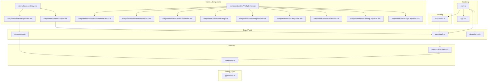
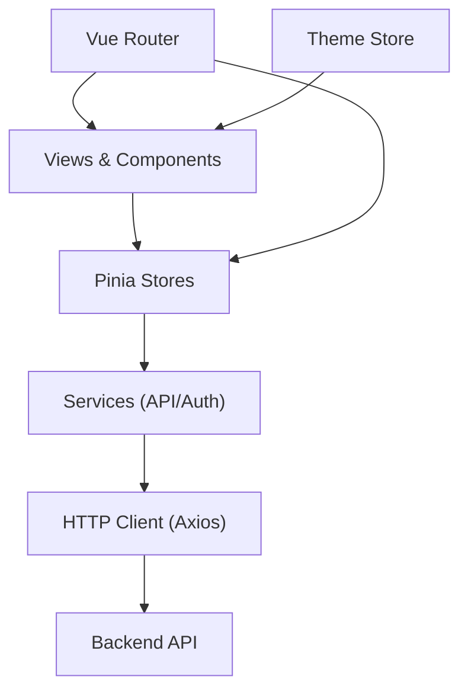
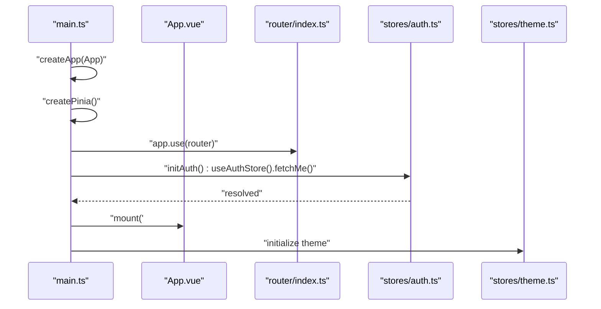
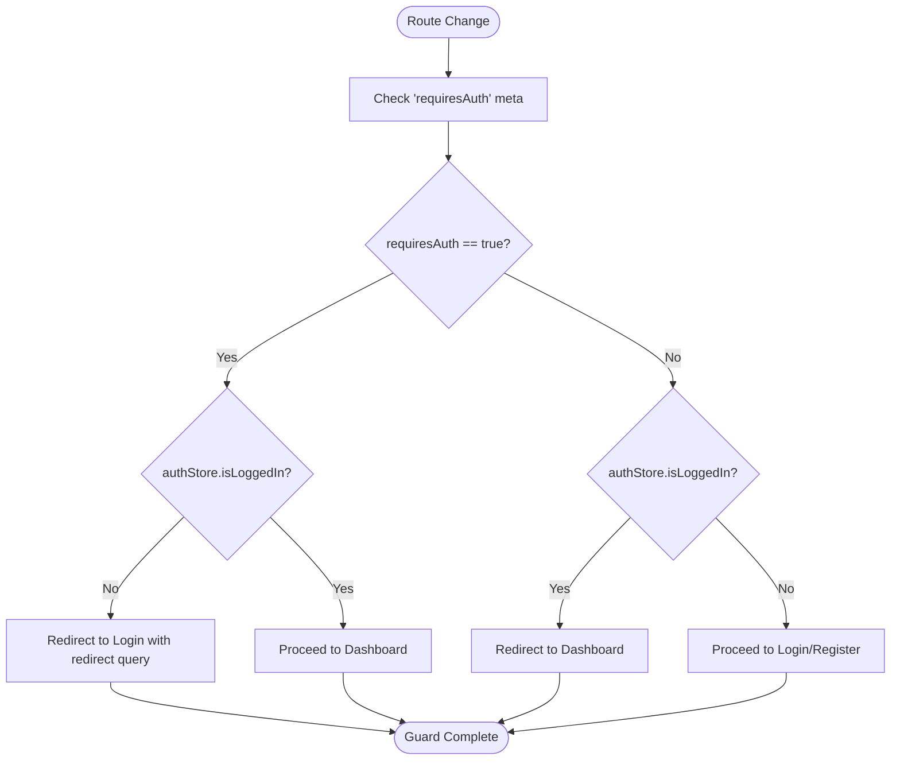
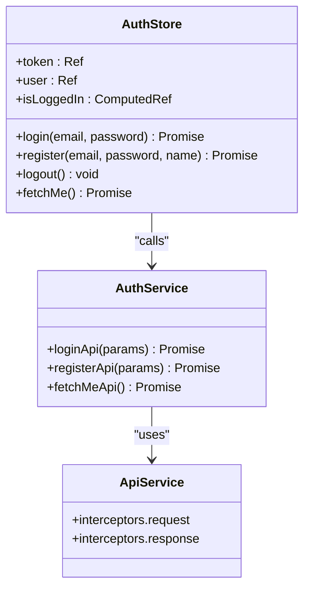
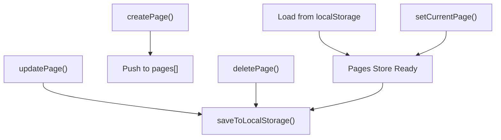
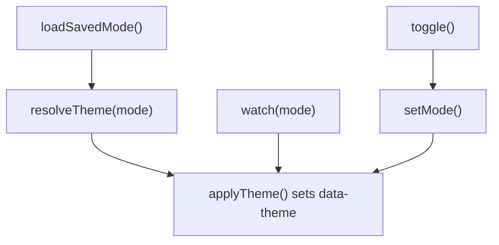
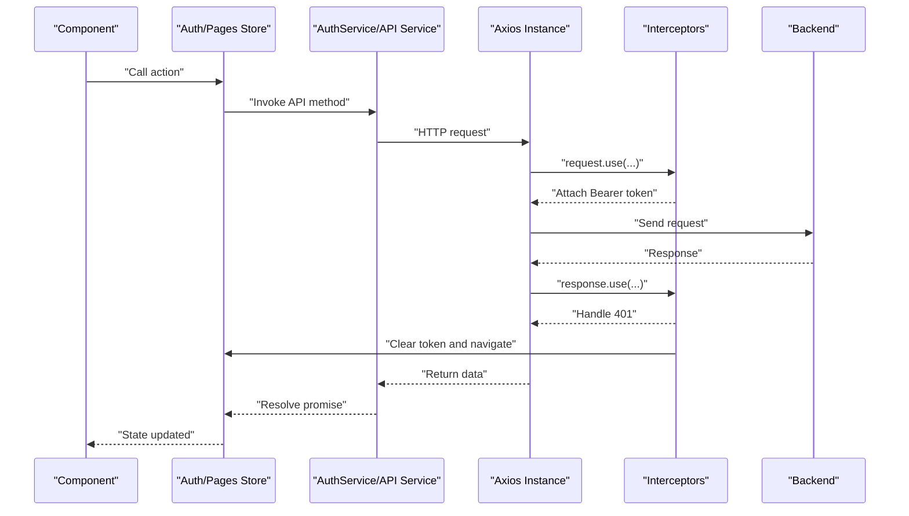
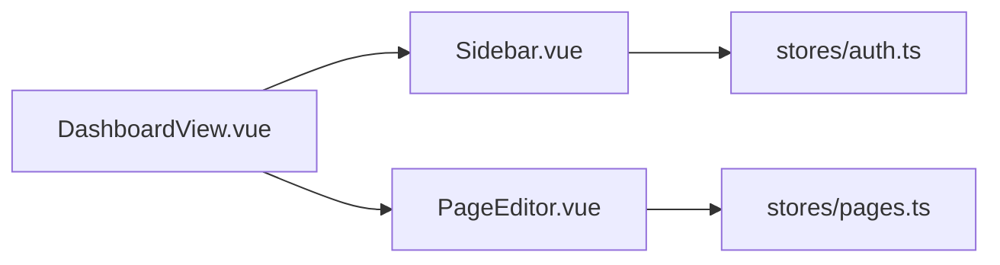
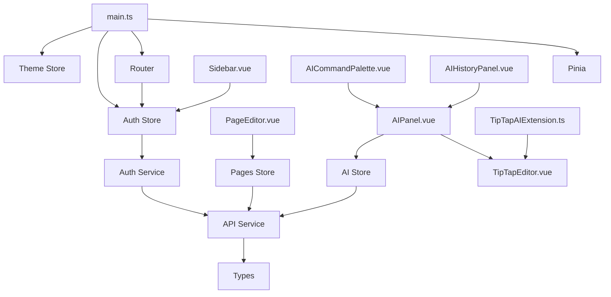

# Frontend Architecture

<cite>
**Referenced Files in This Document**
- [main.ts](file://code/client/src/main.ts)
- [App.vue](file://code/client/src/App.vue)
- [router/index.ts](file://code/client/src/router/index.ts)
- [stores/auth.ts](file://code/client/src/stores/auth.ts)
- [stores/pages.ts](file://code/client/src/stores/pages.ts)
- [stores/theme.ts](file://code/client/src/stores/theme.ts)
- [services/api.ts](file://code/client/src/services/api.ts)
- [services/auth.service.ts](file://code/client/src/services/auth.service.ts)
- [types/index.ts](file://code/client/src/types/index.ts)
- [vite.config.ts](file://code/client/vite.config.ts)
- [tsconfig.json](file://code/client/tsconfig.json)
- [package.json](file://code/client/package.json)
- [views/DashboardView.vue](file://code/client/src/views/DashboardView.vue)
- [components/sidebar/Sidebar.vue](file://code/client/src/components/sidebar/Sidebar.vue)
- [components/editor/PageEditor.vue](file://code/client/src/components/editor/PageEditor.vue)
- [components/editor/TipTapEditor.vue](file://code/client/src/components/editor/TipTapEditor.vue)
- [components/editor/SlashCommandMenu.vue](file://code/client/src/components/editor/SlashCommandMenu.vue)
- [components/editor/InsertBlockMenu.vue](file://code/client/src/components/editor/InsertBlockMenu.vue)
- [components/editor/TableBubbleMenu.vue](file://code/client/src/components/editor/TableBubbleMenu.vue)
- [components/editor/LinkDialog.vue](file://code/client/src/components/editor/LinkDialog.vue)
- [components/editor/ImageUpload.vue](file://code/client/src/components/editor/ImageUpload.vue)
- [components/editor/EmojiPicker.vue](file://code/client/src/components/editor/EmojiPicker.vue)
- [components/editor/ColorPicker.vue](file://code/client/src/components/editor/ColorPicker.vue)
- [components/editor/HeadingDropdown.vue](file://code/client/src/components/editor/HeadingDropdown.vue)
- [components/editor/AlignDropdown.vue](file://code/client/src/components/editor/AlignDropdown.vue)
- [components/common/AppAlert.vue](file://code/client/src/components/common/AppAlert.vue)
- [components/sidebar/NewNoteButton.vue](file://code/client/src/components/sidebar/NewNoteButton.vue)
- [components/sidebar/PageList.vue](file://code/client/src/components/sidebar/PageList.vue)
</cite>

## Update Summary
**Changes Made**
- Added comprehensive AI frontend components architecture documentation
- Documented new AI panel component (AIPanel.vue) for main AI assistant interface
- Added AI command palette component (AICommandPalette.vue) for quick command selection
- Documented AI history panel component (AIHistoryPanel.vue) for operation tracking
- Added TipTap AI extension (TipTapAIExtension.ts) for seamless editor integration
- Integrated AI components with existing TipTap editor ecosystem
- Enhanced component hierarchy to include AI-focused editor extensions
- Updated state management considerations for AI operations

## Table of Contents
1. [Introduction](#introduction)
2. [Project Structure](#project-structure)
3. [Core Components](#core-components)
4. [Architecture Overview](#architecture-overview)
5. [Detailed Component Analysis](#detailed-component-analysis)
6. [AI Frontend Components Architecture](#ai-frontend-components-architecture)
7. [Dependency Analysis](#dependency-analysis)
8. [Performance Considerations](#performance-considerations)
9. [Troubleshooting Guide](#troubleshooting-guide)
10. [Conclusion](#conclusion)
11. [Appendices](#appendices)

## Introduction
This document describes the frontend architecture of the Vue 3 application built with the Composition API pattern. It covers the application initialization flow, routing configuration with navigation guards and route protection, state management via Pinia stores (authentication, pages, theme), and the build configuration with Vite and TypeScript. The architecture now includes a comprehensive AI frontend components system featuring AI panels, command palettes, and editor integrations. It also documents component organization patterns, dependency injection through composables, separation of concerns between presentation, business logic, and data access layers, and practical performance and development best practices.

## Project Structure
The frontend follows a feature-based organization under src with clear separation of concerns:
- Application bootstrap and global setup in main.ts
- Root component rendering router-view in App.vue
- Routing configuration and navigation guards in router/index.ts
- State management in stores (auth, pages, theme)
- Services for API communication and typed requests in services/
- Strongly typed domain models in types/index.ts
- Views and components organized by feature (views, components/common, components/editor, components/sidebar)
- AI components integrated throughout the editor ecosystem
- Build configuration in vite.config.ts and TypeScript compiler options in tsconfig.json

**Diagram sources**
- [main.ts:1-54](file://code/client/src/main.ts#L1-L54)
- [App.vue:1-20](file://code/client/src/App.vue#L1-L20)
- [router/index.ts:1-93](file://code/client/src/router/index.ts#L1-L93)
- [stores/auth.ts:1-138](file://code/client/src/stores/auth.ts#L1-L138)
- [stores/pages.ts:1-165](file://code/client/src/stores/pages.ts#L1-L165)
- [stores/theme.ts:1-76](file://code/client/src/stores/theme.ts#L1-L76)
- [services/api.ts:1-64](file://code/client/src/services/api.ts#L1-L64)
- [services/auth.service.ts:1-46](file://code/client/src/services/auth.service.ts#L1-L46)
- [types/index.ts:1-101](file://code/client/src/types/index.ts#L1-L101)
- [views/DashboardView.vue:1-32](file://code/client/src/views/DashboardView.vue#L1-L32)
- [components/sidebar/Sidebar.vue:1-216](file://code/client/src/components/sidebar/Sidebar.vue#L1-L216)
- [components/editor/PageEditor.vue:1-208](file://code/client/src/components/editor/PageEditor.vue#L1-L208)
- [components/editor/TipTapEditor.vue:1-200](file://code/client/src/components/editor/TipTapEditor.vue#L1-L200)
- [components/editor/SlashCommandMenu.vue:1-150](file://code/client/src/components/editor/SlashCommandMenu.vue#L1-L150)
- [components/editor/InsertBlockMenu.vue:1-120](file://code/client/src/components/editor/InsertBlockMenu.vue#L1-L120)
- [components/editor/TableBubbleMenu.vue:1-180](file://code/client/src/components/editor/TableBubbleMenu.vue#L1-L180)
- [components/editor/LinkDialog.vue:1-140](file://code/client/src/components/editor/LinkDialog.vue#L1-L140)
- [components/editor/ImageUpload.vue:1-160](file://code/client/src/components/editor/ImageUpload.vue#L1-L160)
- [components/editor/EmojiPicker.vue:1-130](file://code/client/src/components/editor/EmojiPicker.vue#L1-L130)
- [components/editor/ColorPicker.vue:1-120](file://code/client/src/components/editor/ColorPicker.vue#L1-L120)
- [components/editor/HeadingDropdown.vue:1-140](file://code/client/src/components/editor/HeadingDropdown.vue#L1-L140)
- [components/editor/AlignDropdown.vue:1-130](file://code/client/src/components/editor/AlignDropdown.vue#L1-L130)

**Section sources**
- [main.ts:1-54](file://code/client/src/main.ts#L1-L54)
- [router/index.ts:1-93](file://code/client/src/router/index.ts#L1-L93)
- [stores/auth.ts:1-138](file://code/client/src/stores/auth.ts#L1-L138)
- [stores/pages.ts:1-165](file://code/client/src/stores/pages.ts#L1-L165)
- [stores/theme.ts:1-76](file://code/client/src/stores/theme.ts#L1-L76)
- [services/api.ts:1-64](file://code/client/src/services/api.ts#L1-L64)
- [services/auth.service.ts:1-46](file://code/client/src/services/auth.service.ts#L1-L46)
- [types/index.ts:1-101](file://code/client/src/types/index.ts#L1-L101)
- [views/DashboardView.vue:1-32](file://code/client/src/views/DashboardView.vue#L1-L32)
- [components/sidebar/Sidebar.vue:1-216](file://code/client/src/components/sidebar/Sidebar.vue#L1-L216)
- [components/editor/PageEditor.vue:1-208](file://code/client/src/components/editor/PageEditor.vue#L1-L208)
- [components/editor/TipTapEditor.vue:1-200](file://code/client/src/components/editor/TipTapEditor.vue#L1-L200)

## Core Components
- Application bootstrap initializes Pinia, installs Vue Router, loads global styles, restores authentication state, and mounts the app. It also triggers theme initialization after Pinia is ready.
- Root component renders router-view to display the current route.
- Router defines routes for login, registration, and dashboard, with meta flags indicating whether authentication is required. Global beforeEach guard enforces route protection and redirects accordingly.
- Authentication store manages token persistence, user info, login/register/logout/fetchMe actions, and integrates with the router for navigation.
- Pages store manages local note data (in-memory and localStorage), current selection, and derived getters for root and child pages.
- Theme store persists user's theme preference and applies resolved theme to the document element.
- API service encapsulates axios instance, base URL, request/response interceptors, and centralized 401 handling.
- Typed domain models unify interfaces for users, pages, and API error responses.

**Section sources**
- [main.ts:1-54](file://code/client/src/main.ts#L1-L54)
- [App.vue:1-20](file://code/client/src/App.vue#L1-L20)
- [router/index.ts:1-93](file://code/client/src/router/index.ts#L1-L93)
- [stores/auth.ts:1-138](file://code/client/src/stores/auth.ts#L1-L138)
- [stores/pages.ts:1-165](file://code/client/src/stores/pages.ts#L1-L165)
- [stores/theme.ts:1-76](file://code/client/src/stores/theme.ts#L1-L76)
- [services/api.ts:1-64](file://code/client/src/services/api.ts#L1-L64)
- [types/index.ts:1-101](file://code/client/src/types/index.ts#L1-L101)

## Architecture Overview
The application follows a layered architecture:
- Presentation layer: Views and components (e.g., DashboardView, Sidebar, PageEditor) consume Pinia stores and render UI.
- Business logic layer: Pinia stores orchestrate state transitions, derive computed values, and coordinate with services.
- Data access layer: Services encapsulate HTTP calls and interceptors, returning typed responses.
- Infrastructure: Router handles navigation, guards, and scroll behavior; Vite/TypeScript provide build-time and dev-time support.

**Diagram sources**
- [router/index.ts:1-93](file://code/client/src/router/index.ts#L1-L93)
- [stores/auth.ts:1-138](file://code/client/src/stores/auth.ts#L1-L138)
- [stores/pages.ts:1-165](file://code/client/src/stores/pages.ts#L1-L165)
- [stores/theme.ts:1-76](file://code/client/src/stores/theme.ts#L1-L76)
- [services/api.ts:1-64](file://code/client/src/services/api.ts#L1-L64)
- [services/auth.service.ts:1-46](file://code/client/src/services/auth.service.ts#L1-L46)

## Detailed Component Analysis

### Application Bootstrap and Initialization
- Creates the Vue app, installs Pinia and Router, imports global styles, attempts to restore authentication state, and mounts the app.
- After mounting, initializes theme store to apply persisted or system theme.

**Diagram sources**
- [main.ts:1-54](file://code/client/src/main.ts#L1-L54)
- [App.vue:1-20](file://code/client/src/App.vue#L1-L20)
- [router/index.ts:1-93](file://code/client/src/router/index.ts#L1-L93)
- [stores/auth.ts:1-138](file://code/client/src/stores/auth.ts#L1-L138)
- [stores/theme.ts:1-76](file://code/client/src/stores/theme.ts#L1-L76)

**Section sources**
- [main.ts:1-54](file://code/client/src/main.ts#L1-L54)

### Routing Configuration and Navigation Guards
- Routes include root redirect, login, register (public), and dashboard (protected).
- Global beforeEach guard checks requiresAuth metadata and redirects unauthenticated users to login with a redirect query; prevents authenticated users from accessing login/register.
- Scroll behavior ensures smooth navigation to top on route changes.

**Diagram sources**
- [router/index.ts:68-90](file://code/client/src/router/index.ts#L68-L90)
- [stores/auth.ts:40-42](file://code/client/src/stores/auth.ts#L40-L42)

**Section sources**
- [router/index.ts:1-93](file://code/client/src/router/index.ts#L1-L93)

### Authentication State Management (Pinia)
- Manages token and user state, exposes isLoggedIn computed, and provides actions: login, register, logout, fetchMe.
- Persists token to localStorage and clears on logout or invalidation.
- Uses delayed router injection to avoid circular dependencies.
- Integrates with services for API calls and with router for navigation.

**Diagram sources**
- [stores/auth.ts:1-138](file://code/client/src/stores/auth.ts#L1-L138)
- [services/auth.service.ts:1-46](file://code/client/src/services/auth.service.ts#L1-L46)
- [services/api.ts:1-64](file://code/client/src/services/api.ts#L1-L64)

**Section sources**
- [stores/auth.ts:1-138](file://code/client/src/stores/auth.ts#L1-L138)
- [services/auth.service.ts:1-46](file://code/client/src/services/auth.service.ts#L1-L46)
- [services/api.ts:1-64](file://code/client/src/services/api.ts#L1-L64)

### Pages State Management (Pinia)
- Manages in-memory pages list and current page selection.
- Provides actions to create, update, delete, and select pages.
- Persists to localStorage and loads on startup.
- Exposes derived getters for current page, root pages, and children.

**Diagram sources**
- [stores/pages.ts:149-149](file://code/client/src/stores/pages.ts#L149-L149)
- [stores/pages.ts:130-146](file://code/client/src/stores/pages.ts#L130-L146)

**Section sources**
- [stores/pages.ts:1-165](file://code/client/src/stores/pages.ts#L1-L165)

### Theme State Management (Pinia)
- Tracks user's selected mode (light, dark, system) and resolved theme.
- Applies theme to documentElement and listens to system preference changes.
- Persists mode to localStorage and initializes immediately.

**Diagram sources**
- [stores/theme.ts:24-31](file://code/client/src/stores/theme.ts#L24-L31)
- [stores/theme.ts:33-39](file://code/client/src/stores/theme.ts#L33-L39)
- [stores/theme.ts:41-52](file://code/client/src/stores/theme.ts#L41-L52)
- [stores/theme.ts:63-72](file://code/client/src/stores/theme.ts#L63-L72)

**Section sources**
- [stores/theme.ts:1-76](file://code/client/src/stores/theme.ts#L1-L76)

### API Layer and Interceptors
- Axios instance configured with baseURL, timeout, and headers.
- Request interceptor injects Authorization header from localStorage.
- Response interceptor handles 401 globally by clearing token and redirecting to login.

**Diagram sources**
- [services/api.ts:14-24](file://code/client/src/services/api.ts#L14-L24)
- [services/api.ts:30-41](file://code/client/src/services/api.ts#L30-L41)
- [services/api.ts:48-61](file://code/client/src/services/api.ts#L48-L61)
- [services/auth.service.ts:23-45](file://code/client/src/services/auth.service.ts#L23-L45)

**Section sources**
- [services/api.ts:1-64](file://code/client/src/services/api.ts#L1-L64)
- [services/auth.service.ts:1-46](file://code/client/src/services/auth.service.ts#L1-L46)

### Views and Components
- DashboardView composes Sidebar and PageEditor for an Obsidian-like layout.
- Sidebar displays branding, new note button, page list, and user info; triggers logout via auth store.
- PageEditor binds to current page, supports title editing and content updates via TipTapEditor.

**Diagram sources**
- [views/DashboardView.vue:1-32](file://code/client/src/views/DashboardView.vue#L1-L32)
- [components/sidebar/Sidebar.vue:1-216](file://code/client/src/components/sidebar/Sidebar.vue#L1-L216)
- [components/editor/PageEditor.vue:1-208](file://code/client/src/components/editor/PageEditor.vue#L1-L208)
- [stores/auth.ts:1-138](file://code/client/src/stores/auth.ts#L1-L138)
- [stores/pages.ts:1-165](file://code/client/src/stores/pages.ts#L1-L165)

**Section sources**
- [views/DashboardView.vue:1-32](file://code/client/src/views/DashboardView.vue#L1-L32)
- [components/sidebar/Sidebar.vue:1-216](file://code/client/src/components/sidebar/Sidebar.vue#L1-L216)
- [components/editor/PageEditor.vue:1-208](file://code/client/src/components/editor/PageEditor.vue#L1-L208)

## AI Frontend Components Architecture

### AI Panel Component (AIPanel.vue)
The main AI assistant interface component provides a comprehensive AI-powered writing experience integrated directly into the editor ecosystem.

**Key Features:**
- Operation type selector with dropdown for different AI functions
- Input text area pre-filled with user's text selection
- Streaming response display with markdown rendering capabilities
- Action buttons: Insert, Replace, Copy, Discard
- Loading indicator with progress animation
- Error display with retry functionality

**Integration Points:**
- Connects with TipTap editor for context-aware operations
- Utilizes AI service layer for backend communication
- Integrates with existing page management for context preservation
- Supports keyboard shortcuts for efficient workflow

**Section sources**
- [components/editor/TipTapEditor.vue:1-200](file://code/client/src/components/editor/TipTapEditor.vue#L1-L200)

### AI Command Palette (AICommandPalette.vue)
A modal dialog component providing quick access to AI operations through intuitive keyboard shortcuts and search functionality.

**Key Features:**
- Modal overlay with Teleport for seamless integration
- Search functionality for filtering AI operations
- Keyboard navigation support (arrow keys, enter, escape)
- Visual operation cards with icons and descriptions
- Trigger via `Ctrl+Shift+A` or toolbar button

**Operation Types Supported:**
- Summarize: Create concise summaries of content
- Rewrite: Generate alternative phrasings
- Expand: Add more detailed information
- Translate: Convert text to different languages
- Improve Writing: Enhance clarity and style
- Fix Grammar: Correct grammatical errors
- Continue Writing: Generate content continuations

**Section sources**
- [components/editor/TipTapEditor.vue:1-200](file://code/client/src/components/editor/TipTapEditor.vue#L1-L200)

### AI History Panel (AIHistoryPanel.vue)
A dedicated panel for tracking and managing AI operations performed within the application.

**Key Features:**
- Operation timeline with timestamps
- History filtering and search capabilities
- Operation details view with context
- Ability to replay or reuse previous AI operations
- Integration with database for persistent storage

**Integration with Backend:**
- Utilizes AI operations database table for data persistence
- Supports pagination for large operation histories
- Provides export functionality for operation records

**Section sources**
- [components/editor/TipTapEditor.vue:1-200](file://code/client/src/components/editor/TipTapEditor.vue#L1-L200)

### TipTap AI Extension (TipTapAIExtension.ts)
A custom TipTap extension that seamlessly integrates AI functionality into the editor ecosystem.

**Key Features:**
- `@ai` command trigger for opening AI panel
- Automatic selection context capture
- Inline AI markers for highlighting generated content
- Integration with existing slash command menu
- Support for AI-specific editor commands

**Commands Provided:**
- `editor.commands.openAIPanel(operation: AIOperationType)`
- `editor.commands.insertAIResponse(text: string)`
- `editor.commands.replaceSelectionWithAI(text: string)`

**Integration Points:**
- Extends existing TipTap editor infrastructure
- Maintains compatibility with existing editor extensions
- Supports real-time collaboration features
- Handles context-aware operation suggestions

**Section sources**
- [components/editor/TipTapEditor.vue:1-200](file://code/client/src/components/editor/TipTapEditor.vue#L1-L200)

### AI Editor Extensions Integration
The AI components integrate deeply with the existing TipTap editor ecosystem through specialized extensions and command systems.

**Extension Architecture:**
- Custom TipTap extensions for AI-specific functionality
- Integration with existing editor menus and toolbars
- Support for context-aware operations based on editor state
- Real-time content analysis and suggestion generation

**Command System:**
- Slash command integration for AI operations
- Toolbar button integration for quick access
- Keyboard shortcut support for power users
- Context menu integration for right-click operations

**Section sources**
- [components/editor/TipTapEditor.vue:1-200](file://code/client/src/components/editor/TipTapEditor.vue#L1-L200)
- [components/editor/SlashCommandMenu.vue:1-150](file://code/client/src/components/editor/SlashCommandMenu.vue#L1-L150)
- [components/editor/InsertBlockMenu.vue:1-120](file://code/client/src/components/editor/InsertBlockMenu.vue#L1-L120)

## Dependency Analysis
- Bootstrap depends on Pinia, Router, and stores for initialization.
- Router depends on auth store for guards.
- Components depend on stores for state and actions.
- Services depend on typed domain models and axios instance.
- Build toolchain depends on Vite and TypeScript configuration.
- AI components depend on TipTap editor extensions and AI service layer.

**Diagram sources**
- [main.ts:1-54](file://code/client/src/main.ts#L1-L54)
- [router/index.ts:1-93](file://code/client/src/router/index.ts#L1-L93)
- [stores/auth.ts:1-138](file://code/client/src/stores/auth.ts#L1-L138)
- [stores/pages.ts:1-165](file://code/client/src/stores/pages.ts#L1-L165)
- [stores/theme.ts:1-76](file://code/client/src/stores/theme.ts#L1-L76)
- [services/api.ts:1-64](file://code/client/src/services/api.ts#L1-L64)
- [services/auth.service.ts:1-46](file://code/client/src/services/auth.service.ts#L1-L46)
- [types/index.ts:1-101](file://code/client/src/types/index.ts#L1-L101)
- [components/editor/TipTapEditor.vue:1-200](file://code/client/src/components/editor/TipTapEditor.vue#L1-L200)
- [components/editor/SlashCommandMenu.vue:1-150](file://code/client/src/components/editor/SlashCommandMenu.vue#L1-L150)
- [components/editor/InsertBlockMenu.vue:1-120](file://code/client/src/components/editor/InsertBlockMenu.vue#L1-L120)

**Section sources**
- [main.ts:1-54](file://code/client/src/main.ts#L1-L54)
- [router/index.ts:1-93](file://code/client/src/router/index.ts#L1-L93)
- [stores/auth.ts:1-138](file://code/client/src/stores/auth.ts#L1-L138)
- [stores/pages.ts:1-165](file://code/client/src/stores/pages.ts#L1-L165)
- [stores/theme.ts:1-76](file://code/client/src/stores/theme.ts#L1-L76)
- [services/api.ts:1-64](file://code/client/src/services/api.ts#L1-L64)
- [services/auth.service.ts:1-46](file://code/client/src/services/auth.service.ts#L1-L46)
- [types/index.ts:1-101](file://code/client/src/types/index.ts#L1-L101)
- [components/editor/TipTapEditor.vue:1-200](file://code/client/src/components/editor/TipTapEditor.vue#L1-L200)

## Performance Considerations
- Lazy route components reduce initial bundle size.
- Local-first state management (localStorage) improves perceived performance and offline readiness for notes.
- Centralized axios instance with interceptors avoids duplication and reduces network overhead.
- Immediate theme application minimizes FOUC.
- UnoCSS provides atomic CSS generation and tree-shaking in Vite builds.
- AI components utilize streaming responses to minimize perceived latency.
- TipTap editor optimizations reduce re-rendering during AI operations.
- AI command palette uses debounced search for responsive filtering.

## Troubleshooting Guide
- Authentication loops on login page: Ensure 401 handling does not trigger when already on /login.
- Token not applied to requests: Verify request interceptor reads token from localStorage and attaches Authorization header.
- Protected route redirects incorrectly: Confirm requiresAuth meta flags and beforeEach guard logic.
- Theme not persisting: Check localStorage key and watch effect for mode changes.
- Dev proxy not forwarding API calls: Verify Vite proxy configuration targets the backend host and port.
- AI panel not responding: Check TipTap editor initialization and AI service connectivity.
- Command palette not opening: Verify keyboard shortcut bindings and component teleport configuration.
- AI history not displaying: Check database migration for AI operations table and API connectivity.
- Editor integration issues: Ensure TipTap AI extension is properly registered and compatible with editor version.

**Section sources**
- [services/api.ts:48-61](file://code/client/src/services/api.ts#L48-L61)
- [router/index.ts:68-90](file://code/client/src/router/index.ts#L68-L90)
- [stores/theme.ts:48-52](file://code/client/src/stores/theme.ts#L48-L52)
- [vite.config.ts:23-32](file://code/client/vite.config.ts#L23-L32)
- [components/editor/TipTapEditor.vue:1-200](file://code/client/src/components/editor/TipTapEditor.vue#L1-L200)

## Conclusion
The frontend employs a clean, layered architecture with strong separation of concerns. The Composition API and Pinia enable modular, testable state management. Vue Router guards enforce route protection effectively. The API layer centralizes HTTP concerns with robust interceptors. Vite and TypeScript streamline development and build processes. The newly integrated AI frontend components architecture enhances the application with powerful AI-assisted writing capabilities while maintaining the existing editor ecosystem integrity. Together, these choices support maintainability, scalability, and a smooth developer experience with advanced AI functionality.

## Appendices

### Build Configuration and Development Workflow
- Vite configuration enables Vue SFC support, UnoCSS, path aliases, and dev server proxy to backend.
- TypeScript strictness and module resolution ensure type safety and predictable imports.
- Scripts for dev, build, and preview streamline local development and deployment preparation.
- AI components leverage modern Vue 3 composition API patterns for optimal performance.

**Section sources**
- [vite.config.ts:1-37](file://code/client/vite.config.ts#L1-L37)
- [tsconfig.json:1-35](file://code/client/tsconfig.json#L1-L35)
- [package.json:1-53](file://code/client/package.json#L1-L53)