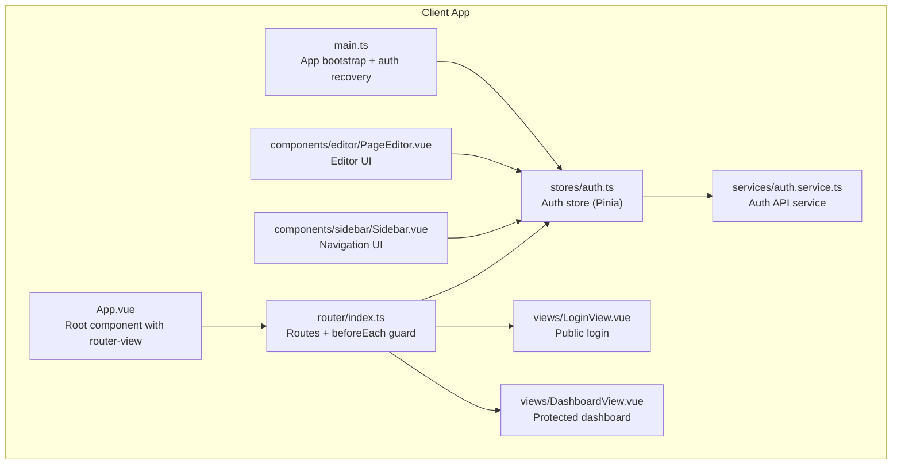
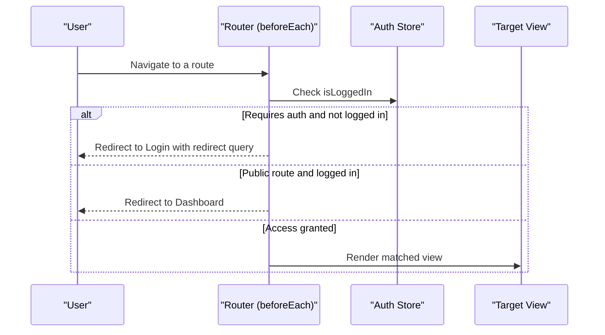
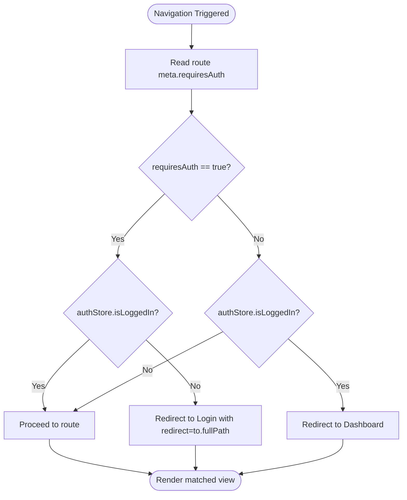
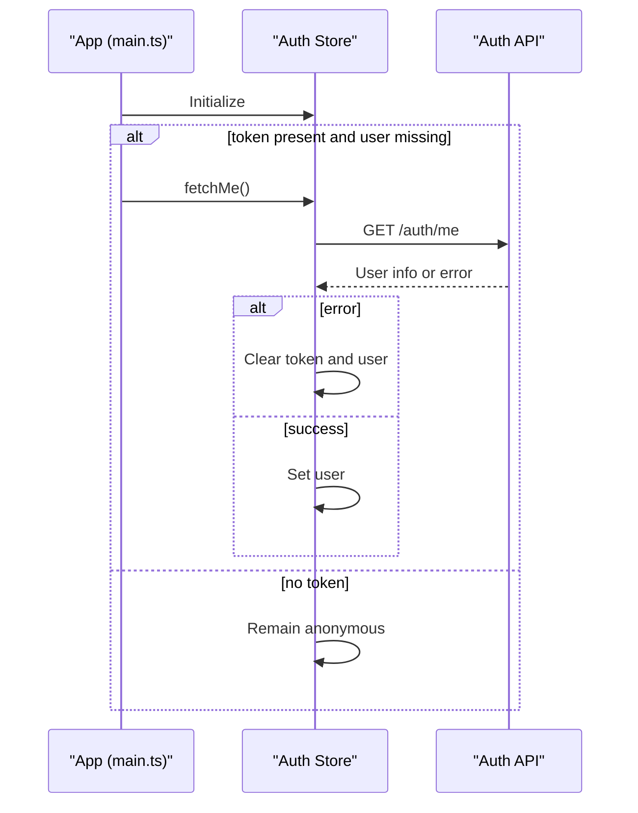
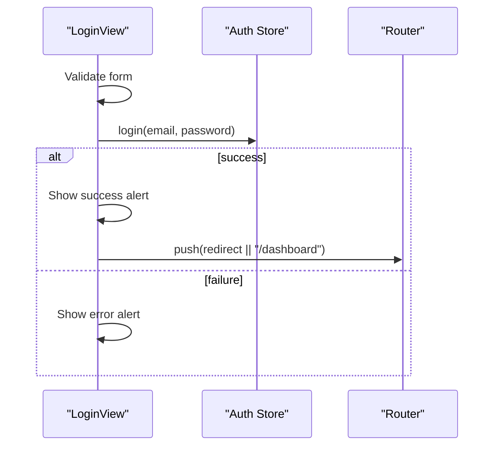
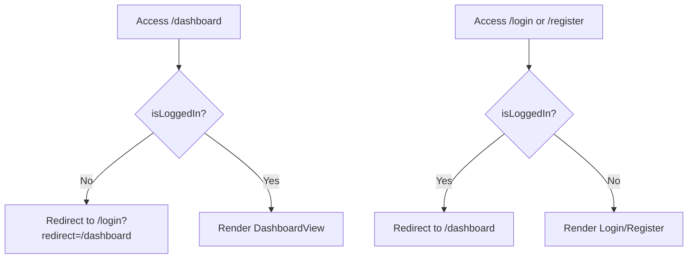
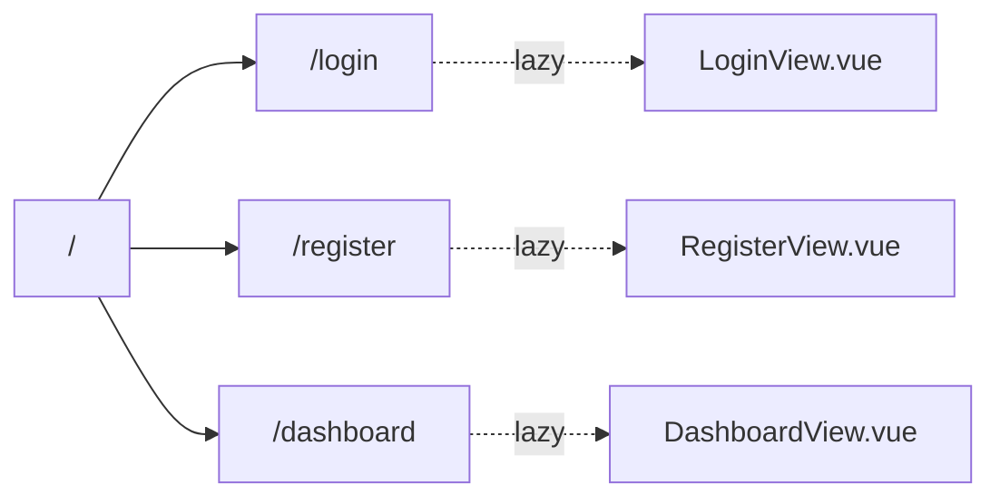
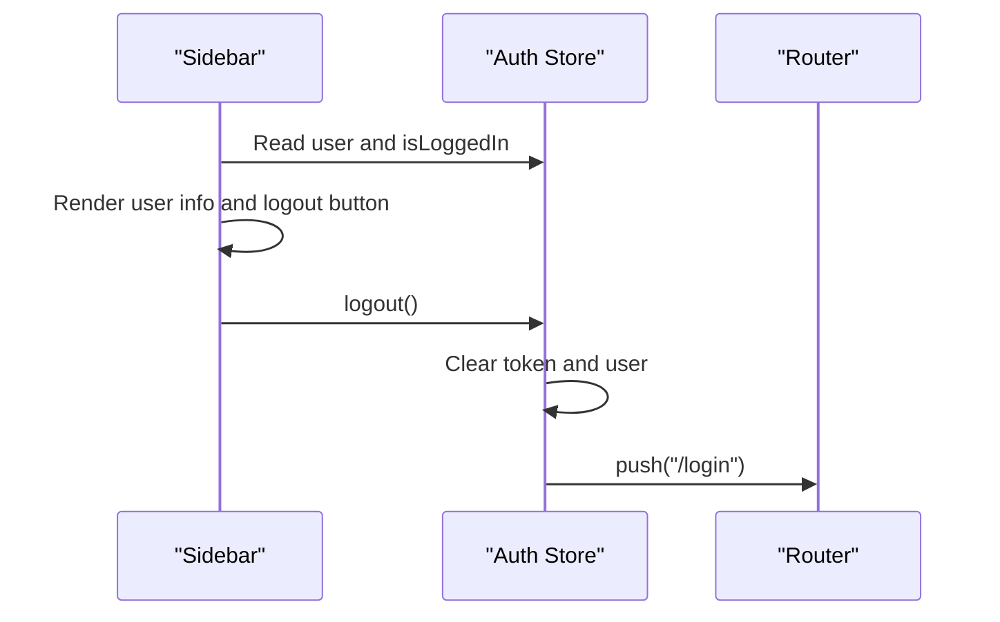
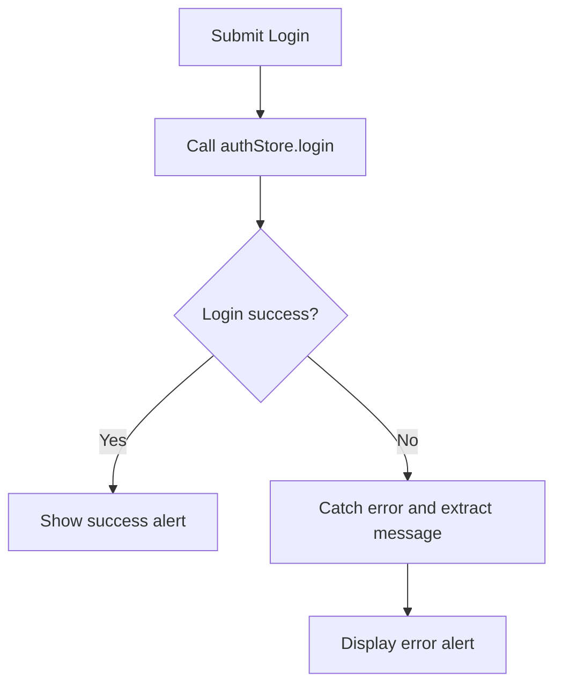
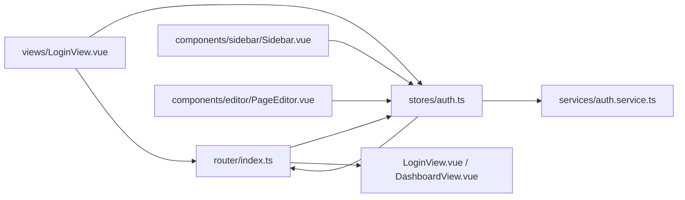

# Routing & Navigation

<cite>
**Referenced Files in This Document**
- [router/index.ts](file://code/client/src/router/index.ts)
- [stores/auth.ts](file://code/client/src/stores/auth.ts)
- [services/auth.service.ts](file://code/client/src/services/auth.service.ts)
- [main.ts](file://code/client/src/main.ts)
- [views/LoginView.vue](file://code/client/src/views/LoginView.vue)
- [views/DashboardView.vue](file://code/client/src/views/DashboardView.vue)
- [components/sidebar/Sidebar.vue](file://code/client/src/components/sidebar/Sidebar.vue)
- [components/editor/PageEditor.vue](file://code/client/src/components/editor/PageEditor.vue)
- [types/index.ts](file://code/client/src/types/index.ts)
- [App.vue](file://code/client/src/App.vue)
- [vite.config.ts](file://code/client/vite.config.ts)
</cite>

## Table of Contents
1. [Introduction](#introduction)
2. [Project Structure](#project-structure)
3. [Core Components](#core-components)
4. [Architecture Overview](#architecture-overview)
5. [Detailed Component Analysis](#detailed-component-analysis)
6. [Dependency Analysis](#dependency-analysis)
7. [Performance Considerations](#performance-considerations)
8. [Troubleshooting Guide](#troubleshooting-guide)
9. [Conclusion](#conclusion)

## Introduction
This document explains the Vue Router configuration and navigation system used in the client application. It covers route definitions, navigation guards, authentication protection, route hierarchy, lazy loading, dynamic parameters, protected routes, redirect logic, error handling for navigation failures, programmatic navigation, route transitions, and integration with authentication state. It also outlines performance optimizations such as route-level code splitting and preloading strategies.

## Project Structure
The routing system is centered around a single router module that defines public and protected routes, a global navigation guard for authentication checks, and integrates with a Pinia authentication store. Views are lazily loaded via dynamic imports. Programmatic navigation is used in views and components to implement redirects and transitions.

**Diagram sources**
- [App.vue:16-19](file://code/client/src/App.vue#L16-L19)
- [router/index.ts:14-92](file://code/client/src/router/index.ts#L14-L92)
- [stores/auth.ts:26-137](file://code/client/src/stores/auth.ts#L26-L137)
- [services/auth.service.ts:18-45](file://code/client/src/services/auth.service.ts#L18-L45)
- [views/LoginView.vue:17-133](file://code/client/src/views/LoginView.vue#L17-L133)
- [views/DashboardView.vue:10-23](file://code/client/src/views/DashboardView.vue#L10-L23)
- [components/sidebar/Sidebar.vue:11-23](file://code/client/src/components/sidebar/Sidebar.vue#L11-L23)
- [components/editor/PageEditor.vue:10-49](file://code/client/src/components/editor/PageEditor.vue#L10-L49)
- [main.ts:33-48](file://code/client/src/main.ts#L33-L48)

**Section sources**
- [router/index.ts:14-92](file://code/client/src/router/index.ts#L14-L92)
- [main.ts:33-48](file://code/client/src/main.ts#L33-L48)

## Core Components
- Router configuration and navigation guard:
  - Defines public routes (/login, /register) and a protected route (/dashboard).
  - Uses a global beforeEach guard to enforce authentication and redirect logic.
  - Implements scroll restoration to top on navigation.
- Authentication store:
  - Manages token and user state, persistence to localStorage, and recovery on startup.
  - Provides login, register, logout, and fetchMe actions.
- Auth API service:
  - Encapsulates HTTP requests for login, register, and fetching current user.
- Views and UI:
  - LoginView handles form submission, success/error feedback, and programmatic navigation.
  - DashboardView renders the main layout with sidebar and editor.
  - Sidebar triggers logout via the auth store.
  - PageEditor manages page state and emits updates.

**Section sources**
- [router/index.ts:16-90](file://code/client/src/router/index.ts#L16-L90)
- [stores/auth.ts:26-137](file://code/client/src/stores/auth.ts#L26-L137)
- [services/auth.service.ts:18-45](file://code/client/src/services/auth.service.ts#L18-L45)
- [views/LoginView.vue:17-133](file://code/client/src/views/LoginView.vue#L17-L133)
- [views/DashboardView.vue:10-23](file://code/client/src/views/DashboardView.vue#L10-L23)
- [components/sidebar/Sidebar.vue:11-23](file://code/client/src/components/sidebar/Sidebar.vue#L11-L23)
- [components/editor/PageEditor.vue:10-49](file://code/client/src/components/editor/PageEditor.vue#L10-L49)

## Architecture Overview
The routing architecture enforces authentication at the router level and synchronizes UI state with the auth store. On startup, the app attempts to recover the session. Protected routes are enforced by the global guard, which redirects unauthenticated users to the login route while preserving the intended destination. Authenticated users are redirected away from public login/register routes.

**Diagram sources**
- [router/index.ts:68-90](file://code/client/src/router/index.ts#L68-L90)
- [stores/auth.ts:40-41](file://code/client/src/stores/auth.ts#L40-L41)

## Detailed Component Analysis

### Router Configuration and Navigation Guards
- Route definitions:
  - Root path redirects to login.
  - Public routes for login and register with lazy-loaded components.
  - Protected dashboard route with lazy-loaded component.
- Global navigation guard:
  - Checks the requiresAuth meta flag.
  - Redirects unauthenticated users to login with a redirect query parameter.
  - Prevents authenticated users from accessing login/register.
- Scroll behavior:
  - Scrolls to top on navigation; respects saved position when available.

**Diagram sources**
- [router/index.ts:68-90](file://code/client/src/router/index.ts#L68-L90)
- [stores/auth.ts:40-41](file://code/client/src/stores/auth.ts#L40-L41)

**Section sources**
- [router/index.ts:16-90](file://code/client/src/router/index.ts#L16-L90)

### Authentication Store and Recovery
- State:
  - Token persisted in localStorage.
  - Computed isLoggedIn derived from token and user presence.
- Actions:
  - login and register persist tokens and set user.
  - logout clears local storage and navigates to login.
  - fetchMe retrieves current user; invalid tokens trigger cleanup.
- Startup recovery:
  - On app init, if a token exists but no user is loaded, fetchMe is called.

**Diagram sources**
- [main.ts:33-42](file://code/client/src/main.ts#L33-L42)
- [stores/auth.ts:114-122](file://code/client/src/stores/auth.ts#L114-L122)
- [services/auth.service.ts:42-45](file://code/client/src/services/auth.service.ts#L42-L45)

**Section sources**
- [stores/auth.ts:26-137](file://code/client/src/stores/auth.ts#L26-L137)
- [main.ts:33-42](file://code/client/src/main.ts#L33-L42)

### Login View and Programmatic Navigation
- Form validation and submission:
  - Validates email and password.
  - Calls authStore.login and displays success or error alerts.
- Redirect logic:
  - On success, navigates to the route specified by the redirect query param or defaults to dashboard.
- Demo mode:
  - Sets mock token and user, then navigates to dashboard.

**Diagram sources**
- [views/LoginView.vue:110-133](file://code/client/src/views/LoginView.vue#L110-L133)
- [stores/auth.ts:80-84](file://code/client/src/stores/auth.ts#L80-L84)

**Section sources**
- [views/LoginView.vue:17-133](file://code/client/src/views/LoginView.vue#L17-L133)
- [stores/auth.ts:80-84](file://code/client/src/stores/auth.ts#L80-L84)

### Protected Routes and Redirect Logic
- Protected route (/dashboard):
  - Enforced by requiresAuth: true in route meta.
- Redirect scenarios:
  - Unauthenticated users attempting to reach /dashboard are redirected to /login with a redirect query.
  - Authenticated users visiting /login or /register are redirected to /dashboard.

**Diagram sources**
- [router/index.ts:74-89](file://code/client/src/router/index.ts#L74-L89)
- [stores/auth.ts:40-41](file://code/client/src/stores/auth.ts#L40-L41)

**Section sources**
- [router/index.ts:74-89](file://code/client/src/router/index.ts#L74-L89)

### Route Hierarchy and Lazy Loading
- Route hierarchy:
  - Root (/) redirects to login.
  - Public routes: /login, /register.
  - Protected route: /dashboard.
- Lazy loading:
  - Each route’s component is loaded via dynamic import in the route definition.
- Route-level code splitting:
  - Achieved by lazy-loading route components; bundler splits bundles per route.

**Diagram sources**
- [router/index.ts:25](file://code/client/src/router/index.ts#L25)
- [router/index.ts:34](file://code/client/src/router/index.ts#L34)
- [router/index.ts:42](file://code/client/src/router/index.ts#L42)

**Section sources**
- [router/index.ts:16-48](file://code/client/src/router/index.ts#L16-L48)

### Dynamic Route Parameters and Breadcrumb Patterns
- Dynamic parameters:
  - No dynamic route parameters are currently defined in the router configuration.
- Breadcrumb navigation:
  - No explicit breadcrumb implementation is present in the current codebase.
- Recommendations:
  - Add named parameters in routes (e.g., /page/:id) and derive breadcrumbs from route.matched.
  - Use a composable to compute breadcrumbs from $route.matched and route meta.

[No sources needed since this section provides general guidance]

### Integration with Authentication State and Conditional Display
- Conditional rendering:
  - Sidebar displays user info and a logout button based on authStore.user and isLoggedIn.
  - Logout action calls authStore.logout, which clears credentials and navigates to login.
- Auth-aware UI:
  - Protected content is rendered only after successful authentication via the guard.

**Diagram sources**
- [components/sidebar/Sidebar.vue:11-23](file://code/client/src/components/sidebar/Sidebar.vue#L11-L23)
- [stores/auth.ts:103-107](file://code/client/src/stores/auth.ts#L103-L107)

**Section sources**
- [components/sidebar/Sidebar.vue:11-23](file://code/client/src/components/sidebar/Sidebar.vue#L11-L23)
- [stores/auth.ts:103-107](file://code/client/src/stores/auth.ts#L103-L107)

### Error Handling for Navigation Failures
- Frontend error handling:
  - LoginView catches errors during login and displays a user-friendly alert.
  - Auth API service returns structured responses; LoginView extracts messages from response data.
- Backend error alignment:
  - Types define a unified error response shape for consistent handling.

**Diagram sources**
- [views/LoginView.vue:110-133](file://code/client/src/views/LoginView.vue#L110-L133)
- [services/auth.service.ts:23-26](file://code/client/src/services/auth.service.ts#L23-L26)
- [types/index.ts:47-57](file://code/client/src/types/index.ts#L47-L57)

**Section sources**
- [views/LoginView.vue:110-133](file://code/client/src/views/LoginView.vue#L110-L133)
- [services/auth.service.ts:23-26](file://code/client/src/services/auth.service.ts#L23-L26)
- [types/index.ts:47-57](file://code/client/src/types/index.ts#L47-L57)

### Programmatic Navigation and Route Transitions
- Programmatic navigation examples:
  - Router guard redirects to Login with a redirect query.
  - LoginView navigates to the intended destination after login.
  - AuthStore.logout navigates to login.
- Route transitions:
  - The router uses createWebHistory; transitions are standard SPA navigations.
  - Scroll behavior ensures smooth UX by restoring position or scrolling to top.

**Section sources**
- [router/index.ts:76-79](file://code/client/src/router/index.ts#L76-L79)
- [views/LoginView.vue:122-124](file://code/client/src/views/LoginView.vue#L122-L124)
- [stores/auth.ts:105-106](file://code/client/src/stores/auth.ts#L105-L106)
- [router/index.ts:55-60](file://code/client/src/router/index.ts#L55-L60)

## Dependency Analysis
- Router depends on:
  - Auth store for authentication state.
  - Views for lazy-loaded components.
- Auth store depends on:
  - Auth API service for HTTP requests.
  - Router for programmatic navigation on logout.
- Views depend on:
  - Auth store for state and actions.
  - Router for programmatic navigation.

**Diagram sources**
- [router/index.ts:14-92](file://code/client/src/router/index.ts#L14-L92)
- [stores/auth.ts:26-137](file://code/client/src/stores/auth.ts#L26-L137)
- [services/auth.service.ts:18-45](file://code/client/src/services/auth.service.ts#L18-L45)
- [views/LoginView.vue:17-133](file://code/client/src/views/LoginView.vue#L17-L133)
- [components/sidebar/Sidebar.vue:11-23](file://code/client/src/components/sidebar/Sidebar.vue#L11-L23)
- [components/editor/PageEditor.vue:10-49](file://code/client/src/components/editor/PageEditor.vue#L10-L49)

**Section sources**
- [router/index.ts:14-92](file://code/client/src/router/index.ts#L14-L92)
- [stores/auth.ts:26-137](file://code/client/src/stores/auth.ts#L26-L137)

## Performance Considerations
- Route-level code splitting:
  - Implemented via dynamic imports in route definitions; each view is bundled separately.
- Preloading strategies:
  - Consider preloading frequently visited routes (e.g., dashboard) after login.
  - Use router.prefetch or manual preload hints in future enhancements.
- Bundle optimization:
  - Vite configuration supports modern build features; ensure keepNames and tree-shaking remain enabled.
- Storage and initialization:
  - localStorage reads occur on startup; keep token parsing lightweight.

**Section sources**
- [router/index.ts:25](file://code/client/src/router/index.ts#L25)
- [router/index.ts:34](file://code/client/src/router/index.ts#L34)
- [router/index.ts:42](file://code/client/src/router/index.ts#L42)
- [vite.config.ts:12-36](file://code/client/vite.config.ts#L12-L36)

## Troubleshooting Guide
- Login fails with generic error:
  - Verify error extraction logic reads response data consistently.
  - Confirm backend error response matches the expected shape.
- After refresh, user is logged out unexpectedly:
  - Ensure token is present in localStorage and fetchMe succeeds.
  - Check for network errors during /auth/me and confirm cleanup behavior.
- Redirect loop on login:
  - Validate that requiresAuth meta is correctly set and isLoggedIn reflects actual state.
  - Confirm redirect query is properly passed and consumed.

**Section sources**
- [views/LoginView.vue:125-129](file://code/client/src/views/LoginView.vue#L125-L129)
- [stores/auth.ts:114-122](file://code/client/src/stores/auth.ts#L114-L122)
- [router/index.ts:74-89](file://code/client/src/router/index.ts#L74-L89)

## Conclusion
The routing and navigation system employs a clean separation of concerns: route definitions encapsulate public and protected paths, a global guard enforces authentication, and the auth store centralizes state and persistence. Lazy-loaded views enable efficient code splitting, and programmatic navigation provides seamless redirects. The current implementation is robust for basic authentication flows and can be extended with dynamic parameters, breadcrumbs, and advanced preloading strategies as the application grows.