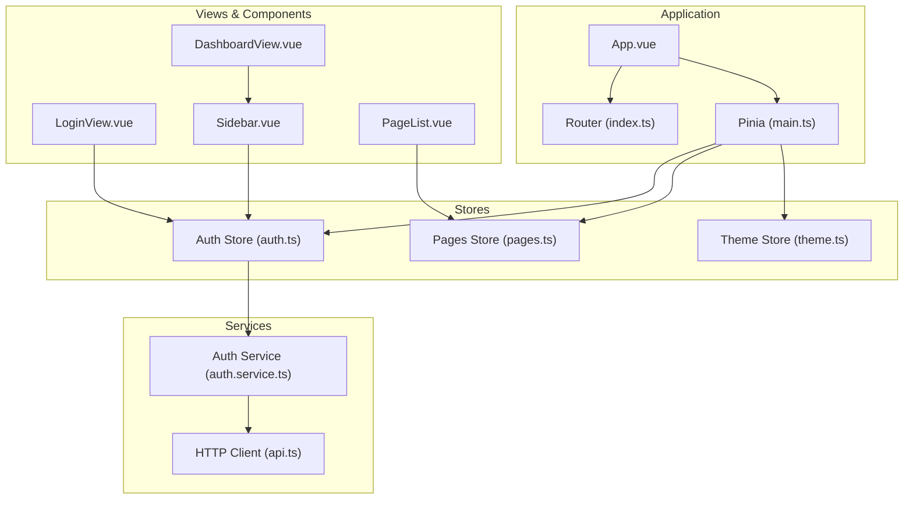
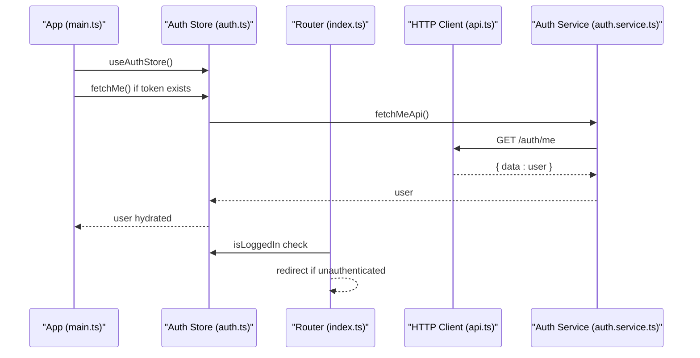
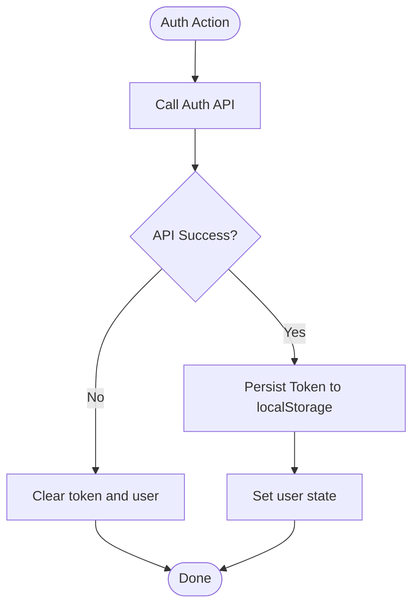
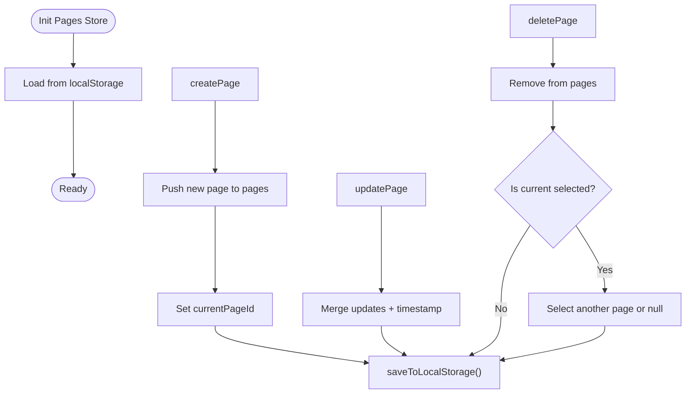
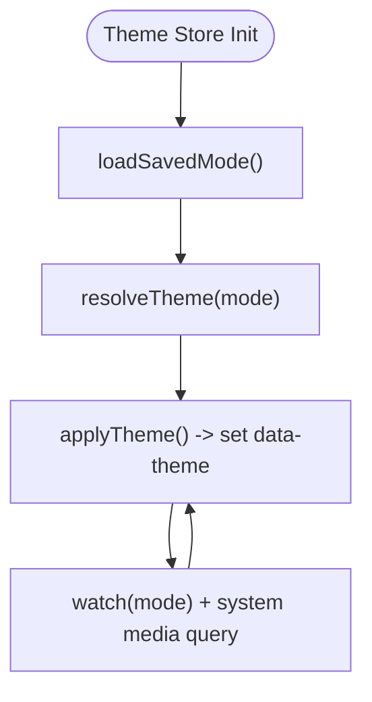
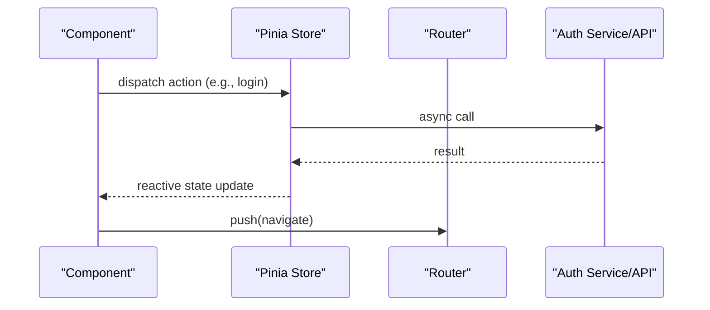
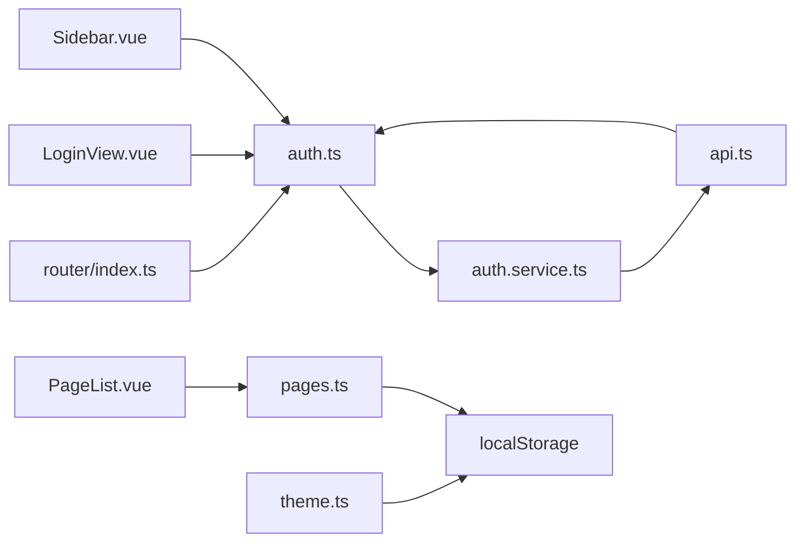

# State Management

<cite>
**Referenced Files in This Document**
- [auth.ts](file://code/client/src/stores/auth.ts)
- [pages.ts](file://code/client/src/stores/pages.ts)
- [theme.ts](file://code/client/src/stores/theme.ts)
- [main.ts](file://code/client/src/main.ts)
- [auth.service.ts](file://code/client/src/services/auth.service.ts)
- [api.ts](file://code/client/src/services/api.ts)
- [index.ts](file://code/client/src/router/index.ts)
- [LoginView.vue](file://code/client/src/views/LoginView.vue)
- [Sidebar.vue](file://code/client/src/components/sidebar/Sidebar.vue)
- [PageList.vue](file://code/client/src/components/sidebar/PageList.vue)
- [DashboardView.vue](file://code/client/src/views/DashboardView.vue)
- [index.ts](file://code/client/src/types/index.ts)
</cite>

## Table of Contents
1. [Introduction](#introduction)
2. [Project Structure](#project-structure)
3. [Core Components](#core-components)
4. [Architecture Overview](#architecture-overview)
5. [Detailed Component Analysis](#detailed-component-analysis)
6. [Dependency Analysis](#dependency-analysis)
7. [Performance Considerations](#performance-considerations)
8. [Troubleshooting Guide](#troubleshooting-guide)
9. [Conclusion](#conclusion)
10. [Appendices](#appendices)

## Introduction
This document explains the Pinia state management system used in the client application. It covers store architecture, state structure, and action implementations for authentication, page management, and theme handling. It also documents reactive state patterns, computed properties, state persistence strategies, store composition patterns, async action handling, state synchronization with the backend API, examples of store usage in components, state mutations, and cross-store communication. Finally, it addresses state hydration from localStorage, error handling in store actions, and performance optimization techniques such as selective reactivity.

## Project Structure
The state management is organized around three Pinia stores:
- Authentication store: manages tokens, user info, login/logout, and session restoration.
- Pages store: manages note pages, selection, creation/update/delete, and local persistence.
- Theme store: manages theme mode and applies resolved theme to the DOM.

Initialization and integration points:
- Application bootstraps Pinia and installs global navigation guards and theme initialization.
- Services encapsulate HTTP requests and interceptors for authentication and error handling.
- Components consume stores via Composition API hooks and drive UI updates reactively.

**Diagram sources**
- [main.ts:26-28](file://code/client/src/main.ts#L26-L28)
- [index.ts:68-90](file://code/client/src/router/index.ts#L68-L90)
- [auth.ts:26-137](file://code/client/src/stores/auth.ts#L26-L137)
- [pages.ts:44-164](file://code/client/src/stores/pages.ts#L44-L164)
- [theme.ts:17-75](file://code/client/src/stores/theme.ts#L17-L75)
- [auth.service.ts:18-45](file://code/client/src/services/auth.service.ts#L18-L45)
- [api.ts:14-63](file://code/client/src/services/api.ts#L14-L63)
- [LoginView.vue:19,117](file://code/client/src/views/LoginView.vue#L19,L117)
- [Sidebar.vue:12,21](file://code/client/src/components/sidebar/Sidebar.vue#L12,L21)
- [PageList.vue:11,18](file://code/client/src/components/sidebar/PageList.vue#L11,L18)
- [DashboardView.vue:11,12](file://code/client/src/views/DashboardView.vue#L11,L12)

**Section sources**
- [main.ts:26-53](file://code/client/src/main.ts#L26-L53)
- [index.ts:68-90](file://code/client/src/router/index.ts#L68-L90)

## Core Components
- Auth store: reactive token and user, computed isLoggedIn, async actions login/register/fetchMe, logout with navigation, token persistence to localStorage, and automatic restoration on startup.
- Pages store: reactive pages list, current page selection, computed currentPage/rootPages/getChildren, async actions create/update/delete, setCurrentPage, and local persistence to localStorage with hydration on init.
- Theme store: reactive mode and resolved theme, localStorage persistence, DOM application via data-theme attribute, system preference watcher, and immediate initialization.

**Section sources**
- [auth.ts:26-137](file://code/client/src/stores/auth.ts#L26-L137)
- [pages.ts:44-164](file://code/client/src/stores/pages.ts#L44-L164)
- [theme.ts:17-75](file://code/client/src/stores/theme.ts#L17-L75)

## Architecture Overview
The stores integrate with services and router guards to provide a cohesive state lifecycle:
- On app init, auth restoration occurs before mounting; theme is initialized afterward.
- Router guards enforce authentication policies and redirect accordingly.
- Services inject Authorization headers and handle 401 globally.
- Stores persist critical state to localStorage and hydrate on startup.

**Diagram sources**
- [main.ts:33-43](file://code/client/src/main.ts#L33-L43)
- [auth.ts:114-122](file://code/client/src/stores/auth.ts#L114-L122)
- [index.ts:68-90](file://code/client/src/router/index.ts#L68-L90)
- [auth.service.ts:42-45](file://code/client/src/services/auth.service.ts#L42-L45)
- [api.ts:48-61](file://code/client/src/services/api.ts#L48-L61)

## Detailed Component Analysis

### Authentication Store
- Reactive state: token and user refs.
- Computed: isLoggedIn derived from token and user presence.
- Actions:
  - login: calls loginApi, persists token, sets user.
  - register: calls registerApi, persists token, sets user.
  - logout: clears auth, navigates to /login.
  - fetchMe: retrieves current user; on error, clears auth.
- Persistence: token stored in localStorage under a dedicated key; restored on startup.
- Hydration: main.ts triggers fetchMe if token exists and user is missing.

**Diagram sources**
- [auth.ts:80-122](file://code/client/src/stores/auth.ts#L80-L122)
- [auth.service.ts:23-45](file://code/client/src/services/auth.service.ts#L23-L45)

**Section sources**
- [auth.ts:26-137](file://code/client/src/stores/auth.ts#L26-L137)
- [auth.service.ts:18-45](file://code/client/src/services/auth.service.ts#L18-L45)
- [api.ts:30-41](file://code/client/src/services/api.ts#L30-L41)
- [main.ts:33-43](file://code/client/src/main.ts#L33-L43)

### Pages Store
- Reactive state: pages array, currentPageId, loading flag.
- Computed getters: currentPage, rootPages, getChildren.
- Actions:
  - createPage: generates unique id, default title, empty content, sets as current, saves to localStorage.
  - updatePage: merges partial updates and timestamps, saves to localStorage.
  - deletePage: removes item, resets current if deleted, saves to localStorage.
  - setCurrentPage: selects current page.
  - Local persistence: saveToLocalStorage/loadFromLocalStorage with JSON serialization.
- Hydration: loadFromLocalStorage runs on store initialization.

**Diagram sources**
- [pages.ts:44-164](file://code/client/src/stores/pages.ts#L44-L164)

**Section sources**
- [pages.ts:44-164](file://code/client/src/stores/pages.ts#L44-L164)

### Theme Store
- Reactive state: mode (light/dark/system) and resolved theme (light/dark).
- Persistence: localStorage key for theme mode; defaults to system.
- Resolution: resolveTheme interprets system preference; applies DOM attribute data-theme.
- Watcher: subscribes to system prefers-color-scheme media query; updates when mode is system.
- Immediate initialization: watch with immediate flag applies theme on mount.

**Diagram sources**
- [theme.ts:17-75](file://code/client/src/stores/theme.ts#L17-L75)

**Section sources**
- [theme.ts:17-75](file://code/client/src/stores/theme.ts#L17-L75)

### Cross-Store Communication and Usage in Components
- Sidebar consumes auth store to show user info and trigger logout.
- PageList consumes pages store to render root pages and select current page.
- LoginView consumes auth store to submit credentials and navigate on success.
- Dashboard composes Sidebar and PageEditor; both rely on stores for state.

**Diagram sources**
- [Sidebar.vue:12,21](file://code/client/src/components/sidebar/Sidebar.vue#L12,L21)
- [PageList.vue:11,18](file://code/client/src/components/sidebar/PageList.vue#L11,L18)
- [LoginView.vue:19,117](file://code/client/src/views/LoginView.vue#L19,L117)
- [DashboardView.vue:11,12](file://code/client/src/views/DashboardView.vue#L11,L12)

**Section sources**
- [Sidebar.vue:12-23](file://code/client/src/components/sidebar/Sidebar.vue#L12-L23)
- [PageList.vue:11-20](file://code/client/src/components/sidebar/PageList.vue#L11-L20)
- [LoginView.vue:19,117](file://code/client/src/views/LoginView.vue#L19,L117)
- [DashboardView.vue:11-22](file://code/client/src/views/DashboardView.vue#L11-L22)

## Dependency Analysis
- Stores depend on services for backend calls and on localStorage for persistence.
- Router guards depend on auth store to enforce access control.
- HTTP client depends on localStorage for Authorization header injection and handles 401 globally.
- Types define shared interfaces for user, pages, and API responses.

**Diagram sources**
- [auth.ts:26-137](file://code/client/src/stores/auth.ts#L26-L137)
- [auth.service.ts:18-45](file://code/client/src/services/auth.service.ts#L18-L45)
- [api.ts:14-63](file://code/client/src/services/api.ts#L14-L63)
- [pages.ts:44-164](file://code/client/src/stores/pages.ts#L44-L164)
- [theme.ts:17-75](file://code/client/src/stores/theme.ts#L17-L75)
- [index.ts:68-90](file://code/client/src/router/index.ts#L68-L90)
- [LoginView.vue:19](file://code/client/src/views/LoginView.vue#L19)
- [Sidebar.vue:12](file://code/client/src/components/sidebar/Sidebar.vue#L12)
- [PageList.vue:11](file://code/client/src/components/sidebar/PageList.vue#L11)

**Section sources**
- [index.ts:68-90](file://code/client/src/router/index.ts#L68-L90)
- [api.ts:30-61](file://code/client/src/services/api.ts#L30-L61)
- [auth.ts:26-137](file://code/client/src/stores/auth.ts#L26-L137)
- [pages.ts:44-164](file://code/client/src/stores/pages.ts#L44-L164)
- [theme.ts:17-75](file://code/client/src/stores/theme.ts#L17-L75)

## Performance Considerations
- Selective reactivity: Prefer computed getters (e.g., currentPage, rootPages) to derive derived state rather than duplicating arrays. This reduces unnecessary re-renders.
- Minimal state updates: Batch updates (e.g., updatePage merges partials) and write-through to localStorage only when needed.
- Lazy initialization: Auth restoration and theme initialization occur after Pinia installation to avoid circular dependencies.
- Avoid heavy computations in watchers: Theme watcher resolves immediately and only toggles DOM attributes.
- Router guard lazy import: Prevents circular dependencies and defers auth store import until needed.

[No sources needed since this section provides general guidance]

## Troubleshooting Guide
- 401 Unauthorized:
  - Global response interceptor clears localStorage and redirects to /login when not on login page.
  - Auth actions catch errors during fetchMe and clear local auth state.
- Token mismatch or invalid:
  - fetchMe clears auth state on failure; ensure backend returns consistent user payload.
- Navigation loops:
  - Router guards redirect unauthenticated users to /login with redirect query; avoid infinite loops by checking current path.
- Theme not applying:
  - Ensure watch initializes immediately and DOM attribute is set; verify system media query listener updates when mode is system.
- Pages not persisting:
  - Confirm localStorage keys and JSON parsing; check for exceptions during parse and log errors.

**Section sources**
- [api.ts:48-61](file://code/client/src/services/api.ts#L48-L61)
- [auth.ts:114-122](file://code/client/src/stores/auth.ts#L114-L122)
- [index.ts:68-90](file://code/client/src/router/index.ts#L68-L90)
- [theme.ts:64-72](file://code/client/src/stores/theme.ts#L64-L72)
- [pages.ts:137-146](file://code/client/src/stores/pages.ts#L137-L146)

## Conclusion
The Pinia stores provide a clean separation of concerns: authentication, page management, and theme handling. Reactive state patterns, computed getters, and targeted persistence strategies ensure predictable behavior and good performance. Integration with router guards and HTTP interceptors creates a robust UX with automatic restoration and secure navigation. Components consume stores via Composition API hooks, enabling modular and testable UI logic.

[No sources needed since this section summarizes without analyzing specific files]

## Appendices

### Store Composition Patterns
- Composition API stores: Each store returns reactive state and methods directly, enabling straightforward destructuring in components.
- Lazy imports: Auth restoration and theme initialization defer store imports until after Pinia is installed.
- Cross-store usage: Components import multiple stores to coordinate state (e.g., Sidebar uses auth; PageList uses pages).

**Section sources**
- [auth.ts:26-137](file://code/client/src/stores/auth.ts#L26-L137)
- [pages.ts:44-164](file://code/client/src/stores/pages.ts#L44-L164)
- [theme.ts:17-75](file://code/client/src/stores/theme.ts#L17-L75)
- [main.ts:33-53](file://code/client/src/main.ts#L33-L53)

### Async Action Handling
- Auth actions wrap API calls and update state atomically.
- fetchMe handles errors gracefully by clearing auth state.
- Router guards await auth store to decide navigation.

**Section sources**
- [auth.ts:80-122](file://code/client/src/stores/auth.ts#L80-L122)
- [index.ts:68-90](file://code/client/src/router/index.ts#L68-L90)

### State Synchronization with Backend API
- Auth service exposes typed login/register/fetchMe APIs returning structured responses.
- HTTP client injects Authorization header automatically and handles 401 globally.
- Types define consistent shapes for user, pages, and API responses.

**Section sources**
- [auth.service.ts:18-45](file://code/client/src/services/auth.service.ts#L18-L45)
- [api.ts:14-63](file://code/client/src/services/api.ts#L14-L63)
- [index.ts:6-101](file://code/client/src/types/index.ts#L6-L101)

### Examples of Store Usage in Components
- LoginView: imports auth store, calls login, shows alerts, navigates on success.
- Sidebar: reads user info and calls logout.
- PageList: reads rootPages and current page, selects pages.

**Section sources**
- [LoginView.vue:19,117](file://code/client/src/views/LoginView.vue#L19,L117)
- [Sidebar.vue:12,21](file://code/client/src/components/sidebar/Sidebar.vue#L12,L21)
- [PageList.vue:11,18](file://code/client/src/components/sidebar/PageList.vue#L11,L18)

### State Mutations and Hydration
- Auth: token hydration from localStorage; fetchMe hydrates user.
- Pages: pages hydration from localStorage on init; saveToLocalStorage on changes.
- Theme: mode hydration from localStorage; immediate resolution and DOM application.

**Section sources**
- [auth.ts:32-36,114-122](file://code/client/src/stores/auth.ts#L32-L36,L114-L122)
- [pages.ts:137-149](file://code/client/src/stores/pages.ts#L137-L149)
- [theme.ts:25-31,42-52](file://code/client/src/stores/theme.ts#L25-L31,L42-L52)