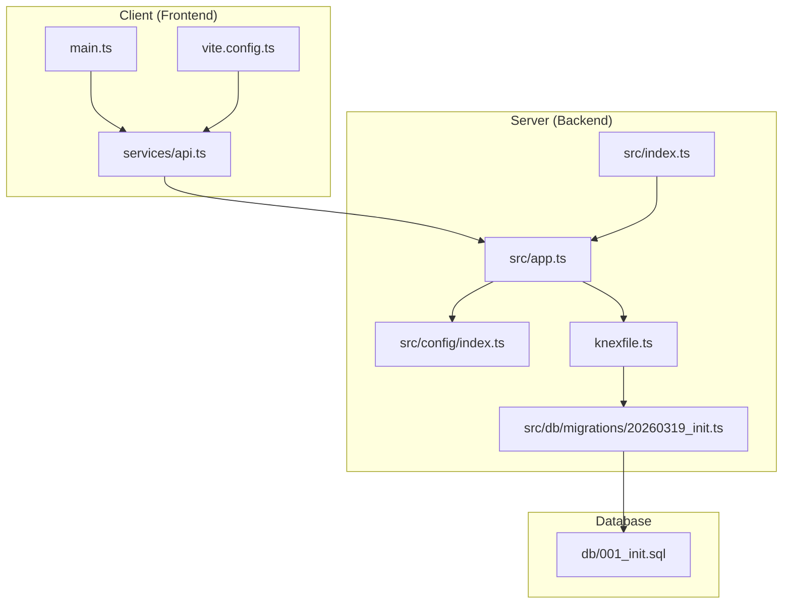
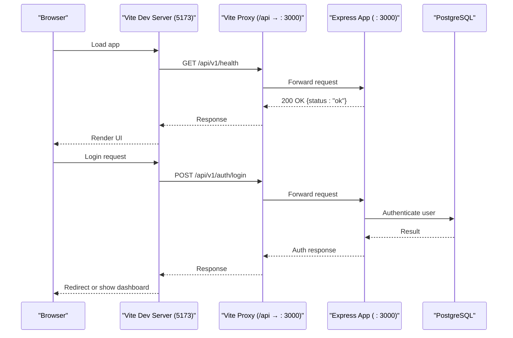
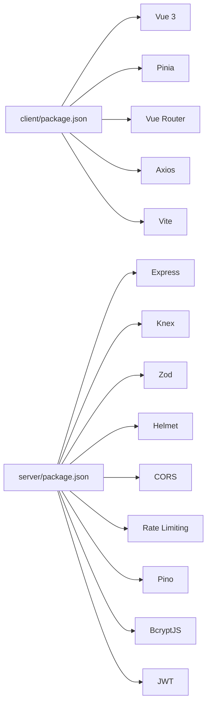

# Getting Started

<cite>
**Referenced Files in This Document**
- [README.md](file://README.md)
- [package.json](file://code/client/package.json)
- [vite.config.ts](file://code/client/vite.config.ts)
- [env.d.ts](file://code/client/env.d.ts)
- [api.ts](file://code/client/src/services/api.ts)
- [main.ts](file://code/client/src/main.ts)
- [package.json](file://code/server/package.json)
- [knexfile.ts](file://code/server/knexfile.ts)
- [index.ts](file://code/server/src/index.ts)
- [app.ts](file://code/server/src/app.ts)
- [index.ts](file://code/server/src/config/index.ts)
- [20260319_init.ts](file://code/server/src/db/migrations/20260319_init.ts)
- [001_init.sql](file://db/001_init.sql)
- [deploy-frontend.yml](file://.github/workflows/deploy-frontend.yml)
</cite>

## Table of Contents
1. [Introduction](#introduction)
2. [Project Structure](#project-structure)
3. [Core Components](#core-components)
4. [Architecture Overview](#architecture-overview)
5. [Detailed Component Analysis](#detailed-component-analysis)
6. [Dependency Analysis](#dependency-analysis)
7. [Performance Considerations](#performance-considerations)
8. [Troubleshooting Guide](#troubleshooting-guide)
9. [Conclusion](#conclusion)
10. [Appendices](#appendices)

## Introduction
This guide walks you through setting up Yule Notion for local development and provides practical steps for both development and production deployment. It covers environment requirements, installing dependencies, configuring the database and environment variables, running the application locally, verifying the setup, and deploying the frontend to GitHub Pages.

## Project Structure
Yule Notion is a full-stack application with:
- Frontend built with Vue 3, TypeScript, and Vite
- Backend built with Express.js, TypeScript, and Knex.js (PostgreSQL)
- Database initialization via migrations and SQL scripts
- Optional Redis for session management (as noted in environment requirements)

**Diagram sources**
- [main.ts:1-54](file://code/client/src/main.ts#L1-L54)
- [api.ts:1-64](file://code/client/src/services/api.ts#L1-L64)
- [vite.config.ts:1-37](file://code/client/vite.config.ts#L1-L37)
- [index.ts:1-77](file://code/server/src/index.ts#L1-L77)
- [app.ts:1-121](file://code/server/src/app.ts#L1-L121)
- [index.ts:1-101](file://code/server/src/config/index.ts#L1-L101)
- [knexfile.ts:1-69](file://code/server/knexfile.ts#L1-L69)
- [20260319_init.ts:1-300](file://code/server/src/db/migrations/20260319_init.ts#L1-L300)
- [001_init.sql:1-254](file://db/001_init.sql#L1-L254)

**Section sources**
- [README.md:23-41](file://README.md#L23-L41)
- [package.json:1-53](file://code/client/package.json#L1-L53)
- [package.json:1-39](file://code/server/package.json#L1-L39)

## Core Components
- Frontend (Vue 3 + TypeScript)
  - Scripts: dev, build, preview
  - Dev proxy: /api → http://localhost:3000
  - Global Axios instance with base URL "/api/v1"
- Backend (Express.js + TypeScript)
  - Scripts: dev, build, start, migrate, migrate:rollback, migrate:make
  - Environment configuration validated via Zod
  - Health endpoint at /api/v1/health
- Database
  - PostgreSQL via Knex migrations
  - Initial schema defined in SQL and mirrored in a TypeScript migration

**Section sources**
- [package.json:6-10](file://code/client/package.json#L6-L10)
- [vite.config.ts:23-32](file://code/client/vite.config.ts#L23-L32)
- [api.ts:15-24](file://code/client/src/services/api.ts#L15-L24)
- [package.json:7-14](file://code/server/package.json#L7-L14)
- [index.ts:18-24](file://code/server/src/index.ts#L18-L24)
- [index.ts:16-36](file://code/server/src/config/index.ts#L16-L36)
- [knexfile.ts:13-23](file://code/server/knexfile.ts#L13-L23)
- [20260319_init.ts:17-38](file://code/server/src/db/migrations/20260319_init.ts#L17-L38)

## Architecture Overview
High-level flow during development:
- Frontend runs on Vite (port 5173) with proxy to backend
- Backend listens on port 3000 by default
- Frontend communicates with backend via /api/v1
- Backend validates environment variables and applies security middleware

**Diagram sources**
- [vite.config.ts:23-32](file://code/client/vite.config.ts#L23-L32)
- [api.ts:15-24](file://code/client/src/services/api.ts#L15-L24)
- [app.ts:102-104](file://code/server/src/app.ts#L102-L104)
- [index.ts:18-24](file://code/server/src/index.ts#L18-L24)

**Section sources**
- [README.md:43-84](file://README.md#L43-L84)
- [vite.config.ts:23-32](file://code/client/vite.config.ts#L23-L32)
- [app.ts:102-104](file://code/server/src/app.ts#L102-L104)

## Detailed Component Analysis

### Environment Requirements
- Node.js v20+
- PostgreSQL 14+ (configured via DATABASE_URL)
- Redis (optional, for session management)

Verification steps:
- Confirm Node.js version meets requirement
- Confirm PostgreSQL is installed and accessible
- Optionally configure Redis if you plan to enable session storage

**Section sources**
- [README.md:45-48](file://README.md#L45-L48)

### Step-by-Step Installation and Setup

#### 1) Clone the repository
- Clone the repository to your machine and open the project root.

#### 2) Install dependencies
- Install frontend dependencies:
  - cd code/client
  - npm install
- Install backend dependencies:
  - cd code/server
  - npm install

**Section sources**
- [README.md:50-60](file://README.md#L50-L60)

#### 3) Configure environment variables
- Backend environment variables are validated and defaulted in configuration:
  - PORT defaults to 3000
  - NODE_ENV defaults to development
  - DATABASE_URL defaults to a local PostgreSQL connection string
  - JWT_SECRET defaults for development but must be at least 32 characters in production
  - ALLOWED_ORIGINS is optional in development and required in production
- Set environment variables as needed for your environment.

Notes:
- Production requires explicit JWT_SECRET and ALLOWED_ORIGINS
- The configuration enforces these rules at runtime

**Section sources**
- [index.ts:16-36](file://code/server/src/config/index.ts#L16-L36)
- [index.ts:52-67](file://code/server/src/config/index.ts#L52-L67)

#### 4) Prepare the database
- Option A: Use Knex migrations (recommended)
  - Run migrations:
    - cd code/server
    - npm run migrate
- Option B: Initialize from SQL script
  - Apply db/001_init.sql to your PostgreSQL database

Verification:
- After migration, confirm tables/users, pages, tags, uploaded_files, and sync_log exist
- Confirm triggers/functions for search vector and updated_at are created

**Section sources**
- [knexfile.ts:13-23](file://code/server/knexfile.ts#L13-L23)
- [20260319_init.ts:17-38](file://code/server/src/db/migrations/20260319_init.ts#L17-L38)
- [001_init.sql:14-158](file://db/001_init.sql#L14-L158)

#### 5) Start the backend
- From code/server:
  - npm run dev
- Verify:
  - Backend logs indicate successful startup on the configured port
  - Health endpoint responds:
    - curl http://localhost:3000/api/v1/health

**Section sources**
- [README.md:69-72](file://README.md#L69-L72)
- [index.ts:18-24](file://code/server/src/index.ts#L18-L24)
- [app.ts:102-104](file://code/server/src/app.ts#L102-L104)

#### 6) Start the frontend
- From code/client:
  - npm run dev
- Access:
  - Open http://localhost:5173 in your browser
- Proxy behavior:
  - Requests prefixed with /api are proxied to backend (http://localhost:3000)

**Section sources**
- [README.md:65-71](file://README.md#L65-L71)
- [vite.config.ts:23-32](file://code/client/vite.config.ts#L23-L32)

#### 7) Verify authentication flow
- The frontend initializes by attempting to fetch current user info if a token exists
- The Axios instance sets Authorization header automatically for requests to /api/v1

**Section sources**
- [main.ts:33-43](file://code/client/src/main.ts#L33-L43)
- [api.ts:30-41](file://code/client/src/services/api.ts#L30-L41)

### Development Environment Configuration
- Frontend
  - Vite dev server port: 5173
  - Proxy: /api → http://localhost:3000
  - Base URL for API client: /api/v1
- Backend
  - Express app registers security headers, CORS, rate limiting, logging, health endpoint, and routes
  - Environment variables validated at startup

**Section sources**
- [vite.config.ts:23-32](file://code/client/vite.config.ts#L23-L32)
- [api.ts:15-24](file://code/client/src/services/api.ts#L15-L24)
- [app.ts:67-120](file://code/server/src/app.ts#L67-L120)
- [index.ts:16-36](file://code/server/src/config/index.ts#L16-L36)

### Production Deployment Scenarios

#### Backend build and start
- Build:
  - cd code/server
  - npm run build
- Start:
  - cd code/server
  - npm run start

Environment variables for production:
- NODE_ENV=production
- PORT (required)
- DATABASE_URL (required)
- JWT_SECRET (required, minimum 32 characters)
- ALLOWED_ORIGINS (required, comma-separated domain list)

Security enforcement:
- Production mode enforces secure configuration for JWT_SECRET and CORS origins

**Section sources**
- [README.md:74-84](file://README.md#L74-L84)
- [package.json:7-14](file://code/server/package.json#L7-L14)
- [index.ts:52-67](file://code/server/src/config/index.ts#L52-L67)

#### Frontend build and hosting
- Build:
  - cd code/client
  - npm run build
- Host the generated static files from code/client/dist
- Example GitHub Pages deployment workflow is provided

**Section sources**
- [README.md:76-84](file://README.md#L76-L84)
- [package.json:7-9](file://code/client/package.json#L7-L9)
- [deploy-frontend.yml:18-55](file://.github/workflows/deploy-frontend.yml#L18-L55)

## Dependency Analysis
- Frontend depends on Vue 3, Pinia, Vue Router, Axios, and Vite
- Backend depends on Express, Knex, Zod, Helmet, CORS, Rate Limiting, Pino, BcryptJS, JWT
- Database layer is managed via Knex migrations and PostgreSQL extensions

**Diagram sources**
- [package.json:11-41](file://code/client/package.json#L11-L41)
- [package.json:15-27](file://code/server/package.json#L15-L27)

**Section sources**
- [package.json:11-51](file://code/client/package.json#L11-L51)
- [package.json:15-37](file://code/server/package.json#L15-L37)

## Performance Considerations
- Database indexing and GIN indexes for JSONB and text search are defined in the migration and SQL script
- Rate limiting middleware protects against abuse
- Logging is optimized per environment (pretty in development, structured in production)

[No sources needed since this section provides general guidance]

## Troubleshooting Guide

Common setup issues and resolutions:
- Node.js version mismatch
  - Ensure Node.js v20+ is installed
- PostgreSQL connection failures
  - Verify DATABASE_URL matches your local/remote PostgreSQL instance
  - Confirm PostgreSQL is running and accessible
- Migration errors
  - Re-run migrations after fixing DATABASE_URL
  - Confirm required PostgreSQL extensions are enabled
- CORS or JWT configuration in production
  - Set ALLOWED_ORIGINS and JWT_SECRET appropriately
  - Production mode enforces these values
- Frontend proxy not working
  - Confirm Vite proxy target matches backend port
  - Ensure backend is running before starting the frontend

Verification checklist:
- Backend health endpoint responds: curl http://localhost:3000/api/v1/health
- Frontend loads without console errors
- Authentication flow completes and persists token

**Section sources**
- [index.ts:52-67](file://code/server/src/config/index.ts#L52-L67)
- [knexfile.ts:13-23](file://code/server/knexfile.ts#L13-L23)
- [20260319_init.ts:18-21](file://code/server/src/db/migrations/20260319_init.ts#L18-L21)
- [vite.config.ts:23-32](file://code/client/vite.config.ts#L23-L32)
- [app.ts:102-104](file://code/server/src/app.ts#L102-L104)

## Conclusion
You now have a complete understanding of how to set up Yule Notion locally, configure environment variables, prepare the database, run both frontend and backend, and deploy the frontend to GitHub Pages. For production, ensure secure environment configuration and use the provided build/start scripts.

## Appendices

### Appendix A: Environment Variables Reference
- PORT: Backend listening port (default 3000)
- NODE_ENV: development | production | test (default development)
- DATABASE_URL: PostgreSQL connection string (default local)
- JWT_SECRET: Secret for signing JWT tokens (required in production, minimum 32 characters)
- ALLOWED_ORIGINS: Comma-separated list of allowed origins (required in production)

**Section sources**
- [index.ts:16-36](file://code/server/src/config/index.ts#L16-L36)
- [index.ts:52-67](file://code/server/src/config/index.ts#L52-L67)

### Appendix B: Database Initialization Options
- Use Knex migrations:
  - cd code/server
  - npm run migrate
- Or apply SQL script manually to PostgreSQL

**Section sources**
- [knexfile.ts:13-23](file://code/server/knexfile.ts#L13-L23)
- [20260319_init.ts:17-38](file://code/server/src/db/migrations/20260319_init.ts#L17-L38)
- [001_init.sql:14-158](file://db/001_init.sql#L14-L158)