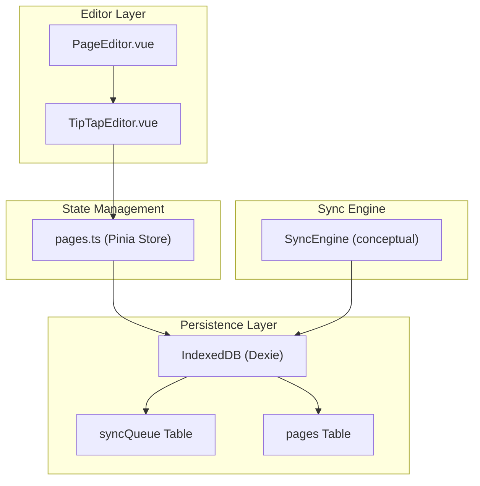
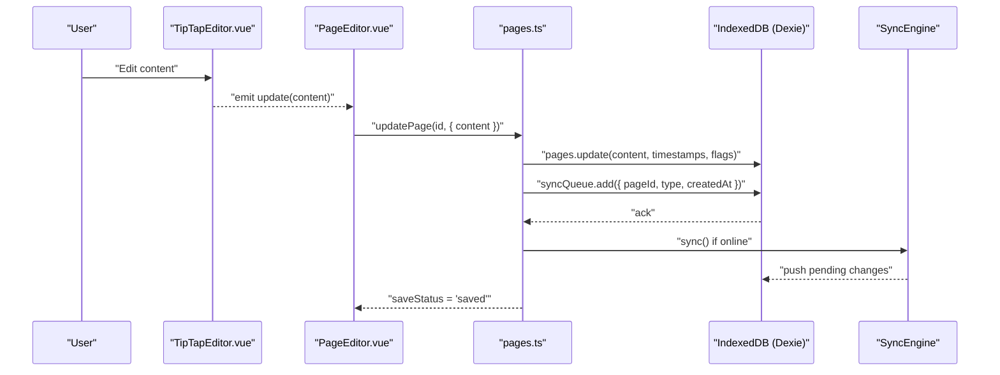
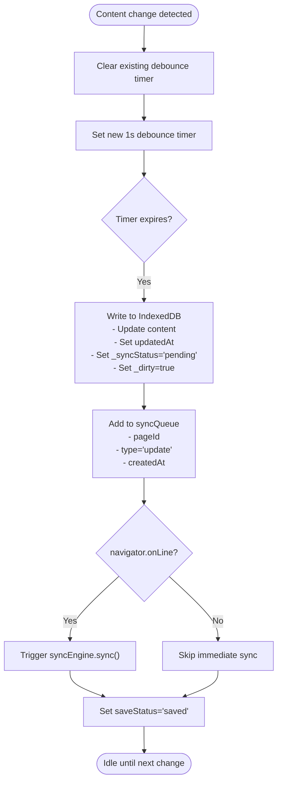
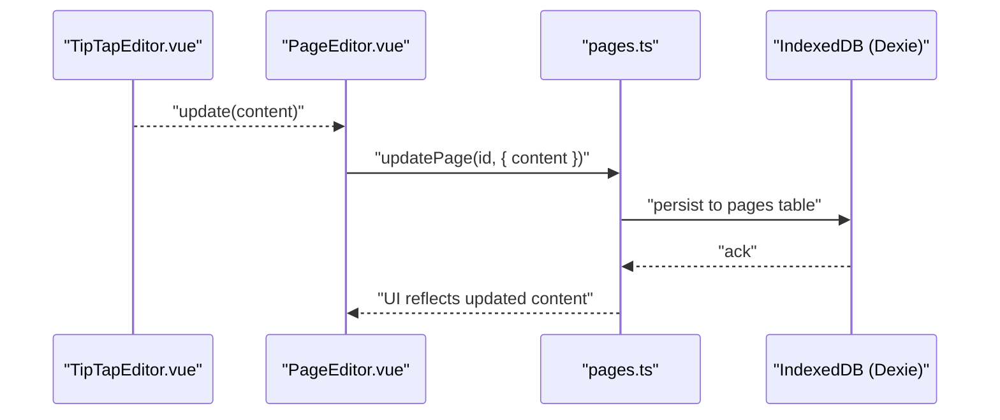
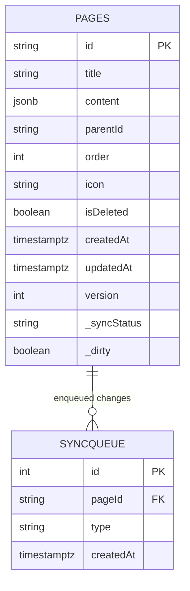
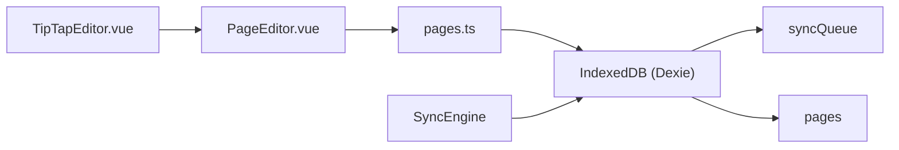

# Auto-Save System

<cite>
**Referenced Files in This Document**
- [ARCHITECTURE.md](file://arch/ARCHITECTURE.md)
- [PageEditor.vue](file://code/client/src/components/editor/PageEditor.vue)
- [TipTapEditor.vue](file://code/client/src/components/editor/TipTapEditor.vue)
- [pages.ts](file://code/client/src/stores/pages.ts)
- [001_init.sql](file://db/001_init.sql)
</cite>

## Table of Contents
1. [Introduction](#introduction)
2. [Project Structure](#project-structure)
3. [Core Components](#core-components)
4. [Architecture Overview](#architecture-overview)
5. [Detailed Component Analysis](#detailed-component-analysis)
6. [Dependency Analysis](#dependency-analysis)
7. [Performance Considerations](#performance-considerations)
8. [Troubleshooting Guide](#troubleshooting-guide)
9. [Conclusion](#conclusion)

## Introduction
This document explains the automatic saving mechanism that enables seamless offline editing. It covers the debounced save implementation with a 1-second delay, optimistic updates, immediate local persistence, IndexedDB integration for instant writes, and the synchronization queue population process. It also documents the management of the internal dirty flag, save status indicators, and user feedback mechanisms. Guidance is included for customizing auto-save behavior, handling edge cases such as rapid typing and memory management, and recovering from save failures. Examples demonstrate how to use the auto-save composable and configure its behavior for different scenarios.

## Project Structure
The auto-save system spans the front-end editor components, the pages store, and the IndexedDB-backed database schema. The architecture integrates TipTap content updates with a debounced watcher that persists immediately to IndexedDB and enqueues a sync operation.

**Diagram sources**
- [PageEditor.vue:10-49](file://code/client/src/components/editor/PageEditor.vue#L10-L49)
- [TipTapEditor.vue:13-46](file://code/client/src/components/editor/TipTapEditor.vue#L13-L46)
- [pages.ts:44-104](file://code/client/src/stores/pages.ts#L44-L104)
- [ARCHITECTURE.md:354-396](file://arch/ARCHITECTURE.md#L354-L396)

**Section sources**
- [PageEditor.vue:10-49](file://code/client/src/components/editor/PageEditor.vue#L10-L49)
- [TipTapEditor.vue:13-46](file://code/client/src/components/editor/TipTapEditor.vue#L13-L46)
- [pages.ts:44-104](file://code/client/src/stores/pages.ts#L44-L104)
- [ARCHITECTURE.md:354-396](file://arch/ARCHITECTURE.md#L354-L396)

## Core Components
- Debounced auto-save composable: Watches content changes and triggers a 1-second delayed save routine that writes to IndexedDB and enqueues a sync operation.
- Optimistic UI updates: The editor updates immediately upon user input while the background save persists to IndexedDB and marks the record as pending.
- IndexedDB integration: Uses Dexie-managed tables for pages and syncQueue to persist content and track pending changes.
- Dirty flag and sync status: Local records carry metadata to indicate pending changes and sync status.
- Save status indicator: A reactive status value reflects the current save state for user feedback.

Key implementation references:
- Auto-save composable and flow: [ARCHITECTURE.md:471-507](file://arch/ARCHITECTURE.md#L471-L507)
- IndexedDB schema and extended fields: [ARCHITECTURE.md:354-396](file://arch/ARCHITECTURE.md#L354-L396)
- Editor-to-store communication: [PageEditor.vue:44-49](file://code/client/src/components/editor/PageEditor.vue#L44-L49), [TipTapEditor.vue:13-46](file://code/client/src/components/editor/TipTapEditor.vue#L13-L46)
- Store update persistence: [pages.ts:98-104](file://code/client/src/stores/pages.ts#L98-L104)

**Section sources**
- [ARCHITECTURE.md:471-507](file://arch/ARCHITECTURE.md#L471-L507)
- [ARCHITECTURE.md:354-396](file://arch/ARCHITECTURE.md#L354-L396)
- [PageEditor.vue:44-49](file://code/client/src/components/editor/PageEditor.vue#L44-L49)
- [TipTapEditor.vue:13-46](file://code/client/src/components/editor/TipTapEditor.vue#L13-L46)
- [pages.ts:98-104](file://code/client/src/stores/pages.ts#L98-L104)

## Architecture Overview
The auto-save pipeline ensures immediate persistence and eventual consistency:
1. Content changes are emitted from the TipTap editor.
2. The PageEditor receives and forwards content updates to the pages store.
3. The store updates the in-memory page and persists to IndexedDB via Dexie.
4. A sync queue entry is added for the page to ensure later synchronization.
5. If online, the sync engine is triggered to reconcile server-side changes and push local updates.
6. The UI displays a save status indicator reflecting the latest state.

**Diagram sources**
- [TipTapEditor.vue:13-46](file://code/client/src/components/editor/TipTapEditor.vue#L13-L46)
- [PageEditor.vue:44-49](file://code/client/src/components/editor/PageEditor.vue#L44-L49)
- [pages.ts:98-104](file://code/client/src/stores/pages.ts#L98-L104)
- [ARCHITECTURE.md:471-507](file://arch/ARCHITECTURE.md#L471-L507)

## Detailed Component Analysis

### Debounced Auto-Save Composable
The composable watches content changes and applies a 1-second debounce before writing to IndexedDB and enqueuing a sync. It sets optimistic flags to mark the record as pending and dirty, and updates the UI save status.

Implementation highlights:
- Debounce timer management: Cancels previous timers and resets on each change.
- Immediate IndexedDB write: Updates content, timestamps, and flags.
- Queue insertion: Adds a sync item with page ID, type, and creation timestamp.
- Online trigger: Invokes the sync engine when the browser reports being online.
- UI feedback: Sets a reactive save status to reflect completion.

Usage example references:
- Composable definition and flow: [ARCHITECTURE.md:471-507](file://arch/ARCHITECTURE.md#L471-L507)

**Diagram sources**
- [ARCHITECTURE.md:471-507](file://arch/ARCHITECTURE.md#L471-L507)

**Section sources**
- [ARCHITECTURE.md:471-507](file://arch/ARCHITECTURE.md#L471-L507)

### Optimistic Updates and Immediate Persistence
Optimistic behavior allows the UI to reflect changes instantly while the background process persists data and coordinates with the sync engine. The pages store updates the in-memory page and persists to IndexedDB, ensuring continuity even during network interruptions.

References:
- Store update action: [pages.ts:98-104](file://code/client/src/stores/pages.ts#L98-L104)
- Editor-to-store update flow: [PageEditor.vue:44-49](file://code/client/src/components/editor/PageEditor.vue#L44-L49)

**Diagram sources**
- [TipTapEditor.vue:13-46](file://code/client/src/components/editor/TipTapEditor.vue#L13-L46)
- [PageEditor.vue:44-49](file://code/client/src/components/editor/PageEditor.vue#L44-L49)
- [pages.ts:98-104](file://code/client/src/stores/pages.ts#L98-L104)

**Section sources**
- [pages.ts:98-104](file://code/client/src/stores/pages.ts#L98-L104)
- [PageEditor.vue:44-49](file://code/client/src/components/editor/PageEditor.vue#L44-L49)

### IndexedDB Integration and Sync Queue Population
The IndexedDB schema supports immediate writes and efficient queuing:
- pages table: Stores page content, metadata, and local-only flags (_syncStatus, _dirty).
- syncQueue table: Records pending changes with pageId, type, and createdAt for later reconciliation.

References:
- IndexedDB schema: [ARCHITECTURE.md:354-396](file://arch/ARCHITECTURE.md#L354-L396)
- Server-side pages table (for comparison): [001_init.sql:36-61](file://db/001_init.sql#L36-L61)

**Diagram sources**
- [ARCHITECTURE.md:354-396](file://arch/ARCHITECTURE.md#L354-L396)
- [001_init.sql:36-61](file://db/001_init.sql#L36-L61)

**Section sources**
- [ARCHITECTURE.md:354-396](file://arch/ARCHITECTURE.md#L354-L396)
- [001_init.sql:36-61](file://db/001_init.sql#L36-L61)

### Dirty Flag Management and Save Status Indicators
Dirty flag and sync status:
- _dirty: Marks whether a page has unsynchronized changes locally.
- _syncStatus: Tracks whether a record is synced, pending, or in conflict.

Save status indicator:
- A reactive variable reflects the current save state for UI feedback.

References:
- Extended page fields: [ARCHITECTURE.md:376-396](file://arch/ARCHITECTURE.md#L376-L396)
- Save status assignment: [ARCHITECTURE.md:502-504](file://arch/ARCHITECTURE.md#L502-L504)

**Section sources**
- [ARCHITECTURE.md:376-396](file://arch/ARCHITECTURE.md#L376-L396)
- [ARCHITECTURE.md:502-504](file://arch/ARCHITECTURE.md#L502-L504)

### Auto-Save Composable Usage and Configuration
Example usage pattern:
- Accept a reactive page identifier and a reactive content object.
- Watch content with deep equality to capture nested changes.
- Apply debounce delay before persisting and enqueuing.

Configuration options (conceptual):
- Debounce duration: Adjust the 1-second delay to balance responsiveness and frequency of writes.
- Online-only sync: Optionally disable immediate sync when offline and rely on network callbacks.
- Optimistic UI: Keep immediate UI updates enabled for smooth editing experience.
- Status indicator: Bind a reactive status to a UI component to show saved/pending/conflict states.

References:
- Composable signature and flow: [ARCHITECTURE.md:471-507](file://arch/ARCHITECTURE.md#L471-L507)

**Section sources**
- [ARCHITECTURE.md:471-507](file://arch/ARCHITECTURE.md#L471-L507)

### Edge Cases and Recovery Strategies
- Rapid typing: The 1-second debounce prevents excessive writes while still capturing frequent edits. The store’s immediate persistence ensures minimal data loss.
- Memory management: Large TipTap JSON content is stored in IndexedDB; avoid holding multiple copies in memory. Use reactive watchers with deep comparison judiciously.
- Save failure recovery: On sync errors, pending items remain in the queue. The sync engine retries on subsequent runs or network restoration. Conflicts are resolved by server precedence with user notifications.

References:
- Sync engine retry and conflict handling: [ARCHITECTURE.md:398-468](file://arch/ARCHITECTURE.md#L398-L468)

**Section sources**
- [ARCHITECTURE.md:398-468](file://arch/ARCHITECTURE.md#L398-L468)

## Dependency Analysis
The auto-save system depends on:
- Editor components emitting content updates.
- The pages store to orchestrate persistence and UI state.
- IndexedDB for immediate, reliable storage.
- The sync engine to reconcile changes with the server.

**Diagram sources**
- [TipTapEditor.vue:13-46](file://code/client/src/components/editor/TipTapEditor.vue#L13-L46)
- [PageEditor.vue:44-49](file://code/client/src/components/editor/PageEditor.vue#L44-L49)
- [pages.ts:44-104](file://code/client/src/stores/pages.ts#L44-L104)
- [ARCHITECTURE.md:354-396](file://arch/ARCHITECTURE.md#L354-L396)

**Section sources**
- [TipTapEditor.vue:13-46](file://code/client/src/components/editor/TipTapEditor.vue#L13-L46)
- [PageEditor.vue:44-49](file://code/client/src/components/editor/PageEditor.vue#L44-L49)
- [pages.ts:44-104](file://code/client/src/stores/pages.ts#L44-L104)
- [ARCHITECTURE.md:354-396](file://arch/ARCHITECTURE.md#L354-L396)

## Performance Considerations
- Debounce tuning: The 1-second delay balances user experience and write frequency. Shorter delays increase IndexedDB writes; longer delays reduce overhead but may increase risk during rapid editing.
- Deep watching: Using deep comparison on large TipTap JSON structures can be expensive. Consider flattening or throttling content updates if needed.
- IndexedDB throughput: IndexedDB operations are fast for typical note sizes. For very large documents, consider chunking or incremental updates.
- UI responsiveness: Keep optimistic UI updates enabled to maintain perceived performance; defer heavy operations to background tasks.

## Troubleshooting Guide
Common issues and resolutions:
- Changes not persisting: Verify that the store’s update action is invoked and that IndexedDB writes succeed. Check for exceptions in the composable’s debounce handler.
- Stuck pending state: Ensure the sync engine runs after network restoration. Confirm that syncQueue entries are processed and removed upon successful push.
- Conflicts: When conflicts occur, the server’s version takes precedence. Implement user notifications and provide a way to review differences.
- Offline scenarios: Confirm that the composable respects navigator.onLine and that the sync engine is triggered when connectivity resumes.

References:
- Sync engine conflict handling and notifications: [ARCHITECTURE.md:457-468](file://arch/ARCHITECTURE.md#L457-L468)

**Section sources**
- [ARCHITECTURE.md:457-468](file://arch/ARCHITECTURE.md#L457-L468)

## Conclusion
The auto-save system delivers a seamless offline editing experience by combining a 1-second debounce, optimistic UI updates, and immediate IndexedDB persistence. The sync queue ensures eventual consistency, while the dirty flag and sync status provide clear user feedback. By tuning debounce intervals, monitoring IndexedDB performance, and leveraging robust sync engine retry and conflict handling, teams can customize the system for diverse workloads and reliability requirements.