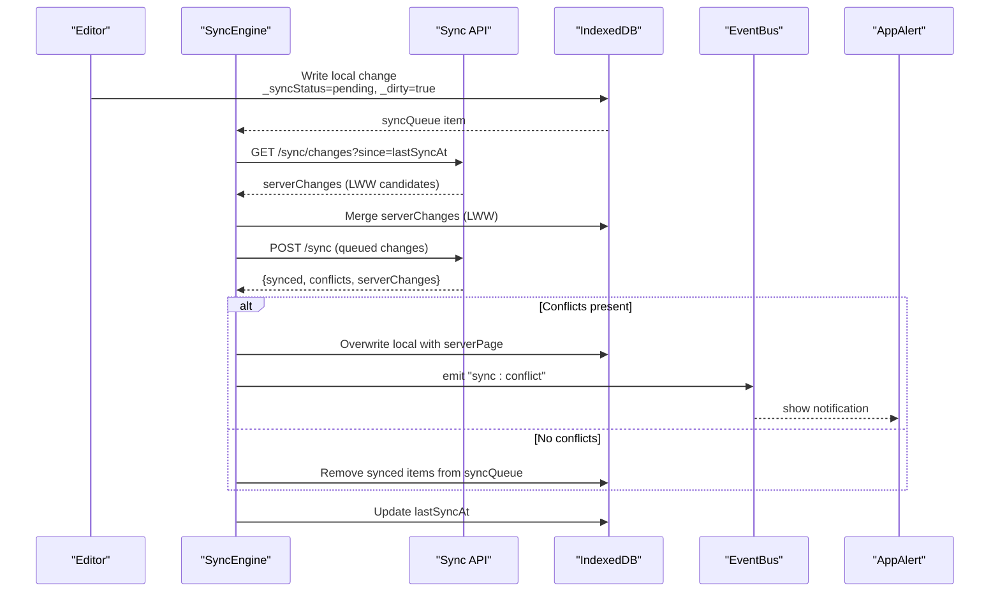
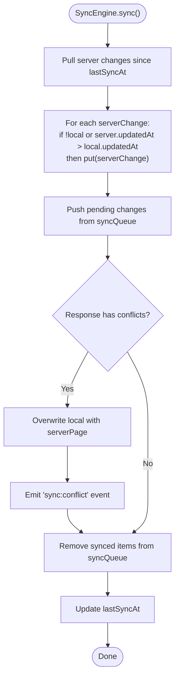
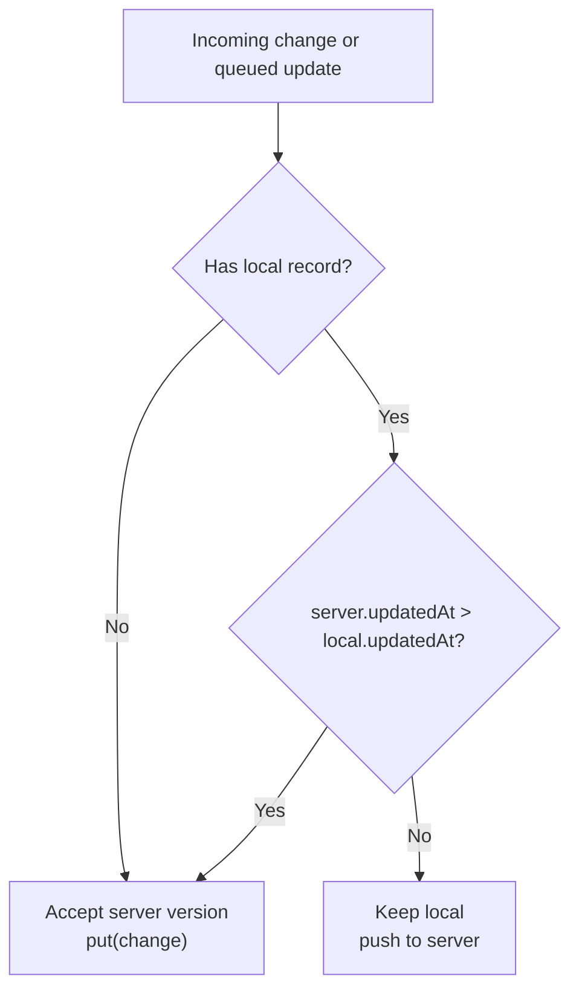
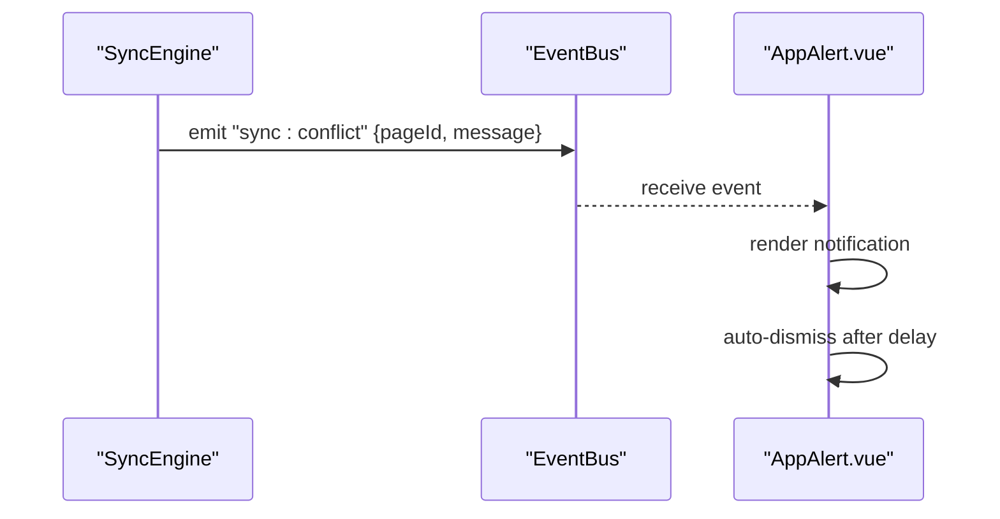
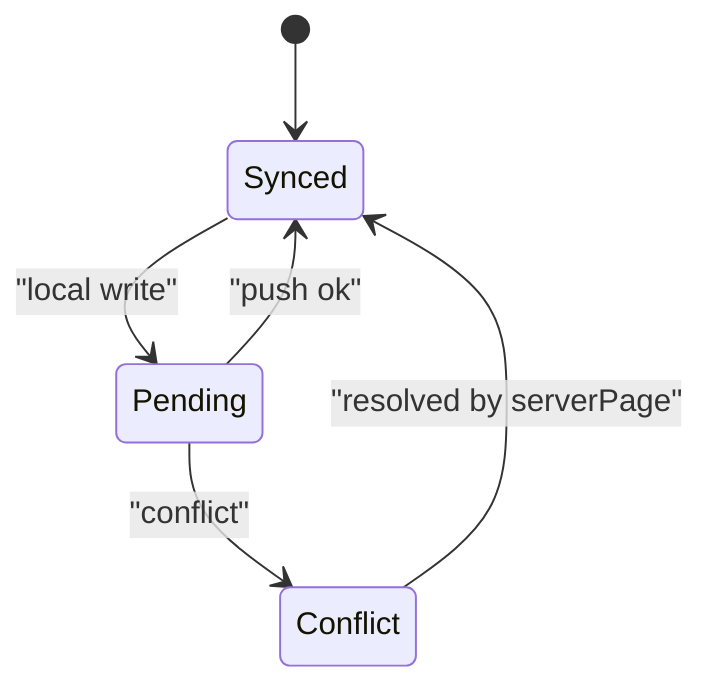
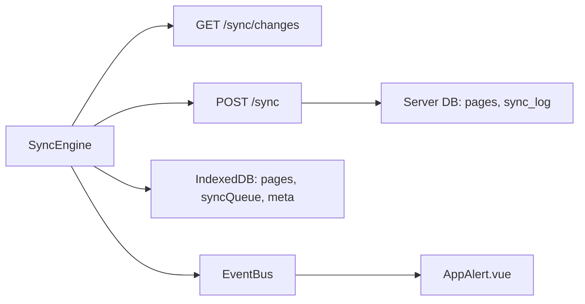

# Conflict Resolution

<cite>
**Referenced Files in This Document**
- [ARCHITECTURE.md](file://arch/ARCHITECTURE.md)
- [API-SPEC.md](file://api-spec/API-SPEC.md)
- [AppAlert.vue](file://code/client/src/components/common/AppAlert.vue)
- [001_init.sql](file://db/001_init.sql)
- [20260319_init.ts](file://code/server/src/db/migrations/20260319_init.ts)
</cite>

## Table of Contents
1. [Introduction](#introduction)
2. [Project Structure](#project-structure)
3. [Core Components](#core-components)
4. [Architecture Overview](#architecture-overview)
5. [Detailed Component Analysis](#detailed-component-analysis)
6. [Dependency Analysis](#dependency-analysis)
7. [Performance Considerations](#performance-considerations)
8. [Troubleshooting Guide](#troubleshooting-guide)
9. [Conclusion](#conclusion)

## Introduction
This document explains the conflict resolution system used by the application’s offline-first synchronization engine. It focuses on the Last-Write-Wins (LWW) strategy, timestamp-based decisions, automatic conflict detection and resolution, user notifications for manual conflicts, fallback mechanisms, and how the _syncStatus field manages local data state during conflicts. It also provides scenario-based examples (concurrent edits, network splits, and data corruption recovery) and troubleshooting guidance.

## Project Structure
The conflict resolution system spans client-side IndexedDB storage, a sync engine, and server-side APIs and persistence. The architecture defines:
- IndexedDB schema with pages, tags, syncQueue, and meta tables
- A sync engine that pulls server changes, applies LWW locally, pushes queued changes, and handles conflicts
- API endpoints for incremental pull and push of changes, returning conflicts and server versions
- A global alert component for user notifications
- Optional audit logging via sync_log for debugging

```mermaid
graph TB
subgraph "Client"
A["IndexedDB<br/>pages, tags, syncQueue, meta"]
B["SyncEngine<br/>LWW merge + conflict handling"]
C["EventBus<br/>sync:conflict"]
D["AppAlert.vue<br/>User notifications"]
end
subgraph "Server"
E["API: GET /sync/changes"]
F["API: POST /sync"]
G["DB: pages, sync_log"]
end
A <- --> B
B --> C
C --> D
B --> E
B --> F
F --> G
```

**Diagram sources**
- [ARCHITECTURE.md:311-469](file://arch/ARCHITECTURE.md#L311-L469)
- [API-SPEC.md:681-782](file://api-spec/API-SPEC.md#L681-L782)
- [AppAlert.vue:1-93](file://code/client/src/components/common/AppAlert.vue#L1-L93)
- [001_init.sql:135-144](file://db/001_init.sql#L135-L144)
- [20260319_init.ts:166-190](file://code/server/src/db/migrations/20260319_init.ts#L166-L190)

**Section sources**
- [ARCHITECTURE.md:311-469](file://arch/ARCHITECTURE.md#L311-L469)
- [API-SPEC.md:681-782](file://api-spec/API-SPEC.md#L681-L782)

## Core Components
- IndexedDB schema and fields:
  - pages: includes updatedAt, version, and extended _syncStatus and _dirty flags for local state
  - syncQueue: records pending changes to push
  - meta: stores sync metadata (e.g., lastSyncAt)
- SyncEngine:
  - Pulls server changes since lastSyncAt
  - Applies LWW merges locally
  - Pushes pending changes and processes conflicts returned by the server
  - Updates lastSyncAt after successful sync
- Conflict handling:
  - On conflicts, the server returns serverPage; the client overwrites local pages with the server version and emits a sync:conflict event for UI notification
- Notification:
  - AppAlert.vue displays persistent messages; the sync:conflict event can feed it to inform users of automatic conflict resolution
- Audit logging:
  - sync_log captures push/pull actions, versions, conflict flags, and resolutions for debugging

**Section sources**
- [ARCHITECTURE.md:354-396](file://arch/ARCHITECTURE.md#L354-L396)
- [ARCHITECTURE.md:398-469](file://arch/ARCHITECTURE.md#L398-L469)
- [API-SPEC.md:728-771](file://api-spec/API-SPEC.md#L728-L771)
- [AppAlert.vue:1-93](file://code/client/src/components/common/AppAlert.vue#L1-L93)
- [001_init.sql:135-144](file://db/001_init.sql#L135-L144)
- [20260319_init.ts:166-190](file://code/server/src/db/migrations/20260319_init.ts#L166-L190)

## Architecture Overview
The system uses incremental timestamp-based synchronization with LWW conflict resolution:



**Diagram sources**
- [ARCHITECTURE.md:398-469](file://arch/ARCHITECTURE.md#L398-L469)
- [API-SPEC.md:681-782](file://api-spec/API-SPEC.md#L681-L782)
- [AppAlert.vue:1-93](file://code/client/src/components/common/AppAlert.vue#L1-L93)

## Detailed Component Analysis

### SyncEngine: LWW Merge and Conflict Handling
- Pull phase:
  - Fetches serverChanges since lastSyncAt
  - Merges each change into pages if missing or newer (updatedAt comparison)
- Push phase:
  - Sends pending changes from syncQueue
  - Receives response with synced pageIds and conflicts
- Conflict handling:
  - Overwrites local pages with serverPage
  - Emits a sync:conflict event with pageId and message
- Queue cleanup:
  - Removes synced items from syncQueue
- Timestamp maintenance:
  - Updates lastSyncAt after successful sync



**Diagram sources**
- [ARCHITECTURE.md:398-469](file://arch/ARCHITECTURE.md#L398-L469)

**Section sources**
- [ARCHITECTURE.md:398-469](file://arch/ARCHITECTURE.md#L398-L469)

### Conflict Resolution Rules and Timestamp-Based Decisions
- LWW rule:
  - Compare localUpdatedAt vs server updatedAt
  - Keep the later timestamp; server wins ties
- Conflict payload:
  - Server returns conflicts with pageId, localVersion, serverVersion, resolution, and serverPage
- Resolution outcome:
  - Client replaces local page with serverPage
  - UI receives a sync:conflict event to notify the user



**Diagram sources**
- [ARCHITECTURE.md:422-430](file://arch/ARCHITECTURE.md#L422-L430)
- [API-SPEC.md:767-771](file://api-spec/API-SPEC.md#L767-L771)

**Section sources**
- [API-SPEC.md:728-771](file://api-spec/API-SPEC.md#L728-L771)
- [ARCHITECTURE.md:422-430](file://arch/ARCHITECTURE.md#L422-L430)

### User Notification System for Conflicts
- Event emission:
  - On conflict, SyncEngine emits a sync:conflict event containing pageId and a message
- UI consumption:
  - AppAlert.vue listens to events and displays persistent notifications
  - Notifications auto-dismiss after a delay



**Diagram sources**
- [ARCHITECTURE.md:457-467](file://arch/ARCHITECTURE.md#L457-L467)
- [AppAlert.vue:1-93](file://code/client/src/components/common/AppAlert.vue#L1-L93)

**Section sources**
- [ARCHITECTURE.md:457-467](file://arch/ARCHITECTURE.md#L457-L467)
- [AppAlert.vue:1-93](file://code/client/src/components/common/AppAlert.vue#L1-L93)

### _syncStatus Field Management and Local Data State
- Fields in LocalPage:
  - _syncStatus: 'synced' | 'pending' | 'conflict'
  - _dirty: indicates unsynced changes
- Typical lifecycle:
  - Auto-save writes to IndexedDB, sets _syncStatus='pending' and _dirty=true
  - After successful push without conflicts, _syncStatus transitions to 'synced'
  - On conflicts, _syncStatus remains 'conflict' until resolved (overwritten by serverPage)
- syncQueue:
  - Stores pending changes; cleared after successful push



**Diagram sources**
- [ARCHITECTURE.md:376-396](file://arch/ARCHITECTURE.md#L376-L396)
- [ARCHITECTURE.md:471-507](file://arch/ARCHITECTURE.md#L471-L507)

**Section sources**
- [ARCHITECTURE.md:376-396](file://arch/ARCHITECTURE.md#L376-L396)
- [ARCHITECTURE.md:471-507](file://arch/ARCHITECTURE.md#L471-L507)

### Audit Logging for Debugging and Recovery
- sync_log table captures:
  - sync_type: push or pull
  - action: create, update, delete
  - client_version and server_version
  - conflict flag and resolution
  - ip_address and user_agent
- Useful for diagnosing edge cases, replaying sequences, and validating LWW decisions

**Section sources**
- [001_init.sql:135-144](file://db/001_init.sql#L135-L144)
- [20260319_init.ts:166-190](file://code/server/src/db/migrations/20260319_init.ts#L166-L190)

## Dependency Analysis
- Client-to-server dependencies:
  - SyncEngine depends on GET /sync/changes and POST /sync
  - POST /sync returns conflicts and serverVersions used by SyncEngine
- Client-side dependencies:
  - IndexedDB schema (pages, syncQueue, meta) supports LWW merging and queue management
  - EventBus and AppAlert.vue provide user-visible feedback
- Server-side dependencies:
  - sync_log supports auditing and recovery diagnostics



**Diagram sources**
- [ARCHITECTURE.md:398-469](file://arch/ARCHITECTURE.md#L398-L469)
- [API-SPEC.md:681-782](file://api-spec/API-SPEC.md#L681-L782)
- [AppAlert.vue:1-93](file://code/client/src/components/common/AppAlert.vue#L1-L93)
- [001_init.sql:135-144](file://db/001_init.sql#L135-L144)

**Section sources**
- [ARCHITECTURE.md:398-469](file://arch/ARCHITECTURE.md#L398-L469)
- [API-SPEC.md:681-782](file://api-spec/API-SPEC.md#L681-L782)

## Performance Considerations
- LWW minimizes conflict resolution overhead by avoiding complex merge algorithms
- IndexedDB operations are optimized by targeted updates and bulk deletes for syncQueue
- Incremental sync reduces network and compute costs by limiting transfers to recent changes
- Consider tuning sync frequency and debounce intervals for auto-save to balance responsiveness and throughput

## Troubleshooting Guide

### Scenario: Concurrent Edits on Multiple Devices
- Symptoms:
  - Users see “This page has service updates” notifications after sync
  - Conflicts array returned by POST /sync contains entries
- Root cause:
  - Different devices edited the same page around the same time
- Resolution steps:
  - Verify server updatedAt vs local updatedAt in the conflict payload
  - Confirm that SyncEngine applied serverPage to local pages
  - Check _syncStatus transitions to synced after successful sync
- Prevention:
  - Encourage users to avoid simultaneous edits to the same page
  - Use the notification to prompt awareness of shared editing

**Section sources**
- [API-SPEC.md:728-771](file://api-spec/API-SPEC.md#L728-L771)
- [ARCHITECTURE.md:457-467](file://arch/ARCHITECTURE.md#L457-L467)

### Scenario: Network Split During Sync
- Symptoms:
  - Sync fails mid-push or pull
  - Some changes remain in syncQueue
  - _syncStatus stays pending
- Root cause:
  - Temporary connectivity loss interrupted the sync cycle
- Resolution steps:
  - On network recovery, SyncEngine.onOnline triggers a retry
  - Ensure lastSyncAt is updated only after successful completion
  - Review sync_log for failed push/pull entries
- Prevention:
  - Keep syncQueue small by syncing promptly
  - Monitor network status and retry policies

**Section sources**
- [ARCHITECTURE.md:412-455](file://arch/ARCHITECTURE.md#L412-L455)
- [001_init.sql:135-144](file://db/001_init.sql#L135-L144)

### Scenario: Data Corruption Recovery
- Symptoms:
  - Inconsistent content or missing fields in pages
  - Conflicts persist or LWW appears incorrect
- Root cause:
  - Storage anomalies or unexpected data states
- Resolution steps:
  - Inspect sync_log for mismatched versions and resolutions
  - Re-fetch serverChanges since a known good lastSyncAt
  - Manually overwrite local pages with serverPage if necessary
  - Clear and rebuild syncQueue for affected pageIds
- Prevention:
  - Regularly back up IndexedDB and monitor _dirty/_syncStatus
  - Use sync_log to detect and isolate problematic operations

**Section sources**
- [001_init.sql:135-144](file://db/001_init.sql#L135-L144)
- [20260319_init.ts:166-190](file://code/server/src/db/migrations/20260319_init.ts#L166-L190)

### Manual Intervention Procedures
- Trigger a forced sync:
  - Ensure online status and call SyncEngine.sync() if needed
- Inspect current state:
  - Check pages._syncStatus and _dirty flags
  - Review syncQueue contents for pending changes
- Override local state (advanced):
  - Replace local page with serverPage from conflict payload
  - Update _syncStatus to synced and clear _dirty
- Notify user:
  - Emit a custom sync:conflict event with a tailored message
  - Display via AppAlert.vue

**Section sources**
- [ARCHITECTURE.md:457-467](file://arch/ARCHITECTURE.md#L457-L467)
- [AppAlert.vue:1-93](file://code/client/src/components/common/AppAlert.vue#L1-L93)

## Conclusion
The conflict resolution system employs a pragmatic LWW strategy with timestamp-based decisions, automated conflict handling, and user-visible notifications. It maintains local state integrity via _syncStatus and _dirty flags, leverages incremental sync for efficiency, and provides optional audit logs for recovery and debugging. By following the troubleshooting procedures and understanding the scenarios outlined, teams can maintain reliable synchronization across devices and environments.