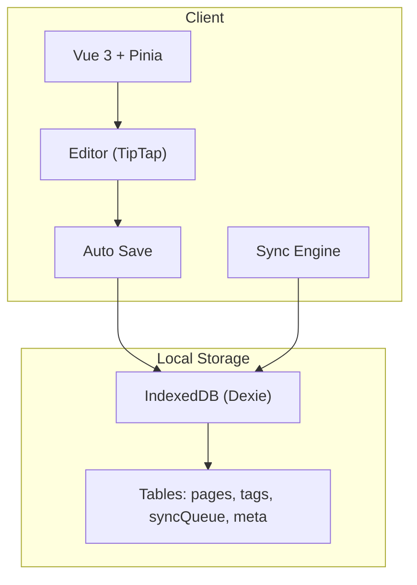
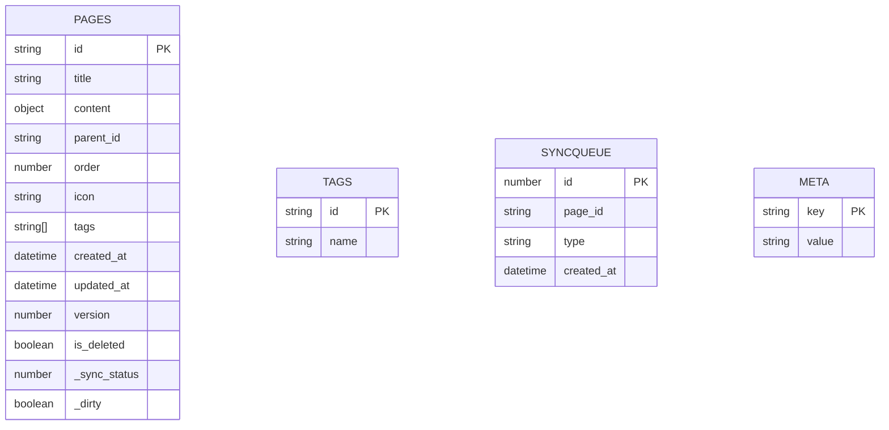
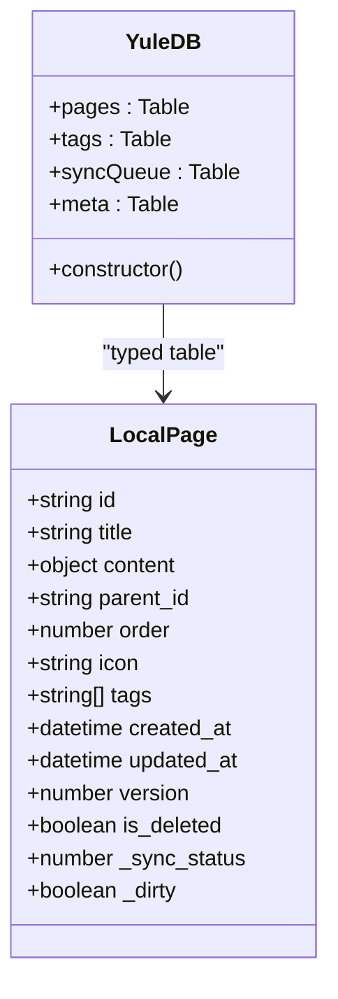
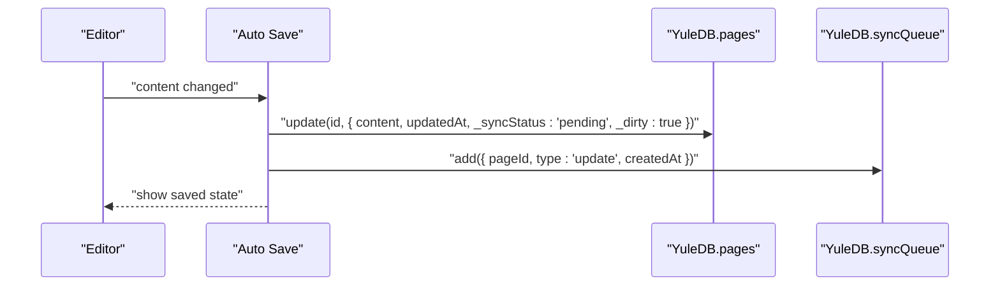
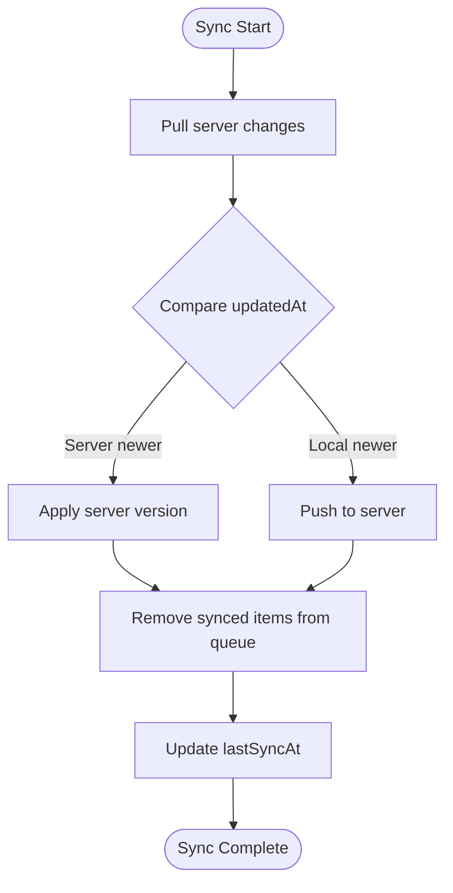
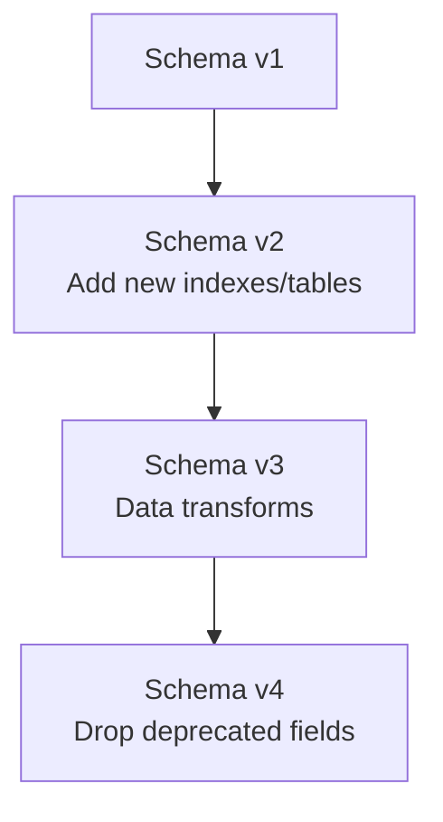
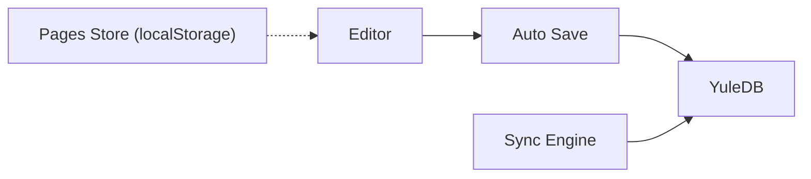

# Local Storage Layer

<cite>
**Referenced Files in This Document**
- [ARCHITECTURE.md](file://arch/ARCHITECTURE.md)
- [pages.ts](file://code/client/src/stores/pages.ts)
- [index.ts](file://code/client/src/types/index.ts)
</cite>

## Table of Contents
1. [Introduction](#introduction)
2. [Project Structure](#project-structure)
3. [Core Components](#core-components)
4. [Architecture Overview](#architecture-overview)
5. [Detailed Component Analysis](#detailed-component-analysis)
6. [Dependency Analysis](#dependency-analysis)
7. [Performance Considerations](#performance-considerations)
8. [Troubleshooting Guide](#troubleshooting-guide)
9. [Conclusion](#conclusion)

## Introduction
This document explains the local storage layer built on IndexedDB and Dexie.js. It covers the database schema design for pages, tags, syncQueue, and metadata; the Dexie database class configuration and indexing strategies; the LocalPage interface including shared fields and local-only extensions; and practical patterns for CRUD operations, transactions, and data persistence. It also addresses database versioning, migration strategies, and data integrity mechanisms, with code examples mapped to the repository’s architecture documentation.

## Project Structure
The local storage layer is part of the client-side architecture and integrates with the editor and sync engine. The relevant parts of the project structure include:
- Client-side stores and types
- Architecture documentation that defines the IndexedDB schema and Dexie configuration
- Sync engine and auto-save logic that drive IndexedDB writes and queue management

**Section sources**
- [ARCHITECTURE.md:354-374](file://arch/ARCHITECTURE.md#L354-L374)
- [ARCHITECTURE.md:471-507](file://arch/ARCHITECTURE.md#L471-L507)

## Core Components
- Dexie database class (YuleDB) with typed tables for pages, tags, syncQueue, and meta
- LocalPage interface with shared fields plus local-only flags for synchronization and dirty state
- Auto-save composable that writes to IndexedDB and enqueues sync operations
- Sync engine orchestrating pull/push of changes with conflict resolution

Key implementation references:
- Dexie class and table definitions: [ARCHITECTURE.md:358-373](file://arch/ARCHITECTURE.md#L358-L373)
- LocalPage extension fields: [ARCHITECTURE.md:378-396](file://arch/ARCHITECTURE.md#L378-L396)
- Auto-save flow (write to IndexedDB and enqueue): [ARCHITECTURE.md:475-506](file://arch/ARCHITECTURE.md#L475-L506)
- Sync engine core logic: [ARCHITECTURE.md:401-469](file://arch/ARCHITECTURE.md#L401-L469)

**Section sources**
- [ARCHITECTURE.md:358-396](file://arch/ARCHITECTURE.md#L358-L396)
- [ARCHITECTURE.md:401-506](file://arch/ARCHITECTURE.md#L401-L506)

## Architecture Overview
The local storage layer uses IndexedDB via Dexie.js. The schema includes:
- pages: stores note content and metadata, with composite indexes for efficient queries
- tags: tag metadata
- syncQueue: pending changes to be synchronized with the server
- meta: key-value store for lightweight metadata (e.g., last sync timestamp)

**Diagram sources**
- [ARCHITECTURE.md:358-373](file://arch/ARCHITECTURE.md#L358-L373)
- [ARCHITECTURE.md:378-396](file://arch/ARCHITECTURE.md#L378-L396)

**Section sources**
- [ARCHITECTURE.md:358-373](file://arch/ARCHITECTURE.md#L358-L373)
- [ARCHITECTURE.md:378-396](file://arch/ARCHITECTURE.md#L378-L396)

## Detailed Component Analysis

### Dexie Database Class and Schema
- Database class extends Dexie and exposes typed tables for pages, tags, syncQueue, and meta
- Version 1 schema defines primary keys and indexes for efficient querying and updates
- Indexes:
  - pages: id, parentId, updatedAt, title
  - tags: id, name
  - syncQueue: ++id (auto-increment), pageId, type, createdAt
  - meta: key

**Diagram sources**
- [ARCHITECTURE.md:358-373](file://arch/ARCHITECTURE.md#L358-L373)
- [ARCHITECTURE.md:378-396](file://arch/ARCHITECTURE.md#L378-L396)

**Section sources**
- [ARCHITECTURE.md:358-373](file://arch/ARCHITECTURE.md#L358-L373)
- [ARCHITECTURE.md:378-396](file://arch/ARCHITECTURE.md#L378-L396)

### LocalPage Interface and Local Extensions
- Shared fields mirror server-side Page model (id, title, content as TipTap JSON, parentId, order, icon, timestamps)
- Local-only extensions:
  - _syncStatus: tracks synchronization state
  - _dirty: marks whether the record has pending changes

These fields enable offline-first editing and reliable sync reconciliation.

**Section sources**
- [ARCHITECTURE.md:378-396](file://arch/ARCHITECTURE.md#L378-L396)

### CRUD Operations and Persistence Patterns
- Writing and updating:
  - Auto-save writes to IndexedDB and sets local flags, then enqueues a sync operation
  - Typical write pattern updates content, timestamps, and flags, and adds a queue item
- Reading:
  - Queries leverage indexes (e.g., by id, parentId, updatedAt) for fast retrieval
- Deleting:
  - Soft deletion flag is supported in the schema; deletion is represented by isDeleted and version bump

**Diagram sources**
- [ARCHITECTURE.md:475-506](file://arch/ARCHITECTURE.md#L475-L506)

**Section sources**
- [ARCHITECTURE.md:475-506](file://arch/ARCHITECTURE.md#L475-L506)

### Transaction Handling and Data Integrity
- Transactions:
  - Use Dexie’s transaction APIs to group reads/writes ensuring atomicity across tables
  - Recommended for batch operations (e.g., applying server changes or bulk deletes)
- Data integrity:
  - Timestamp-based Last-Write-Wins (LWW) resolves conflicts during sync
  - Queue ensures no change is lost across browser restarts
  - Soft delete and version fields support safe edits and audits

**Diagram sources**
- [ARCHITECTURE.md:401-469](file://arch/ARCHITECTURE.md#L401-L469)

**Section sources**
- [ARCHITECTURE.md:401-469](file://arch/ARCHITECTURE.md#L401-L469)

### Database Versioning and Migration Strategies
- Version 1 schema is defined with explicit stores and indexes
- Migration strategy:
  - Add new version blocks with this.version(N).stores(...) to evolve indexes and add tables
  - Use upgrade callbacks to transform data when schema changes
  - Preserve backward compatibility by keeping old indexes and fields during transitions

**Diagram sources**
- [ARCHITECTURE.md:366-372](file://arch/ARCHITECTURE.md#L366-L372)

**Section sources**
- [ARCHITECTURE.md:366-372](file://arch/ARCHITECTURE.md#L366-L372)

### Querying, Updating, and Managing Local Data
- Efficient querying:
  - Use primary key lookups for single records
  - Use compound indexes (e.g., pages by parentId and updatedAt) for tree navigation and sorting
- Bulk operations:
  - bulkPut/bulkAdd for fast inserts/updates
  - bulkDelete for cleanup tasks
- Queue management:
  - Iterate and process syncQueue items in batches
  - Clean up after successful sync

**Section sources**
- [ARCHITECTURE.md:358-373](file://arch/ARCHITECTURE.md#L358-L373)
- [ARCHITECTURE.md:401-469](file://arch/ARCHITECTURE.md#L401-L469)

## Dependency Analysis
- The editor and auto-save depend on YuleDB for immediate persistence
- The sync engine depends on YuleDB for reading pending changes and writing merged results
- The pages store (localStorage-based) is separate from the IndexedDB layer and is used for quick UI state; the IndexedDB layer is authoritative for offline editing and sync

**Diagram sources**
- [ARCHITECTURE.md:475-506](file://arch/ARCHITECTURE.md#L475-L506)
- [ARCHITECTURE.md:401-469](file://arch/ARCHITECTURE.md#L401-L469)
- [pages.ts:130-146](file://code/client/src/stores/pages.ts#L130-L146)

**Section sources**
- [pages.ts:130-146](file://code/client/src/stores/pages.ts#L130-L146)
- [ARCHITECTURE.md:475-506](file://arch/ARCHITECTURE.md#L475-L506)
- [ARCHITECTURE.md:401-469](file://arch/ARCHITECTURE.md#L401-L469)

## Performance Considerations
- IndexedDB performance:
  - Use appropriate indexes to avoid full scans (e.g., parentId, updatedAt on pages)
  - Batch operations reduce transaction overhead
- Auto-save throttling:
  - Debounce writes to minimize IndexedDB churn
- Queue size:
  - Keep syncQueue bounded; process in small batches to prevent long-running transactions
- Memory footprint:
  - Avoid loading entire pages into memory; fetch only what is needed

## Troubleshooting Guide
- IndexedDB quota exceeded:
  - Monitor storage usage; clear old entries or implement pagination
- Stale data after sync:
  - Verify updatedAt comparisons and LWW logic
- Conflicts:
  - Ensure server-wins merge and user notifications are triggered
- Queue backlog:
  - Implement retry with exponential backoff and periodic cleanup

**Section sources**
- [ARCHITECTURE.md:401-469](file://arch/ARCHITECTURE.md#L401-L469)

## Conclusion
The local storage layer leverages IndexedDB via Dexie.js to provide robust offline-first editing and reliable synchronization. The schema and typed tables enable precise data modeling, while the sync engine and auto-save flow ensure data integrity and timely synchronization. By following the outlined patterns for CRUD, transactions, migrations, and performance, the system supports scalable and maintainable local persistence.